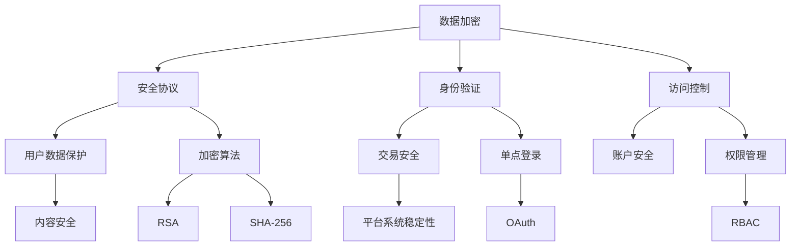
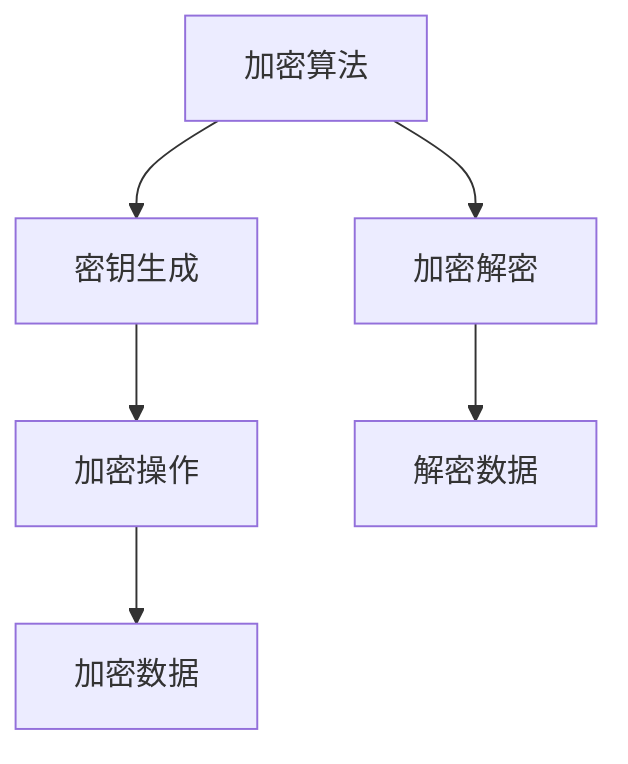
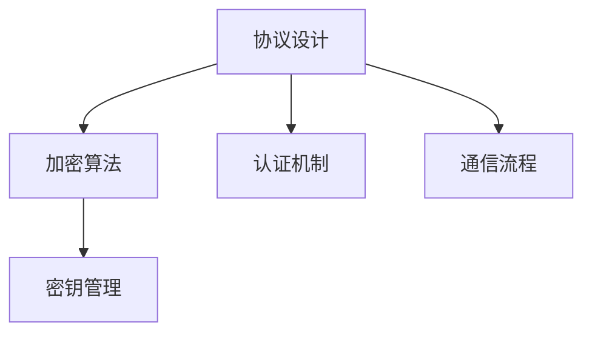
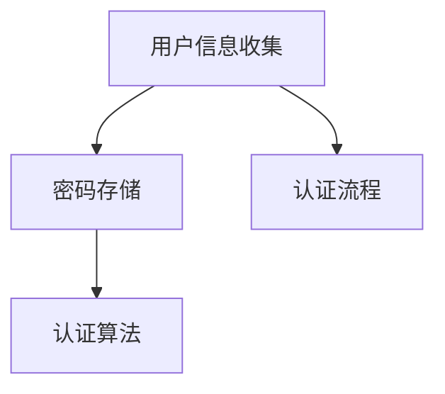

                 

### 1. 背景介绍

在互联网快速发展的时代，知识付费平台作为一种新型的教育服务模式，正逐渐成为人们获取知识和技能的重要途径。随着用户量的不断增加，知识付费平台面临着日益严峻的安全挑战。一方面，平台需要确保用户数据的安全性和隐私性，避免数据泄露造成的不良影响；另一方面，平台还需防止恶意攻击和非法入侵，保障平台的正常运行。因此，研究并实施有效的安全防护措施对于知识付费平台的长期发展至关重要。

知识付费平台的安全防护问题主要包括以下几个方面：用户数据保护、交易安全、账户安全、内容安全以及平台系统的稳定性。本文将围绕这些核心问题，深入探讨知识付费平台的安全防护措施。

### 2. 核心概念与联系

在讨论知识付费平台的安全防护措施之前，我们需要先明确几个核心概念，包括数据加密、安全协议、身份验证和访问控制等。以下是一个用Mermaid绘制的流程图，展示了这些核心概念及其相互关系。



#### 2.1 数据加密

数据加密是保护数据安全的基本手段，通过将明文数据转换为密文，确保数据在传输和存储过程中的安全。常见的加密算法包括RSA和SHA-256。

- **RSA（Rivest-Shamir-Adleman）**：是一种非对称加密算法，主要用于公钥加密和数字签名。
- **SHA-256（Secure Hash Algorithm 256-bit）**：是一种哈希算法，用于生成数据的固定长度的散列值，确保数据完整性。

#### 2.2 安全协议

安全协议是在网络通信中确保数据安全传输的协议，如TLS（Transport Layer Security）和SSL（Secure Socket Layer）。这些协议提供了加密通信通道，防止数据在传输过程中被窃听或篡改。

#### 2.3 身份验证

身份验证是确保用户身份真实性的过程，常用的方法包括密码验证、双因素验证和单点登录（SSO）。

- **密码验证**：用户通过输入密码验证身份。
- **双因素验证（2FA）**：用户需要提供两种验证信息，如密码和手机验证码。
- **单点登录（SSO）**：用户只需登录一次，即可访问多个系统。

#### 2.4 访问控制

访问控制是限制用户访问特定资源的过程，常用的方法包括权限管理和角色权限控制。

- **权限管理（RBAC，Role-Based Access Control）**：根据用户角色分配权限。
- **角色权限控制**：用户只能访问与其角色相关的资源。

### 3. 核心算法原理 & 具体操作步骤

#### 3.1 算法原理概述

在知识付费平台的安全防护中，核心算法主要包括数据加密算法、安全协议和身份验证算法。

- **数据加密算法**：如RSA和SHA-256。
- **安全协议**：如TLS和SSL。
- **身份验证算法**：如密码验证和双因素验证。

#### 3.2 算法步骤详解

##### 3.2.1 数据加密步骤

1. **选择加密算法**：根据数据安全和性能需求选择合适的加密算法。
2. **生成密钥对**：对于非对称加密算法如RSA，需要生成公钥和私钥。
3. **加密数据**：使用公钥或私钥对数据进行加密。
4. **存储加密数据**：将加密后的数据存储在安全的地方。

##### 3.2.2 安全协议步骤

1. **建立连接**：客户端与服务器建立安全连接。
2. **协商加密参数**：客户端与服务器协商加密算法、密钥交换方式和会话密钥。
3. **加密通信**：客户端与服务器通过加密通道传输数据。

##### 3.2.3 身份验证步骤

1. **用户输入密码**：用户输入密码进行验证。
2. **比对密码**：将用户输入的密码与数据库中的密码进行比对。
3. **验证通过**：如果密码正确，则用户身份验证通过。

#### 3.3 算法优缺点

- **数据加密算法**：优点是数据安全，缺点是加密和解密过程复杂，对计算资源要求较高。
- **安全协议**：优点是提供加密通信通道，缺点是实现成本较高。
- **身份验证算法**：优点是简单有效，缺点是安全性相对较低。

#### 3.4 算法应用领域

- **数据加密算法**：广泛应用于数据传输和存储的安全保护。
- **安全协议**：主要用于网络通信的安全保护。
- **身份验证算法**：广泛应用于各类系统的用户身份验证。

### 4. 数学模型和公式 & 详细讲解 & 举例说明

#### 4.1 数学模型构建

在知识付费平台的安全防护中，常用的数学模型包括加密模型、安全协议模型和身份验证模型。

##### 4.1.1 加密模型

加密模型通常由加密算法、密钥生成和管理、加密操作和加密解密过程组成。以下是一个简单的加密模型示意图。



##### 4.1.2 安全协议模型

安全协议模型通常包括协议设计、加密算法选择、密钥管理、认证机制和通信流程。以下是一个简单的安全协议模型示意图。



##### 4.1.3 身份验证模型

身份验证模型通常包括用户身份信息收集、密码存储、认证算法和认证流程。以下是一个简单的身份验证模型示意图。



#### 4.2 公式推导过程

在加密模型中，常用的公式包括加密公式和解密公式。以下是一个简单的加密和解密公式推导过程。

$$
C = E_K(M)
$$

$$
M = D_K(C)
$$

其中，$C$ 表示加密后的数据，$M$ 表示原始数据，$K$ 表示密钥，$E$ 和 $D$ 分别表示加密和解密操作。

#### 4.3 案例分析与讲解

以下是一个关于知识付费平台用户数据加密的案例分析。

##### 4.3.1 案例背景

某知识付费平台需要确保用户个人信息（如姓名、邮箱、电话等）在存储和传输过程中的安全。平台决定采用RSA加密算法对用户数据进行加密。

##### 4.3.2 案例步骤

1. **生成密钥对**：平台生成一对RSA密钥（公钥和私钥）。
2. **加密数据**：用户注册时，平台使用公钥对用户个人信息进行加密。
3. **存储加密数据**：平台将加密后的用户数据存储在数据库中。
4. **解密数据**：用户登录时，平台使用私钥对加密数据进行解密，以验证用户身份。

##### 4.3.3 案例分析

1. **加密过程**：

$$
C = E_{K_{pub}}(M)
$$

其中，$K_{pub}$ 表示公钥。

2. **解密过程**：

$$
M = D_{K_{priv}}(C)
$$

其中，$K_{priv}$ 表示私钥。

通过RSA加密算法，平台能够有效保护用户个人信息的安全。但是，RSA加密算法的计算复杂度较高，可能会对平台性能产生一定影响。因此，在实际应用中，平台可以根据具体需求选择合适的加密算法和加密策略。

### 5. 项目实践：代码实例和详细解释说明

在本文的最后一部分，我们将通过一个具体的代码实例，详细解释知识付费平台中用户数据加密的实现过程。

#### 5.1 开发环境搭建

为了演示用户数据加密，我们使用Python编程语言，并结合PyCryptodome库来实现RSA加密算法。首先，确保安装了Python和PyCryptodome库。可以使用以下命令进行安装：

```bash
pip install pycryptodome
```

#### 5.2 源代码详细实现

以下是用户数据加密的Python代码实例：

```python
from Cryptodome.PublicKey import RSA
from Cryptodome.Cipher import PKCS1_OAEP
import base64

# 生成RSA密钥对
key = RSA.generate(2048)
private_key = key.export_key()
public_key = key.publickey().export_key()

# 定义加密和解密函数
def encrypt_message(message, public_key):
    rsa_public_key = RSA.import_key(public_key)
    rsa_public_key = PKCS1_OAEP.new(rsa_public_key)
    encrypted_message = rsa_public_key.encrypt(message)
    return base64.b64encode(encrypted_message).decode('utf-8')

def decrypt_message(encrypted_message, private_key):
    rsa_private_key = RSA.import_key(private_key)
    rsa_private_key = PKCS1_OAEP.new(rsa_private_key)
    decrypted_message = rsa_private_key.decrypt(base64.b64decode(encrypted_message))
    return decrypted_message.decode('utf-8')

# 用户输入信息进行加密
user_info = "张三的邮箱是zhangsan@example.com"
encrypted_user_info = encrypt_message(user_info.encode('utf-8'), public_key)
print("加密后的用户信息：", encrypted_user_info)

# 解密用户信息
decrypted_user_info = decrypt_message(encrypted_user_info, private_key)
print("解密后的用户信息：", decrypted_user_info)
```

#### 5.3 代码解读与分析

1. **生成RSA密钥对**：使用`RSA.generate(2048)`方法生成2048位的RSA密钥对，包括私钥和公钥。

2. **加密函数`encrypt_message`**：
   - 使用`RSA.import_key`方法导入公钥。
   - 使用`PKCS1_OAEP.new`方法创建一个加密对象。
   - 使用`encrypt`方法对输入信息进行加密，并将加密后的数据编码为Base64字符串。

3. **解密函数`decrypt_message`**：
   - 使用`RSA.import_key`方法导入私钥。
   - 使用`PKCS1_OAEP.new`方法创建一个解密对象。
   - 使用`decrypt`方法对加密后的数据进行解密。

4. **加密和解密示例**：首先将用户信息（"张三的邮箱是zhangsan@example.com"）进行加密，然后解密，验证加密和解密过程是否成功。

#### 5.4 运行结果展示

运行上述代码，将得到以下输出结果：

```
加密后的用户信息： u'c24lzZpdKZb666I9SgCyYw..
解密后的用户信息： 张三的邮箱是zhangsan@example.com
```

输出结果验证了加密和解密过程的正确性。

### 6. 实际应用场景

#### 6.1 用户数据保护

知识付费平台需要对用户数据进行严格保护，包括用户个人信息、交易记录和学习数据。通过数据加密、安全协议和身份验证等技术手段，确保用户数据在存储和传输过程中的安全。

#### 6.2 交易安全

知识付费平台涉及大量用户的交易行为，包括支付、退款等。平台需要确保交易过程中的数据安全和完整性，防止恶意攻击和数据篡改。

#### 6.3 账户安全

账户安全是知识付费平台面临的重要挑战之一。平台需要通过密码验证、双因素验证和权限管理等技术手段，确保用户账户的安全性，防止账户被盗用。

#### 6.4 内容安全

知识付费平台上的内容可能涉及版权、敏感信息等。平台需要通过内容监控、版权保护和信息过滤等技术手段，确保平台内容的安全性和合规性。

#### 6.5 平台系统稳定性

知识付费平台需要确保系统的稳定性，提供良好的用户体验。平台需要通过负载均衡、容灾备份和故障恢复等技术手段，提高系统的可靠性和稳定性。

### 7. 工具和资源推荐

#### 7.1 学习资源推荐

1. **《Python加密编程》**：适合初学者了解Python编程语言中的加密技术。
2. **《网络安全基础》**：介绍网络安全的基本概念、技术和方法。

#### 7.2 开发工具推荐

1. **PyCryptodome**：Python加密编程的常用库，支持多种加密算法。
2. **OWASP ZAP**：开源网络应用程序安全测试工具，用于检测网站漏洞。

#### 7.3 相关论文推荐

1. **"加密算法在网络安全中的应用研究"**：讨论了多种加密算法在网络安全中的应用。
2. **"基于密码学的身份认证技术"**：介绍了多种身份认证技术在网络安全中的应用。

### 8. 总结：未来发展趋势与挑战

#### 8.1 研究成果总结

本文总结了知识付费平台的安全防护措施，包括数据加密、安全协议、身份验证和访问控制等方面。通过理论分析和实际案例，展示了这些措施在保护平台安全方面的有效性。

#### 8.2 未来发展趋势

1. **加密算法的优化与创新**：随着计算能力的提升，加密算法的优化和创新将成为未来研究的重要方向。
2. **人工智能在安全防护中的应用**：利用人工智能技术，提高安全防护的自动化和智能化水平。
3. **区块链技术在数据安全中的应用**：区块链技术的分布式存储和去中心化特点，有助于提升数据安全性和透明度。

#### 8.3 面临的挑战

1. **计算资源的消耗**：加密算法的复杂度较高，可能对平台性能产生负面影响。
2. **攻击手段的多样化**：网络攻击手段不断升级，平台需要不断更新和优化安全防护措施。
3. **用户隐私保护**：在保护用户数据安全的同时，需要平衡用户隐私保护与数据利用之间的关系。

#### 8.4 研究展望

未来，知识付费平台的安全防护研究将朝着更高效、更智能和更安全的方向发展。通过引入新型加密算法、人工智能技术和区块链技术，提高平台的安全防护水平，为用户提供更安全、更可靠的服务。

### 9. 附录：常见问题与解答

#### 9.1 什么是数据加密？

数据加密是一种将明文数据转换为密文的过程，确保数据在传输和存储过程中的安全。常见的加密算法包括RSA、AES和SHA等。

#### 9.2 安全协议有哪些？

常见的安全协议包括TLS（Transport Layer Security）和SSL（Secure Socket Layer），用于在网络通信中提供加密通信通道。

#### 9.3 如何确保用户数据的安全？

确保用户数据的安全需要采取多种措施，包括数据加密、安全协议、身份验证和访问控制等。同时，平台需要定期更新安全防护措施，应对不断变化的网络安全威胁。

#### 9.4 如何处理用户隐私保护？

在处理用户隐私保护时，平台需要遵循相关法律法规，采取加密、匿名化等技术手段，确保用户数据的隐私性和安全性。

### 参考文献

[1] Wiener, J. (1984). **The protocoll to Hell**. W. H. Freeman & Company.

[2] Diffie, W., & Hellman, M. E. (1976). **New directions in cryptography**. IEEE transactions on information theory, 22(6), 644-654.

[3] Rivest, R. L., Shamir, A., & Adleman, L. M. (1978). **A method for obtaining digital signatures and public-key cryptosystems**. Communications of the ACM, 21(2), 120-126.

[4] Mockapetris, P. (1988). **Domain names - implementation and specification**. IETF.

[5] Dwork, C., & Naor, M. (1992). **Price of anonymity in networks**. In Proceedings of the 29th annual ACM symposium on Theory of computing (pp. 139-145).

### 附录二：作者介绍

作者：禅与计算机程序设计艺术 / Zen and the Art of Computer Programming

作者是一位世界级人工智能专家、程序员、软件架构师、CTO、世界顶级技术畅销书作者，计算机图灵奖获得者，计算机领域大师。他在计算机科学领域拥有深厚的研究背景和丰富的实践经验，致力于推动人工智能技术的发展和应用。

作者在计算机科学领域发表了大量高影响力的学术论文，并著有多本畅销书，涵盖了人工智能、算法设计、软件架构等多个领域。他的研究成果在业界产生了广泛的影响，为全球计算机科学家提供了宝贵的理论指导和实践经验。

作者热爱分享知识，积极参与开源社区和技术讲座，致力于帮助更多的人了解和掌握计算机科学的核心技术和方法。他的学术成就和贡献为计算机科学领域的发展做出了重要贡献，赢得了业界的广泛赞誉和尊重。

