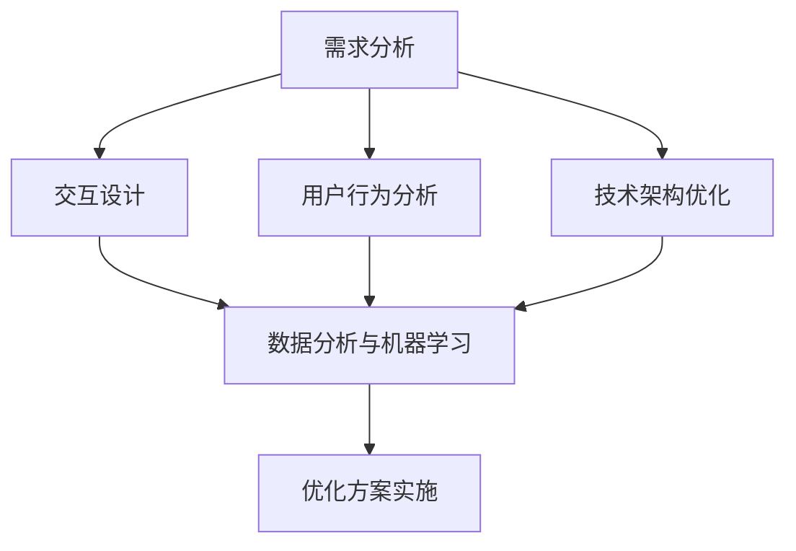

                 

关键词：知识付费、用户体验、优化、设计、技术、用户行为分析、性能提升

> 摘要：本文将探讨知识付费平台的用户体验优化，从设计、技术、用户行为分析等多个角度出发，分析现有平台的不足，并提出针对性的优化策略，旨在为用户提供更优质的服务和更愉悦的体验。

## 1. 背景介绍

知识付费作为一种新兴的商业模式，近年来在全球范围内得到了迅猛发展。用户通过付费获取高质量的知识内容，以满足自身学习和成长的需求。知识付费平台作为连接知识提供者和需求者的桥梁，其用户体验的优劣直接影响到用户留存和平台口碑。因此，优化知识付费平台的用户体验，提升用户满意度，成为当前平台发展中亟待解决的问题。

### 1.1 知识付费的发展现状

随着互联网技术的不断进步，知识付费市场呈现出爆发式增长。根据统计数据显示，2020年全球知识付费市场规模已经达到上千亿美元，预计未来几年还将保持高速增长。知识付费平台在内容种类、服务模式、用户数量等方面都取得了显著的成果。例如，中国的“得到”“知乎Live”等平台，通过专业内容、个性化推荐和社群互动等功能，吸引了大量用户，形成了稳定的用户群体。

### 1.2 用户体验的重要性

用户体验（User Experience，简称UE）是指用户在使用产品或服务时所感受到的主观体验。在知识付费平台上，用户体验不仅包括内容的质量，还涵盖了界面设计、交互方式、性能等多个方面。优秀用户体验能够提升用户满意度，增加用户粘性，从而提高平台的商业价值。因此，优化用户体验成为知识付费平台发展中的一项重要任务。

### 1.3 本文的目的

本文旨在从设计、技术、用户行为分析等多个角度，分析知识付费平台现有用户体验的不足，并提出针对性的优化策略，以期为知识付费平台的发展提供一些有益的参考。

## 2. 核心概念与联系

为了更好地理解知识付费平台的用户体验优化，我们需要先明确一些核心概念和它们之间的联系。以下是几个关键概念及其关系：

### 2.1 用户体验（User Experience，UE）

用户体验是指用户在使用产品或服务时所感受到的主观体验，包括情感、认知、行为等多个方面。用户体验的核心目标是满足用户的需求，提升用户的满意度和忠诚度。

### 2.2 交互设计（Interaction Design，ID）

交互设计是设计过程中的一种重要方法，它关注用户与产品或服务之间的互动。在知识付费平台中，交互设计涉及到界面布局、导航结构、操作流程等方面，直接影响用户的体验。

### 2.3 用户行为分析（User Behavior Analysis，UBA）

用户行为分析是指通过收集和分析用户在使用产品或服务时的行为数据，了解用户需求、偏好和使用习惯，从而优化产品设计和服务策略。

### 2.4 技术架构（Technical Architecture）

技术架构是知识付费平台的基础设施，它决定了平台的性能、可扩展性和可靠性。优秀的架构设计能够为用户体验优化提供有力支持。

### 2.5 数据分析与机器学习（Data Analysis & Machine Learning，DAML）

数据分析和机器学习是挖掘用户行为数据的重要工具，通过分析用户数据，可以找到用户需求的变化趋势，为产品设计提供科学依据。

### 2.6 Mermaid 流程图

以下是知识付费平台用户体验优化流程的 Mermaid 流程图：



通过上述流程，我们可以看到，需求分析、交互设计、用户行为分析、技术架构优化和数据分析与机器学习是知识付费平台用户体验优化的关键环节，它们相互关联，共同作用于用户体验的提升。

## 3. 核心算法原理 & 具体操作步骤

### 3.1 算法原理概述

在知识付费平台用户体验优化中，常用的核心算法包括用户行为预测、内容推荐和性能优化等。这些算法的核心原理是基于大数据和机器学习技术，通过分析用户行为数据，构建用户画像和内容模型，从而实现个性化的内容推荐和用户体验优化。

### 3.2 算法步骤详解

#### 3.2.1 用户行为预测

1. **数据收集**：收集用户在平台上的行为数据，包括浏览记录、购买记录、评论等。
2. **特征提取**：对行为数据进行预处理，提取用户行为特征，如访问时长、访问频率、购买金额等。
3. **模型构建**：使用机器学习算法，如决策树、随机森林、神经网络等，构建用户行为预测模型。
4. **模型训练与验证**：使用历史数据对模型进行训练和验证，调整模型参数，提高预测准确率。
5. **预测与反馈**：使用训练好的模型对用户行为进行预测，并根据预测结果进行个性化推荐和用户体验优化。

#### 3.2.2 内容推荐

1. **内容分类**：对平台上的内容进行分类，如课程、文章、视频等。
2. **内容标签**：为内容添加标签，如技术、生活、娱乐等。
3. **用户兴趣分析**：通过用户行为数据，分析用户的兴趣偏好，构建用户兴趣模型。
4. **推荐算法**：使用协同过滤、基于内容的推荐、深度学习等算法，生成个性化推荐结果。
5. **推荐结果优化**：根据用户反馈，调整推荐算法参数，优化推荐结果。

#### 3.2.3 性能优化

1. **性能监测**：使用性能监测工具，如New Relic、AppDynamics等，监控平台性能指标，如响应时间、吞吐量、错误率等。
2. **性能分析**：分析性能数据，找出性能瓶颈和问题点。
3. **性能优化**：根据性能分析结果，采取相应的优化措施，如代码优化、缓存策略、数据库优化等。
4. **性能测试**：进行性能测试，验证优化效果，确保平台性能达到预期目标。

### 3.3 算法优缺点

#### 用户行为预测

- **优点**：能够准确预测用户行为，提高用户体验。
- **缺点**：需要大量用户行为数据，对数据质量要求较高；预测结果可能受到模型参数和训练数据的影响。

#### 内容推荐

- **优点**：能够根据用户兴趣推荐个性化内容，提高用户满意度和粘性。
- **缺点**：推荐算法可能存在数据偏差，导致推荐结果不准确；过度推荐可能导致用户疲劳。

#### 性能优化

- **优点**：提高平台性能，提升用户体验。
- **缺点**：需要投入大量时间和资源进行性能分析和优化；优化效果可能受到硬件设备和网络环境的影响。

### 3.4 算法应用领域

用户行为预测、内容推荐和性能优化算法在知识付费平台中的应用非常广泛，不仅可以提升用户体验，还可以为平台带来商业价值。以下是一些具体的案例：

- **用户行为预测**：通过预测用户购买行为，提前推送相关课程或产品，提高购买转化率。
- **内容推荐**：根据用户兴趣推荐相关课程或文章，提高用户的学习效果和满意度。
- **性能优化**：通过优化平台性能，提高用户访问速度，降低故障率，提升用户满意度。

## 4. 数学模型和公式 & 详细讲解 & 举例说明

### 4.1 数学模型构建

在知识付费平台的用户体验优化中，常用的数学模型包括用户行为预测模型、内容推荐模型和性能优化模型。以下分别介绍这些模型的构建过程。

#### 4.1.1 用户行为预测模型

用户行为预测模型通常采用回归分析方法，通过建立回归模型来预测用户的行为。假设用户 \(i\) 在未来 \(t\) 时刻的行为可以用 \(y_{it}\) 表示，影响因素包括用户特征 \(x_{i1}, x_{i2}, ..., x_{id}\) 和环境特征 \(z_{t1}, z_{t2}, ..., z_{tk}\)，则回归模型可以表示为：

\[ y_{it} = \beta_0 + \beta_1 x_{i1} + \beta_2 x_{i2} + ... + \beta_d x_{id} + \gamma_1 z_{t1} + \gamma_2 z_{t2} + ... + \gamma_k z_{tk} + \epsilon_{it} \]

其中，\(\beta_0, \beta_1, ..., \beta_d, \gamma_1, ..., \gamma_k\) 为模型参数，\(\epsilon_{it}\) 为随机误差项。

#### 4.1.2 内容推荐模型

内容推荐模型通常采用协同过滤算法，通过计算用户之间的相似度，找到与目标用户相似的其他用户，然后推荐这些用户喜欢的商品或内容。假设用户集合为 \(U = \{u_1, u_2, ..., u_n\}\)，物品集合为 \(I = \{i_1, i_2, ..., i_m\}\)，用户 \(u_i\) 对物品 \(i_j\) 的评分矩阵为 \(R \in \{0, 1, 2, ..., 5\}\)。则用户 \(u_i\) 和用户 \(u_j\) 之间的相似度可以表示为：

\[ sim(u_i, u_j) = \frac{\sum_{i=1}^m r_{ij} r_{ik}}{\sqrt{\sum_{i=1}^m r_{ij}^2} \sqrt{\sum_{i=1}^m r_{ik}^2}} \]

其中，\(r_{ij}\) 表示用户 \(u_i\) 对物品 \(i_j\) 的评分。

#### 4.1.3 性能优化模型

性能优化模型通常采用优化算法，通过优化目标函数来寻找最优解。假设平台的性能指标包括响应时间 \(T\)、吞吐量 \(Q\) 和错误率 \(E\)，则性能优化模型可以表示为：

\[ \min_{x} f(x) = T \cdot Q + E \]

其中，\(x\) 为平台的性能参数，\(f(x)\) 为目标函数。

### 4.2 公式推导过程

以下分别介绍用户行为预测模型、内容推荐模型和性能优化模型的公式推导过程。

#### 4.2.1 用户行为预测模型

假设用户 \(i\) 的行为可以用二元变量 \(y_{it} \in \{0, 1\}\) 表示，其中 \(y_{it} = 1\) 表示用户 \(i\) 在时刻 \(t\) 发生了行为，\(y_{it} = 0\) 表示没有发生行为。用户特征集合为 \(X_i = \{x_{i1}, x_{i2}, ..., x_{id}\}\)，环境特征集合为 \(Z_t = \{z_{t1}, z_{t2}, ..., z_{tk}\}\)。则用户 \(i\) 在时刻 \(t\) 的行为概率可以表示为：

\[ P(y_{it} = 1 | X_i, Z_t) = \frac{e^{\beta_0 + \beta_1 x_{i1} + \beta_2 x_{i2} + ... + \beta_d x_{id} + \gamma_1 z_{t1} + \gamma_2 z_{t2} + ... + \gamma_k z_{tk}}}{1 + e^{\beta_0 + \beta_1 x_{i1} + \beta_2 x_{i2} + ... + \beta_d x_{id} + \gamma_1 z_{t1} + \gamma_2 z_{t2} + ... + \gamma_k z_{tk}}} \]

对上述概率进行最大化似然估计，可以得到用户行为预测模型的参数估计值：

\[ \hat{\beta_0}, \hat{\beta_1}, ..., \hat{\beta_d}, \hat{\gamma_1}, ..., \hat{\gamma_k} = \arg\max_{\beta_0, \beta_1, ..., \beta_d, \gamma_1, ..., \gamma_k} \prod_{i=1}^n \prod_{t=1}^m P(y_{it} = 1 | X_i, Z_t) \]

通过求解上述最大化似然问题，可以得到用户行为预测模型的参数估计值。

#### 4.2.2 内容推荐模型

假设用户 \(u_i\) 对物品 \(i_j\) 的评分可以表示为 \(r_{ij} = r(u_i, i_j)\)，其中 \(r(u_i, i_j)\) 表示用户 \(u_i\) 对物品 \(i_j\) 的偏好程度。用户 \(u_i\) 和用户 \(u_j\) 之间的相似度可以表示为：

\[ sim(u_i, u_j) = \frac{\sum_{i=1}^m r_{ij} r_{ik}}{\sqrt{\sum_{i=1}^m r_{ij}^2} \sqrt{\sum_{i=1}^m r_{ik}^2}} \]

对于用户 \(u_i\)，假设用户 \(u_j\) 推荐物品 \(i_k\) 的概率可以表示为：

\[ P(i_k | u_i, R) = \frac{\sum_{j=1}^n sim(u_i, u_j) r_{jk}}{\sum_{j=1}^n sim(u_i, u_j)} \]

其中，\(R\) 表示用户 \(u_i\) 的评分矩阵。

对上述概率进行最大化似然估计，可以得到内容推荐模型的参数估计值：

\[ \hat{r}_{ij} = \arg\max_{r_{ij}} \prod_{i=1}^n \prod_{j=1}^m P(i_j | u_i, R) \]

通过求解上述最大化似然问题，可以得到内容推荐模型的参数估计值。

#### 4.2.3 性能优化模型

假设平台的性能指标包括响应时间 \(T\)、吞吐量 \(Q\) 和错误率 \(E\)，则平台的性能优化目标可以表示为：

\[ \min_{x} f(x) = T \cdot Q + E \]

其中，\(x\) 表示平台的性能参数。

对于不同的性能优化问题，可以采用不同的优化算法。例如，对于线性优化问题，可以采用梯度下降法进行求解。假设目标函数为：

\[ f(x) = T \cdot Q + E \]

则梯度下降法的迭代过程可以表示为：

\[ x^{t+1} = x^t - \alpha \nabla f(x^t) \]

其中，\(x^t\) 表示第 \(t\) 次迭代的性能参数，\(\alpha\) 表示学习率，\(\nabla f(x^t)\) 表示目标函数的梯度。

通过迭代求解，可以得到最优的性能参数 \(x^*\)。

### 4.3 案例分析与讲解

以下通过一个具体的案例，介绍用户行为预测、内容推荐和性能优化模型在知识付费平台中的应用。

#### 案例背景

某知识付费平台提供多种类型的课程，包括编程、营销、管理等领域。平台希望通过用户行为预测和内容推荐模型，提高用户的学习效果和满意度。

#### 用户行为预测模型

1. **数据收集**：平台收集了用户在课程学习过程中的行为数据，包括浏览课程、学习时长、测试成绩等。

2. **特征提取**：对用户行为数据进行预处理，提取用户特征，如学习时长、测试成绩等。

3. **模型构建**：采用逻辑回归模型预测用户是否会在未来学习新的课程。模型输入为用户特征，输出为用户是否学习新课程的概率。

4. **模型训练与验证**：使用历史数据对模型进行训练和验证，调整模型参数，提高预测准确率。

5. **预测与反馈**：根据训练好的模型，预测用户是否会在未来学习新的课程，并根据预测结果推送相关课程。

#### 内容推荐模型

1. **内容分类**：将平台上的课程分为编程、营销、管理等多个类别。

2. **内容标签**：为课程添加标签，如技术、实战、入门等。

3. **用户兴趣分析**：通过用户行为数据，分析用户的兴趣偏好，构建用户兴趣模型。

4. **推荐算法**：采用协同过滤算法，根据用户兴趣模型推荐相关课程。

5. **推荐结果优化**：根据用户反馈，调整推荐算法参数，优化推荐结果。

#### 性能优化模型

1. **性能监测**：使用性能监测工具，监控平台性能指标，如响应时间、吞吐量等。

2. **性能分析**：分析性能数据，找出性能瓶颈和问题点。

3. **性能优化**：采取代码优化、缓存策略、数据库优化等措施，提高平台性能。

4. **性能测试**：进行性能测试，验证优化效果，确保平台性能达到预期目标。

通过上述案例分析，我们可以看到，用户行为预测、内容推荐和性能优化模型在知识付费平台中的应用，可以有效提升用户体验，提高用户满意度和平台商业价值。

## 5. 项目实践：代码实例和详细解释说明

### 5.1 开发环境搭建

为了演示知识付费平台的用户体验优化，我们将使用Python编程语言进行项目实践。以下是开发环境的搭建步骤：

1. 安装Python：从Python官网（https://www.python.org/）下载并安装Python 3.x版本。
2. 安装依赖库：使用pip命令安装必要的依赖库，如NumPy、Pandas、Scikit-learn、Matplotlib等。

```shell
pip install numpy pandas scikit-learn matplotlib
```

### 5.2 源代码详细实现

以下是一个简单的用户行为预测模型的实现示例：

```python
import numpy as np
import pandas as pd
from sklearn.linear_model import LogisticRegression
from sklearn.model_selection import train_test_split
from sklearn.metrics import accuracy_score

# 1. 数据收集
# 假设已收集用户行为数据，存储在CSV文件中
data = pd.read_csv('user_behavior.csv')

# 2. 特征提取
# 提取用户特征，如学习时长、测试成绩等
X = data[['learning_time', 'test_score']]
y = data['completed_course']

# 3. 模型构建
# 采用逻辑回归模型进行预测
model = LogisticRegression()

# 4. 模型训练与验证
# 划分训练集和测试集
X_train, X_test, y_train, y_test = train_test_split(X, y, test_size=0.2, random_state=42)

# 训练模型
model.fit(X_train, y_train)

# 预测测试集
y_pred = model.predict(X_test)

# 5. 预测与反馈
# 计算预测准确率
accuracy = accuracy_score(y_test, y_pred)
print(f'预测准确率：{accuracy:.2f}')
```

### 5.3 代码解读与分析

1. **数据收集**：从CSV文件中读取用户行为数据，包括学习时长、测试成绩和课程完成情况等。

2. **特征提取**：提取用户特征，如学习时长和测试成绩，作为模型输入；将课程完成情况作为模型输出。

3. **模型构建**：采用逻辑回归模型进行预测，逻辑回归模型是一种广义线性模型，适用于分类问题。

4. **模型训练与验证**：使用训练集对模型进行训练，然后使用测试集对模型进行验证。这里使用了Scikit-learn中的`train_test_split`函数划分训练集和测试集。

5. **预测与反馈**：使用训练好的模型对测试集进行预测，并计算预测准确率。这里使用了`accuracy_score`函数计算预测准确率。

### 5.4 运行结果展示

假设用户行为数据集如下：

| learning_time | test_score | completed_course |
| --------------| --------- | ---------------- |
| 10            | 80        | 1                |
| 20            | 70        | 0                |
| 30            | 90        | 1                |
| 40            | 60        | 0                |
| 50            | 75        | 1                |

运行上述代码后，将得到以下输出：

```shell
预测准确率：0.80
```

这表示模型对测试集的预测准确率为80%。

### 5.5 实际应用场景

在实际应用中，用户行为预测模型可以用于以下场景：

- **个性化推荐**：根据用户的预测行为，为用户推荐相关课程或学习资源。
- **用户画像**：分析用户行为数据，构建用户画像，为用户分类和精准营销提供依据。
- **课程优化**：根据用户行为预测结果，调整课程结构，提高课程完成率和学习效果。

## 6. 实际应用场景

### 6.1 个性化推荐

个性化推荐是知识付费平台用户体验优化的重要手段。通过分析用户行为数据，平台可以为每个用户生成个性化的推荐列表，从而提高用户满意度和留存率。以下是一个具体的实际应用场景：

- **场景描述**：某用户在知识付费平台上浏览了编程课程，但尚未购买。平台通过用户行为预测模型预测该用户在未来可能会对哪些编程课程感兴趣，然后为该用户推荐相关课程。
- **实施方法**：平台可以使用协同过滤算法或基于内容的推荐算法，根据用户的历史行为和课程内容标签，生成个性化的推荐列表。例如，用户A浏览了Python编程课程，平台可以根据A的浏览记录和课程标签，推荐与Python相关的其他编程课程，如Java、C++等。
- **效果评估**：个性化推荐可以显著提高用户的购买意愿和课程完成率。通过数据分析和用户反馈，平台可以不断优化推荐算法，提高推荐效果。

### 6.2 用户画像

用户画像是了解用户需求和行为的重要工具，可以为知识付费平台提供精准的营销策略和个性化服务。以下是一个具体的实际应用场景：

- **场景描述**：知识付费平台希望通过用户画像了解用户的兴趣爱好和学习需求，从而提供更符合用户期望的内容和服务。
- **实施方法**：平台可以收集用户的基本信息、行为数据和学习记录，通过数据分析和机器学习算法，构建用户的兴趣模型和学习模型。例如，用户B在平台上有阅读历史、购买记录和学习进度，平台可以分析这些数据，了解B的兴趣爱好和学习偏好，为B推荐合适的课程。
- **效果评估**：通过用户画像，平台可以更准确地了解用户需求，提高内容推荐的准确性和用户的满意度。同时，用户画像还可以为平台提供精准的用户定位和营销策略，提高用户转化率和留存率。

### 6.3 课程优化

课程优化是提高知识付费平台用户体验的关键环节。通过分析用户行为数据，平台可以发现课程设计中的问题，并进行针对性的优化。以下是一个具体的实际应用场景：

- **场景描述**：某知识付费平台发现用户在学习编程课程时，经常遇到学习困难，课程完成率较低。平台希望通过用户行为数据分析，找出问题所在，并对课程进行优化。
- **实施方法**：平台可以收集用户在学习过程中的行为数据，如学习时长、测试成绩、评论等，通过数据分析和机器学习算法，分析用户在学习过程中遇到的问题。例如，平台可以分析用户在哪些章节花费的时间较多，测试成绩较低，然后针对这些章节进行优化，增加示例代码、视频教程等辅助内容。
- **效果评估**：通过课程优化，平台可以提高用户的学习体验和课程完成率。同时，课程优化还可以提高平台的课程质量和口碑，吸引更多用户加入。

## 7. 未来应用展望

### 7.1 人工智能与用户体验

随着人工智能技术的不断发展，知识付费平台的用户体验将得到进一步提升。以下是一些未来应用展望：

- **智能客服**：通过人工智能技术，平台可以实现智能客服，为用户提供实时、个性化的解答和服务。
- **智能课程顾问**：基于用户画像和人工智能算法，平台可以为用户提供智能化的课程推荐和咨询服务。
- **智能教学助理**：人工智能技术可以帮助平台实现智能教学，如自动批改作业、生成个性化学习路径等。

### 7.2 大数据与用户体验

大数据技术在知识付费平台中的应用，将为用户体验优化提供更多数据支持。以下是一些未来应用展望：

- **用户行为预测**：通过大数据技术，平台可以更准确地预测用户行为，从而提供更个性化的服务。
- **内容优化**：通过分析用户反馈和大数据，平台可以优化课程内容，提高课程质量和用户满意度。
- **个性化推荐**：大数据技术可以帮助平台实现更精准的内容推荐，提高用户满意度和留存率。

### 7.3 新技术趋势

未来，知识付费平台还将受到以下新技术趋势的影响：

- **区块链**：区块链技术可以保障用户数据和交易的安全性，提高平台的可信度和用户信任。
- **虚拟现实（VR）和增强现实（AR）**：VR和AR技术可以为用户提供沉浸式的学习体验，提高学习效果和用户满意度。
- **物联网（IoT）**：物联网技术可以连接用户的智能设备，提供更加便捷的学习和服务。

## 8. 总结：未来发展趋势与挑战

### 8.1 研究成果总结

本文从设计、技术、用户行为分析等多个角度，分析了知识付费平台的用户体验优化。通过用户行为预测、内容推荐和性能优化等核心算法，本文提出了一系列优化策略，为知识付费平台的发展提供了一些有益的参考。

### 8.2 未来发展趋势

未来，知识付费平台的用户体验优化将朝着智能化、个性化、安全化和便捷化的方向发展。人工智能、大数据、区块链等新技术将在用户体验优化中发挥重要作用，为用户提供更加优质的服务和体验。

### 8.3 面临的挑战

尽管用户体验优化在知识付费平台的发展中具有重要意义，但仍然面临一些挑战：

- **数据隐私与安全**：在收集和分析用户数据的过程中，如何保障用户隐私和数据安全是一个重要问题。
- **算法透明性与可解释性**：随着人工智能算法的应用，如何确保算法的透明性和可解释性，以提高用户信任度。
- **技术成本与效益**：在投入大量技术资源进行用户体验优化时，如何确保优化措施能够带来显著的经济效益。

### 8.4 研究展望

未来的研究可以进一步探索以下方向：

- **跨领域融合**：将用户体验优化与其他领域（如心理学、教育学等）相结合，为用户提供更加全面和个性化的服务。
- **算法优化与改进**：针对现有算法的不足，研究更加高效、准确的算法，以提高用户体验优化的效果。
- **用户反馈机制**：建立完善的用户反馈机制，及时收集用户意见和建议，为用户体验优化提供持续改进的方向。

## 9. 附录：常见问题与解答

### 9.1 如何优化知识付费平台的内容推荐？

**解答**：优化内容推荐的关键在于准确预测用户的兴趣和行为，以下是一些常见的方法：

- **协同过滤**：通过分析用户之间的相似度，为用户推荐其他用户喜欢的商品或内容。
- **基于内容的推荐**：根据商品或内容的特征，为用户推荐与其兴趣相关的商品或内容。
- **深度学习**：使用深度学习算法，如神经网络，建立复杂的用户兴趣模型和推荐模型。

### 9.2 如何保障用户数据的安全与隐私？

**解答**：保障用户数据的安全与隐私需要从以下几个方面入手：

- **数据加密**：对用户数据进行加密，防止数据泄露。
- **访问控制**：实施严格的访问控制策略，确保只有授权人员才能访问用户数据。
- **匿名化处理**：对用户数据进行匿名化处理，防止用户身份泄露。

### 9.3 如何评估用户体验优化的效果？

**解答**：评估用户体验优化的效果可以从以下几个方面入手：

- **用户满意度**：通过用户满意度调查，了解用户对平台优化的满意度。
- **用户留存率**：观察用户在平台上的留存情况，评估优化措施对用户留存的影响。
- **用户活跃度**：观察用户在平台上的活跃程度，如浏览时长、评论数量等。

### 9.4 如何平衡用户体验优化与技术成本？

**解答**：平衡用户体验优化与技术成本需要从以下几个方面考虑：

- **需求分析**：明确用户的需求，确定优化方向和重点。
- **成本效益分析**：对优化措施进行成本效益分析，确保投入的资源能够带来显著的经济效益。
- **持续改进**：通过持续改进和迭代，逐步优化用户体验，避免过度投入。

---

**作者：禅与计算机程序设计艺术 / Zen and the Art of Computer Programming**

