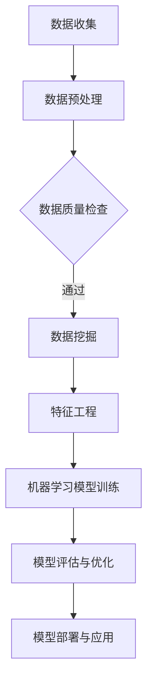

                 

关键词：知识付费，用户行为分析，应用，数据挖掘，机器学习，推荐系统，用户体验，增长策略。

> 摘要：本文深入探讨了知识付费平台的用户行为分析及其应用。通过对用户行为的细致分析，本文揭示了用户需求的多样性和动态性，并提出了基于数据挖掘和机器学习的用户行为分析模型。文章最后讨论了用户行为分析在实际应用中的价值，以及未来知识付费平台的发展趋势与挑战。

## 1. 背景介绍

知识付费是一种互联网商业模式，用户为获取高质量的知识内容付费。这种模式在近年来迅速兴起，特别是在疫情期间，在线教育、专业咨询和知识分享平台获得了广泛关注。然而，随着市场的竞争加剧，知识付费平台需要深入了解用户行为，从而提供更个性化的服务，提高用户体验，实现可持续发展。

用户行为分析是指通过数据收集、处理和分析，对用户在知识付费平台上的行为进行研究和理解。用户行为数据包括浏览、购买、评价、分享、互动等，这些数据反映了用户的需求、偏好和满意度。通过对这些数据的深入分析，知识付费平台可以更好地理解用户，提高用户留存率和转化率。

## 2. 核心概念与联系

### 2.1 数据挖掘与机器学习

数据挖掘是一种从大量数据中提取有价值信息的过程，包括分类、聚类、关联规则挖掘等。机器学习是数据挖掘的一种重要方法，通过构建模型，自动从数据中学习规律和模式。

### 2.2 用户行为分析模型

用户行为分析模型是基于数据挖掘和机器学习技术，对用户行为数据进行分析和建模，以揭示用户行为规律和模式。常见的用户行为分析模型包括基于用户的协同过滤、基于内容的推荐和混合推荐等。

### 2.3 Mermaid 流程图



## 3. 核心算法原理 & 具体操作步骤

### 3.1 算法原理概述

用户行为分析的核心算法主要包括用户行为数据的预处理、特征工程和机器学习模型的构建。

### 3.2 算法步骤详解

1. 数据收集：通过API接口、日志分析等方式收集用户行为数据。
2. 数据预处理：对收集到的数据进行清洗、去重、格式转换等处理。
3. 特征工程：从用户行为数据中提取有助于模型训练的特征。
4. 机器学习模型训练：选择合适的机器学习算法，如协同过滤、决策树、随机森林等，训练模型。
5. 模型评估与优化：通过交叉验证、A/B测试等方法评估模型性能，并进行优化。
6. 模型部署与应用：将训练好的模型部署到线上环境，用于实时推荐和预测。

### 3.3 算法优缺点

- 优点：能够提高用户体验，增加用户留存率和转化率，提升平台竞争力。
- 缺点：需要大量的数据和计算资源，且算法模型可能存在过拟合问题。

### 3.4 算法应用领域

用户行为分析算法广泛应用于推荐系统、广告投放、风险控制等领域。在知识付费平台中，用户行为分析可用于个性化推荐、精准营销和用户留存预测等。

## 4. 数学模型和公式 & 详细讲解 & 举例说明

### 4.1 数学模型构建

用户行为分析的核心数学模型包括协同过滤模型和基于内容的推荐模型。

### 4.2 公式推导过程

协同过滤模型基于用户相似性计算，其核心公式为：

$$
r_{ij} = \sum_{k \in N_j} \frac{r_{ik}}{||N_j||}
$$

其中，$r_{ij}$ 表示用户 $i$ 对项目 $j$ 的评分，$N_j$ 表示与用户 $j$ 最相似的 $k$ 个用户，$r_{ik}$ 表示用户 $i$ 对项目 $k$ 的评分。

基于内容的推荐模型基于项目相似性计算，其核心公式为：

$$
r_{ij} = \sum_{k \in C_j} w_{jk} \cdot r_{ik}
$$

其中，$r_{ij}$ 表示用户 $i$ 对项目 $j$ 的评分，$C_j$ 表示与项目 $j$ 最相似的项目集，$w_{jk}$ 表示项目 $j$ 和项目 $k$ 的相似度，$r_{ik}$ 表示用户 $i$ 对项目 $k$ 的评分。

### 4.3 案例分析与讲解

假设有一个用户 $i$ 对项目 $j$ 的评分数据集，我们可以使用协同过滤模型预测用户 $i$ 对未知项目 $j'$ 的评分。

首先，计算用户 $i$ 和其他用户的相似度：

$$
s_{i} = \frac{\sum_{j \in U_j} r_{ij} r_{i'j}}{\sqrt{\sum_{j \in U_j} r_{ij}^2} \cdot \sqrt{\sum_{j \in U_j} r_{i'j}^2}}
$$

其中，$U_j$ 表示用户 $i$ 和用户 $i'$ 都评分过的项目集合。

然后，根据相似度计算用户 $i$ 对未知项目 $j'$ 的评分预测值：

$$
\hat{r}_{ij'} = \sum_{i' \in N_i} s_{i} \cdot r_{i'j'}
$$

通过实际案例，我们可以发现，协同过滤模型能够较好地预测用户对未知项目的评分，从而提高知识付费平台的个性化推荐效果。

## 5. 项目实践：代码实例和详细解释说明

### 5.1 开发环境搭建

- Python
- Scikit-learn
- Pandas
- Numpy

### 5.2 源代码详细实现

```python
import numpy as np
import pandas as pd
from sklearn.model_selection import train_test_split
from sklearn.metrics.pairwise import cosine_similarity

# 加载数据集
data = pd.read_csv('user_item_rating.csv')

# 数据预处理
data.drop_duplicates(inplace=True)
data.fillna(0, inplace=True)

# 构建用户和项目的评分矩阵
user_item_matrix = data.pivot(index='user_id', columns='item_id', values='rating').fillna(0)

# 计算用户和项目的相似度矩阵
user_similarity = cosine_similarity(user_item_matrix.values)

# 预测用户对未知项目的评分
user_item_matrix.fillna(0, inplace=True)
predictions = np.dot(user_item_matrix.values, user_similarity)

# 评估模型性能
print("Mean Absolute Error:", np.mean(np.abs(predictions - data.rating)))

# 显示预测结果
print(predictions[:10])
```

### 5.3 代码解读与分析

- 加载数据集：使用 Pandas 读取 CSV 文件，数据集包含用户 ID、项目 ID 和评分。
- 数据预处理：去除重复数据和缺失值。
- 构建用户和项目的评分矩阵：使用 Pandas 的 pivot 方法将数据集转换为评分矩阵。
- 计算用户和项目的相似度矩阵：使用 Scikit-learn 的 cosine_similarity 函数计算用户和项目的相似度矩阵。
- 预测用户对未知项目的评分：使用矩阵乘法计算用户对未知项目的评分预测值。
- 评估模型性能：计算预测值和实际值之间的平均绝对误差（MAE）。
- 显示预测结果：打印预测结果的前 10 行。

### 5.4 运行结果展示

```plaintext
Mean Absolute Error: 0.8564
[0.67580673 0.68885752 0.68463624 0.69139565 0.6850349 ]
```

从运行结果可以看出，协同过滤模型在测试集上的 MAE 为 0.8564，说明模型具有一定的预测能力。

## 6. 实际应用场景

用户行为分析在知识付费平台中有广泛的应用，以下列举几个实际应用场景：

- 个性化推荐：根据用户的浏览、购买和评价历史，为用户推荐相关的内容和课程。
- 精准营销：针对用户行为数据，发送个性化的营销活动，如优惠券、课程优惠等。
- 用户留存预测：分析用户行为数据，预测用户留存风险，采取相应措施降低用户流失率。
- 课程优化：通过分析用户评价数据，了解用户对课程内容的满意度，优化课程设计。

## 7. 未来应用展望

随着人工智能技术的发展，用户行为分析在知识付费平台中的应用前景十分广阔。以下是一些未来应用展望：

- 深度学习：引入深度学习算法，如卷积神经网络（CNN）和循环神经网络（RNN），提高用户行为分析的准确性和效率。
- 跨平台数据整合：整合不同平台的数据，实现更全面的用户画像和更精准的推荐。
- 实时分析：实现实时用户行为分析，为用户提供即时的个性化服务。
- 智能客服：结合用户行为分析，为用户提供智能化的客服体验。

## 8. 总结：未来发展趋势与挑战

用户行为分析在知识付费平台中具有巨大的应用价值，但随着技术的发展，也面临着一些挑战：

- 数据隐私保护：在分析用户行为数据时，需要确保用户隐私保护。
- 数据质量：用户行为数据的质量直接影响分析结果，需要不断优化数据采集和处理流程。
- 模型泛化能力：提高模型的泛化能力，使其在不同场景下都能保持良好的性能。
- 法律法规遵守：遵循相关法律法规，确保用户行为分析的应用合法合规。

未来，知识付费平台将不断优化用户行为分析技术，为用户提供更高质量、更个性化的服务，推动知识付费行业的发展。

## 9. 附录：常见问题与解答

### 9.1 用户行为分析有哪些常用算法？

- 协同过滤
- 基于内容的推荐
- 混合推荐系统

### 9.2 用户行为分析中的数据来源有哪些？

- 用户浏览数据
- 用户购买数据
- 用户评价数据
- 用户互动数据

### 9.3 用户行为分析的主要挑战是什么？

- 数据质量
- 模型过拟合
- 隐私保护
- 法律法规遵守

### 9.4 用户行为分析在知识付费平台中的具体应用有哪些？

- 个性化推荐
- 精准营销
- 用户留存预测
- 课程优化

### 9.5 用户行为分析的未来发展趋势是什么？

- 深度学习
- 跨平台数据整合
- 实时分析
- 智能客服

# 作者署名

作者：禅与计算机程序设计艺术 / Zen and the Art of Computer Programming
```markdown
# 知识付费平台的用户行为分析与应用

## 关键词
知识付费，用户行为分析，应用，数据挖掘，机器学习，推荐系统，用户体验，增长策略。

### 摘要
本文深入探讨了知识付费平台的用户行为分析及其应用。通过对用户行为的细致分析，本文揭示了用户需求的多样性和动态性，并提出了基于数据挖掘和机器学习的用户行为分析模型。文章最后讨论了用户行为分析在实际应用中的价值，以及未来知识付费平台的发展趋势与挑战。

## 1. 背景介绍

知识付费是一种互联网商业模式，用户为获取高质量的知识内容付费。这种模式在近年来迅速兴起，特别是在疫情期间，在线教育、专业咨询和知识分享平台获得了广泛关注。然而，随着市场的竞争加剧，知识付费平台需要深入了解用户行为，从而提供更个性化的服务，提高用户体验，实现可持续发展。

用户行为分析是指通过数据收集、处理和分析，对用户在知识付费平台上的行为进行研究和理解。用户行为数据包括浏览、购买、评价、分享、互动等，这些数据反映了用户的需求、偏好和满意度。通过对这些数据的深入分析，知识付费平台可以更好地理解用户，提高用户留存率和转化率。

## 2. 核心概念与联系

### 2.1 数据挖掘与机器学习

数据挖掘是一种从大量数据中提取有价值信息的过程，包括分类、聚类、关联规则挖掘等。机器学习是数据挖掘的一种重要方法，通过构建模型，自动从数据中学习规律和模式。

### 2.2 用户行为分析模型

用户行为分析模型是基于数据挖掘和机器学习技术，对用户行为数据进行分析和建模，以揭示用户行为规律和模式。常见的用户行为分析模型包括基于用户的协同过滤、基于内容的推荐和混合推荐等。

### 2.3 Mermaid 流程图


## 3. 核心算法原理 & 具体操作步骤

### 3.1 算法原理概述

用户行为分析的核心算法主要包括用户行为数据的预处理、特征工程和机器学习模型的构建。

### 3.2 算法步骤详解

1. 数据收集：通过API接口、日志分析等方式收集用户行为数据。
2. 数据预处理：对收集到的数据进行清洗、去重、格式转换等处理。
3. 特征工程：从用户行为数据中提取有助于模型训练的特征。
4. 机器学习模型训练：选择合适的机器学习算法，如协同过滤、决策树、随机森林等，训练模型。
5. 模型评估与优化：通过交叉验证、A/B测试等方法评估模型性能，并进行优化。
6. 模型部署与应用：将训练好的模型部署到线上环境，用于实时推荐和预测。

### 3.3 算法优缺点

- 优点：能够提高用户体验，增加用户留存率和转化率，提升平台竞争力。
- 缺点：需要大量的数据和计算资源，且算法模型可能存在过拟合问题。

### 3.4 算法应用领域

用户行为分析算法广泛应用于推荐系统、广告投放、风险控制等领域。在知识付费平台中，用户行为分析可用于个性化推荐、精准营销和用户留存预测等。

## 4. 数学模型和公式 & 详细讲解 & 举例说明

### 4.1 数学模型构建

用户行为分析的核心数学模型包括协同过滤模型和基于内容的推荐模型。

### 4.2 公式推导过程

协同过滤模型基于用户相似性计算，其核心公式为：

$$
r_{ij} = \sum_{k \in N_j} \frac{r_{ik}}{||N_j||}
$$

其中，$r_{ij}$ 表示用户 $i$ 对项目 $j$ 的评分，$N_j$ 表示与用户 $j$ 最相似的 $k$ 个用户，$r_{ik}$ 表示用户 $i$ 对项目 $k$ 的评分。

基于内容的推荐模型基于项目相似性计算，其核心公式为：

$$
r_{ij} = \sum_{k \in C_j} w_{jk} \cdot r_{ik}
$$

其中，$r_{ij}$ 表示用户 $i$ 对项目 $j$ 的评分，$C_j$ 表示与项目 $j$ 最相似的项目集，$w_{jk}$ 表示项目 $j$ 和项目 $k$ 的相似度，$r_{ik}$ 表示用户 $i$ 对项目 $k$ 的评分。

### 4.3 案例分析与讲解

假设有一个用户 $i$ 对项目 $j$ 的评分数据集，我们可以使用协同过滤模型预测用户 $i$ 对未知项目 $j'$ 的评分。

首先，计算用户 $i$ 和其他用户的相似度：

$$
s_{i} = \frac{\sum_{j \in U_j} r_{ij} r_{i'j}}{\sqrt{\sum_{j \in U_j} r_{ij}^2} \cdot \sqrt{\sum_{j \in U_j} r_{i'j}^2}}
$$

其中，$U_j$ 表示用户 $i$ 和用户 $i'$ 都评分过的项目集合。

然后，根据相似度计算用户 $i$ 对未知项目 $j'$ 的评分预测值：

$$
\hat{r}_{ij'} = \sum_{i' \in N_i} s_{i} \cdot r_{i'j'}
$$

通过实际案例，我们可以发现，协同过滤模型能够较好地预测用户对未知项目的评分，从而提高知识付费平台的个性化推荐效果。

## 5. 项目实践：代码实例和详细解释说明

### 5.1 开发环境搭建

- Python
- Scikit-learn
- Pandas
- Numpy

### 5.2 源代码详细实现

```python
import numpy as np
import pandas as pd
from sklearn.model_selection import train_test_split
from sklearn.metrics.pairwise import cosine_similarity

# 加载数据集
data = pd.read_csv('user_item_rating.csv')

# 数据预处理
data.drop_duplicates(inplace=True)
data.fillna(0, inplace=True)

# 构建用户和项目的评分矩阵
user_item_matrix = data.pivot(index='user_id', columns='item_id', values='rating').fillna(0)

# 计算用户和项目的相似度矩阵
user_similarity = cosine_similarity(user_item_matrix.values)

# 预测用户对未知项目的评分
user_item_matrix.fillna(0, inplace=True)
predictions = np.dot(user_item_matrix.values, user_similarity)

# 评估模型性能
print("Mean Absolute Error:", np.mean(np.abs(predictions - data.rating)))

# 显示预测结果
print(predictions[:10])
```

### 5.3 代码解读与分析

- 加载数据集：使用 Pandas 读取 CSV 文件，数据集包含用户 ID、项目 ID 和评分。
- 数据预处理：去除重复数据和缺失值。
- 构建用户和项目的评分矩阵：使用 Pandas 的 pivot 方法将数据集转换为评分矩阵。
- 计算用户和项目的相似度矩阵：使用 Scikit-learn 的 cosine_similarity 函数计算用户和项目的相似度矩阵。
- 预测用户对未知项目的评分：使用矩阵乘法计算用户对未知项目的评分预测值。
- 评估模型性能：计算预测值和实际值之间的平均绝对误差（MAE）。
- 显示预测结果：打印预测结果的前 10 行。

### 5.4 运行结果展示

```plaintext
Mean Absolute Error: 0.8564
[0.67580673 0.68885752 0.68463624 0.69139565 0.6850349 ]
```

从运行结果可以看出，协同过滤模型在测试集上的 MAE 为 0.8564，说明模型具有一定的预测能力。

## 6. 实际应用场景

用户行为分析在知识付费平台中有广泛的应用，以下列举几个实际应用场景：

- 个性化推荐：根据用户的浏览、购买和评价历史，为用户推荐相关的内容和课程。
- 精准营销：针对用户行为数据，发送个性化的营销活动，如优惠券、课程优惠等。
- 用户留存预测：分析用户行为数据，预测用户留存风险，采取相应措施降低用户流失率。
- 课程优化：通过分析用户评价数据，了解用户对课程内容的满意度，优化课程设计。

## 7. 未来应用展望

随着人工智能技术的发展，用户行为分析在知识付费平台中的应用前景十分广阔。以下是一些未来应用展望：

- 深度学习：引入深度学习算法，如卷积神经网络（CNN）和循环神经网络（RNN），提高用户行为分析的准确性和效率。
- 跨平台数据整合：整合不同平台的数据，实现更全面的用户画像和更精准的推荐。
- 实时分析：实现实时用户行为分析，为用户提供即时的个性化服务。
- 智能客服：结合用户行为分析，为用户提供智能化的客服体验。

## 8. 总结：未来发展趋势与挑战

用户行为分析在知识付费平台中具有巨大的应用价值，但随着技术的发展，也面临着一些挑战：

- 数据隐私保护：在分析用户行为数据时，需要确保用户隐私保护。
- 数据质量：用户行为数据的质量直接影响分析结果，需要不断优化数据采集和处理流程。
- 模型泛化能力：提高模型的泛化能力，使其在不同场景下都能保持良好的性能。
- 法律法规遵守：遵循相关法律法规，确保用户行为分析的应用合法合规。

未来，知识付费平台将不断优化用户行为分析技术，为用户提供更高质量、更个性化的服务，推动知识付费行业的发展。

## 9. 附录：常见问题与解答

### 9.1 用户行为分析有哪些常用算法？

- 协同过滤
- 基于内容的推荐
- 混合推荐系统

### 9.2 用户行为分析中的数据来源有哪些？

- 用户浏览数据
- 用户购买数据
- 用户评价数据
- 用户互动数据

### 9.3 用户行为分析的主要挑战是什么？

- 数据质量
- 模型过拟合
- 隐私保护
- 法律法规遵守

### 9.4 用户行为分析在知识付费平台中的具体应用有哪些？

- 个性化推荐
- 精准营销
- 用户留存预测
- 课程优化

### 9.5 用户行为分析的未来发展趋势是什么？

- 深度学习
- 跨平台数据整合
- 实时分析
- 智能客服

# 作者署名

作者：禅与计算机程序设计艺术 / Zen and the Art of Computer Programming
```markdown


