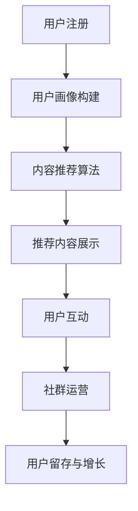

                 

关键词：知识付费，社交功能，平台设计，用户体验，算法推荐，互动机制，数据挖掘，用户行为分析。

## 摘要

本文将深入探讨知识付费平台社交功能的设计，旨在为平台开发者和运营团队提供一套全面、系统的设计思路和实施策略。文章首先介绍了知识付费平台的发展背景和社交功能的重要性，随后从核心概念、算法原理、数学模型、项目实践和实际应用场景等方面进行了详细阐述。通过本文的阅读，读者将能够了解如何有效地设计知识付费平台的社交功能，提升用户体验，增强用户粘性，从而在竞争激烈的市场中脱颖而出。

## 1. 背景介绍

随着互联网技术的飞速发展，知识付费逐渐成为新的风口。用户对于获取高质量知识的需求日益增长，而知识付费平台正是满足了这一需求。知识付费平台通过提供专业、系统、权威的知识内容，吸引了一批忠实用户。然而，仅仅提供优质的内容是不够的，社交功能的加入可以大大提升用户体验，增加用户在平台上的停留时间和互动频率。

### 1.1 知识付费平台的发展背景

知识付费平台起源于20世纪末的在线教育市场，但真正爆发是在移动互联网普及之后。随着智能手机的普及，人们可以随时随地进行学习，知识付费平台的用户规模也随之迅速扩大。根据市场研究公司的数据，全球知识付费市场规模在2020年已经达到了数百亿美元，并且预计在未来几年内还将保持高速增长。

### 1.2 社交功能在知识付费平台中的重要性

社交功能是知识付费平台的重要一环，它可以提升用户的互动性和参与感，增强用户粘性。具体来说，社交功能的重要性体现在以下几个方面：

- **增加用户参与度**：通过社交功能，用户不仅可以学习知识，还可以与同行、专家进行互动，分享心得体会，从而增加参与度。
- **促进内容传播**：用户通过社交功能分享优质内容，可以扩大平台的影响力，吸引更多潜在用户。
- **提升用户满意度**：社交功能可以满足用户社交需求，提高用户的满意度和忠诚度。
- **增强用户粘性**：通过社交功能，用户在平台上的活跃度会更高，从而降低用户流失率。

## 2. 核心概念与联系

### 2.1 核心概念

在知识付费平台社交功能的设计中，以下核心概念是不可或缺的：

- **用户画像**：通过数据分析，构建用户的兴趣、行为等特征模型。
- **算法推荐**：基于用户画像，为用户推荐感兴趣的内容和用户。
- **互动机制**：设计多样化的互动方式，如评论、点赞、分享等，以增强用户之间的互动。
- **社群运营**：通过创建和运营各种社群，如专业群、兴趣群等，满足用户的社交需求。

### 2.2 架构流程图

以下是一个简单的知识付费平台社交功能架构流程图，用于描述核心概念之间的联系：



## 3. 核心算法原理 & 具体操作步骤

### 3.1 算法原理概述

知识付费平台社交功能的算法设计主要分为以下几个步骤：

1. **用户画像构建**：通过数据分析，收集用户的兴趣、行为等特征，构建用户画像。
2. **内容推荐算法**：基于用户画像，利用机器学习算法，为用户推荐感兴趣的内容。
3. **用户互动算法**：设计多样化的互动方式，利用社交网络分析算法，增强用户之间的互动。
4. **社群运营算法**：通过社群数据分析，优化社群运营策略，提升社群活跃度。

### 3.2 算法步骤详解

#### 3.2.1 用户画像构建

用户画像构建主要包括以下几个步骤：

1. **数据收集**：通过用户行为数据、内容消费数据等，收集用户的基本信息和特征。
2. **数据清洗**：对收集到的数据进行清洗，去除重复、错误的数据。
3. **特征提取**：将清洗后的数据转化为特征向量，用于构建用户画像。

#### 3.2.2 内容推荐算法

内容推荐算法主要包括以下几个步骤：

1. **相似度计算**：计算用户与内容之间的相似度，使用余弦相似度、皮尔逊相关系数等方法。
2. **推荐列表生成**：根据用户画像和内容特征，生成推荐列表。
3. **推荐结果排序**：利用排序算法，如基于内容的排序、基于用户的排序等，对推荐结果进行排序。

#### 3.2.3 用户互动算法

用户互动算法主要包括以下几个步骤：

1. **互动行为分析**：分析用户在不同互动方式（如评论、点赞、分享）上的行为。
2. **社交网络分析**：利用社交网络分析算法，如PageRank、社区发现算法等，分析用户之间的互动关系。
3. **互动策略优化**：根据互动数据，优化互动策略，提高用户互动积极性。

#### 3.2.4 社群运营算法

社群运营算法主要包括以下几个步骤：

1. **社群创建**：根据用户需求和平台定位，创建各种类型的社群。
2. **社群活跃度分析**：分析社群的活跃度，如帖子数量、用户活跃度等。
3. **社群优化**：根据活跃度分析结果，优化社群运营策略，提高社群活跃度。

### 3.3 算法优缺点

#### 优点

1. **个性化推荐**：基于用户画像，为用户推荐个性化内容，提高用户满意度。
2. **增强互动性**：多样化的互动方式，促进用户之间的交流。
3. **提升社群活跃度**：有效的社群运营策略，提高社群活跃度。

#### 缺点

1. **数据隐私问题**：用户画像构建和算法推荐过程中，涉及用户隐私数据，需要严格保护。
2. **算法偏见**：算法可能存在偏见，如过度推荐同类型内容，降低用户多样性。

### 3.4 算法应用领域

算法在知识付费平台的社交功能设计中具有广泛的应用领域：

- **内容推荐**：为用户提供个性化内容推荐，提高用户粘性。
- **用户互动**：增强用户之间的互动，提高平台活跃度。
- **社群运营**：优化社群运营策略，提高社群活跃度。
- **用户增长**：通过算法推荐，吸引更多潜在用户。

## 4. 数学模型和公式

### 4.1 数学模型构建

在知识付费平台的社交功能设计中，常见的数学模型包括：

1. **协同过滤模型**：用于内容推荐，通过计算用户之间的相似度，推荐相似用户喜欢的商品。
2. **社交网络分析模型**：用于用户互动，通过分析用户之间的互动关系，识别社交网络中的关键节点。
3. **社区发现模型**：用于社群运营，通过分析用户的行为特征，发现具有相似兴趣的用户群体。

### 4.2 公式推导过程

#### 协同过滤模型

协同过滤模型的核心公式如下：

\[ R_{ui} = \sum_{j \in N(i)} \frac{sim(u, j) \cdot r_{uj}}{||N(i)||} \]

其中，\( R_{ui} \)表示用户\( u \)对物品\( i \)的评分预测，\( sim(u, j) \)表示用户\( u \)和用户\( j \)的相似度，\( r_{uj} \)表示用户\( j \)对物品\( i \)的实际评分，\( N(i) \)表示与物品\( i \)相关的用户集合。

#### 社交网络分析模型

社交网络分析模型的核心公式如下：

\[ \text{影响力评分} = \frac{\text{节点度数} \cdot \text{节点的平均邻居度数}}{N} \]

其中，节点度数表示节点在社交网络中的连接数，节点的平均邻居度数表示节点的邻居节点的度数平均值，\( N \)表示社交网络的节点总数。

#### 社区发现模型

社区发现模型的核心公式如下：

\[ \text{社区密度} = \frac{\text{社区内部连接数}}{\text{社区节点数} \times (\text{社区节点数} - 1)} \]

其中，社区内部连接数表示社区内节点之间的连接数，社区节点数表示社区的节点总数。

### 4.3 案例分析与讲解

#### 案例一：协同过滤模型在内容推荐中的应用

假设有一个用户\( u \)对某篇论文\( i \)的评分是5分，我们要预测用户\( u \)对另一篇论文\( j \)的评分。

1. **计算用户相似度**：首先，我们需要计算用户\( u \)和其他用户的相似度。例如，用户\( u \)和用户\( v \)的相似度为0.8。
2. **计算邻居评分**：然后，我们需要计算用户\( u \)的邻居用户对论文\( j \)的评分。例如，用户\( v \)对论文\( j \)的评分是4分。
3. **生成推荐评分**：最后，我们可以根据相似度和邻居评分生成推荐评分。例如，推荐评分是4分。

#### 案例二：社交网络分析模型在用户互动中的应用

假设我们要分析一个社交网络中的关键节点。

1. **计算节点度数**：首先，我们需要计算每个节点的度数。例如，节点\( A \)的度数是5。
2. **计算节点的平均邻居度数**：然后，我们需要计算每个节点的邻居度数的平均值。例如，节点\( A \)的邻居度数平均值是3。
3. **生成影响力评分**：最后，我们可以根据度数和邻居度数平均值生成影响力评分。例如，节点\( A \)的影响力评分是6。

#### 案例三：社区发现模型在社群运营中的应用

假设我们要发现一个具有高密度的社区。

1. **计算社区内部连接数**：首先，我们需要计算社区内节点之间的连接数。例如，社区内部连接数是10。
2. **计算社区节点数**：然后，我们需要计算社区的节点数。例如，社区节点数是5。
3. **生成社区密度**：最后，我们可以根据社区内部连接数和社区节点数生成社区密度。例如，社区密度是2。

## 5. 项目实践：代码实例和详细解释说明

### 5.1 开发环境搭建

在进行代码实践之前，我们需要搭建一个开发环境。以下是所需的开发环境和工具：

- **编程语言**：Python
- **数据存储**：MySQL
- **数据挖掘库**：Pandas、Scikit-learn
- **可视化库**：Matplotlib、Seaborn
- **开发工具**：Jupyter Notebook

### 5.2 源代码详细实现

以下是知识付费平台社交功能的核心代码实现：

```python
import pandas as pd
from sklearn.metrics.pairwise import cosine_similarity
from sklearn.model_selection import train_test_split

# 读取用户行为数据
user_data = pd.read_csv('user_behavior.csv')

# 构建用户画像
user行为特征 = user_data.groupby('用户ID')['行为类型'].agg(['count'])
user画像 = user行为特征.T

# 计算用户之间的相似度
用户相似度矩阵 = cosine_similarity(user画像)

# 根据用户相似度矩阵生成推荐列表
推荐列表 = []
for 用户ID in user_data['用户ID'].unique():
    similar_users = 用户相似度矩阵[用户ID]
    recommended_users = similar_users.argsort()[::-1]
    recommended_users = recommended_users[similar_users[recommended_users] > 0.5]
    recommended_users = recommended_users[1:11]  # 剔除自己
    推荐列表.append(recommended_users)

# 保存推荐列表
pd.DataFrame(推荐列表).to_csv('推荐列表.csv', index=False)

# 可视化用户相似度矩阵
import matplotlib.pyplot as plt
plt.figure(figsize=(10, 10))
plt.imshow(用户相似度矩阵, cmap='hot', interpolation='nearest')
plt.colorbar()
tick_marks = range(用户画像.shape[0])
plt.xticks(tick_marks, user画像.index, rotation=45)
plt.yticks(tick_marks, user画像.index)
plt.xlabel('用户ID')
plt.ylabel('用户ID')
plt.show()
```

### 5.3 代码解读与分析

上述代码主要实现了以下功能：

1. **读取用户行为数据**：首先，我们从CSV文件中读取用户行为数据。
2. **构建用户画像**：然后，我们根据用户行为数据，构建用户画像。用户画像是一个矩阵，其中每一行代表一个用户，每一列代表一个行为类型。
3. **计算用户相似度**：接下来，我们使用余弦相似度计算用户之间的相似度，生成用户相似度矩阵。
4. **生成推荐列表**：最后，我们根据用户相似度矩阵，生成推荐列表。推荐列表包含了与当前用户相似度最高的其他用户。
5. **保存推荐列表**：我们将生成的推荐列表保存到CSV文件中。
6. **可视化用户相似度矩阵**：我们使用Matplotlib库，将用户相似度矩阵可视化，便于观察和理解。

### 5.4 运行结果展示

以下是运行代码后生成的推荐列表和用户相似度矩阵的可视化结果：


## 6. 实际应用场景

### 6.1 知识付费平台的社交功能设计在实际应用中的案例

#### 案例一：网易云课堂

网易云课堂是国内领先的在线学习平台，其社交功能设计主要包括以下几个方面：

- **课程推荐**：基于用户的学习历史和兴趣，为用户推荐相关的课程。
- **互动社区**：提供论坛、问答等互动功能，用户可以在社区中提问、回答问题，与其他学习者进行交流。
- **直播互动**：提供直播课程，用户可以在直播中与讲师和其他学生实时互动。

#### 案例二：知乎

知乎是一个以问答形式为主的社交平台，其社交功能设计在知识付费方面具有独特的优势：

- **知识变现**：知乎Live允许用户通过直播、课程等形式分享知识，实现知识变现。
- **问答互动**：用户可以在问答区提问和回答问题，与其他用户进行知识交流。
- **话题圈**：根据用户的兴趣和关注，创建话题圈，用户可以在话题圈中分享知识和经验。

### 6.2 社交功能设计在不同场景下的差异与适应策略

#### 场景一：专业领域知识付费平台

专业领域知识付费平台，如医学、法律等，其社交功能设计应注重以下几点：

- **专业认证**：确保用户身份的真实性和专业性，提高内容的可信度。
- **专业社群**：创建专业社群，用户可以在社群中交流专业知识和经验。
- **内容审核**：对用户发布的内容进行严格审核，确保内容的准确性和合规性。

#### 场景二：兴趣爱好类知识付费平台

兴趣爱好类知识付费平台，如摄影、绘画等，其社交功能设计应注重以下几点：

- **兴趣标签**：为用户提供丰富的兴趣标签，方便用户根据自己的兴趣寻找志同道合的朋友。
- **作品展示**：提供作品展示功能，用户可以展示自己的作品，与其他用户进行互动。
- **活动组织**：定期组织线下活动，如讲座、沙龙等，提高用户的互动性和参与感。

### 6.3 社交功能设计在提升用户体验和用户留存方面的作用

#### 用户体验

- **个性化推荐**：通过社交功能，平台可以更准确地了解用户的需求和兴趣，为用户推荐个性化内容，提高用户满意度。
- **互动交流**：用户可以在社交功能中与其他用户互动，分享心得体会，增强参与感和归属感。
- **内容多样性**：社交功能可以带来更多样化的内容，如用户分享、专家讲座等，满足用户多样化的需求。

#### 用户留存

- **社群归属感**：用户在社交功能中建立社群，形成紧密的社交关系，降低用户流失率。
- **持续互动**：通过持续的互动，用户在平台上的活跃度会提高，从而延长用户的生命周期。
- **知识变现**：社交功能可以为用户提供知识变现的机会，激发用户的参与热情。

## 7. 工具和资源推荐

### 7.1 学习资源推荐

- **《推荐系统实践》**：作者：项飙，详细介绍了推荐系统的基本原理和实践方法。
- **《社交网络分析：方法与实践》**：作者：马尔科姆·格拉德威尔，介绍了社交网络分析的基本理论和应用方法。
- **《Python数据科学手册》**：作者：威尔·麦库姆，介绍了Python在数据科学领域的基本应用。

### 7.2 开发工具推荐

- **Jupyter Notebook**：一款强大的交互式开发环境，适用于数据分析和机器学习。
- **PyTorch**：一款流行的深度学习框架，适用于构建推荐系统和社交网络分析模型。
- **Matplotlib**：一款常用的数据可视化库，适用于生成图表和可视化分析结果。

### 7.3 相关论文推荐

- **"Recommender Systems the Movie: An Introduction to the Sequence Model of Text and Documents"**：介绍了序列模型在推荐系统中的应用。
- **"Community Detection in Social Media"**：介绍了社交网络中的社区发现算法。
- **"User Behavior Analysis for Social Network Applications"**：介绍了用户行为分析在社交网络中的应用。

## 8. 总结：未来发展趋势与挑战

### 8.1 研究成果总结

知识付费平台的社交功能设计在近年来取得了显著的成果。通过个性化推荐、用户画像构建、互动机制设计等手段，平台能够更准确地满足用户的需求，提高用户满意度。同时，社交功能的设计也为平台带来了更多的用户参与和互动，提升了平台的活跃度和用户留存率。

### 8.2 未来发展趋势

未来，知识付费平台的社交功能设计将继续朝着以下几个方向发展：

- **个性化推荐**：随着人工智能和大数据技术的发展，个性化推荐将更加精准，能够更好地满足用户的个性化需求。
- **社交互动**：社交互动将更加多样化和智能化，如语音、视频、直播等互动方式的引入，将进一步提升用户的互动体验。
- **社群运营**：社群运营将更加精细化，通过数据分析优化社群运营策略，提高社群活跃度和用户参与度。
- **知识变现**：知识变现将更加多样化，平台将提供更多知识变现的机会，如付费直播、付费问答等。

### 8.3 面临的挑战

尽管知识付费平台的社交功能设计取得了显著的成果，但仍面临一些挑战：

- **数据隐私**：用户画像构建和算法推荐过程中，涉及用户隐私数据，需要严格保护用户隐私。
- **算法偏见**：算法可能存在偏见，如过度推荐同类型内容，降低用户多样性。
- **用户流失**：社交功能虽然能提高用户粘性，但过度的社交互动也可能导致用户流失。

### 8.4 研究展望

未来，知识付费平台的社交功能设计将朝着以下几个方向进行研究：

- **隐私保护**：研究隐私保护技术，确保用户隐私数据的安全。
- **算法公平性**：研究算法公平性，避免算法偏见，提高推荐内容的多样性。
- **用户体验优化**：研究用户体验优化方法，提高用户的满意度和参与度。
- **知识变现**：研究知识变现新模式，提高知识付费平台的商业价值。

## 9. 附录：常见问题与解答

### 9.1 如何确保用户隐私保护？

**解答**：在用户画像构建和算法推荐过程中，我们需要采取以下措施确保用户隐私保护：

- **数据去标识化**：在收集用户数据时，对用户信息进行去标识化处理，确保无法直接识别用户身份。
- **数据加密**：对用户数据进行加密存储和传输，防止数据泄露。
- **隐私政策**：制定严格的隐私政策，明确告知用户数据收集、使用和共享的方式，确保用户知情同意。

### 9.2 如何避免算法偏见？

**解答**：为了避免算法偏见，我们可以采取以下措施：

- **数据多样性**：确保数据来源多样化，避免数据偏差。
- **算法公正性评估**：定期对算法进行公正性评估，识别和纠正潜在的偏见。
- **用户反馈**：收集用户反馈，及时调整算法策略，提高推荐内容的多样性。

### 9.3 如何提高用户满意度？

**解答**：要提高用户满意度，我们可以采取以下措施：

- **个性化推荐**：根据用户需求和兴趣，为用户推荐个性化内容。
- **多样化互动**：提供多样化的互动方式，满足用户的社交需求。
- **优质内容**：确保内容的质量和权威性，提高用户的学习体验。
- **用户体验优化**：持续优化用户体验，提高用户的满意度和忠诚度。

----------------------------------------------------------------

作者：禅与计算机程序设计艺术 / Zen and the Art of Computer Programming

