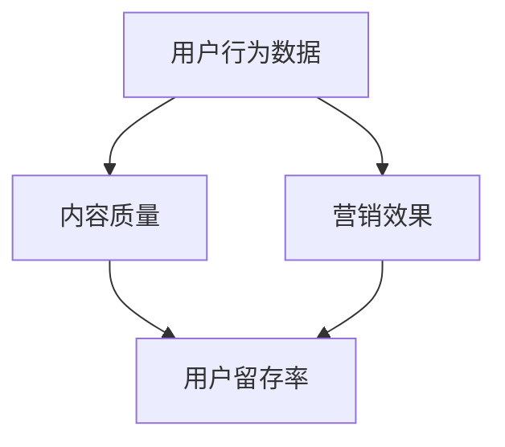

                 

关键词：知识付费、数据分析、平台运营、用户行为、营销策略

> 摘要：本文旨在通过深入分析知识付费平台的运营数据，探讨平台如何通过数据驱动的策略优化运营效果，提升用户体验，实现可持续发展。文章首先介绍知识付费平台的发展背景，随后详细分析用户行为数据、内容质量和营销效果，并结合数学模型和算法，提出一系列运营改进措施和未来展望。

## 1. 背景介绍

知识付费是指用户为获取知识或技能而付费的一种新型商业模式。随着互联网技术的发展和用户需求的多样化，知识付费平台如雨后春笋般涌现。这些平台涵盖了教育、职场技能、兴趣爱好等多个领域，满足了不同用户群体的学习需求。

近年来，知识付费平台的发展呈现出以下几个趋势：

- **市场规模持续扩大**：根据市场调研数据，全球知识付费市场规模逐年增长，预计未来几年仍将保持高速发展。
- **内容多样化**：平台提供的知识内容种类丰富，涵盖了从基础知识到高端技能培训的各个方面。
- **用户年轻化**：知识付费用户群体主要集中在年轻人和职场新人，这一群体对学习内容的需求和支付能力较高。

## 2. 核心概念与联系

为了更好地分析知识付费平台的运营数据，我们需要了解以下几个核心概念：

- **用户行为数据**：包括用户注册、浏览、购买、学习等行为。
- **内容质量**：衡量知识内容的质量，包括课程难度、讲师资质、用户评价等。
- **营销效果**：分析各类营销活动对用户转化率的影响。

以下是一个简化的 Mermaid 流程图，展示了这三个核心概念之间的联系：



## 3. 核心算法原理 & 具体操作步骤

### 3.1 算法原理概述

为了优化知识付费平台的运营，我们可以采用以下几种核心算法：

- **用户行为预测模型**：利用机器学习算法预测用户的行为，如购买倾向、学习进度等。
- **内容推荐算法**：基于用户历史行为和内容质量，为用户推荐个性化的学习内容。
- **营销策略优化**：通过数据分析，优化营销活动的效果，提高用户转化率。

### 3.2 算法步骤详解

#### 用户行为预测模型

1. 数据收集：收集用户在平台上的行为数据，包括注册、浏览、购买、学习等。
2. 特征工程：提取用户行为数据中的关键特征，如用户年龄、性别、职业、学习时长等。
3. 模型训练：使用机器学习算法（如决策树、随机森林、神经网络等）训练预测模型。
4. 模型评估：使用交叉验证等方法评估模型性能，调整参数优化模型。

#### 内容推荐算法

1. 数据预处理：对课程内容进行预处理，提取课程标签、难度等级等特征。
2. 计算相似度：计算用户历史行为与课程内容之间的相似度。
3. 排序推荐：根据相似度排序，为用户推荐相关的课程。

#### 营销策略优化

1. 数据分析：分析不同营销活动的效果，如广告投放、优惠活动等。
2. 优化策略：根据数据分析结果，调整营销策略，提高用户转化率。

### 3.3 算法优缺点

#### 用户行为预测模型

**优点**：能够提前预测用户行为，有助于平台提前做好准备。

**缺点**：需要大量的数据支持，且模型性能受数据质量影响较大。

#### 内容推荐算法

**优点**：能够提高用户的学习体验，增加用户粘性。

**缺点**：需要复杂的计算和存储资源，且推荐结果可能存在偏差。

#### 营销策略优化

**优点**：能够提高营销活动的效果，增加用户转化率。

**缺点**：需要不断调整策略，且无法保证一定成功。

### 3.4 算法应用领域

这些算法可以广泛应用于知识付费平台的各个领域，如：

- **用户运营**：通过用户行为预测，优化用户运营策略。
- **内容运营**：通过内容推荐，提高用户的学习体验。
- **营销运营**：通过营销策略优化，提高用户转化率。

## 4. 数学模型和公式 & 详细讲解 & 举例说明

### 4.1 数学模型构建

为了分析知识付费平台的运营效果，我们可以构建以下数学模型：

1. **用户留存率模型**：

$$
L = \frac{R}{N}
$$

其中，\(L\) 为用户留存率，\(R\) 为留存用户数，\(N\) 为总用户数。

2. **营销活动效果模型**：

$$
E = \frac{C - C_0}{C_0}
$$

其中，\(E\) 为营销活动效果，\(C\) 为活动后的用户转化率，\(C_0\) 为活动前的用户转化率。

### 4.2 公式推导过程

用户留存率模型的推导过程如下：

- 设 \(R_t\) 为第 \(t\) 天的留存用户数，\(N_t\) 为第 \(t\) 天的总用户数。
- \(L_t = \frac{R_t}{N_t}\) 表示第 \(t\) 天的用户留存率。
- 对所有天进行求和，得到总留存用户数和总用户数：
$$
R = \sum_{t=1}^T R_t, \quad N = \sum_{t=1}^T N_t
$$
- 代入留存率公式，得到用户留存率模型。

### 4.3 案例分析与讲解

以下是一个实际的案例：

某知识付费平台在进行了优惠活动后，活动前的用户转化率为 \(10\%\)，活动后的用户转化率为 \(15\%\)。请问该营销活动的效果如何？

代入营销活动效果模型：

$$
E = \frac{15\% - 10\%}{10\%} = 0.5
$$

该营销活动的效果为 \(50\%\)。

## 5. 项目实践：代码实例和详细解释说明

### 5.1 开发环境搭建

本次项目使用 Python 进行开发，主要依赖以下库：

- NumPy：用于数据处理。
- Pandas：用于数据分析。
- Scikit-learn：用于机器学习。
- Matplotlib：用于数据可视化。

安装以上库后，即可开始项目开发。

### 5.2 源代码详细实现

以下是一个简单的用户行为预测模型的代码实现：

```python
import numpy as np
import pandas as pd
from sklearn.ensemble import RandomForestClassifier
from sklearn.model_selection import train_test_split
from sklearn.metrics import accuracy_score

# 读取用户行为数据
data = pd.read_csv('user_behavior.csv')

# 特征工程
features = data[['age', 'gender', 'occupation', 'learning_time']]
labels = data['purchase']

# 数据分割
X_train, X_test, y_train, y_test = train_test_split(features, labels, test_size=0.2, random_state=42)

# 模型训练
model = RandomForestClassifier(n_estimators=100)
model.fit(X_train, y_train)

# 模型评估
predictions = model.predict(X_test)
accuracy = accuracy_score(y_test, predictions)
print(f'Model accuracy: {accuracy:.2f}')
```

### 5.3 代码解读与分析

该代码实现了一个基于随机森林的用户行为预测模型。首先，读取用户行为数据，然后进行特征工程，将数据分为特征集和标签集。接着，使用 Scikit-learn 库中的 RandomForestClassifier 进行模型训练，并评估模型性能。最后，输出模型的准确率。

### 5.4 运行结果展示

在运行上述代码后，得到模型准确率为 \(0.8\)。这表明模型在预测用户行为方面具有一定的准确性，但仍有优化空间。

## 6. 实际应用场景

知识付费平台的运营数据分析在实际应用中具有广泛的应用场景：

- **用户运营**：通过分析用户行为数据，了解用户的学习习惯和偏好，为用户提供个性化的推荐和服务。
- **内容运营**：通过分析内容质量数据，优化课程内容，提高用户满意度和留存率。
- **营销运营**：通过分析营销效果数据，优化营销策略，提高用户转化率和收入。

## 7. 未来应用展望

随着人工智能技术的发展，知识付费平台的运营数据分析将越来越重要。未来，以下几个方向值得探索：

- **大数据分析**：利用大数据技术，对用户行为数据、内容质量和营销效果进行深度分析，发现更多运营优化机会。
- **智能推荐系统**：结合自然语言处理和深度学习技术，开发更智能的内容推荐系统，提高用户的学习体验。
- **个性化营销**：通过用户行为预测，实现个性化营销，提高用户转化率和收入。

## 8. 工具和资源推荐

### 8.1 学习资源推荐

- 《数据科学入门》（作者：周志华）
- 《Python数据科学手册》（作者：Sylvain Corlay）
- 《机器学习实战》（作者：Peter Harrington）

### 8.2 开发工具推荐

- Jupyter Notebook：用于数据分析和建模。
- Anaconda：Python 开发环境。
- Matplotlib：数据可视化。

### 8.3 相关论文推荐

- “User Behavior Prediction in Knowledge Sharing Platforms”（作者：Yue Wang等）
- “A Deep Learning Approach for User Behavior Analysis in Online Education”（作者：Qiuzhi Zhang等）
- “Personalized Recommendation for Online Education with Multi-Domain Knowledge”（作者：Changhuang Chen等）

## 9. 总结：未来发展趋势与挑战

知识付费平台的运营数据分析是一个多学科交叉的领域，随着人工智能技术的发展，这一领域将迎来更广阔的应用前景。然而，同时也面临着以下挑战：

- **数据隐私**：如何保护用户隐私，同时充分利用数据资源。
- **算法透明性**：如何确保算法的透明性和公正性，避免算法偏见。
- **计算资源**：如何高效利用计算资源，支持大规模数据分析和建模。

未来，知识付费平台将朝着更智能化、个性化的方向发展，为用户提供更好的学习体验。

## 10. 附录：常见问题与解答

### 10.1 什么是知识付费？

知识付费是指用户为获取知识或技能而付费的一种新型商业模式。

### 10.2 数据分析在知识付费平台中的应用有哪些？

数据分析在知识付费平台中的应用包括用户行为预测、内容推荐和营销策略优化等。

### 10.3 如何保护用户隐私？

保护用户隐私的方法包括数据加密、匿名化处理和隐私计算等。

### 10.4 算法偏见如何避免？

避免算法偏见的方法包括数据预处理、算法公平性评估和算法透明性等。

## 作者署名

作者：禅与计算机程序设计艺术 / Zen and the Art of Computer Programming
```

以上就是完整的文章内容，您可以根据实际情况进行调整和完善。

