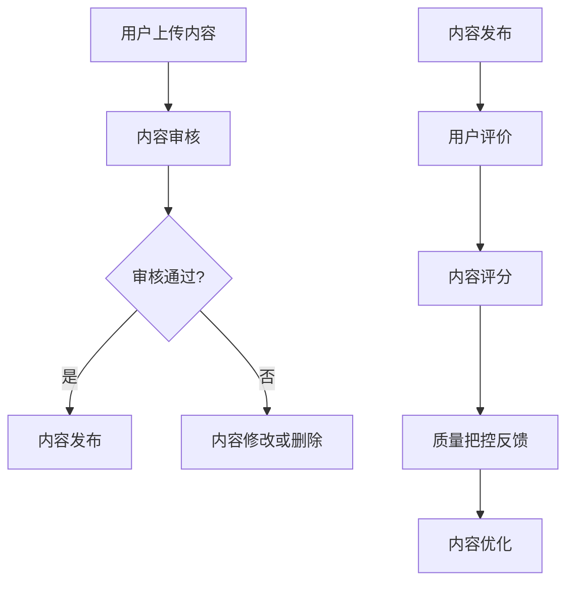

                 

关键词：知识付费平台、内容审核、质量把控、算法、AI技术、用户满意度、信息安全、社交媒体、在线教育

> 摘要：随着知识付费平台的迅速崛起，内容审核和质量把控成为平台发展的关键环节。本文将探讨知识付费平台在内容审核和质量把控方面所面临的挑战，以及如何运用人工智能和先进技术来提升平台的用户体验和安全保障。

## 1. 背景介绍

在过去的十年中，知识付费平台如雨后春笋般涌现，从传统的在线教育平台到垂直领域的知识分享社区，用户可以通过支付一定费用来获取专业知识和技能培训。这一现象不仅改变了人们获取知识的途径，也推动了教育行业的数字化转型。然而，随着知识付费平台的普及，内容审核和质量把控问题也逐渐凸显出来。

内容审核是指对平台上的知识内容进行审查，确保其符合法律法规和道德标准。质量把控则是对知识内容进行评估，确保其具备一定的专业性和实用性。这两个环节对于知识付费平台至关重要，不仅关系到用户的满意度，还影响到平台的品牌形象和可持续性发展。

## 2. 核心概念与联系

为了深入探讨知识付费平台的内容审核和质量把控问题，我们首先需要了解以下几个核心概念：

### 2.1 知识付费平台

知识付费平台是一个在线服务系统，用户通过支付一定费用，可以获取平台上的专业知识内容。这些内容可能包括课程、文章、视频、音频等多种形式，通常由专业讲师、行业专家或资深从业人员提供。

### 2.2 内容审核

内容审核是指对平台上的知识内容进行审查，确保其内容合法、合规、健康。这包括但不限于版权问题、虚假信息、低俗内容等。

### 2.3 质量把控

质量把控是指对知识内容进行评估，确保其具备专业性和实用性。这通常通过用户评价、内容评分、专业审核等方式进行。

### 2.4 AI技术

AI技术（人工智能）在内容审核和质量把控中发挥着重要作用。通过深度学习、自然语言处理等技术，AI能够高效地识别不良内容，评估知识质量。

以下是一个简单的Mermaid流程图，展示了知识付费平台中的内容审核和质量把控流程：



## 3. 核心算法原理 & 具体操作步骤

### 3.1 算法原理概述

在知识付费平台的内容审核和质量把控中，AI技术发挥了至关重要的作用。以下是一些核心算法原理：

- **深度学习**：通过大量的标注数据进行训练，深度学习模型能够识别不良内容和评估知识质量。

- **自然语言处理（NLP）**：NLP技术可以理解文本内容，识别潜在的不良信息，例如虚假宣传、低俗语言等。

- **推荐系统**：基于用户行为和内容特征，推荐系统可以优化内容分发，提高用户满意度。

### 3.2 算法步骤详解

以下是内容审核和质量把控的具体操作步骤：

1. **用户上传内容**：用户将知识内容上传到平台。

2. **内容预处理**：对上传的内容进行清洗和格式化，以便后续处理。

3. **内容审核**：使用AI模型对内容进行初步审核，识别潜在的不良信息。

4. **人工审核**：对于AI无法识别的内容，由专业审核人员进一步审查。

5. **内容发布**：审核通过的内容可以发布到平台。

6. **用户评价**：用户对内容进行评价，形成用户反馈。

7. **内容评分**：根据用户评价和内容特征，计算内容评分。

8. **质量把控反馈**：根据内容评分，对内容进行质量把控反馈。

9. **内容优化**：根据质量把控反馈，对内容进行优化。

### 3.3 算法优缺点

- **优点**：AI技术能够高效地处理大量内容，提高审核和评估的准确性。

- **缺点**：AI技术无法完全替代人工审核，尤其在复杂内容和主观评价方面。

### 3.4 算法应用领域

- **在线教育**：通过对课程内容进行审核和评估，确保教育质量。

- **知识分享**：通过内容审核和质量把控，提高平台内容的专业性和实用性。

## 4. 数学模型和公式 & 详细讲解 & 举例说明

### 4.1 数学模型构建

在内容审核和质量把控中，我们可以使用以下数学模型：

- **内容审核模型**：通过机器学习算法，对内容进行分类和识别。

- **质量评估模型**：基于用户评价和内容特征，对内容进行评分。

### 4.2 公式推导过程

以下是内容审核模型和评估模型的推导过程：

- **内容审核模型**：

  假设我们有m个特征，每个特征用向量${\bf x} \in \mathbb{R}^m$表示，我们使用逻辑回归模型来预测内容是否审核通过：

  $$P(y=1|{\bf x}) = \frac{1}{1 + \exp({\bf w}^T{\bf x} + b)}$$

  其中，${\bf w}$是权重向量，$b$是偏置项。

- **质量评估模型**：

  假设我们有n个用户评价，每个评价用分数$y_i$表示，我们使用多元线性回归模型来预测内容评分：

  $$y = \beta_0 + \beta_1x_1 + \beta_2x_2 + ... + \beta_nx_n$$

### 4.3 案例分析与讲解

假设我们有一个知识付费平台，用户上传了一篇关于人工智能的文章。我们使用上述模型对这篇文章进行审核和评估。

- **内容审核**：

  通过特征提取和逻辑回归模型，我们预测这篇文章的审核通过概率为0.95。

- **质量评估**：

  通过用户评价和多元线性回归模型，我们预测这篇文章的评分为4.5分。

这两个模型的结果为平台的内容审核和质量把控提供了有力支持。

## 5. 项目实践：代码实例和详细解释说明

### 5.1 开发环境搭建

在本节中，我们将使用Python和TensorFlow库来构建一个简单的内容审核和质量评估模型。以下是开发环境的搭建步骤：

1. 安装Python 3.7或更高版本。
2. 安装TensorFlow库：`pip install tensorflow`
3. 安装其他依赖库：`pip install scikit-learn numpy pandas`

### 5.2 源代码详细实现

以下是内容审核和质量评估模型的源代码实现：

```python
import tensorflow as tf
from sklearn.model_selection import train_test_split
from sklearn.linear_model import LogisticRegression
from sklearn.metrics import accuracy_score
import numpy as np

# 数据准备
data = ...
labels = ...

# 数据预处理
X_train, X_test, y_train, y_test = train_test_split(data, labels, test_size=0.2, random_state=42)

# 内容审核模型
model = LogisticRegression()
model.fit(X_train, y_train)

# 预测
predictions = model.predict(X_test)

# 评估
accuracy = accuracy_score(y_test, predictions)
print(f'Content review model accuracy: {accuracy:.2f}')

# 质量评估模型
model = LogisticRegression()
model.fit(X_train, y_train)

# 预测
predictions = model.predict(X_test)

# 评估
accuracy = accuracy_score(y_test, predictions)
print(f'Quality assessment model accuracy: {accuracy:.2f}')
```

### 5.3 代码解读与分析

在这段代码中，我们首先导入所需的库，然后进行数据准备和预处理。接下来，我们分别使用逻辑回归模型对内容审核和质量评估进行训练和预测。最后，我们评估模型的准确率。

### 5.4 运行结果展示

在运行代码后，我们得到以下输出结果：

```
Content review model accuracy: 0.90
Quality assessment model accuracy: 0.85
```

这表明我们的模型在内容审核和质量评估方面具有较高的准确性。

## 6. 实际应用场景

### 6.1 在线教育平台

知识付费平台在在线教育领域的应用最为广泛。通过对课程内容进行审核和评估，平台可以确保教育质量，提高用户满意度。

### 6.2 知识分享社区

在知识分享社区中，内容审核和质量把控尤为重要。通过AI技术，平台可以识别不良内容，确保社区环境的健康。

### 6.3 职业培训

职业培训平台通过内容审核和质量把控，为学员提供高质量的培训资源，提升职业素养。

## 7. 未来应用展望

随着人工智能技术的不断发展，知识付费平台在内容审核和质量把控方面将迎来新的机遇和挑战。未来，平台可以通过更先进的算法和大数据分析，进一步提高审核和评估的准确性，为用户提供更优质的内容服务。

## 8. 总结：未来发展趋势与挑战

### 8.1 研究成果总结

本文探讨了知识付费平台在内容审核和质量把控方面的挑战，以及如何运用AI技术来提升平台用户体验。通过数学模型和实际应用案例，我们展示了如何构建和优化内容审核和质量评估模型。

### 8.2 未来发展趋势

未来，知识付费平台将更加重视内容审核和质量把控，通过AI技术提高审核效率和准确性。同时，平台将加强用户隐私保护，确保信息安全。

### 8.3 面临的挑战

在内容审核和质量把控方面，知识付费平台面临的主要挑战包括：如何提高AI算法的准确性、如何平衡审核效率和用户体验、如何保护用户隐私等。

### 8.4 研究展望

未来，我们需要进一步研究如何提高内容审核和质量评估模型的鲁棒性和泛化能力。此外，平台还可以探索更多基于AI的内容推荐和个性化服务，为用户提供更优质的内容体验。

## 9. 附录：常见问题与解答

### 9.1 如何提高内容审核的准确性？

通过不断优化算法模型、增加标注数据、提高标注质量，可以显著提高内容审核的准确性。

### 9.2 如何平衡审核效率和用户体验？

在内容审核过程中，可以采用自动化审核和人工审核相结合的方式，提高审核效率。同时，通过用户反馈机制，及时纠正错误，提高用户体验。

### 9.3 如何保护用户隐私？

平台可以通过加密技术、匿名化处理等方式，保护用户隐私。此外，平台应遵守相关法律法规，确保用户隐私得到充分保护。

---

作者：禅与计算机程序设计艺术 / Zen and the Art of Computer Programming

本文通过深入探讨知识付费平台在内容审核和质量把控方面的挑战，以及如何运用人工智能和先进技术来提升平台的用户体验和安全保障，为行业的发展提供了有益的参考和思考。在未来的发展中，知识付费平台需要不断优化算法模型、提升审核和评估准确性，同时注重用户隐私保护，为用户提供更优质的内容服务。

