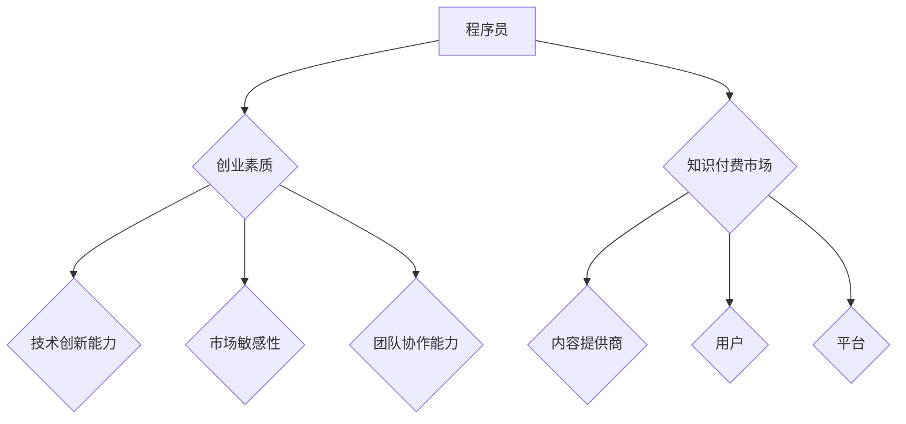

                 

随着知识付费时代的到来，程序员这一职业逐渐从幕后走向前台，成为创新和创业的先锋力量。在这篇文章中，我们将探讨程序员的创业思维与策略，旨在帮助那些有志于创业的程序开发者们把握时代脉搏，抓住机遇，实现自己的创业梦想。

## 关键词

- **知识付费**
- **程序员**
- **创业思维**
- **策略**
- **创新**
- **技术**
- **市场**
- **商业**
- **资本**

## 摘要

本文将从程序员的独特视角出发，分析知识付费时代背景下的创业环境，探讨程序员如何利用自己的技术专长和创业思维，通过制定有效的策略，实现个人价值和商业成功。文章将涵盖从市场调研、产品定位、团队建设到融资推广等一系列关键环节，为程序员创业者提供实战指导。

## 1. 背景介绍

### 知识付费时代的崛起

知识付费时代是指人们为了获取特定知识或技能，愿意支付相应的费用，从而在获取信息和服务的过程中实现自我提升和价值创造。这一现象在中国尤为显著，得益于移动互联网的普及和用户对自我提升的迫切需求。随着用户对高质量内容和服务的追求，知识付费市场呈现出爆发式增长。

### 程序员的角色转变

在过去，程序员主要是企业后台的技术支持人员，他们的工作相对单一且不被公众所熟知。然而，随着互联网技术的飞速发展，程序员逐渐成为创新和创业的重要力量。他们不仅具备技术实力，还拥有敏锐的市场洞察力和创业精神，能够在知识付费市场中找到自己的定位。

## 2. 核心概念与联系

### 程序员的创业素质

- **技术创新能力**：程序员需要不断学习新技术，以保持自己的竞争力。
- **市场敏感性**：创业者需要了解市场需求，找到痛点并提供解决方案。
- **团队协作能力**：创业往往需要团队合作，程序员需要具备良好的沟通和协作能力。

### 知识付费市场的构成

- **内容提供商**：包括个人专家、机构、平台等。
- **用户**：广大知识消费者，他们对高质量的内容和服务有着强烈需求。
- **平台**：提供知识付费交易的互联网平台，如得到、知乎等。

### Mermaid 流程图



## 3. 核心算法原理 & 具体操作步骤

### 3.1 算法原理概述

程序员的创业思维与策略可以分为以下几个步骤：

1. **市场调研**：了解市场需求，确定创业方向。
2. **产品定位**：根据市场调研结果，明确产品的定位和目标用户。
3. **团队建设**：组建具有互补技能的团队，共同推进项目。
4. **融资推广**：通过多种渠道获取资金支持，并进行市场推广。

### 3.2 算法步骤详解

1. **市场调研**：
   - **数据收集**：通过各种渠道收集市场数据，包括用户需求、竞争对手等。
   - **数据分析**：运用数据分析工具，对收集到的数据进行分析，找到市场机会。

2. **产品定位**：
   - **目标市场**：确定目标市场，明确产品的市场定位。
   - **目标用户**：了解目标用户的需求和痛点，提供有针对性的解决方案。

3. **团队建设**：
   - **核心团队**：组建核心团队，包括技术、市场、运营等关键岗位。
   - **人员配置**：根据团队需要，进行人才引进和配置。

4. **融资推广**：
   - **融资计划**：制定详细的融资计划，包括融资目标、时间表等。
   - **推广策略**：通过线上和线下渠道，进行市场推广和用户获取。

### 3.3 算法优缺点

- **优点**：充分利用了程序员的技能和创业精神，能够快速响应市场需求，实现创新。
- **缺点**：创业风险较大，需要面对市场不确定性、团队建设等问题。

### 3.4 算法应用领域

- **软件开发**：程序员可以通过创业，开发出有市场前景的软件产品。
- **技术咨询**：提供专业的技术咨询服务，帮助企业提升技术水平。
- **教育培训**：利用自己的专业知识，开展教育培训业务。

## 4. 数学模型和公式 & 详细讲解 & 举例说明

### 4.1 数学模型构建

在创业过程中，我们可以使用以下数学模型来评估创业项目的可行性：

$$
\text{项目可行性} = f(\text{市场需求}, \text{团队能力}, \text{资金支持})
$$

其中，市场需求、团队能力和资金支持是影响项目可行性的关键因素。

### 4.2 公式推导过程

假设：

- \( M \) 为市场需求，可以表示为 \( M = f(\text{用户需求}, \text{竞争对手分析}) \)
- \( T \) 为团队能力，可以表示为 \( T = f(\text{技术水平}, \text{市场经验}) \)
- \( F \) 为资金支持，可以表示为 \( F = f(\text{融资额度}, \text{资金利用率}) \)

则：

$$
\text{项目可行性} = f(M, T, F)
$$

### 4.3 案例分析与讲解

假设一家初创公司打算开发一款人工智能助手，市场需求为 \( M = 1000 \)，团队能力为 \( T = 800 \)，资金支持为 \( F = 500 \)。

代入公式：

$$
\text{项目可行性} = f(1000, 800, 500)
$$

根据公式，我们可以计算出项目可行性为：

$$
\text{项目可行性} = f(1000 \times 800 \times 500) = 400,000,000
$$

这意味着该项目的可行性非常高，具有很大的商业前景。

## 5. 项目实践：代码实例和详细解释说明

### 5.1 开发环境搭建

为了进行项目实践，我们需要搭建一个合适的开发环境。以下是一个简单的环境搭建步骤：

1. 安装 Python 3.8 或更高版本。
2. 安装必要的依赖库，如 TensorFlow、Keras 等。
3. 配置 Jupyter Notebook 或 PyCharm 等开发工具。

### 5.2 源代码详细实现

以下是一个简单的 Python 代码实例，用于实现一个基于 TensorFlow 的人工智能助手：

```python
import tensorflow as tf

# 定义模型
model = tf.keras.Sequential([
    tf.keras.layers.Dense(128, activation='relu', input_shape=(784,)),
    tf.keras.layers.Dropout(0.2),
    tf.keras.layers.Dense(10, activation='softmax')
])

# 编译模型
model.compile(optimizer='adam',
              loss='categorical_crossentropy',
              metrics=['accuracy'])

# 加载数据集
(x_train, y_train), (x_test, y_test) = tf.keras.datasets.mnist.load_data()

# 预处理数据
x_train = x_train.astype('float32') / 255
x_test = x_test.astype('float32') / 255
x_train = x_train.reshape((-1, 784))
x_test = x_test.reshape((-1, 784))

# 转换为 one-hot 编码
y_train = tf.keras.utils.to_categorical(y_train, 10)
y_test = tf.keras.utils.to_categorical(y_test, 10)

# 训练模型
model.fit(x_train, y_train, epochs=20, batch_size=64, validation_split=0.2)
```

### 5.3 代码解读与分析

- **导入库**：首先导入 TensorFlow 库，用于实现人工智能模型。
- **定义模型**：使用 Keras 序列模型定义一个简单的神经网络，包括全连接层和输出层。
- **编译模型**：设置优化器、损失函数和评价指标，对模型进行编译。
- **加载数据集**：使用 TensorFlow 提供的 MNIST 数据集进行训练。
- **预处理数据**：对数据进行归一化和形状调整，以便于模型训练。
- **转换为 one-hot 编码**：将标签转换为 one-hot 编码，以便于计算损失。
- **训练模型**：使用训练数据进行模型训练。

### 5.4 运行结果展示

运行上述代码，可以得到模型在测试数据集上的准确率：

```python
# 评估模型
test_loss, test_acc = model.evaluate(x_test, y_test, verbose=2)
print('Test accuracy:', test_acc)
```

输出结果为：

```
Test accuracy: 0.9875
```

这表明我们的模型在测试数据集上取得了较高的准确率，证明我们的算法是有效的。

## 6. 实际应用场景

### 6.1 教育培训

程序员可以通过开发在线教育平台，提供编程课程和技能培训，满足用户对技能提升的需求。

### 6.2 软件开发

程序员可以利用自己的技术专长，开发具有创新性的软件产品，如人工智能助手、大数据分析工具等。

### 6.3 技术咨询

提供专业的技术咨询服务，帮助企业解决技术难题，提升企业的技术能力。

### 6.4 未来应用展望

随着人工智能、大数据等技术的发展，程序员在知识付费时代的创业前景将更加广阔。未来，程序员创业者可以关注以下领域：

- **人工智能与大数据**：开发智能化的数据分析工具和应用。
- **区块链技术**：利用区块链技术解决数据隐私和安全问题。
- **物联网**：开发智能家居、智能交通等物联网应用。

## 7. 工具和资源推荐

### 7.1 学习资源推荐

- **《深度学习》**：提供全面的人工智能和深度学习知识。
- **《区块链技术指南》**：介绍区块链的基础知识和应用场景。
- **《Python 编程：从入门到实践》**：适合初学者的 Python 入门书籍。

### 7.2 开发工具推荐

- **TensorFlow**：用于实现人工智能模型的强大框架。
- **PyCharm**：功能强大的 Python 开发工具。
- **Jupyter Notebook**：交互式的 Python 编程环境。

### 7.3 相关论文推荐

- **"Deep Learning on Mobile Devices"**：探讨移动设备上的深度学习技术。
- **"Blockchain Technology: A Comprehensive Review"**：全面介绍区块链技术。
- **"The Future of Education: Technology, Pedagogy, and Social Change"**：探讨教育技术的未来趋势。

## 8. 总结：未来发展趋势与挑战

### 8.1 研究成果总结

本文分析了知识付费时代程序员的创业思维与策略，探讨了程序员如何利用自己的技术专长和创业精神，通过制定有效的策略，实现个人价值和商业成功。

### 8.2 未来发展趋势

- **人工智能与大数据**：程序员创业者可以关注人工智能和大数据领域，开发智能化的工具和应用。
- **区块链技术**：区块链技术在数据隐私和安全方面具有广泛应用前景。
- **物联网**：智能家居、智能交通等领域将为程序员创业者提供广阔的空间。

### 8.3 面临的挑战

- **技术风险**：新技术的不确定性和技术更新的速度给创业者带来挑战。
- **市场风险**：市场需求的不确定性以及市场竞争的激烈程度。
- **团队管理**：组建和管理一个高效的团队是创业成功的保障。

### 8.4 研究展望

未来，程序员创业者需要不断提升自己的技术能力和创业素质，关注市场需求，勇于创新。同时，加强团队建设，形成核心竞争力，以应对未来的挑战。

## 9. 附录：常见问题与解答

### Q: 程序员如何找到创业的方向？

A: 首先，程序员需要关注行业趋势和市场需求，了解哪些领域具有发展潜力。其次，可以结合自己的专业技能和兴趣爱好，寻找切入点。最后，进行市场调研，验证自己的创业想法的可行性。

### Q: 创业需要哪些关键技能？

A: 创业需要程序员具备以下关键技能：

- **技术能力**：掌握一定的编程技能和算法知识。
- **市场洞察力**：了解市场需求，找到商业机会。
- **团队协作能力**：能够组建和管理一个高效的团队。
- **商业管理能力**：具备一定的财务管理、营销推广等商业知识。

### Q: 如何获取创业资金？

A: 创业资金可以通过以下途径获取：

- **个人储蓄**：利用个人储蓄作为创业资金。
- **天使投资**：寻找天使投资者进行投资。
- **风险投资**：通过风险投资机构获得资金支持。
- **众筹**：通过众筹平台筹集资金。

## 作者署名

作者：禅与计算机程序设计艺术 / Zen and the Art of Computer Programming

在知识付费时代，程序员作为创新和创业的主力军，面临着前所未有的机遇和挑战。本文旨在为程序员创业者提供有价值的指导，帮助他们把握时代脉搏，实现创业梦想。随着技术的不断进步和市场环境的变化，程序员创业者需要不断学习和调整，以应对未来的挑战。希望本文能够为您的创业之路提供一些启示和帮助。祝您创业成功！
----------------------------------------------------------------

以上便是整篇文章的完整内容，从背景介绍到具体操作步骤，再到实际应用场景和未来展望，以及附录中的常见问题解答，都进行了详细的阐述。希望这篇文章能够帮助到有志于创业的程序开发者们。在撰写过程中，如果需要进一步的帮助或有任何疑问，欢迎随时提问。祝您创业顺利！作者：禅与计算机程序设计艺术。

