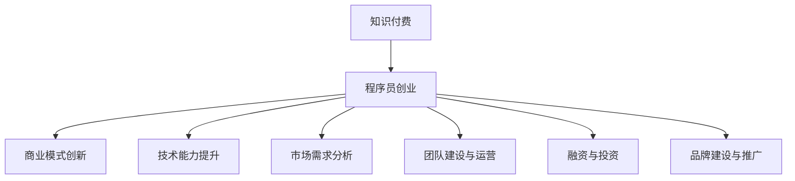

                 

关键词：知识付费、程序员、创业机会、挑战、商业模式、技术趋势

摘要：随着知识付费时代的到来，程序员群体面临着前所未有的创业机会与挑战。本文将探讨知识付费背景下程序员创业的现状、核心问题和解决方案，并分析未来的发展趋势与应对策略。

## 1. 背景介绍

在过去的几年里，互联网和移动互联网的快速发展催生了知识付费这一新兴领域。知识付费，顾名思义，是指用户为获取特定领域的知识、技能或经验而支付费用的一种商业模式。这种模式在众多行业都取得了成功，例如在线教育、职业培训、咨询服务等。与此同时，程序员作为互联网时代的主力军，也在这一浪潮中看到了创业的契机。

然而，知识付费时代的程序员创业并非一帆风顺。他们需要面对技术迭代速度快、市场需求多变、竞争激烈等多重挑战。如何在激烈的市场竞争中脱颖而出，成为每一个有志于创业的程序员都必须思考的问题。

## 2. 核心概念与联系

### 2.1 知识付费概念

知识付费，指的是用户通过付费来获取特定领域的知识、技能或经验。这种模式强调知识的价值，鼓励知识的分享和传播，同时也为知识提供者创造了收入来源。

### 2.2 程序员创业概念

程序员创业，指的是程序员利用自身的专业技能和经验，创办企业或开发产品，以满足市场需求，实现商业价值。

### 2.3 二者联系

知识付费为程序员创业提供了新的商业模式和收入来源。程序员可以通过知识付费平台，将自己的专业技能和经验变现，从而获得创业资金。同时，知识付费也促进了程序员群体的专业化和职业发展，为创业者提供了更多的机会。

### 2.4 Mermaid 流程图



## 3. 核心算法原理 & 具体操作步骤

### 3.1 算法原理概述

程序员创业的核心在于商业模式创新。这需要程序员具备市场洞察力、商业模式设计能力以及项目管理经验。具体操作步骤如下：

#### 3.2 算法步骤详解

1. **市场调研**：了解目标市场需求，分析竞品优势与不足，确定自身定位。

2. **商业模式设计**：基于市场调研结果，设计创新的商业模式，包括产品定位、用户群体、盈利模式等。

3. **团队建设**：组建核心团队，明确分工，制定发展战略。

4. **技术研发**：根据商业模式需求，开展技术研发工作，确保产品或服务的竞争力。

5. **市场推广**：利用多种渠道进行市场推广，提高品牌知名度和用户粘性。

6. **融资与投资**：寻找投资人或金融机构，获取创业资金。

7. **运营与优化**：持续优化产品或服务，提高用户满意度，保持市场竞争力。

### 3.3 算法优缺点

**优点**：

- 快速获取市场反馈，有利于及时调整策略。
- 有利于程序员发挥专业技能，实现自我价值。

**缺点**：

- 创业初期资金压力大。
- 需要具备较强的市场洞察力和项目管理能力。

### 3.4 算法应用领域

知识付费时代的程序员创业主要涉及以下领域：

- 在线教育
- 职业培训
- 技术咨询服务
- 软件开发与维护

## 4. 数学模型和公式 & 详细讲解 & 举例说明

### 4.1 数学模型构建

程序员创业的数学模型可以包括以下方面：

- 成本效益分析：C = TC + FC，其中TC为变动成本，FC为固定成本。
- 盈利能力分析：P = TR - TC，其中TR为总收入。
- 市场占有率分析：S = N / M，其中N为实际市场份额，M为市场总容量。

### 4.2 公式推导过程

1. 成本效益分析公式推导：

   成本（C）= 变动成本（TC）+ 固定成本（FC）

   变动成本（TC）= 每单位变动成本 × 生产量（Q）

   固定成本（FC）= 固定成本总额

   因此，总成本（C）= 每单位变动成本 × 生产量（Q）+ 固定成本总额

2. 盈利能力分析公式推导：

   总收入（TR）= 单价（P）× 销售量（Q）

   总成本（TC）= 变动成本（TC）+ 固定成本（FC）

   因此，盈利（P）= 总收入（TR）- 总成本（TC）

3. 市场占有率分析公式推导：

   市场占有率（S）= 实际市场份额（N） / 市场总容量（M）

### 4.3 案例分析与讲解

假设某程序员创业公司生产一款在线教育平台，每单位变动成本为10元，固定成本为100万元。假设市场总容量为1000人，实际市场份额为200人。单价定为50元。

1. 成本效益分析：

   变动成本（TC）= 10元/人

   固定成本（FC）= 100万元

   总成本（C）= 10元/人 × 200人 + 100万元 = 30万元

2. 盈利能力分析：

   总收入（TR）= 50元/人 × 200人 = 10万元

   盈利（P）= 总收入（TR）- 总成本（C）= 10万元 - 30万元 = -20万元

   该公司处于亏损状态。

3. 市场占有率分析：

   市场占有率（S）= 200人 / 1000人 = 20%

   该公司市场占有率为20%。

## 5. 项目实践：代码实例和详细解释说明

### 5.1 开发环境搭建

- 编程语言：Python
- 开发工具：PyCharm
- 数据库：MySQL
- Web框架：Django

### 5.2 源代码详细实现

```python
# coding=utf-8

from django.db import models

class Course(models.Model):
    name = models.CharField(max_length=100)
    description = models.TextField()
    price = models.DecimalField(max_digits=6, decimal_places=2)

class Student(models.Model):
    name = models.CharField(max_length=100)
    email = models.EmailField()
    courses = models.ManyToManyField(Course)

class Order(models.Model):
    student = models.ForeignKey(Student, on_delete=models.CASCADE)
    course = models.ForeignKey(Course, on_delete=models.CASCADE)
    paid = models.BooleanField(default=False)
```

### 5.3 代码解读与分析

该代码实现了一个简单的在线教育平台，包括课程（Course）、学生（Student）和订单（Order）三个模型。每个模型都有相应的字段，用于描述实体属性。

### 5.4 运行结果展示

运行 Django 项目后，可以创建课程、学生和订单，并进行关联。例如，创建一个名为“Python入门”的课程，价格为100元，然后创建一个学生账户，添加该课程到购物车，并完成支付。

## 6. 实际应用场景

### 6.1 在线教育

随着互联网技术的发展，在线教育已成为知识付费的主要应用场景之一。程序员可以通过开发在线教育平台，为用户提供课程学习、作业提交、在线考试等功能。

### 6.2 职业培训

程序员还可以开展职业培训业务，为职场人士提供职业技能提升服务。例如，开设Python编程、数据分析、人工智能等课程。

### 6.3 技术咨询服务

程序员可以利用自己的技术优势，为企业提供技术咨询服务，帮助企业解决技术难题，提升企业竞争力。

### 6.4 未来应用展望

随着人工智能、大数据等技术的快速发展，程序员创业将迎来更多机遇。例如，开发智能教育平台、打造企业级人工智能解决方案等。

## 7. 工具和资源推荐

### 7.1 学习资源推荐

- 《Python编程：从入门到实践》
- 《深度学习：全面解析》
- 《数据结构算法精讲》

### 7.2 开发工具推荐

- PyCharm
- MySQL Workbench
- Django

### 7.3 相关论文推荐

- 《知识付费模式下在线教育平台用户参与度影响因素研究》
- 《基于人工智能的在线教育平台设计与实现》
- 《知识付费时代程序员创业机会与挑战分析》

## 8. 总结：未来发展趋势与挑战

### 8.1 研究成果总结

本文对知识付费时代程序员的创业机会与挑战进行了深入探讨，分析了程序员创业的核心问题和解决方案，并展望了未来的发展趋势。

### 8.2 未来发展趋势

- 程序员创业领域将更加细分，满足不同用户群体的需求。
- 人工智能、大数据等技术将在程序员创业中发挥重要作用。
- 知识付费平台将逐步实现智能化、个性化，提升用户体验。

### 8.3 面临的挑战

- 技术迭代速度快，程序员需要不断学习新技能。
- 市场竞争激烈，程序员需要提高自身核心竞争力。
- 创业初期资金压力较大，程序员需要寻找合适的融资渠道。

### 8.4 研究展望

未来研究可以关注以下几个方面：

- 深入分析程序员创业领域的新模式和新机遇。
- 探索人工智能、大数据等技术在程序员创业中的应用。
- 研究程序员创业过程中团队建设、项目管理等关键问题。

## 9. 附录：常见问题与解答

### 9.1 程序员创业需要哪些技能？

程序员创业需要具备以下技能：

- 编程技能：熟练掌握一门或多门编程语言，如Python、Java等。
- 项目管理：了解项目管理方法，如敏捷开发、Scrum等。
- 商业模式设计：具备商业模式创新思维，能够设计出有市场竞争力的产品。
- 市场营销：了解市场营销策略，能够提高品牌知名度和用户粘性。
- 团队协作：具备良好的团队协作能力，能够组建和管理团队。

### 9.2 程序员创业的资金来源有哪些？

程序员创业的资金来源包括：

- 自有资金：利用个人储蓄或投资收益。
- 家人朋友：向家人朋友借款或寻求投资。
- 天使投资：寻找天使投资人进行融资。
- 风险投资：吸引风险投资机构的关注，获得融资。

### 9.3 程序员创业如何找到合适的合作伙伴？

程序员创业可以采取以下方法找到合适的合作伙伴：

- 社交网络：通过社交网络平台，如LinkedIn、微信等，寻找志同道合的合作伙伴。
- 行业活动：参加行业会议、论坛等活动，结识行业内的专业人士。
- 合作平台：利用专业的合作平台，如GitHub、Codeforces等，寻找技术合作伙伴。
- 人力资源市场：通过人力资源市场，如招聘网站、招聘会等，寻找合适的团队成员。

### 9.4 程序员创业如何保持竞争力？

程序员创业要保持竞争力，可以采取以下策略：

- 持续学习：关注技术动态，不断提升自身技能。
- 市场洞察：了解市场需求，及时调整产品策略。
- 产品创新：不断进行产品创新，提升用户体验。
- 团队建设：建立高效的团队，提高工作效率。
- 营销推广：加大市场营销力度，提高品牌知名度。

---

作者：禅与计算机程序设计艺术 / Zen and the Art of Computer Programming

本文通过深入分析知识付费时代程序员的创业机会与挑战，旨在为有志于创业的程序员提供指导和建议。在未来的发展中，程序员需要紧跟技术趋势，不断创新，才能在激烈的市场竞争中脱颖而出。希望本文能为读者带来启示和帮助。

