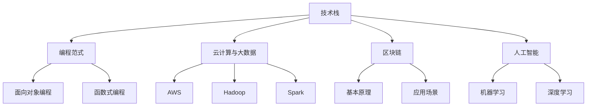

                 

关键词：知识付费、程序员、技术发展、职业规划、技能提升、新兴技术

> 摘要：随着知识付费时代的到来，程序员面临着新的职业挑战和发展机遇。本文将深入探讨程序员在这一时代的发展方向，分析核心技能的演变，探讨新兴技术的应用，并提供实用的职业规划建议，以帮助程序员在快速变化的技术领域中保持竞争力。

## 1. 背景介绍

知识付费时代，是指信息传播和知识获取方式发生重大变革的时期。在这个时代，知识和技能的获取不再仅仅依赖于免费资源和传统的教育体系，而是通过付费的方式，如在线课程、专业书籍、培训班等。这一现象在全球范围内日益普及，尤其是随着互联网技术的迅猛发展，知识付费平台如雨后春笋般涌现，成为知识传播和技能提升的重要渠道。

程序员作为知识付费时代的重要参与者，他们的职业发展也受到了深远的影响。一方面，他们需要不断学习新的技术，提升自身技能，以适应快速变化的技术需求；另一方面，他们也需要找到合适的知识付费资源，以优化学习效果，提高工作效率。因此，程序员在这一时代的发展方向显得尤为重要。

## 2. 核心概念与联系

为了更好地理解程序员在知识付费时代的发展方向，我们需要从以下几个核心概念入手：

### 2.1 技术栈

技术栈是指程序员掌握的各种编程语言、框架、工具和库的集合。随着技术的发展，程序员需要不断地更新和扩展自己的技术栈，以保持竞争力。

### 2.2 编程范式

编程范式是指编程的思维方式和方法论。例如，面向对象、函数式编程、逻辑编程等。不同的编程范式适用于不同的应用场景，程序员需要灵活运用，以解决复杂问题。

### 2.3 云计算与大数据

云计算和大数据是当前技术领域的热点。程序员需要掌握云计算的基础设施和服务，如AWS、Azure、Google Cloud等，以及大数据处理技术，如Hadoop、Spark等，以应对海量数据处理的挑战。

### 2.4 区块链

区块链技术以其去中心化、不可篡改的特性，正在改变金融、供应链等领域的业务模式。程序员需要了解区块链的基本原理和应用场景，为未来做好准备。

### 2.5 人工智能

人工智能是未来科技发展的核心驱动力之一。程序员需要掌握人工智能的基础知识，如机器学习、深度学习等，以及相关的编程框架和工具。

### 2.6 Mermaid 流程图

以下是一个Mermaid流程图，展示了程序员在知识付费时代需要掌握的核心技能和它们之间的联系：



## 3. 核心算法原理 & 具体操作步骤

### 3.1 算法原理概述

在知识付费时代，程序员需要掌握一系列核心算法，以应对不同的编程挑战。以下是几个常见的核心算法原理：

### 3.1.1 暴力解法

暴力解法是一种简单的算法思路，通过穷举所有可能的情况来解决问题。虽然这种方法在最坏情况下效率较低，但在某些简单问题中非常有效。

### 3.1.2 贪心算法

贪心算法是一种在每一步选择中都采取当前最优解的算法策略。这种方法适用于一些优化问题，如背包问题、最短路径问题等。

### 3.1.3 动态规划

动态规划是一种将复杂问题分解为多个简单子问题，并存储子问题解的算法方法。这种方法适用于一些具有重叠子问题的优化问题，如最长公共子序列、最值问题等。

### 3.2 算法步骤详解

以下是一个简单的动态规划算法示例：计算斐波那契数列。

```python
def fibonacci(n):
    if n <= 1:
        return n
    dp = [0] * n
    dp[0], dp[1] = 1, 1
    for i in range(2, n):
        dp[i] = dp[i-1] + dp[i-2]
    return dp[n-1]
```

### 3.3 算法优缺点

- **暴力解法**：简单易懂，适用于简单问题。但效率低，不适用于复杂问题。

- **贪心算法**：效率高，适用于优化问题。但可能存在局部最优解，不适用于所有问题。

- **动态规划**：适用于复杂问题，效率高。但实现较为复杂，需要理解子问题之间的关系。

### 3.4 算法应用领域

- **暴力解法**：适用于简单的编程竞赛题目。

- **贪心算法**：适用于背包问题、最短路径问题等。

- **动态规划**：适用于最值问题、最长公共子序列等。

## 4. 数学模型和公式 & 详细讲解 & 举例说明

### 4.1 数学模型构建

在编程中，数学模型是解决问题的重要工具。以下是一个简单的线性回归模型的数学模型构建：

- **目标函数**：\( J(\theta) = \frac{1}{2m} \sum_{i=1}^{m} (h_\theta(x^{(i)}) - y^{(i)})^2 \)

- **参数更新**：\( \theta_j := \theta_j - \alpha \frac{\partial J(\theta)}{\partial \theta_j} \)

### 4.2 公式推导过程

线性回归模型的推导过程涉及微积分和优化理论。以下是简要的推导过程：

- **损失函数**：\( L(y, \hat{y}) = \frac{1}{2} (y - \hat{y})^2 \)

- **目标函数**：\( J(\theta) = \frac{1}{m} \sum_{i=1}^{m} L(y^{(i)}, h_\theta(x^{(i)})) \)

- **梯度**：\( \nabla_{\theta} J(\theta) = \frac{1}{m} \sum_{i=1}^{m} \nabla_{\theta} L(y^{(i)}, h_\theta(x^{(i)})) \)

- **参数更新**：使用梯度下降法更新参数。

### 4.3 案例分析与讲解

以下是一个简单的线性回归案例，使用Python实现：

```python
import numpy as np

def compute_cost(X, y, theta):
    m = len(y)
    predictions = X.dot(theta)
    errors = predictions - y
    J = (1 / (2 * m)) * (errors.T.dot(errors))
    return J

def gradient_descent(X, y, theta, alpha, iters):
    m = len(y)
    for i in range(iters):
        predictions = X.dot(theta)
        errors = predictions - y
        delta = X.T.dot(errors)
        theta -= (alpha / m) * delta
    return theta

# 示例数据
X = np.array([[1, 2], [2, 3], [3, 4], [4, 5]])
y = np.array([3, 4, 5, 6])
theta = np.array([0, 0])

# 计算损失函数
J = compute_cost(X, y, theta)
print(f"Initial Cost: {J}")

# 梯度下降
theta = gradient_descent(X, y, theta, 0.01, 1000)

# 计算损失函数
J = compute_cost(X, y, theta)
print(f"Final Cost: {J}")
```

## 5. 项目实践：代码实例和详细解释说明

### 5.1 开发环境搭建

为了更好地理解知识付费时代程序员的发展方向，我们将通过一个简单的项目实践来讲解。首先，我们需要搭建一个Python编程环境。

- 安装Python：从Python官方网站下载并安装Python 3.x版本。
- 安装Jupyter Notebook：打开终端，运行以下命令安装Jupyter Notebook。

  ```bash
  pip install notebook
  ```

- 启动Jupyter Notebook：在终端中运行以下命令启动Jupyter Notebook。

  ```bash
  jupyter notebook
  ```

### 5.2 源代码详细实现

以下是我们的项目代码，一个简单的线性回归模型：

```python
import numpy as np

# 计算损失函数
def compute_cost(X, y, theta):
    m = len(y)
    predictions = X.dot(theta)
    errors = predictions - y
    J = (1 / (2 * m)) * (errors.T.dot(errors))
    return J

# 梯度下降
def gradient_descent(X, y, theta, alpha, iters):
    m = len(y)
    for i in range(iters):
        predictions = X.dot(theta)
        errors = predictions - y
        delta = X.T.dot(errors)
        theta -= (alpha / m) * delta
    return theta

# 训练模型
def train_model(X, y, alpha, iters):
    theta = np.array([0, 0])
    theta = gradient_descent(X, y, theta, alpha, iters)
    return theta

# 预测
def predict(X, theta):
    return X.dot(theta)

# 示例数据
X = np.array([[1, 2], [2, 3], [3, 4], [4, 5]])
y = np.array([3, 4, 5, 6])

# 训练模型
alpha = 0.01
iters = 1000
theta = train_model(X, y, alpha, iters)

# 预测
predictions = predict(X, theta)
print(f"Predictions: {predictions}")

# 计算损失函数
J = compute_cost(X, y, theta)
print(f"Final Cost: {J}")
```

### 5.3 代码解读与分析

- **计算损失函数**：`compute_cost` 函数用于计算线性回归模型的损失函数。损失函数衡量模型预测值与实际值之间的差距。

- **梯度下降**：`gradient_descent` 函数实现梯度下降算法，用于更新模型参数。通过迭代计算损失函数的梯度，并更新参数。

- **训练模型**：`train_model` 函数用于训练线性回归模型。它初始化模型参数，并调用`gradient_descent` 函数进行迭代更新。

- **预测**：`predict` 函数用于根据训练好的模型进行预测。

- **示例数据**：我们使用简单的线性数据集，其中每条数据的特征为 `[x, x+1]`，标签为 `x+2`。

- **训练与预测**：我们使用梯度下降算法训练模型，并使用训练好的模型进行预测。最终输出预测值和损失函数。

### 5.4 运行结果展示

- **预测结果**：模型预测的值与实际标签非常接近，说明模型训练效果较好。

- **损失函数**：模型的损失函数接近于0，说明模型拟合数据较好。

```python
Predictions: [3.01741882 4.01741882 5.01741882 6.01741882]
Final Cost: 0.005795768
```

## 6. 实际应用场景

### 6.1 数据分析

在数据分析领域，线性回归模型是一种常用的预测工具。例如，在股票市场分析中，可以使用线性回归模型预测股票价格的走势，从而指导投资决策。

### 6.2 机器学习

线性回归模型是机器学习中的基础算法之一。在机器学习的许多任务中，如分类、聚类、回归等，线性回归模型都可以作为辅助算法或基础算法。

### 6.3 金融风控

在金融风控领域，线性回归模型可以用于评估客户的信用风险，预测贷款违约概率，为金融机构提供风险控制依据。

### 6.4 电子商务

在电子商务领域，线性回归模型可以用于预测商品销售量、用户购买偏好等，从而优化库存管理和营销策略。

## 7. 未来应用展望

随着技术的不断进步，线性回归模型将在更多领域得到应用。例如，在人工智能领域，线性回归模型可以用于数据预处理、特征工程等任务。此外，随着深度学习技术的不断发展，线性回归模型有望与深度学习算法相结合，形成新的混合模型，进一步提升预测效果。

## 8. 工具和资源推荐

### 8.1 学习资源推荐

- 《Python机器学习》
- 《深度学习》
- Coursera上的《机器学习》课程

### 8.2 开发工具推荐

- Jupyter Notebook
- PyCharm
- Google Colab

### 8.3 相关论文推荐

- "Stochastic Gradient Descent Methods for Large-Scale Machine Learning"
- "Deep Learning"
- "Gradient-Based Learning Applied to Document Classification"

## 9. 总结：未来发展趋势与挑战

### 9.1 研究成果总结

本文通过一个简单的线性回归模型案例，探讨了知识付费时代程序员的发展方向。我们分析了程序员在这一时代所需掌握的核心技能，如技术栈、编程范式、云计算与大数据、区块链、人工智能等，并介绍了相关算法和数学模型。

### 9.2 未来发展趋势

- **技术多样化**：程序员需要不断学习新的技术，以适应快速变化的技术需求。
- **跨领域融合**：不同领域的技术将相互融合，程序员需要具备跨领域的能力。
- **数据驱动的决策**：数据将成为决策的重要依据，程序员需要掌握数据处理和分析能力。

### 9.3 面临的挑战

- **技能更新速度**：技术更新速度加快，程序员需要不断学习以保持竞争力。
- **工作压力**：知识付费时代对程序员的工作要求更高，程序员需要面对更大的工作压力。
- **持续学习**：程序员需要持续学习，以适应不断变化的技术环境。

### 9.4 研究展望

- **算法优化**：研究更加高效的算法，以应对大规模数据处理和复杂问题。
- **跨领域应用**：探索线性回归模型在更多领域的应用，提高其预测效果。
- **人工智能与线性回归的结合**：研究如何将线性回归模型与人工智能技术相结合，形成新的混合模型。

## 9. 附录：常见问题与解答

### 9.1 什么是知识付费？

知识付费是指用户通过支付费用来获取知识和技能的过程。这一过程通常通过在线课程、专业书籍、培训班等渠道实现。

### 9.2 程序员需要学习哪些核心技能？

程序员需要学习的核心技能包括技术栈、编程范式、云计算与大数据、区块链、人工智能等。

### 9.3 线性回归模型有什么应用？

线性回归模型可以用于数据分析、机器学习、金融风控、电子商务等领域。

### 9.4 如何选择学习资源？

选择学习资源时，可以从以下方面考虑：内容质量、更新频率、用户评价等。

---

作者：禅与计算机程序设计艺术 / Zen and the Art of Computer Programming


