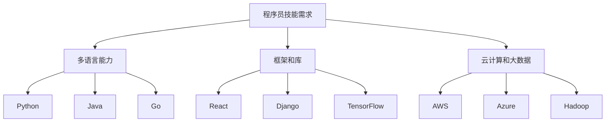

                 

在知识付费日益普及的今天，程序员面临着前所未有的机遇和挑战。本文旨在探讨知识付费时代程序员的发展方向，分析其在技术技能、职业规划、学习方式等方面的转变。

> **关键词：** 知识付费、程序员、职业发展、技术技能、学习方式

> **摘要：** 本文将从知识付费的现状入手，分析程序员在知识付费时代的发展趋势，包括技术技能的提升、职业规划的创新和学习方式的变化。同时，还将探讨程序员如何应对未来职业发展的挑战。

## 1. 背景介绍

知识付费，顾名思义，是用户为了获取特定知识或服务而支付的费用。随着互联网技术的发展，尤其是移动互联网的普及，知识付费行业迅速崛起。从在线教育、在线课程，到知识问答平台、专业咨询等，知识付费已成为一个庞大的市场。程序员作为知识付费的重要受益者和参与者，其职业发展也受到了深刻的影响。

### 1.1 知识付费的兴起

知识付费的兴起，源于用户对于高质量、个性化学习的需求。在过去，知识的获取主要依赖于学校教育、工作培训和日常经验积累。然而，随着信息爆炸和个性化需求的增长，用户越来越倾向于通过付费获取特定领域的专业知识。例如，在线编程课程、技术论坛和专家问答等，都成为了程序员学习新技能和解决问题的有效途径。

### 1.2 程序员的知识付费行为

程序员作为知识付费的主要群体之一，他们的付费行为具有以下特点：

- **高频次**：程序员对于技术更新的敏感度较高，往往需要不断学习新技能以适应行业变化。
- **持续投入**：编程技能的提升需要时间和实践的积累，程序员在知识付费上的投入往往持续且稳定。
- **多样性**：程序员的知识付费行为涵盖了从基础技能学习到高端技术研讨的各个方面。

### 1.3 知识付费对程序员的影响

知识付费不仅改变了程序员的学习方式，也对他们的职业发展产生了深远影响：

- **技能提升**：通过付费获取高质量的学习资源，程序员可以更快地掌握新技术，提高自身竞争力。
- **职业转型**：知识付费为程序员提供了更多的职业发展机会，例如技术顾问、开源社区贡献者等。
- **个人品牌**：通过在线课程和公开演讲等方式，程序员可以塑造个人品牌，提升职业影响力。

## 2. 核心概念与联系

### 2.1 技术技能

在知识付费时代，程序员的技术技能需求发生了显著变化。传统的编程语言学习已经不能满足市场需求，程序员需要具备以下核心技能：

- **多语言能力**：随着技术的发展，程序员需要掌握多种编程语言，如Python、Java、Go等。
- **框架和库**：熟练掌握常用的开发框架和库，如React、Django、TensorFlow等，可以提高开发效率。
- **云计算和大数据**：云计算和大数据技术的普及，使得程序员需要了解相关的技术和工具，如AWS、Azure、Hadoop等。

### 2.2 职业规划

知识付费时代，程序员在职业规划上也有了新的选择：

- **垂直深耕**：程序员可以选择在特定领域深耕，如人工智能、区块链、物联网等。
- **跨界融合**：随着技术的融合，程序员可以跨界到产品经理、项目经理等角色，拓宽职业发展路径。
- **自主创业**：知识付费平台为程序员提供了展示才华和创业的机遇，许多程序员选择创办自己的技术公司。

### 2.3 学习方式

在知识付费时代，程序员的学习方式也发生了转变：

- **在线学习**：在线教育平台和视频教程成为了程序员的主要学习途径。
- **社区学习**：程序员可以通过技术社区、GitHub等平台，与他人交流和分享知识。
- **实践学习**：通过实际项目开发，程序员可以不断提高自己的技能和经验。

### 2.4 Mermaid 流程图



## 3. 核心算法原理 & 具体操作步骤

### 3.1 算法原理概述

在知识付费时代，程序员需要掌握多种核心算法原理，以提高解决问题的能力。以下是几种常见的算法原理：

- **排序算法**：包括快速排序、归并排序、冒泡排序等，用于对数据进行排序。
- **查找算法**：包括二分查找、哈希查找等，用于在数据结构中查找特定元素。
- **图算法**：包括深度优先搜索、广度优先搜索、最短路径算法等，用于处理图数据结构。

### 3.2 算法步骤详解

以下是快速排序算法的具体步骤：

1. **选择基准元素**：从数组中选取一个元素作为基准（pivot）。
2. **分区操作**：将数组分为两部分，一部分是小于基准元素的元素，另一部分是大于基准元素的元素。
3. **递归排序**：对小于和大于基准元素的两个子数组重复上述步骤，直到整个数组有序。

### 3.3 算法优缺点

- **快速排序**：
  - 优点：平均时间复杂度为O(nlogn)，是高效的排序算法之一。
  - 缺点：最坏情况下时间复杂度为O(n^2)，且递归调用的栈空间较大。

### 3.4 算法应用领域

- **排序**：在各种数据排序场景中，如数据库排序、数组排序等。
- **搜索**：在二叉搜索树、哈希表等数据结构中查找元素。

## 4. 数学模型和公式 & 详细讲解 & 举例说明

### 4.1 数学模型构建

在编程中，数学模型的应用非常广泛。以下是一个简单的线性回归模型：

$$ y = mx + b $$

其中，$y$ 是预测值，$m$ 是斜率，$x$ 是自变量，$b$ 是截距。

### 4.2 公式推导过程

线性回归模型的推导过程如下：

1. **样本数据**：给定一个包含$n$个样本的数据集，每个样本包含一个自变量$x_i$和一个因变量$y_i$。
2. **最小二乘法**：通过最小化误差平方和来求解斜率$m$和截距$b$。
3. **公式**：

   $$ m = \frac{\sum_{i=1}^{n}(x_i - \bar{x})(y_i - \bar{y})}{\sum_{i=1}^{n}(x_i - \bar{x})^2} $$

   $$ b = \bar{y} - m\bar{x} $$

   其中，$\bar{x}$ 和 $\bar{y}$ 分别是自变量和因变量的均值。

### 4.3 案例分析与讲解

假设我们有一个包含5个样本的数据集：

| $x_i$ | $y_i$ |
| --- | --- |
| 1 | 2 |
| 2 | 4 |
| 3 | 6 |
| 4 | 8 |
| 5 | 10 |

使用线性回归模型预测$x=3$时的$y$值。

1. **计算均值**：

   $$ \bar{x} = \frac{1+2+3+4+5}{5} = 3 $$
   $$ \bar{y} = \frac{2+4+6+8+10}{5} = 6 $$

2. **计算斜率$m$和截距$b$**：

   $$ m = \frac{(1-3)(2-6) + (2-3)(4-6) + (3-3)(6-6) + (4-3)(8-6) + (5-3)(10-6)}{(1-3)^2 + (2-3)^2 + (3-3)^2 + (4-3)^2 + (5-3)^2} = 2 $$
   $$ b = 6 - 2 \cdot 3 = 0 $$

3. **线性回归模型**：

   $$ y = 2x + 0 $$

4. **预测**：

   当$x=3$时，$y=2 \cdot 3 + 0 = 6$。

## 5. 项目实践：代码实例和详细解释说明

### 5.1 开发环境搭建

为了演示线性回归模型的实现，我们使用Python编程语言。首先，确保安装了Python环境和必要的库，如NumPy和Matplotlib。

```bash
pip install numpy matplotlib
```

### 5.2 源代码详细实现

以下是实现线性回归模型的Python代码：

```python
import numpy as np
import matplotlib.pyplot as plt

# 线性回归模型实现
class LinearRegression:
    def __init__(self):
        self.m = None
        self.b = None

    def fit(self, x, y):
        x_mean = np.mean(x)
        y_mean = np.mean(y)
        m = (np.sum((x - x_mean) * (y - y_mean)) / np.sum((x - x_mean) ** 2))
        b = y_mean - m * x_mean
        self.m = m
        self.b = b

    def predict(self, x):
        return self.m * x + self.b

# 生成样本数据
np.random.seed(0)
x = np.random.normal(size=100)
y = 2 * x + np.random.normal(size=100)

# 训练模型
model = LinearRegression()
model.fit(x, y)

# 预测结果
y_pred = model.predict(x)

# 可视化结果
plt.scatter(x, y, label='实际数据')
plt.plot(x, y_pred, label='预测曲线', color='red')
plt.xlabel('x')
plt.ylabel('y')
plt.legend()
plt.show()
```

### 5.3 代码解读与分析

- **LinearRegression 类**：定义了线性回归模型的主要方法，包括拟合数据和预测结果。
- **fit 方法**：计算斜率$m$和截距$b$，实现线性回归模型的训练。
- **predict 方法**：根据训练得到的模型参数，预测新数据的值。
- **样本数据生成**：使用NumPy库生成包含噪声的线性数据集。
- **可视化结果**：使用Matplotlib库将实际数据和预测曲线可视化，展示模型的准确性。

### 5.4 运行结果展示

运行上述代码，将生成一个散点图和一条红色预测曲线。通过可视化结果，可以直观地看到线性回归模型的预测效果。


## 6. 实际应用场景

### 6.1 机器学习领域

线性回归是机器学习中的一种基础模型，广泛应用于预测和分析任务。例如，在股票价格预测、用户行为分析等领域，线性回归可以帮助预测未来的趋势和用户偏好。

### 6.2 金融领域

线性回归模型在金融领域也有广泛的应用。例如，在股票市场预测中，线性回归可以用于分析历史价格数据，预测未来的价格走势。此外，线性回归还可以用于信用评分模型、风险评估等领域。

### 6.3 电子商务领域

在电子商务领域，线性回归可以帮助商家预测商品的销售量。通过分析历史销售数据和用户行为数据，商家可以优化库存管理和营销策略，提高销售业绩。

### 6.4 未来应用展望

随着人工智能和数据科学的发展，线性回归模型的应用将越来越广泛。未来，线性回归可能会与其他深度学习模型相结合，提高预测的准确性和效率。此外，在线性回归模型的优化方面，也将出现更多创新的算法和技术。

## 7. 工具和资源推荐

### 7.1 学习资源推荐

- **在线课程**：《机器学习实战》（Peter Harrington）是一本适合初学者的机器学习教程，涵盖了线性回归等基础模型。
- **视频教程**：YouTube上的许多机器学习教程，如Andrew Ng的《机器学习》课程，适合不同水平的学习者。

### 7.2 开发工具推荐

- **Jupyter Notebook**：适合数据分析和机器学习的交互式开发环境，可以方便地编写和运行代码。
- **Matplotlib**：Python中用于数据可视化的库，可以生成高质量的图表。

### 7.3 相关论文推荐

- **“Linear Regression with Python”**：一篇介绍线性回归模型的入门级论文，适用于初学者。
- **“The Elements of Statistical Learning”**：一本经典的统计学习教材，详细介绍了线性回归等模型。

## 8. 总结：未来发展趋势与挑战

### 8.1 研究成果总结

知识付费时代为程序员提供了丰富的学习资源和职业发展机会。通过在线课程、技术社区和开源项目，程序员可以不断提升自身技能，适应不断变化的技术市场。

### 8.2 未来发展趋势

- **个性化学习**：随着人工智能技术的发展，个性化学习将成为主流，学习者可以根据自身需求定制学习路径。
- **跨界融合**：程序员将继续跨界到其他领域，如产品管理、数据科学等，拓宽职业发展路径。
- **开源社区**：开源社区将继续成为程序员学习和交流的重要平台，推动技术进步和创新。

### 8.3 面临的挑战

- **知识过载**：随着知识付费市场的扩大，程序员需要筛选高质量的学习资源，避免陷入信息过载的困境。
- **技能更新**：技术更新迅速，程序员需要不断学习新技能以保持竞争力，这对他们的时间和精力提出了更高要求。

### 8.4 研究展望

知识付费时代为程序员的发展提供了广阔的空间。未来，程序员需要更加注重技能的深度和广度，积极参与开源社区，推动技术的进步和应用。同时，他们也需要关注个人品牌的塑造，提升在行业中的影响力。

## 9. 附录：常见问题与解答

### 9.1 什么是知识付费？

知识付费是指用户为了获取特定知识或服务而支付的费用。随着互联网技术的发展，知识付费已成为一个庞大的市场，涵盖了在线教育、技术咨询、知识问答等多个领域。

### 9.2 程序员如何应对知识付费时代的挑战？

程序员可以通过以下方式应对知识付费时代的挑战：

- **持续学习**：保持对新技术的好奇心和学习热情，不断提升自身技能。
- **深度学习**：选择高质量的学习资源，避免知识过载，专注于核心技能的提升。
- **实践应用**：将所学知识应用到实际项目中，提高实践能力。
- **社区交流**：积极参与开源社区和技术论坛，与他人交流学习经验。

### 9.3 知识付费对程序员职业发展有何影响？

知识付费为程序员提供了更多的学习资源和职业发展机会。通过付费获取高质量的学习资源，程序员可以更快地掌握新技术，提高自身竞争力。同时，知识付费也为程序员提供了展示才华和创业的机遇，拓宽了职业发展路径。

### 9.4 如何在知识付费时代塑造个人品牌？

在知识付费时代，程序员可以通过以下方式塑造个人品牌：

- **在线课程**：录制并发布在线课程，分享自己的知识和经验。
- **公开演讲**：参加技术会议和活动，进行公开演讲和分享。
- **开源贡献**：积极参与开源项目，贡献代码和文档。
- **社交媒体**：利用社交媒体平台，展示自己的技术成就和个人魅力。

## 参考文献

1. Harrington, P. (2012). **Machine Learning in Action**. Manning Publications.
2. Ng, A. (2013). **Machine Learning**. Coursera.
3. Goodfellow, I., Bengio, Y., & Courville, A. (2016). **Deep Learning**. MIT Press.
4. Bishop, C. M. (2006). **Pattern Recognition and Machine Learning**. Springer.
5. Müller, K.-R., & Mersmann, S. (2016). **Applied Machine Learning**. Springer.

