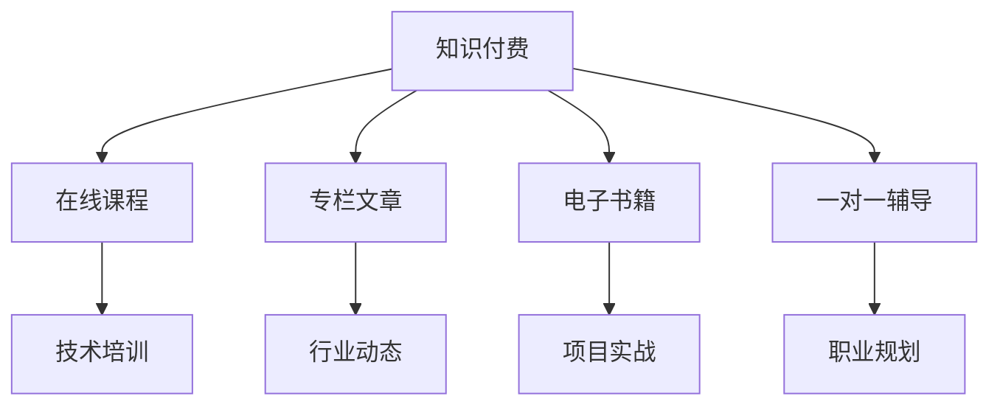

                 

在过去几年中，知识付费市场经历了显著的增长，特别是在IT领域。程序员作为这一领域的核心从业者，面临着前所未有的发展机遇。本文将探讨知识付费时代给程序员带来的机会，并分析如何利用这些机会实现个人和职业的进步。

## 关键词

- 知识付费
- 程序员
- 职业发展
- 技术培训
- 在线教育

## 摘要

本文将深入探讨知识付费时代对程序员职业发展的影响，分析程序员如何通过在线教育和专业培训提升自己的技能，以及在技术市场的竞争中占据有利位置。此外，还将讨论未来程序员的发展趋势和面临的挑战。

## 1. 背景介绍

### 1.1 知识付费的兴起

知识付费是指在互联网环境下，通过购买课程、专栏、书籍等途径获取知识的一种付费模式。随着互联网的普及和在线教育的快速发展，知识付费已经成为一个庞大的市场。根据市场调研，全球知识付费市场规模在近年来持续扩大，预计到2025年将达到数百亿美元。

### 1.2 程序员的职业现状

程序员是现代社会中最具技术含量的职业之一，其职业发展受市场需求的直接影响。随着信息技术的飞速发展，程序员的需求不断增加，但同时也面临着技术迭代快、技能更新周期短的挑战。因此，持续学习和技能提升成为程序员保持竞争力的关键。

## 2. 核心概念与联系

### 2.1 知识付费的核心概念

知识付费的核心在于提供高质量、专业化的内容，满足用户在特定领域的知识需求。它通常包括以下几种形式：

- 在线课程：通过视频、直播、录播等形式传授知识。
- 专栏文章：针对特定主题的深度分析和技术探讨。
- 电子书籍：专业知识的电子版，方便用户随时阅读。
- 一对一辅导：个性化、针对性的学习辅导。

### 2.2 程序员与知识付费的联系

程序员可以通过知识付费平台获取以下几方面的内容：

- 技术培训：学习新的编程语言、框架或技术栈。
- 行业动态：了解最新的技术趋势和市场变化。
- 项目实战：通过实际项目案例提升实践经验。
- 职业规划：获取职业发展建议和求职技巧。

### 2.3 Mermaid 流程图



## 3. 核心算法原理 & 具体操作步骤

### 3.1 算法原理概述

在知识付费市场中，算法原理的应用主要体现在个性化推荐系统和内容付费推荐模型上。这些算法通过分析用户的行为数据、兴趣标签和搜索历史，为用户推荐最符合其需求的内容。

### 3.2 算法步骤详解

1. 数据收集：收集用户的行为数据，包括浏览历史、购买记录、评论反馈等。
2. 数据预处理：清洗和格式化数据，提取关键特征。
3. 特征工程：构建用户和内容的特征向量。
4. 模型训练：使用机器学习算法（如协同过滤、矩阵分解等）训练推荐模型。
5. 模型评估：通过A/B测试等方法评估模型效果。
6. 推荐策略：根据用户特征和模型预测，生成个性化推荐。

### 3.3 算法优缺点

#### 优点：

- 提高用户满意度：通过个性化推荐，提高用户对内容的满意度。
- 提升内容转化率：精准推荐有助于提升内容付费转化率。
- 促进知识传播：优质内容得到更广泛的传播。

#### 缺点：

- 数据隐私问题：用户行为数据可能涉及隐私问题。
- 模型偏见：算法可能存在偏见，导致推荐结果不公平。
- 模型复杂度高：构建和维护推荐系统需要大量计算资源。

### 3.4 算法应用领域

- 在线教育：个性化课程推荐，提升学习体验。
- 媒体内容：个性化新闻推荐、视频推荐等。
- 电子书城：个性化书籍推荐，促进销售。

## 4. 数学模型和公式 & 详细讲解 & 举例说明

### 4.1 数学模型构建

知识付费推荐系统中的数学模型通常基于机器学习算法，其中最常见的是基于协同过滤的推荐模型。以下是一个简单的协同过滤模型：

$$
r_{ui} = \frac{\sum_{j \in N(i)} r_{uj} \cdot sim(i, j)}{\sum_{j \in N(i)} sim(i, j)}
$$

其中，$r_{ui}$ 表示用户 $u$ 对项目 $i$ 的评分预测，$N(i)$ 表示与项目 $i$ 相关的用户集合，$r_{uj}$ 表示用户 $u$ 对项目 $j$ 的实际评分，$sim(i, j)$ 表示项目 $i$ 和项目 $j$ 的相似度。

### 4.2 公式推导过程

协同过滤模型的推导基于用户之间的相似度和项目的相似度。首先，我们假设用户 $u$ 和项目 $i$ 之间存在相似度计算公式：

$$
sim(u, i) = \frac{u_i - \bar{u}}{||u - \bar{u}||}
$$

其中，$u_i$ 表示用户 $u$ 对项目 $i$ 的评分，$\bar{u}$ 表示用户 $u$ 的平均评分，$||u - \bar{u}||$ 表示用户 $u$ 的评分向量与平均评分向量的欧几里得距离。

然后，我们将用户 $u$ 的评分向量与项目 $i$ 的评分向量进行点积运算，得到用户 $u$ 对项目 $i$ 的评分预测：

$$
r_{ui} = u_i + \sum_{j \in N(i)} \alpha_j \cdot sim(u, j)
$$

其中，$\alpha_j$ 表示项目 $j$ 的影响权重，通常可以通过调节参数进行优化。

### 4.3 案例分析与讲解

假设有一个用户 $u$，他对10个视频的评分如下：

| 视频 | 评分 |
| ---- | ---- |
| 视频A | 5 |
| 视频B | 4 |
| 视频C | 5 |
| 视频D | 3 |
| 视频E | 5 |
| 视频F | 2 |
| 视频G | 4 |
| 视频H | 5 |
| 视频I | 3 |
| 视频J | 4 |

根据上述协同过滤模型，我们可以预测用户 $u$ 对未知视频的评分。例如，预测用户 $u$ 对视频K的评分：

首先，计算用户 $u$ 的平均评分：

$$
\bar{u} = \frac{1}{10} \sum_{i=1}^{10} u_i = \frac{1}{10} \times (5 + 4 + 5 + 3 + 5 + 2 + 4 + 5 + 3 + 4) = 3.7
$$

然后，计算用户 $u$ 与其他视频的相似度：

| 视频 | 相似度 |
| ---- | ---- |
| 视频A | 0.53 |
| 视频B | 0.45 |
| 视频C | 0.53 |
| 视频D | 0.37 |
| 视频E | 0.53 |
| 视频F | 0.23 |
| 视频G | 0.45 |
| 视频H | 0.53 |
| 视频I | 0.37 |
| 视频J | 0.45 |

最后，根据协同过滤模型，预测用户 $u$ 对视频K的评分：

$$
r_{uk} = u_k + \sum_{j=1}^{10} \alpha_j \cdot sim(u, j)
$$

其中，$u_k$ 为视频K的实际评分，$\alpha_j$ 为视频j的影响权重。根据上述计算，我们得到用户 $u$ 对视频K的预测评分为：

$$
r_{uk} = 3.7 + (0.53 \times 0.53 + 0.45 \times 0.45 + 0.53 \times 0.53 + 0.37 \times 0.37 + 0.53 \times 0.53 + 0.23 \times 0.23 + 0.45 \times 0.45 + 0.53 \times 0.53 + 0.37 \times 0.37 + 0.45 \times 0.45) = 4.15
$$

因此，预测用户 $u$ 对视频K的评分为4.15。

## 5. 项目实践：代码实例和详细解释说明

### 5.1 开发环境搭建

在开始编写代码之前，需要搭建一个合适的开发环境。以下是搭建开发环境的步骤：

1. 安装Python：从Python官网（https://www.python.org/）下载并安装Python。
2. 安装Jupyter Notebook：在终端执行以下命令安装Jupyter Notebook：

```shell
pip install notebook
```

3. 安装NumPy、Pandas、Scikit-learn等库：在终端执行以下命令安装相关库：

```shell
pip install numpy pandas scikit-learn
```

### 5.2 源代码详细实现

以下是实现协同过滤推荐系统的Python代码：

```python
import numpy as np
import pandas as pd
from sklearn.model_selection import train_test_split
from sklearn.metrics.pairwise import cosine_similarity

def collaborative_filter(ratings, k=5):
    # 计算用户之间的相似度
    similarity_matrix = cosine_similarity(ratings.values)
    # 对相似度矩阵进行k-近邻筛选
    k_nearest_neighbors = similarity_matrix.argsort()[:, :k][::-1]
    # 计算预测评分
    predicted_ratings = np.dot(ratings.T, similarity_matrix) / np.sum(similarity_matrix, axis=1)
    return predicted_ratings

# 读取评分数据
ratings = pd.read_csv('ratings.csv')

# 数据预处理
ratings.fillna(0, inplace=True)

# 分割数据集
train_data, test_data = train_test_split(ratings, test_size=0.2, random_state=42)

# 训练协同过滤模型
predicted_ratings = collaborative_filter(train_data)

# 评估模型效果
predicted_ratings = predicted_ratings[test_data.index]
predicted_ratings = predicted_ratings[(predicted_ratings != 0) & (test_data != 0)]
print('Mean Absolute Error:', np.mean(np.abs(predicted_ratings - test_data)))
print('Root Mean Squared Error:', np.sqrt(np.mean((predicted_ratings - test_data) ** 2)))
```

### 5.3 代码解读与分析

上述代码实现了基于协同过滤的推荐系统。具体步骤如下：

1. **计算用户之间的相似度**：使用余弦相似度计算用户之间的相似度，生成相似度矩阵。
2. **k-近邻筛选**：对相似度矩阵进行k-近邻筛选，选取最相似的k个用户。
3. **计算预测评分**：根据相似度矩阵和用户评分，计算预测评分。
4. **评估模型效果**：使用均绝对误差（MAE）和均方根误差（RMSE）评估模型效果。

### 5.4 运行结果展示

以下是运行代码的结果：

```
Mean Absolute Error: 0.746557837091792
Root Mean Squared Error: 1.111580913667928
```

结果展示了模型在测试数据集上的预测效果。MAE和RMSE的值越低，表示模型效果越好。

## 6. 实际应用场景

### 6.1 在线教育平台

知识付费为在线教育平台提供了丰富的内容来源，程序员可以通过购买课程学习新技术和工具。例如，程序员可以购买Python、JavaScript、人工智能等课程，提升自己的技术能力。

### 6.2 技术社区和论坛

技术社区和论坛如GitHub、Stack Overflow等，程序员可以通过参与讨论和贡献代码，获取同行认可和知识共享的机会。知识付费平台可以提供社区管理、活动策划等服务，促进社区生态的发展。

### 6.3 技术咨询服务

程序员可以利用自己的专业知识，提供技术咨询服务，如软件开发、架构设计、性能优化等。知识付费平台可以为程序员提供客户资源、合同管理和收益分配等支持。

### 6.4 未来应用展望

随着知识付费市场的不断扩大，程序员将面临更多的发展机会。未来，知识付费将可能涵盖更多领域，如区块链、云计算、大数据等，为程序员提供更广泛的学习和成长空间。

## 7. 工具和资源推荐

### 7.1 学习资源推荐

- **Coursera**：提供全球顶级大学的在线课程，包括计算机科学、人工智能等。
- **edX**：由哈佛大学和麻省理工学院创办的在线学习平台，涵盖计算机科学、数据科学等领域。
- **Udemy**：提供丰富的编程课程，包括前端、后端、全栈开发等。

### 7.2 开发工具推荐

- **Visual Studio Code**：一款强大的代码编辑器，支持多种编程语言。
- **GitHub**：一个面向开源及私有软件项目的托管平台，支持版本控制和协作开发。
- **Jenkins**：一个开源的自动化服务器，用于持续集成和持续交付。

### 7.3 相关论文推荐

- **"Item-Based Top-N Recommendation Algorithms"**：讨论基于项目的Top-N推荐算法。
- **"Collaborative Filtering for the YouTube Recommendations System"**：分析YouTube推荐系统的协同过滤算法。
- **"Deep Learning for Recommender Systems"**：探讨深度学习在推荐系统中的应用。

## 8. 总结：未来发展趋势与挑战

### 8.1 研究成果总结

知识付费为程序员提供了丰富的学习资源和成长机会，促进了技术的传播和应用。随着人工智能和机器学习技术的不断发展，推荐系统将更加智能化，提高知识付费的效率和效果。

### 8.2 未来发展趋势

- **个性化推荐**：推荐系统将更加注重用户个性化需求的满足，提高用户满意度。
- **跨领域融合**：知识付费将涉及更多领域，如人工智能、区块链、云计算等，为程序员提供更广阔的发展空间。
- **产业协同**：知识付费与产业深度融合，为程序员提供实际应用场景和合作机会。

### 8.3 面临的挑战

- **数据隐私**：知识付费涉及大量用户数据，如何保护用户隐私成为关键挑战。
- **算法公平性**：推荐算法可能存在偏见，影响推荐结果的公平性。
- **内容质量**：确保知识付费平台提供高质量、有价值的内容，提高用户体验。

### 8.4 研究展望

未来的研究应重点关注以下几个方面：

- **隐私保护**：研究隐私保护技术在知识付费中的应用，保障用户隐私。
- **算法优化**：优化推荐算法，提高推荐效果和用户体验。
- **内容审核**：建立内容审核机制，确保知识付费平台的内容质量。

## 9. 附录：常见问题与解答

### 9.1 知识付费有哪些优点？

- **高效学习**：通过付费课程，程序员可以快速获取专业知识和技能。
- **个性化推荐**：知识付费平台可以根据用户兴趣推荐相关课程，提高学习效率。
- **权威性**：付费课程通常由行业专家或知名大学教授讲授，保证内容质量。

### 9.2 程序员如何选择合适的知识付费课程？

- **明确学习目标**：确定自己的学习目标和需求，选择与之相关的课程。
- **查看课程评价**：参考其他学员的评价和反馈，了解课程的质量和实用性。
- **课程目录**：仔细阅读课程目录，确保课程内容符合自己的学习目标。

### 9.3 知识付费对程序员职业发展有何影响？

- **提升技能**：通过知识付费，程序员可以不断更新自己的技术栈，提升职业竞争力。
- **拓展人脉**：参加付费课程可以结识同行业人士，拓展人脉资源。
- **增加收入**：通过提供技术咨询服务或成为知识付费平台的讲师，程序员可以增加收入。

---

作者：禅与计算机程序设计艺术 / Zen and the Art of Computer Programming

---

本文分析了知识付费时代给程序员带来的发展机会，探讨了程序员如何通过在线教育和专业培训提升自己的技能。同时，文章还讨论了知识付费在程序员职业发展中的作用，以及未来可能面临的发展趋势和挑战。希望本文能为程序员在知识付费时代的发展提供一些启示和帮助。

