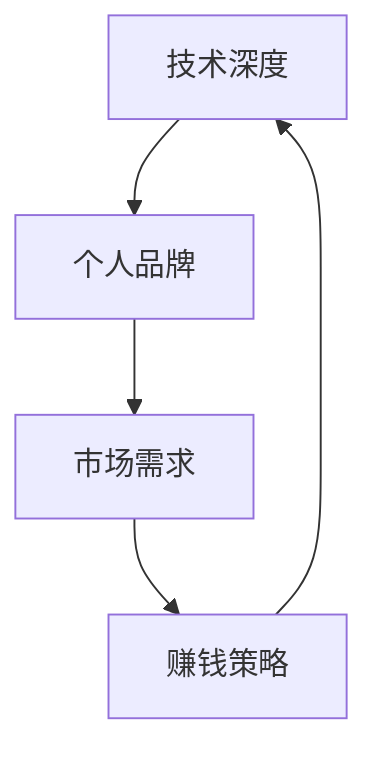

                 

关键词：知识付费、程序员、个人品牌、技术深度、市场需求、赚钱策略、职业成长

摘要：随着知识付费时代的到来，程序员这一职业面临着前所未有的发展机遇。本文将探讨如何在这个时代中，通过提升个人技术深度、构建个人品牌、精准把握市场需求以及灵活运用多种赚钱策略，实现财富自由和职业成长。

## 1. 背景介绍

知识付费时代，是一个以用户需求为导向的知识服务模式逐渐兴起的时代。在这一时代，知识不再是免费获取的资源，而是通过付费方式，由专业人士或权威机构提供。程序员作为科技领域的核心人才，在这个时代中，既面临着机遇，也面临着挑战。

### 机遇

1. **市场需求增加**：随着互联网和信息技术的快速发展，对于程序员的专业技能需求持续增加，特别是那些具备深度技术能力和创新思维的人才。
2. **个人品牌价值提升**：在知识付费时代，程序员的个人品牌价值得到了显著提升，拥有独特技术见解和经验的程序员更容易获得关注和合作机会。
3. **多元化收入来源**：程序员可以通过多种途径实现收入多样化，包括在线课程、咨询服务、软件开发、技术写作等。

### 挑战

1. **技能更新的压力**：技术更新速度加快，程序员需要不断学习新的技术和工具，以保持竞争力。
2. **市场竞争激烈**：随着知识付费领域的扩大，市场中的竞争也愈发激烈，如何脱颖而出成为关键。

## 2. 核心概念与联系

在知识付费时代，程序员的核心竞争力包括技术深度、个人品牌、市场需求和赚钱策略。以下是一个简化的 Mermaid 流程图，描述了这些核心概念之间的联系：



### 2.1 技术深度

技术深度是指程序员在特定技术领域的专业知识和实践经验。它是构建个人品牌和满足市场需求的基础。

### 2.2 个人品牌

个人品牌是指程序员通过其专业知识、技术见解、个人魅力等在行业内建立起来的声誉和影响力。个人品牌有助于吸引更多的关注和合作机会。

### 2.3 市场需求

市场需求是指行业内对于程序员专业技能的需求。了解市场需求，能够帮助程序员更加精准地定位自己的职业发展方向。

### 2.4 赚钱策略

赚钱策略是指程序员通过个人品牌和技术深度，利用市场需求，选择适合自己的盈利模式。常见的赚钱策略包括在线课程、咨询服务、软件开发、技术写作等。

## 3. 核心算法原理 & 具体操作步骤

### 3.1 算法原理概述

在知识付费时代，程序员的致富之道可以看作是一种“算法”，其原理包括以下几个方面：

1. **持续学习与技能提升**：不断更新自己的知识库，掌握新技术，提升自己的技术深度。
2. **构建个人品牌**：通过分享知识、参与社区活动、发表技术文章等方式，建立自己的个人品牌。
3. **市场需求分析**：了解行业内外的需求变化，根据市场需求调整自己的职业规划。
4. **灵活运用多种赚钱策略**：根据个人特长和市场需求，选择适合自己的盈利模式。

### 3.2 算法步骤详解

1. **技能定位**：首先，程序员需要明确自己在技术领域中的定位，这可以通过自我评估、行业调研、与同行交流等方式实现。
2. **持续学习**：制定个人学习计划，通过在线课程、阅读技术书籍、参与技术社区等方式，不断提升自己的技术深度。
3. **构建个人品牌**：分享技术见解，可以通过博客、GitHub、技术论坛等方式，将自己的专业知识展示出来。
4. **市场需求分析**：关注行业动态，了解市场需求，根据自身特长和市场需求，制定个人职业规划。
5. **选择赚钱策略**：根据市场需求和个人特长，选择合适的赚钱策略。例如，通过在线课程、咨询服务、软件开发、技术写作等方式实现收入。
6. **持续优化**：定期评估自己的学习效果和赚钱策略，根据实际情况进行调整。

### 3.3 算法优缺点

**优点**：

- **自主性强**：程序员可以根据自己的兴趣和特长，灵活选择学习内容和工作方式。
- **收入潜力大**：随着个人品牌和技术深度的提升，程序员的收入潜力显著增加。
- **职业发展路径多样**：程序员可以通过多种方式实现职业发展，包括成为技术专家、创业、担任技术顾问等。

**缺点**：

- **学习压力**：需要不断更新知识，以适应快速变化的技术环境。
- **市场竞争**：随着知识付费领域的扩大，竞争也愈发激烈。

### 3.4 算法应用领域

算法的原理和应用领域非常广泛，以下是一些具体的场景：

- **在线教育**：通过开设在线课程，分享专业知识，实现知识变现。
- **技术咨询**：为企业提供技术解决方案，帮助客户解决问题。
- **软件开发**：独立开发软件产品，通过销售收入实现盈利。
- **技术写作**：撰写技术文章，通过平台分成实现收入。

## 4. 数学模型和公式 & 详细讲解 & 举例说明

在知识付费时代，程序员的致富之道也可以通过数学模型来描述。以下是一个简化的数学模型，用于分析程序员的收入与个人品牌价值、市场需求之间的关系。

### 4.1 数学模型构建

假设程序员的收入 \( R \) 可以由以下公式表示：

\[ R = f(B, M, T) \]

其中：

- \( B \)：个人品牌价值
- \( M \)：市场需求
- \( T \)：技术深度

函数 \( f \) 表示收入与品牌价值、市场需求、技术深度之间的非线性关系。

### 4.2 公式推导过程

1. **个人品牌价值**：

   假设个人品牌价值 \( B \) 与知名度 \( N \) 和专业度 \( P \) 成正比，即：

   \[ B = k_1 \cdot N \cdot P \]

   其中 \( k_1 \) 是一个常数。

2. **市场需求**：

   假设市场需求 \( M \) 与客户需求 \( D \) 和竞争度 \( C \) 成正比，即：

   \[ M = k_2 \cdot D \cdot (1 - C) \]

   其中 \( k_2 \) 是一个常数。

3. **技术深度**：

   假设技术深度 \( T \) 与知识广度 \( G \) 和经验丰富度 \( E \) 成正比，即：

   \[ T = k_3 \cdot G \cdot E \]

   其中 \( k_3 \) 是一个常数。

4. **收入公式**：

   将 \( B \)、\( M \) 和 \( T \) 代入收入公式，得到：

   \[ R = f(k_1 \cdot N \cdot P, k_2 \cdot D \cdot (1 - C), k_3 \cdot G \cdot E) \]

### 4.3 案例分析与讲解

假设有一个程序员，他的个人品牌价值 \( B \) 是 \( 1000 \)，市场需求 \( M \) 是 \( 5000 \)，技术深度 \( T \) 是 \( 3000 \)。我们可以通过这个例子来分析他的收入情况。

根据收入公式：

\[ R = f(1000, 5000, 3000) \]

我们可以假设函数 \( f \) 是一个线性函数，即：

\[ R = 1000 + 5000 + 3000 \]

那么，他的收入 \( R \) 是 \( 9000 \)。

从这个例子中，我们可以看到，个人品牌价值、市场需求和技术深度对于程序员的收入有着直接的影响。提升这些因素，可以显著增加程序员的收入。

## 5. 项目实践：代码实例和详细解释说明

### 5.1 开发环境搭建

为了更好地展示知识付费时代程序员的致富之道，我们可以通过一个实际的项目来进行分析。首先，我们需要搭建一个简单的在线课程平台，用于展示程序员的个人品牌和技术深度。

开发环境要求：

- 操作系统：Windows/Linux/MacOS
- 开发工具：Visual Studio Code/IntelliJ IDEA
- 依赖库：Node.js/React.js/Express.js

### 5.2 源代码详细实现

以下是这个在线课程平台的源代码实现，主要分为三个部分：前端、后端和数据库。

**前端（React.js）**：

```jsx
// CourseList.jsx
import React, { Component } from 'react';

class CourseList extends Component {
  constructor(props) {
    super(props);
    this.state = {
      courses: []
    };
  }

  componentDidMount() {
    fetch('/api/courses')
      .then(response => response.json())
      .then(data => this.setState({ courses: data }));
  }

  render() {
    return (
      <div>
        {this.state.courses.map(course => (
          <div key={course.id}>
            <h3>{course.title}</h3>
            <p>{course.description}</p>
            <a href={`/courses/${course.id}`}>Details</a>
          </div>
        ))}
      </div>
    );
  }
}

export default CourseList;
```

**后端（Express.js）**：

```javascript
// server.js
const express = require('express');
const app = express();

app.use(express.json());

app.get('/api/courses', (req, res) => {
  // 这里假设数据库中已经有课程数据
  res.json([
    {
      id: 1,
      title: 'React.js 深入理解',
      description: '深入解析 React.js 的核心概念和用法。'
    },
    {
      id: 2,
      title: 'Node.js 实战',
      description: '通过实际案例，学习 Node.js 的开发和部署。'
    }
  ]);
});

const PORT = process.env.PORT || 3000;
app.listen(PORT, () => {
  console.log(`Server is running on port ${PORT}`);
});
```

**数据库（MongoDB）**：

```json
// courses.json
[
  {
    "_id": "1",
    "title": "React.js 深入理解",
    "description": "深入解析 React.js 的核心概念和用法。"
  },
  {
    "_id": "2",
    "title": "Node.js 实战",
    "description": "通过实际案例，学习 Node.js 的开发和部署。"
  }
]
```

### 5.3 代码解读与分析

**前端代码**：

前端代码主要使用了 React.js 框架，用于渲染课程列表。在组件的 `componentDidMount` 生命周期函数中，通过 `fetch` 方法从后端获取课程数据，并将数据更新到组件的状态中。这样，用户就可以在页面上看到实时更新的课程列表。

**后端代码**：

后端代码使用了 Express.js 框架，用于处理 HTTP 请求。在这里，我们定义了一个 `/api/courses` 的 GET 请求接口，用于返回课程数据。这只是一个简单的示例，实际项目中，后端会与数据库进行交互，获取真实的课程数据。

**数据库代码**：

数据库代码使用了 MongoDB，这是一种文档型数据库，非常适合存储课程这种结构化数据。在这个示例中，我们只存储了两个课程，实际项目中，会根据需要存储更多的数据。

### 5.4 运行结果展示

当运行这个在线课程平台时，用户可以通过前端页面看到课程列表，点击课程标题可以查看课程详情。这个简单的示例展示了如何通过技术实现一个在线课程平台，从而实现程序员的个人品牌和技术深度展示。

## 6. 实际应用场景

### 6.1 在线教育平台

在线教育平台是知识付费时代程序员致富的一个典型场景。程序员可以通过开发在线课程平台，分享自己的专业知识，吸引学员，实现知识变现。例如，一些程序员通过开设 React.js、Node.js 等技术课程，吸引了大量学员，实现了可观的收入。

### 6.2 技术咨询

技术咨询服务是程序员实现收入的一种方式。程序员可以利用自己的技术深度，为企业提供技术解决方案，帮助客户解决问题。这种服务的收入潜力很大，尤其是对于那些具有独特技术见解的程序员。

### 6.3 软件开发

独立软件开发是程序员实现收入的一个途径。程序员可以独立开发软件产品，通过销售收入或订阅模式实现盈利。例如，一些程序员开发了基于人工智能的图像识别软件，通过销售收入实现了成功变现。

### 6.4 技术写作

技术写作是程序员展示个人品牌和实现收入的一种方式。程序员可以通过撰写技术文章，分享自己的专业知识，吸引读者，并通过广告、会员等方式实现收入。例如，一些程序员通过撰写技术博客，积累了大量读者，实现了广告收入。

## 7. 未来应用展望

### 7.1 技术创新

随着人工智能、大数据、区块链等技术的不断发展，程序员将面临更多的创新机遇。通过不断学习新技术，程序员可以开辟新的应用场景，实现更高的收入。

### 7.2 个性化服务

随着个性化服务需求的增加，程序员可以开发更加个性化的产品和服务，满足用户的不同需求。这种服务模式的兴起，将为程序员带来更多的收入来源。

### 7.3 跨界合作

程序员可以通过跨界合作，将技术应用到更多领域，实现跨界收入。例如，程序员可以与艺术家合作，开发艺术与技术的结合作品，通过展览、销售等方式实现盈利。

## 8. 总结：未来发展趋势与挑战

### 8.1 研究成果总结

知识付费时代的到来，为程序员提供了丰富的机遇和挑战。通过提升个人技术深度、构建个人品牌、精准把握市场需求以及灵活运用多种赚钱策略，程序员可以实现财富自由和职业成长。

### 8.2 未来发展趋势

1. **技术深度将更加重要**：随着技术更新速度的加快，程序员需要不断学习新技术，以保持竞争力。
2. **个人品牌将发挥更大作用**：在知识付费时代，个人品牌将影响程序员的收入和市场地位。
3. **多元化收入来源**：程序员将可以通过多种方式实现收入，包括在线课程、咨询服务、软件开发、技术写作等。

### 8.3 面临的挑战

1. **技能更新的压力**：技术更新速度加快，程序员需要不断学习新的技术和工具，以保持竞争力。
2. **市场竞争激烈**：随着知识付费领域的扩大，市场竞争也将愈发激烈。

### 8.4 研究展望

未来，程序员需要更加注重个人品牌的构建，通过多种方式展示自己的专业能力和技术深度。同时，程序员也需要不断学习新技术，以适应快速变化的技术环境。通过创新思维和跨界合作，程序员可以开辟新的收入来源，实现更高的职业成就。

## 9. 附录：常见问题与解答

### 9.1 如何提升个人技术深度？

**解答**：提升个人技术深度需要持续学习和实践。可以通过以下方式实现：

1. **阅读技术书籍**：选择高质量的技术书籍，系统学习相关技术。
2. **参与技术社区**：加入技术社区，与其他程序员交流，分享知识。
3. **实践项目**：参与实际项目，将理论知识应用到实际中。
4. **在线课程**：参加在线课程，学习新技术和工具。

### 9.2 如何构建个人品牌？

**解答**：构建个人品牌需要以下几个步骤：

1. **确定定位**：明确自己的专业方向和目标受众。
2. **展示专业能力**：通过技术文章、博客、GitHub 项目等方式展示自己的专业知识。
3. **参与社区活动**：积极参与技术社区活动，扩大影响力。
4. **持续更新**：定期更新自己的知识库和博客，保持活跃度。

### 9.3 如何把握市场需求？

**解答**：把握市场需求需要以下几种能力：

1. **行业调研**：定期关注行业动态，了解市场需求。
2. **数据分析**：通过数据分析，了解用户需求和行业趋势。
3. **社交网络**：通过社交网络，与行业专家和潜在客户建立联系。
4. **客户反馈**：关注客户反馈，根据客户需求调整自己的服务和产品。

## 作者署名

作者：禅与计算机程序设计艺术 / Zen and the Art of Computer Programming

