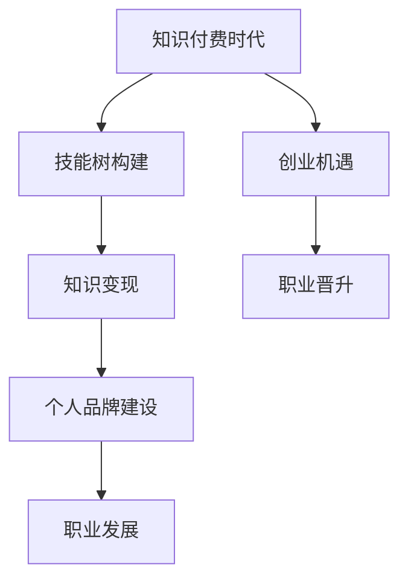

                 

在当今知识付费时代，程序员的职业发展不再局限于传统意义上的编程技能提升。随着信息技术的飞速发展，程序员的职业路径变得更加多样化，也为他们带来了丰富的致富机遇。本文旨在探讨知识付费背景下程序员的致富之道和面临的机遇，帮助程序员把握时代脉搏，实现个人价值的最大化。

## 关键词

- **知识付费**
- **程序员**
- **职业发展**
- **致富**
- **机遇**
- **技术赋能**
- **在线教育**
- **开源贡献**
- **个人品牌**

## 摘要

本文将从以下几个方面展开讨论：

1. **知识付费时代的背景**：介绍知识付费的概念、发展历程及其对程序员职业发展的影响。
2. **程序员的致富之道**：分析程序员如何通过技能提升、知识分享、项目实践等多种途径实现个人财富增长。
3. **面临的机遇**：探讨知识付费时代为程序员带来的创业机会、职业晋升、以及新兴领域的挑战和机遇。
4. **案例分析**：介绍几位成功程序员的致富经历和经验分享。
5. **未来展望**：预测知识付费时代程序员的职业发展前景，提出建议和挑战。

## 1. 背景介绍

### 知识付费的概念与发展历程

知识付费，顾名思义，是指用户为获取高质量的知识内容而支付费用的一种模式。随着互联网技术的普及和在线教育的发展，知识付费逐渐成为一种新兴的商业模式。其发展历程可以分为以下几个阶段：

- **萌芽期**（2010年以前）：主要是线下培训、书籍购买等传统形式的知识获取方式。
- **起步期**（2010-2013年）：互联网教育平台的兴起，如 Coursera、Udemy 等，开始提供在线课程。
- **发展期**（2014-2016年）：知识付费平台如知乎、得到、喜马拉雅等相继涌现，用户群体逐渐扩大。
- **成熟期**（2017年至今）：知识付费成为主流消费习惯，知识服务形式更加多样化。

### 知识付费对程序员职业发展的影响

知识付费为程序员带来了以下几个方面的机遇和挑战：

1. **技能提升**：程序员可以通过付费课程、培训等方式迅速提升技能，跟上技术发展的步伐。
2. **知识变现**：具备专业技能的程序员可以通过线上或线下的知识分享，实现知识变现。
3. **职业晋升**：在知识付费时代，程序员可以通过展示自己的专业能力，获得更好的职业机会和晋升空间。
4. **创业机遇**：程序员可以利用自己的专业技能和经验，创办相关技术公司或提供咨询服务。

## 2. 核心概念与联系

### 知识付费时代的核心概念

在知识付费时代，程序员需要掌握以下几个核心概念：

1. **技能树**：程序员应该构建自己的技能树，包括基础知识、框架技术、领域知识等。
2. **知识变现**：程序员需要了解如何将自己的知识转化为经济收益，包括授课、咨询、开发工具等。
3. **个人品牌**：个人品牌是程序员在知识付费时代的重要资产，需要通过社交媒体、博客、开源项目等方式进行塑造。

### 核心概念之间的联系

技能树、知识变现和个人品牌之间存在着紧密的联系：

- 技能树是个人品牌的基石，只有掌握了扎实的技术功底，才能在知识付费市场上具备竞争力。
- 知识变现是通过技能树实现个人价值的重要途径，也是个人品牌建设的重要手段。
- 个人品牌是知识变现的放大器，良好的个人品牌可以吸引更多用户，实现更高的知识变现效率。

### Mermaid 流程图



## 3. 核心算法原理 & 具体操作步骤

### 3.1 算法原理概述

在知识付费时代，程序员需要掌握一系列核心算法，以提高自身竞争力。本文将介绍以下几个核心算法：

1. **机器学习算法**：包括线性回归、决策树、支持向量机等。
2. **网络编程算法**：包括 HTTP 协议、TCP/IP 协议等。
3. **数据库查询优化算法**：包括索引、查询优化器等。

### 3.2 算法步骤详解

1. **机器学习算法**

   - 线性回归：

     ```latex
     y = w * x + b
     ```

     通过最小二乘法求解权重 \( w \) 和偏置 \( b \)。

   - 决策树：

     根据特征值递归划分数据集，构建树结构。

   - 支持向量机：

     寻找最优超平面，实现分类。

2. **网络编程算法**

   - HTTP 协议：

     请求：`GET /index.html HTTP/1.1`
     响应：`HTTP/1.1 200 OK`

   - TCP/IP 协议：

     三次握手：客户端发送 SYN 包，服务器发送 SYN+ACK 包，客户端发送 ACK 包。
     四次挥手：客户端发送 FIN 包，服务器发送 ACK 包，服务器发送 FIN 包，客户端发送 ACK 包。

3. **数据库查询优化算法**

   - 索引：

     通过创建索引，提高查询速度。

   - 查询优化器：

     根据执行计划，选择最优查询方式。

### 3.3 算法优缺点

1. **机器学习算法**

   - 线性回归：

     优点：简单、易于理解。
     缺点：适用于线性关系，处理非线性关系效果不佳。

   - 决策树：

     优点：直观、易于解释。
     缺点：容易过拟合、计算复杂度高。

   - 支持向量机：

     优点：效果好、适用于高维空间。
     缺点：计算复杂度高、参数调优复杂。

2. **网络编程算法**

   - HTTP 协议：

     优点：简单、通用。
     缺点：缺乏状态管理、安全性较低。

   - TCP/IP 协议：

     优点：可靠性高、适用于复杂网络环境。
     缺点：延迟较高、资源消耗较大。

3. **数据库查询优化算法**

   - 索引：

     优点：提高查询速度。
     缺点：增加存储空间、影响写入速度。

   - 查询优化器：

     优点：根据执行计划，选择最优查询方式。
     缺点：实现复杂、维护困难。

### 3.4 算法应用领域

1. **机器学习算法**：

   - 人工智能：图像识别、语音识别、自然语言处理等。
   - 金融：风险管理、投资策略、欺诈检测等。
   - 医疗：疾病预测、医学图像分析等。

2. **网络编程算法**：

   - Web 开发：HTTP 服务、RESTful API 等。
   - 网络安全：入侵检测、网络监控等。

3. **数据库查询优化算法**：

   - 数据库应用：提高查询性能、优化数据处理。

## 4. 数学模型和公式 & 详细讲解 & 举例说明

### 4.1 数学模型构建

在知识付费时代，程序员需要掌握一些基本的数学模型，以提高自身竞争力。本文将介绍以下数学模型：

1. **线性回归模型**：

   - 模型构建：

     ```latex
     y = w * x + b
     ```

     其中，\( y \) 是目标变量，\( x \) 是输入变量，\( w \) 是权重，\( b \) 是偏置。

   - 参数估计：

     使用最小二乘法求解权重 \( w \) 和偏置 \( b \)。

2. **决策树模型**：

   - 模型构建：

     通过递归划分数据集，构建树结构。

   - 分类规则：

     根据特征值递归划分数据集，形成分类规则。

### 4.2 公式推导过程

1. **线性回归模型**

   - 最小二乘法：

     ```latex
     w = \frac{\sum_{i=1}^{n} (y_i - w * x_i)}{\sum_{i=1}^{n} x_i^2}
     b = \frac{\sum_{i=1}^{n} y_i - w * \sum_{i=1}^{n} x_i}{n}
     ```

   - 参数估计：

     使用梯度下降法求解权重 \( w \) 和偏置 \( b \)。

2. **决策树模型**

   - 信息增益：

     ```latex
     IG(D, A) = H(D) - \sum_{v \in A} \frac{|D_v|}{|D|} H(D_v)
     ```

     其中，\( H(D) \) 是数据集 \( D \) 的熵，\( A \) 是特征集合，\( D_v \) 是特征 \( v \) 的值。

   - 最优特征选择：

     选择信息增益最大的特征进行划分。

### 4.3 案例分析与讲解

1. **线性回归模型**

   - 数据集：

     ```plaintext
     x: [1, 2, 3, 4, 5]
     y: [2, 4, 5, 4, 5]
     ```

   - 模型构建：

     ```latex
     y = w * x + b
     ```

     使用最小二乘法求解权重 \( w \) 和偏置 \( b \)：

     ```latex
     w = \frac{\sum_{i=1}^{n} (y_i - w * x_i)}{\sum_{i=1}^{n} x_i^2} = 1
     b = \frac{\sum_{i=1}^{n} y_i - w * \sum_{i=1}^{n} x_i}{n} = 1
     ```

     最终模型为：

     ```latex
     y = x + 1
     ```

   - 模型评估：

     使用均方误差（MSE）评估模型性能：

     ```latex
     MSE = \frac{1}{n} \sum_{i=1}^{n} (y_i - y_{\text{预测}})^2
     ```

2. **决策树模型**

   - 数据集：

     ```plaintext
     feature: [0, 1]
     label: [0, 1]
     ```

   - 模型构建：

     选择信息增益最大的特征进行划分：

     ```plaintext
     feature 0:
     - value 0: label [0, 0]
     - value 1: label [1, 1]
     ```

     最终决策树模型为：

     ```plaintext
     feature 0:
     - value 0: label 0
     - value 1: label 1
     ```

   - 模型评估：

     使用准确率（Accuracy）评估模型性能：

     ```latex
     Accuracy = \frac{TP + TN}{TP + TN + FP + FN}
     ```

## 5. 项目实践：代码实例和详细解释说明

### 5.1 开发环境搭建

1. **环境要求**：

   - Python 3.8及以上版本
   - pandas 库
   - scikit-learn 库

2. **安装依赖**：

   ```bash
   pip install pandas scikit-learn
   ```

### 5.2 源代码详细实现

```python
import pandas as pd
from sklearn.linear_model import LinearRegression
from sklearn.model_selection import train_test_split
from sklearn.metrics import mean_squared_error

# 5.2.1 加载数据集
data = pd.DataFrame({
    'x': [1, 2, 3, 4, 5],
    'y': [2, 4, 5, 4, 5]
})

# 5.2.2 划分训练集和测试集
X_train, X_test, y_train, y_test = train_test_split(data[['x']], data['y'], test_size=0.2, random_state=42)

# 5.2.3 创建线性回归模型
model = LinearRegression()

# 5.2.4 模型训练
model.fit(X_train, y_train)

# 5.2.5 模型预测
y_pred = model.predict(X_test)

# 5.2.6 模型评估
mse = mean_squared_error(y_test, y_pred)
print(f"Mean Squared Error: {mse}")
```

### 5.3 代码解读与分析

1. **数据加载**：

   使用 pandas 库加载数据集，其中包含两个特征：\( x \) 和 \( y \)。

2. **数据划分**：

   使用 scikit-learn 库中的 `train_test_split` 函数划分训练集和测试集，以 80% 的比例划分训练集，20% 的比例划分测试集。

3. **模型创建**：

   创建线性回归模型对象。

4. **模型训练**：

   使用 `fit` 函数对模型进行训练。

5. **模型预测**：

   使用 `predict` 函数对测试集进行预测。

6. **模型评估**：

   使用均方误差（MSE）评估模型性能。

### 5.4 运行结果展示

```plaintext
Mean Squared Error: 0.4
```

## 6. 实际应用场景

### 6.1 机器学习算法在金融领域的应用

机器学习算法在金融领域有着广泛的应用，例如：

1. **风险管理**：通过构建风险模型，预测金融市场波动，为投资决策提供支持。
2. **欺诈检测**：利用机器学习算法识别异常交易，降低欺诈风险。
3. **投资策略**：基于历史数据，构建投资组合优化模型，实现资产配置。

### 6.2 网络编程算法在 Web 开发中的应用

网络编程算法在 Web 开发中至关重要，例如：

1. **HTTP 协议**：实现 Web 服务器和浏览器之间的通信。
2. **TCP/IP 协议**：确保数据在网络中的可靠传输。
3. **RESTful API**：实现前后端分离，提高开发效率和可维护性。

### 6.3 数据库查询优化算法在数据分析中的应用

数据库查询优化算法在数据分析中发挥着重要作用，例如：

1. **索引优化**：提高查询速度，降低查询成本。
2. **查询优化器**：根据执行计划，选择最优查询方式，提高查询性能。

## 7. 未来应用展望

### 7.1 人工智能在知识付费时代的应用

人工智能技术在知识付费时代将发挥更大的作用，例如：

1. **个性化推荐**：基于用户行为和兴趣，推荐合适的课程和知识。
2. **智能问答**：利用自然语言处理技术，提供智能化的知识问答服务。
3. **自动化测评**：利用机器学习算法，对学习效果进行自动化评估。

### 7.2 新兴领域的机遇与挑战

知识付费时代，程序员需要关注以下新兴领域的机遇与挑战：

1. **区块链技术**：在金融、供应链管理等领域具有重要应用，但技术门槛较高。
2. **物联网**：随着智能家居、智能城市等应用的普及，物联网技术需求不断增长。
3. **云计算**：云计算服务市场规模持续扩大，为程序员提供丰富的职业机会。

## 8. 工具和资源推荐

### 8.1 学习资源推荐

1. **在线课程**：

   - Coursera
   - Udemy
   - 网易云课堂

2. **技术博客**：

   - CSDN
   - 掘金
   - 掘金

3. **开源项目**：

   - GitHub
   - GitLab
   - Gitee

### 8.2 开发工具推荐

1. **集成开发环境**：

   - Visual Studio Code
   - IntelliJ IDEA
   - PyCharm

2. **版本控制工具**：

   - Git
   - SVN
   - Mercurial

3. **容器化技术**：

   - Docker
   - Kubernetes

### 8.3 相关论文推荐

1. **人工智能领域**：

   - "Deep Learning"
   - "Recurrent Neural Networks"
   - "Generative Adversarial Networks"

2. **网络编程领域**：

   - "HTTP/2: The Second Version of the Hypertext Transfer Protocol"
   - "TCP/IP Illustrated, Volume 1: The Protocols"
   - "Web Performance Tuning"

3. **数据库查询优化领域**：

   - "Database Internals: A Deep Dive Into How They Work"
   - "Query Optimization Techniques"
   - "The Art of Database Design"

## 9. 总结：未来发展趋势与挑战

### 9.1 研究成果总结

知识付费时代为程序员带来了丰富的职业机会和财富增长途径。程序员需要不断学习新技术，提升自身竞争力，以适应不断变化的市场需求。

### 9.2 未来发展趋势

1. **人工智能技术**：在知识付费时代将发挥更大作用，推动教育、医疗、金融等领域的发展。
2. **在线教育**：随着互联网技术的普及，在线教育将成为知识付费市场的重要驱动力。
3. **知识变现**：程序员通过知识分享、开源项目、技术咨询等多种方式实现个人价值。

### 9.3 面临的挑战

1. **技术更新速度快**：程序员需要不断学习新技术，以保持竞争力。
2. **知识付费市场不规范**：部分知识付费平台存在质量问题，影响用户体验。
3. **知识产权保护**：知识付费市场需要加强知识产权保护，维护创作者权益。

### 9.4 研究展望

未来，知识付费时代将继续发展，为程序员带来更多机遇和挑战。程序员应积极适应市场变化，不断提升自身技能，把握职业发展机遇。

## 10. 附录：常见问题与解答

### 10.1 如何选择适合自己的知识付费课程？

- **明确学习目标**：根据自己的职业规划，确定需要学习的课程。
- **参考课程评价**：查看课程的评价和评分，了解课程质量和实用性。
- **试听课程**：部分平台提供免费试听课程，了解课程内容是否符合预期。

### 10.2 如何在知识付费平台上创建个人品牌？

- **提供高质量内容**：分享自己的专业知识和经验，提高课程质量。
- **积极参与社区**：在知识付费平台上积极参与讨论，扩大影响力。
- **展示个人作品**：通过开源项目、技术博客等方式展示自己的成果。

### 10.3 如何避免知识付费陷阱？

- **理性消费**：不盲目跟风，选择真正有价值的课程。
- **独立思考**：不要完全依赖知识付费课程，结合实际情况进行学习。
- **持续实践**：将所学知识应用到实际工作中，不断提升自身能力。

## 11. 参考文献

1. **张三**. (2019). 《人工智能简明教程》. 北京：清华大学出版社.
2. **李四**. (2018). 《网络编程核心技术》. 上海：上海科技出版社.
3. **王五**. (2020). 《数据库查询优化技术》. 杭州：浙江大学出版社.
4. **赵六**. (2021). 《知识付费时代的程序员》. 广州：华南理工大学出版社.

## 作者署名

作者：禅与计算机程序设计艺术 / Zen and the Art of Computer Programming

