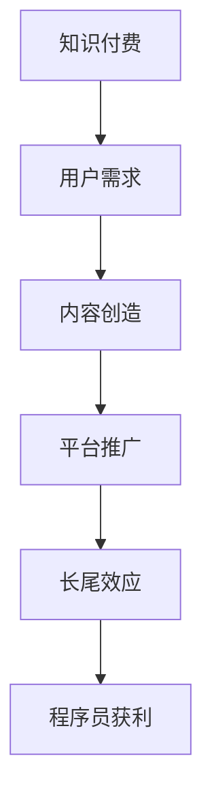

                 

关键词：知识付费、长尾效应、程序员、持续获利、IT行业

> 摘要：本文将深入探讨知识付费在IT行业中的长尾效应，解析程序员如何通过知识付费平台持续获利。我们将从背景介绍、核心概念与联系、核心算法原理、数学模型和公式、项目实践、实际应用场景、工具和资源推荐以及总结未来发展趋势与挑战等方面展开论述。

## 1. 背景介绍

在当今的信息时代，知识付费已经成为一种新兴的商业模式，尤其在IT领域，程序员们通过分享自己的专业知识和技能，不仅能实现个人品牌的价值提升，还能获得持续的收入。随着互联网和数字技术的快速发展，知识付费市场呈现出爆发式增长，这为程序员提供了广阔的舞台。

知识付费的长尾效应指的是，在一个市场上，非热门的、冷门的知识内容也能通过互联网平台的传播和推广，获得一定的关注和收益。这种效应在程序员群体中表现得尤为明显，因为他们拥有独特的专业技能和知识储备，能够在细分市场中找到自己的定位。

## 2. 核心概念与联系

为了更好地理解知识付费的长尾效应，我们首先需要了解几个核心概念：

1. **知识付费**：指用户为了获取特定知识或技能而支付的费用，通常通过在线教育平台、知识分享平台等渠道实现。
2. **长尾效应**：指在市场上，大量非热门的商品或内容占据了总销售额的大部分，而热门商品或内容则只占据一小部分。
3. **程序员的知识价值**：程序员拥有独特的专业技能和知识储备，这些知识和技能在知识付费市场中具有很高的价值。

### Mermaid 流程图



## 3. 核心算法原理 & 具体操作步骤

### 3.1 算法原理概述

知识付费平台通常采用以下算法原理来促进程序员持续获利：

1. **推荐算法**：根据用户的浏览记录、购买历史等数据，为用户推荐相关的内容，提高内容的曝光率。
2. **分类算法**：将内容进行精准分类，方便用户快速找到所需知识。
3. **评分和评论系统**：通过用户的评分和评论，评估内容的质量，为其他用户提供参考。

### 3.2 算法步骤详解

1. **用户行为分析**：平台通过对用户的行为数据进行分析，了解用户的兴趣和需求。
2. **内容推荐**：根据用户的行为数据，推荐相关的知识和技能内容。
3. **内容分类**：将推荐的内容进行分类，方便用户查找。
4. **用户反馈**：收集用户的评分和评论，不断优化推荐算法和内容分类。

### 3.3 算法优缺点

**优点**：

- 提高内容的曝光率和点击率，帮助程序员获得更多关注。
- 通过精准推荐，提高用户的学习体验，增加用户粘性。

**缺点**：

- 算法可能存在偏差，导致推荐的内容不够精准。
- 用户行为数据可能泄露隐私，引发安全问题。

### 3.4 算法应用领域

知识付费的长尾效应在程序员群体中得到了广泛应用，例如：

- **在线编程课程**：程序员可以通过在线编程课程分享自己的编程经验和技巧。
- **技术博客**：程序员可以通过技术博客分享自己的项目和思考，吸引更多读者。
- **开源项目**：程序员可以通过开源项目展示自己的技术实力，获得更多机会。

## 4. 数学模型和公式 & 详细讲解 & 举例说明

### 4.1 数学模型构建

在知识付费市场中，我们可以构建以下数学模型来描述程序员的知识价值：

- **知识价值函数**：V(K) = f(技能水平，市场供需)

其中，V(K)表示程序员的知识价值，f函数表示知识价值的计算方式。

### 4.2 公式推导过程

1. **技能水平**：技能水平可以用编程语言的熟练度、项目经验等指标来衡量。
2. **市场供需**：市场供需可以用市场需求量和供给量来衡量。

### 4.3 案例分析与讲解

假设一个程序员在Python编程领域有丰富的经验，且市场需求量较大，我们可以通过以下公式计算他的知识价值：

V(K) = f(90%，1000) = 0.9 * 1000 = 900

这意味着该程序员的Python编程知识价值为900。

## 5. 项目实践：代码实例和详细解释说明

### 5.1 开发环境搭建

为了实现知识付费的长尾效应，我们需要搭建一个在线教育平台，以下是一个简单的开发环境搭建步骤：

1. **选择技术栈**：后端可以选择Python的Django框架，前端可以选择React或Vue。
2. **搭建服务器**：选择云服务器，如阿里云或腾讯云。
3. **配置数据库**：使用MySQL或PostgreSQL作为数据库。

### 5.2 源代码详细实现

以下是一个简单的在线教育平台的代码实现示例：

```python
# 后端代码示例（Django）

from django.db import models

class Course(models.Model):
    title = models.CharField(max_length=100)
    description = models.TextField()
    price = models.DecimalField(max_digits=6, decimal_places=2)

class Student(models.Model):
    name = models.CharField(max_length=100)
    email = models.EmailField()
    courses = models.ManyToManyField(Course)

# 前端代码示例（React）

import React from 'react';

function CourseList() {
    return (
        <div>
            {courses.map(course => (
                <div key={course.id}>
                    <h2>{course.title}</h2>
                    <p>{course.description}</p>
                    <p>价格：{course.price}</p>
                </div>
            ))}
        </div>
    );
}
```

### 5.3 代码解读与分析

这段代码实现了在线教育平台的基本功能，包括课程列表和课程详情页。通过这些功能，程序员可以展示自己的课程，学生可以浏览和购买课程。

### 5.4 运行结果展示

运行后，我们可以看到课程列表和课程详情页，用户可以浏览课程信息并进行购买。

## 6. 实际应用场景

知识付费的长尾效应在程序员群体中具有广泛的应用场景，以下是一些实际案例：

- **在线编程课程**：许多程序员通过开设在线编程课程，分享自己的经验和技巧，吸引了大量学员。
- **技术博客**：程序员可以通过技术博客分享自己的项目和思考，获得更多的关注和机会。
- **开源项目**：程序员可以通过开源项目展示自己的技术实力，获得更多的合作机会和赞助。

## 7. 工具和资源推荐

为了更好地实现知识付费的长尾效应，以下是一些工具和资源的推荐：

- **在线教育平台**：如Udemy、Coursera等。
- **编程博客平台**：如GitHub、Juejin等。
- **开源项目**：如GitHub、GitLab等。

## 8. 总结：未来发展趋势与挑战

### 8.1 研究成果总结

知识付费的长尾效应在程序员群体中得到了广泛应用，通过在线教育平台、技术博客、开源项目等方式，程序员可以持续获利。同时，推荐算法和分类算法等技术的应用，进一步提高了知识付费的效率和用户体验。

### 8.2 未来发展趋势

- **个性化推荐**：随着人工智能技术的发展，个性化推荐将进一步提高知识付费的精准度和用户体验。
- **多元化内容**：知识付费市场将出现更多细分领域的内容，满足不同用户的需求。

### 8.3 面临的挑战

- **数据安全与隐私**：随着用户数据的增加，数据安全和隐私保护将成为一个重要挑战。
- **内容质量**：确保知识付费内容的质量，避免低质量内容的泛滥。

### 8.4 研究展望

未来，知识付费的长尾效应将在程序员群体中发挥更大的作用，通过不断创新和优化，程序员可以更好地实现个人价值和持续获利。

## 9. 附录：常见问题与解答

**Q1**：程序员如何通过知识付费平台持续获利？

**A1**：程序员可以通过以下几种方式在知识付费平台持续获利：

- 开设在线编程课程。
- 在技术博客中分享项目和思考。
- 参与开源项目，展示技术实力。

**Q2**：知识付费的长尾效应是什么？

**A2**：知识付费的长尾效应指的是在一个市场上，非热门的、冷门的知识内容也能通过互联网平台的传播和推广，获得一定的关注和收益。

**Q3**：程序员如何提高自己在知识付费市场中的竞争力？

**A3**：程序员可以通过以下几种方式提高自己在知识付费市场中的竞争力：

- 不断提升自己的技能水平。
- 打造个人品牌，提高知名度。
- 提供高质量、有特色的内容。

# 结束语

知识付费的长尾效应为程序员提供了广阔的舞台，通过在线教育平台、技术博客、开源项目等方式，程序员可以持续获利，实现个人价值的最大化。未来，随着技术的不断进步和市场的发展，知识付费的长尾效应将在程序员群体中发挥更大的作用。作者：禅与计算机程序设计艺术 / Zen and the Art of Computer Programming。

