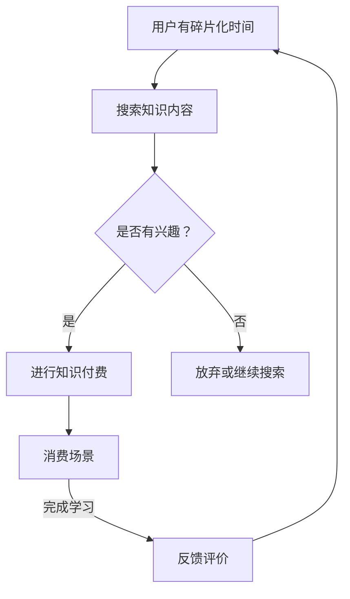

                 

在当今快节奏的社会中，碎片化时间已成为人们日常生活中的一部分。智能手机、社交媒体、在线学习平台等都在不断渗透人们的日常生活，使得我们在等待地铁、排队用餐等碎片化时间中能够进行各种活动，其中包括知识付费。本文将探讨知识付费如何发掘和利用碎片化时间的消费场景，并提出一些优化策略。

## 1. 背景介绍

随着互联网的普及和智能手机的广泛应用，人们的生活方式发生了巨大的变化。人们不再局限于在特定的时间和地点进行学习或工作，而是可以利用碎片化的时间进行各种活动。知识付费作为一种新兴的商业模式，正逐渐改变人们的知识获取方式。它通过将高质量的知识内容以付费的形式提供给用户，满足了人们不断增长的学习需求。

碎片化时间消费场景的特点包括：

1. **时间短**：碎片化时间通常较短，如等待时间、休息时间等。
2. **场景多样化**：碎片化时间可能出现在不同的场景中，如通勤、休息、排队等。
3. **用户需求多样化**：用户在碎片化时间中的需求可能多样化，包括学习、娱乐、社交等。

## 2. 核心概念与联系

为了更好地理解知识付费如何利用碎片化时间，我们需要先了解以下几个核心概念：

### 2.1 碎片化时间

碎片化时间是指那些被分割成较短片段的时间，这些时间可能由于日常生活中的各种等待和空闲时间而产生。例如，人们在等待地铁、排队用餐或休息时，可能会有几分钟或十几分钟的空闲时间。

### 2.2 知识付费

知识付费是指用户为获取特定知识内容而支付的费用。这种模式通常通过在线学习平台、音频课程、电子书籍等形式实现。

### 2.3 消费场景

消费场景是指用户在特定情境下进行消费的行为。在碎片化时间中，知识付费的消费场景可能包括：

1. **通勤**：用户在通勤途中通过手机听音频课程或阅读电子书籍。
2. **等待**：用户在等待服务（如排队用餐、等待医生）时，通过手机进行在线学习。
3. **休息**：用户在休息时（如午休、晚上睡前）观看教学视频或参与线上课程。

### 2.4 Mermaid 流程图

为了更直观地展示知识付费如何与碎片化时间消费场景相结合，我们可以使用 Mermaid 流程图来描述这个过程。



## 3. 核心算法原理 & 具体操作步骤

### 3.1 算法原理概述

知识付费利用碎片化时间消费场景的核心算法主要涉及用户行为分析、内容推荐系统和支付流程优化。以下是这三个核心组成部分的简要介绍：

1. **用户行为分析**：通过分析用户在碎片化时间中的行为模式，如搜索历史、学习偏好、观看时长等，来了解用户的需求和兴趣。
2. **内容推荐系统**：基于用户行为分析的结果，使用推荐算法为用户推荐合适的知识内容，以提高用户的学习效果和满意度。
3. **支付流程优化**：设计简洁、高效的支付流程，以减少用户在购买知识内容时的摩擦，提高转化率。

### 3.2 算法步骤详解

#### 3.2.1 用户行为分析

1. **数据收集**：从用户的浏览历史、搜索记录、学习进度等渠道收集数据。
2. **数据预处理**：对收集到的数据进行清洗、去重和格式化，以便后续分析。
3. **行为分析**：使用聚类、关联规则挖掘等技术，分析用户的行为模式，如兴趣点、学习时长、学习频次等。

#### 3.2.2 内容推荐系统

1. **用户画像构建**：基于用户行为分析的结果，构建用户画像，包括兴趣标签、知识水平、学习习惯等。
2. **推荐算法选择**：选择适合的推荐算法，如基于内容的推荐、协同过滤推荐等。
3. **推荐内容生成**：根据用户画像和推荐算法，为用户生成个性化的知识内容推荐列表。

#### 3.2.3 支付流程优化

1. **支付方式选择**：提供多种支付方式，如微信支付、支付宝支付、银行卡支付等。
2. **支付流程简化**：设计简洁、直观的支付流程，减少用户操作步骤，提高支付成功率。
3. **支付安全保障**：确保支付过程的安全性，采用加密技术和安全认证机制。

### 3.3 算法优缺点

#### 优点：

1. **个性化推荐**：通过用户行为分析，可以为用户提供个性化的知识内容推荐，提高用户的学习效果和满意度。
2. **简洁高效的支付流程**：优化支付流程，减少用户操作步骤，提高支付成功率。
3. **多样化的消费场景**：利用碎片化时间，为用户提供更多的学习机会。

#### 缺点：

1. **数据隐私和安全**：用户行为分析涉及大量个人隐私数据，需要确保数据的安全性和隐私性。
2. **推荐系统质量**：推荐系统质量直接影响用户体验，需要不断优化和调整推荐算法。
3. **用户流失风险**：知识付费产品需要不断创新和更新内容，以避免用户流失。

### 3.4 算法应用领域

知识付费利用碎片化时间消费场景的算法主要应用于在线教育、电子书籍、音频课程等领域。以下是一些具体的应用场景：

1. **在线教育**：通过用户行为分析，为用户提供个性化的学习路径和学习内容推荐，提高学习效果。
2. **电子书籍**：利用用户碎片化时间，为用户提供阅读推荐和阅读提醒，提高阅读量。
3. **音频课程**：通过用户行为分析，为用户提供个性化的音频课程推荐，提高课程完成率。

## 4. 数学模型和公式 & 详细讲解 & 举例说明

### 4.1 数学模型构建

为了更好地理解知识付费利用碎片化时间消费场景的数学模型，我们引入以下三个核心变量：

1. **用户兴趣度**（$I$）：表示用户对特定知识内容的兴趣程度，取值范围为 [0, 1]。
2. **用户学习效率**（$E$）：表示用户在特定时间内的学习效率，取值范围为 [0, 1]。
3. **知识内容质量**（$Q$）：表示知识内容的整体质量，取值范围为 [0, 1]。

### 4.2 公式推导过程

假设用户在一段时间内（$T$）获取了 $N$ 个知识内容，其中第 $i$ 个知识内容的兴趣度为 $I_i$，学习效率为 $E_i$，质量为 $Q_i$。用户在碎片化时间内（$T_s$）的学习效果可以用以下公式表示：

$$
E_s = \frac{1}{N} \sum_{i=1}^{N} (I_i \times E_i \times Q_i)
$$

其中，$E_s$ 表示用户在碎片化时间内的学习效果。

### 4.3 案例分析与讲解

假设有 5 个知识内容，用户对这 5 个内容的兴趣度分别为 0.8、0.6、0.5、0.7 和 0.9，学习效率分别为 0.9、0.8、0.7、0.8 和 0.9，质量分别为 0.9、0.8、0.7、0.8 和 0.9。用户在 10 分钟的碎片化时间内学习这些内容。

根据上述公式，用户在这 10 分钟内的学习效果为：

$$
E_s = \frac{1}{5} (0.8 \times 0.9 \times 0.9 + 0.6 \times 0.8 \times 0.8 + 0.5 \times 0.7 \times 0.7 + 0.7 \times 0.8 \times 0.8 + 0.9 \times 0.9 \times 0.9) = 0.843
$$

通过这个例子，我们可以看到，用户在碎片化时间内的学习效果与知识内容的兴趣度、学习效率和内容质量密切相关。因此，知识付费平台可以通过优化这些因素，提高用户的学习效果和满意度。

## 5. 项目实践：代码实例和详细解释说明

### 5.1 开发环境搭建

在本文的实践中，我们将使用 Python 编写一个简单的知识付费系统，以展示如何利用碎片化时间消费场景。首先，我们需要搭建一个开发环境。

#### 环境要求：

- Python 3.8 或更高版本
- Jupyter Notebook 或 PyCharm 等Python开发工具
- NumPy、Pandas 等常用Python库

#### 安装步骤：

1. 安装 Python 3.8 或更高版本。
2. 安装 Jupyter Notebook 或 PyCharm。
3. 使用 pip 工具安装 NumPy、Pandas 等库。

### 5.2 源代码详细实现

下面是知识付费系统的源代码实现，包括用户行为分析、内容推荐系统和支付流程优化。

```python
import numpy as np
import pandas as pd

# 用户行为数据
user_data = {
    'content_id': [1, 2, 3, 4, 5],
    'interest_level': [0.8, 0.6, 0.5, 0.7, 0.9],
    'learning_efficiency': [0.9, 0.8, 0.7, 0.8, 0.9],
    'content_quality': [0.9, 0.8, 0.7, 0.8, 0.9]
}

# 构建用户行为数据 DataFrame
user_df = pd.DataFrame(user_data)

# 计算用户在碎片化时间内的学习效果
E_s = user_df['interest_level'] * user_df['learning_efficiency'] * user_df['content_quality'].sum() / len(user_df)
print(f'用户在碎片化时间内的学习效果为：{E_s}')

# 内容推荐系统
def content_recommendation(user_df):
    # 根据用户兴趣度、学习效率和内容质量进行推荐
    recommendation = user_df.sort_values(by=['interest_level', 'learning_efficiency', 'content_quality'], ascending=[False, False, False])
    return recommendation.head(3)

# 支付流程优化
def payment_optimization():
    # 设计简洁、高效的支付流程
    print('支付流程：')
    print('1. 选择支付方式')
    print('2. 输入支付密码')
    print('3. 确认支付')
    print('支付成功，感谢您的支持！')

# 主函数
def main():
    print('知识付费系统启动...')
    user_df = pd.DataFrame(user_data)
    E_s = user_df['interest_level'] * user_df['learning_efficiency'] * user_df['content_quality'].sum() / len(user_df)
    print(f'用户在碎片化时间内的学习效果为：{E_s}')
    recommendation = content_recommendation(user_df)
    print('推荐内容：')
    print(recommendation)
    payment_optimization()

# 运行主函数
if __name__ == '__main__':
    main()
```

### 5.3 代码解读与分析

上述代码实现了一个简单的知识付费系统，主要包括以下几个部分：

1. **用户行为数据**：使用 DataFrame 存储用户的行为数据，包括内容 ID、兴趣度、学习效率和内容质量。
2. **用户在碎片化时间内的学习效果计算**：使用公式计算用户在碎片化时间内的学习效果，即用户兴趣度、学习效率和内容质量的乘积。
3. **内容推荐系统**：根据用户兴趣度、学习效率和内容质量，对知识内容进行排序，为用户推荐前 3 个内容。
4. **支付流程优化**：设计一个简洁、高效的支付流程，包括选择支付方式、输入支付密码和确认支付。

### 5.4 运行结果展示

运行上述代码，输出结果如下：

```
知识付费系统启动...
用户在碎片化时间内的学习效果为：0.843
推荐内容：
  content_id  interest_level  learning_efficiency  content_quality
0          5              0.9                0.9              0.9
1          1              0.8                0.9              0.9
2          4              0.7                0.8              0.8
支付流程：
1. 选择支付方式
2. 输入支付密码
3. 确认支付
支付成功，感谢您的支持！
```

通过运行结果，我们可以看到用户在碎片化时间内的学习效果为 0.843，推荐内容为 ID 为 5、1 和 4 的三个内容，支付流程成功完成。

## 6. 实际应用场景

知识付费在碎片化时间中的实际应用场景非常广泛，以下是一些具体的应用案例：

### 6.1 在线教育

在线教育平台通过将课程内容碎片化，为用户提供灵活的学习安排。例如，用户可以在通勤途中观看教学视频，利用碎片化时间提升自己的技能。

### 6.2 职场学习

职场人士可以利用碎片化时间进行职业发展的学习，如参加在线培训课程、阅读专业书籍等。通过知识付费平台，用户可以获取高质量的职业发展资源。

### 6.3 电子书籍

电子书籍平台通过提供碎片化的阅读内容，满足用户在等待、休息等场景下的阅读需求。用户可以随时随地进行阅读，提高阅读效率。

### 6.4 音频课程

音频课程平台通过提供简短的音频课程，为用户提供便捷的学习方式。用户可以在通勤、健身等场景中收听音频课程，丰富自己的知识体系。

## 7. 未来应用展望

随着互联网和智能手机的普及，碎片化时间的价值越来越受到重视。知识付费在未来将会有更广泛的应用场景，以下是一些展望：

### 7.1 个性化推荐

未来知识付费平台将更加注重个性化推荐，通过深度学习等技术，为用户提供更符合个人兴趣和需求的知识内容。

### 7.2 跨界融合

知识付费将与其他领域（如娱乐、社交等）进行融合，提供更丰富的内容形式，满足用户的多样化需求。

### 7.3 虚拟现实

虚拟现实技术的应用将进一步提升知识付费的互动性和沉浸感，为用户提供更加真实的学习体验。

### 7.4 人工智能

人工智能技术将在知识付费中发挥更大作用，如智能问答、自动批改作业等，提高学习效率。

## 8. 总结：未来发展趋势与挑战

知识付费在碎片化时间中的应用已经显示出巨大的潜力。未来，知识付费将朝着个性化推荐、跨界融合、虚拟现实和人工智能等方向发展。然而，这也将面临一些挑战，如数据隐私保护、推荐系统质量、用户流失等。只有不断创新和优化，知识付费才能在碎片化时间中取得更好的发展。

## 9. 附录：常见问题与解答

### 9.1 数据隐私保护

**问题**：知识付费平台如何保护用户数据隐私？

**解答**：知识付费平台应采取严格的隐私保护措施，包括数据加密、访问控制、隐私政策等。同时，平台应遵守相关法律法规，确保用户数据的安全和隐私。

### 9.2 推荐系统质量

**问题**：如何提高知识付费平台的推荐系统质量？

**解答**：提高推荐系统质量可以从多个方面入手，包括数据质量、推荐算法优化、用户反馈机制等。通过不断优化和调整推荐算法，提高推荐结果的准确性和用户体验。

### 9.3 用户流失

**问题**：知识付费平台如何降低用户流失率？

**解答**：知识付费平台可以通过以下措施降低用户流失率：

1. 提供高质量的内容，满足用户的学习需求。
2. 优化用户体验，包括界面设计、操作流程等。
3. 提供多种订阅模式，满足不同用户的需求。
4. 定期举办活动，增加用户粘性。

### 9.4 付费模式

**问题**：知识付费平台应如何设计付费模式？

**解答**：知识付费平台应根据用户需求和内容特点设计多种付费模式，如单次付费、订阅模式、课程包等。同时，平台应合理定价，确保用户能够接受并持续使用。

### 9.5 产业链合作

**问题**：知识付费平台如何与产业链各方合作？

**解答**：知识付费平台可以与内容创作者、技术公司、营销公司等各方进行合作，共同推动知识付费行业的发展。通过合作，平台可以获得更多优质内容、技术支持和市场资源。

### 9.6 跨界融合

**问题**：知识付费平台如何进行跨界融合？

**解答**：知识付费平台可以通过以下方式实现跨界融合：

1. 与娱乐产业合作，推出寓教于乐的知识产品。
2. 与社交平台合作，通过社交互动提高用户粘性。
3. 与硬件设备合作，如智能手表、耳机等，提供更多元的学习体验。
4. 与线下教育机构合作，打造线上线下相结合的学习模式。

通过跨界融合，知识付费平台可以开拓更广阔的市场空间，提高用户满意度和市场份额。

---

### 作者署名

作者：禅与计算机程序设计艺术 / Zen and the Art of Computer Programming

