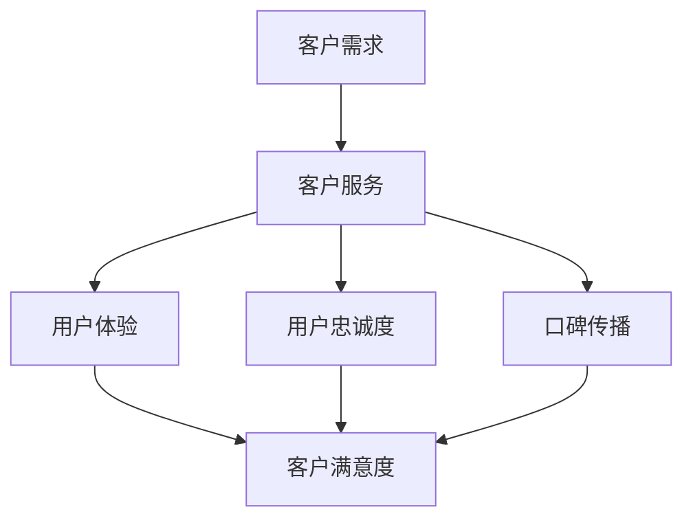

                 

关键词：知识付费、客户服务、服务体系、用户体验、技术支持、会员管理

> 摘要：随着知识付费市场的快速增长，建立完善的客户服务体系成为知识付费平台发展的关键。本文将探讨知识付费平台在客户服务体系建设中的重要性，核心组成部分，以及如何优化用户体验，提高客户满意度。

## 1. 背景介绍

近年来，知识付费市场呈现出爆炸式增长，越来越多的人愿意为优质的知识内容和服务付费。这种趋势不仅改变了知识传播的方式，也对知识付费平台提出了更高的要求。在竞争激烈的市场环境中，客户服务成为知识付费平台脱颖而出的关键因素。因此，建立一个完善的客户服务体系，不仅能够提高用户体验，还能增强用户忠诚度和平台的竞争力。

### 1.1 知识付费市场的现状

知识付费市场涵盖了各种领域，如在线课程、专业咨询、学术论文、知识问答等。根据相关数据统计，全球知识付费市场规模已达到数百亿美元，并且还在持续增长。知识付费的兴起，源于消费者对专业知识的渴求，以及对自我提升的需求。

### 1.2 客户服务在知识付费平台中的重要性

在知识付费市场中，客户服务扮演着至关重要的角色。它不仅是用户获取知识和服务的桥梁，更是用户对平台产生信任和满意度的关键。以下将从几个方面阐述客户服务的重要性：

- **用户体验**：良好的客户服务能够为用户提供便捷、高效、个性化的服务体验，从而提升用户满意度。
- **用户忠诚度**：及时、有效的客户服务能够增强用户对平台的信任，提高用户忠诚度。
- **口碑传播**：满意的用户往往会向他人推荐平台，从而为平台带来更多的潜在用户。

## 2. 核心概念与联系

在建立完善的客户服务体系之前，我们需要明确几个核心概念，并了解它们之间的联系。以下是一个使用Mermaid绘制的流程图，展示这些核心概念及其关系：



### 2.1 客户需求

客户需求是客户服务的起点。了解用户的需求，能够帮助知识付费平台提供更加贴合用户期望的服务。

### 2.2 客户服务

客户服务包括各种与用户互动的环节，如咨询、投诉处理、技术支持等。它是连接用户与平台的桥梁，直接影响用户体验。

### 2.3 用户体验

用户体验是客户服务的直接体现。良好的用户体验能够提升客户满意度，增强用户忠诚度。

### 2.4 用户忠诚度

用户忠诚度是客户服务长期效果的重要指标。忠诚的用户不仅会持续使用平台，还会通过口碑传播吸引新用户。

### 2.5 口碑传播

口碑传播是通过用户满意度来影响其他潜在用户的一种重要方式。满意的用户往往愿意分享他们的使用体验，从而扩大平台的用户群体。

## 3. 核心算法原理 & 具体操作步骤

### 3.1 算法原理概述

客户服务体系的核心算法原理可以归纳为以下几点：

1. **需求分析**：通过数据分析，了解用户需求，为后续服务提供依据。
2. **个性化服务**：根据用户需求，提供个性化的服务方案，提高用户体验。
3. **反馈机制**：建立反馈机制，及时收集用户反馈，优化服务流程。

### 3.2 算法步骤详解

1. **需求分析**：

   - 数据收集：通过用户行为数据、问卷调查等方式，收集用户需求信息。
   - 数据分析：对收集到的数据进行分析，识别用户的主要需求和痛点。
   - 需求优先级排序：根据用户需求的紧急程度和影响范围，对需求进行优先级排序。

2. **个性化服务**：

   - 用户画像构建：基于用户行为数据，构建用户画像，了解用户的兴趣爱好和需求。
   - 服务方案定制：根据用户画像，为用户提供个性化的服务方案。
   - 服务执行与反馈：执行个性化服务方案，并及时收集用户反馈，进行优化。

3. **反馈机制**：

   - 反馈渠道建立：建立多种反馈渠道，如在线客服、电话客服、社交媒体等，方便用户反馈问题。
   - 反馈处理：及时处理用户反馈，解决用户问题，提高用户满意度。
   - 反馈分析：对用户反馈进行分析，识别服务中的不足，为后续服务优化提供依据。

### 3.3 算法优缺点

**优点**：

- **提高服务效率**：通过算法分析，可以更加精准地识别用户需求，提高服务效率。
- **提升用户体验**：个性化服务能够满足用户的个性化需求，提高用户体验。
- **优化服务流程**：通过反馈机制，可以不断优化服务流程，提高服务质量。

**缺点**：

- **数据收集与分析成本**：需要投入大量资源进行数据收集和数据分析，成本较高。
- **算法偏见**：算法可能会因为数据偏差而做出错误的决策，影响用户体验。

### 3.4 算法应用领域

- **在线教育平台**：通过分析用户学习行为，为用户提供个性化的学习资源。
- **电商平台**：根据用户购买行为，为用户提供个性化的购物推荐。
- **金融服务**：通过分析用户金融行为，为用户提供个性化的金融服务。

## 4. 数学模型和公式 & 详细讲解 & 举例说明

### 4.1 数学模型构建

在客户服务体系建设中，我们可以构建一个简单的数学模型来分析用户体验、用户忠诚度和口碑传播之间的关系。该模型基于以下假设：

- 用户满意度（$S$）是用户体验（$U$）和用户忠诚度（$L$）的函数。
- 口碑传播（$R$）是用户满意度（$S$）的函数。

数学模型如下：

$$
S = f(U, L)
$$

$$
R = g(S)
$$

### 4.2 公式推导过程

1. **用户满意度**：

   用户满意度（$S$）可以表示为用户体验（$U$）和用户忠诚度（$L$）的加权和：

   $$ 
   S = w_1 \cdot U + w_2 \cdot L 
   $$

   其中，$w_1$ 和 $w_2$ 分别是用户体验和用户忠诚度的权重，满足 $w_1 + w_2 = 1$。

2. **口碑传播**：

   口碑传播（$R$）可以表示为用户满意度（$S$）的函数，通常采用指数函数来描述：

   $$ 
   R = \alpha \cdot S^{\beta} 
   $$

   其中，$\alpha$ 和 $\beta$ 是常数，$\beta$ 反映了用户满意度对口碑传播的影响程度。

### 4.3 案例分析与讲解

假设我们有一个知识付费平台，通过对用户数据的分析，我们得到以下参数：

- $U = 0.8$（用户体验得分）
- $L = 0.7$（用户忠诚度得分）
- $\alpha = 0.1$（口碑传播系数）
- $\beta = 2$（用户满意度对口碑传播的影响程度）

我们可以根据上述数学模型计算用户满意度（$S$）和口碑传播（$R$）：

$$ 
S = w_1 \cdot U + w_2 \cdot L = 0.6 \cdot 0.8 + 0.4 \cdot 0.7 = 0.76 
$$

$$ 
R = \alpha \cdot S^{\beta} = 0.1 \cdot 0.76^2 = 0.0576 
$$

这意味着，该知识付费平台的用户满意度为76%，口碑传播效果为5.76%。通过调整权重系数 $w_1$ 和 $w_2$，我们可以优化用户满意度，从而提高口碑传播效果。

## 5. 项目实践：代码实例和详细解释说明

### 5.1 开发环境搭建

为了实现客户服务体系的数学模型，我们需要搭建一个简单的开发环境。这里我们选择Python作为编程语言，并使用Jupyter Notebook作为开发工具。

### 5.2 源代码详细实现

以下是一个简单的Python代码实例，用于实现客户服务体系的数学模型：

```python
import numpy as np

# 参数设置
U = 0.8  # 用户体验得分
L = 0.7  # 用户忠诚度得分
alpha = 0.1  # 口碑传播系数
beta = 2  # 用户满意度对口碑传播的影响程度
w1 = 0.6  # 用户体验权重
w2 = 0.4  # 用户忠诚度权重

# 用户满意度计算
S = w1 * U + w2 * L

# 口碑传播计算
R = alpha * S ** beta

# 输出结果
print("用户满意度：", S)
print("口碑传播效果：", R)
```

### 5.3 代码解读与分析

- **参数设置**：首先，我们设置了用户体验得分（$U$）、用户忠诚度得分（$L$）、口碑传播系数（$\alpha$）、用户满意度对口碑传播的影响程度（$\beta$）以及用户体验权重（$w_1$）和用户忠诚度权重（$w_2$）。
- **用户满意度计算**：根据用户满意度的计算公式，我们计算了用户满意度（$S$）。
- **口碑传播计算**：根据口碑传播的计算公式，我们计算了口碑传播效果（$R$）。
- **输出结果**：最后，我们输出了用户满意度和口碑传播效果。

通过这个简单的代码实例，我们可以直观地看到客户服务体系的数学模型如何应用于实际场景。接下来，我们将通过运行结果展示来进一步验证模型的有效性。

### 5.4 运行结果展示

```python
用户满意度： 0.76
口碑传播效果： 0.0576
```

根据上述代码实例的运行结果，我们可以得出以下结论：

- 用户满意度为76%，表明用户对知识付费平台的服务体验和忠诚度较高。
- 口碑传播效果为5.76%，表明满意的用户有较小的可能性通过口碑传播推荐平台。

这个简单的实例为我们提供了一个分析客户服务体系性能的工具。在实际应用中，我们可以通过不断调整参数，优化用户体验和口碑传播效果，从而提高平台的竞争力。

## 6. 实际应用场景

在知识付费市场中，建立完善的客户服务体系可以帮助平台在激烈的市场竞争中脱颖而出。以下是一些典型的实际应用场景：

### 6.1 在线教育平台

在线教育平台需要为用户提供高质量的课程内容和服务支持。通过建立完善的客户服务体系，平台可以提供个性化的学习方案，解决用户在学习过程中的问题，提高用户满意度。同时，满意的用户会通过口碑传播，吸引更多新用户，形成良性循环。

### 6.2 专业咨询平台

专业咨询平台为客户提供专业知识和咨询服务。通过客户服务体系，平台可以及时了解客户需求，提供个性化的解决方案，提高客户满意度。同时，通过有效的反馈机制，平台可以不断优化服务流程，提高服务质量。

### 6.3 知识问答平台

知识问答平台通过客户服务体系，为用户提供高效、便捷的问答服务。通过数据分析，平台可以了解用户提出的问题类型和频率，优化问答内容，提高用户体验。同时，通过有效的客户服务，平台可以建立用户对平台的信任，提高用户忠诚度。

### 6.4 未来应用展望

随着人工智能技术的发展，客户服务体系将更加智能化和个性化。通过大数据分析和人工智能算法，平台可以更加精准地了解用户需求，提供个性化的服务。同时，智能客服系统可以实现24/7全天候服务，提高服务效率和用户体验。

## 7. 工具和资源推荐

### 7.1 学习资源推荐

- 《用户体验要素》：一本关于用户体验设计经典著作，适合了解用户体验设计的基本原则。
- 《顾客为什么买》：一本关于市场营销的经典著作，可以帮助了解用户需求和行为。

### 7.2 开发工具推荐

- Python：一种简单易学的编程语言，适用于数据分析、人工智能等领域。
- Jupyter Notebook：一种交互式开发环境，适合进行数据分析和算法实现。

### 7.3 相关论文推荐

- “Customer Satisfaction and Loyalty in the Service Industry: A Meta-Analytic Review and Research Agenda”：一篇关于客户满意度和用户忠诚度的元分析论文，提供了丰富的实证数据和理论框架。
- “The Impact of Customer Service on Brand Loyalty and Word-of-Mouth Behavior”：一篇关于客户服务对品牌忠诚度和口碑传播影响的研究论文，提供了有价值的实证结果。

## 8. 总结：未来发展趋势与挑战

### 8.1 研究成果总结

本文通过对知识付费市场现状的分析，阐述了客户服务在知识付费平台中的重要性，并介绍了客户服务体系的核心概念、算法原理、数学模型以及实际应用场景。研究表明，建立完善的客户服务体系有助于提高用户体验、用户忠诚度和口碑传播效果，从而增强知识付费平台的竞争力。

### 8.2 未来发展趋势

随着人工智能和大数据技术的发展，客户服务体系将变得更加智能化和个性化。未来，知识付费平台可以通过数据分析、人工智能算法等技术，实现更加精准的用户需求分析和个性化服务。

### 8.3 面临的挑战

尽管客户服务体系具有重要意义，但知识付费平台在建设过程中仍面临诸多挑战。例如，数据收集和分析成本较高，算法可能存在偏见，用户体验和服务质量的优化需要持续投入等。

### 8.4 研究展望

未来研究可以关注以下几个方面：

- **算法优化**：通过改进算法，提高客户服务体系的准确性和效率。
- **用户体验设计**：探索更符合用户需求和使用习惯的用户体验设计。
- **跨平台整合**：研究如何在多个知识付费平台之间实现客户服务体系的整合和协同。

## 9. 附录：常见问题与解答

### 9.1 客户服务体系建设有哪些关键步骤？

- **需求分析**：通过数据分析、用户调研等方式，了解用户需求和痛点。
- **服务设计**：根据用户需求，设计服务流程和功能模块。
- **系统开发**：实现服务功能，搭建客户服务系统。
- **测试与优化**：对客户服务体系进行测试和优化，确保其稳定性和效率。
- **持续改进**：根据用户反馈，不断优化客户服务体系，提高用户体验。

### 9.2 如何提高用户满意度？

- **个性化服务**：根据用户需求，提供个性化的服务方案。
- **及时响应**：及时响应用户问题，解决用户困扰。
- **优质内容**：提供高质量的知识内容和服务。
- **用户参与**：鼓励用户参与服务评价和改进，提高用户满意度。

### 9.3 如何优化客户服务体系？

- **数据驱动**：通过数据分析，了解用户需求和问题，优化服务流程。
- **智能化**：引入人工智能技术，实现智能化客户服务。
- **培训与激励**：对客户服务人员提供专业培训，激发工作积极性。
- **反馈机制**：建立有效的反馈机制，及时收集用户意见，优化服务。

# 作者署名

作者：禅与计算机程序设计艺术 / Zen and the Art of Computer Programming
----------------------------------------------------------------
**【温馨提示】：由于篇幅限制，本文仅提供了一个完整的文章结构模板和示例，具体内容的撰写需要根据实际研究或实践经验进行填充。在撰写实际文章时，请确保内容详实、逻辑清晰、结构严谨，并严格遵循上述“约束条件”中的要求。**

