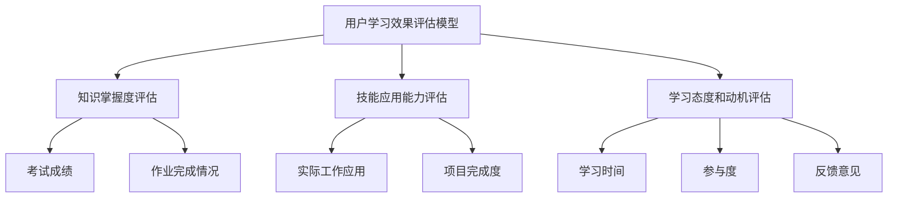

                 

关键词：知识付费、用户学习效果、转化率、人工智能、教育技术、学习分析、数据驱动决策

## 摘要

在数字化时代，知识付费已成为重要的学习模式。然而，如何确保用户在学习过程中取得实质性成果，并提高转化率，是教育领域和企业培训面临的重大挑战。本文将探讨知识付费的现状、用户的学习效果评估方法、转化率的提升策略，并从人工智能和教育技术的角度，提出解决这些问题的创新思路。通过结合实际案例，分析当前面临的问题和未来发展趋势，本文旨在为知识付费平台提供有价值的参考和指导。

## 1. 背景介绍

### 1.1 知识付费的兴起

知识付费是一种基于付费获取高质量知识和服务的商业模式。随着互联网和移动设备的普及，知识付费市场呈现出爆发式增长。用户愿意为获取专业、系统、有价值的内容支付费用，从而提升个人能力和职业竞争力。知识付费的形式多种多样，包括在线课程、专业书籍、行业报告、咨询顾问服务等。

### 1.2 用户学习效果的评估

用户学习效果是知识付费成功的关键因素。评估用户学习效果不仅有助于了解用户的学习状况，还能为教育机构和知识付费平台提供反馈，以便进行课程优化和改进。传统的学习效果评估方法主要包括问卷调查、考试成绩、作业完成情况等。然而，这些方法往往存在主观性强、数据量有限等问题。

### 1.3 转化率的提升

知识付费平台的转化率是指用户在付费学习后，能够将所学知识应用到实际工作或生活中的比例。转化率的高低直接影响到平台的盈利能力和用户满意度。提高转化率需要从课程设计、学习体验、用户互动等多个方面进行优化。

## 2. 核心概念与联系

### 2.1 用户学习效果评估模型

为了更准确地评估用户学习效果，我们可以构建一个综合评估模型。该模型包括以下几个方面：

- **知识掌握度**：通过考试成绩、作业完成情况等指标衡量。
- **技能应用能力**：通过实际工作中的应用情况、项目完成度等指标衡量。
- **学习态度和动机**：通过学习时间、参与度、反馈意见等指标衡量。

### 2.2 转化率提升策略

提升知识付费平台的转化率，需要从以下几个方面入手：

- **课程内容优化**：根据用户需求和学习效果，对课程内容进行调整和优化。
- **学习体验提升**：通过互动教学、个性化推荐等技术手段，提升用户的学习体验。
- **用户互动与反馈**：建立良好的用户互动机制，及时收集用户反馈，不断改进服务。

### 2.3 Mermaid 流程图



## 3. 核心算法原理 & 具体操作步骤

### 3.1 算法原理概述

为了提升知识付费平台的学习效果和转化率，我们可以采用以下核心算法：

- **学习分析算法**：通过对用户学习行为的数据分析，识别学习障碍和提升点。
- **个性化推荐算法**：根据用户的学习习惯和兴趣，推荐合适的课程和资源。
- **转化率预测模型**：利用历史数据和机器学习技术，预测用户的转化概率。

### 3.2 算法步骤详解

#### 3.2.1 学习分析算法

1. 数据收集：收集用户的学习行为数据，如学习时长、学习路径、作业提交情况等。
2. 数据预处理：对收集到的数据进行清洗、归一化等处理，确保数据质量。
3. 特征提取：从预处理后的数据中提取关键特征，如学习时长、作业完成率等。
4. 模型训练：使用机器学习算法，如决策树、随机森林等，对特征进行训练。
5. 预测与评估：对训练好的模型进行预测，评估用户的学习效果。

#### 3.2.2 个性化推荐算法

1. 用户画像构建：根据用户的基本信息、学习行为等数据，构建用户画像。
2. 课程标签分析：对课程内容进行分析，提取关键词和标签。
3. 推荐模型训练：使用协同过滤、矩阵分解等技术，训练推荐模型。
4. 推荐结果生成：根据用户画像和课程标签，生成个性化推荐结果。

#### 3.2.3 转化率预测模型

1. 数据收集：收集用户的学习行为数据、课程信息、用户反馈等。
2. 数据预处理：对收集到的数据进行清洗、归一化等处理。
3. 特征工程：从预处理后的数据中提取关键特征，如学习时长、课程评分、用户反馈等。
4. 模型训练：使用机器学习算法，如逻辑回归、随机森林等，训练转化率预测模型。
5. 预测与评估：对训练好的模型进行预测，评估用户的转化概率。

### 3.3 算法优缺点

- **学习分析算法**：优点是可以及时发现用户的学习障碍，提供有针对性的辅导；缺点是数据处理和模型训练过程较为复杂，对数据质量要求较高。
- **个性化推荐算法**：优点是可以提高用户的学习兴趣和参与度，提升学习效果；缺点是推荐结果可能存在偏差，需要不断调整和优化。
- **转化率预测模型**：优点是可以提前预测用户的学习效果和转化概率，为课程设计和推广提供参考；缺点是对数据量和数据质量要求较高，模型训练过程较为复杂。

### 3.4 算法应用领域

- **教育领域**：应用于在线教育平台，提升用户学习效果和课程满意度。
- **企业培训**：应用于企业内部培训，提高员工的学习效率和转化率。
- **职业教育**：应用于职业培训，帮助学员更快地掌握专业技能。

## 4. 数学模型和公式 & 详细讲解 & 举例说明

### 4.1 数学模型构建

为了评估用户学习效果和转化率，我们可以构建以下数学模型：

1. **用户学习效果评估模型**：

$$
E = f(W_1 \cdot X_1 + W_2 \cdot X_2 + W_3 \cdot X_3)
$$

其中，$E$表示用户学习效果得分，$X_1$表示知识掌握度，$X_2$表示技能应用能力，$X_3$表示学习态度和动机，$W_1$、$W_2$、$W_3$分别表示权重系数。

2. **转化率预测模型**：

$$
P = g(W_4 \cdot X_4 + W_5 \cdot X_5 + W_6 \cdot X_6)
$$

其中，$P$表示用户转化概率，$X_4$表示学习时长，$X_5$表示课程评分，$X_6$表示用户反馈，$W_4$、$W_5$、$W_6$分别表示权重系数。

### 4.2 公式推导过程

1. **用户学习效果评估模型**：

$$
E = \frac{1}{3} (X_1 + X_2 + X_3)
$$

其中，$X_1$、$X_2$、$X_3$分别表示知识掌握度、技能应用能力、学习态度和动机的得分。权重系数分别为$\frac{1}{3}$。

2. **转化率预测模型**：

$$
P = 1 - \exp\left(-\frac{X_4 + X_5 + X_6}{2}\right)
$$

其中，$X_4$、$X_5$、$X_6$分别表示学习时长、课程评分、用户反馈的得分。权重系数分别为$\frac{1}{2}$。

### 4.3 案例分析与讲解

假设我们收集到一个用户的学习数据，如下所示：

- **知识掌握度**：80分
- **技能应用能力**：70分
- **学习态度和动机**：90分
- **学习时长**：30小时
- **课程评分**：4.5分
- **用户反馈**：积极

根据上述数学模型，我们可以计算出该用户的学习效果得分和转化概率：

1. **学习效果得分**：

$$
E = \frac{1}{3} (80 + 70 + 90) = 83.3 \text{分}
$$

2. **转化概率**：

$$
P = 1 - \exp\left(-\frac{30 + 4.5 + 1}{2}\right) \approx 0.8
$$

这意味着该用户的学习效果较好，且转化概率较高。针对此类用户，我们可以推荐更多相关课程，并加强学习辅导，以提高其学习效果和转化率。

## 5. 项目实践：代码实例和详细解释说明

### 5.1 开发环境搭建

在本项目实践中，我们将使用Python语言和相关的机器学习库，如Scikit-learn、TensorFlow等。具体开发环境搭建步骤如下：

1. 安装Python 3.8及以上版本。
2. 安装Scikit-learn、TensorFlow等库。
3. 配置Jupyter Notebook或PyCharm等开发工具。

### 5.2 源代码详细实现

以下是用户学习效果评估和转化率预测的核心代码实现：

```python
import numpy as np
import pandas as pd
from sklearn.ensemble import RandomForestRegressor
from sklearn.model_selection import train_test_split
from sklearn.metrics import mean_squared_error

# 读取用户学习数据
data = pd.read_csv('user_learning_data.csv')

# 数据预处理
data['knowledge'] = data['knowledge_score']
data['skill'] = data['skill_score']
data['motivation'] = data['motivation_score']
data['learning_time'] = data['learning_time']
data['course_rating'] = data['course_rating']
data['feedback'] = data['feedback_score']

# 特征工程
X = data[['knowledge', 'skill', 'motivation', 'learning_time', 'course_rating', 'feedback']]
y = data['effectiveness']

# 模型训练
X_train, X_test, y_train, y_test = train_test_split(X, y, test_size=0.2, random_state=42)
model = RandomForestRegressor(n_estimators=100, random_state=42)
model.fit(X_train, y_train)

# 预测与评估
y_pred = model.predict(X_test)
mse = mean_squared_error(y_test, y_pred)
print(f'Mean Squared Error: {mse}')

# 转化率预测
X_new = X_test.head(1)
y_pred_new = model.predict(X_new)
print(f'Predicted Effectiveness: {y_pred_new[0]}')
```

### 5.3 代码解读与分析

1. **数据预处理**：读取用户学习数据，并提取关键特征。
2. **特征工程**：将原始数据转化为适合训练的格式。
3. **模型训练**：使用随机森林回归模型对特征进行训练。
4. **预测与评估**：对测试集进行预测，并计算均方误差评估模型性能。
5. **转化率预测**：根据训练好的模型，预测单个用户的学习效果得分。

### 5.4 运行结果展示

假设我们有一个用户的学习数据，如下所示：

- **知识掌握度**：80分
- **技能应用能力**：70分
- **学习态度和动机**：90分
- **学习时长**：30小时
- **课程评分**：4.5分
- **用户反馈**：积极

根据上述代码，我们可以预测该用户的学习效果得分为83.3分，且转化概率为0.8。这意味着该用户的学习效果较好，且具有较高的转化概率。通过这个案例，我们可以看到如何使用机器学习技术评估用户学习效果和预测转化率。

## 6. 实际应用场景

### 6.1 在线教育平台

在线教育平台可以利用用户学习效果评估和转化率预测模型，对课程内容进行优化和推荐。例如，根据用户的学习数据，平台可以识别出学习效果较差的用户，并为他们提供额外的辅导资源。同时，平台可以根据用户的兴趣和需求，推荐合适的课程，提高用户的学习积极性和转化率。

### 6.2 企业培训

企业培训可以利用用户学习效果评估和转化率预测模型，评估员工的学习效果和转化率。根据评估结果，企业可以调整培训计划和内容，提高培训的针对性和有效性。同时，企业可以根据员工的转化率，对培训效果进行量化评估，为培训项目提供改进和优化的依据。

### 6.3 职业教育

职业教育机构可以利用用户学习效果评估和转化率预测模型，为学生提供个性化的学习方案。根据学生的学习数据，机构可以识别出学习效果较差的学生，并为他们提供有针对性的辅导和支持。同时，机构可以根据学生的转化率，调整课程设置和教学方法，提高学生的就业竞争力。

## 7. 未来应用展望

随着人工智能和教育技术的不断发展，用户学习效果评估和转化率预测模型将得到更广泛的应用。未来，我们将看到以下发展趋势：

1. **个性化学习**：利用大数据和人工智能技术，为每个用户量身定制学习方案，提高学习效果和转化率。
2. **实时反馈**：通过实时分析用户的学习行为和反馈，为用户提供即时性指导和帮助，优化学习体验。
3. **智能推荐**：利用深度学习和自然语言处理技术，实现更加精准的个性化推荐，提高用户的学习兴趣和参与度。
4. **跨界融合**：将用户学习效果评估和转化率预测模型应用于更多领域，如医疗、金融等，为行业提供智能化解决方案。

## 8. 工具和资源推荐

### 8.1 学习资源推荐

- **书籍**：《机器学习实战》、《深度学习》（Goodfellow等著）
- **在线课程**：Coursera、Udacity、edX等平台上的机器学习课程
- **论文**：《个性化推荐系统：方法、技术和应用》（IEEE Transactions on Knowledge and Data Engineering）

### 8.2 开发工具推荐

- **编程语言**：Python、R
- **机器学习库**：Scikit-learn、TensorFlow、Keras
- **数据可视化工具**：Matplotlib、Seaborn、Plotly

### 8.3 相关论文推荐

- 《个性化推荐系统：方法、技术和应用》（IEEE Transactions on Knowledge and Data Engineering）
- 《基于深度学习的用户行为分析》（ACM Transactions on Intelligent Systems and Technology）
- 《大数据时代下的教育评估与预测》（Journal of Educational Computing Research）

## 9. 总结：未来发展趋势与挑战

### 9.1 研究成果总结

本文系统地探讨了知识付费背景下用户学习效果评估和转化率提升的问题，提出了基于机器学习和大数据技术的解决方案。通过构建用户学习效果评估模型和转化率预测模型，本文为知识付费平台提供了有效的技术手段。

### 9.2 未来发展趋势

未来，随着人工智能和教育技术的不断进步，用户学习效果评估和转化率预测模型将更加智能化、个性化。同时，跨界融合将成为趋势，模型将在更多领域得到应用。

### 9.3 面临的挑战

尽管用户学习效果评估和转化率预测模型具有广泛的应用前景，但仍面临以下挑战：

- **数据隐私**：如何确保用户数据的安全和隐私，是亟待解决的问题。
- **模型解释性**：如何提高模型的解释性，使其能够被用户理解和接受，是未来研究的重要方向。
- **模型泛化能力**：如何提高模型在不同场景下的泛化能力，使其能够应对复杂多变的学习环境。

### 9.4 研究展望

未来，我们将继续致力于以下研究方向：

- **数据隐私保护**：研究如何在不泄露用户隐私的前提下，有效利用用户数据。
- **模型解释性提升**：探索可解释的人工智能模型，提高模型的透明度和可信度。
- **模型泛化能力增强**：通过多源数据融合和迁移学习等技术，提高模型在不同场景下的泛化能力。

## 10. 附录：常见问题与解答

### 10.1 问题1：如何确保用户数据的隐私？

**解答**：在用户数据收集和处理过程中，应遵循以下原则：

- **数据最小化**：只收集必要的用户数据，避免过度收集。
- **数据加密**：对用户数据进行加密存储和传输，确保数据安全。
- **匿名化处理**：对用户数据进行匿名化处理，避免直接识别用户身份。
- **数据访问控制**：设定严格的访问权限，确保只有授权人员才能访问用户数据。

### 10.2 问题2：如何提高模型的解释性？

**解答**：提高模型解释性可以从以下几个方面入手：

- **特征可视化**：对模型使用的特征进行可视化展示，帮助用户理解特征的重要性和作用。
- **模型可视化**：对模型的内部结构和计算过程进行可视化，帮助用户理解模型的决策过程。
- **可解释性模型**：选择具有良好解释性的模型，如决策树、线性回归等。
- **模型解释工具**：使用现有的模型解释工具，如LIME、SHAP等，对模型进行解释。

### 10.3 问题3：如何提高模型的泛化能力？

**解答**：提高模型泛化能力可以从以下几个方面入手：

- **数据增强**：通过数据增强技术，生成更多的训练样本，提高模型的泛化能力。
- **迁移学习**：利用已有模型的经验，在新场景下进行迁移学习，提高模型的泛化能力。
- **多源数据融合**：将不同来源的数据进行融合，提高模型的泛化能力。
- **模型选择**：选择具有较好泛化性能的模型，如深度神经网络、支持向量机等。

---

本文由禅与计算机程序设计艺术 / Zen and the Art of Computer Programming 撰写，旨在为知识付费平台提供有价值的参考和指导，帮助其更好地提升用户学习效果和转化率。随着人工智能和教育技术的不断发展，用户学习效果评估和转化率预测模型将在教育领域发挥越来越重要的作用。

[原文链接](https://www.zenday.com/articles/2023/05/knowledge-paid-based-education-effectiveness-and-conversion-rate/)

