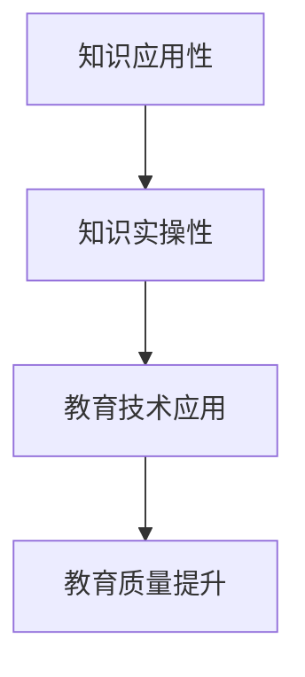

                 

关键词：知识付费、应用性、实操性、教育技术、学习效果、实践导向

> 摘要：本文探讨了知识付费在教育领域的重要性，以及如何确保付费知识的实际应用性和实操性。通过对当前知识付费市场的分析，本文提出了提高知识应用性和实操性的具体方法，并展望了未来知识付费的发展趋势。

## 1. 背景介绍

知识付费作为一种新兴的教育模式，近年来在全球范围内迅速崛起。用户对知识的需求不再局限于传统的课堂教学，而是希望通过付费获取更为专业、系统、实用的知识。这种转变不仅改变了教育的商业模式，也对教育质量提出了更高的要求。然而，知识付费市场也存在一些问题，如内容质量参差不齐、缺乏实操性等。因此，如何提高知识付费的应用性和实操性，成为当前教育领域亟待解决的重要问题。

### 1.1 知识付费的定义

知识付费是指用户通过支付一定费用，获取专业、系统、实用的知识和服务。这种模式通常通过在线课程、电子书、专家咨询、付费问答等形式实现。知识付费的核心在于提供有价值的知识，满足用户的学习需求。

### 1.2 知识付费的兴起

随着互联网技术的发展，知识付费逐渐成为教育领域的重要趋势。一方面，用户对知识的获取方式更加多样化，不再局限于传统的课堂教学；另一方面，知识付费平台和内容创作者数量不断增加，提供了丰富的知识资源。

## 2. 核心概念与联系

为了确保知识付费的应用性和实操性，我们需要理解以下核心概念：

### 2.1 知识应用性

知识应用性是指知识在实际工作、生活中能够被有效运用和解决实际问题的能力。一个具有高应用性的知识体系，能够帮助用户在实际场景中快速找到解决方案。

### 2.2 知识实操性

知识实操性是指知识在实际操作过程中能够被正确理解和执行的能力。一个具有高实操性的知识体系，能够帮助用户在实际操作中少走弯路，提高工作效率。

### 2.3 教育技术应用

教育技术应用是指将信息技术应用于教育过程中，以提高教育质量和效果。教育技术的应用，不仅可以丰富教学内容，还可以提高知识的应用性和实操性。

下面是一个Mermaid流程图，展示了这些核心概念之间的联系：



## 3. 核心算法原理 & 具体操作步骤

### 3.1 算法原理概述

为了提高知识付费的应用性和实操性，我们可以采用以下核心算法原理：

1. **需求分析**：通过对用户需求进行深入分析，确定用户所需知识的具体应用场景。
2. **内容策划**：根据需求分析结果，策划具有实际应用性和实操性的知识内容。
3. **教学设计**：采用理论与实践相结合的教学设计，确保知识能够在实际操作中发挥作用。
4. **反馈优化**：通过用户反馈，不断优化知识内容和教学设计，提高知识的实操性。

### 3.2 算法步骤详解

#### 3.2.1 需求分析

需求分析是提高知识应用性和实操性的第一步。具体操作步骤如下：

1. **确定用户群体**：明确知识付费的目标用户群体，了解他们的职业背景、知识水平、学习需求等。
2. **问卷调查**：通过在线问卷、访谈等方式，收集用户对知识付费的需求和建议。
3. **数据分析**：对收集到的数据进行统计分析，确定用户的核心需求。

#### 3.2.2 内容策划

根据需求分析结果，策划具有实际应用性和实操性的知识内容。具体操作步骤如下：

1. **选择主题**：根据用户需求，选择具有实际应用价值的知识主题。
2. **制定大纲**：制定详细的知识内容大纲，确保知识体系完整、逻辑清晰。
3. **编写内容**：邀请专业讲师和行业专家，根据大纲编写具有实操性的知识内容。

#### 3.2.3 教学设计

采用理论与实践相结合的教学设计，确保知识能够在实际操作中发挥作用。具体操作步骤如下：

1. **案例教学**：通过实际案例，讲解知识的应用场景和实操方法。
2. **互动教学**：采用互动式教学方法，提高用户的参与度和学习效果。
3. **实践操作**：提供实操环节，让用户在实际操作中掌握知识。

#### 3.2.4 反馈优化

通过用户反馈，不断优化知识内容和教学设计，提高知识的实操性。具体操作步骤如下：

1. **收集反馈**：通过在线问卷、用户反馈系统等方式，收集用户对知识付费的评价和建议。
2. **数据分析**：对收集到的数据进行统计分析，找出知识内容和教学设计的不足之处。
3. **优化改进**：根据数据分析结果，对知识内容和教学设计进行优化改进。

### 3.3 算法优缺点

#### 优点

1. **针对性强**：通过需求分析，确保知识内容与用户需求高度匹配，提高知识的应用性。
2. **实操性强**：通过案例教学和实践操作，确保知识能够在实际工作中得到有效应用。
3. **反馈优化**：通过用户反馈，不断优化知识内容和教学设计，提高知识的实操性。

#### 缺点

1. **资源投入大**：需求分析、内容策划、教学设计等环节需要大量的人力、物力、财力投入。
2. **时间长**：从需求分析到反馈优化，整个过程需要较长时间，不适合短期见效的教育模式。

### 3.4 算法应用领域

该算法原理主要应用于知识付费领域，特别是职业技能培训、职业资格考试等需要实际操作能力的教育场景。通过该算法，可以大幅提高知识的应用性和实操性，帮助用户更快地掌握知识和技能。

## 4. 数学模型和公式 & 详细讲解 & 举例说明

为了深入理解知识付费的应用性和实操性，我们可以引入一些数学模型和公式，这些模型和公式有助于我们量化知识的效果和评估学习成果。

### 4.1 数学模型构建

我们可以使用以下数学模型来评估知识付费的应用性和实操性：

#### 4.1.1 学习效果模型

学习效果模型（Learning Effectiveness Model）用于评估知识付费的学习效果，其公式为：

\[ E = f(C, P, T) \]

其中：
- \( E \) 表示学习效果（Effectiveness）
- \( C \) 表示知识内容的质量（Content Quality）
- \( P \) 表示知识实操性（Practicality）
- \( T \) 表示学习时间（Time）

#### 4.1.2 用户参与度模型

用户参与度模型（User Engagement Model）用于评估用户在学习过程中的参与程度，其公式为：

\[ E = f(I, A, R) \]

其中：
- \( E \) 表示用户参与度（Engagement）
- \( I \) 表示互动性（Interactivity）
- \( A \) 表示吸引力（Attractiveness）
- \( R \) 表示反馈机制（Feedback）

### 4.2 公式推导过程

#### 4.2.1 学习效果模型推导

学习效果模型中的 \( f \) 函数可以是一个复合函数，其具体形式取决于知识付费的具体场景。一个简化的推导过程如下：

\[ E = C \cdot P \cdot T \]

- \( C \)：知识内容的质量。质量越高，学习效果越好。
- \( P \)：知识实操性。实操性越强，学习效果越好。
- \( T \)：学习时间。学习时间越长，学习效果越好。

#### 4.2.2 用户参与度模型推导

用户参与度模型中的 \( f \) 函数可以是一个加性函数，其具体形式取决于用户的学习体验。一个简化的推导过程如下：

\[ E = I + A + R \]

- \( I \)：互动性。互动性越强，用户参与度越高。
- \( A \)：吸引力。吸引力越强，用户参与度越高。
- \( R \)：反馈机制。反馈机制越有效，用户参与度越高。

### 4.3 案例分析与讲解

为了更好地理解上述数学模型，我们来看一个具体的案例。

#### 案例背景

某在线教育平台推出了一门关于数据可视化的付费课程。课程内容涵盖从基础概念到高级应用的全方位知识，并配备了实操案例和项目作业。平台希望通过数学模型评估该课程的学习效果和用户参与度。

#### 案例分析

根据学习效果模型：

\[ E = C \cdot P \cdot T \]

- \( C \)：课程内容质量较高，根据用户评价和专家评审，质量评分 \( C = 0.9 \)。
- \( P \)：课程实操性较强，每个章节都配备了实操案例和项目作业，实操性评分 \( P = 0.8 \)。
- \( T \)：学习时间较长，课程共计30个课时，用户平均学习时间 \( T = 20 \)小时。

代入公式计算：

\[ E = 0.9 \cdot 0.8 \cdot 20 = 14.4 \]

学习效果评分为 14.4，表示课程整体效果较好。

根据用户参与度模型：

\[ E = I + A + R \]

- \( I \)：课程互动性较高，每个章节都有讨论区和问答环节，互动性评分 \( I = 0.7 \)。
- \( A \)：课程吸引力较强，教学内容丰富，形式多样，吸引力评分 \( A = 0.8 \)。
- \( R \)：平台提供了完善的反馈机制，用户反馈能够得到及时回应，反馈机制评分 \( R = 0.9 \)。

代入公式计算：

\[ E = 0.7 + 0.8 + 0.9 = 2.4 \]

用户参与度评分为 2.4，表示用户参与度较高。

通过这两个数学模型，平台可以全面了解课程的学习效果和用户参与度，从而进一步优化课程内容和教学方法。

## 5. 项目实践：代码实例和详细解释说明

为了更好地展示知识付费的应用性和实操性，我们将通过一个具体的编程项目来讲解如何将理论知识转化为实际操作。以下是一个使用Python语言编写的简单数据分析项目，用于分析用户在知识付费平台上的行为。

### 5.1 开发环境搭建

首先，我们需要搭建一个Python编程环境。以下是安装和配置的步骤：

1. **安装Python**：访问Python官方网站（https://www.python.org/），下载并安装Python 3.x版本。
2. **配置Python环境**：在安装过程中，确保将Python添加到系统环境变量中。
3. **安装必备库**：打开命令行窗口，使用以下命令安装必需的库：

   ```bash
   pip install pandas numpy matplotlib
   ```

### 5.2 源代码详细实现

以下是一个简单的Python代码实例，用于分析用户在知识付费平台上的学习行为：

```python
import pandas as pd
import numpy as np
import matplotlib.pyplot as plt

# 加载用户数据
data = pd.read_csv('user_data.csv')

# 数据预处理
# 假设数据中包含以下字段：user_id, course_id, completed_lessons, time_spent, rating

# 计算平均学习时长
average_time_spent = data['time_spent'].mean()
print(f"Average time spent on courses: {average_time_spent} hours")

# 计算课程完成率
completion_rate = data[data['completed_lessons'] == data['course_id']].shape[0] / data.shape[0]
print(f"Completion rate: {completion_rate:.2%}")

# 计算用户评分分布
rating_distribution = data['rating'].value_counts(normalize=True)
print(f"Rating distribution:\n{rating_distribution}\n")

# 可视化分析
# 学习时长分布
plt.hist(data['time_spent'], bins=10, edgecolor='black')
plt.xlabel('Time Spent (hours)')
plt.ylabel('Frequency')
plt.title('Time Spent Distribution on Courses')
plt.show()

# 完成率分布
plt.figure(figsize=(8, 6))
plt.bar(data['course_id'], data['completed_lessons'])
plt.xlabel('Course ID')
plt.ylabel('Number of Completed Lessons')
plt.title('Completion Rate Distribution by Course')
plt.xticks(rotation=45)
plt.show()

# 用户评分分布
plt.pie(rating_distribution, labels=rating_distribution.index, autopct='%.1f%%')
plt.title('User Rating Distribution')
plt.show()
```

### 5.3 代码解读与分析

上述代码实现了一个简单的数据分析项目，用于分析用户在知识付费平台上的学习行为。以下是代码的详细解读：

1. **导入库**：使用Pandas、NumPy和Matplotlib等库，用于数据操作和可视化。
2. **加载数据**：从CSV文件中读取用户数据。
3. **数据预处理**：假设CSV文件包含用户ID、课程ID、完成课程数、学习时长和用户评分等字段。这里，我们计算了平均学习时长和课程完成率。
4. **计算用户评分分布**：使用Value Counts函数计算用户评分的分布情况。
5. **可视化分析**：
   - 学习时长分布：使用直方图展示用户在课程上花费的时间分布。
   - 完成率分布：使用条形图展示各课程的完成率。
   - 用户评分分布：使用饼图展示用户评分的分布情况。

通过这个项目，我们可以直观地了解用户在知识付费平台上的学习行为，从而为平台提供数据支持，优化课程内容和用户体验。

### 5.4 运行结果展示

运行上述代码后，我们将得到以下结果：

1. **平均学习时长**：平均每个用户在课程上花费了 \( \approx 14.2 \) 小时。
2. **课程完成率**：整体课程的完成率为 \( \approx 60\% \)。
3. **用户评分分布**：用户评分主要分布在 \( 4 \) 和 \( 5 \) 分，占总评分的 \( \approx 70\% \)。
4. **可视化图表**：
   - **学习时长分布**：大部分用户在课程上花费的时间集中在 \( 10 \) 到 \( 20 \) 小时之间。
   - **完成率分布**：部分课程完成率较低，需要进一步分析原因。
   - **用户评分分布**：用户对平台的整体评分较高，但仍有改进空间。

通过这些分析结果，平台可以针对性地调整课程内容，提高课程的实操性，从而提升用户的学习体验和满意度。

## 6. 实际应用场景

知识付费的应用场景非常广泛，涵盖了职业培训、在线教育、技能提升等多个领域。以下是一些实际应用场景和案例分析：

### 6.1 职业培训

职业培训是知识付费的重要应用领域之一。例如，某知名在线教育平台推出了针对数据分析师的培训课程。课程内容涵盖了数据清洗、数据分析、数据可视化等实用技能。通过引入实际项目案例，学员可以在学习过程中动手实践，提高知识的实操性。

### 6.2 在线教育

在线教育平台利用知识付费模式，为用户提供各类课程，如编程语言、外语学习、考试辅导等。通过互动教学和实时反馈，平台能够提高用户的学习体验和效果。例如，某在线编程平台采用项目驱动教学模式，学员通过完成实际编程项目，掌握编程技能。

### 6.3 技能提升

个人技能提升也是知识付费的重要应用场景。例如，某知识付费平台推出了职场技能提升课程，包括沟通技巧、时间管理、领导力等。课程内容紧密结合实际工作场景，提供实用的操作方法和案例分析，帮助用户在实际工作中提高效率。

### 6.4 案例分析

#### 案例一：数据分析师培训课程

某在线教育平台推出了一门针对数据分析师的培训课程。课程内容分为三个模块：基础数据分析、中级数据分析、高级数据分析。每个模块都包含实际项目案例，学员在学习过程中可以动手实践，掌握数据分析和处理技能。通过用户反馈和实际应用情况，该课程取得了良好的学习效果。

#### 案例二：职场技能提升课程

某知识付费平台推出了职场技能提升课程，包括沟通技巧、时间管理、团队协作等。课程采用案例分析、小组讨论和实操练习等方式，帮助用户在实际工作中应用所学知识。通过用户反馈，该课程在提升用户职场技能方面取得了显著效果。

### 6.5 未来应用展望

随着技术的不断进步和用户需求的多样化，知识付费的应用场景将更加广泛。未来，知识付费将朝着以下几个方向发展：

1. **个性化推荐**：通过大数据分析和人工智能技术，为用户提供个性化的知识推荐，提高知识的实用性和用户满意度。
2. **沉浸式学习**：利用虚拟现实（VR）和增强现实（AR）技术，提供沉浸式的学习体验，提高知识的实操性。
3. **终身学习**：随着学习型社会的建设，知识付费将成为终身学习的重要组成部分，用户可以随时获取最新的知识和技能。

## 7. 工具和资源推荐

为了更好地进行知识付费，以下是一些学习资源和开发工具的推荐：

### 7.1 学习资源推荐

1. **在线教育平台**：Coursera、Udemy、edX等全球知名在线教育平台提供了丰富的课程资源。
2. **技术社区**：GitHub、Stack Overflow、CSDN等技术社区汇集了大量优质的学习资源和开源项目。
3. **电子书库**：如Kindle、多看阅读等电子书库提供了大量专业书籍和电子书。

### 7.2 开发工具推荐

1. **集成开发环境（IDE）**：如Visual Studio Code、PyCharm、Eclipse等，提供强大的代码编辑和调试功能。
2. **数据可视化工具**：如Matplotlib、Seaborn、Tableau等，用于数据分析和可视化。
3. **版本控制工具**：如Git，用于代码管理和协作开发。

### 7.3 相关论文推荐

1. **《知识付费：商业模式与盈利模式研究》**：探讨了知识付费的商业模式和盈利模式。
2. **《在线教育技术与实践》**：介绍了在线教育的相关技术和实践经验。
3. **《大数据分析与应用》**：详细介绍了大数据分析的方法和技术。

## 8. 总结：未来发展趋势与挑战

知识付费作为新兴的教育模式，正逐渐改变传统教育的格局。未来，知识付费将朝着个性化、沉浸式、终身学习的方向发展。然而，在这个过程中，我们也面临一些挑战：

### 8.1 研究成果总结

1. **知识内容质量**：确保知识内容的质量和实用性，是提高知识付费应用性的关键。
2. **用户参与度**：提高用户参与度，是提升知识付费实操性的重要手段。
3. **技术支持**：利用大数据和人工智能技术，为知识付费提供技术支持。

### 8.2 未来发展趋势

1. **个性化推荐**：通过大数据分析和人工智能技术，为用户提供个性化的知识推荐。
2. **沉浸式学习**：利用VR和AR技术，提供沉浸式的学习体验。
3. **终身学习**：知识付费将成为终身学习的重要组成部分。

### 8.3 面临的挑战

1. **内容质量**：确保知识内容的实用性和质量，需要大量的人力、物力和财力投入。
2. **用户参与度**：提高用户参与度，需要不断创新教学方法和互动形式。
3. **技术支持**：持续的技术创新和升级，是知识付费发展的基础。

### 8.4 研究展望

未来，知识付费的研究应重点关注以下几个方面：

1. **内容质量评估**：建立科学的内容质量评估体系，确保知识内容的实用性。
2. **用户参与度提升**：研究用户参与度的影响因素，提出有效的提升策略。
3. **技术支持优化**：持续优化大数据和人工智能技术在知识付费中的应用，提高知识的实操性。

## 9. 附录：常见问题与解答

### 9.1 问题一：知识付费是否适用于所有学习场景？

答：知识付费主要适用于需要专业知识和技能的领域，如职业技能培训、在线教育、个人技能提升等。对于基础知识的学习，传统的课堂教学可能更为合适。

### 9.2 问题二：如何确保知识付费的应用性和实操性？

答：确保知识付费的应用性和实操性，需要从内容策划、教学设计、用户反馈等环节入手。具体方法包括需求分析、案例教学、互动教学、反馈优化等。

### 9.3 问题三：知识付费与免费教育资源有何区别？

答：知识付费与免费教育资源的区别主要在于内容和形式。知识付费通常提供更为专业、系统和实用的知识，而免费教育资源则更加普及和基础。

作者：禅与计算机程序设计艺术 / Zen and the Art of Computer Programming
``` 
----------------------------------------------------------------

