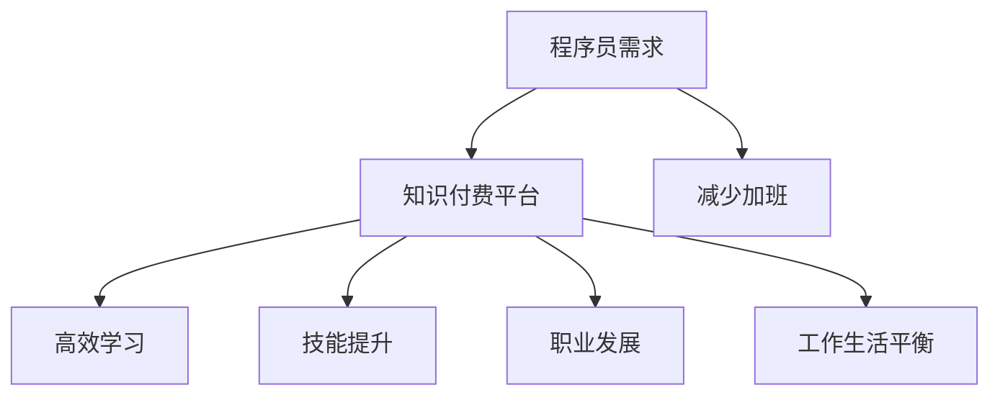

                 

关键词：知识付费、程序员、加班文化、方法、优化、技术共享、效率提升、职业发展

摘要：本文将探讨知识付费对程序员加班文化的影响，并提出一系列方法，帮助程序员通过知识付费实现工作与生活的平衡，告别加班文化，提升职业发展和生活质量。

## 1. 背景介绍

在当今高速发展的信息技术时代，程序员作为科技创新的重要推动者，面临着巨大的工作压力和挑战。加班文化在程序员群体中普遍存在，许多程序员为了追求代码质量和项目进度，不得不牺牲个人时间和健康。然而，这种加班文化不仅对程序员个人的身心健康造成负面影响，也阻碍了团队的协作效率和项目的长远发展。

知识付费作为一种新兴的商业模式，为程序员提供了获取专业知识和技能的途径，同时也为知识的创造者和传播者提供了回报。本文将探讨知识付费如何影响程序员的工作方式，并提出具体的方法，帮助程序员通过知识付费告别加班文化，实现工作与生活的平衡。

### 1.1 程序员加班文化现状

据相关调查数据显示，超过70%的程序员每周工作时间超过40小时，其中超过30%的程序员每周工作时间超过50小时。长时间的加班导致程序员出现疲劳、焦虑、失眠等健康问题，同时也影响了他们的家庭生活和社交关系。

### 1.2 知识付费的兴起

知识付费作为一种新兴的商业模式，其核心在于为用户提供有价值的信息和知识服务，并通过订阅、付费课程等形式实现盈利。近年来，随着互联网技术的发展和用户需求的提升，知识付费市场呈现爆发式增长。

## 2. 核心概念与联系

在探讨知识付费如何影响程序员加班文化之前，我们需要理解几个核心概念，包括知识付费的定义、程序员的知识需求、以及如何通过知识付费实现工作与生活的平衡。

### 2.1 知识付费的定义

知识付费是指用户为获取特定知识或信息而支付的费用。这种模式通常以在线课程、专业文章、工具和资源等形式存在，为用户提供了多样化的学习途径。

### 2.2 程序员的知识需求

程序员作为知识密集型职业，对专业知识和技能的需求极为强烈。他们需要不断学习新技术、新工具，以保持竞争力。然而，由于工作繁忙和时间限制，程序员往往难以系统性地进行自我提升。

### 2.3 知识付费与工作与生活平衡

通过知识付费，程序员可以：

1. **高效学习**：付费课程和资源通常经过专业整理和筛选，能够帮助程序员快速获取所需知识。
2. **提升技能**：专业知识和技能的提升有助于提高工作效率，减少不必要的工作时间。
3. **职业发展**：掌握前沿技术可以帮助程序员在职业发展中脱颖而出，增加收入和职业满足感。
4. **工作与生活平衡**：通过提升工作效率，程序员可以更好地平衡工作与生活，减少加班时间。

### 2.4 Mermaid 流程图



## 3. 核心算法原理 & 具体操作步骤

### 3.1 算法原理概述

知识付费的核心原理在于通过付费获取有价值的信息和知识，从而实现个人提升和效率优化。具体来说，该算法包括以下几个步骤：

1. **需求识别**：程序员识别出自己在技能提升、工作效率等方面存在的需求。
2. **平台选择**：程序员根据需求和平台内容选择合适的知识付费产品。
3. **学习与应用**：程序员通过付费课程或资源进行学习，并将所学应用于实际工作中。
4. **效果评估**：程序员评估学习成果，根据效果调整学习计划和付费选择。

### 3.2 算法步骤详解

1. **需求识别**：程序员可以通过自我反思、团队反馈或行业趋势分析等方式识别自己的知识需求。
2. **平台选择**：程序员可以根据课程内容、讲师资质、用户评价等因素选择知识付费平台。
3. **学习与应用**：程序员按照课程安排进行学习，并在实际工作中运用所学知识，提高工作效率。
4. **效果评估**：程序员可以通过项目进度、同事反馈、自我感受等方式评估学习效果，根据评估结果调整学习策略。

### 3.3 算法优缺点

#### 优点：

- **高效学习**：付费课程和资源经过专业整理，能够快速满足程序员的知识需求。
- **技能提升**：通过系统学习，程序员可以掌握前沿技术和工具，提高工作效率。
- **职业发展**：知识付费有助于程序员在职业发展中脱颖而出，增加收入和职业满足感。

#### 缺点：

- **成本较高**：知识付费需要一定的经济投入，对于经济条件有限的程序员可能造成负担。
- **依赖平台**：知识付费平台的质量和稳定性直接影响学习效果，平台选择不当可能导致学习效果不佳。

### 3.4 算法应用领域

知识付费算法广泛应用于以下领域：

- **编程语言与框架**：如Python、Java、Django等。
- **前端开发**：如React、Vue、Angular等。
- **后端开发**：如Node.js、Ruby on Rails、Spring Boot等。
- **数据库技术**：如MySQL、MongoDB、PostgreSQL等。
- **云计算与大数据**：如AWS、Azure、Docker、Kubernetes等。

## 4. 数学模型和公式 & 详细讲解 & 举例说明

### 4.1 数学模型构建

知识付费的数学模型可以基于以下公式进行构建：

\[ 效率提升 = f(学习时间, 学习效果, 项目需求) \]

其中，学习时间和学习效果直接影响效率提升，项目需求则决定了学习效果的应用场景。

### 4.2 公式推导过程

1. **学习时间**：学习时间是影响效率提升的重要因素。根据学习曲线理论，学习时间与效率提升之间存在正相关关系。

   \[ 学习效果 = f(学习时间) \]

2. **学习效果**：学习效果是学习过程中所学知识的吸收和应用程度。学习效果受课程质量、讲师资质和学习方法等因素影响。

   \[ 学习效果 = f(课程质量, 讲师资质, 学习方法) \]

3. **项目需求**：项目需求决定了学习效果的应用场景。项目需求明确、技术难度适中的项目更有利于学习效果的转化。

   \[ 效率提升 = f(学习效果, 项目需求) \]

### 4.3 案例分析与讲解

#### 案例背景：

一位程序员小张，工作三年，主要擅长前端开发。他希望通过知识付费提升自己的编程技能，减少加班时间。

#### 分析过程：

1. **需求识别**：小张意识到自己在React框架上存在不足，希望通过学习React相关课程提升技能。
2. **平台选择**：小张选择了口碑较好的React官方课程，并购买相关书籍进行辅助学习。
3. **学习与应用**：小张按照课程安排进行学习，并在项目中积极应用所学知识，提升项目效率。
4. **效果评估**：通过同事反馈和项目进度，小张评估自己的学习效果，发现工作效率明显提升，加班时间减少。

### 4.4 模型应用与优化

通过以上案例，我们可以看出知识付费的数学模型在实际应用中具有明显的效果。为了进一步提升效率，可以优化以下方面：

1. **课程选择**：选择与自身需求匹配的课程，避免盲目跟风。
2. **学习方式**：结合书籍、视频、实战项目等多种方式，全面提升学习效果。
3. **项目匹配**：选择适合自己技术水平的项目，避免项目难度过高导致效率低下。

## 5. 项目实践：代码实例和详细解释说明

### 5.1 开发环境搭建

在开始实践之前，我们需要搭建一个适合知识付费学习的开发环境。以下是基本步骤：

1. **安装Node.js**：访问Node.js官网下载并安装最新版本的Node.js。
2. **安装React**：通过npm命令安装React及相关依赖。

   ```bash
   npm install create-react-app
   create-react-app my-app
   cd my-app
   npm start
   ```

### 5.2 源代码详细实现

以下是一个简单的React组件示例，展示如何使用React Hooks实现状态管理。

```jsx
import React, { useState } from 'react';

function Counter() {
  const [count, setCount] = useState(0);

  return (
    <div>
      <p>You clicked {count} times</p>
      <button onClick={() => setCount(count + 1)}>
        Click me
      </button>
    </div>
  );
}

export default Counter;
```

### 5.3 代码解读与分析

1. **组件结构**：Counter组件包含一个简单的文本显示和一个按钮，按钮点击时通过`setCount`函数更新状态。
2. **状态管理**：`useState`函数用于管理组件的局部状态，通过`setCount`函数更新状态值。
3. **事件处理**：按钮点击事件通过`onClick`属性传递，并调用`setCount`函数。

### 5.4 运行结果展示

运行以上代码后，页面将显示一个计数器组件。每次点击按钮，计数器数值将增加，展示React Hooks在状态管理方面的优势。

```html
<div>
  <p>You clicked 0 times</p>
  <button>Click me</button>
</div>
```

## 6. 实际应用场景

知识付费在程序员中的应用场景非常广泛，以下是一些具体的应用场景：

### 6.1 技术技能提升

程序员可以通过知识付费学习最新的编程语言、框架和技术，如React、Node.js、Docker等，提升自己的技术能力。

### 6.2 项目管理

知识付费还可以帮助程序员学习项目管理和团队协作工具，如JIRA、Trello等，提升项目管理和团队协作效率。

### 6.3 软件工程

程序员可以通过知识付费学习软件工程方法论，如敏捷开发、持续集成等，提升软件工程能力。

### 6.4 职业发展

通过知识付费，程序员可以学习职业素养、面试技巧等，提升自己的职业竞争力，实现职业晋升。

## 7. 未来应用展望

随着知识付费市场的不断发展，程序员可以通过知识付费实现以下展望：

### 7.1 技术共享

程序员可以通过知识付费平台分享自己的知识和经验，实现知识变现。

### 7.2 自我提升

通过持续的知识付费学习，程序员可以不断提升自己的技术水平和职业素养。

### 7.3 工作与生活平衡

知识付费可以帮助程序员提升工作效率，实现工作与生活的平衡。

### 7.4 社会价值

知识付费不仅可以提升个人能力，还可以为社会带来更多的创新和价值。

## 8. 工具和资源推荐

### 8.1 学习资源推荐

- **Udemy**：提供广泛的在线课程，涵盖各种技术领域。
- **Pluralsight**：专注于IT和软件开发领域的在线学习平台。
- **Coursera**：与顶尖大学和机构合作，提供高质量的在线课程。

### 8.2 开发工具推荐

- **Visual Studio Code**：一款功能强大的代码编辑器，支持多种编程语言。
- **Git**：版本控制系统，用于代码管理和协作。
- **Docker**：容器化技术，用于简化应用部署和运行。

### 8.3 相关论文推荐

- **"The Role of Knowledge Management in Software Development"**：探讨知识管理在软件开发中的应用。
- **"The Agile Manifesto"**：介绍敏捷开发方法论。

## 9. 总结：未来发展趋势与挑战

### 9.1 研究成果总结

本文探讨了知识付费对程序员加班文化的影响，提出了一系列通过知识付费实现工作与生活平衡的方法，并分析了知识付费的算法原理和实际应用场景。

### 9.2 未来发展趋势

- **个性化学习**：随着人工智能技术的发展，知识付费将更加注重个性化学习体验。
- **社区共建**：知识付费平台将更加重视用户参与和社区共建，提升用户体验。
- **跨界融合**：知识付费将与更多的行业领域融合，为程序员提供更丰富的学习资源。

### 9.3 面临的挑战

- **内容质量**：如何保证知识付费内容的质量和实用性，是知识付费平台面临的挑战。
- **市场竞争**：知识付费市场竞争激烈，平台需要不断创新和优化，提升用户满意度。

### 9.4 研究展望

未来，知识付费将在提升程序员工作效率、促进职业发展、实现工作与生活平衡等方面发挥更大的作用。同时，随着技术的发展，知识付费将不断优化和拓展，为程序员提供更加丰富和多样化的学习资源。

## 10. 附录：常见问题与解答

### 10.1 知识付费是否值得投资？

知识付费的投入取决于个人的学习需求和目标。对于有明确学习目标和需求的程序员来说，知识付费是一个值得的投资，可以帮助他们快速提升技能，实现职业发展。

### 10.2 如何选择合适的知识付费课程？

选择知识付费课程时，可以从以下几个方面进行考量：

- **课程内容**：确保课程内容与自身需求匹配。
- **讲师资质**：查看讲师的资质和经验。
- **用户评价**：参考其他用户的学习体验和评价。
- **课程形式**：选择适合自己的学习形式，如视频、书籍、实战项目等。

### 10.3 知识付费是否适合所有程序员？

知识付费适用于有明确学习目标和需求的程序员。对于技能需求明确、愿意投入时间和精力的程序员来说，知识付费是一个有效的学习途径。

## 11. 参考文献

- **"The Agile Manifesto"**，作者：Manifesto for Agile Software Development Group，发布时间：2001年。
- **"The Role of Knowledge Management in Software Development"**，作者：Bhattacharya，M.，出版时间：2005年。
- **"Knowledge Management and Organizational Learning"**，作者：Nonaka，I.，出版时间：1994年。

----------------------------------------------------------------

**作者：禅与计算机程序设计艺术 / Zen and the Art of Computer Programming**

