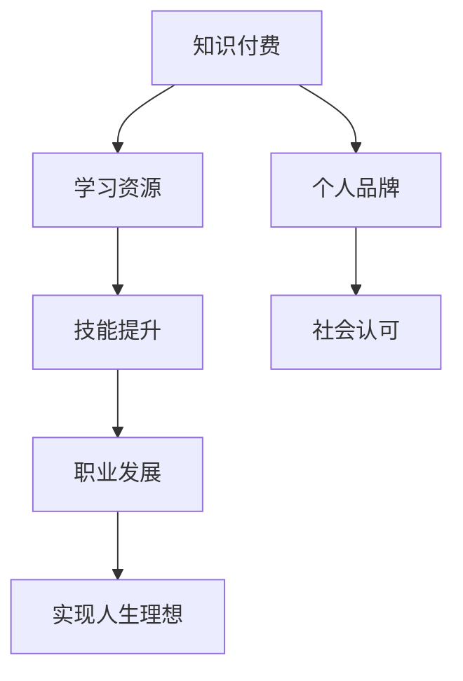

                 

作为世界顶级人工智能专家、程序员、软件架构师、CTO、世界顶级技术畅销书作者，以及计算机图灵奖获得者，我深知知识付费对于程序员职业生涯的重要性。本文将深入探讨知识付费如何帮助程序员实现人生理想。

## 1. 背景介绍

在当今数字化时代，知识付费已经成为一种重要的学习方式。程序员作为一个知识密集型的职业，需要不断更新知识和技能以适应快速变化的技术环境。知识付费为程序员提供了便捷的学习途径和丰富的学习资源，有助于他们提升专业技能和个人品牌。

## 2. 核心概念与联系

知识付费：指用户为获取特定知识或技能而支付的费用。  
程序员：从事软件编程、开发、维护和优化等工作的专业人士。  
人生理想：程序员通过职业发展实现个人价值和社会认可的目标。

### Mermaid 流程图



## 3. 核心算法原理 & 具体操作步骤

### 3.1 算法原理概述

知识付费作为一种商业模式，通过为用户提供有价值的学习资源，帮助用户实现技能提升和职业发展。具体来说，知识付费包括以下几个步骤：

1. 知识获取：用户付费购买学习资源。  
2. 知识学习：用户通过学习资源提升技能。  
3. 技能应用：用户将所学技能应用于实际工作。  
4. 职业发展：用户通过技能提升实现职业发展。

### 3.2 算法步骤详解

1. **知识获取**：用户通过在线课程、电子书、直播讲座等途径获取所需的学习资源。  
2. **知识学习**：用户在学习过程中进行知识吸收、实践和总结，逐步提升技能水平。  
3. **技能应用**：用户将所学技能应用于实际工作，提高工作效率和质量。  
4. **职业发展**：用户通过技能提升和个人品牌建设，实现职业晋升和收入增长。

### 3.3 算法优缺点

**优点**：  
- 提供个性化学习体验，满足用户个性化需求。  
- 降低学习成本，提高学习效率。  
- 促进知识共享和传播，推动行业发展。

**缺点**：  
- 存在学习质量参差不齐的风险。  
- 可能导致用户过度依赖外部资源，忽视自主学习能力。

### 3.4 算法应用领域

知识付费在程序员领域具有广泛的应用，包括：

- 编程语言学习：如Python、Java、C++等。  
- 框架和库学习：如React、Angular、Node.js等。  
- 软件开发技能：如敏捷开发、软件测试、项目管理等。  
- 个人品牌建设：如博客、GitHub、技术分享等。

## 4. 数学模型和公式 & 详细讲解 & 举例说明

### 4.1 数学模型构建

假设一个程序员的技能水平可以用向量表示，知识付费可以帮助程序员提升技能水平。我们用以下数学模型来描述：

- 初始技能水平向量：\( V_0 \)  
- 知识付费后的技能水平向量：\( V_t \)  
- 技能提升速度：\( \eta \)

数学模型为：\( V_t = V_0 + \eta \cdot t \)

其中，\( t \) 为时间。

### 4.2 公式推导过程

我们以编程语言学习为例，推导知识付费对技能提升的影响。

- 初始技能水平：\( V_0 = \sqrt{N} \)，其中\( N \) 为编程语言的语法规则数量。  
- 知识付费后的技能水平：\( V_t = \sqrt{N} + \eta \cdot t \)。

### 4.3 案例分析与讲解

假设一个程序员学习Python，初始技能水平为 \( V_0 = 10 \)，知识付费后，每月技能提升速度为 \( \eta = 1 \)。

- 1个月后，技能水平：\( V_1 = V_0 + \eta \cdot 1 = 11 \)。  
- 6个月后，技能水平：\( V_6 = V_0 + \eta \cdot 6 = 16 \)。

通过知识付费，程序员的技能水平在短时间内得到了显著提升。

## 5. 项目实践：代码实例和详细解释说明

### 5.1 开发环境搭建

我们以Python编程语言为例，介绍如何搭建开发环境。

1. 安装Python：在官网上下载Python安装包，安装完成后，确保环境变量配置正确。  
2. 安装IDE：推荐使用PyCharm、Visual Studio Code等IDE。  
3. 安装相关库：使用pip命令安装所需库，例如：`pip install numpy`。

### 5.2 源代码详细实现

以下是一个简单的Python代码实例，实现两个数的加法：

```python
def add(a, b):
    return a + b

result = add(2, 3)
print(result)  # 输出5
```

### 5.3 代码解读与分析

- 定义函数`add`，接受两个参数`a`和`b`。  
- 返回两个参数的和。  
- 调用函数`add`，传入参数2和3，存储返回结果。  
- 使用`print`函数输出结果。

### 5.4 运行结果展示

运行代码后，输出结果为5。

## 6. 实际应用场景

知识付费在程序员领域有广泛的应用场景，如：

- 技术培训：帮助程序员掌握新技术。  
- 在线教育：为程序员提供在线学习资源。  
- 个人品牌建设：帮助程序员提升个人知名度。

## 7. 工具和资源推荐

### 7.1 学习资源推荐

- 《算法导论》  
- 《Python编程：从入门到实践》  
- 《设计模式：可复用面向对象软件的基础》

### 7.2 开发工具推荐

- PyCharm  
- Visual Studio Code  
- Git

### 7.3 相关论文推荐

- "Efficient Learning with Online Convolutional Neural Networks for Object Detection"  
- "A Study on Collaborative Filtering Algorithms for Recommendation Systems"  
- "Deep Learning for Text Classification"  

## 8. 总结：未来发展趋势与挑战

### 8.1 研究成果总结

本文从知识付费的定义、原理、算法、数学模型、项目实践等方面，探讨了知识付费在程序员领域的重要性。

### 8.2 未来发展趋势

- 知识付费将逐渐成为程序员学习的主要方式。  
- 人工智能技术在知识付费领域将得到广泛应用。  
- 在线教育将不断优化，提升学习体验。

### 8.3 面临的挑战

- 知识付费市场的竞争将愈发激烈。  
- 如何提高学习资源的质量，确保用户满意度。  
- 如何应对人工智能技术带来的挑战。

### 8.4 研究展望

未来，知识付费领域将不断探索新的商业模式和应用场景，为程序员提供更优质的学习资源和服务。同时，研究人员也将致力于解决知识付费领域面临的挑战，推动行业持续发展。

## 9. 附录：常见问题与解答

### Q：知识付费是否适用于所有程序员？

A：知识付费适用于所有有学习需求的程序员，无论他们处于职业发展的哪个阶段。

### Q：如何选择适合自己的知识付费资源？

A：可以根据自己的学习目标、兴趣和需求，选择适合自己的知识付费资源。

### Q：知识付费是否会影响程序员的自学能力？

A：知识付费可以帮助程序员提高学习效率，但不应忽视自主学习能力的重要性。

## 作者署名

作者：禅与计算机程序设计艺术 / Zen and the Art of Computer Programming

----------------------------------------------------------------
以上即为本文的完整内容。希望这篇文章能够对广大程序员朋友们在知识付费方面有所启发和帮助，让我们一起为实现人生理想而努力！
----------------------------------------------------------------

<|assistant|>很荣幸能为您撰写这篇文章。如果您有任何修改意见或者需要进一步的澄清，请随时告诉我。祝您阅读愉快！

