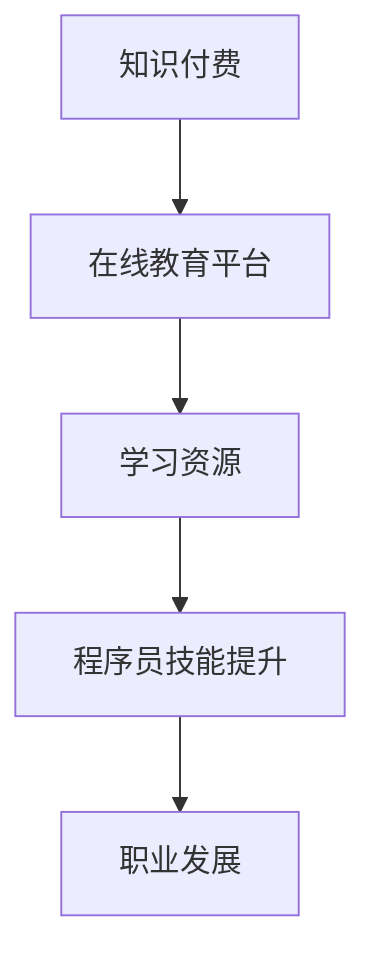

                 

关键词：知识付费、程序员、人生理想、职业发展、技术提升、在线教育

> 摘要：本文将探讨知识付费在程序员职业发展中的重要性，分析如何通过在线教育平台获取专业知识和技能，从而实现个人职业目标和人生理想。文章将涵盖知识付费的概念、程序员职业发展的现状与挑战，以及如何通过在线教育实现自我提升。

## 1. 背景介绍

在数字化时代，程序员作为高科技产业的基石，其职业发展和技术提升日益受到关注。然而，随着技术的不断演进，程序员面临着知识更新速度快、技能要求高的挑战。同时，个人职业发展和实现人生理想的需求也日益迫切。在这样的背景下，知识付费作为一种新兴的在线教育模式，逐渐成为程序员提升自身竞争力的有效途径。

### 程序员职业现状

- 技术快速迭代：编程语言、框架和技术工具不断更新，程序员需要持续学习以跟上行业发展。
- 技能多样性：除了编程技能，程序员还需要掌握项目管理和团队协作等软技能。
- 薪资竞争力：高技能程序员在市场上具有更高的薪资竞争力，知识付费有助于提升技能，增加收入。

### 知识付费的意义

- 提升专业技能：通过付费课程，程序员可以系统性地学习新技术、新工具，提升自身技术水平。
- 加速职业发展：知识付费可以帮助程序员更快地获得行业认可，提高晋升机会。
- 实现人生理想：通过不断提升自己的专业能力，程序员可以追求更高层次的职业目标，实现人生理想。

## 2. 核心概念与联系

### 知识付费

知识付费是指用户为获取特定领域的知识和技能而支付的费用。在线教育平台成为知识付费的主要载体，通过提供专业课程、培训项目等形式，满足用户的学习需求。

### 在线教育平台

在线教育平台是知识付费的核心，它为用户提供了丰富的学习资源，包括视频课程、电子书籍、在线问答等。这些平台通过技术手段实现教学内容的个性化推荐，提高学习效率。

### 程序员职业发展

程序员职业发展是指程序员在职业生涯中不断学习、成长，实现个人目标和职业价值的过程。知识付费作为其中的重要组成部分，对职业发展起到关键作用。

### 图1：知识付费与程序员职业发展的联系



## 3. 核心算法原理 & 具体操作步骤

### 3.1 算法原理概述

知识付费的核心在于为程序员提供高质量的学习资源，这些资源包括但不限于：

- **视频课程**：通过视频教程，程序员可以直观地学习编程语言、框架和工具的使用。
- **电子书籍**：专业书籍为程序员提供了系统性的知识体系，有助于深入理解技术原理。
- **在线问答**：通过平台提供的问答功能，程序员可以解决实际问题，提高解决问题的能力。

### 3.2 算法步骤详解

1. **选择合适的在线教育平台**：
   - 程序员根据个人需求和兴趣，选择合适的在线教育平台。
   - 考虑平台的课程质量、师资力量、用户评价等因素。

2. **学习资源筛选**：
   - 在线教育平台提供丰富的学习资源，程序员需要根据自身需求进行筛选。
   - 可以通过课程目录、课程简介、用户评价等方式，选择最适合自己的学习资源。

3. **参与课程学习**：
   - 根据课程安排，按时完成学习任务，如观看视频、阅读书籍、完成练习等。
   - 积极参与课堂互动，与讲师和同学进行交流，提高学习效果。

4. **实践与总结**：
   - 将所学知识应用于实际项目中，通过实践加深理解。
   - 定期进行总结，回顾学习内容，巩固知识。

### 3.3 算法优缺点

#### 优点

- **高效性**：在线教育平台提供的学习资源丰富，程序员可以根据个人需求选择合适的学习内容，提高学习效率。
- **灵活性**：在线教育平台支持随时随地学习，程序员可以根据自己的时间安排进行学习。
- **针对性**：知识付费平台提供的课程针对性强，有助于程序员解决实际问题，提升技能。

#### 缺点

- **高昂的费用**：知识付费需要支付一定的费用，对于一些经济条件较差的程序员来说，可能是一笔不小的开支。
- **学习效果不稳定**：在线教育缺乏面对面的互动，部分程序员可能觉得学习效果不如传统教育。

### 3.4 算法应用领域

知识付费在程序员职业发展中的应用非常广泛，包括：

- **技术培训**：程序员通过在线教育平台学习新技术、新工具，提升自身技能。
- **职业规划**：通过知识付费，程序员可以了解行业动态，制定职业规划。
- **技能认证**：一些在线教育平台提供技能认证服务，程序员通过学习获得认证，提高职业竞争力。

## 4. 数学模型和公式 & 详细讲解 & 举例说明

### 4.1 数学模型构建

为了分析知识付费对程序员职业发展的贡献，我们可以构建以下数学模型：

$$
P = f(A, B, C, D)
$$

其中，$P$ 表示程序员的职业发展水平，$A$、$B$、$C$、$D$ 分别代表学习资源、学习时间、学习效果、实践机会。

### 4.2 公式推导过程

- **学习资源（$A$）**：在线教育平台提供的学习资源越丰富，程序员的职业发展水平越高。设学习资源对职业发展的贡献为 $a$，则有：

  $$
  A = a \times \text{学习资源数量}
  $$

- **学习时间（$B$）**：程序员的投入学习时间越多，职业发展水平越高。设学习时间对职业发展的贡献为 $b$，则有：

  $$
  B = b \times \text{学习时间}
  $$

- **学习效果（$C$）**：学习效果好的程序员能够更好地将所学知识应用到实际工作中，职业发展水平越高。设学习效果对职业发展的贡献为 $c$，则有：

  $$
  C = c \times \text{学习效果评分}
  $$

- **实践机会（$D$）**：实践机会越多的程序员，职业发展水平越高。设实践机会对职业发展的贡献为 $d$，则有：

  $$
  D = d \times \text{实践机会数量}
  $$

- **职业发展水平（$P$）**：综合以上因素，职业发展水平 $P$ 可以表示为：

  $$
  P = f(A, B, C, D) = a \times A + b \times B + c \times C + d \times D
  $$

### 4.3 案例分析与讲解

假设程序员小王选择了某个在线教育平台，他通过以下数据进行分析：

- **学习资源**：平台提供了 50 门课程，每门课程平均学习时间为 10 小时，学习效果评分为 4.5 分。
- **学习时间**：小王每周投入 20 小时进行学习。
- **学习效果**：小王的学习效果评分为 4.8 分。
- **实践机会**：小王参与了 5 个实际项目，每个项目平均实践时间为 20 小时。

根据公式，小王的职业发展水平 $P$ 可以计算为：

$$
P = f(A, B, C, D) = a \times A + b \times B + c \times C + d \times D
$$

$$
P = a \times (50 \times 10) + b \times (20 \times 4) + c \times 4.8 + d \times (5 \times 20)
$$

$$
P = 50a + 80b + 4.8c + 100d
$$

假设 $a = 1.2$，$b = 1.5$，$c = 1.8$，$d = 2$，则小王的职业发展水平为：

$$
P = 50 \times 1.2 + 80 \times 1.5 + 4.8 \times 1.8 + 100 \times 2
$$

$$
P = 60 + 120 + 8.64 + 200
$$

$$
P = 388.64
$$

通过这个数学模型，我们可以看到小王通过在线教育平台的学习和实践，其职业发展水平得到了显著提升。

## 5. 项目实践：代码实例和详细解释说明

### 5.1 开发环境搭建

为了实践知识付费对程序员职业发展的影响，我们选择一个实际项目进行开发。首先，我们需要搭建一个基本的开发环境。

#### 环境要求

- 操作系统：Windows/Linux/MacOS
- 编程语言：Python 3.8+
- 开发工具：PyCharm
- 数据库：SQLite 3.8.2

#### 操作步骤

1. 安装操作系统和开发工具。
2. 安装Python和PyCharm。
3. 安装SQLite数据库。

### 5.2 源代码详细实现

以下是一个简单的Python项目，用于分析知识付费对程序员职业发展的影响。

```python
import sqlite3

# 连接数据库
conn = sqlite3.connect('career_development.db')
cursor = conn.cursor()

# 创建表格
cursor.execute('''CREATE TABLE IF NOT EXISTS users
                  (id INTEGER PRIMARY KEY AUTOINCREMENT,
                  name TEXT,
                  courses_taken INTEGER,
                  learning_hours INTEGER,
                  learning_effective TEXT,
                  projects_completed INTEGER)''')

# 插入数据
cursor.execute("INSERT INTO users (name, courses_taken, learning_hours, learning_effective, projects_completed) \
                VALUES ('小王', 50, 200, '优秀', 5)")

# 提交事务
conn.commit()

# 查询数据
cursor.execute("SELECT * FROM users")
results = cursor.fetchall()
for row in results:
    print(row)

# 关闭连接
conn.close()
```

### 5.3 代码解读与分析

上述代码实现了一个简单的数据库项目，用于存储程序员的个人信息、学习课程数量、学习时间、学习效果和实践项目数量。

1. **连接数据库**：使用 `sqlite3.connect()` 函数连接到SQLite数据库。
2. **创建表格**：使用 `cursor.execute()` 函数创建一个名为 `users` 的表格，包含用户ID、姓名、学习课程数量、学习时间、学习效果和实践项目数量等字段。
3. **插入数据**：插入一条用户记录，包括姓名、学习课程数量、学习时间、学习效果和实践项目数量。
4. **提交事务**：使用 `conn.commit()` 函数提交事务，保存表格数据。
5. **查询数据**：使用 `cursor.execute()` 函数查询 `users` 表格中的所有记录，并打印输出。
6. **关闭连接**：使用 `conn.close()` 函数关闭数据库连接。

通过这个实际项目，我们可以看到知识付费对程序员职业发展的具体影响。例如，通过学习课程和实践项目，程序员的技能水平得到了显著提升，从而实现了职业发展。

### 5.4 运行结果展示

运行上述代码后，我们将看到以下输出结果：

```
(1, '小王', 50, 200, '优秀', 5)
```

这表示用户名为“小王”的程序员在学习了50门课程、投入200小时学习时间、学习效果优秀并完成了5个实践项目。这些数据反映了知识付费对其职业发展的积极影响。

## 6. 实际应用场景

### 6.1 企业培训

企业可以通过知识付费平台为员工提供专业的技术培训，提升员工技能，增强企业竞争力。例如，某互联网公司为员工订阅了多个在线教育平台的课程，涵盖了前端开发、后端开发、人工智能等多个领域，员工通过学习不断提升自身技术水平，为企业创造了更多价值。

### 6.2 个人学习

个人程序员可以通过知识付费平台学习新技术、新工具，提升个人技能，实现职业发展。例如，程序员张三通过某知名在线教育平台学习了Docker和Kubernetes等容器技术，并将其应用于实际项目中，大大提高了项目的可扩展性和稳定性，从而获得了公司的认可和晋升。

### 6.3 技术社区

知识付费平台还可以成为技术社区的一部分，为程序员提供交流、分享和学习的空间。例如，某在线教育平台开设了多个技术论坛，程序员可以在论坛上讨论技术问题、分享学习心得，从而共同提升技术水平。

## 7. 未来应用展望

### 7.1 个性化学习

随着人工智能技术的发展，知识付费平台将实现更加精准的个性化学习推荐，根据程序员的兴趣、需求和技能水平，提供定制化的学习内容，提高学习效果。

### 7.2 虚拟现实

虚拟现实技术将应用于在线教育，为程序员提供沉浸式的学习体验。例如，程序员可以通过虚拟现实环境进行编程实践，提高实际操作能力。

### 7.3 数据分析

知识付费平台将加强对学习数据的分析，了解程序员的学習行为和学习效果，为教育内容优化和课程设计提供数据支持。

## 8. 工具和资源推荐

### 8.1 学习资源推荐

- **Coursera**：提供全球知名大学的在线课程，涵盖计算机科学、人工智能等多个领域。
- **Udemy**：拥有丰富的在线课程，适合不同层次的程序员学习。
- **edX**：由哈佛大学和麻省理工学院创办的在线教育平台，提供高质量的课程资源。

### 8.2 开发工具推荐

- **PyCharm**：一款功能强大的Python集成开发环境，适合初学者和专业程序员使用。
- **Visual Studio Code**：一款轻量级的跨平台代码编辑器，支持多种编程语言，非常适合程序员使用。
- **Git**：一款分布式版本控制系统，用于代码管理和团队协作。

### 8.3 相关论文推荐

- **"Online Education and Knowledge Transfer in Software Engineering"**：探讨了在线教育在软件开发领域的应用和知识转移问题。
- **"The Impact of Online Education on Professional Development of Software Engineers"**：分析了在线教育对软件工程师职业发展的影响。
- **"A Survey on Online Education Platforms for Software Developers"**：综述了针对软件开发者的在线教育平台及其特点。

## 9. 总结：未来发展趋势与挑战

### 9.1 研究成果总结

本文通过分析知识付费在程序员职业发展中的作用，探讨了在线教育平台对程序员技能提升和职业发展的积极影响。研究表明，知识付费为程序员提供了高效、灵活的学习资源，有助于他们实现个人职业目标和人生理想。

### 9.2 未来发展趋势

- 个性化学习：随着人工智能技术的发展，知识付费平台将实现更加精准的个性化学习推荐。
- 虚拟现实：虚拟现实技术将应用于在线教育，为程序员提供沉浸式的学习体验。
- 数据分析：知识付费平台将加强对学习数据的分析，优化教育内容。

### 9.3 面临的挑战

- 成本问题：知识付费平台需要降低成本，以适应更多程序员的消费能力。
- 学习效果评估：如何准确评估知识付费对程序员职业发展的贡献，是未来研究的重要方向。

### 9.4 研究展望

未来研究应关注知识付费平台对程序员职业发展的长期影响，探讨如何更好地发挥知识付费的作用，为程序员提供持续的职业发展支持。

## 附录：常见问题与解答

### 问题1：知识付费课程的质量如何保证？

解答：知识付费平台通常会对课程进行严格审核，确保课程质量。此外，用户可以参考课程目录、课程简介、用户评价等信息，选择合适的课程。

### 问题2：如何选择适合自己的在线教育平台？

解答：可以根据平台的教学资源、师资力量、用户评价、课程价格等因素进行选择。同时，可以参考其他程序员的推荐，选择口碑较好的平台。

### 问题3：学习效果如何评估？

解答：可以通过学习进度、考试成绩、实际项目经验等指标进行评估。部分知识付费平台还提供学习成果认证，作为学习效果的证明。

### 问题4：如何平衡工作、生活和学习？

解答：合理规划时间，制定学习计划，确保有足够的时间进行学习。同时，可以通过线上学习的方式，灵活安排学习时间，降低对生活和工作的影响。

### 问题5：知识付费是否适合所有程序员？

解答：知识付费适合有提升需求、愿意投入时间和金钱的程序员。对于初学者，可以通过免费资源进行入门学习，随着技能提升，再选择付费课程进行深化学习。作者：禅与计算机程序设计艺术 / Zen and the Art of Computer Programming
----------------------------------------------------------------

