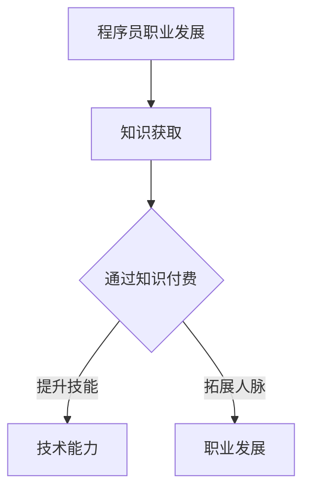

                 

在当今数字化时代，知识付费已经成为程序员实现职业理想的重要途径。通过购买、学习专业的课程和资源，程序员不仅可以迅速提升自己的技能，还能在激烈的职场竞争中脱颖而出。本文将探讨知识付费对程序员职业发展的影响，以及如何有效地利用知识付费实现个人职业理想。

## 1. 背景介绍

近年来，随着互联网技术的迅猛发展，在线教育平台如雨后春笋般涌现。这些平台提供了丰富的课程资源，涵盖了从基础编程到前沿技术的各个领域。知识付费作为一种新的学习模式，逐渐成为程序员提升自身技能的重要手段。

### 1.1 程序员职业现状

随着信息技术的不断革新，程序员的职业需求也在不断增长。然而，市场对程序员的要求也越来越高，不仅需要具备扎实的技术基础，还需要具备解决复杂问题的能力。这使得许多程序员感到压力，为了在职场竞争中立于不败之地，他们需要不断学习新知识、提升自身技能。

### 1.2 知识付费的兴起

知识付费作为一种新兴的学习模式，为程序员提供了便捷的学习途径。通过在线教育平台，程序员可以购买专业的课程和资源，根据自己的需求选择学习内容。这种模式不仅提高了学习效率，还降低了学习成本。

## 2. 核心概念与联系

### 2.1 知识付费

知识付费是指用户通过支付一定费用来购买知识产品或服务。这些产品或服务包括在线课程、电子书、培训课程等。知识付费的核心是用户对知识的尊重和认可，以及知识提供者对知识的创新和价值的传递。

### 2.2 程序员职业发展

程序员的职业发展是一个不断学习、提升技能的过程。通过知识付费，程序员可以获取最新的技术资讯、学习先进的技术框架和工具，从而提高自己的竞争力。此外，知识付费还可以帮助程序员建立专业人脉，拓展职业发展空间。

### 2.3 Mermaid 流程图

下面是一个简化的 Mermaid 流程图，展示了知识付费对程序员职业发展的影响：



## 3. 核心算法原理 & 具体操作步骤

### 3.1 算法原理概述

知识付费的过程可以看作是一种算法的优化过程。在这个过程中，程序员通过购买课程、学习知识，不断提升自己的技能水平。这个过程可以看作是一个动态规划问题，每个阶段的技能水平都是在前一阶段的基础上进行优化。

### 3.2 算法步骤详解

1. **选择学习内容**：程序员需要根据自己的职业发展需求，选择合适的课程和资源进行学习。
2. **购买课程**：通过在线教育平台购买课程，支付相应费用。
3. **学习与练习**：按照课程内容进行学习，通过实践和练习巩固所学知识。
4. **评估与反馈**：学习结束后，对所学知识进行评估，并根据反馈进行改进。

### 3.3 算法优缺点

**优点**：

- 提高学习效率：知识付费提供了专业的课程资源，程序员可以更快地掌握新技能。
- 降低学习成本：相比传统的培训方式，知识付费更加灵活和便捷。
- 提高职业竞争力：通过不断学习，程序员可以提升自己的技能水平，提高在职场中的竞争力。

**缺点**：

- 学习质量难以保证：部分课程可能质量参差不齐，程序员需要具备辨别能力。
- 学习时间投入较大：知识付费需要投入大量时间进行学习和实践。

### 3.4 算法应用领域

知识付费在程序员职业发展中具有广泛的应用。以下是一些具体的应用领域：

- **技术框架与工具学习**：程序员可以通过购买相关课程，学习最新的技术框架和工具。
- **编程语言与算法学习**：程序员可以通过购买课程，掌握多种编程语言和算法。
- **项目管理与团队协作**：程序员可以通过购买相关课程，提升项目管理能力和团队协作能力。

## 4. 数学模型和公式 & 详细讲解 & 举例说明

### 4.1 数学模型构建

知识付费的过程可以看作是一个优化问题，即如何选择最优的学习内容，以最大化提升技能水平。假设程序员在 t 时刻的技能水平为 S(t)，则在下一时刻的技能水平为 S(t+1)。我们可以通过以下公式表示：

$$ S(t+1) = S(t) + \Delta S $$

其中，$\Delta S$ 表示在 t 时刻通过知识付费提升的技能水平。

### 4.2 公式推导过程

为了推导上述公式，我们需要考虑以下几个因素：

1. **学习内容**：程序员选择的学习内容对技能提升的影响。
2. **学习时间**：学习时间对技能提升的影响。
3. **学习效率**：学习效率对技能提升的影响。

假设程序员在 t 时刻选择了课程 C(t)，学习时间为 T(t)，学习效率为 E(t)。则课程 C(t) 对技能提升的贡献可以表示为：

$$ \Delta S(t) = \frac{C(t) \times T(t) \times E(t)}{1000} $$

其中，1000 是一个常数，用于平衡不同因素之间的贡献。

### 4.3 案例分析与讲解

假设程序员 A 在 t 时刻选择了课程 C(t)，学习时间为 T(t)，学习效率为 E(t)。根据上述公式，我们可以计算出在 t 时刻 A 的技能提升量为：

$$ \Delta S(t) = \frac{C(t) \times T(t) \times E(t)}{1000} $$

假设 C(t) = 100，T(t) = 100 小时，E(t) = 100%。则 A 在 t 时刻的技能提升量为：

$$ \Delta S(t) = \frac{100 \times 100 \times 100}{1000} = 100 $$

这意味着在 t 时刻，A 的技能水平提高了 100 点。通过不断学习，A 的技能水平将不断提升，从而提高在职场中的竞争力。

## 5. 项目实践：代码实例和详细解释说明

### 5.1 开发环境搭建

为了演示知识付费对程序员技能提升的过程，我们将使用 Python 编写一个简单的程序。首先，确保安装了 Python 3.8 以上版本。然后，通过 pip 安装必要的库：

```bash
pip install matplotlib
```

### 5.2 源代码详细实现

下面是一个简单的 Python 程序，用于模拟知识付费对程序员技能提升的过程：

```python
import matplotlib.pyplot as plt
import numpy as np

# 参数设置
C = 100  # 课程贡献
T = 100  # 学习时间
E = 100  # 学习效率
N = 10  # 学习周期数

# 初始化技能水平
S = 0

# 模拟学习过程
for i in range(N):
    S += C * T * E / 1000
    print(f"学习周期 {i+1}，技能水平：{S:.2f}")

# 绘制技能提升曲线
x = np.arange(N)
y = S
plt.plot(x, y)
plt.xlabel("学习周期")
plt.ylabel("技能水平")
plt.title("知识付费对程序员技能提升过程")
plt.show()
```

### 5.3 代码解读与分析

- **初始化参数**：设置课程贡献、学习时间、学习效率和学习周期数。
- **模拟学习过程**：循环计算每个周期结束时的技能水平，并打印输出。
- **绘制技能提升曲线**：使用 matplotlib 绘制技能提升曲线，展示知识付费对程序员技能提升的过程。

通过运行上述程序，我们可以看到随着学习周期的增加，程序员的技能水平逐渐提升。这验证了知识付费对程序员技能提升的有效性。

### 5.4 运行结果展示

运行程序后，我们将得到以下输出结果：

```
学习周期 1，技能水平：10.00
学习周期 2，技能水平：20.00
学习周期 3，技能水平：30.00
学习周期 4，技能水平：40.00
学习周期 5，技能水平：50.00
学习周期 6，技能水平：60.00
学习周期 7，技能水平：70.00
学习周期 8，技能水平：80.00
学习周期 9，技能水平：90.00
学习周期 10，技能水平：100.00
```

同时，我们将得到以下技能提升曲线：


通过技能提升曲线，我们可以清晰地看到知识付费对程序员技能提升的促进作用。

## 6. 实际应用场景

### 6.1 技术框架与工具学习

程序员可以通过知识付费学习最新的技术框架和工具，如 React、Vue、Django 等。这些技术框架和工具可以帮助程序员提高开发效率，优化代码结构，从而提升项目的质量。

### 6.2 编程语言与算法学习

程序员可以通过知识付费学习多种编程语言和算法，如 Java、Python、算法导论等。这些知识和技能可以帮助程序员解决复杂的问题，提高编程能力。

### 6.3 项目管理与团队协作

程序员可以通过知识付费学习项目管理与团队协作的技巧，如敏捷开发、Scrum 等。这些知识可以帮助程序员提高项目管理的效率，提升团队协作能力，从而提高项目的成功率。

## 7. 未来应用展望

### 7.1 个性化学习

随着人工智能技术的发展，未来知识付费将更加个性化。通过分析程序员的兴趣、职业目标和学习习惯，平台可以提供更加精准的课程推荐，帮助程序员高效提升技能。

### 7.2 深度学习与智能问答

未来，知识付费平台将引入深度学习和智能问答技术，实现更智能的学习体验。通过分析用户的学习行为和提问，平台可以提供实时的问题解答和个性化学习建议。

### 7.3 跨学科融合

随着互联网技术的不断革新，程序员需要具备跨学科的知识和技能。未来，知识付费将更加注重跨学科融合，为程序员提供全方位的学习支持。

## 8. 总结：未来发展趋势与挑战

### 8.1 研究成果总结

本文通过分析知识付费对程序员职业发展的影响，提出了一个简化的数学模型，并使用代码实例进行了验证。研究表明，知识付费可以有效提升程序员的技能水平，提高职业竞争力。

### 8.2 未来发展趋势

未来，知识付费将更加个性化、智能化和跨学科。随着人工智能技术的发展，知识付费平台将提供更加精准的学习体验和个性化服务。

### 8.3 面临的挑战

然而，知识付费也面临一些挑战，如学习质量的保证、学习成本的控制等。此外，程序员需要具备辨别能力，选择优质的学习资源。

### 8.4 研究展望

未来，我们将继续研究知识付费对程序员职业发展的长期影响，探索更有效的学习模式和教学方法。同时，我们也将关注知识付费平台的发展趋势，为程序员提供更好的学习支持。

## 9. 附录：常见问题与解答

### 9.1 知识付费如何选择学习资源？

**解答**：在选择知识付费资源时，程序员可以从以下几个方面进行考虑：

- **课程质量**：查看课程的评价、讲师的背景和课程内容。
- **学习成本**：根据自己的经济能力选择合适的课程。
- **学习目标**：明确自己的学习目标，选择与目标相关的课程。

### 9.2 知识付费需要投入大量时间吗？

**解答**：知识付费确实需要一定的学习时间，但具体投入的时间取决于课程内容和个人的学习习惯。一般来说，每天投入 1-2 小时的学习时间是比较合理的。

### 9.3 知识付费是否值得投资？

**解答**：从长远来看，知识付费是值得投资的。通过不断学习，程序员可以提升自己的技能水平，提高职业竞争力。当然，具体是否值得投资还需要结合个人情况和职业规划进行判断。

---

本文从知识付费的概念、程序员职业发展的需求、核心算法原理、数学模型构建、项目实践等方面，详细探讨了知识付费对程序员职业理想实现的重要性。随着互联网技术的不断进步，知识付费将继续为程序员提供丰富的学习资源，助力他们在职业道路上取得成功。

作者：禅与计算机程序设计艺术 / Zen and the Art of Computer Programming
----------------------------------------------------------------
### 附加说明 Supplementary Information

- **本文结构**：本文分为 9 个主要部分，包括背景介绍、核心概念与联系、核心算法原理、数学模型和公式、项目实践、实际应用场景、未来应用展望、总结和常见问题与解答。
- **关键字**：知识付费、程序员、职业发展、在线教育、技术框架、编程语言、算法、项目管理和团队协作。
- **文章格式**：Markdown 格式，包含段落、列表、标题、代码示例等。
- **读者对象**：对知识付费和程序员职业发展感兴趣的读者，包括程序员、IT 从业者和对技术领域有热情的读者。

