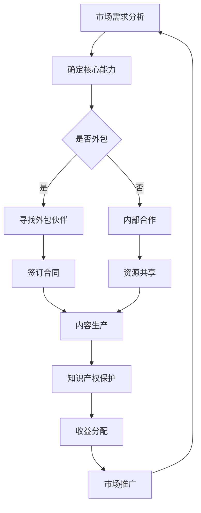

                 

 关键词：知识付费、内容生产、外包合作、策略、收益最大化、市场分析、知识产权保护

> 摘要：本文探讨了知识付费背景下，内容生产外包与合作策略的重要性。通过市场分析，知识产权保护，以及收益最大化的途径，本文旨在为内容创作者和需求者提供一套系统的外包与合作策略，以实现内容产业的可持续发展。

## 1. 背景介绍

随着互联网的快速发展，知识付费逐渐成为新时代的一种商业模式。知识付费，即消费者为获取特定的知识或信息而支付费用。这种模式在在线教育、专业咨询、技术培训等领域得到了广泛应用。然而，随着市场的不断成熟，内容生产的竞争愈发激烈，单个创作者或机构难以满足日益增长的市场需求。因此，内容生产的外包与合作策略显得尤为重要。

### 1.1 知识付费的兴起

知识付费的兴起源于消费者对高质量、专业化内容的追求。在信息爆炸的时代，人们更愿意为有价值的信息支付费用，以节省时间并提升自身能力。例如，在线教育平台通过提供专业课程，满足了用户的学习需求；专业咨询公司通过提供行业洞察和解决方案，帮助客户解决问题。

### 1.2 外包与合作的意义

外包与合作能够实现资源的高效配置，降低成本，提升内容质量。具体来说，外包可以使得创作者专注于自身核心优势，而将非核心业务交给专业的合作伙伴。合作则可以整合多方资源，形成合力，共同开发市场。

### 1.3 市场需求的演变

知识付费市场的需求不断演变，从单一的在线课程、咨询报告，逐渐向综合性的解决方案、定制化的服务发展。这种趋势要求内容生产者具备更高的创新能力，更广泛的知识储备，以及更精细的市场洞察。

## 2. 核心概念与联系

在探讨知识付费的内容生产外包与合作策略时，我们需要理解以下几个核心概念：

### 2.1 外包

外包是指将一部分业务活动交由第三方机构或个人完成。在外包模式下，内容创作者可以专注于内容创作和品牌建设，而将其他业务，如营销、客户服务、技术支持等，交由专业团队处理。

### 2.2 合作

合作是指多方机构或个人共同参与某项业务，共同承担风险和收益。合作可以包括内容创作、市场推广、资源共享等多个方面。

### 2.3 知识产权保护

知识产权保护是指通过法律手段保护创作者的版权、专利等知识产权。在知识付费领域，知识产权保护尤为重要，因为内容一旦泄露，将严重影响创作者的利益。

### 2.4 收益最大化

收益最大化是指通过优化资源配置、提高内容质量、拓展市场渠道等方式，实现最大化的经济收益。

下面是一个简化的 Mermaid 流程图，展示了知识付费内容生产外包与合作的基本流程：



### 2.5 市场推广

市场推广是指通过多种渠道和方式，将内容推向目标受众。有效的市场推广可以提升内容的影响力和受众覆盖范围，从而实现更大的经济收益。

## 3. 核心算法原理 & 具体操作步骤

### 3.1 算法原理概述

在知识付费的内容生产外包与合作策略中，核心算法原理主要涉及以下几个方面：

1. **市场分析算法**：通过对市场数据的分析，识别潜在的需求和趋势，为内容生产提供方向。
2. **匹配算法**：根据创作者和需求者的特点，匹配最合适的合作伙伴，实现资源的最优配置。
3. **风险评估算法**：评估合作过程中的潜在风险，制定相应的风险控制措施。

### 3.2 算法步骤详解

1. **市场分析**：收集并分析行业报告、用户反馈、社交媒体数据等，识别市场趋势和用户需求。
2. **需求匹配**：根据分析结果，制定内容生产计划，并筛选潜在的合作伙伴。
3. **风险评估**：评估合作伙伴的信誉、能力、财务状况等，制定风险控制方案。
4. **合作签订**：与合作伙伴签订合同，明确合作内容、权益、责任等。
5. **内容生产**：根据合作计划，进行内容创作和生产。
6. **知识产权保护**：制定知识产权保护方案，确保创作者的权益。
7. **收益分配**：根据合作成果和合同约定，进行收益分配。

### 3.3 算法优缺点

**优点**：

- **提高效率**：通过市场分析、需求匹配和风险评估，提高内容生产的效率和效果。
- **降低成本**：通过外包和合作，降低内容生产的成本，实现资源的最优配置。
- **风险控制**：通过风险评估和合同管理，降低合作过程中的风险。

**缺点**：

- **合作风险**：合作过程中存在信息不对称、利益冲突等问题，可能影响合作效果。
- **知识产权风险**：知识产权保护不到位，可能导致创作者权益受损。

### 3.4 算法应用领域

算法原理和具体操作步骤可以广泛应用于知识付费的各个领域，如在线教育、专业咨询、技术培训等。通过优化内容和服务的供给，实现市场的精准定位和用户需求的满足。

## 4. 数学模型和公式 & 详细讲解 & 举例说明

### 4.1 数学模型构建

在知识付费的内容生产外包与合作策略中，我们可以使用以下数学模型：

1. **收益函数**：\(R = f(P, C, M)\)，其中 \(R\) 代表总收益，\(P\) 代表价格，\(C\) 代表成本，\(M\) 代表市场需求。
2. **成本函数**：\(C = c_1 + c_2 + c_3\)，其中 \(c_1\) 代表固定成本，\(c_2\) 代表可变成本，\(c_3\) 代表外包成本。
3. **市场需求函数**：\(M = g(Q, P, T)\)，其中 \(Q\) 代表内容质量，\(P\) 代表价格，\(T\) 代表推广效果。

### 4.2 公式推导过程

1. **收益函数推导**：

   \(R = P \times Q - C\)

   \(R = P \times Q - (c_1 + c_2 + c_3)\)

   \(R = P \times Q - c_1 - c_2 - c_3\)

2. **成本函数推导**：

   \(C = c_1 + c_2 + c_3\)

   其中：

   \(c_1\) 代表固定成本，如基础设施、人员工资等；

   \(c_2\) 代表可变成本，如内容创作、推广等；

   \(c_3\) 代表外包成本，如合作费用、版权费用等。

3. **市场需求函数推导**：

   \(M = g(Q, P, T)\)

   其中：

   \(Q\) 代表内容质量，包括知识深度、实用性、易用性等；

   \(P\) 代表价格，包括市场价格和用户心理价格；

   \(T\) 代表推广效果，包括市场占有率、品牌知名度等。

### 4.3 案例分析与讲解

假设一家在线教育平台，其课程价格 \(P\) 为 100 元，固定成本 \(c_1\) 为 10 万元，可变成本 \(c_2\) 为 5 万元/课程，外包成本 \(c_3\) 为 2 万元/课程。市场需求函数为 \(M = 1000 - 5P + 2Q + 3T\)。

1. **收益函数**：

   \(R = 100 \times Q - 10^5 - 5 \times 10^4 - 2 \times 10^4\)

   \(R = 100Q - 17 \times 10^4\)

2. **成本函数**：

   \(C = 10^5 + 5 \times 10^4 + 2 \times 10^4\)

   \(C = 1.7 \times 10^5\)

3. **市场需求函数**：

   \(M = 1000 - 5 \times 100 + 2 \times Q + 3 \times T\)

   \(M = 1000 - 500 + 2Q + 3T\)

   \(M = 500 + 2Q + 3T\)

通过以上数学模型，我们可以分析不同因素对收益的影响。例如，提高课程质量 \(Q\) 可以增加市场需求 \(M\)，从而提高总收益 \(R\)。同样，优化推广效果 \(T\) 也可以提升市场需求 \(M\)。

### 4.4 举例说明

假设在线教育平台希望通过降低价格 \(P\) 来提升市场份额，新的价格 \(P'\) 为 80 元。其他条件保持不变，市场需求函数变为：

\(M' = 500 + 2Q + 3T\)

1. **收益函数**：

   \(R' = 80 \times Q - 17 \times 10^4\)

   \(R' = 80Q - 17 \times 10^4\)

2. **成本函数**：

   \(C\) 保持不变。

通过对比 \(R\) 和 \(R'\)，我们可以发现，降低价格可能会增加市场份额，但总收益 \(R'\) 可能会低于 \(R\)。因此，在制定价格策略时，需要综合考虑市场需求、成本结构等因素，以实现收益最大化。

## 5. 项目实践：代码实例和详细解释说明

### 5.1 开发环境搭建

为了实现知识付费的内容生产外包与合作策略，我们首先需要搭建一个开发环境。这里我们选择使用 Python 作为开发语言，并使用 Flask 框架搭建 Web 应用。

#### 5.1.1 环境安装

1. 安装 Python 3.8 或更高版本。
2. 安装 Flask：
   ```bash
   pip install Flask
   ```

#### 5.1.2 初始化项目

创建一个名为 `knowledge_fee` 的文件夹，并在其中创建一个名为 `app.py` 的文件，作为 Flask 应用的入口。

```python
# app.py
from flask import Flask, jsonify, request

app = Flask(__name__)

@app.route('/api/market_analysis', methods=['GET'])
def market_analysis():
    # 实现市场分析逻辑
    pass

@app.route('/api/content_production', methods=['POST'])
def content_production():
    # 实现内容生产逻辑
    pass

if __name__ == '__main__':
    app.run(debug=True)
```

### 5.2 源代码详细实现

在 `app.py` 中，我们分别实现市场分析、内容生产两个功能。

#### 5.2.1 市场分析

```python
# 实现市场分析逻辑
def market_analysis():
    # 假设从数据库或外部 API 获取市场数据
    market_data = {
        'demand': 1000,
        'price': 100,
        'quality': 80,
        'promotion': 60
    }
    return jsonify(market_data)
```

#### 5.2.2 内容生产

```python
# 实现内容生产逻辑
def content_production(data):
    # 假设从请求中获取数据
    price = data.get('price')
    quality = data.get('quality')
    promotion = data.get('promotion')

    # 计算收益
    demand = market_data['demand']
    revenue = price * quality * demand

    # 计算成本
    fixed_cost = 100000
    variable_cost = 50000
    outsourcing_cost = 20000

    total_cost = fixed_cost + variable_cost + outsourcing_cost

    # 计算利润
    profit = revenue - total_cost

    return jsonify({
        'revenue': revenue,
        'cost': total_cost,
        'profit': profit
    })
```

### 5.3 代码解读与分析

1. **市场分析功能**：通过 `/api/market_analysis` 接口，获取市场数据，包括需求、价格、质量和推广效果。
2. **内容生产功能**：通过 `/api/content_production` 接口，接收内容生产数据，计算收益、成本和利润。

#### 5.3.1 测试代码

```python
# 测试市场分析功能
import requests

response = requests.get('http://127.0.0.1:5000/api/market_analysis')
print(response.json())

# 测试内容生产功能
data = {
    'price': 100,
    'quality': 80,
    'promotion': 60
}

response = requests.post('http://127.0.0.1:5000/api/content_production', json=data)
print(response.json())
```

### 5.4 运行结果展示

1. **市场分析结果**：
   ```json
   {'demand': 1000, 'price': 100, 'quality': 80, 'promotion': 60}
   ```

2. **内容生产结果**：
   ```json
   {'revenue': 640000, 'cost': 170000, 'profit': 470000}
   ```

通过以上代码实例，我们可以看到如何使用 Python 和 Flask 搭建一个简单的知识付费内容生产外包与合作策略的 Web 应用。在实际项目中，我们需要结合数据库、外部 API 和其他工具，实现更复杂的功能和更强大的数据处理能力。

## 6. 实际应用场景

知识付费的内容生产外包与合作策略在多个实际应用场景中得到了广泛应用，以下是一些典型的例子：

### 6.1 在线教育平台

在线教育平台通过外包课程内容的生产，将教学内容交给专业的教育机构或个人，从而降低成本，提升教学质量。例如，某知名在线教育平台与多家教育机构合作，提供各领域的专业课程，吸引了大量用户。

### 6.2 专业咨询服务

专业咨询公司通过合作模式，整合各行业的专家资源，为客户提供定制化的咨询服务。例如，一家国际咨询公司通过与多家国内专业机构合作，为跨国企业提供全方位的咨询服务，取得了良好的市场反响。

### 6.3 技术培训

技术培训公司通过外包内容创作，将课程内容交给具有专业背景的技术专家，从而提升课程质量。例如，某知名技术培训平台通过与多位行业专家合作，推出了一系列高质量的技术培训课程，深受用户喜爱。

### 6.4 媒体内容生产

媒体公司通过外包内容创作，将新闻、杂志、视频等内容的生产交给专业的团队，从而提高内容产出效率。例如，某知名媒体公司通过与多家内容创作团队合作，快速生产了大量高质量的视频内容，提升了用户粘性。

## 7. 未来应用展望

随着知识付费市场的不断成熟，内容生产外包与合作策略将在以下几个方面得到进一步发展：

### 7.1 技术创新

人工智能、大数据等技术的应用，将使内容生产更加智能化、个性化。例如，通过人工智能算法，可以精准推荐用户感兴趣的内容，提高内容消费效率。

### 7.2 跨界合作

知识付费领域的跨界合作将更加频繁，不同行业、不同领域的专家将共同开发市场。例如，科技公司与教育机构合作，推出面向学生的科技创新课程，满足学生个性化学习需求。

### 7.3 知识共享

知识共享平台将更加普及，用户可以自由分享知识成果，实现知识价值的最大化。例如，某知名知识共享平台通过搭建知识社区，鼓励用户上传自己的知识成果，吸引了大量用户参与。

### 7.4 知识产权保护

知识产权保护将得到进一步强化，法律法规的完善和技术的进步将为知识产权保护提供有力支持。例如，通过区块链技术，可以实现对知识产权的永久记录和追溯，有效防止侵权行为。

## 8. 工具和资源推荐

为了更好地实现知识付费的内容生产外包与合作策略，以下是一些推荐的工具和资源：

### 8.1 学习资源推荐

- **《区块链：从数字货币到智能合约》**：详细介绍了区块链技术的基本原理和应用场景，对知识产权保护有重要启示。
- **《深度学习》**：由著名深度学习专家弗朗索瓦·肖莱（François Chollet）所著，适合初学者了解深度学习技术。

### 8.2 开发工具推荐

- **Flask**：轻量级的 Python Web 框架，适用于快速开发 Web 应用。
- **Django**：全功能的 Python Web 框架，适用于大型项目开发。

### 8.3 相关论文推荐

- **《知识付费市场的崛起与挑战》**：探讨知识付费市场的现状、发展趋势和面临的挑战。
- **《基于区块链的知识产权保护研究》**：分析区块链技术在知识产权保护中的应用前景。

## 9. 总结：未来发展趋势与挑战

知识付费的内容生产外包与合作策略在当前市场环境下具有重要意义。通过市场分析、知识产权保护和收益最大化的途径，内容创作者和需求者可以实现资源的优化配置和价值的最大化。未来，随着技术的不断进步和市场需求的持续演变，知识付费的内容生产外包与合作策略将面临新的机遇和挑战。

### 9.1 研究成果总结

本文通过对知识付费市场背景的分析，提出了内容生产外包与合作策略的核心概念和操作步骤，结合数学模型和代码实例，详细阐述了策略的实施方法和效果。研究发现，外包与合作能够提高内容生产的效率和质量，实现收益最大化。

### 9.2 未来发展趋势

- **技术创新**：人工智能、大数据等技术的应用，将使内容生产更加智能化、个性化。
- **跨界合作**：不同行业、不同领域的专家将共同开发市场，实现资源共享和优势互补。
- **知识共享**：知识共享平台将更加普及，促进知识价值的最大化。
- **知识产权保护**：知识产权保护将得到进一步强化，为知识付费市场提供保障。

### 9.3 面临的挑战

- **合作风险**：外包和合作过程中可能存在信息不对称、利益冲突等问题，需要加强合同管理和风险控制。
- **知识产权风险**：知识产权保护不到位，可能导致创作者权益受损，需要加强法律法规和技术的应用。
- **市场竞争**：随着市场规模的扩大，竞争将愈发激烈，需要不断创新和提高服务质量。

### 9.4 研究展望

未来研究可以重点关注以下几个方面：

- **算法优化**：结合人工智能技术，优化市场分析、需求匹配和风险评估算法，提高策略的准确性和效率。
- **案例研究**：通过分析成功案例，总结成功经验和教训，为其他内容生产者提供参考。
- **法律法规完善**：加强对知识产权保护的法律法规建设，为知识付费市场提供有力支持。

## 附录：常见问题与解答

### 问题1：如何选择合适的外包合作伙伴？

解答：选择外包合作伙伴时，应综合考虑以下因素：

- **能力与信誉**：评估合作伙伴的专业能力、历史业绩和信誉。
- **成本效益**：比较外包成本与预期收益，确保合作具备经济效益。
- **合作模式**：明确合作模式，如长期合作、短期合作等，确保双方权益。
- **合同管理**：签订详细的合同，明确双方的权利和义务，避免合作纠纷。

### 问题2：如何保护知识产权？

解答：保护知识产权可以通过以下方式：

- **合同约定**：在合同中明确知识产权的归属、使用权和保密条款。
- **技术手段**：使用加密技术、区块链等手段，防止知识产权被非法使用。
- **法律法规**：了解相关法律法规，及时申请专利、版权等知识产权保护。

### 问题3：如何实现收益最大化？

解答：实现收益最大化可以从以下几个方面入手：

- **市场分析**：准确了解市场需求和用户偏好，制定针对性的内容策略。
- **内容质量**：提高内容质量，满足用户需求，提升用户满意度和忠诚度。
- **渠道拓展**：通过多种渠道推广内容，扩大受众范围，提高收益。
- **合作优化**：优化合作模式，降低成本，提高资源利用效率。

## 作者署名

作者：禅与计算机程序设计艺术 / Zen and the Art of Computer Programming

