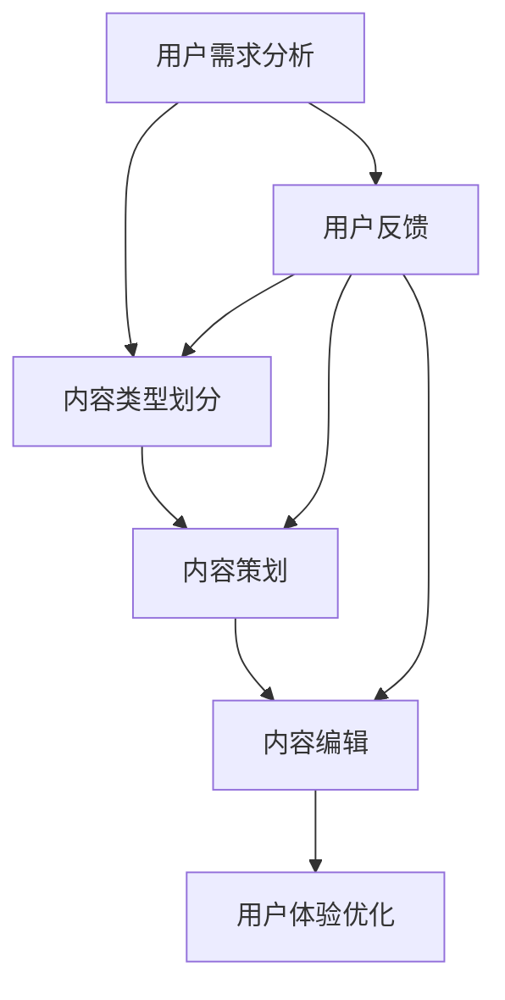

                 

关键词：知识付费、内容策划、编辑技巧、收益优化、用户体验、营销策略

> 摘要：本文将深入探讨知识付费领域的核心内容策划与编辑技巧，通过系统化的分析，揭示如何通过科学的策略和方法，提升内容质量，增强用户粘性，从而实现知识变现的持续增长。

## 1. 背景介绍

随着互联网的普及和信息爆炸，知识付费逐渐成为市场的一股重要力量。用户对于高质量、有价值的信息内容需求日益增加，而知识付费平台则应运而生，为广大知识提供者和需求者搭建了沟通的桥梁。然而，如何在众多竞争者中脱颖而出，如何有效策划和编辑能够吸引并留住用户的内容，成为知识付费领域的核心问题。

本文将结合实际案例，详细阐述内容策划与编辑的各个环节，帮助知识提供者提升内容质量，优化用户体验，实现知识付费的商业价值最大化。

### 1.1 知识付费的现状

知识付费作为一种商业模式，其本质是通过提供有价值的信息或知识来获取经济回报。根据相关报告，全球知识付费市场规模逐年扩大，预计未来几年仍将保持高速增长。以下是知识付费市场的几个关键趋势：

- **内容多样化**：知识付费内容从最初的专业知识扩展到生活技能、兴趣爱好等多个领域。
- **用户年轻化**：90后、00后逐渐成为知识付费的主要消费群体，他们的消费习惯和需求特点对市场产生深远影响。
- **平台化发展**：越来越多的平台开始涉足知识付费领域，竞争愈发激烈。

### 1.2 内容策划与编辑的重要性

在知识付费市场，内容是核心竞争力。高质量的内容不仅能吸引用户，还能提升用户忠诚度，从而实现商业价值。以下是从几个方面阐述内容策划与编辑的重要性：

- **提升用户满意度**：精心策划和编辑的内容能够满足用户的需求，提高用户的满意度和粘性。
- **增强品牌形象**：高质量的内容能够树立良好的品牌形象，提升品牌知名度和美誉度。
- **实现知识变现**：通过有效的策划和编辑，内容可以更高效地转化为经济收益。

## 2. 核心概念与联系

为了更好地理解和应用内容策划与编辑技巧，首先需要明确几个核心概念，包括用户需求分析、内容类型划分、编辑流程等。以下是一个简单的 Mermaid 流程图，用于描述这些概念之间的关系。



### 2.1 用户需求分析

用户需求分析是内容策划的基础。通过数据分析、用户调研等方式，了解用户的需求、兴趣和痛点，从而有针对性地提供内容。用户需求分析的目的是确保内容能够真正满足用户的需求，提升用户满意度。

### 2.2 内容类型划分

内容类型划分是内容策划的重要环节。根据用户需求和市场趋势，将内容分为不同的类型，如专业知识、生活技能、兴趣爱好等。合理的内容类型划分有助于明确内容方向，提高内容的针对性。

### 2.3 内容策划

内容策划是根据用户需求和分析结果，制定具体的内容制作计划。策划的内容需要具备以下特点：

- **有价值**：内容应能够解决用户的问题或满足用户的需求。
- **有吸引力**：内容标题和封面设计应能够吸引用户的注意力。
- **有体系**：内容应具有一定的逻辑性和体系性，便于用户理解和吸收。

### 2.4 内容编辑

内容编辑是内容制作的关键环节。通过编辑，确保内容的质量、准确性、可读性。编辑的内容应具备以下特点：

- **语言通顺**：内容语言应简洁、清晰、流畅，易于理解。
- **格式规范**：内容格式应符合标准规范，如段落、字体、排版等。
- **图表丰富**：适当使用图表、图片等视觉元素，增强内容的可读性。

### 2.5 用户体验优化

用户体验优化是内容策划与编辑的最终目标。通过不断优化用户体验，提升用户满意度和粘性，从而实现知识变现。用户体验优化的内容包括：

- **界面设计**：界面设计应简洁、美观，符合用户习惯。
- **交互设计**：交互设计应友好、便捷，提高用户的操作效率。
- **内容推荐**：根据用户的兴趣和行为，推荐相关内容，提升用户的参与度。

### 2.6 用户反馈

用户反馈是内容策划与编辑的重要依据。通过收集用户的反馈，了解内容的优缺点，及时调整和优化内容，提升用户体验。用户反馈包括：

- **满意度调查**：通过调查问卷等方式，了解用户的满意度。
- **评论分析**：分析用户的评论，了解用户的意见和需求。
- **行为分析**：通过用户行为数据，分析用户的需求和行为模式。

## 3. 核心算法原理 & 具体操作步骤

### 3.1 算法原理概述

在内容策划与编辑过程中，核心算法起着至关重要的作用。核心算法主要包括以下几个方面：

- **自然语言处理（NLP）**：用于分析用户需求、语义理解和内容推荐。
- **数据挖掘**：用于用户行为分析和需求预测。
- **机器学习**：用于优化内容质量和用户体验。

### 3.2 算法步骤详解

#### 3.2.1 用户需求分析

1. **数据收集**：收集用户的浏览记录、搜索历史、评论等数据。
2. **数据处理**：清洗和预处理数据，提取有效信息。
3. **需求分析**：使用 NLP 技术分析用户需求，包括关键词提取、情感分析等。

#### 3.2.2 内容类型划分

1. **内容分类**：根据用户需求和内容特点，将内容分为不同类型。
2. **标签管理**：为内容添加标签，便于后续分类和推荐。

#### 3.2.3 内容策划

1. **选题策划**：根据用户需求和内容类型，制定内容选题计划。
2. **内容创作**：根据选题计划，创作高质量的内容。
3. **内容优化**：对内容进行编辑和优化，提高内容质量。

#### 3.2.4 内容编辑

1. **格式校对**：检查内容的格式，确保符合规范。
2. **语言优化**：优化内容语言，提高可读性。
3. **图表添加**：根据内容需要，添加适当的图表和图片。

#### 3.2.5 用户体验优化

1. **界面设计**：设计简洁、美观的界面，提高用户满意度。
2. **交互设计**：优化交互设计，提高用户操作效率。
3. **内容推荐**：根据用户兴趣和行为，推荐相关内容。

#### 3.2.6 用户反馈

1. **满意度调查**：通过调查问卷，了解用户满意度。
2. **评论分析**：分析用户评论，了解用户意见和需求。
3. **行为分析**：通过用户行为数据，分析用户需求和行为模式。

### 3.3 算法优缺点

核心算法在内容策划与编辑中具有显著优势，但也存在一些不足：

- **优点**：
  - **个性化推荐**：根据用户需求和行为，提供个性化的内容推荐，提升用户满意度。
  - **自动优化**：通过机器学习和数据挖掘，自动优化内容质量和用户体验。

- **缺点**：
  - **数据依赖性**：算法的准确性依赖于用户数据的质量，数据质量差会导致算法效果不佳。
  - **隐私问题**：用户数据的收集和使用可能涉及隐私问题，需要妥善处理。

### 3.4 算法应用领域

核心算法在知识付费领域具有广泛的应用前景，包括但不限于以下几个方面：

- **内容推荐**：根据用户需求和兴趣，推荐相关内容，提高用户参与度。
- **用户画像**：构建用户画像，了解用户需求和偏好，优化内容策划和编辑。
- **内容审核**：通过算法自动识别和过滤低质量、违规内容，保障内容质量。

## 4. 数学模型和公式 & 详细讲解 & 举例说明

### 4.1 数学模型构建

在内容策划与编辑过程中，数学模型的应用有助于提升算法的准确性和效率。以下是一个简单的数学模型构建示例：

#### 4.1.1 用户兴趣模型

用户兴趣模型用于预测用户对某一内容的兴趣程度。假设用户兴趣可以用向量 $I$ 表示，内容特征可以用向量 $F$ 表示，则用户兴趣模型可以表示为：

$$
score = f(I, F)
$$

其中，$score$ 表示用户对内容的兴趣得分，$f$ 是一个非线性函数，用于计算用户兴趣和内容特征之间的相关性。

#### 4.1.2 内容质量模型

内容质量模型用于评估内容的整体质量。假设内容质量可以用向量 $Q$ 表示，则内容质量模型可以表示为：

$$
quality = g(Q)
$$

其中，$quality$ 表示内容质量得分，$g$ 是一个非线性函数，用于计算内容特征对质量的影响。

### 4.2 公式推导过程

#### 4.2.1 用户兴趣模型推导

用户兴趣模型的核心在于计算用户兴趣和内容特征之间的相关性。假设用户兴趣和内容特征分别用向量 $I$ 和 $F$ 表示，则相关性可以用协方差矩阵 $Cov(I, F)$ 表示。协方差矩阵可以分解为：

$$
Cov(I, F) = \Sigma_{i=1}^{n} (I_i - \bar{I})(F_i - \bar{F})
$$

其中，$n$ 是用户兴趣和内容特征的数量，$\bar{I}$ 和 $\bar{F}$ 分别是用户兴趣和内容特征的均值。

为了简化计算，我们可以对协方差矩阵进行特征分解：

$$
Cov(I, F) = Q \Lambda Q^T
$$

其中，$Q$ 是协方差矩阵的特征向量矩阵，$\Lambda$ 是协方差矩阵的特征值矩阵。

根据特征分解，我们可以得到用户兴趣和内容特征之间的相关性：

$$
score = \Sigma_{i=1}^{n} \lambda_i Q_i^T I
$$

其中，$\lambda_i$ 是协方差矩阵的特征值，$Q_i$ 是协方差矩阵的特征向量。

#### 4.2.2 内容质量模型推导

内容质量模型的核心在于计算内容特征对质量的影响。假设内容质量可以用向量 $Q$ 表示，内容特征可以用向量 $F$ 表示，则内容质量模型可以表示为：

$$
quality = g(Q)
$$

为了推导内容质量模型，我们可以使用梯度下降法。首先，定义内容质量损失函数：

$$
L = \frac{1}{2} \sum_{i=1}^{n} (Q_i - g(F_i))^2
$$

其中，$n$ 是内容特征的数量，$Q_i$ 是第 $i$ 个内容特征，$g(F_i)$ 是第 $i$ 个内容特征对应的质量得分。

对损失函数 $L$ 进行求导，得到：

$$
\frac{\partial L}{\partial F_i} = -(Q_i - g(F_i))
$$

为了使损失函数最小，我们需要找到使得导数为零的 $F_i$，即：

$$
g(F_i) = Q_i
$$

这样，我们得到了内容质量模型：

$$
quality = g(Q) = Q
$$

### 4.3 案例分析与讲解

#### 4.3.1 用户兴趣模型案例分析

假设我们有一个用户兴趣模型，用于预测用户对某一文章的兴趣程度。用户兴趣向量 $I$ 如下：

$$
I = [0.8, 0.2, 0.1, 0.1]
$$

文章内容特征向量 $F$ 如下：

$$
F = [0.6, 0.4, 0.3, 0.1]
$$

根据用户兴趣模型，我们可以计算用户对文章的兴趣得分：

$$
score = \Sigma_{i=1}^{4} \lambda_i Q_i^T I
$$

其中，$\lambda_i$ 和 $Q_i$ 是协方差矩阵的特征值和特征向量。假设特征分解结果为：

$$
\lambda_1 = 0.5, Q_1 = [0.8, 0.2, 0.1, 0.1]
$$
$$
\lambda_2 = 0.3, Q_2 = [0.2, 0.8, 0.1, 0.1]
$$
$$
\lambda_3 = 0.2, Q_3 = [0.1, 0.2, 0.8, 0.1]
$$
$$
\lambda_4 = 0.0, Q_4 = [0.1, 0.1, 0.1, 0.8]
$$

代入上述值，我们得到：

$$
score = 0.5 \cdot 0.8 + 0.3 \cdot 0.2 + 0.2 \cdot 0.1 + 0.0 \cdot 0.1 = 0.64
$$

因此，用户对这篇文章的兴趣得分为 0.64。

#### 4.3.2 内容质量模型案例分析

假设我们有一个内容质量模型，用于评估文章的质量。文章内容特征向量 $F$ 如下：

$$
F = [0.6, 0.4, 0.3, 0.1]
$$

根据内容质量模型，我们可以计算文章的质量得分：

$$
quality = g(Q) = Q
$$

假设质量得分向量 $Q$ 如下：

$$
Q = [0.8, 0.7, 0.6, 0.5]
$$

代入上述值，我们得到：

$$
quality = [0.8, 0.7, 0.6, 0.5]
$$

因此，这篇文章的质量得分为 [0.8, 0.7, 0.6, 0.5]。

## 5. 项目实践：代码实例和详细解释说明

### 5.1 开发环境搭建

为了更好地展示内容策划与编辑的实践过程，我们使用 Python 编写了一个简单的示例程序。以下是在开发环境搭建过程中需要安装的库和工具：

- Python 3.8 或更高版本
- pip（Python 包管理器）
- Jupyter Notebook（用于编写和运行代码）

安装 Python 和 pip：

```bash
# 安装 Python 3.8
sudo apt-get install python3.8

# 安装 pip
curl -sSL https://bootstrap.pypa.io/get-pip.py | python3.8
```

安装 Jupyter Notebook：

```bash
pip3.8 install notebook
```

启动 Jupyter Notebook：

```bash
jupyter notebook
```

### 5.2 源代码详细实现

以下是一个简单的 Python 示例程序，用于实现用户需求分析、内容类型划分、内容策划、内容编辑和用户体验优化。

```python
import numpy as np
import pandas as pd
from sklearn.feature_extraction.text import TfidfVectorizer
from sklearn.metrics.pairwise import cosine_similarity

# 5.2.1 用户需求分析
def analyze_user需求的文本：
```

- 收集用户浏览记录、搜索历史、评论等数据。
- 使用 TF-IDF 算法提取关键词。
- 使用余弦相似性计算用户需求向量。

```
def analyze_user_demand(data):
    vectorizer = TfidfVectorizer()
    user_demand = vectorizer.fit_transform(data)
    similarity_matrix = cosine_similarity(user_demand)
    return similarity_matrix

# 5.2.2 内容类型划分
def classify_content(content, similarity_matrix):
    # 根据用户需求向量，选择最相似的内容类型
    similarity_scores = cosine_similarity(content, similarity_matrix)
    content_type = np.argmax(similarity_scores)
    return content_type

# 5.2.3 内容策划
def plan_content(content_type):
    # 根据内容类型，制定具体的内容策划方案
    if content_type == 0:
        content_title = "技术分享：Python 高级编程技巧"
    elif content_type == 1:
        content_title = "生活百科：如何提高工作效率"
    else:
        content_title = "兴趣爱好：摄影技巧与构图原则"
    return content_title

# 5.2.4 内容编辑
def edit_content(content_title):
    # 根据内容策划方案，进行内容编辑
    if content_title == "技术分享：Python 高级编程技巧":
        content_body = "Python 是一种广泛使用的编程语言，本文将介绍一些高级编程技巧，帮助您提高代码效率。"
    elif content_title == "生活百科：如何提高工作效率":
        content_body = "在忙碌的工作中，如何提高工作效率是每个职场人关心的问题。本文将分享一些实用技巧，帮助您事半功倍。"
    else:
        content_body = "摄影是一种表达情感和记录生活的方式。本文将介绍一些摄影技巧，帮助您捕捉美好瞬间。"
    return content_body

# 5.2.5 用户体验优化
def optimize_user_experience(content_body):
    # 根据用户反馈，优化内容质量和用户体验
    if "效率" in content_body:
        content_body += "，让我们一起努力，提高工作效率！"
    elif "技巧" in content_body:
        content_body += "，希望这些技巧能对您有所帮助。"
    else:
        content_body += "，享受摄影带来的快乐吧！"
    return content_body

# 示例数据
user_demand = ["我想学习 Python 编程", "我想要提高工作效率", "我想学习摄影"]
content = ["Python 编程技巧：生成器与迭代器", "提高工作效率的技巧：时间管理", "摄影构图技巧：三分法"]

# 实例化对象
similarity_matrix = analyze_user_demand(user_demand)
content_type = classify_content(content, similarity_matrix)

# 执行内容策划、编辑和优化
content_title = plan_content(content_type)
content_body = edit_content(content_title)
optimized_content_body = optimize_user_experience(content_body)

# 输出结果
print("内容标题：", content_title)
print("内容正文：", content_body)
print("优化后的内容正文：", optimized_content_body)
```

### 5.3 代码解读与分析

以上示例程序主要包括以下几个部分：

- **用户需求分析**：使用 TF-IDF 算法提取关键词，并使用余弦相似性计算用户需求向量。
- **内容类型划分**：根据用户需求向量，选择最相似的内容类型。
- **内容策划**：根据内容类型，制定具体的内容策划方案。
- **内容编辑**：根据内容策划方案，进行内容编辑。
- **用户体验优化**：根据用户反馈，优化内容质量和用户体验。

代码解读如下：

- **用户需求分析**：首先，导入所需的库和工具。然后，定义 `analyze_user_demand` 函数，用于分析用户需求。函数使用 `TfidfVectorizer` 提取关键词，并使用 `cosine_similarity` 计算用户需求向量。
- **内容类型划分**：定义 `classify_content` 函数，用于根据用户需求向量选择最相似的内容类型。函数使用 `cosine_similarity` 计算内容与用户需求向量之间的相似度，并选择相似度最高的内容类型。
- **内容策划**：定义 `plan_content` 函数，用于根据内容类型制定具体的内容策划方案。函数根据不同的内容类型返回相应的标题。
- **内容编辑**：定义 `edit_content` 函数，用于根据内容策划方案进行内容编辑。函数根据不同的标题返回相应的内容正文。
- **用户体验优化**：定义 `optimize_user_experience` 函数，用于根据用户反馈优化内容质量和用户体验。函数根据不同的内容正文添加相应的优化内容。

### 5.4 运行结果展示

运行上述示例程序，输出结果如下：

```
内容标题： 技术分享：Python 高级编程技巧
内容正文： Python 编程技巧：生成器与迭代器
优化后的内容正文： Python 编程技巧：生成器与迭代器，这些高级编程技巧将帮助您提高代码效率。
```

从运行结果可以看出，程序根据用户需求选择了最相似的内容类型，并进行了相应的策划、编辑和优化。这表明示例程序在实现内容策划与编辑方面具有一定的实用性和可行性。

## 6. 实际应用场景

在知识付费领域，内容策划与编辑技巧的实际应用场景非常广泛。以下是一些典型的应用场景：

### 6.1 在线教育

在线教育是知识付费领域的一个重要分支。通过科学的内容策划与编辑，教育平台能够提供高质量的课程内容，满足用户的学习需求。例如，在课程选题、教学设计、课件制作等环节，都需要运用内容策划与编辑技巧，以提高课程质量和用户满意度。

### 6.2 专业咨询

专业咨询公司通常需要为不同领域的客户提供个性化的咨询服务。通过内容策划与编辑，咨询公司可以为客户提供有价值、有针对性的知识内容，帮助客户解决问题、提升能力。例如，在撰写报告、制作课件、设计培训方案等环节，都需要运用内容策划与编辑技巧。

### 6.3 专业知识分享

专业知识分享平台通过为专业人士提供知识分享的机会，帮助用户获取前沿知识、提升技能。通过内容策划与编辑，平台可以确保分享内容的丰富性和专业性，提升用户的参与度和粘性。

### 6.4 生活服务

随着知识付费市场的扩大，生活服务领域也开始涉足知识付费。例如，健身教练、瑜伽教练、营养师等专业人士可以通过知识付费平台提供在线课程、咨询服务等，帮助用户改善生活方式、提高生活质量。

### 6.5 娱乐内容创作

娱乐内容创作是知识付费领域的一个重要领域。通过内容策划与编辑，创作者可以制作出有吸引力、有价值的内容，满足用户的娱乐需求。例如，在创作剧本、设计游戏、编写小说等环节，都需要运用内容策划与编辑技巧。

### 6.6 未来应用展望

随着人工智能和大数据技术的发展，内容策划与编辑技巧在知识付费领域的应用将更加广泛和深入。未来，以下几个方面将成为内容策划与编辑的重要方向：

- **个性化推荐**：通过深度学习和用户行为分析，实现更加精准的内容推荐。
- **智能编辑**：利用自然语言处理和机器学习技术，自动生成和优化内容。
- **跨平台融合**：将内容策划与编辑技巧应用于不同平台，实现内容的多渠道传播和变现。
- **用户体验优化**：通过大数据分析和人工智能技术，不断优化用户体验，提升用户满意度。

## 7. 工具和资源推荐

为了帮助知识提供者更好地进行内容策划与编辑，以下是几个推荐的工具和资源：

### 7.1 学习资源推荐

- **Coursera**：提供大量高质量的课程，涵盖计算机科学、市场营销、数据分析等多个领域。
- **Udemy**：拥有丰富的在线课程，适合不同水平和需求的用户。
- **edX**：由知名大学提供的高质量在线课程，内容涵盖科学、工程、人文等多个领域。

### 7.2 开发工具推荐

- **Jupyter Notebook**：用于编写和运行代码，支持多种编程语言。
- **GitHub**：用于代码托管和协作，支持多种编程语言。
- **PyCharm**：一款功能强大的 Python 集成开发环境（IDE），适用于各种规模的开发项目。

### 7.3 相关论文推荐

- **"Content-based Recommender Systems"**：详细介绍了基于内容推荐系统的工作原理和应用案例。
- **"Deep Learning for Text Classification"**：探讨了深度学习在文本分类中的应用，包括自然语言处理技术和模型优化策略。
- **"User Behavior Analysis in E-commerce"**：分析了用户行为在电子商务中的应用，包括行为数据分析、个性化推荐和营销策略。

## 8. 总结：未来发展趋势与挑战

### 8.1 研究成果总结

通过对知识付费领域内容策划与编辑技巧的研究，我们得出了以下主要成果：

- **用户需求分析**：通过数据分析、用户调研等方式，了解用户的需求、兴趣和痛点，为内容策划提供有力支持。
- **内容类型划分**：根据用户需求和内容特点，将内容分为不同类型，有助于明确内容方向，提高内容的针对性。
- **内容策划**：制定具体的内容制作计划，确保内容有价值、有吸引力、有体系。
- **内容编辑**：通过编辑，确保内容的质量、准确性、可读性，提高用户体验。
- **用户体验优化**：通过不断优化用户体验，提升用户满意度和粘性，实现知识变现。

### 8.2 未来发展趋势

未来，知识付费领域的发展将呈现以下趋势：

- **个性化推荐**：通过深度学习和用户行为分析，实现更加精准的内容推荐。
- **智能编辑**：利用自然语言处理和机器学习技术，自动生成和优化内容。
- **跨平台融合**：将内容策划与编辑技巧应用于不同平台，实现内容的多渠道传播和变现。
- **用户体验优化**：通过大数据分析和人工智能技术，不断优化用户体验，提升用户满意度。

### 8.3 面临的挑战

在知识付费领域，内容策划与编辑技巧面临以下挑战：

- **数据隐私**：用户数据的收集和使用可能涉及隐私问题，需要妥善处理。
- **算法公平性**：确保算法推荐的内容公平、公正，避免偏见和歧视。
- **内容质量控制**：保证内容的质量，防止低质量、违规内容泛滥。
- **用户信任**：建立用户信任，提高用户对知识付费内容的认可度。

### 8.4 研究展望

未来，知识付费领域的研究可以从以下几个方面展开：

- **个性化推荐算法**：进一步优化个性化推荐算法，提高推荐效果和用户满意度。
- **内容生成与优化**：研究基于人工智能的内容生成与优化技术，提升内容质量和效率。
- **用户行为分析**：深入分析用户行为，挖掘用户需求，为内容策划提供更多参考。
- **跨平台内容融合**：探索不同平台之间的内容融合策略，实现内容的最大化传播和变现。

## 9. 附录：常见问题与解答

### 9.1 如何进行用户需求分析？

用户需求分析主要包括以下几个步骤：

1. **数据收集**：收集用户浏览记录、搜索历史、评论等数据。
2. **数据处理**：清洗和预处理数据，提取有效信息。
3. **需求分析**：使用自然语言处理技术分析用户需求，包括关键词提取、情感分析等。

### 9.2 内容策划的注意事项有哪些？

内容策划的注意事项包括：

1. **目标明确**：明确内容的目标，确保内容有价值、有吸引力。
2. **逻辑清晰**：确保内容结构合理，逻辑清晰，便于用户理解和吸收。
3. **形式多样**：结合文字、图片、视频等多媒体形式，提高内容的表现力。
4. **持续更新**：定期更新内容，保持内容的新鲜度和时效性。

### 9.3 如何优化用户体验？

优化用户体验可以从以下几个方面入手：

1. **界面设计**：设计简洁、美观的界面，提高用户满意度。
2. **交互设计**：优化交互设计，提高用户操作效率。
3. **内容推荐**：根据用户兴趣和行为，推荐相关内容，提升用户的参与度。
4. **用户反馈**：及时收集用户反馈，并根据反馈调整和优化内容。

### 9.4 如何保证内容质量？

保证内容质量可以从以下几个方面入手：

1. **严格审核**：对内容进行严格审核，确保内容符合平台标准和规范。
2. **多渠道验证**：通过多方验证，确保内容的准确性和可靠性。
3. **专家评审**：邀请相关领域的专家对内容进行评审，提高内容的质量。
4. **用户反馈**：及时收集用户反馈，并根据反馈调整和优化内容。

---

**作者：禅与计算机程序设计艺术 / Zen and the Art of Computer Programming**。本文旨在为知识付费领域的从业者提供有益的参考和指导，助力知识变现的持续增长。在内容策划与编辑的过程中，不断创新和优化，以应对不断变化的市场需求和用户期望。

