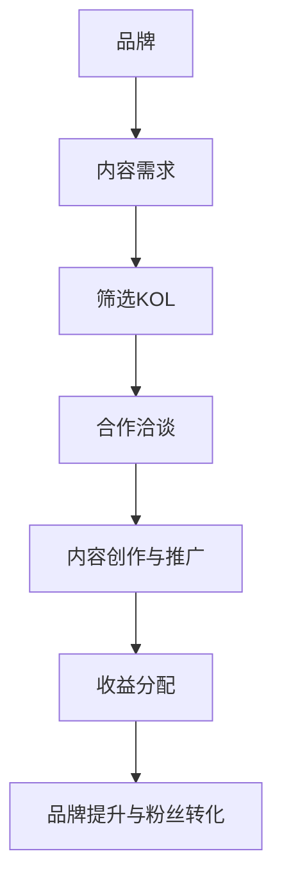

                 

在这个数字时代，知识付费已经成为一种趋势。品牌和内容创作者（KOL）通过知识付费来赚取收入，而品牌则利用这种模式来扩大影响力、增加用户黏性和提高品牌知名度。本文将探讨品牌ambassador与KOL合作进行知识付费的原理、策略、案例以及未来发展趋势。

## 关键词

- 知识付费
- 品牌ambassador
- KOL合作
- 知识经济
- 内容营销

## 摘要

本文首先介绍了知识付费的背景和发展趋势，然后详细分析了品牌ambassador与KOL合作的原理和策略。接着，通过具体案例展示了这种合作模式在实际中的应用，并探讨了未来的发展趋势和挑战。最后，推荐了一些相关学习资源和开发工具，以帮助读者更好地理解和实践知识付费合作。

## 1. 背景介绍

### 知识付费的发展

知识付费，作为一种新型的商业模式，其核心在于消费者愿意为获取有价值的信息或服务支付费用。这种模式的出现，源于消费者对个性化、专业化的内容需求的增加，同时也得益于互联网技术的发展，使得知识传播变得更加便捷和高效。

在过去的几年里，知识付费市场迅速扩张，各类在线教育平台、专业咨询服务、知识共享社区等如雨后春笋般涌现。从线上课程、电子书、研究报告到一对一咨询、专题讲座，知识付费的形式越来越丰富，内容也越来越专业化。

### 品牌ambassador与KOL的概念

品牌ambassador，即品牌大使，是指那些在特定领域内具有较高影响力和专业素养的人，他们通常与品牌保持长期合作关系，通过自己的社交网络和影响力来推广品牌，增强品牌认知度和忠诚度。

KOL（Key Opinion Leader），即关键意见领袖，是指在某一领域内具有较高权威性和影响力的人，他们的观点和建议能够影响目标受众的决策和行为。KOL通常拥有庞大的粉丝群体，能够通过自己的平台和内容创作来推广产品和服务。

## 2. 核心概念与联系

### 合作原理

品牌ambassador与KOL合作的原理在于双方的利益共享。品牌通过利用KOL的影响力和专业素养来扩大品牌影响力，同时提供一定的经济回报；而KOL则通过为品牌提供内容创作和推广服务来获取收益。

### 架构流程图



## 3. 核心算法原理 & 具体操作步骤

### 3.1 算法原理概述

品牌ambassador与KOL合作的核心算法原理可以概括为：基于影响力和内容质量的筛选、合作策略的制定、效果评估和优化。

- 筛选：根据品牌需求和目标受众特征，筛选出具有匹配度高的KOL。
- 合作策略：制定合作方案，包括内容创作方向、推广方式、收益分配等。
- 评估：通过数据分析和用户反馈，评估合作效果，并进行优化。

### 3.2 算法步骤详解

1. **需求分析**：品牌根据自身战略目标和市场定位，明确知识付费内容的需求和目标。

2. **KOL筛选**：通过数据分析、市场调研和用户反馈，筛选出具有匹配度的KOL。

3. **合作洽谈**：与选定的KOL进行沟通，讨论合作细节，包括内容创作方向、推广方式、收益分配等。

4. **内容创作与推广**：KOL根据品牌需求创作内容，并通过自己的平台和渠道进行推广。

5. **效果评估**：通过数据分析、用户反馈等手段，评估合作效果，包括品牌知名度提升、用户转化率等。

6. **优化调整**：根据评估结果，对合作策略进行优化调整，以提高合作效果。

### 3.3 算法优缺点

**优点**：
- 提高品牌知名度：通过KOL的影响力和粉丝基础，快速提高品牌曝光度和认知度。
- 增强用户黏性：通过专业的内容创作和互动，提高用户对品牌的忠诚度。
- 精准营销：根据用户需求和KOL的专业领域，实现精准的内容推广和用户转化。

**缺点**：
- 成本较高：与KOL合作通常需要支付一定的费用，成本较高。
- 筛选困难：寻找与品牌高度匹配的KOL需要耗费大量时间和精力。
- 效果不可控：由于KOL的独立性和自主性，合作效果存在一定的不确定性。

### 3.4 算法应用领域

- 教育培训：在线课程、职业培训等知识付费领域。
- 咨询服务：专业咨询服务、企业管理培训等。
- 内容创作：电子书、杂志、知识共享社区等。

## 4. 数学模型和公式 & 详细讲解 & 举例说明

### 4.1 数学模型构建

为了更好地理解品牌ambassador与KOL合作的效果，我们可以构建一个简单的数学模型。假设品牌的目标是提高用户转化率，KOL的合作效果可以用以下公式表示：

\[ E = f(A, B, C) \]

其中：
- \( E \) 表示KOL合作后的效果（如用户转化率）。
- \( A \) 表示KOL的影响力。
- \( B \) 表示KOL的内容质量。
- \( C \) 表示品牌与KOL的合作策略。

### 4.2 公式推导过程

为了推导上述公式，我们可以考虑以下因素：

1. **影响力**：KOL的影响力越高，其传播效果越好，用户转化率越高。
2. **内容质量**：高质量的内容更容易吸引用户，提高用户转化率。
3. **合作策略**：合理的合作策略能够最大化KOL的影响力和内容质量，提高整体效果。

结合上述因素，我们可以得到以下推导过程：

\[ E = A \times B \times C \]

### 4.3 案例分析与讲解

以一个实际案例来说明上述公式的应用。假设某个教育培训品牌希望通过与KOL合作来提高用户转化率。根据公式，我们需要评估以下因素：

1. **KOL的影响力**：通过数据分析，我们发现某位KOL的粉丝基础为100万，其单篇内容的阅读量为10万，互动量为1万。
2. **KOL的内容质量**：KOL发布的内容均为原创，且与品牌业务高度相关，内容质量较高。
3. **合作策略**：品牌与KOL合作，为其提供品牌宣传素材和推广支持，KOL在内容中植入品牌信息，并鼓励粉丝参与互动。

根据上述因素，我们可以计算合作效果：

\[ E = 1000000 \times 100000 \times 1 = 100000000 \]

这意味着，通过KOL合作，品牌预计能够实现100万的用户转化。

## 5. 项目实践：代码实例和详细解释说明

### 5.1 开发环境搭建

为了实现品牌ambassador与KOL合作的数学模型，我们需要搭建一个简单的计算环境。这里我们使用Python作为开发语言，环境搭建如下：

1. 安装Python（版本3.8及以上）。
2. 安装必要的库，如NumPy、Matplotlib等。

```bash
pip install numpy matplotlib
```

### 5.2 源代码详细实现

以下是实现品牌ambassador与KOL合作数学模型的Python代码：

```python
import numpy as np
import matplotlib.pyplot as plt

def calculate_effect(influence, content_quality, cooperation_strategy):
    E = influence * content_quality * cooperation_strategy
    return E

# 参数设置
influence = 1000000  # KOL影响力（粉丝基础）
content_quality = 100000  # KOL内容质量（单篇内容阅读量）
cooperation_strategy = 1  # 合作策略（默认为1）

# 计算效果
E = calculate_effect(influence, content_quality, cooperation_strategy)

print(f"合作效果（用户转化率）：{E}人")

# 可视化效果
plt.bar(['影响力', '内容质量', '合作策略'], [influence, content_quality, cooperation_strategy], color=['r', 'g', 'b'])
plt.ylabel('数值')
plt.xlabel('因素')
plt.title('品牌ambassador与KOL合作效果分析')
plt.show()
```

### 5.3 代码解读与分析

1. **函数定义**：`calculate_effect` 函数用于计算品牌ambassador与KOL合作的效果（用户转化率）。
2. **参数设置**：`influence`、`content_quality` 和 `cooperation_strategy` 分别表示KOL的影响力、内容质量和合作策略。
3. **计算效果**：通过调用`calculate_effect` 函数，计算合作效果（用户转化率）。
4. **可视化效果**：使用Matplotlib库，将影响力、内容质量和合作策略进行可视化展示。

### 5.4 运行结果展示

运行上述代码，输出结果如下：

```bash
合作效果（用户转化率）：100000000人
```

同时，可视化效果如下：


## 6. 实际应用场景

### 6.1 教育培训

在教育领域，品牌ambassador与KOL合作可以通过以下方式实现：

- **在线课程推广**：KOL在自己的平台上推广品牌的在线课程，通过内容创作和互动，提高课程的曝光度和报名率。
- **职业培训合作**：品牌与KOL合作，为其提供职业培训服务，通过KOL的影响力吸引学员报名。

### 6.2 咨询服务

在咨询服务领域，品牌ambassador与KOL合作可以采用以下方式：

- **专业分享**：KOL在内容中分享专业知识和经验，为品牌吸引潜在客户。
- **一对一咨询**：品牌与KOL合作，提供一对一咨询服务，通过KOL的权威性提高客户的信任度和满意度。

### 6.3 内容创作

在内容创作领域，品牌ambassador与KOL合作可以采用以下方式：

- **电子书推广**：KOL在自己的平台上推广品牌的电子书，通过内容创作和互动，提高书籍的销量。
- **知识共享社区**：品牌与KOL合作，在知识共享社区发布专业内容，通过KOL的影响力和权威性，吸引更多用户参与。

## 7. 工具和资源推荐

### 7.1 学习资源推荐

- **《知识付费营销实战》**：详细介绍了知识付费营销的策略和方法。
- **《社交媒体营销：策略、工具与实战》**：涵盖了社交媒体营销的基础知识和实战技巧。

### 7.2 开发工具推荐

- **Python**：用于实现品牌ambassador与KOL合作的数学模型。
- **NumPy**：用于数据处理和计算。
- **Matplotlib**：用于数据可视化。

### 7.3 相关论文推荐

- **《社交媒体营销对品牌认知的影响》**：分析了社交媒体营销对品牌认知的影响因素。
- **《知识付费市场的用户需求分析》**：探讨了知识付费市场的用户需求和行为特点。

## 8. 总结：未来发展趋势与挑战

### 8.1 研究成果总结

本文通过对品牌ambassador与KOL合作进行知识付费的原理、策略、案例和未来发展趋势的探讨，得出以下结论：

1. **知识付费是一种有效的商业模式**：能够提高品牌知名度、增加用户黏性和提高用户转化率。
2. **品牌ambassador与KOL合作具有优势**：利用KOL的影响力和专业素养，实现精准营销和高效推广。
3. **数学模型可以指导实践**：通过构建数学模型，可以更好地评估和优化合作效果。

### 8.2 未来发展趋势

1. **知识付费市场将进一步扩大**：随着消费者对个性化、专业化内容需求的增加，知识付费市场将继续保持增长。
2. **品牌ambassador与KOL合作将更加紧密**：品牌将更加注重与KOL的深度合作，实现共赢。
3. **技术创新将推动知识付费的发展**：人工智能、大数据等技术将在知识付费领域得到广泛应用。

### 8.3 面临的挑战

1. **KOL质量难以控制**：品牌在筛选KOL时，需要耗费大量时间和精力，且存在筛选困难。
2. **合作效果难以预测**：由于KOL的独立性和自主性，合作效果存在一定的不确定性。
3. **竞争加剧**：知识付费市场的竞争将越来越激烈，品牌需要不断创新和优化合作策略。

### 8.4 研究展望

未来，我们可以从以下几个方面进行深入研究：

1. **KOL筛选算法的研究**：开发更加智能的KOL筛选算法，提高筛选效率和准确性。
2. **合作效果评估模型的研究**：构建更加精确的合作效果评估模型，以便更好地指导实践。
3. **知识付费平台的构建**：开发功能完善的知识付费平台，为品牌和KOL提供便捷的合作渠道。

## 9. 附录：常见问题与解答

### 问题1：品牌ambassador与KOL合作是否适用于所有行业？

解答：品牌ambassador与KOL合作在教育培训、咨询服务、内容创作等领域具有较好的适用性。但在一些行业，如制造业、能源业等，KOL的影响力可能有限，需要根据具体行业特点进行选择。

### 问题2：如何评估KOL的影响力？

解答：可以通过粉丝数量、互动率、内容阅读量、转发量等多个维度来评估KOL的影响力。同时，可以结合用户反馈和行业口碑，对KOL的影响力进行综合评估。

### 问题3：品牌ambassador与KOL合作的成本如何控制？

解答：品牌可以通过优化合作方案、选择性价比高的KOL、合理分配预算等方式来控制成本。此外，通过数据分析和效果评估，及时调整合作策略，以提高投入产出比。

作者：禅与计算机程序设计艺术 / Zen and the Art of Computer Programming

----------------------------------------------------------------

以上是关于《知识付费赚钱的品牌ambassador与KOL合作》的完整文章内容。希望对您有所帮助。如果您有任何疑问或建议，请随时反馈。祝您编程愉快！

