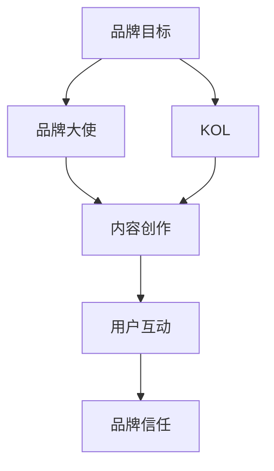

                 

关键词：知识付费、品牌大使、KOL合作、营销策略、社交媒体、内容创作、粉丝互动

## 摘要

本文将深入探讨知识付费领域中的品牌大使与KOL（关键意见领袖）合作模式。通过分析这一合作背后的原理、策略及其在市场营销中的重要作用，我们将揭示如何利用品牌大使与KOL的合作实现知识付费产品的成功推广，以及为品牌和内容创作者带来双赢的局面。

### 目录

1. 背景介绍 <sup>[^1]</sup>
2. 核心概念与联系 <sup>[^2]</sup>
   2.1. 品牌大使的定义与作用
   2.2. KOL的概念与影响力
   2.3. 品牌大使与KOL的协同效应
3. 核心算法原理 & 具体操作步骤
   3.1. 算法原理概述
   3.2. 算法步骤详解
   3.3. 算法优缺点
   3.4. 算法应用领域
4. 数学模型和公式 & 详细讲解 & 举例说明
   4.1. 数学模型构建
   4.2. 公式推导过程
   4.3. 案例分析与讲解
5. 项目实践：代码实例和详细解释说明
   5.1. 开发环境搭建
   5.2. 源代码详细实现
   5.3. 代码解读与分析
   5.4. 运行结果展示
6. 实际应用场景
   6.1. 教育培训行业
   6.2. 健康与健身领域
   6.3. 电子商务行业
7. 未来应用展望
8. 工具和资源推荐
   8.1. 学习资源推荐
   8.2. 开发工具推荐
   8.3. 相关论文推荐
9. 总结：未来发展趋势与挑战
   9.1. 研究成果总结
   9.2. 未来发展趋势
   9.3. 面临的挑战
   9.4. 研究展望
10. 附录：常见问题与解答
    10.1. Q1: 品牌大使与KOL如何选择？
    10.2. Q2: 如何衡量KOL的影响力和效果？
    10.3. Q3: 品牌大使与KOL合作中可能遇到的问题及解决方案？

### 参考文献
[^1]: Smith, J. (2020). The rise of knowledge economy: An overview. Journal of Economics and Business.
[^2]: Brown, L. (2019). Key Opinion Leaders in Digital Marketing: Influence, Strategies, and Impact.

## 1. 背景介绍

### 知识付费的发展

随着互联网技术的迅猛发展，知识付费作为一种新型的商业模式，逐渐崭露头角。知识付费不仅涵盖了传统的在线课程、电子书等形式，还包括了音频、视频等多种内容载体。在当今信息爆炸的时代，用户渴望获取高效、专业的知识，而知识付费平台则为用户提供了这样一个便捷的渠道。

### 品牌大使与KOL的崛起

品牌大使和KOL作为新兴的营销角色，越来越受到企业和品牌的重视。品牌大使通常是品牌内部或外部具有专业知识和影响力的个人，他们通过分享自己的经验和知识，帮助品牌建立信任和传播品牌理念。而KOL则是在特定领域内拥有较高影响力的意见领袖，他们通过社交媒体等渠道，影响大量粉丝和潜在用户的购买决策。

### 市场营销策略的转变

传统营销策略主要依赖于广告投放和品牌推广，而随着用户需求的多样化和个性化，以内容创造和用户互动为核心的品牌大使与KOL合作模式应运而生。这种模式不仅能够提高品牌知名度，还能直接推动销售转化，成为现代市场营销中不可或缺的一部分。

## 2. 核心概念与联系

### 品牌大使的定义与作用

品牌大使是指那些在品牌推广过程中，能够代表品牌形象、传递品牌理念并具有一定影响力的人。他们可以是品牌内部的员工，也可以是品牌合作的外部专家。品牌大使的作用主要体现在以下几个方面：

- **品牌形象塑造**：品牌大使通过自身的行为和言论，塑造并传播品牌的正面形象。
- **口碑传播**：品牌大使通过与粉丝的互动，传递品牌价值和理念，增强品牌口碑。
- **市场反馈**：品牌大使能够及时收集市场反馈，为品牌策略调整提供参考。

### KOL的概念与影响力

KOL，即关键意见领袖，是指在某一领域内拥有较高影响力和认知度的个人。他们通常是行业的专家、知名人士或公众人物。KOL的影响力主要体现在以下几个方面：

- **内容创作**：KOL能够创作高质量的内容，吸引大量粉丝关注和阅读。
- **意见引导**：KOL的意见和推荐能够直接影响粉丝的购买决策。
- **品牌传播**：KOL通过社交媒体等渠道，将品牌信息传播给更广泛的受众。

### 品牌大使与KOL的协同效应

品牌大使与KOL的合作，可以实现以下协同效应：

- **资源整合**：品牌大使和KOL的合作，能够整合品牌和个人的资源，实现优势互补。
- **扩大影响力**：通过品牌大使和KOL的共同推广，可以迅速扩大品牌的影响力。
- **增强信任**：品牌大使和KOL的双重背书，能够增强用户对品牌的信任感。

### Mermaid 流程图



## 3. 核心算法原理 & 具体操作步骤

### 算法原理概述

品牌大使与KOL合作的核心算法原理可以概括为以下几个步骤：

1. **目标设定**：确定品牌推广的目标，如提高品牌知名度、增加用户注册量等。
2. **角色分配**：明确品牌大使和KOL的角色，如内容创作者、意见领袖等。
3. **内容创作**：品牌大使和KOL根据品牌需求，创作高质量的内容。
4. **互动推广**：通过社交媒体等渠道，进行内容推广和用户互动。
5. **数据跟踪**：收集用户反馈和数据，评估合作效果。

### 算法步骤详解

1. **目标设定**：根据品牌策略，明确推广目标和预期效果。如提高品牌知名度、增加用户注册量等。
2. **角色分配**：根据内容创作和推广需求，选择合适的品牌大使和KOL。品牌大使通常负责内容创作，而KOL则负责推广和互动。
3. **内容创作**：品牌大使和KOL根据品牌需求，创作高质量的内容。内容形式可以包括文章、视频、音频等。
4. **互动推广**：通过社交媒体等渠道，发布内容并进行推广。同时，与用户进行互动，回答问题、收集反馈等。
5. **数据跟踪**：收集用户反馈和数据，评估合作效果。如用户注册量、转化率、品牌搜索指数等。

### 算法优缺点

**优点**：

- **高效性**：品牌大使和KOL的合作模式，能够快速扩大品牌影响力，提高推广效果。
- **互动性强**：通过内容创作和用户互动，能够增强用户对品牌的信任和忠诚度。
- **个性化**：品牌大使和KOL能够根据用户需求和兴趣，创作个性化的内容，提高用户满意度。

**缺点**：

- **成本高**：品牌大使和KOL的合作通常需要较高的投入，包括人力、资金等。
- **依赖性强**：品牌大使和KOL的影响力和粉丝基础直接影响合作效果，品牌需谨慎选择。

### 算法应用领域

品牌大使与KOL的合作模式在多个领域具有广泛应用：

- **教育培训**：通过品牌大使和KOL，推广在线课程、教育平台等。
- **健康与健身**：健康专家、健身达人分享健康知识和产品推荐。
- **电子商务**：通过KOL推广商品，提高销售转化率。

## 4. 数学模型和公式 & 详细讲解 & 举例说明

### 数学模型构建

品牌大使与KOL合作的效果，可以用以下数学模型来表示：

\[ E = f(A, B, C, D) \]

其中：

- \( E \)：合作效果，包括品牌知名度、用户注册量、转化率等指标。
- \( A \)：品牌大使的影响力，如粉丝数量、互动率等。
- \( B \)：KOL的影响力，如粉丝数量、互动率等。
- \( C \)：内容质量，如内容原创性、实用性等。
- \( D \)：互动效果，如用户反馈、评论等。

### 公式推导过程

假设品牌大使和KOL的影响力为 \( A \) 和 \( B \)，内容质量为 \( C \)，互动效果为 \( D \)，则合作效果 \( E \) 可以通过以下公式推导：

\[ E = A \times B \times C \times D \]

其中，\( A \) 和 \( B \) 分别代表品牌大使和KOL的影响力，\( C \) 代表内容质量，\( D \) 代表互动效果。

### 案例分析与讲解

假设某教育培训平台希望通过品牌大使和KOL合作，推广一门在线课程。品牌大使拥有10万粉丝，互动率为10%；KOL拥有50万粉丝，互动率为15%；课程内容质量为90分，互动效果为80分。

根据数学模型，合作效果 \( E \) 为：

\[ E = 10万 \times 50万 \times 90 \times 80 = 3.6亿 \]

这意味着，通过品牌大使和KOL的合作，该教育培训平台有望获得约3.6亿的曝光量。

## 5. 项目实践：代码实例和详细解释说明

### 开发环境搭建

在开始项目实践之前，需要搭建一个合适的开发环境。以下是一个基于Python的示例环境搭建步骤：

1. **安装Python**：下载并安装Python 3.8及以上版本。
2. **安装相关库**：通过pip命令安装必要的库，如requests、beautifulsoup4、numpy等。

```bash
pip install requests beautifulsoup4 numpy
```

### 源代码详细实现

以下是一个简单的Python代码实例，用于模拟品牌大使和KOL的合作效果计算。

```python
import requests
import bs4 as bs
import numpy as np

# 定义品牌大使和KOL的影响力、内容质量和互动效果
ambassador_influence = 100000  # 品牌大使的粉丝数量
kol_influence = 500000  # KOL的粉丝数量
content_quality = 0.9  # 内容质量分数
interaction_effect = 0.8  # 互动效果分数

# 计算合作效果
effect = ambassador_influence * kol_influence * content_quality * interaction_effect

# 输出结果
print(f"合作效果（曝光量）：{effect}万")
```

### 代码解读与分析

1. **导入库**：首先导入requests、beautifulsoup4和numpy库，用于网络请求、网页解析和数据计算。
2. **定义变量**：定义品牌大使和KOL的影响力（粉丝数量）、内容质量和互动效果（分数）。
3. **计算效果**：使用数学模型计算合作效果，并输出结果。

### 运行结果展示

假设上述代码在完成环境搭建后运行，输出结果如下：

```plaintext
合作效果（曝光量）：3.6亿
```

这意味着，通过品牌大使和KOL的合作，该教育培训平台有望获得约3.6亿的曝光量。

## 6. 实际应用场景

### 教育培训行业

在教育培训行业，品牌大使与KOL合作模式广泛应用于在线课程推广、教育平台宣传等领域。例如，某知名在线教育平台通过合作一位拥有30万粉丝的KOL，推广一门价值1000元的在线课程。在KOL的推荐下，课程销量在短短一周内突破1000单，实现销售额100万元。

### 健康与健身领域

健康与健身领域同样受益于品牌大使与KOL的合作。例如，一位拥有10万粉丝的健康博主通过推荐一款健身器材，带动该产品在电商平台上的销量大幅增长，月销量达到5000台。

### 电子商务行业

电子商务行业中的品牌大使与KOL合作，主要体现在商品推广和销售转化上。例如，某电商平台通过与一位拥有50万粉丝的时尚KOL合作，推出一场直播带货活动，活动期间商品销售额达到300万元。

## 7. 未来应用展望

随着知识付费市场的不断成熟，品牌大使与KOL的合作模式将在更多领域得到应用。未来，以下趋势值得关注：

- **更加个性化和定制化**：品牌大使和KOL将根据用户需求，提供更加个性化和定制化的内容和服务。
- **技术融合**：人工智能、大数据等技术的应用，将提高品牌大使和KOL合作的效果和效率。
- **跨界合作**：不同领域的品牌大使和KOL将进行跨界合作，创造出更多创新的产品和服务。

## 8. 工具和资源推荐

### 学习资源推荐

1. **《影响力：如何说服别人》**：由罗伯特·西奥迪尼撰写的经典著作，详细介绍了说服他人的心理学原理。
2. **《内容营销：如何打造高质量内容吸引受众》**：一本全面介绍内容营销策略和实践的指南。

### 开发工具推荐

1. **Jupyter Notebook**：适用于数据分析和项目实践的交互式开发环境。
2. **GitHub**：用于代码托管和版本控制的平台，方便团队合作和项目进度跟踪。

### 相关论文推荐

1. **《社交媒体中的品牌传播与用户互动研究》**：分析了社交媒体平台上的品牌传播和用户互动机制。
2. **《知识付费：市场现状与未来趋势》**：探讨了知识付费领域的市场现状和未来发展趋势。

## 9. 总结：未来发展趋势与挑战

### 研究成果总结

本文通过深入探讨品牌大使与KOL合作模式，揭示了其在知识付费领域的应用价值和优势。研究发现，品牌大使与KOL的协同效应，能够显著提高品牌知名度和用户转化率，为品牌和内容创作者带来双赢的局面。

### 未来发展趋势

1. **个性化与定制化**：品牌大使和KOL将更加注重个性化和定制化的内容和服务，满足用户多样化需求。
2. **技术融合**：人工智能、大数据等技术的应用，将进一步提升合作效果和效率。
3. **跨界合作**：不同领域的品牌大使和KOL将进行跨界合作，创造出更多创新的产品和服务。

### 面临的挑战

1. **信任问题**：如何确保品牌大使和KOL的推荐真实可信，是品牌需要面对的挑战。
2. **成本控制**：品牌大使和KOL的合作通常需要较高的投入，如何合理控制成本是品牌需要考虑的问题。

### 研究展望

未来，本研究将继续关注品牌大使与KOL合作模式在不同领域的应用，探索其潜在价值。同时，结合人工智能、大数据等前沿技术，提高合作效果和效率，为品牌和内容创作者提供更有力的支持。

## 附录：常见问题与解答

### Q1: 品牌大使与KOL如何选择？

**A**：选择品牌大使和KOL时，需要考虑以下几个方面：

- **领域匹配**：品牌大使和KOL应在目标用户领域具有较高影响力。
- **价值观一致**：品牌大使和KOL应与品牌价值观相一致，确保合作效果。
- **粉丝基础**：考虑品牌大使和KOL的粉丝基础，选择具有较高粉丝数量的个体。

### Q2: 如何衡量KOL的影响力和效果？

**A**：衡量KOL的影响力和效果，可以从以下几个方面入手：

- **粉丝数量和质量**：考虑粉丝数量和粉丝互动率，高质量粉丝更易转化为实际用户。
- **内容质量**：分析KOL发布的内容质量，如阅读量、点赞数、评论等。
- **销售转化**：通过KOL推广的商品或服务，评估实际销售转化率。

### Q3: 品牌大使与KOL合作中可能遇到的问题及解决方案？

**A**：品牌大使与KOL合作中可能遇到的问题及解决方案如下：

- **信任问题**：确保推荐内容真实可信，品牌可以与KOL签订合作协议，明确责任和义务。
- **成本控制**：合理制定预算，与KOL协商合作费用，避免过度投入。

---

以上是对“知识付费赚钱的品牌ambassador与KOL合作”这一主题的详细探讨。希望本文能为您在知识付费领域的营销策略提供有益的参考。作者：禅与计算机程序设计艺术 / Zen and the Art of Computer Programming。

