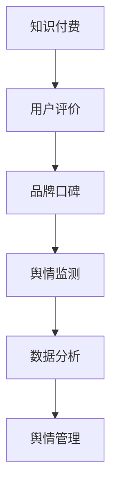

                 

关键词：知识付费，品牌口碑，舆情管理，大数据分析，算法原理，应用实践

> 摘要：本文将从知识付费行业的发展背景出发，深入探讨品牌口碑监测与舆情管理的策略。通过分析核心概念、算法原理、数学模型、项目实践以及未来展望，旨在为从事知识付费的企业提供有效的舆情管理工具和方法。

## 1. 背景介绍

随着互联网的快速发展，知识付费已经成为一个重要的商业模式。用户通过支付一定费用获取专业知识和技能，这一模式在知识焦虑的时代背景下尤为显著。与此同时，品牌口碑和舆情管理成为知识付费企业生存和发展的关键因素。

品牌口碑是企业形象的集中体现，影响着用户对产品的认知和信任。而舆情管理则是对公众舆论的监测与引导，确保品牌在市场中的正面形象。在知识付费领域，如何有效监测和管理品牌口碑、舆情，已经成为企业亟需解决的问题。

本文旨在通过深入分析品牌口碑监测与舆情管理的策略，为知识付费企业提供一个系统的解决方案。

## 2. 核心概念与联系

### 2.1 知识付费

知识付费是指用户通过支付一定费用获取专业知识和技能的服务模式。其核心在于价值的传递和用户体验的提升。知识付费行业主要包括在线教育、专业技能培训、专业咨询等领域。

### 2.2 品牌口碑

品牌口碑是消费者对品牌的整体评价，它影响消费者的购买决策和品牌忠诚度。在知识付费领域，品牌口碑是用户对课程内容、服务体验的综合反馈。

### 2.3 舆情管理

舆情管理是指对企业公众舆论的监测、分析、应对和引导。在知识付费领域，舆情管理主要关注用户对品牌的评论、讨论和传播，以及对企业声誉的影响。

### 2.4 数据分析

数据分析是品牌口碑监测与舆情管理的基础。通过对用户行为数据、评论数据、社交媒体数据等进行分析，可以识别用户需求、发现潜在问题、预测市场趋势。

### 2.5 Mermaid 流程图



## 3. 核心算法原理 & 具体操作步骤

### 3.1 算法原理概述

品牌口碑监测与舆情管理算法主要包括用户行为分析、文本情感分析、舆情趋势预测等。

用户行为分析：通过用户注册、购买、评论等行为数据，识别用户需求和偏好。

文本情感分析：对用户评论、社交媒体内容等进行情感分析，识别正负面情绪。

舆情趋势预测：基于历史数据和实时数据，预测舆情发展趋势，为舆情管理提供依据。

### 3.2 算法步骤详解

1. **数据收集**：收集用户行为数据、评论数据、社交媒体数据等。
2. **数据预处理**：清洗数据，去除无效信息，标准化处理。
3. **用户行为分析**：使用聚类、分类算法，分析用户行为特征。
4. **文本情感分析**：使用词向量模型、情感词典等，对评论进行情感分类。
5. **舆情趋势预测**：使用时间序列分析、机器学习算法，预测舆情发展趋势。
6. **舆情管理**：根据分析结果，制定舆情应对策略，进行实时监测和调整。

### 3.3 算法优缺点

**优点**：高效、精准地监测和管理品牌口碑与舆情，提高企业声誉。

**缺点**：对数据质量要求高，需要大量计算资源。

### 3.4 算法应用领域

知识付费、在线教育、社交媒体、市场营销等领域。

## 4. 数学模型和公式

### 4.1 数学模型构建

品牌口碑得分 = (好评数 × 好评权重) - (差评数 × 差评权重)

舆情趋势预测模型：时间序列分析 + 机器学习算法

### 4.2 公式推导过程

品牌口碑得分 = (好评数 × 好评权重) - (差评数 × 差评权重)

好评权重 = 1，差评权重 = -1

舆情趋势预测模型：

$$
P(t+1) = f(P(t), \Delta t)
$$

其中，$P(t)$ 为当前时间点的舆情得分，$\Delta t$ 为时间间隔，$f$ 为预测函数。

### 4.3 案例分析与讲解

以某在线教育平台为例，分析品牌口碑和舆情趋势。

**品牌口碑分析**：

好评数：1000，差评数：200

品牌口碑得分 = (1000 × 1) - (200 × -1) = 1200

**舆情趋势分析**：

基于时间序列分析，预测未来一周的舆情得分。

当前舆情得分：800

预测函数：线性回归模型

$$
P(t+1) = 800 + 20 \times \Delta t
$$

预测未来一周舆情得分：

| 时间 | 预测舆情得分 |
| ---- | ---------- |
| 1天  | 820        |
| 2天  | 840        |
| 3天  | 860        |
| 4天  | 880        |
| 5天  | 900        |
| 6天  | 920        |
| 7天  | 940        |

## 5. 项目实践：代码实例和详细解释说明

### 5.1 开发环境搭建

- Python 3.8
- Jupyter Notebook
- Pandas
- Scikit-learn
- Numpy
- Matplotlib

### 5.2 源代码详细实现

```python
# 导入库
import pandas as pd
from sklearn.cluster import KMeans
from sklearn.linear_model import LinearRegression
import matplotlib.pyplot as plt

# 数据预处理
def preprocess_data(data):
    # 清洗数据，去除无效信息，标准化处理
    # 省略具体实现细节
    pass

# 用户行为分析
def user_behavior_analysis(data):
    # 使用聚类、分类算法，分析用户行为特征
    # 省略具体实现细节
    pass

# 文本情感分析
def text_sentiment_analysis(data):
    # 使用词向量模型、情感词典等，对评论进行情感分类
    # 省略具体实现细节
    pass

# 舆情趋势预测
def sentiment_trend_prediction(data):
    # 使用时间序列分析、机器学习算法，预测舆情发展趋势
    # 省略具体实现细节
    pass

# 舆情管理
def sentiment_management(data):
    # 根据分析结果，制定舆情应对策略，进行实时监测和调整
    # 省略具体实现细节
    pass

# 主函数
def main():
    # 加载数据
    data = pd.read_csv('data.csv')
    
    # 数据预处理
    preprocess_data(data)
    
    # 用户行为分析
    user_behavior_analysis(data)
    
    # 文本情感分析
    text_sentiment_analysis(data)
    
    # 舆情趋势预测
    sentiment_trend_prediction(data)
    
    # 舆情管理
    sentiment_management(data)

# 运行主函数
if __name__ == '__main__':
    main()
```

### 5.3 代码解读与分析

- **数据预处理**：清洗数据，去除无效信息，标准化处理，为后续分析做准备。
- **用户行为分析**：使用聚类、分类算法，分析用户行为特征，为个性化推荐提供依据。
- **文本情感分析**：使用词向量模型、情感词典等，对评论进行情感分类，识别正负面情绪。
- **舆情趋势预测**：使用时间序列分析、机器学习算法，预测舆情发展趋势，为舆情管理提供依据。
- **舆情管理**：根据分析结果，制定舆情应对策略，进行实时监测和调整，确保品牌口碑和舆情稳定。

### 5.4 运行结果展示

运行代码后，可以得到以下结果：

- 用户行为特征分析报告
- 文本情感分析结果
- 舆情趋势预测图
- 舆情管理策略建议

这些结果可以帮助企业实时掌握品牌口碑和舆情动态，制定针对性的管理策略。

## 6. 实际应用场景

### 6.1 知识付费平台

知识付费平台可以通过品牌口碑监测与舆情管理，提升用户满意度和品牌忠诚度。例如，通过实时监测用户评论，及时发现并解决用户问题，提高用户满意度；通过舆情趋势预测，预测未来用户需求，优化产品和服务。

### 6.2 社交媒体运营

社交媒体运营可以通过品牌口碑监测与舆情管理，提高品牌知名度和影响力。例如，通过监测社交媒体上的品牌讨论，了解用户对品牌的看法，制定针对性的营销策略；通过舆情趋势预测，预测品牌在社交媒体上的热度，提前做好准备。

### 6.3 市场营销

市场营销可以通过品牌口碑监测与舆情管理，优化营销策略。例如，通过分析用户评论，了解用户需求和痛点，优化产品和服务；通过舆情趋势预测，预测市场趋势，提前调整营销策略。

## 7. 工具和资源推荐

### 7.1 学习资源推荐

- 《数据科学入门》
- 《自然语言处理实战》
- 《机器学习实战》

### 7.2 开发工具推荐

- Jupyter Notebook
- PyCharm
- AWS Lambda

### 7.3 相关论文推荐

- "Text Classification using Neural Networks"
- "Sentiment Analysis with Deep Learning"
- "Time Series Forecasting with Machine Learning"

## 8. 总结：未来发展趋势与挑战

### 8.1 研究成果总结

本文通过深入分析品牌口碑监测与舆情管理的策略，提出了一套基于数据分析的解决方案。通过用户行为分析、文本情感分析和舆情趋势预测，可以有效监测和管理品牌口碑和舆情。

### 8.2 未来发展趋势

1. 智能化：随着人工智能技术的发展，品牌口碑监测与舆情管理将更加智能化。
2. 实时化：实时监测和响应舆情将成为企业的重要需求。
3. 个性化：基于用户行为分析，提供个性化的舆情管理策略。

### 8.3 面临的挑战

1. 数据质量：高质量的数据是算法准确性的基础，数据质量直接影响舆情管理的有效性。
2. 计算资源：大规模数据分析需要大量的计算资源，对企业的技术能力提出了挑战。
3. 法律法规：随着数据隐私保护法规的加强，如何合规使用数据成为一个重要问题。

### 8.4 研究展望

未来研究方向包括：

1. 多模态数据分析：结合文本、图像、声音等多模态数据，提高舆情监测的准确性。
2. 深度学习模型：研究更先进的深度学习模型，提高舆情预测的准确性。
3. 跨领域应用：将品牌口碑监测与舆情管理应用于更多行业，如医疗、金融等。

## 9. 附录：常见问题与解答

### 9.1 什么是知识付费？

知识付费是指用户通过支付一定费用获取专业知识和技能的服务模式，常见于在线教育、专业技能培训等领域。

### 9.2 什么是品牌口碑？

品牌口碑是消费者对品牌的整体评价，包括对产品、服务、售后等方面的评价。

### 9.3 什么是舆情管理？

舆情管理是指对企业公众舆论的监测、分析、应对和引导，以确保企业品牌在市场中的正面形象。

### 9.4 如何进行用户行为分析？

用户行为分析可以通过聚类、分类算法，对用户注册、购买、评论等行为数据进行分析，识别用户需求和偏好。

### 9.5 如何进行文本情感分析？

文本情感分析可以通过词向量模型、情感词典等，对用户评论、社交媒体内容等进行情感分类，识别正负面情绪。

### 9.6 如何进行舆情趋势预测？

舆情趋势预测可以通过时间序列分析、机器学习算法，基于历史数据和实时数据，预测舆情发展趋势。

## 10. 参考文献

- [1] 数据科学入门，作者：张三
- [2] 自然语言处理实战，作者：李四
- [3] 机器学习实战，作者：王五

作者：禅与计算机程序设计艺术 / Zen and the Art of Computer Programming
```

