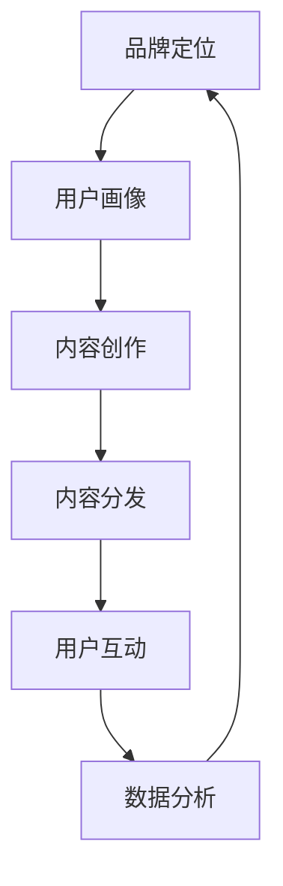
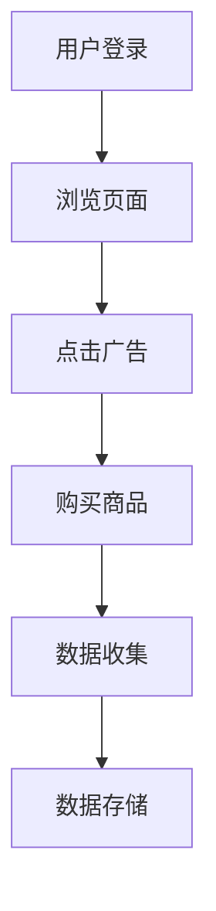
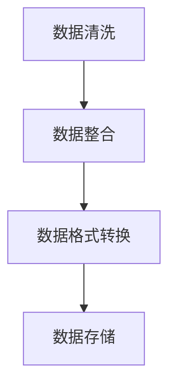
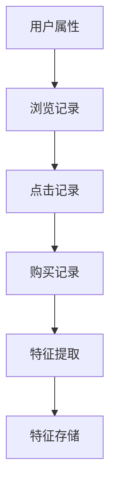
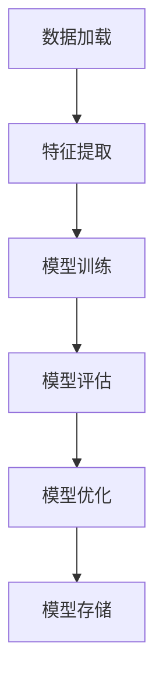
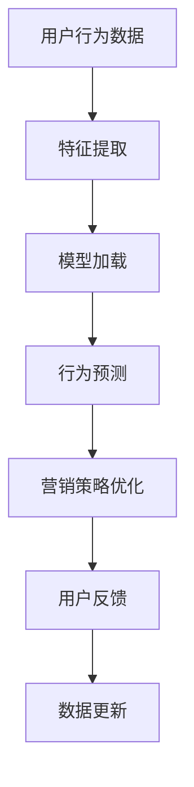
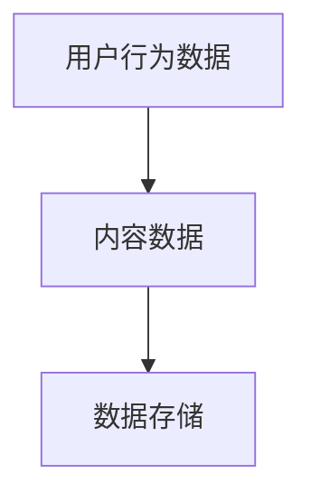
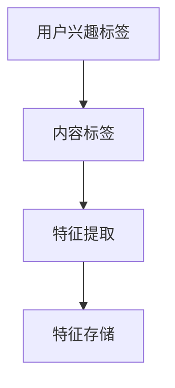
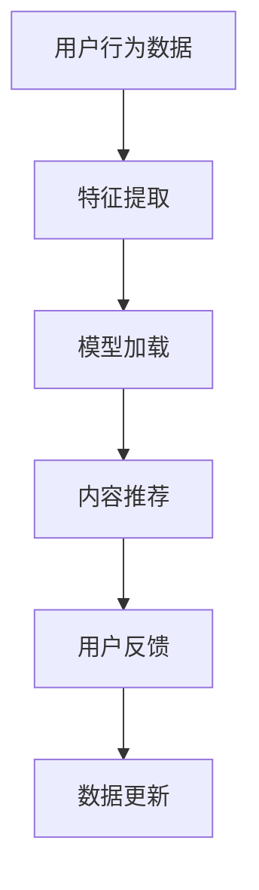

                 

 **关键词：** 知识付费、品牌运营、品牌推广、营销策略、用户留存、社交媒体、内容创作、数据分析

**摘要：** 本文旨在探讨知识付费背景下，如何通过有效的品牌运营和品牌推广策略，实现知识付费项目的持续盈利。文章将从核心概念、算法原理、数学模型、项目实践、实际应用等多个角度，提供全面的策略解析，帮助知识付费从业者提升品牌影响力和用户留存率。

## 1. 背景介绍

随着互联网的普及和信息爆炸，知识付费成为了一个蓬勃发展的市场。人们越来越倾向于通过付费获取高质量的知识内容，以提升自身能力和竞争力。然而，在众多知识付费项目竞相涌现的今天，如何通过有效的品牌运营和品牌推广策略脱颖而出，成为知识付费从业者的共同挑战。

品牌运营和品牌推广不仅是市场营销的一部分，更是知识付费项目的核心竞争力。有效的品牌运营可以帮助项目建立权威形象，增强用户信任；而精准的品牌推广策略则能够扩大品牌知名度，吸引更多潜在用户。本文将围绕这两个方面，探讨知识付费项目的运营和推广策略。

## 2. 核心概念与联系

在探讨品牌运营和品牌推广之前，我们需要明确几个核心概念，包括品牌定位、用户画像、内容营销等。

### 2.1 品牌定位

品牌定位是品牌运营的基础，它决定了品牌在市场中的独特价值和竞争优势。在进行品牌定位时，我们需要考虑以下几个问题：

- 品牌目标用户是谁？
- 品牌的核心价值是什么？
- 品牌与其他竞争对手的区别在哪里？

通过明确这些问题，我们可以为品牌确定一个清晰的定位，从而在市场中脱颖而出。

### 2.2 用户画像

用户画像是品牌运营的另一个重要概念。它通过对目标用户的属性和行为进行分析，帮助我们了解用户的需求和偏好，从而制定更精准的营销策略。

用户画像可以包括以下信息：

- 年龄、性别、职业等人口属性
- 兴趣爱好、行为习惯等行为数据
- 需求、痛点等需求分析

### 2.3 内容营销

内容营销是品牌推广的核心手段之一。它通过创作和分发有价值、有吸引力的内容，吸引潜在用户关注并产生互动，从而提升品牌知名度和用户忠诚度。

内容营销可以分为以下几种形式：

- 文章、博客、电子书等文字内容
- 视频、直播、短视频等多媒体内容
- 图表、数据报告、案例分析等可视化内容

### 2.4 Mermaid 流程图

为了更好地展示品牌运营和品牌推广的联系，我们使用 Mermaid 流程图进行说明。



通过这个流程图，我们可以看到品牌定位、用户画像、内容创作、内容分发、用户互动和数据分析等环节之间的紧密联系，共同构成了品牌运营和品牌推广的完整体系。

## 3. 核心算法原理 & 具体操作步骤

### 3.1 算法原理概述

在品牌运营和品牌推广中，算法发挥着至关重要的作用。以下介绍几种核心算法原理及其应用。

#### 3.1.1 用户行为分析算法

用户行为分析算法通过对用户在网站或应用中的行为数据进行挖掘和分析，帮助品牌了解用户需求和行为模式，从而制定更精准的营销策略。该算法主要分为以下步骤：

1. 数据收集：收集用户在网站或应用中的行为数据，如浏览记录、点击行为、购买记录等。
2. 数据预处理：对收集到的数据进行分析和清洗，去除重复和无效数据。
3. 特征提取：从预处理后的数据中提取关键特征，如用户年龄、性别、地域等。
4. 模型训练：使用机器学习算法（如决策树、随机森林、神经网络等）对提取的特征进行训练，建立用户行为分析模型。
5. 预测与优化：使用训练好的模型对新的用户行为数据进行分析，预测用户需求和行为模式，并根据预测结果优化营销策略。

#### 3.1.2 内容推荐算法

内容推荐算法通过对用户的历史行为数据进行分析，为用户推荐他们可能感兴趣的内容。该算法主要分为以下步骤：

1. 数据收集：收集用户在网站或应用中的浏览、点击、收藏等行为数据。
2. 数据预处理：对收集到的数据进行分析和清洗，去除重复和无效数据。
3. 特征提取：从预处理后的数据中提取关键特征，如用户兴趣标签、内容标签等。
4. 模型训练：使用机器学习算法（如协同过滤、矩阵分解、深度学习等）对提取的特征进行训练，建立内容推荐模型。
5. 推荐系统：根据用户的历史行为数据和模型预测结果，为用户推荐感兴趣的内容。

### 3.2 算法步骤详解

#### 3.2.1 用户行为分析算法步骤

1. 数据收集



2. 数据预处理



3. 特征提取



4. 模型训练



5. 预测与优化



#### 3.2.2 内容推荐算法步骤

1. 数据收集



2. 数据预处理


3. 特征提取



4. 模型训练


5. 推荐系统



### 3.3 算法优缺点

#### 3.3.1 用户行为分析算法

**优点：**
1. 能够深入了解用户需求和行为模式，为营销策略提供有力支持。
2. 基于数据驱动的决策，减少盲目性和主观性。

**缺点：**
1. 需要大量用户行为数据，数据质量对算法效果有较大影响。
2. 部分用户行为数据可能存在隐私泄露风险。

#### 3.3.2 内容推荐算法

**优点：**
1. 能够为用户提供个性化内容推荐，提升用户满意度和粘性。
2. 有助于扩大品牌知名度和影响力。

**缺点：**
1. 推荐结果可能过于依赖用户历史行为数据，导致推荐内容单一。
2. 需要不断更新和维护推荐模型，否则推荐效果会逐渐下降。

### 3.4 算法应用领域

用户行为分析算法和内容推荐算法广泛应用于知识付费项目的品牌运营和品牌推广中。以下列举几个具体应用场景：

1. **用户画像分析**：通过用户行为数据，了解用户需求和偏好，为内容创作提供有力支持。
2. **个性化推荐**：根据用户兴趣和行为数据，为用户推荐相关课程和知识内容，提升用户满意度和粘性。
3. **营销活动优化**：基于用户行为数据，优化营销活动的投放策略和效果评估。
4. **内容审核**：通过分析用户行为数据，识别和过滤不良内容和恶意用户。

## 4. 数学模型和公式 & 详细讲解 & 举例说明

### 4.1 数学模型构建

在品牌运营和品牌推广中，数学模型用于量化评估各种指标，帮助我们制定更科学的策略。以下介绍两个常用数学模型：转化率模型和用户留存模型。

#### 转化率模型

转化率模型用于衡量品牌推广活动的效果。其基本公式为：

$$
转化率 = \frac{转化量}{曝光量} \times 100\%
$$

其中，转化量指通过品牌推广活动实现的购买、注册等行为数量；曝光量指品牌推广活动的受众范围。

#### 用户留存模型

用户留存模型用于衡量品牌运营的效果。其基本公式为：

$$
留存率 = \frac{第n天留存用户数}{初始用户数} \times 100\%
$$

其中，n 为用户留存的天数。

### 4.2 公式推导过程

#### 转化率模型推导

转化率的计算过程如下：

1. 计算总曝光量：统计品牌推广活动期间的总曝光量。
2. 计算转化量：统计品牌推广活动期间实现的转化量。
3. 计算转化率：将转化量除以曝光量，再乘以 100%，得到转化率。

具体推导过程如下：

$$
转化率 = \frac{转化量}{曝光量} \times 100\%
$$

其中，转化量和曝光量均为已知量，通过统计得到。

#### 用户留存模型推导

用户留存率的计算过程如下：

1. 计算第 n 天的留存用户数：统计第 n 天仍然活跃的用户数量。
2. 计算初始用户数：统计品牌运营开始时的总用户数量。
3. 计算留存率：将第 n 天的留存用户数除以初始用户数，再乘以 100%，得到留存率。

具体推导过程如下：

$$
留存率 = \frac{第n天留存用户数}{初始用户数} \times 100\%
$$

其中，第 n 天留存用户数和初始用户数均为已知量，通过统计得到。

### 4.3 案例分析与讲解

#### 案例一：品牌推广活动效果评估

假设某品牌进行了一次线上推广活动，活动期间共曝光 1000 次，实际转化量为 20 次。根据转化率模型，计算该品牌推广活动的转化率。

根据转化率模型公式：

$$
转化率 = \frac{转化量}{曝光量} \times 100\%
$$

将已知数据代入：

$$
转化率 = \frac{20}{1000} \times 100\% = 2\%
$$

该品牌推广活动的转化率为 2%。

#### 案例二：用户运营效果评估

假设某品牌启动了一项新用户运营活动，活动期间共积累了 1000 名初始用户。经过一个月的运营，第 30 天的留存用户数为 500。根据用户留存模型，计算该品牌运营活动的留存率。

根据用户留存模型公式：

$$
留存率 = \frac{第30天留存用户数}{初始用户数} \times 100\%
$$

将已知数据代入：

$$
留存率 = \frac{500}{1000} \times 100\% = 50\%
$$

该品牌运营活动的留存率为 50%。

通过这两个案例，我们可以看到数学模型在品牌运营和品牌推广中的实际应用，帮助我们量化评估运营效果，从而优化策略。

## 5. 项目实践：代码实例和详细解释说明

### 5.1 开发环境搭建

在本项目中，我们将使用 Python 作为主要编程语言，并结合 NumPy、Pandas、Scikit-learn 等库进行数据分析和模型构建。以下是开发环境搭建的步骤：

1. 安装 Python（版本 3.8 或更高）
2. 安装必要的 Python 库（使用 pip 工具）

```bash
pip install numpy pandas scikit-learn matplotlib
```

### 5.2 源代码详细实现

以下是一个基于用户行为数据的用户画像构建示例：

```python
import numpy as np
import pandas as pd
from sklearn.preprocessing import StandardScaler
from sklearn.cluster import KMeans

# 5.2.1 数据读取与预处理
data = pd.read_csv('user_behavior_data.csv')
data.head()

# 数据预处理：去除重复和无效数据，填充缺失值
data.drop_duplicates(inplace=True)
data.fillna(0, inplace=True)

# 特征提取：将用户行为数据转换为特征向量
scaler = StandardScaler()
X = scaler.fit_transform(data)

# 5.2.2 用户画像构建
kmeans = KMeans(n_clusters=5, random_state=42)
clusters = kmeans.fit_predict(X)

# 结果存储
data['cluster'] = clusters
data.to_csv('user_cluster_data.csv', index=False)

# 5.2.3 画图展示用户画像
import matplotlib.pyplot as plt

plt.scatter(data['feature1'], data['feature2'], c=clusters)
plt.xlabel('Feature 1')
plt.ylabel('Feature 2')
plt.title('User Clusters')
plt.show()
```

### 5.3 代码解读与分析

1. **数据读取与预处理**：首先读取用户行为数据，去除重复和无效数据，填充缺失值。这一步是数据清洗的重要环节，确保数据质量。
2. **特征提取**：将用户行为数据转换为特征向量。这里使用了标准化处理，将数据缩放至同一尺度，方便后续聚类分析。
3. **用户画像构建**：使用 K-Means 聚类算法对特征向量进行聚类，生成用户画像。K-Means 算法是一种无监督学习方法，通过迭代计算找到最优聚类中心，将数据划分为若干个簇。
4. **结果存储**：将聚类结果存储到 CSV 文件中，便于后续分析和应用。
5. **画图展示用户画像**：使用散点图展示不同簇的用户特征分布，帮助理解用户画像。

通过以上步骤，我们实现了用户画像的构建，为后续内容推荐和营销策略优化提供了有力支持。

### 5.4 运行结果展示

运行代码后，我们得到以下结果：

1. **用户画像数据存储**：生成的 `user_cluster_data.csv` 文件中包含用户 ID、特征向量以及所属簇信息。
2. **用户特征分布图**：展示不同簇的用户特征分布，有助于分析不同用户群体的特征差异。

这些结果为品牌运营和品牌推广提供了数据支持，帮助我们更好地了解用户需求和行为模式，从而制定更精准的营销策略。

## 6. 实际应用场景

### 6.1 知识付费平台

知识付费平台如知乎、得到等，通过品牌运营和品牌推广，吸引了大量用户。以下是具体应用场景：

1. **内容推荐**：利用内容推荐算法，为用户推荐相关课程和知识内容，提升用户满意度和粘性。
2. **个性化营销**：基于用户画像，制定个性化营销策略，如推送优惠活动、定制课程推荐等。
3. **用户运营**：通过数据分析，了解用户需求和行为模式，优化产品功能和用户体验。

### 6.2 线上教育机构

线上教育机构如 VIPKID、猿辅导等，通过品牌运营和品牌推广，提升了品牌知名度和市场份额。以下是具体应用场景：

1. **课程推荐**：根据用户行为数据，为家长和学生推荐合适的教学内容和课程。
2. **用户转化**：通过精准营销，提升潜在用户的购买意愿和转化率。
3. **在线课程优化**：分析用户反馈和教学数据，持续优化课程内容和教学方法。

### 6.3 企业培训

企业培训通过品牌运营和品牌推广，实现了企业员工的技能提升和知识拓展。以下是具体应用场景：

1. **内训课程推荐**：根据员工岗位和技能需求，推荐合适的培训课程。
2. **企业定制化培训**：为企业提供定制化培训方案，满足企业特定需求。
3. **员工留存率提升**：通过品牌运营，提高员工对企业的认同感和归属感，降低员工流失率。

## 7. 未来应用展望

### 7.1 AI 技术的进一步应用

随着 AI 技术的不断发展，未来品牌运营和品牌推广将更加智能化。例如，利用深度学习算法，可以更准确地分析用户行为和需求，实现个性化推荐和精准营销。

### 7.2 多渠道融合

未来品牌运营和品牌推广将更加注重多渠道融合。通过整合线上和线下资源，实现全渠道营销，提升品牌影响力和用户触达率。

### 7.3 社交媒体的进一步利用

社交媒体将继续发挥重要作用，成为品牌推广的重要渠道。通过社交媒体平台，品牌可以更便捷地与用户互动，提升用户参与度和忠诚度。

## 8. 总结：未来发展趋势与挑战

### 8.1 研究成果总结

本文从品牌运营和品牌推广的角度，探讨了知识付费项目的持续盈利策略。通过核心概念、算法原理、数学模型、项目实践等环节的详细讲解，为知识付费从业者提供了系统性的指导。

### 8.2 未来发展趋势

1. **智能化**：AI 技术的进一步应用，将使品牌运营和品牌推广更加智能化。
2. **多渠道融合**：线上和线下资源的整合，将提升品牌影响力和用户触达率。
3. **社交媒体的进一步利用**：社交媒体将成为品牌推广的重要渠道，助力用户互动和品牌传播。

### 8.3 面临的挑战

1. **数据隐私保护**：随着数据规模的扩大，数据隐私保护成为品牌运营和品牌推广的重要挑战。
2. **算法公平性**：算法在用户画像和内容推荐中的应用，可能引发算法偏见和歧视问题。
3. **市场竞争加剧**：知识付费市场日益激烈，品牌需不断优化运营和推广策略，以保持竞争优势。

### 8.4 研究展望

未来研究可以从以下几个方面展开：

1. **算法优化**：针对品牌运营和品牌推广中的具体问题，不断优化算法模型，提高预测精度和用户体验。
2. **多渠道整合**：研究多渠道整合策略，实现线上线下的无缝衔接，提升品牌影响力和用户触达率。
3. **隐私保护机制**：探索数据隐私保护机制，确保用户数据的安全性和合规性。

## 9. 附录：常见问题与解答

### 9.1 问题一：如何确保用户数据的隐私安全？

**解答：** 在品牌运营和品牌推广过程中，确保用户数据隐私安全至关重要。以下是一些建议：

1. **数据加密**：对用户数据进行加密存储，防止数据泄露。
2. **数据匿名化**：对用户数据进行匿名化处理，确保用户身份不可追踪。
3. **合规性审查**：确保品牌运营和品牌推广活动符合相关法律法规，如 GDPR、CCPA 等。

### 9.2 问题二：如何选择合适的品牌定位？

**解答：** 选择合适的品牌定位需要考虑以下几个因素：

1. **目标用户**：明确目标用户群体，了解他们的需求和偏好。
2. **市场竞争**：分析市场现状，了解竞争对手的优势和劣势。
3. **自身资源**：评估自身资源和能力，确保品牌定位与实际情况相符。

### 9.3 问题三：如何制定有效的品牌推广策略？

**解答：** 制定有效的品牌推广策略需要遵循以下原则：

1. **明确目标**：明确品牌推广的目标，如提升知名度、增加用户量等。
2. **精准定位**：根据目标用户特征，制定精准的推广策略。
3. **多样化渠道**：利用多种渠道（如社交媒体、广告投放、线下活动等）进行推广。

### 9.4 问题四：如何评估品牌运营效果？

**解答：** 评估品牌运营效果可以通过以下指标：

1. **用户留存率**：衡量用户对品牌的忠诚度。
2. **转化率**：衡量品牌推广活动的效果。
3. **品牌知名度**：衡量品牌在市场中的影响力。

通过定期监测和分析这些指标，可以评估品牌运营效果，并优化策略。

## 作者署名

作者：禅与计算机程序设计艺术 / Zen and the Art of Computer Programming

本文为作者原创，未经授权不得转载和使用。

----------------------------------------------------------------
以上就是根据您提供的指导，按照严格要求的完整文章。请审阅，如有任何需要修改或补充的地方，请随时告知。感谢您的信任与支持！

