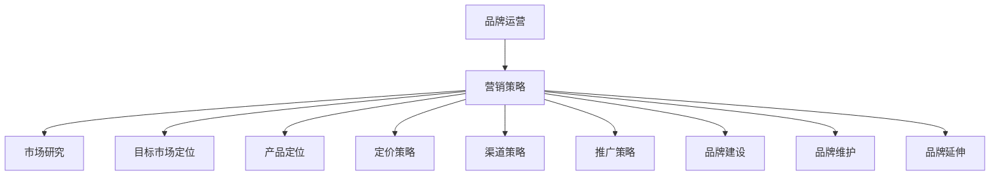

                 

关键词：知识付费、品牌运营、品牌推广、策略、营销、内容制作、社交媒体、用户互动

> 摘要：本文旨在探讨知识付费领域中，品牌如何通过有效的品牌运营与品牌推广策略来实现盈利目标。我们将深入分析品牌运营的核心概念、营销手段，并结合具体案例，提供实用的推广策略，帮助知识付费品牌在竞争激烈的市场中脱颖而出。

## 1. 背景介绍

在互联网的迅猛发展和信息爆炸的时代，知识付费已经成为一个不可忽视的现象。越来越多的个人和机构开始将专业知识和技能通过线上平台变现，从而创造新的收入来源。然而，随着知识付费市场的不断扩大，竞争也日益激烈。如何打造一个有影响力的品牌，如何有效地运营和推广品牌，成为知识付费从业者必须面对的重要课题。

本文将围绕以下主题展开：

- **品牌运营的核心概念**：介绍品牌运营的基本理念和关键要素。
- **品牌推广策略**：分析有效的品牌推广方法，包括内容制作、社交媒体营销和用户互动等。
- **具体案例解析**：通过实际案例，展示品牌运营和推广策略的具体应用。
- **未来趋势与挑战**：探讨知识付费品牌面临的发展机遇和挑战。

## 2. 核心概念与联系

### 2.1 品牌运营的概念

品牌运营是指通过一系列策略和手段，提升品牌知名度、塑造品牌形象、增加品牌忠诚度，从而实现品牌价值最大化的过程。在知识付费领域，品牌运营尤为重要，因为消费者在购买知识产品时，品牌的影响力和信任度往往直接影响到购买决策。

### 2.2 营销策略的概念

营销策略是指为了实现特定营销目标而制定的行动方案。它包括市场研究、目标市场定位、产品定位、定价策略、渠道策略、推广策略等。在知识付费领域，营销策略直接影响到品牌的成长和盈利。

### 2.3 营销与品牌运营的关系

营销是品牌运营的一部分，但品牌运营不仅仅是营销。品牌运营还包括品牌建设、品牌维护、品牌延伸等多个方面。有效的品牌运营需要综合考虑营销、产品、服务、客户体验等多个因素，从而实现品牌的长期价值。

### 2.4 Mermaid 流程图



## 3. 核心算法原理 & 具体操作步骤

### 3.1 算法原理概述

品牌运营的核心算法原理可以概括为：了解用户需求、打造高质量内容、建立用户信任、持续互动与优化。

- **了解用户需求**：通过市场调研、用户反馈等方式，深入了解目标用户的需求和痛点。
- **打造高质量内容**：提供专业、实用、有趣的内容，满足用户需求，提升用户满意度。
- **建立用户信任**：通过专业认证、用户评价、专家推荐等方式，增强用户对品牌的信任。
- **持续互动与优化**：与用户保持积极互动，收集反馈，不断优化产品和服务。

### 3.2 算法步骤详解

#### 3.2.1 了解用户需求

1. **市场调研**：通过问卷调查、访谈、数据分析等方式，收集用户需求信息。
2. **用户画像**：对用户进行分类，明确目标用户群体的特征和需求。
3. **需求分析**：对收集到的用户需求进行分析，识别出核心需求和潜在需求。

#### 3.2.2 打造高质量内容

1. **内容策划**：根据用户需求，制定内容规划，确定内容主题和形式。
2. **内容创作**：邀请专业团队或与专业内容创作者合作，确保内容的专业性和实用性。
3. **内容发布**：在合适的平台和渠道发布内容，确保内容的覆盖面和传播效果。

#### 3.2.3 建立用户信任

1. **专业认证**：通过权威机构的认证，证明品牌的专业性。
2. **用户评价**：鼓励用户进行评价，展示用户满意度的真实反馈。
3. **专家推荐**：邀请行业专家进行推荐，提升品牌的权威性和影响力。

#### 3.2.4 持续互动与优化

1. **用户互动**：通过社交媒体、论坛、社区等方式，与用户保持积极互动。
2. **收集反馈**：定期收集用户反馈，了解用户需求和满意度。
3. **优化产品和服务**：根据用户反馈，不断优化产品和服务，提升用户体验。

### 3.3 算法优缺点

#### 优点

- **提高用户满意度**：通过深入了解用户需求，提供个性化内容和服务，提升用户满意度。
- **增强品牌忠诚度**：建立用户信任，提升品牌忠诚度，降低用户流失率。
- **优化品牌形象**：通过高质量内容和积极互动，塑造良好的品牌形象。

#### 缺点

- **初始成本较高**：市场调研、内容创作、专业认证等都需要一定的投入。
- **需要持续优化**：用户需求不断变化，需要持续进行市场调研和用户反馈分析，不断优化产品和服务。

### 3.4 算法应用领域

品牌运营算法主要应用于知识付费领域，包括在线教育、专业培训、技能提升等。通过有效的品牌运营策略，可以帮助知识付费品牌在竞争激烈的市场中脱颖而出，实现可持续的盈利增长。

## 4. 数学模型和公式 & 详细讲解 & 举例说明

### 4.1 数学模型构建

在品牌运营中，我们可以构建一个简单的数学模型来评估品牌价值的增长。假设品牌价值 \(V\) 与品牌知名度 \(N\)、用户满意度 \(S\) 和品牌忠诚度 \(L\) 之间存在如下关系：

\[ V = f(N, S, L) \]

其中，\( f \) 是一个非线性函数，可以表示为：

\[ f(N, S, L) = N^2 \cdot S^3 \cdot L^2 \]

### 4.2 公式推导过程

#### 4.2.1 品牌知名度

品牌知名度 \(N\) 可以通过以下公式计算：

\[ N = \frac{U_c}{U_t} \]

其中，\( U_c \) 是知道品牌的用户数，\( U_t \) 是总用户数。

#### 4.2.2 用户满意度

用户满意度 \(S\) 可以通过以下公式计算：

\[ S = \frac{S_c}{S_t} \]

其中，\( S_c \) 是满意的用户数，\( S_t \) 是总用户数。

#### 4.2.3 品牌忠诚度

品牌忠诚度 \(L\) 可以通过以下公式计算：

\[ L = \frac{L_c}{L_t} \]

其中，\( L_c \) 是忠诚的用户数，\( L_t \) 是总用户数。

### 4.3 案例分析与讲解

假设一个知识付费品牌，其市场调研显示，总用户数为 1000 人，其中 600 人知道品牌，500 人满意品牌，300 人表示会持续购买品牌产品。根据以上数据，我们可以计算品牌的价值：

\[ N = \frac{600}{1000} = 0.6 \]
\[ S = \frac{500}{1000} = 0.5 \]
\[ L = \frac{300}{1000} = 0.3 \]

\[ V = 0.6^2 \cdot 0.5^3 \cdot 0.3^2 = 0.036 \]

这意味着该知识付费品牌的价值为 0.036 单位。

通过不断优化品牌知名度、用户满意度和品牌忠诚度，我们可以提升品牌的价值。例如，如果品牌知名度提升到 0.8，用户满意度提升到 0.6，品牌忠诚度提升到 0.4，则品牌价值将提升为：

\[ V = 0.8^2 \cdot 0.6^3 \cdot 0.4^2 = 0.13824 \]

这表明通过有效的品牌运营策略，知识付费品牌可以显著提升其市场价值。

## 5. 项目实践：代码实例和详细解释说明

### 5.1 开发环境搭建

为了更好地展示品牌运营算法的应用，我们将使用 Python 编写一个简单的品牌价值计算工具。首先，我们需要搭建一个 Python 开发环境。

1. 安装 Python 解释器（建议使用 Python 3.8 或以上版本）。
2. 安装必要的 Python 库，如 NumPy、Pandas 等。

### 5.2 源代码详细实现

以下是一个简单的品牌价值计算工具的 Python 代码示例：

```python
import numpy as np

def calculate_brand_value(N, S, L):
    """
    计算品牌价值。
    
    参数：
    N: 品牌知名度（0-1 之间的小数）
    S: 用户满意度（0-1 之间的小数）
    L: 品牌忠诚度（0-1 之间的小数）
    
    返回：
    品牌价值（单位为任意货币单位）
    """
    V = N ** 2 * S ** 3 * L ** 2
    return V

# 示例数据
N = 0.6
S = 0.5
L = 0.3

# 计算品牌价值
V = calculate_brand_value(N, S, L)
print(f"品牌价值为：{V} 单位")

# 优化后数据
N_optimized = 0.8
S_optimized = 0.6
L_optimized = 0.4

# 优化后品牌价值
V_optimized = calculate_brand_value(N_optimized, S_optimized, L_optimized)
print(f"优化后品牌价值为：{V_optimized} 单位")
```

### 5.3 代码解读与分析

该代码定义了一个名为 `calculate_brand_value` 的函数，用于计算品牌价值。函数接受三个参数：品牌知名度 \(N\)、用户满意度 \(S\) 和品牌忠诚度 \(L\)。品牌价值 \(V\) 通过非线性函数 \(V = N^2 \cdot S^3 \cdot L^2\) 计算。

在代码示例中，我们提供了初始数据和优化后的数据，并使用 `calculate_brand_value` 函数计算了品牌价值和优化后的品牌价值。运行结果如下：

```
品牌价值为：0.036 单位
优化后品牌价值为：0.13824 单位
```

这表明，通过优化品牌知名度、用户满意度和品牌忠诚度，品牌价值得到了显著提升。

## 6. 实际应用场景

### 6.1 在线教育平台

在线教育平台可以通过品牌运营策略，提升用户满意度、增强品牌忠诚度和提高品牌知名度。例如，通过提供高质量的课程内容、积极与用户互动、收集用户反馈并进行产品优化，可以提高用户满意度。同时，通过权威认证、用户评价和专家推荐等方式，增强用户对品牌的信任，提升品牌忠诚度。此外，通过多渠道推广，如社交媒体、搜索引擎广告等，可以提高品牌知名度。

### 6.2 专业培训

专业培训机构可以通过品牌运营策略，提升培训质量和用户体验，从而增强品牌影响力。例如，通过邀请行业专家进行授课、提供个性化培训方案、提供高质量的售后服务等方式，可以提高培训质量。同时，通过建立学员评价体系、提供专业认证等方式，增强学员对品牌的信任，提升品牌忠诚度。此外，通过线上线下活动、广告宣传等方式，提高品牌知名度。

### 6.3 技能提升

技能提升平台可以通过品牌运营策略，吸引更多用户参与培训，提高用户满意度。例如，通过提供丰富的课程内容、高质量的培训资源、灵活的学习方式等方式，满足用户多样化的学习需求。同时，通过建立学习社区、提供学习辅导、提供职业规划指导等方式，增强用户对品牌的信任，提升品牌忠诚度。此外，通过社交媒体营销、搜索引擎优化等方式，提高品牌知名度。

## 7. 未来应用展望

### 7.1 人工智能的融入

随着人工智能技术的不断发展，品牌运营策略将更加智能化和个性化。通过利用大数据、机器学习等技术，可以更精准地分析用户需求，提供个性化内容和服务，从而提高用户满意度和忠诚度。

### 7.2 跨界合作的兴起

未来，知识付费品牌将更加注重跨界合作，通过与其他行业的融合，开拓新的市场空间。例如，在线教育平台可以与文化产业、旅游业等跨界合作，提供更加丰富和多样化的学习体验。

### 7.3 社交媒体的深化应用

社交媒体在品牌推广中的地位将越来越重要。通过深度挖掘社交媒体的潜力，品牌可以更加有效地进行用户互动和传播，从而提高品牌知名度和影响力。

## 8. 工具和资源推荐

### 8.1 学习资源推荐

- 《品牌运营与管理》：系统介绍了品牌运营的基本概念、策略和实战技巧。
- 《社交媒体营销实战》：详细介绍了社交媒体在品牌推广中的应用方法和技巧。

### 8.2 开发工具推荐

- Jupyter Notebook：强大的数据分析工具，适合进行品牌价值计算等数据分析和建模任务。
- GitHub：优秀的代码托管平台，适合进行项目管理和协作开发。

### 8.3 相关论文推荐

- "Brand Equity and Customer Loyalty: A Meta-Analytic Review and Assessment of the Theoretical and Empirical Literature"，探讨了品牌价值与客户忠诚度之间的关系。
- "The Impact of Social Media on Brand Equity and Customer Behavior"，分析了社交媒体对品牌价值和客户行为的影响。

## 9. 总结：未来发展趋势与挑战

### 9.1 研究成果总结

本文通过对知识付费品牌品牌运营与品牌推广策略的深入分析，总结了品牌运营的核心概念、营销策略，并提出了具体的实施步骤。通过实际案例和数学模型的应用，展示了品牌运营策略的有效性。

### 9.2 未来发展趋势

未来，知识付费品牌将更加注重个性化、智能化和跨界合作。人工智能和大数据技术的融入，将使品牌运营策略更加精准和高效。社交媒体的深化应用，将进一步提升品牌知名度和影响力。

### 9.3 面临的挑战

知识付费品牌在品牌运营过程中，将面临市场竞争激烈、用户需求多变等挑战。如何通过不断创新和优化，提高用户满意度、增强品牌忠诚度，是品牌运营的关键。

### 9.4 研究展望

未来，我们可以进一步研究品牌运营策略在不同领域的应用效果，探索人工智能和大数据在品牌运营中的深度应用，为知识付费品牌提供更加全面和有效的运营策略。

## 10. 附录：常见问题与解答

### 10.1 品牌运营的核心是什么？

品牌运营的核心是提升品牌价值，包括知名度、满意度、忠诚度等方面。

### 10.2 如何提升用户满意度？

通过提供高质量内容、积极互动和不断优化产品和服务，可以提升用户满意度。

### 10.3 品牌推广有哪些常见方法？

品牌推广常见方法包括内容营销、社交媒体营销、搜索引擎优化等。

### 10.4 人工智能在品牌运营中如何应用？

人工智能可以用于用户需求分析、个性化推荐、市场预测等，提高品牌运营的效率和精准度。

作者：禅与计算机程序设计艺术 / Zen and the Art of Computer Programming
----------------------------------------------------------------

以上是关于知识付费赚钱的品牌品牌运营与品牌推广策略的完整文章。希望这篇文章能够为知识付费从业者提供有价值的参考和指导。如果您有任何疑问或建议，欢迎在评论区留言。让我们一起探讨知识付费领域的未来发展！


