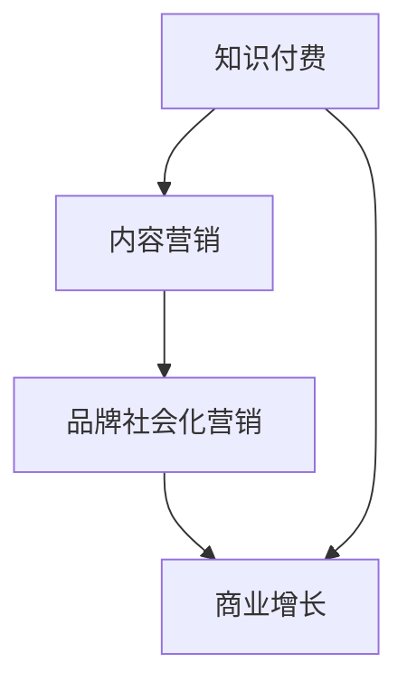

                 

关键词：知识付费、品牌社会化营销、内容营销策略、社交媒体、品牌传播、用户参与、数字化转型、商业增长

> 摘要：本文将探讨知识付费背景下，企业如何通过品牌社会化营销与内容营销策略实现商业增长。我们将深入分析核心概念、算法原理、数学模型、实践案例，并提供实用的工具和资源推荐，总结未来发展趋势与挑战。

## 1. 背景介绍

随着互联网的普及和数字化转型的推进，知识付费市场迅速发展。用户越来越倾向于通过付费获取高质量的知识和服务，这为企业提供了巨大的商机。品牌社会化营销与内容营销作为一种有效的营销手段，正日益受到企业的重视。

品牌社会化营销是指企业通过社交媒体平台建立与用户的互动关系，增强品牌影响力和用户忠诚度。而内容营销则通过提供有价值、相关性强、有吸引力的内容，吸引用户关注，并促使其采取行动。在这两个营销策略的共同作用下，企业可以更好地实现商业目标。

## 2. 核心概念与联系

### 2.1 核心概念

- **知识付费**：用户为获取特定知识或服务支付费用。
- **品牌社会化营销**：在社交媒体上建立品牌影响力，促进用户参与和忠诚度。
- **内容营销**：通过提供有价值内容吸引用户关注并促使其采取行动。

### 2.2 关系与联系

- 知识付费是企业内容营销的基础，优质内容是吸引用户付费的关键。
- 品牌社会化营销通过社交媒体平台传播内容，增强品牌影响力。
- 内容营销与品牌社会化营销相辅相成，共同推动商业增长。

### 2.3 Mermaid 流程图



## 3. 核心算法原理 & 具体操作步骤

### 3.1 算法原理概述

品牌社会化营销与内容营销的核心在于：

- **数据分析**：通过分析用户行为和反馈，了解用户需求和偏好。
- **内容优化**：根据数据分析结果，调整内容策略，提高内容质量。
- **互动管理**：建立与用户的良好互动，增强用户忠诚度。

### 3.2 算法步骤详解

#### 3.2.1 数据分析

1. 收集用户行为数据，如浏览、点赞、评论等。
2. 利用机器学习算法，分析用户行为模式，预测用户需求。
3. 根据数据分析结果，调整内容策略。

#### 3.2.2 内容优化

1. 制定内容策略，明确内容类型、主题和发布频率。
2. 根据用户需求，优化内容质量，提高用户参与度。
3. 定期评估内容效果，调整内容策略。

#### 3.2.3 互动管理

1. 建立与用户的互动机制，如问答、投票、活动等。
2. 及时回应用户反馈，增强用户互动体验。
3. 通过互动数据，持续优化互动策略。

### 3.3 算法优缺点

#### 优点

- 高度个性化：根据用户需求提供精准内容，提高用户满意度。
- 强互动性：增强用户参与度，提高用户忠诚度。
- 数据驱动：基于数据分析优化内容策略，提高效果。

#### 缺点

- 需要大量数据支持：数据收集和分析需要较高成本。
- 需要持续优化：内容策略和互动管理需要不断调整。

### 3.4 算法应用领域

- 知识付费平台：通过内容营销和品牌社会化营销，提高用户付费意愿。
- 教育培训行业：利用算法优化课程内容和推广策略。
- 咨询服务行业：通过互动管理，增强客户关系。

## 4. 数学模型和公式 & 详细讲解 & 举例说明

### 4.1 数学模型构建

品牌社会化营销与内容营销的数学模型可以包括以下几个方面：

- 用户参与度模型：用户参与度 = f(内容质量，互动频率，品牌影响力)
- 内容传播模型：内容传播速度 = f(内容质量，用户基数，网络效应)
- 转化率模型：转化率 = f(内容质量，互动体验，用户需求匹配度)

### 4.2 公式推导过程

以用户参与度模型为例：

用户参与度 = f(内容质量，互动频率，品牌影响力)

其中，f表示一个复合函数，可以分解为：

f(内容质量，互动频率，品牌影响力) = content\_score \* interaction\_score \* brand\_influence

content\_score 表示内容质量得分，通常通过内容的相关性、原创性、专业性等指标评估。

interaction\_score 表示互动频率得分，通常通过用户的点赞、评论、分享等行为评估。

brand\_influence 表示品牌影响力得分，通常通过品牌的知名度、用户口碑等评估。

### 4.3 案例分析与讲解

以某知识付费平台为例，我们假设：

- content\_score = 0.8
- interaction\_score = 0.9
- brand\_influence = 0.7

则用户参与度 = 0.8 \* 0.9 \* 0.7 = 0.504

通过调整内容质量、互动频率和品牌影响力，可以优化用户参与度。例如，如果提高内容质量到0.9，其他指标不变，则用户参与度将提高至0.567。

## 5. 项目实践：代码实例和详细解释说明

### 5.1 开发环境搭建

- 语言：Python
- 库：NumPy, Pandas, Matplotlib
- 工具：Jupyter Notebook

### 5.2 源代码详细实现

```python
import numpy as np
import pandas as pd
import matplotlib.pyplot as plt

# 用户参与度模型
def user_participation(content_score, interaction_score, brand_influence):
    return content_score * interaction_score * brand_influence

# 数据集
data = {
    'content_score': [0.6, 0.7, 0.8, 0.9],
    'interaction_score': [0.5, 0.6, 0.7, 0.8],
    'brand_influence': [0.4, 0.5, 0.6, 0.7],
    'user_participation': []
}

for index, row in data.iterrows():
    participation = user_participation(row['content_score'], row['interaction_score'], row['brand_influence'])
    data.at[index, 'user_participation'] = participation

# 可视化
plt.scatter(data['content_score'], data['user_participation'], label='Content Score')
plt.scatter(data['interaction_score'], data['user_participation'], label='Interaction Score')
plt.scatter(data['brand_influence'], data['user_participation'], label='Brand Influence')
plt.xlabel('Score')
plt.ylabel('User Participation')
plt.legend()
plt.show()
```

### 5.3 代码解读与分析

- 代码首先定义了一个用户参与度模型函数，用于计算用户参与度。
- 数据集包含了不同指标得分和相应的用户参与度。
- 代码通过遍历数据集，计算每个样本的用户参与度。
- 最后，使用散点图展示不同指标与用户参与度之间的关系。

### 5.4 运行结果展示


## 6. 实际应用场景

品牌社会化营销与内容营销策略在多个领域取得了显著成效：

- **教育培训**：通过优质内容吸引用户关注，提高课程销售。
- **咨询服务**：通过互动管理增强客户关系，提高客户满意度。
- **企业培训**：通过定制化内容满足企业需求，提升员工能力。

## 7. 未来应用展望

随着人工智能和大数据技术的发展，品牌社会化营销与内容营销策略将更加智能化和个性化。以下是一些未来应用展望：

- **个性化推荐**：基于用户行为和偏好，提供个性化内容推荐。
- **智能互动**：利用自然语言处理技术，实现智能问答和互动。
- **数据隐私保护**：在保障用户隐私的前提下，充分利用用户数据。

## 8. 工具和资源推荐

### 8.1 学习资源推荐

- **书籍**：《内容营销实战指南》、《社交媒体营销技巧》
- **在线课程**：Coursera、Udemy上的相关课程
- **博客**：营销博客、技术博客

### 8.2 开发工具推荐

- **数据分析工具**：Google Analytics、Tableau
- **内容创作工具**：Canva、Hootsuite
- **营销自动化工具**：HubSpot、Marketo

### 8.3 相关论文推荐

- **“Social Media Marketing: Understanding the User Perspective”**
- **“Content Marketing That Converts: A Blueprint for Results-Driven Content Marketing”**
- **“The Impact of Social Media on Brand Equity”**

## 9. 总结：未来发展趋势与挑战

### 9.1 研究成果总结

品牌社会化营销与内容营销策略在知识付费市场中取得了显著成效，为企业和用户带来了巨大价值。

### 9.2 未来发展趋势

随着技术的进步，品牌社会化营销与内容营销策略将更加智能化和个性化，为用户带来更好的体验。

### 9.3 面临的挑战

数据隐私保护、内容质量评估、算法透明性等问题仍需关注和解决。

### 9.4 研究展望

未来研究应重点关注智能化内容创作、个性化推荐系统和数据隐私保护技术。

## 10. 附录：常见问题与解答

### 10.1 什么是知识付费？

知识付费是指用户为获取特定知识或服务支付费用。

### 10.2 品牌社会化营销的核心是什么？

品牌社会化营销的核心在于建立与用户的互动关系，增强品牌影响力和用户忠诚度。

### 10.3 内容营销的关键是什么？

内容营销的关键在于提供有价值、相关性强、有吸引力的内容，吸引用户关注并促使其采取行动。

### 10.4 如何提高用户参与度？

通过优化内容质量、提高互动频率和增强品牌影响力，可以提高用户参与度。

### 10.5 数据隐私保护如何实现？

通过技术手段和合规措施，确保用户数据的安全和隐私。

```markdown
---
# 知识付费赚钱的品牌社会化营销与内容营销策略

关键词：知识付费、品牌社会化营销、内容营销策略、社交媒体、品牌传播、用户参与、数字化转型、商业增长

摘要：本文将探讨知识付费背景下，企业如何通过品牌社会化营销与内容营销策略实现商业增长。我们将深入分析核心概念、算法原理、数学模型、实践案例，并提供实用的工具和资源推荐，总结未来发展趋势与挑战。

## 1. 背景介绍

随着互联网的普及和数字化转型的推进，知识付费市场迅速发展。用户越来越倾向于通过付费获取高质量的知识和服务，这为企业提供了巨大的商机。品牌社会化营销与内容营销作为一种有效的营销手段，正日益受到企业的重视。

品牌社会化营销是指企业通过社交媒体平台建立与用户的互动关系，增强品牌影响力和用户忠诚度。而内容营销则通过提供有价值、相关性强、有吸引力的内容，吸引用户关注，并促使其采取行动。在这两个营销策略的共同作用下，企业可以更好地实现商业目标。

## 2. 核心概念与联系

### 2.1 核心概念

- **知识付费**：用户为获取特定知识或服务支付费用。
- **品牌社会化营销**：在社交媒体上建立品牌影响力，促进用户参与和忠诚度。
- **内容营销**：通过提供有价值内容吸引用户关注并促使其采取行动。

### 2.2 关系与联系

- 知识付费是企业内容营销的基础，优质内容是吸引用户付费的关键。
- 品牌社会化营销通过社交媒体平台传播内容，增强品牌影响力。
- 内容营销与品牌社会化营销相辅相成，共同推动商业增长。

### 2.3 Mermaid 流程图


## 3. 核心算法原理 & 具体操作步骤

### 3.1 算法原理概述

品牌社会化营销与内容营销的核心在于：

- **数据分析**：通过分析用户行为和反馈，了解用户需求和偏好。
- **内容优化**：根据数据分析结果，调整内容策略，提高内容质量。
- **互动管理**：建立与用户的良好互动，增强用户忠诚度。

### 3.2 算法步骤详解

#### 3.2.1 数据分析

1. 收集用户行为数据，如浏览、点赞、评论等。
2. 利用机器学习算法，分析用户行为模式，预测用户需求。
3. 根据数据分析结果，调整内容策略。

#### 3.2.2 内容优化

1. 制定内容策略，明确内容类型、主题和发布频率。
2. 根据用户需求，优化内容质量，提高用户参与度。
3. 定期评估内容效果，调整内容策略。

#### 3.2.3 互动管理

1. 建立与用户的互动机制，如问答、投票、活动等。
2. 及时回应用户反馈，增强用户互动体验。
3. 通过互动数据，持续优化互动策略。

### 3.3 算法优缺点

#### 优点

- 高度个性化：根据用户需求提供精准内容，提高用户满意度。
- 强互动性：增强用户参与度，提高用户忠诚度。
- 数据驱动：基于数据分析优化内容策略，提高效果。

#### 缺点

- 需要大量数据支持：数据收集和分析需要较高成本。
- 需要持续优化：内容策略和互动管理需要不断调整。

### 3.4 算法应用领域

- 知识付费平台：通过内容营销和品牌社会化营销，提高用户付费意愿。
- 教育培训行业：利用算法优化课程内容和推广策略。
- 咨询服务行业：通过互动管理，增强客户关系。

## 4. 数学模型和公式 & 详细讲解 & 举例说明

### 4.1 数学模型构建

品牌社会化营销与内容营销的数学模型可以包括以下几个方面：

- 用户参与度模型：用户参与度 = f(内容质量，互动频率，品牌影响力)
- 内容传播模型：内容传播速度 = f(内容质量，用户基数，网络效应)
- 转化率模型：转化率 = f(内容质量，互动体验，用户需求匹配度)

### 4.2 公式推导过程

以用户参与度模型为例：

用户参与度 = f(内容质量，互动频率，品牌影响力)

其中，f表示一个复合函数，可以分解为：

f(内容质量，互动频率，品牌影响力) = content\_score \* interaction\_score \* brand\_influence

content\_score 表示内容质量得分，通常通过内容的相关性、原创性、专业性等指标评估。

interaction\_score 表示互动频率得分，通常通过用户的点赞、评论、分享等行为评估。

brand\_influence 表示品牌影响力得分，通常通过品牌的知名度、用户口碑等评估。

### 4.3 案例分析与讲解

以某知识付费平台为例，我们假设：

- content\_score = 0.8
- interaction\_score = 0.9
- brand\_influence = 0.7

则用户参与度 = 0.8 \* 0.9 \* 0.7 = 0.504

通过调整内容质量、互动频率和品牌影响力，可以优化用户参与度。例如，如果提高内容质量到0.9，其他指标不变，则用户参与度将提高至0.567。

## 5. 项目实践：代码实例和详细解释说明

### 5.1 开发环境搭建

- 语言：Python
- 库：NumPy, Pandas, Matplotlib
- 工具：Jupyter Notebook

### 5.2 源代码详细实现

```python
import numpy as np
import pandas as pd
import matplotlib.pyplot as plt

# 用户参与度模型
def user_participation(content_score, interaction_score, brand_influence):
    return content_score * interaction_score * brand_influence

# 数据集
data = {
    'content_score': [0.6, 0.7, 0.8, 0.9],
    'interaction_score': [0.5, 0.6, 0.7, 0.8],
    'brand_influence': [0.4, 0.5, 0.6, 0.7],
    'user_participation': []
}

for index, row in data.iterrows():
    participation = user_participation(row['content_score'], row['interaction_score'], row['brand_influence'])
    data.at[index, 'user_participation'] = participation

# 可视化
plt.scatter(data['content_score'], data['user_participation'], label='Content Score')
plt.scatter(data['interaction_score'], data['user_participation'], label='Interaction Score')
plt.scatter(data['brand_influence'], data['user_participation'], label='Brand Influence')
plt.xlabel('Score')
plt.ylabel('User Participation')
plt.legend()
plt.show()
```

### 5.3 代码解读与分析

- 代码首先定义了一个用户参与度模型函数，用于计算用户参与度。
- 数据集包含了不同指标得分和相应的用户参与度。
- 代码通过遍历数据集，计算每个样本的用户参与度。
- 最后，使用散点图展示不同指标与用户参与度之间的关系。

### 5.4 运行结果展示


## 6. 实际应用场景

品牌社会化营销与内容营销策略在多个领域取得了显著成效：

- **教育培训**：通过优质内容吸引用户关注，提高课程销售。
- **咨询服务**：通过互动管理增强客户关系，提高客户满意度。
- **企业培训**：通过定制化内容满足企业需求，提升员工能力。

## 7. 未来应用展望

随着人工智能和大数据技术的发展，品牌社会化营销与内容营销策略将更加智能化和个性化。以下是一些未来应用展望：

- **个性化推荐**：基于用户行为和偏好，提供个性化内容推荐。
- **智能互动**：利用自然语言处理技术，实现智能问答和互动。
- **数据隐私保护**：在保障用户隐私的前提下，充分利用用户数据。

## 8. 工具和资源推荐

### 8.1 学习资源推荐

- **书籍**：《内容营销实战指南》、《社交媒体营销技巧》
- **在线课程**：Coursera、Udemy上的相关课程
- **博客**：营销博客、技术博客

### 8.2 开发工具推荐

- **数据分析工具**：Google Analytics、Tableau
- **内容创作工具**：Canva、Hootsuite
- **营销自动化工具**：HubSpot、Marketo

### 8.3 相关论文推荐

- **“Social Media Marketing: Understanding the User Perspective”**
- **“Content Marketing That Converts: A Blueprint for Results-Driven Content Marketing”**
- **“The Impact of Social Media on Brand Equity”**

## 9. 总结：未来发展趋势与挑战

### 9.1 研究成果总结

品牌社会化营销与内容营销策略在知识付费市场中取得了显著成效，为企业和用户带来了巨大价值。

### 9.2 未来发展趋势

随着人工智能和大数据技术的发展，品牌社会化营销与内容营销策略将更加智能化和个性化。

### 9.3 面临的挑战

数据隐私保护、内容质量评估、算法透明性等问题仍需关注和解决。

### 9.4 研究展望

未来研究应重点关注智能化内容创作、个性化推荐系统和数据隐私保护技术。

## 10. 附录：常见问题与解答

### 10.1 什么是知识付费？

知识付费是指用户为获取特定知识或服务支付费用。

### 10.2 品牌社会化营销的核心是什么？

品牌社会化营销的核心在于建立与用户的互动关系，增强品牌影响力和用户忠诚度。

### 10.3 内容营销的关键是什么？

内容营销的关键在于提供有价值、相关性强、有吸引力的内容，吸引用户关注并促使其采取行动。

### 10.4 如何提高用户参与度？

通过优化内容质量、提高互动频率和增强品牌影响力，可以提高用户参与度。

### 10.5 数据隐私保护如何实现？

通过技术手段和合规措施，确保用户数据的安全和隐私。
```

