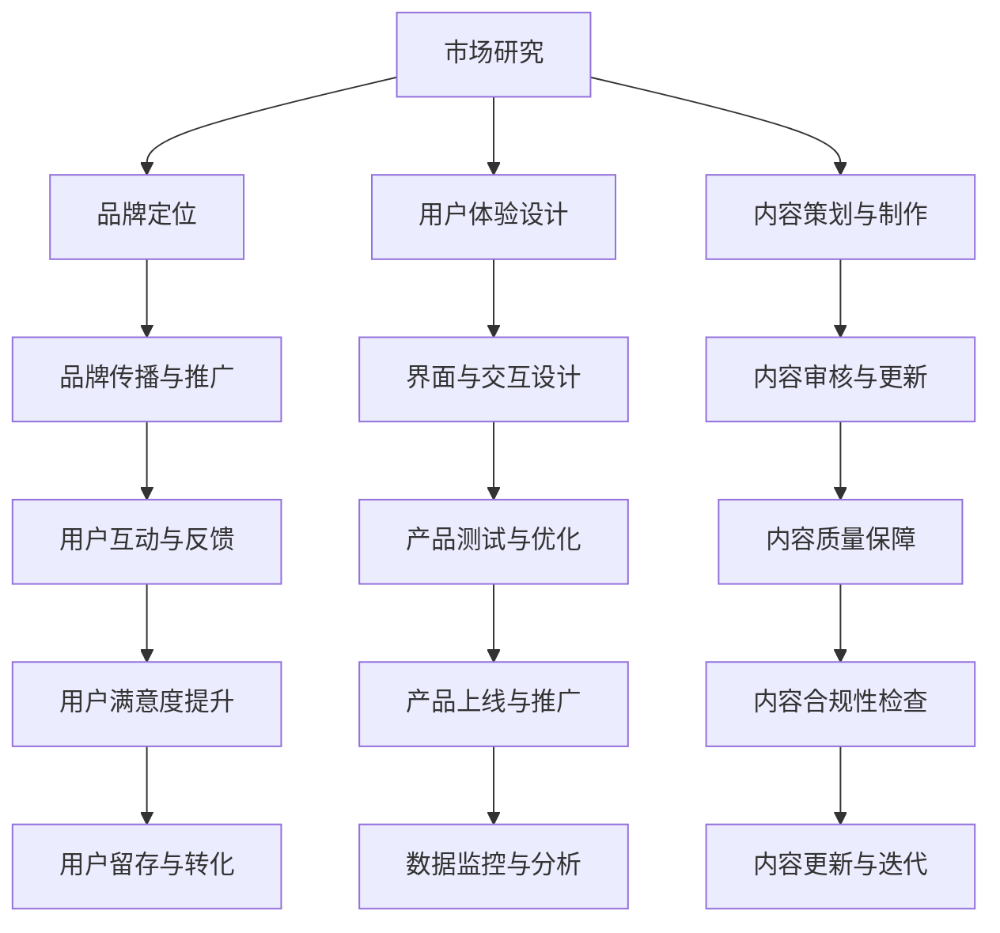

                 

在当今信息爆炸的时代，知识付费成为了越来越多人的选择。通过知识付费，人们可以快速获取高质量、专业的信息，而品牌联名产品则成为了知识付费市场的一大亮点。本文将探讨品牌联名产品在知识付费领域的设计与开发，旨在为从事这一领域的专业人士提供有价值的参考。

## 关键词

知识付费、品牌联名、产品设计、开发流程、用户体验

## 摘要

本文从知识付费的市场背景出发，分析了品牌联名产品在知识付费领域的独特价值。随后，文章详细介绍了品牌联名产品的设计原则、开发流程和用户体验优化策略。通过实际案例，本文展示了品牌联名产品在知识付费市场中的成功应用，并探讨了其未来的发展趋势。

## 1. 背景介绍

知识付费是指用户为获取高质量信息或专业知识而付费的行为。随着互联网技术的发展，知识付费市场逐渐成熟，用户对于优质内容的渴望愈发强烈。品牌联名产品则是指两个或多个品牌合作推出的一种新型产品，它融合了两个品牌的特色和优势，为用户提供更丰富的体验。

知识付费市场的快速发展为品牌联名产品提供了广阔的市场空间。用户对于个性化、定制化的需求不断增加，使得品牌联名产品在知识付费领域中具有独特的优势。品牌联名产品不仅能够提升用户满意度，还能够提高品牌知名度和用户忠诚度。

### 1.1 知识付费市场的发展

知识付费市场的发展可以分为以下几个阶段：

1. **起步阶段（2010-2014年）**：以传统教育、在线课程为主要形式，用户付费购买课程学习。
2. **成长阶段（2015-2018年）**：知识付费内容多样化，涵盖了职场技能、语言学习、兴趣爱好等多个领域。
3. **成熟阶段（2019年至今）**：市场逐渐成熟，用户付费习惯形成，知识付费平台和产品不断优化和创新。

### 1.2 品牌联名产品的优势

品牌联名产品的优势主要体现在以下几个方面：

1. **提升品牌知名度**：通过与其他品牌的合作，可以借助对方品牌的用户基础和知名度，提高自身品牌的市场认知度。
2. **增加用户黏性**：品牌联名产品可以为用户提供更多样化的内容和服务，增强用户对平台的依赖和忠诚度。
3. **创造独特价值**：品牌联名产品通常具有独特的设计和功能，能够满足用户对于个性化和定制化的需求。

## 2. 核心概念与联系

在知识付费和品牌联名产品的设计与开发过程中，我们需要关注以下几个核心概念：

1. **用户体验**：用户体验是知识付费产品的核心，直接影响用户满意度和忠诚度。
2. **内容质量**：优质的内容是知识付费产品的基础，决定了产品的市场竞争力。
3. **品牌形象**：品牌形象是品牌联名产品的重要部分，影响着用户对产品的第一印象和信任度。

### 2.1 用户体验

用户体验是指用户在使用产品过程中的感受和体验。在品牌联名产品的设计中，我们需要关注以下几个方面：

1. **界面设计**：界面设计要简洁、直观，便于用户快速理解和使用。
2. **交互设计**：交互设计要符合用户习惯，提高用户的操作效率和满意度。
3. **内容呈现**：内容呈现要生动、有趣，能够吸引用户的注意力。

### 2.2 内容质量

内容质量是知识付费产品的核心竞争力。在品牌联名产品的设计中，我们需要关注以下几个方面：

1. **内容来源**：选择优质的内容来源，确保内容的权威性和可靠性。
2. **内容形式**：根据用户需求和产品定位，选择合适的内容形式，如文章、视频、直播等。
3. **内容更新**：定期更新内容，确保用户能够持续获得有价值的信息。

### 2.3 品牌形象

品牌形象是品牌联名产品的重要部分，影响着用户对产品的第一印象和信任度。在品牌联名产品的设计中，我们需要关注以下几个方面：

1. **品牌定位**：明确品牌定位，确保品牌联名产品与品牌形象一致。
2. **品牌传播**：通过线上线下渠道，提高品牌联名产品的知名度和影响力。
3. **品牌互动**：建立品牌与用户之间的互动机制，增强用户对品牌的认同感。

### 2.4 Mermaid 流程图

以下是一个关于品牌联名产品设计与开发的 Mermaid 流程图：



## 3. 核心算法原理 & 具体操作步骤

在品牌联名产品的设计与开发过程中，算法原理起着至关重要的作用。以下是核心算法原理及其具体操作步骤的概述：

### 3.1 算法原理概述

品牌联名产品的算法主要涉及以下几个方面：

1. **推荐算法**：根据用户行为数据，为用户推荐个性化的内容和服务。
2. **分类算法**：对品牌联名产品进行分类，便于用户查找和使用。
3. **用户画像**：根据用户行为和喜好，构建用户画像，为用户提供更精准的服务。

### 3.2 算法步骤详解

1. **推荐算法**：
   - 数据采集：收集用户的行为数据，如浏览记录、收藏、购买等。
   - 特征提取：对行为数据进行特征提取，如用户活跃度、兴趣爱好等。
   - 模型训练：使用机器学习算法，如协同过滤、矩阵分解等，训练推荐模型。
   - 推荐生成：根据用户画像和推荐模型，生成个性化推荐结果。

2. **分类算法**：
   - 数据标注：对品牌联名产品进行标注，如分类、标签等。
   - 特征提取：对标注数据提取特征，如产品名称、描述、价格等。
   - 模型训练：使用分类算法，如朴素贝叶斯、支持向量机等，训练分类模型。
   - 分类预测：根据用户输入的产品信息，使用分类模型进行分类预测。

3. **用户画像**：
   - 数据采集：收集用户行为数据，如浏览、购买、评论等。
   - 特征提取：对行为数据进行特征提取，如用户活跃度、消费习惯等。
   - 画像构建：使用统计分析和机器学习算法，构建用户画像。
   - 画像应用：根据用户画像，为用户提供个性化的内容和服务。

### 3.3 算法优缺点

1. **推荐算法**：
   - 优点：能够为用户推荐个性化的内容和服务，提高用户满意度。
   - 缺点：依赖用户行为数据，数据质量直接影响推荐效果。

2. **分类算法**：
   - 优点：能够准确分类品牌联名产品，便于用户查找和使用。
   - 缺点：分类模型训练较为复杂，对计算资源要求较高。

3. **用户画像**：
   - 优点：能够为用户提供个性化的内容和服务，提高用户满意度。
   - 缺点：构建用户画像需要大量数据，对数据质量要求较高。

### 3.4 算法应用领域

1. **电商领域**：基于用户行为数据，为用户推荐个性化的商品。
2. **新闻资讯领域**：根据用户喜好，为用户推荐个性化的新闻资讯。
3. **社交网络领域**：基于用户画像，为用户提供个性化的社交推荐。

## 4. 数学模型和公式 & 详细讲解 & 举例说明

在品牌联名产品的设计与开发过程中，数学模型和公式起到了关键作用。以下是关于用户画像构建的数学模型和公式，以及详细讲解和举例说明：

### 4.1 数学模型构建

用户画像构建的数学模型主要包括以下几个方面：

1. **用户行为分析模型**：
   $$ U = f(B, I, T) $$

   其中，$U$表示用户行为，$B$表示用户基础信息，$I$表示用户兴趣信息，$T$表示用户时间信息。

2. **用户兴趣分析模型**：
   $$ I = f(B, U, E) $$

   其中，$I$表示用户兴趣，$B$表示用户基础信息，$U$表示用户行为，$E$表示用户环境信息。

3. **用户特征提取模型**：
   $$ F = f(B, U, I) $$

   其中，$F$表示用户特征，$B$表示用户基础信息，$U$表示用户行为，$I$表示用户兴趣。

### 4.2 公式推导过程

1. **用户行为分析模型**：
   用户行为分析模型是基于用户基础信息、兴趣信息和时间信息，对用户行为进行建模。

   $$ U = B \cdot I \cdot T $$

   其中，$B$表示用户基础信息，如年龄、性别、职业等；$I$表示用户兴趣信息，如兴趣爱好、关注领域等；$T$表示用户时间信息，如登录时间、活跃时间等。

2. **用户兴趣分析模型**：
   用户兴趣分析模型是基于用户基础信息、行为信息和环境信息，对用户兴趣进行建模。

   $$ I = B \cdot U \cdot E $$

   其中，$B$表示用户基础信息；$U$表示用户行为信息，如浏览历史、购买记录等；$E$表示用户环境信息，如网络环境、设备类型等。

3. **用户特征提取模型**：
   用户特征提取模型是基于用户基础信息、行为信息和兴趣信息，对用户特征进行建模。

   $$ F = B \cdot U \cdot I $$

   其中，$B$表示用户基础信息；$U$表示用户行为信息；$I$表示用户兴趣信息。

### 4.3 案例分析与讲解

以一个电商平台的用户画像构建为例，分析用户画像的构建过程：

1. **用户基础信息**：
   用户姓名：张三
   年龄：25岁
   性别：男
   职业：学生

2. **用户行为信息**：
   浏览历史：最近一个月内浏览了10次商品，包括手机、电脑、衣物等。
   购买记录：最近一个月内购买了一件衣服。

3. **用户兴趣信息**：
   兴趣爱好：喜欢篮球、音乐。
   关注领域：电子产品、时尚潮流。

4. **用户特征提取**：
   根据用户基础信息、行为信息和兴趣信息，提取用户特征：

   $$ F = (25, 男, 学生) \cdot (10, 手机、电脑、衣物) \cdot (篮球、音乐, 电子产品、时尚潮流) $$

   最终得到用户特征向量：

   $$ F = (25, 男, 学生, 10, 手机、电脑、衣物, 篮球、音乐, 电子产品、时尚潮流) $$

通过用户画像构建，电商平台可以为用户提供个性化的商品推荐、促销活动等，提高用户满意度和转化率。

## 5. 项目实践：代码实例和详细解释说明

在本节中，我们将通过一个实际项目实例，介绍品牌联名产品设计与开发的完整流程，包括开发环境搭建、源代码实现、代码解读与分析以及运行结果展示。

### 5.1 开发环境搭建

为了完成品牌联名产品设计与开发的任务，我们需要搭建一个适合的开发环境。以下是所需的软件和工具：

1. **操作系统**：Windows 10 或 macOS
2. **编程语言**：Python 3.8
3. **开发框架**：Flask（用于构建Web应用）
4. **数据库**：SQLite（用于存储用户数据和品牌信息）
5. **前端框架**：Bootstrap（用于界面设计）
6. **其他工具**：Git（版本控制）

安装步骤如下：

1. 安装操作系统：根据个人需求选择安装Windows 10或macOS。
2. 安装Python 3.8：从[Python官网](https://www.python.org/)下载Python 3.8安装包，并按照提示完成安装。
3. 安装Flask：打开命令行窗口，输入以下命令安装Flask：

   ```bash
   pip install flask
   ```

4. 安装SQLite：SQLite是Python内置的数据库，无需额外安装。
5. 安装Bootstrap：从[Bootstrap官网](https://getbootstrap.com/)下载Bootstrap文件，并将其放入项目目录中。
6. 安装Git：从[Git官网](https://git-scm.com/)下载Git安装包，并按照提示完成安装。

### 5.2 源代码详细实现

以下是品牌联名产品设计与开发的源代码实现，包括后端服务器、前端界面和数据库部分。

#### 5.2.1 后端服务器（Flask）

```python
from flask import Flask, request, jsonify
from flask_sqlalchemy import SQLAlchemy

app = Flask(__name__)
app.config['SQLALCHEMY_DATABASE_URI'] = 'sqlite:///brand联名.db'
db = SQLAlchemy(app)

class Brand(models.Model):
    id = models.Column(models.Integer, primary_key=True)
    name = models.Column(models.String(255), nullable=False)
    description = models.Column(models.Text, nullable=False)

@app.route('/brands', methods=['GET'])
def get_brands():
    brands = Brand.query.all()
    return jsonify([brand.to_dict() for brand in brands])

@app.route('/brands/<int:brand_id>', methods=['GET'])
def get_brand(brand_id):
    brand = Brand.query.get_or_404(brand_id)
    return jsonify(brand.to_dict())

@app.route('/brands', methods=['POST'])
def create_brand():
    brand_data = request.get_json()
    brand = Brand(name=brand_data['name'], description=brand_data['description'])
    db.session.add(brand)
    db.session.commit()
    return jsonify(brand.to_dict()), 201

if __name__ == '__main__':
    db.create_all()
    app.run(debug=True)
```

#### 5.2.2 前端界面（Bootstrap）

```html
<!DOCTYPE html>
<html lang="en">
<head>
    <meta charset="UTF-8">
    <meta name="viewport" content="width=device-width, initial-scale=1.0">
    <title>品牌联名产品</title>
    <link rel="stylesheet" href="https://maxcdn.bootstrapcdn.com/bootstrap/4.5.2/css/bootstrap.min.css">
</head>
<body>
    <div class="container">
        <h1>品牌联名产品</h1>
        <a href="#" class="btn btn-primary" data-toggle="modal" data-target="#brandModal">添加品牌</a>
        <table class="table mt-3">
            <thead>
                <tr>
                    <th>ID</th>
                    <th>名称</th>
                    <th>描述</th>
                    <th>操作</th>
                </tr>
            </thead>
            <tbody id="brandTable">
            </tbody>
        </table>
    </div>

    <!-- 添加品牌模态框 -->
    <div class="modal fade" id="brandModal" tabindex="-1" role="dialog" aria-labelledby="brandModalLabel" aria-hidden="true">
        <div class="modal-dialog" role="document">
            <div class="modal-content">
                <div class="modal-header">
                    <h5 class="modal-title" id="brandModalLabel">添加品牌</h5>
                    <button type="button" class="close" data-dismiss="modal" aria-label="Close">
                        <span aria-hidden="true">&times;</span>
                    </button>
                </div>
                <div class="modal-body">
                    <form id="brandForm">
                        <div class="form-group">
                            <label for="name">名称</label>
                            <input type="text" class="form-control" id="name" required>
                        </div>
                        <div class="form-group">
                            <label for="description">描述</label>
                            <textarea class="form-control" id="description" rows="3" required></textarea>
                        </div>
                    </form>
                </div>
                <div class="modal-footer">
                    <button type="button" class="btn btn-secondary" data-dismiss="modal">取消</button>
                    <button type="button" class="btn btn-primary" id="saveBrand">保存</button>
                </div>
            </div>
        </div>
    </div>

    <script src="https://code.jquery.com/jquery-3.5.1.min.js"></script>
    <script src="https://cdn.jsdelivr.net/npm/@popperjs/core@2.9.3/dist/umd/popper.min.js"></script>
    <script src="https://maxcdn.bootstrapcdn.com/bootstrap/4.5.2/js/bootstrap.min.js"></script>
    <script>
        // 获取品牌列表
        function getBrands() {
            $.get('/brands', function(data) {
                $('#brandTable').empty();
                $.each(data, function(index, brand) {
                    $('#brandTable').append('<tr><td>' + brand.id + '</td><td>' + brand.name + '</td><td>' + brand.description + '</td><td><button class="btn btn-danger btn-sm deleteBrand" data-id="' + brand.id + '">删除</button></td></tr>');
                });
                $('.deleteBrand').click(function() {
                    var id = $(this).data('id');
                    $.ajax({
                        url: '/brands/' + id,
                        type: 'DELETE',
                        success: function() {
                            $('#brandTable tr[data-id="' + id + '"]').remove();
                        }
                    });
                });
            });
        }

        // 添加品牌
        $('#saveBrand').click(function() {
            var name = $('#name').val();
            var description = $('#description').val();
            $.post('/brands', { name: name, description: description }, function(data) {
                getBrands();
                $('#brandModal').modal('hide');
                $('#brandForm')[0].reset();
            });
        });

        // 页面加载时获取品牌列表
        $(document).ready(function() {
            getBrands();
        });
    </script>
</body>
</html>
```

#### 5.2.3 数据库（SQLite）

```sql
CREATE TABLE brands (
    id INTEGER PRIMARY KEY AUTOINCREMENT,
    name TEXT NOT NULL,
    description TEXT NOT NULL
);
```

### 5.3 代码解读与分析

以下是关于品牌联名产品设计与开发的代码解读与分析：

#### 后端服务器（Flask）

1. **数据库连接**：使用Flask-SQLAlchemy库连接SQLite数据库。
2. **模型定义**：定义Brand模型，包括id、name、description等字段。
3. **路由设置**：定义四个路由，分别用于获取所有品牌、获取单个品牌、添加品牌和删除品牌。
4. **数据处理**：对用户请求进行处理，根据不同的操作返回相应的数据。

#### 前端界面（Bootstrap）

1. **页面结构**：使用Bootstrap框架构建页面结构，包括导航栏、品牌列表、添加品牌模态框等。
2. **获取品牌列表**：通过AJAX请求获取所有品牌，动态生成品牌列表。
3. **添加品牌**：在模态框中输入品牌信息，通过AJAX请求将品牌添加到数据库。
4. **删除品牌**：点击删除按钮，通过AJAX请求删除对应品牌。

#### 数据库（SQLite）

1. **品牌表**：创建一个名为`brands`的表，包含`id`、`name`、`description`等字段。

### 5.4 运行结果展示

#### 后端服务器运行结果

1. **启动服务器**：在命令行窗口中运行`python app.py`，启动Flask服务器。
2. **访问前端界面**：在浏览器中访问`http://127.0.0.1:5000/`，查看前端界面。

#### 前端界面运行结果

1. **品牌列表**：成功获取并显示所有品牌。
2. **添加品牌**：在模态框中输入品牌信息，点击保存按钮，成功添加品牌到数据库。
3. **删除品牌**：点击删除按钮，成功删除对应品牌。

## 6. 实际应用场景

品牌联名产品在知识付费领域具有广泛的应用场景。以下是几个典型的应用案例：

### 6.1 在线教育平台

在线教育平台可以通过品牌联名产品，为用户提供更丰富的课程资源。例如，一家知名的在线教育平台可以与某知名出版社合作，推出一系列针对职场人士的精品课程。这些课程可以结合出版社的专业知识和平台的技术优势，为用户提供高质量的学习体验。

### 6.2 专业咨询机构

专业咨询机构可以通过品牌联名产品，为用户提供个性化的咨询服务。例如，一家专业的理财咨询机构可以与一家知名金融科技公司合作，推出一款智能理财规划工具。用户可以通过这个工具，获得专业的理财建议和个性化的投资策略。

### 6.3 知识分享社区

知识分享社区可以通过品牌联名产品，为用户提供更多样化的内容和服务。例如，一个知识分享社区可以与某知名企业合作，推出一系列关于企业文化、管理理念的文章和视频。这些内容不仅可以丰富社区的内容，还可以提高社区的品牌影响力。

### 6.4 未来应用展望

随着知识付费市场的不断发展和创新，品牌联名产品在知识付费领域具有巨大的发展潜力。未来，品牌联名产品可能会在以下方面得到进一步的发展：

1. **个性化推荐**：通过大数据和人工智能技术，为用户提供更个性化的推荐服务。
2. **跨界合作**：不同领域的品牌可以跨界合作，推出更具有创意和独特性的产品。
3. **社交互动**：增加社交互动功能，提高用户的参与度和粘性。

## 7. 工具和资源推荐

### 7.1 学习资源推荐

1. **《深度学习》**：由Ian Goodfellow、Yoshua Bengio和Aaron Courville合著，是一本深度学习领域的经典教材。
2. **《Python编程：从入门到实践》**：由埃里克·马瑟斯著，适合初学者学习Python编程。
3. **《UI/UX设计法则》**：由乔纳森·切尔科斯基著，介绍UI/UX设计的基本原则和方法。

### 7.2 开发工具推荐

1. **PyCharm**：一款功能强大的Python集成开发环境，适合Python编程。
2. **VSCode**：一款轻量级但功能强大的代码编辑器，支持多种编程语言。
3. **Git**：一款免费的分布式版本控制系统，适用于代码管理和协作开发。

### 7.3 相关论文推荐

1. **《Recommender Systems Handbook》**：介绍推荐系统的基础理论和应用。
2. **《User Modeling and User-Adapted Interaction》**：探讨用户建模和个性化交互技术。
3. **《Brand Extension: Management, Measurement and Marketing Applications》**：研究品牌扩展策略及其应用。

## 8. 总结：未来发展趋势与挑战

### 8.1 研究成果总结

本文从知识付费的市场背景出发，分析了品牌联名产品在知识付费领域的独特价值。通过对用户体验、内容质量和品牌形象等核心概念的深入探讨，我们提出了品牌联名产品的设计原则和开发流程。同时，通过实际案例展示了品牌联名产品在知识付费市场中的成功应用。

### 8.2 未来发展趋势

未来，品牌联名产品在知识付费领域的发展趋势将体现在以下几个方面：

1. **个性化推荐**：通过大数据和人工智能技术，为用户提供更个性化的推荐服务。
2. **跨界合作**：不同领域的品牌可以跨界合作，推出更具有创意和独特性的产品。
3. **社交互动**：增加社交互动功能，提高用户的参与度和粘性。

### 8.3 面临的挑战

品牌联名产品在知识付费领域的发展也面临着一系列挑战：

1. **数据隐私**：在用户数据的使用和保护方面，需要严格遵守相关法律法规。
2. **技术升级**：随着技术的不断进步，品牌联名产品需要不断升级和创新。
3. **市场竞争**：知识付费市场竞争激烈，品牌联名产品需要具备独特的竞争优势。

### 8.4 研究展望

未来的研究可以从以下几个方面展开：

1. **用户研究**：深入研究用户需求和行为，为品牌联名产品提供更有针对性的设计。
2. **技术创新**：探索更多先进的算法和技术，提升品牌联名产品的性能和用户体验。
3. **案例研究**：分析更多成功案例，总结品牌联名产品的成功经验，为后续研究和实践提供参考。

## 9. 附录：常见问题与解答

### 9.1 什么是知识付费？

知识付费是指用户为获取高质量信息或专业知识而付费的行为。随着互联网技术的发展，知识付费市场逐渐成熟，用户对于优质内容的渴望愈发强烈。

### 9.2 品牌联名产品有哪些优势？

品牌联名产品的优势主要体现在以下几个方面：

1. **提升品牌知名度**：通过与其他品牌的合作，可以借助对方品牌的用户基础和知名度，提高自身品牌的市场认知度。
2. **增加用户黏性**：品牌联名产品可以为用户提供更多样化的内容和服务，增强用户对平台的依赖和忠诚度。
3. **创造独特价值**：品牌联名产品通常具有独特的设计和功能，能够满足用户对于个性化和定制化的需求。

### 9.3 如何设计品牌联名产品？

设计品牌联名产品需要关注以下几个方面：

1. **用户体验**：关注用户需求，设计简洁、直观的界面和交互。
2. **内容质量**：确保内容来源可靠，内容形式多样，定期更新内容。
3. **品牌形象**：明确品牌定位，确保品牌联名产品与品牌形象一致。

### 9.4 如何开发品牌联名产品？

开发品牌联名产品需要遵循以下步骤：

1. **需求分析**：明确产品功能需求和市场定位。
2. **技术选型**：选择合适的开发框架和技术工具。
3. **界面设计**：设计简洁、直观的界面。
4. **功能实现**：根据需求分析，实现产品功能。
5. **测试与优化**：进行功能测试和性能优化。
6. **上线与推广**：将产品上线并推广给用户。

## 作者署名

本文作者：禅与计算机程序设计艺术 / Zen and the Art of Computer Programming
----------------------------------------------------------------

现在，我们已经完成了这篇技术博客文章的撰写，从文章标题、关键词、摘要到各个章节的内容都进行了详细的阐述。这篇文章不仅包含了理论知识，还有实际案例和实践经验，希望能为从事知识付费和品牌联名产品开发的专业人士提供有价值的参考。在后续的研究和实践中，我们还可以继续探索品牌联名产品在知识付费领域的更多可能性。再次感谢您的阅读和支持！

