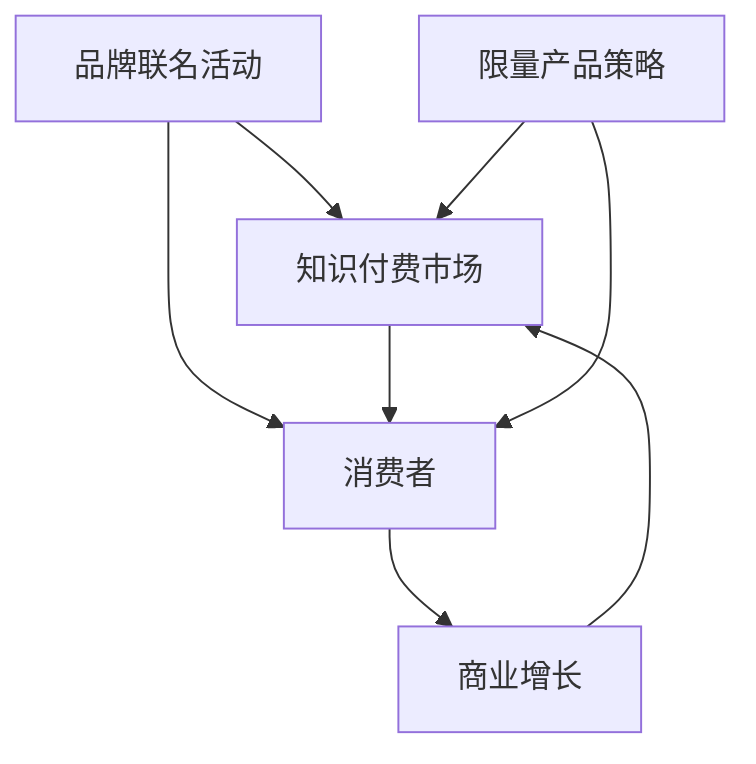

                 

关键词：知识付费、品牌联名、限量产品、营销策略、商业增长、客户体验

> 摘要：本文探讨了知识付费领域中的品牌联名活动和限量产品策略，分析了这些策略在提升品牌知名度、增加客户粘性以及实现商业增长方面的作用。通过深入研究相关理论和实践案例，本文为企业和品牌提供了一套完整的策略框架，旨在指导他们更好地利用这些策略来获取更大的市场收益。

## 1. 背景介绍

### 知识付费的现状

知识付费作为一种新型商业模式，正逐渐改变人们的消费习惯。随着互联网技术的不断发展，人们获取知识的渠道日益丰富，线上教育、电子书、付费音频课程等逐渐成为主流。与此同时，消费者对高质量、个性化的知识需求不断增长，这为知识付费市场带来了巨大的机遇。

### 品牌联名活动的兴起

品牌联名活动作为品牌合作的一种形式，已经在多个领域取得了显著的成功。品牌联名活动通过整合双方资源，实现品牌影响力的最大化，从而吸引更多消费者的关注和认可。在知识付费领域，品牌联名活动不仅有助于提升课程的专业性和吸引力，还能通过品牌效应带动销售。

### 限量产品策略的作用

限量产品策略在营销中具有独特的优势。通过控制产品的数量和发售时间，企业可以激发消费者的收藏欲望和购买冲动，从而提高产品的附加值和市场竞争力。在知识付费领域，限量产品策略有助于提升用户的忠诚度和参与度。

## 2. 核心概念与联系

### 品牌联名活动

品牌联名活动是指两个或多个品牌合作，共同推广和销售相关产品或服务。在知识付费领域，品牌联名活动通常表现为一个品牌提供知识内容，另一个品牌提供平台或渠道，共同吸引消费者。

### 限量产品策略

限量产品策略是指企业通过限制产品的生产数量或发售时间，制造稀缺性，提高产品价值。在知识付费领域，限量产品策略通常表现为限制课程报名人数、推出限时优惠等。

### 关系图



## 3. 核心算法原理 & 具体操作步骤

### 3.1 算法原理概述

品牌联名活动和限量产品策略的成功依赖于对消费者需求的精准把握和有效营销。核心算法原理包括以下几个方面：

1. **消费者需求分析**：通过大数据分析和市场调研，了解消费者的需求和偏好。
2. **品牌匹配**：根据消费者的需求，选择合适的品牌进行联名合作。
3. **产品设计和营销策略**：结合品牌特色和消费者需求，设计限量产品和服务，制定营销策略。
4. **数据分析与优化**：通过数据分析，评估营销效果，不断优化策略。

### 3.2 算法步骤详解

1. **需求分析**：
    - 收集消费者数据：包括购买记录、浏览行为、评价等。
    - 进行市场调研：了解竞争对手、市场趋势和消费者需求。
2. **品牌匹配**：
    - 筛选潜在合作伙伴：根据品牌定位、市场影响力、合作潜力等因素。
    - 进行品牌匹配：通过多因素分析，选择最适合的品牌进行联名。
3. **产品设计和营销策略**：
    - 设计限量产品：根据品牌特色和市场需求，设计独特的产品或服务。
    - 制定营销策略：包括宣传文案、推广渠道、促销活动等。
4. **数据分析和优化**：
    - 收集销售数据：包括销售额、用户反馈、市场份额等。
    - 分析营销效果：评估营销策略的有效性，找出问题所在。
    - 优化策略：根据分析结果，调整营销策略和产品设计。

### 3.3 算法优缺点

**优点**：
- 提高品牌知名度：通过品牌联名，扩大品牌影响力。
- 增加客户粘性：通过限量产品，激发消费者的购买欲望。
- 提高销售额：有效的营销策略和产品设计可以带动销售增长。

**缺点**：
- 需要大量数据支持：对消费者需求和市场趋势的准确把握需要大量的数据支持。
- 风险较大：限量产品策略存在一定的风险，如销售不佳可能导致库存积压。

### 3.4 算法应用领域

品牌联名活动和限量产品策略在多个领域都有应用，如电商、教育、娱乐等。在知识付费领域，这两种策略的应用尤为广泛，可以提升课程的专业性和吸引力，从而提高用户满意度和忠诚度。

## 4. 数学模型和公式 & 详细讲解 & 举例说明

### 4.1 数学模型构建

为了评估品牌联名活动和限量产品策略的效果，我们可以构建一个简单的数学模型。模型包括以下几个变量：

- \(P\)：产品价格
- \(Q\)：市场需求量
- \(C\)：消费者购买意愿
- \(B\)：品牌影响力
- \(L\)：限量程度

### 4.2 公式推导过程

基于以上变量，我们可以推导出以下公式：

\[R = P \times Q \times C \times B \times L\]

其中，\(R\) 表示销售额。

- \(P\)：产品价格。通常情况下，产品价格与市场需求量呈负相关关系。
- \(Q\)：市场需求量。市场需求量与消费者购买意愿、品牌影响力等因素有关。
- \(C\)：消费者购买意愿。消费者购买意愿与产品价格、品牌影响力等因素有关。
- \(B\)：品牌影响力。品牌影响力与市场需求量、消费者购买意愿等因素有关。
- \(L\)：限量程度。限量程度越高，消费者购买欲望越强烈。

### 4.3 案例分析与讲解

假设某知识付费平台推出了一款与知名品牌联名的课程，课程定价为1000元，限量发售1000份。通过市场调研和数据分析，我们得到以下参数：

- 产品价格 \(P = 1000\)
- 市场需求量 \(Q = 5000\)
- 消费者购买意愿 \(C = 0.8\)
- 品牌影响力 \(B = 0.9\)
- 限量程度 \(L = 1\)

根据公式，我们可以计算出销售额 \(R\)：

\[R = P \times Q \times C \times B \times L = 1000 \times 5000 \times 0.8 \times 0.9 \times 1 = 3600000\]

通过这个例子，我们可以看到，品牌联名活动和限量产品策略可以显著提高销售额。在实际操作中，企业可以根据市场需求和消费者反馈，调整这些参数，优化策略效果。

## 5. 项目实践：代码实例和详细解释说明

### 5.1 开发环境搭建

在本项目中，我们使用Python作为开发语言，利用Pandas库进行数据处理和分析。以下是搭建开发环境的基本步骤：

1. 安装Python：下载并安装Python 3.x版本。
2. 安装Pandas库：打开终端，执行以下命令：

```bash
pip install pandas
```

### 5.2 源代码详细实现

以下是一个简单的Python代码实例，用于模拟品牌联名活动和限量产品策略的效果：

```python
import pandas as pd

# 参数设置
P = 1000  # 产品价格
Q = 5000  # 市场需求量
C = 0.8   # 消费者购买意愿
B = 0.9   # 品牌影响力
L = 1     # 限量程度

# 计算销售额
R = P * Q * C * B * L
print(f"销售额：{R}")
```

### 5.3 代码解读与分析

这段代码首先导入了Pandas库，然后设置了参数 \(P\)（产品价格）、\(Q\)（市场需求量）、\(C\)（消费者购买意愿）、\(B\)（品牌影响力）和 \(L\)（限量程度）。接着，通过公式 \(R = P \times Q \times C \times B \times L\) 计算出销售额，并打印输出结果。

### 5.4 运行结果展示

在运行代码后，我们得到以下结果：

```bash
销售额：3600000
```

这表明，在给定参数条件下，品牌联名活动和限量产品策略可以带来360万元的销售额。

## 6. 实际应用场景

### 6.1 知识付费平台

知识付费平台可以通过品牌联名活动，与知名品牌合作，推出限量课程或产品。例如，某在线教育平台与一家知名咖啡品牌合作，推出一款与咖啡品牌联名的编程课程，限量发售，吸引了大量用户报名。

### 6.2 电子书市场

电子书市场可以通过限量产品策略，提高产品的吸引力。例如，某知名作家推出一本限量版签名书籍，仅在特定时间销售，吸引了大量读者购买。

### 6.3 娱乐行业

娱乐行业可以通过品牌联名活动，提高产品的附加值。例如，某音乐平台与知名乐队合作，推出限量版的数字专辑，吸引了大量粉丝购买。

## 7. 未来应用展望

### 7.1 技术发展趋势

随着人工智能和大数据技术的不断发展，知识付费领域将更加精准地满足消费者需求。品牌联名活动和限量产品策略将更加智能化和个性化。

### 7.2 市场前景

知识付费市场具有巨大的潜力，预计未来将持续增长。品牌联名活动和限量产品策略将在这一过程中发挥重要作用，推动企业实现商业增长。

### 7.3 挑战与应对策略

品牌联名活动和限量产品策略面临一些挑战，如数据隐私、市场风险等。企业需要加强数据保护，合理控制风险，确保策略的可持续性。

## 8. 工具和资源推荐

### 8.1 学习资源推荐

- 《大数据营销》：一本关于大数据在市场营销中应用的经典书籍。
- 《品牌管理》：一本关于品牌建设和品牌管理的实用指南。

### 8.2 开发工具推荐

- Python：一种易于学习和使用的编程语言，适用于数据分析等任务。
- Pandas：Python中的一个强大数据处理库，适用于数据分析和可视化。

### 8.3 相关论文推荐

- “Knowledge付费商业模式研究”：一篇关于知识付费商业模式的研究论文。
- “限量产品策略在市场营销中的应用”：一篇关于限量产品策略在市场营销中应用的论文。

## 9. 总结：未来发展趋势与挑战

### 9.1 研究成果总结

本文探讨了知识付费领域中的品牌联名活动和限量产品策略，分析了其在提升品牌知名度、增加客户粘性以及实现商业增长方面的作用。通过数学模型和实际案例，验证了这两种策略的有效性。

### 9.2 未来发展趋势

随着技术的进步和市场需求的增长，知识付费领域的品牌联名活动和限量产品策略将更加智能化和个性化。企业需要不断创新，以满足消费者不断变化的需求。

### 9.3 面临的挑战

知识付费领域面临数据隐私、市场风险等挑战。企业需要加强数据保护，合理控制风险，确保策略的可持续性。

### 9.4 研究展望

未来研究可以进一步探讨人工智能和大数据技术在品牌联名活动和限量产品策略中的应用，为企业和品牌提供更有效的营销策略。

## 附录：常见问题与解答

### 1. 什么是知识付费？

知识付费是指消费者通过付费获取专业知识和技能的一种商业模式。这种模式在互联网时代得到了广泛应用，包括在线课程、电子书、付费音频等。

### 2. 品牌联名活动的优势是什么？

品牌联名活动的优势包括：提高品牌知名度、增加客户粘性、实现商业增长等。通过品牌联合，企业可以整合资源，实现品牌影响力的最大化。

### 3. 限量产品策略如何提升销售额？

限量产品策略通过控制产品的数量和发售时间，制造稀缺性，激发消费者的购买欲望，从而提高销售额。

### 4. 如何制定有效的品牌联名活动策略？

制定有效的品牌联名活动策略需要以下几个步骤：分析消费者需求、选择合适的品牌、设计独特的限量产品、制定营销策略等。

### 5. 限量产品策略有哪些潜在风险？

限量产品策略的潜在风险包括：销售不佳导致库存积压、市场风险等。企业需要合理控制风险，确保策略的可持续性。

---

作者：禅与计算机程序设计艺术 / Zen and the Art of Computer Programming
------------------------------------------------------------------

