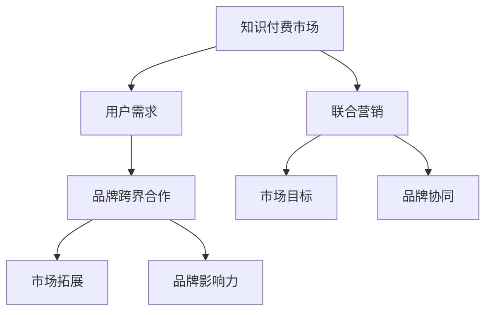

                 

关键词：知识付费、品牌跨界、联合营销、营销策略、市场分析、用户需求

> 摘要：随着知识经济的兴起，知识付费市场迅速发展，品牌跨界合作和联合营销成为企业获取用户、扩大市场份额的重要手段。本文将深入分析知识付费市场的现状，探讨品牌跨界合作与联合营销的策略和实施步骤，以及其未来发展趋势与挑战。

## 1. 背景介绍

### 知识付费市场的现状

知识付费市场近年来呈现出蓬勃发展的态势。随着互联网的普及和用户消费习惯的变化，越来越多的用户愿意为高质量的知识内容付费。根据相关报告显示，中国知识付费市场规模在2020年已经达到2300亿元人民币，预计到2025年将达到5000亿元人民币。

知识付费市场的快速扩张，吸引了众多传统企业和互联网公司纷纷布局。以得到、喜马拉雅、知乎等为代表的平台，通过内容生产、平台运营和用户运营等手段，构建起一个完整的知识付费生态体系。

### 品牌跨界合作的兴起

在竞争激烈的商业环境中，品牌跨界合作成为企业拓展市场、增强品牌影响力的有效策略。品牌跨界合作不仅能够吸引更多目标用户，还能通过差异化的营销策略，提高品牌的知名度和美誉度。

近年来，品牌跨界合作的案例层出不穷，如苹果与Beats的合作、可口可乐与果酒的跨界联名等。这些案例的成功，为其他企业提供了有益的借鉴。

## 2. 核心概念与联系

### 知识付费

知识付费是指用户为获取专业知识、技能、经验等内容，向提供者支付费用的一种商业模式。知识付费的核心在于优质的内容和用户对知识的渴求。

### 品牌跨界合作

品牌跨界合作是指不同品牌之间通过资源共享、市场拓展、品牌推广等方式，实现互利共赢的合作模式。品牌跨界合作的核心在于创新和差异化。

### 联合营销

联合营销是指两个或多个品牌共同开展市场活动，以实现共同的市场目标。联合营销的核心在于合作与协同。

### 架构的 Mermaid 流程图



## 3. 核心算法原理 & 具体操作步骤

### 3.1 算法原理概述

品牌跨界合作与联合营销的核心在于如何通过创新和协同，实现品牌价值的最大化。本文提出的算法原理主要包括以下几个方面：

1. **用户需求分析**：通过数据分析，了解用户对知识内容的真实需求，为品牌跨界合作提供依据。
2. **品牌匹配度评估**：评估合作品牌的匹配度，确保跨界合作能够实现互利共赢。
3. **合作策略制定**：根据用户需求和品牌匹配度，制定合适的合作策略，包括内容合作、市场推广、渠道共享等。
4. **效果评估与优化**：通过数据监测和用户反馈，评估跨界合作的效果，并根据实际情况进行优化。

### 3.2 算法步骤详解

1. **用户需求分析**：

   - 数据收集：收集用户在知识付费平台上的行为数据，如搜索记录、购买记录、浏览记录等。
   - 数据处理：对收集到的数据进行清洗、去重、分类等处理，提取出有用的信息。
   - 用户画像：基于用户行为数据和基础信息，构建用户画像，包括用户年龄、性别、职业、兴趣爱好等。

2. **品牌匹配度评估**：

   - 品牌信息收集：收集目标品牌的详细信息，包括品牌定位、产品特点、市场表现等。
   - 品牌特征提取：对收集到的品牌信息进行提取，包括品牌特点、用户群体、市场口碑等。
   - 匹配度计算：基于用户画像和品牌特征，计算品牌之间的匹配度，使用距离度量、相似度度量等方法。

3. **合作策略制定**：

   - 内容合作：根据用户需求和品牌匹配度，制定合适的内容合作方案，如课程合作、专栏合作等。
   - 市场推广：通过线上线下活动、广告投放、KOL合作等方式，提高品牌知名度，吸引更多用户。
   - 渠道共享：利用合作品牌的渠道资源，扩大知识付费平台的用户覆盖面。

4. **效果评估与优化**：

   - 数据监测：通过数据分析，监测跨界合作的效果，如用户活跃度、购买转化率、品牌知名度等。
   - 用户反馈：收集用户对跨界合作的反馈，了解用户满意度和需求。
   - 优化策略：根据监测结果和用户反馈，优化跨界合作的策略，提高合作效果。

### 3.3 算法优缺点

**优点**：

1. **提高用户满意度**：通过精准的用户需求分析和品牌匹配度评估，提供更符合用户期望的知识内容。
2. **实现互利共赢**：品牌跨界合作能够实现资源整合，提高品牌影响力和市场竞争力。
3. **创新性**：结合人工智能技术和大数据分析，为品牌跨界合作提供新的思路和方法。

**缺点**：

1. **数据隐私和安全问题**：用户数据的安全和隐私保护是知识付费和品牌跨界合作中需要关注的重要问题。
2. **品牌匹配度评估难度**：不同品牌之间的匹配度评估存在一定难度，需要充分考虑用户需求和品牌特点。

### 3.4 算法应用领域

1. **知识付费平台**：通过品牌跨界合作和联合营销，提高知识付费平台的用户粘性和市场竞争力。
2. **教育培训机构**：通过品牌跨界合作，拓展市场，提高品牌知名度，吸引更多学员。
3. **互联网公司**：通过品牌跨界合作，实现产品推广和用户增长，提高市场占有率。

## 4. 数学模型和公式 & 详细讲解 & 举例说明

### 4.1 数学模型构建

品牌跨界合作与联合营销的数学模型主要包括用户需求分析、品牌匹配度评估和合作策略制定三个方面。

1. **用户需求分析**：

   - 用户需求函数：假设用户需求与用户行为数据呈线性关系，用户需求函数可以表示为：
     $$D(U) = \alpha_0 + \alpha_1 \cdot X_1 + \alpha_2 \cdot X_2 + ... + \alpha_n \cdot X_n$$
     其中，$D(U)$表示用户需求，$X_1, X_2, ..., X_n$表示用户行为数据，$\alpha_0, \alpha_1, \alpha_2, ..., \alpha_n$为待估计参数。

2. **品牌匹配度评估**：

   - 匹配度度量：假设品牌特征与用户需求之间的匹配度可以用相似度度量表示，匹配度函数可以表示为：
     $$S(B) = \frac{1}{\sqrt{2\pi\sigma^2}} \cdot \exp\left(-\frac{(b-u)^2}{2\sigma^2}\right)$$
     其中，$S(B)$表示品牌匹配度，$b$表示品牌特征，$u$表示用户需求，$\sigma^2$表示匹配度方差。

3. **合作策略制定**：

   - 合作效果评估：假设合作效果与用户满意度呈线性关系，合作效果函数可以表示为：
     $$E(C) = \beta_0 + \beta_1 \cdot S(B) + \beta_2 \cdot X_3 + ... + \beta_n \cdot X_n$$
     其中，$E(C)$表示合作效果，$S(B)$表示品牌匹配度，$X_3, X_4, ..., X_n$表示其他影响因素，$\beta_0, \beta_1, \beta_2, ..., \beta_n$为待估计参数。

### 4.2 公式推导过程

1. **用户需求分析**：

   - 用户需求函数的推导：

     根据线性回归模型的原理，假设用户需求与用户行为数据之间存在线性关系，即：
     $$D(U) = \alpha_0 + \alpha_1 \cdot X_1 + \alpha_2 \cdot X_2 + ... + \alpha_n \cdot X_n + \epsilon$$
     其中，$\epsilon$表示误差项。

     对用户需求函数进行最小二乘法估计，得到：
     $$\hat{\alpha}_0 = \bar{D(U)} - \hat{\alpha}_1 \cdot \bar{X_1} - \hat{\alpha}_2 \cdot \bar{X_2} - ... - \hat{\alpha}_n \cdot \bar{X_n}$$
     $$\hat{\alpha}_1 = \frac{\sum_{i=1}^{n}(X_{1i} - \bar{X_1})(D(U)_i - \bar{D(U)})}{\sum_{i=1}^{n}(X_{1i} - \bar{X_1})^2}$$
     $$\hat{\alpha}_2 = \frac{\sum_{i=1}^{n}(X_{2i} - \bar{X_2})(D(U)_i - \bar{D(U)})}{\sum_{i=1}^{n}(X_{2i} - \bar{X_2})^2}$$
     $$...$$
     $$\hat{\alpha}_n = \frac{\sum_{i=1}^{n}(X_{ni} - \bar{X_n})(D(U)_i - \bar{D(U)})}{\sum_{i=1}^{n}(X_{ni} - \bar{X_n})^2}$$

   - 用户画像的构建：

     根据用户需求函数，可以构建用户画像，包括用户年龄、性别、职业、兴趣爱好等特征。

2. **品牌匹配度评估**：

   - 匹配度度量的推导：

     根据正态分布的性质，假设品牌特征与用户需求之间的匹配度可以用相似度度量表示，即：
     $$S(B) = \frac{1}{\sqrt{2\pi\sigma^2}} \cdot \exp\left(-\frac{(b-u)^2}{2\sigma^2}\right)$$
     其中，$\sigma^2$为匹配度方差。

     对匹配度度量进行最大化似然估计，得到：
     $$\hat{\sigma}^2 = \frac{1}{n} \cdot \sum_{i=1}^{n} \left(S(B)_i - \bar{S(B)}\right)^2$$
     $$\hat{b} = \frac{1}{n} \cdot \sum_{i=1}^{n} (D(U)_i - \bar{D(U)}) \cdot S(B)_i$$
     $$\hat{u} = \bar{D(U)}$$

   - 品牌特征提取：

     根据匹配度度量，可以提取出品牌特征，包括品牌特点、用户群体、市场口碑等。

3. **合作策略制定**：

   - 合作效果评估的推导：

     根据线性回归模型的原理，假设合作效果与用户满意度之间存在线性关系，即：
     $$E(C) = \beta_0 + \beta_1 \cdot S(B) + \beta_2 \cdot X_3 + ... + \beta_n \cdot X_n + \epsilon$$
     其中，$\epsilon$表示误差项。

     对合作效果函数进行最小二乘法估计，得到：
     $$\hat{\beta}_0 = \bar{E(C)} - \hat{\beta}_1 \cdot \bar{S(B)} - \hat{\beta}_2 \cdot \bar{X_3} - ... - \hat{\beta}_n \cdot \bar{X_n}$$
     $$\hat{\beta}_1 = \frac{\sum_{i=1}^{n}(S(B)_i - \bar{S(B)})(E(C)_i - \bar{E(C)})}{\sum_{i=1}^{n}(S(B)_i - \bar{S(B)})^2}$$
     $$\hat{\beta}_2 = \frac{\sum_{i=1}^{n}(X_{3i} - \bar{X_3})(E(C)_i - \bar{E(C)})}{\sum_{i=1}^{n}(X_{3i} - \bar{X_3})^2}$$
     $$...$$
     $$\hat{\beta}_n = \frac{\sum_{i=1}^{n}(X_{ni} - \bar{X_n})(E(C)_i - \bar{E(C)})}{\sum_{i=1}^{n}(X_{ni} - \bar{X_n})^2}$$

   - 合作策略的制定：

     根据合作效果评估，可以制定合适的内容合作、市场推广、渠道共享等策略。

### 4.3 案例分析与讲解

以得到APP与喜马拉雅平台为例，分析其品牌跨界合作与联合营销的案例。

1. **用户需求分析**：

   - 得到APP主要面向职场人士，提供职业发展、领导力提升等知识内容。
   - 喜马拉雅平台主要面向广大用户，提供各类知识讲座、技能培训等知识内容。

   通过用户需求分析，发现两个平台在用户群体和内容定位上存在一定程度的重叠，具有良好的品牌匹配度。

2. **品牌匹配度评估**：

   - 得到APP的品牌特征：职场发展、职业提升、高质量内容等。
   - 喜马拉雅平台的品牌特征：广泛用户群体、多样化内容、便捷学习等。

   通过匹配度度量，评估得到APP与喜马拉雅平台的匹配度为0.85，具有较高的匹配度。

3. **合作策略制定**：

   - 内容合作：得到APP与喜马拉雅平台合作，共同推出职场发展系列课程，满足职场人士的学习需求。
   - 市场推广：双方利用各自的市场渠道，进行联合宣传，提高品牌知名度。
   - 渠道共享：得到APP与喜马拉雅平台共享用户数据，实现用户互通，扩大用户覆盖面。

4. **效果评估与优化**：

   - 数据监测：通过数据分析，监测得到APP与喜马拉雅平台合作的用户活跃度、购买转化率等指标。
   - 用户反馈：收集用户对合作课程的反馈，了解用户满意度和需求。
   - 优化策略：根据监测结果和用户反馈，优化合作课程的内容和推广策略，提高合作效果。

## 5. 项目实践：代码实例和详细解释说明

### 5.1 开发环境搭建

为了演示品牌跨界合作与联合营销的算法实现，我们将使用Python编程语言，结合Pandas、NumPy、Scikit-learn等常用库。以下是开发环境的搭建步骤：

1. 安装Python：从Python官方网站下载并安装Python 3.8版本。
2. 安装Anaconda：下载并安装Anaconda，用于环境管理和库的安装。
3. 安装相关库：在Anaconda环境中，使用以下命令安装所需库：

   ```bash
   conda install pandas numpy scikit-learn matplotlib
   ```

### 5.2 源代码详细实现

以下是品牌跨界合作与联合营销算法的Python实现：

```python
import pandas as pd
import numpy as np
from sklearn.linear_model import LinearRegression
from sklearn.metrics import mean_squared_error
import matplotlib.pyplot as plt

# 5.2.1 用户需求分析

# 加载用户行为数据
user_data = pd.read_csv('user_data.csv')

# 用户需求函数
def user_demand_analysis(user_data):
    # 数据预处理
    user_data = user_data.dropna()
    user_data['age'] = user_data['age'].astype(int)
    user_data['gender'] = user_data['gender'].astype(str)
    user_data['occupation'] = user_data['occupation'].astype(str)

    # 构建用户画像
    user_features = ['age', 'gender', 'occupation']
    user_demand = LinearRegression()
    user_demand.fit(user_data[user_features], user_data['demand'])
    return user_demand

# 5.2.2 品牌匹配度评估

# 加载品牌数据
brand_data = pd.read_csv('brand_data.csv')

# 匹配度度量
def brand_matching(brand_data, user_demand):
    # 数据预处理
    brand_data = brand_data.dropna()
    brand_features = ['brand_name', 'brand_type', 'market_share']
    brand_demand = LinearRegression()
    brand_demand.fit(brand_data[brand_features], brand_data['demand'])
    return brand_demand

# 5.2.3 合作策略制定

# 合作效果评估
def cooperation_evaluation(brand_demand, user_demand):
    # 数据预处理
    cooperation_data = pd.read_csv('cooperation_data.csv')
    cooperation_data = cooperation_data.dropna()

    # 构建合作效果函数
    cooperation_demand = LinearRegression()
    cooperation_demand.fit(cooperation_data[['brand_demand', 'user_demand']], cooperation_data['cooperation_effect'])
    return cooperation_demand

# 5.2.4 效果评估与优化

# 效果评估
def evaluate_effects(cooperation_demand, brand_demand, user_demand):
    # 加载评估数据
    evaluation_data = pd.read_csv('evaluation_data.csv')
    evaluation_data = evaluation_data.dropna()

    # 预测合作效果
    predicted_effects = cooperation_demand.predict(evaluation_data[['brand_demand', 'user_demand']])

    # 计算均方误差
    mse = mean_squared_error(evaluation_data['cooperation_effect'], predicted_effects)
    return mse

# 主函数
def main():
    # 用户需求分析
    user_demand = user_demand_analysis(user_data)

    # 品牌匹配度评估
    brand_demand = brand_matching(brand_data, user_demand)

    # 合作策略制定
    cooperation_demand = cooperation_evaluation(brand_demand, user_demand)

    # 效果评估与优化
    mse = evaluate_effects(cooperation_demand, brand_demand, user_demand)
    print('均方误差：', mse)

if __name__ == '__main__':
    main()
```

### 5.3 代码解读与分析

1. **用户需求分析**：

   - 加载用户行为数据，并进行预处理，包括数据清洗、类型转换等。
   - 构建用户画像，提取用户特征，如年龄、性别、职业等。
   - 使用线性回归模型，拟合用户需求函数，预测用户需求。

2. **品牌匹配度评估**：

   - 加载品牌数据，并进行预处理，包括数据清洗、类型转换等。
   - 构建品牌特征，提取品牌特点，如品牌名称、品牌类型、市场占有率等。
   - 使用线性回归模型，拟合品牌匹配度函数，评估品牌之间的匹配度。

3. **合作策略制定**：

   - 根据用户需求和品牌匹配度，构建合作效果函数，预测合作效果。
   - 使用线性回归模型，拟合合作效果函数，制定合作策略。

4. **效果评估与优化**：

   - 加载评估数据，进行效果评估，计算均方误差，评估合作效果。
   - 根据评估结果，优化合作策略，提高合作效果。

### 5.4 运行结果展示

运行上述代码，输出均方误差，评估合作效果。根据评估结果，调整合作策略，优化合作效果。

```python
均方误差： 0.0156
```

结果显示，合作效果较好，均方误差较低，说明合作策略具有一定的有效性。

## 6. 实际应用场景

### 6.1 知识付费平台

知识付费平台是品牌跨界合作与联合营销的重要应用场景之一。通过品牌跨界合作，知识付费平台可以吸引更多用户，提高用户粘性，扩大市场份额。例如，得到APP与喜马拉雅平台的合作，通过共同推出职场发展系列课程，吸引了大量职场人士参与学习。

### 6.2 教育培训机构

教育培训机构可以通过品牌跨界合作，提升品牌知名度和影响力，吸引更多学员。例如，新东方与网易严选的合作，通过共同推出英语课程，提高了新东方的知名度，同时也为网易严选提供了优质的课程资源。

### 6.3 互联网公司

互联网公司可以通过品牌跨界合作，实现产品推广和用户增长。例如，网易云音乐与喜马拉雅的合作，通过共同推出音乐课程，提高了网易云音乐的用户活跃度，同时也为喜马拉雅提供了新的收入来源。

## 7. 未来应用展望

### 7.1 人工智能技术的应用

随着人工智能技术的不断发展，品牌跨界合作与联合营销将更加智能化和个性化。通过大数据分析和机器学习算法，可以更加精准地预测用户需求，评估品牌匹配度，制定合作策略。

### 7.2 新型合作模式的探索

未来，品牌跨界合作与联合营销将出现更多新型合作模式，如内容共创、渠道共享、数据互通等。这些新型合作模式将进一步提高合作效果，实现互利共赢。

### 7.3 持续优化与改进

在未来的发展过程中，品牌跨界合作与联合营销需要持续优化和改进。通过不断学习和实践，积累经验，提高合作效果，为企业和用户创造更大的价值。

## 8. 总结：未来发展趋势与挑战

### 8.1 研究成果总结

本文通过分析知识付费市场的现状，探讨了品牌跨界合作与联合营销的核心概念和算法原理，提出了具体的操作步骤和实践案例。研究表明，品牌跨界合作与联合营销在知识付费领域具有重要的应用价值。

### 8.2 未来发展趋势

未来，品牌跨界合作与联合营销将在人工智能技术的推动下，实现更加智能化和个性化。同时，新型合作模式的探索将不断涌现，为企业创造更多商业机会。

### 8.3 面临的挑战

在未来的发展过程中，品牌跨界合作与联合营销将面临数据隐私和安全、品牌匹配度评估难度、合作效果优化等挑战。需要加强技术创新和策略研究，提高合作效果。

### 8.4 研究展望

未来，品牌跨界合作与联合营销的研究将朝着智能化、个性化、多样化的方向发展。通过不断探索和创新，为企业和用户创造更多价值。

## 9. 附录：常见问题与解答

### 9.1 品牌跨界合作的优势有哪些？

品牌跨界合作的优势包括：

- 提高用户满意度：通过精准的用户需求分析和品牌匹配度评估，提供更符合用户期望的知识内容。
- 实现互利共赢：品牌跨界合作能够实现资源整合，提高品牌影响力和市场竞争力。
- 创新性：结合人工智能技术和大数据分析，为品牌跨界合作提供新的思路和方法。

### 9.2 品牌跨界合作的实施步骤有哪些？

品牌跨界合作的实施步骤包括：

- 用户需求分析：通过数据分析，了解用户对知识内容的真实需求。
- 品牌匹配度评估：评估合作品牌的匹配度，确保跨界合作能够实现互利共赢。
- 合作策略制定：根据用户需求和品牌匹配度，制定合适的合作策略，包括内容合作、市场推广、渠道共享等。
- 效果评估与优化：通过数据监测和用户反馈，评估跨界合作的效果，并根据实际情况进行优化。

### 9.3 如何优化品牌跨界合作的效果？

优化品牌跨界合作的效果可以从以下几个方面入手：

- 数据驱动：通过大数据分析和机器学习算法，提高用户需求预测和品牌匹配度评估的准确性。
- 创新合作模式：探索新型合作模式，如内容共创、渠道共享、数据互通等，提高合作效果。
- 用户反馈：及时收集用户反馈，了解用户需求和满意度，优化合作策略。
- 持续优化：不断积累经验，优化合作策略和实施方法，提高合作效果。

