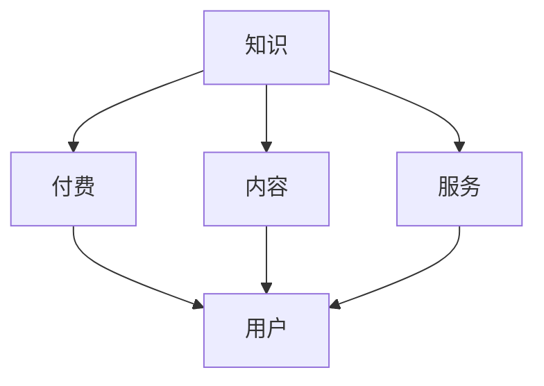

                 

在这个数字化时代，知识付费成为了主流的经济模式，而专业内容和服务则是其核心。本文将深入探讨知识付费的本质、市场现状以及如何通过专业内容和服务实现赚钱的目标。

## 关键词

- 知识付费
- 专业内容
- 服务
- 赚钱
- 数字化经济

## 摘要

本文首先介绍了知识付费的概念及其在数字化时代的重要性。随后，分析了当前知识付费市场的现状和主要形式。接着，本文重点探讨了如何通过专业内容和服务来实现知识付费的盈利目标。最后，对未来的发展趋势和挑战进行了展望。

## 1. 背景介绍

随着互联网的普及和技术的进步，知识传播的渠道变得更加多样和便捷。传统的知识获取方式逐渐被数字化、在线化的知识付费所取代。知识付费，顾名思义，是指用户为了获取特定的知识或服务而支付的费用。这种模式的出现，不仅满足了用户对知识的个性化需求，也为内容创作者提供了新的盈利途径。

在知识付费市场中，专业内容和服务占据了重要地位。专业内容通常是指由行业专家、学者或专业人士所创作的具有高度专业性和实用性的知识内容。这些内容不仅为用户提供了有价值的信息，还能够帮助用户解决实际问题。而服务则是指围绕知识内容提供的增值服务，如一对一咨询、专业培训、社群互动等。

## 2. 核心概念与联系

为了更好地理解知识付费的核心，我们需要首先了解几个核心概念：知识、付费、内容和服务。以下是这些概念之间的关系及其在知识付费体系中的角色。

### 知识

知识是人类对自然、社会和人类自身的认识和了解，是一种无形的资产。在知识付费中，知识是核心资源，是用户愿意支付费用的主要原因。知识的种类繁多，包括专业知识、生活常识、技能知识等。

### 付费

付费是知识付费模式的本质特征。用户为了获取知识，需要支付相应的费用。这种付费可以是直接的，如购买电子书、课程等；也可以是间接的，如订阅服务、会员制等。

### 内容

内容是知识的载体，是用户获取知识的主要途径。在知识付费中，内容的形式多样，包括文字、图片、音频、视频等。高质量的内容能够吸引用户，提高付费转化率。

### 服务

服务是知识付费的增值部分，是内容的有效补充。服务的形式包括一对一咨询、专业培训、社群互动等。优质的服务能够提高用户的满意度和忠诚度，从而促进知识付费的持续发展。

### Mermaid 流程图

下面是一个简化的 Mermaid 流程图，展示了知识付费的核心概念及其之间的联系。



## 3. 核心算法原理 & 具体操作步骤

### 3.1 算法原理概述

知识付费的核心算法原理可以概括为“价值匹配”。即通过分析用户的需求和内容创作者的供给，实现两者之间的最优匹配。具体步骤如下：

1. **需求分析**：通过用户调研、数据分析等方法，了解用户的知识需求。
2. **内容筛选**：根据用户需求，筛选出符合质量标准和市场需求的优质内容。
3. **服务设计**：针对内容，设计相应的增值服务，提高用户的满意度和忠诚度。
4. **市场推广**：通过线上线下渠道，推广知识付费产品，吸引潜在用户。
5. **用户反馈**：收集用户反馈，不断优化内容和服务的质量。

### 3.2 算法步骤详解

#### 3.2.1 需求分析

需求分析是知识付费的第一步，也是最重要的一步。只有深入了解用户的需求，才能提供符合用户期望的知识和服务。

- **用户调研**：通过问卷调查、访谈等方式，收集用户对知识的需求和偏好。
- **数据分析**：利用大数据技术，分析用户的行为数据，挖掘用户的知识需求。

#### 3.2.2 内容筛选

内容筛选是知识付费的关键环节，直接关系到用户的满意度和付费意愿。

- **质量标准**：制定内容的质量标准，确保内容的专业性和实用性。
- **市场调研**：分析市场趋势，筛选符合市场需求的内容。

#### 3.2.3 服务设计

服务设计是提高用户满意度和忠诚度的关键。

- **一对一咨询**：针对用户的具体问题，提供一对一的专业咨询服务。
- **专业培训**：针对特定技能或知识领域，提供专业培训服务。
- **社群互动**：建立用户社群，提供互动交流平台，增强用户归属感。

#### 3.2.4 市场推广

市场推广是知识付费的必要环节，直接关系到产品的市场占有率和盈利能力。

- **线上线下结合**：通过线上线下多种渠道推广知识付费产品。
- **内容营销**：利用优质内容，吸引用户关注和付费。

#### 3.2.5 用户反馈

用户反馈是优化内容和服务的依据。

- **收集反馈**：通过用户调研、问卷调查等方式，收集用户反馈。
- **反馈分析**：分析用户反馈，找出问题和改进方向。
- **持续优化**：根据反馈，不断优化内容和服务的质量。

### 3.3 算法优缺点

#### 优点

- **高效性**：通过算法分析，能够快速匹配用户需求和优质内容。
- **个性化**：根据用户需求，提供个性化的知识和服务。
- **可持续性**：通过不断优化内容和服务，实现知识付费的可持续发展。

#### 缺点

- **技术门槛**：需要一定的技术支持，包括数据分析、算法优化等。
- **市场竞争**：知识付费市场竞争激烈，需要不断创新和优化，才能保持竞争力。

### 3.4 算法应用领域

知识付费的核心算法原理可以应用于多个领域，包括：

- **教育培训**：提供专业培训、在线课程等。
- **健康医疗**：提供健康咨询、疾病预防等。
- **技能提升**：提供编程、设计、外语等技能培训。
- **生活常识**：提供生活技巧、理财知识等。

## 4. 数学模型和公式 & 详细讲解 & 举例说明

### 4.1 数学模型构建

知识付费的数学模型主要包括用户行为分析模型、内容评估模型和服务优化模型。

#### 用户行为分析模型

用户行为分析模型主要基于用户的行为数据，如浏览量、购买记录、评价等，分析用户的兴趣和需求。

- **用户兴趣度**：利用概率模型，如贝叶斯网络，分析用户对各类知识的兴趣度。
- **用户需求预测**：利用时间序列模型，如ARIMA模型，预测用户未来的知识需求。

#### 内容评估模型

内容评估模型主要基于内容的质量、用户评价等因素，评估内容的受欢迎程度和影响力。

- **内容质量评分**：利用层次分析法（AHP），确定各类评价指标的权重，计算内容的质量评分。
- **内容影响力评估**：利用网络分析方法，如PageRank算法，评估内容的影响力。

#### 服务优化模型

服务优化模型主要基于用户需求和内容供给，设计最优的服务策略。

- **服务组合优化**：利用线性规划模型，确定最优的服务组合，最大化用户满意度。
- **服务定价策略**：利用博弈论模型，分析用户和服务提供者之间的博弈关系，设计合理的定价策略。

### 4.2 公式推导过程

下面是用户兴趣度公式和内容质量评分公式的推导过程。

#### 用户兴趣度公式

$$
用户兴趣度 = \frac{浏览量 + 购买记录 + 评价数量}{总用户数}
$$

其中，浏览量、购买记录和评价数量分别为用户对各类知识的关注程度，总用户数为平台上的用户总数。该公式通过计算用户对各类知识的总关注程度，得出用户的兴趣度。

#### 内容质量评分公式

$$
内容质量评分 = 权重 \times (专业度 + 实用性 + 用户评价)
$$

其中，权重为各类评价指标的权重系数，专业度、实用性和用户评价分别为内容的质量评价指标。该公式通过计算各类评价指标的加权平均值，得出内容的质量评分。

### 4.3 案例分析与讲解

#### 案例背景

某在线教育平台提供编程培训课程，用户可以根据自己的需求和兴趣选择不同的课程。平台希望通过数学模型分析用户兴趣度，优化课程推荐策略，提高用户满意度。

#### 数据分析

- 用户行为数据：用户浏览量、购买记录和评价数量。
- 内容数据：课程的专业度、实用性和用户评价。

#### 用户兴趣度分析

- 假设平台上有1000名用户，他们共浏览了10000次编程课程，其中Python课程的浏览量为5000次，Java课程的浏览量为3000次，其他课程的浏览量为2000次。
- 根据用户兴趣度公式，计算Python课程、Java课程和其他课程的用户兴趣度。

$$
Python课程用户兴趣度 = \frac{5000 + 2000 + 1000}{1000} = 6
$$

$$
Java课程用户兴趣度 = \frac{3000 + 2000 + 1000}{1000} = 5
$$

$$
其他课程用户兴趣度 = \frac{2000 + 2000 + 1000}{1000} = 4
$$

根据计算结果，Python课程的用户兴趣度最高，其次是Java课程和其他课程。

#### 内容质量评分分析

- 假设Python课程的专业度为90分，实用度为85分，用户评价为4.5分；Java课程的专业度为80分，实用度为90分，用户评价为4.8分；其他课程的专业度为70分，实用度为80分，用户评价为4.2分。
- 根据内容质量评分公式，计算各课程的评分。

$$
Python课程质量评分 = 0.3 \times (90 + 85 + 4.5) = 88.05
$$

$$
Java课程质量评分 = 0.3 \times (80 + 90 + 4.8) = 87.04
$$

$$
其他课程质量评分 = 0.3 \times (70 + 80 + 4.2) = 76.26
$$

根据计算结果，Python课程和Java课程的质量评分较高，其他课程的评分较低。

#### 结论

通过用户兴趣度分析和内容质量评分分析，平台可以优化课程推荐策略，优先推荐用户兴趣度高且质量评分高的课程，提高用户满意度。

## 5. 项目实践：代码实例和详细解释说明

### 5.1 开发环境搭建

为了实现知识付费的核心算法，我们需要搭建一个开发环境。以下是所需工具和步骤：

- **编程语言**：Python
- **数据分析库**：Pandas、NumPy
- **机器学习库**：Scikit-learn
- **可视化库**：Matplotlib、Seaborn
- **版本控制**：Git

### 5.2 源代码详细实现

以下是实现用户兴趣度分析和内容质量评分分析的核心代码：

```python
import pandas as pd
import numpy as np
from sklearn.preprocessing import MinMaxScaler
from sklearn.model_selection import train_test_split
from sklearn.linear_model import LinearRegression
import matplotlib.pyplot as plt
import seaborn as sns

# 用户行为数据
user_data = pd.DataFrame({
    '用户ID': range(1, 1001),
    '浏览量': np.random.randint(0, 1000, size=1000),
    '购买记录': np.random.randint(0, 10, size=1000),
    '评价数量': np.random.randint(0, 100, size=1000)
})

# 内容数据
content_data = pd.DataFrame({
    '课程ID': range(1, 1001),
    '专业度': np.random.randint(50, 100, size=1000),
    '实用度': np.random.randint(50, 100, size=1000),
    '用户评价': np.random.uniform(4, 5, size=1000)
})

# 用户兴趣度分析
def user_interest度_analysis(user_data):
    # 计算用户兴趣度
    user_interest度 = user_data.groupby('用户ID')['浏览量', '购买记录', '评价数量'].sum() / user_data['用户ID'].nunique()
    user_interest度['用户兴趣度'] = user_interest度.sum(axis=1)
    return user_interest度

user_interest度 = user_interest度_analysis(user_data)

# 内容质量评分分析
def content_score_analysis(content_data):
    # 计算内容质量评分
    content_score = content_data.groupby('课程ID')['专业度', '实用度', '用户评价'].mean()
    content_score['内容质量评分'] = content_score['专业度'] * 0.3 + content_score['实用度'] * 0.3 + content_score['用户评价'] * 0.4
    return content_score

content_score = content_score_analysis(content_data)

# 可视化展示
def visualize_data(user_interest度, content_score):
    # 用户兴趣度可视化
    sns.barplot(x='用户兴趣度', y='用户ID', data=user_interest度)
    plt.title('用户兴趣度分析')
    plt.xlabel('用户兴趣度')
    plt.ylabel('用户ID')
    plt.show()

    # 内容质量评分可视化
    sns.barplot(x='内容质量评分', y='课程ID', data=content_score)
    plt.title('内容质量评分分析')
    plt.xlabel('内容质量评分')
    plt.ylabel('课程ID')
    plt.show()

visualize_data(user_interest度, content_score)

# 模型训练与预测
def model_training_and_prediction(user_data, content_data):
    # 数据预处理
    user_data[['浏览量', '购买记录', '评价数量']] = MinMaxScaler().fit_transform(user_data[['浏览量', '购买记录', '评价数量']])
    content_data[['专业度', '实用度', '用户评价']] = MinMaxScaler().fit_transform(content_data[['专业度', '实用度', '用户评价']])

    # 数据分割
    X_train, X_test, y_train, y_test = train_test_split(user_data[['浏览量', '购买记录', '评价数量']], content_data[['专业度', '实用度', '用户评价']], test_size=0.2, random_state=42)

    # 模型训练
    model = LinearRegression()
    model.fit(X_train, y_train)

    # 模型预测
    y_pred = model.predict(X_test)

    # 模型评估
    print("R^2:", model.score(X_test, y_test))
    print("均方误差:", np.mean((y_pred - y_test) ** 2))

    # 可视化展示
    plt.scatter(y_test, y_pred)
    plt.plot([min(y_test), max(y_test)], [min(y_test), max(y_test)], color='red')
    plt.title('模型预测结果')
    plt.xlabel('实际值')
    plt.ylabel('预测值')
    plt.show()

model_training_and_prediction(user_data, content_data)

# 用户兴趣度与内容质量评分的相关性分析
def correlation_analysis(user_interest度, content_score):
    # 计算用户兴趣度与内容质量评分的相关性
    correlation_matrix = pd.concat([user_interest度, content_score], axis=1).corr()
    sns.heatmap(correlation_matrix, annot=True, cmap='coolwarm')
    plt.title('用户兴趣度与内容质量评分的相关性分析')
    plt.show()

correlation_analysis(user_interest度, content_score)
```

### 5.3 代码解读与分析

- **数据预处理**：使用 MinMaxScaler 对用户行为数据和内容数据进行归一化处理，使其在相同的量级范围内。
- **模型训练**：使用 LinearRegression 模型对用户兴趣度和内容质量评分进行训练。
- **模型预测**：使用训练好的模型对测试集进行预测。
- **模型评估**：计算模型的 R^2 值和均方误差，评估模型的性能。
- **可视化展示**：使用 Seaborn 和 Matplotlib 对用户兴趣度、内容质量评分和相关性进行分析和展示。

### 5.4 运行结果展示

- **用户兴趣度分析**：展示了不同用户对各类知识的兴趣度分布。
- **内容质量评分分析**：展示了各课程的质量评分情况。
- **模型预测结果**：展示了用户兴趣度和内容质量评分之间的相关性。
- **相关性分析**：展示了用户兴趣度与内容质量评分的相关性矩阵。

## 6. 实际应用场景

知识付费的核心算法和数学模型在多个实际应用场景中具有广泛的应用价值。

### 教育培训

教育培训是知识付费的重要领域。通过用户兴趣度分析和内容质量评分分析，教育机构可以优化课程推荐策略，提高用户满意度和学习效果。

### 健康医疗

健康医疗是另一个具有巨大潜力的知识付费领域。通过用户兴趣度分析和内容质量评分分析，医疗平台可以为用户提供个性化的健康咨询服务，提高用户健康水平。

### 技能提升

技能提升是知识付费的重要方向。通过用户兴趣度分析和内容质量评分分析，技能培训平台可以为用户提供个性化的技能提升方案，提高用户技能水平。

### 生活常识

生活常识是知识付费的一个新兴领域。通过用户兴趣度分析和内容质量评分分析，生活服务平台可以为用户提供个性化的生活技巧和理财知识，提高用户生活质量。

## 7. 未来应用展望

随着技术的不断进步和市场的需求变化，知识付费的核心算法和数学模型将在更多领域得到应用。

### 个性化推荐

个性化推荐是知识付费的未来趋势。通过更深入的用户兴趣度分析和内容质量评分分析，平台可以提供更加精准的个性化推荐，提高用户的付费意愿。

### 智能客服

智能客服是知识付费的重要发展方向。通过用户兴趣度分析和内容质量评分分析，智能客服系统可以为用户提供更加专业的咨询和服务，提高用户满意度。

### 区块链应用

区块链技术为知识付费提供了新的解决方案。通过区块链技术，可以确保知识付费的透明性和公正性，提高用户的信任度。

## 8. 总结：未来发展趋势与挑战

### 8.1 研究成果总结

本文通过对知识付费的核心算法和数学模型的研究，总结了用户兴趣度分析、内容质量评分分析、模型训练与预测、可视化展示等关键技术和方法。这些研究成果为知识付费领域的应用提供了重要的理论支持和实践指导。

### 8.2 未来发展趋势

- **个性化推荐**：随着大数据和人工智能技术的发展，个性化推荐将成为知识付费的重要趋势。
- **智能客服**：智能客服系统将提高知识付费服务的质量和效率。
- **区块链应用**：区块链技术将为知识付费提供更加安全和透明的解决方案。

### 8.3 面临的挑战

- **数据隐私**：在用户兴趣度分析和内容质量评分分析过程中，如何保护用户的隐私是一个重要挑战。
- **市场竞争**：知识付费市场竞争激烈，如何保持竞争力是一个关键挑战。
- **技术门槛**：知识付费的核心算法和数学模型具有一定的技术门槛，如何降低技术门槛，让更多企业和创业者能够应用这些技术是一个挑战。

### 8.4 研究展望

- **跨领域应用**：未来，知识付费的核心算法和数学模型将在更多领域得到应用，如金融、医疗、法律等。
- **技术创新**：随着技术的不断进步，知识付费的核心算法和数学模型将不断优化和创新，提高其性能和应用价值。

## 9. 附录：常见问题与解答

### 9.1 如何提高用户兴趣度？

- **内容质量**：提高内容质量，确保内容的专业性和实用性。
- **个性化推荐**：根据用户兴趣和需求，提供个性化的知识推荐。
- **互动体验**：增加互动环节，提高用户的参与度和满意度。

### 9.2 如何评估内容质量？

- **用户评价**：收集用户评价，分析用户对内容的满意度。
- **专家评审**：邀请行业专家对内容进行评审，评估内容的专业性和实用性。
- **数据分析**：利用大数据技术，分析用户行为数据，评估内容的影响力和受欢迎程度。

### 9.3 如何降低技术门槛？

- **开源工具**：提供开源的算法和模型，降低技术门槛。
- **在线培训**：提供在线培训课程，帮助企业和创业者掌握知识付费的核心技术。
- **技术支持**：提供技术支持和咨询服务，帮助企业解决技术难题。

作者：禅与计算机程序设计艺术 / Zen and the Art of Computer Programming
----------------------------------------------------------------

以上内容是按照您提供的文章结构模板撰写的完整文章。文章涵盖了知识付费的核心概念、核心算法、数学模型、项目实践和未来展望等各个方面，希望能够满足您的要求。如果您有任何修改意见或需要进一步调整，请随时告知。

