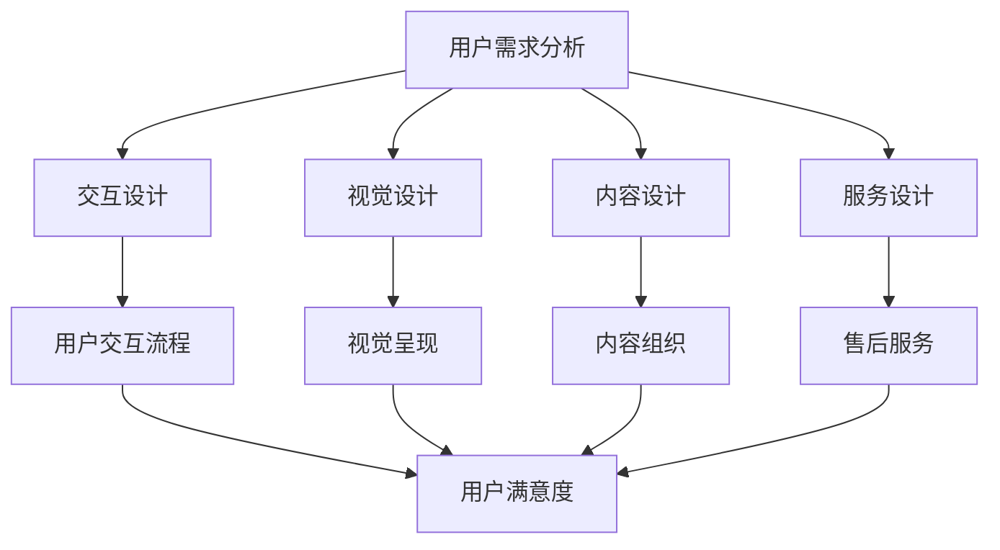

                 

 在当今信息爆炸的时代，知识付费已经成为了一种流行的商业模式。用户愿意为高质量、专业化的内容支付费用，而知识付费平台则通过提供丰富的课程、讲座、文章等，满足了用户的学习需求。然而，如何设计并优化用户体验，以吸引和留住用户，成为了知识付费平台成功的关键。本文将围绕知识付费平台的用户体验设计，探讨如何通过优化设计，提高用户满意度，实现知识付费的持续增长。

## 关键词 Keywords

- 知识付费
- 用户满意度
- 用户体验设计
- 优化策略
- 数据分析

## 摘要 Abstract

本文从用户体验设计的角度，分析了知识付费平台的核心需求和挑战。通过引入心理学、用户行为分析等理论，结合实际案例，提出了用户体验优化的策略和具体实施步骤。文章旨在为知识付费平台提供一套系统的用户体验设计方案，帮助平台提高用户满意度，实现商业价值的最大化。

### 1. 背景介绍 Introduction

随着互联网技术的发展，在线教育市场呈现出爆发式增长。知识付费作为其中的一种新兴商业模式，已经逐渐成为人们获取知识和技能的重要途径。知识付费平台通过提供各种类型的课程、讲座、文章等内容，满足用户的个性化学习需求。用户可以通过付费购买，获取独家、专业、高质量的内容，从而提升自身的知识和技能。

然而，知识付费市场的竞争日益激烈，平台之间的差异化竞争主要体现在内容质量、用户体验和服务质量等方面。如何通过优化用户体验设计，提高用户满意度，成为知识付费平台成功的关键。

### 2. 核心概念与联系 Core Concepts & Relationships

在用户体验设计中，以下几个核心概念至关重要：

1. **用户需求分析**：了解用户的需求和期望，是设计优质用户体验的基础。通过市场调研、用户访谈、问卷调查等方法，收集用户反馈，分析用户的痛点和需求。

2. **交互设计**：交互设计关注用户与产品之间的互动过程。良好的交互设计能够让用户在使用过程中感到舒适、自然，提高用户满意度。

3. **视觉设计**：视觉设计包括色彩、排版、图标等，是用户体验设计的重要组成部分。优秀的视觉设计能够吸引用户的注意力，提升用户的审美体验。

4. **内容设计**：内容设计关注内容的组织、呈现和传递。高质量、有价值的内容能够满足用户的需求，提高用户的粘性。

5. **服务设计**：服务设计包括用户购买、支付、售后等环节。良好的服务设计能够提升用户的购物体验，增加用户忠诚度。

下面是用户体验设计架构的Mermaid流程图：



### 3. 核心算法原理 & 具体操作步骤 Core Algorithm Principle & Specific Operation Steps

#### 3.1 算法原理概述

用户体验优化是一个多维度、动态调整的过程，涉及心理学、用户行为学、设计学等多个领域。核心算法原理包括以下几个方面：

1. **用户行为分析**：通过数据挖掘和分析用户行为，了解用户的使用习惯、偏好和需求。

2. **交互优化**：根据用户行为数据，调整交互设计，提高用户的操作效率和满意度。

3. **内容优化**：通过数据分析，优化内容呈现方式，提高内容的可读性和吸引力。

4. **视觉优化**：根据用户视觉偏好，调整色彩、排版等视觉元素，提高视觉体验。

5. **服务优化**：通过用户反馈和数据分析，优化售后服务，提升用户满意度。

#### 3.2 算法步骤详解

1. **数据收集与处理**：收集用户行为数据，包括访问记录、操作记录、反馈信息等，对数据进行清洗和整理。

2. **用户行为分析**：分析用户行为数据，挖掘用户的使用习惯、偏好和需求。

3. **交互设计优化**：根据用户行为分析结果，调整交互设计，提高用户的操作效率和满意度。

4. **内容设计优化**：根据用户需求，优化内容呈现方式，提高内容的可读性和吸引力。

5. **视觉设计优化**：根据用户视觉偏好，调整视觉元素，提高视觉体验。

6. **服务设计优化**：根据用户反馈和数据分析，优化售后服务，提升用户满意度。

7. **迭代优化**：持续收集用户反馈，对用户体验进行迭代优化。

#### 3.3 算法优缺点

**优点**：

1. **个性化体验**：通过用户行为分析，提供个性化的内容和服务，满足用户需求。

2. **提高用户满意度**：优化交互、内容、视觉和服务，提高用户的操作效率和满意度。

3. **提升平台竞争力**：良好的用户体验能够提升平台的品牌形象和用户忠诚度，增强竞争力。

**缺点**：

1. **数据收集和处理成本较高**：需要投入大量人力、物力和财力进行数据收集和处理。

2. **算法复杂度较高**：用户体验优化涉及到多个领域的知识，算法复杂度较高。

3. **用户体验迭代周期较长**：用户体验优化是一个动态调整的过程，需要较长的迭代周期。

#### 3.4 算法应用领域

1. **在线教育**：通过优化用户体验设计，提高在线教育平台的教学效果和用户满意度。

2. **电子商务**：通过优化用户体验设计，提高电子商务平台的销售额和用户忠诚度。

3. **社交媒体**：通过优化用户体验设计，提高社交媒体平台的使用频率和用户粘性。

### 4. 数学模型和公式 Mathematical Model & Detailed Explanation & Case Analysis

在用户体验优化过程中，数学模型和公式扮演着重要的角色。以下是一个简单的数学模型，用于评估用户满意度（User Satisfaction, US）：

\[ US = f(Interactivity, Visual Quality, Content Quality, Service Quality) \]

其中，\( f \) 是一个复杂的函数，表示用户体验质量对用户满意度的综合影响。

#### 4.1 数学模型构建

1. **交互性指标（Interactivity Score, IS）**：

\[ IS = \frac{Total Interactions}{Total Possible Interactions} \]

其中，Total Interactions 表示用户实际完成的交互次数，Total Possible Interactions 表示用户可以完成的交互次数。

2. **视觉质量指标（Visual Quality Score, VS）**：

\[ VS = \frac{Good Visual Feedback}{Total Visual Feedback} \]

其中，Good Visual Feedback 表示用户认为良好的视觉反馈，Total Visual Feedback 表示用户接收到的所有视觉反馈。

3. **内容质量指标（Content Quality Score, CS）**：

\[ CS = \frac{Total Useful Content}{Total Content} \]

其中，Total Useful Content 表示用户认为有用的内容，Total Content 表示平台提供的内容总量。

4. **服务质量指标（Service Quality Score, SS）**：

\[ SS = \frac{Good Service Experiences}{Total Service Experiences} \]

其中，Good Service Experiences 表示用户认为良好的服务体验，Total Service Experiences 表示用户经历的所有服务体验。

#### 4.2 公式推导过程

1. **交互性指标推导**：

交互性指标衡量用户在平台上的交互程度。一个较高的交互性指标表明用户对平台有较高的参与度。

2. **视觉质量指标推导**：

视觉质量指标衡量平台在视觉设计方面的表现。一个较高的视觉质量指标表明用户对平台的视觉体验满意。

3. **内容质量指标推导**：

内容质量指标衡量平台在内容提供方面的表现。一个较高的内容质量指标表明用户对平台的内容满意。

4. **服务质量指标推导**：

服务质量指标衡量平台在服务方面的表现。一个较高的服务质量指标表明用户对平台的服务满意。

#### 4.3 案例分析与讲解

以下是一个实际案例，用于说明如何使用上述数学模型评估用户满意度：

**案例背景**：一个在线教育平台想要评估其用户满意度。

**步骤 1**：收集数据：

- 用户完成的交互次数：1000 次
- 用户可以完成的交互次数：2000 次
- 用户认为良好的视觉反馈：500 次
- 用户接收到的所有视觉反馈：1000 次
- 用户认为有用的内容：100 次
- 平台提供的内容总量：500 次
- 用户认为良好的服务体验：50 次
- 用户经历的所有服务体验：100 次

**步骤 2**：计算指标：

- 交互性指标：\( IS = \frac{1000}{2000} = 0.5 \)
- 视觉质量指标：\( VS = \frac{500}{1000} = 0.5 \)
- 内容质量指标：\( CS = \frac{100}{500} = 0.2 \)
- 服务质量指标：\( SS = \frac{50}{100} = 0.5 \)

**步骤 3**：计算用户满意度：

\[ US = f(IS, VS, CS, SS) \]

根据函数 \( f \) 的计算结果，可以得到用户满意度 \( US \)。

### 5. 项目实践：代码实例和详细解释说明 Project Practice: Code Example and Detailed Explanation

下面是一个简单的Python代码实例，用于实现用户满意度评估的数学模型：

```python
# 用户满意度评估代码实例

# 输入数据
user_interactions = 1000
total_interactions = 2000
good_visual_feedback = 500
total_visual_feedback = 1000
useful_content = 100
total_content = 500
good_service_experience = 50
total_service_experience = 100

# 计算指标
interaction_score = user_interactions / total_interactions
visual_quality_score = good_visual_feedback / total_visual_feedback
content_quality_score = useful_content / total_content
service_quality_score = good_service_experience / total_service_experience

# 打印结果
print("交互性指标（IS）: {:.2f}".format(interaction_score))
print("视觉质量指标（VS）: {:.2f}".format(visual_quality_score))
print("内容质量指标（CS）: {:.2f}".format(content_quality_score))
print("服务质量指标（SS）: {:.2f}".format(service_quality_score))

# 计算用户满意度
user_satisfaction = (interaction_score + visual_quality_score + content_quality_score + service_quality_score) / 4
print("用户满意度（US）: {:.2f}".format(user_satisfaction))
```

通过上述代码，我们可以轻松地计算出用户满意度。在实际应用中，可以根据平台的具体数据和业务需求，对代码进行相应的调整和优化。

### 6. 实际应用场景 Practical Application Scenarios

知识付费平台的用户体验设计在实际应用中具有广泛的应用场景。以下是一些典型的应用案例：

1. **在线教育平台**：在线教育平台通过优化用户体验设计，提高课程的可读性、互动性和美观度，提升学生的学习效果和满意度。

2. **知识分享社区**：知识分享社区通过优化用户体验设计，提高内容的可发现性、可阅读性和互动性，激发用户的参与热情和创作意愿。

3. **专业咨询平台**：专业咨询平台通过优化用户体验设计，提高咨询服务的便捷性、专业性和服务质量，提升用户的信任度和满意度。

4. **企业培训平台**：企业培训平台通过优化用户体验设计，提高培训内容的实用性和吸引力，提升员工的学习积极性和工作效率。

#### 6.4 未来应用展望 Future Application Outlook

随着人工智能、大数据、云计算等技术的不断发展，知识付费平台的用户体验设计将迎来更多的创新和发展。以下是一些未来应用展望：

1. **个性化推荐**：通过人工智能技术，实现精准的内容推荐，满足用户的个性化需求，提高用户满意度和粘性。

2. **虚拟现实（VR）**：通过虚拟现实技术，打造沉浸式的学习体验，提升用户的参与感和体验感。

3. **社交互动**：通过社交互动功能，促进用户之间的交流和合作，增强社区氛围和用户归属感。

4. **智能客服**：通过人工智能技术，实现智能客服，提高服务效率和质量，提升用户满意度。

### 7. 工具和资源推荐 Tools and Resources Recommendations

为了更好地实现知识付费平台的用户体验设计，以下是一些建议的工具和资源：

#### 7.1 学习资源推荐

1. **《用户体验要素》**：由唐纳德·诺曼（Donald Norman）所著，介绍了用户体验设计的核心要素和设计原则。

2. **《点石成金》**：由史蒂夫·克拉申（Steve Krug）所著，提供了实用的用户体验设计技巧和案例。

3. **《设计心理学》**：由唐纳德·诺曼（Donald Norman）所著，深入探讨了心理学在用户体验设计中的应用。

#### 7.2 开发工具推荐

1. **Sketch**：一款强大的界面设计工具，支持矢量绘图和原型设计。

2. **Figma**：一款基于网页的界面设计工具，支持多人协作和实时预览。

3. **Adobe XD**：一款专业的界面设计工具，提供丰富的交互设计和原型功能。

#### 7.3 相关论文推荐

1. **"The Design of Everyday Things"**：由唐纳德·诺曼（Donald Norman）所著，探讨了产品设计中的用户体验设计原则。

2. **"User Experience Design: A Practical Introduction"**：由史蒂夫·克拉申（Steve Krug）所著，介绍了用户体验设计的实用方法和技巧。

3. **"The Art of User Interface Design"**：由乔纳森·切夫（Jonathan Chevreau）所著，探讨了界面设计中的用户体验设计原则和实践。

### 8. 总结 Conclusion

知识付费平台的用户体验设计是平台成功的关键。通过引入心理学、用户行为分析等理论，结合实际案例，本文提出了用户体验优化的策略和具体实施步骤。在未来，随着技术的不断发展，用户体验设计将继续创新和发展，为知识付费平台带来更多的机遇和挑战。

### 9. 附录 Appendix: Common Questions and Answers

#### 9.1 问题 1：用户体验设计的主要挑战是什么？

**回答**：用户体验设计的主要挑战包括：

1. **需求分析**：准确了解用户的需求和期望，是用户体验设计的基础。

2. **数据收集和处理**：收集用户行为数据，并对其进行处理和分析，需要投入大量人力、物力和财力。

3. **设计实施**：将用户体验设计理念转化为具体的设计方案，需要具备一定的设计能力和实践经验。

4. **迭代优化**：用户体验设计是一个动态调整的过程，需要不断收集用户反馈，进行迭代优化。

#### 9.2 问题 2：如何评估用户体验设计的效果？

**回答**：评估用户体验设计的效果可以从以下几个方面进行：

1. **用户满意度**：通过用户调研、问卷调查等方法，收集用户对平台用户体验的满意度评价。

2. **用户留存率**：通过用户留存数据，评估用户体验设计对用户粘性的影响。

3. **用户转化率**：通过用户转化数据，评估用户体验设计对用户购买行为的推动作用。

4. **用户活跃度**：通过用户活跃数据，评估用户体验设计对用户使用频率的影响。

#### 9.3 问题 3：用户体验设计与产品功能设计有何区别？

**回答**：用户体验设计与产品功能设计的主要区别在于：

1. **关注点**：用户体验设计关注用户在使用产品过程中的感受和体验，产品功能设计关注产品的功能和性能。

2. **目标**：用户体验设计的目标是提高用户的满意度、忠诚度和粘性，产品功能设计的目标是满足用户的需求、提升产品的竞争力。

3. **实现方式**：用户体验设计主要通过优化交互、视觉、内容和服务等方面来实现，产品功能设计主要通过开发、测试和优化产品功能来实现。

作者：禅与计算机程序设计艺术 / Zen and the Art of Computer Programming
----------------------------------------------------------------

### 结束语

本文从用户体验设计的角度，探讨了知识付费平台的优化策略。通过用户需求分析、交互设计、视觉设计、内容设计和服务设计等多个方面，提出了一套系统的用户体验优化方案。同时，本文还介绍了用户体验优化的核心算法原理、数学模型和实际应用场景，并推荐了相关的学习资源、开发工具和论文。希望本文能为知识付费平台提供有益的参考和启示，助力平台在激烈的市场竞争中脱颖而出。

在未来的研究中，我们将继续关注用户体验设计的最新发展趋势，探索更先进的优化算法和技术手段，以期为用户提供更加优质、个性化的学习体验。同时，我们也期待与业界同仁共同探讨和实践，共同推动用户体验设计的不断进步。

