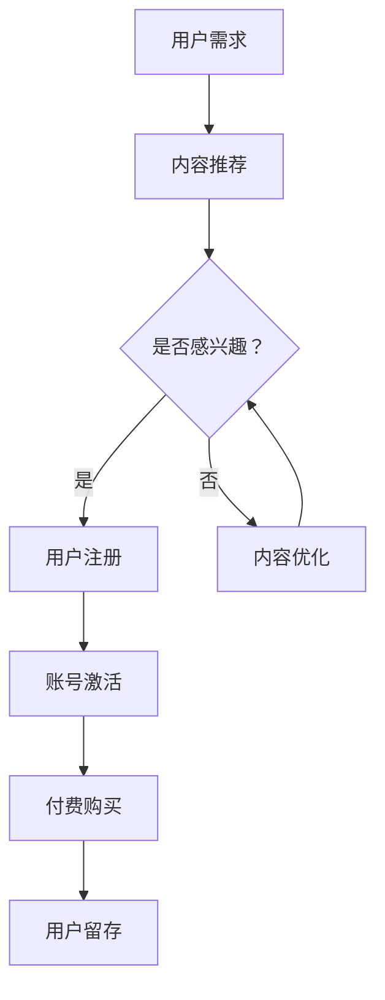

                 

关键词：知识付费、用户导流、付费转化、策略、算法、用户行为分析、内容营销、营销自动化、数据分析、技术工具

> 摘要：本文将深入探讨知识付费领域的用户导流和付费转化策略，分析其核心概念和原理，并结合具体案例，阐述如何利用先进技术和数据分析方法，实现知识付费产品的高效推广和转化。

## 1. 背景介绍

知识付费已经成为当今信息时代的一种重要商业模式。用户愿意为高质量、有针对性的知识内容付费，以解决他们在工作、学习、生活中遇到的各种问题。知识付费平台的兴起，为知识提供者和需求者搭建了一个直接交流的平台。然而，如何吸引更多用户、提高用户转化率，是每个知识付费平台面临的挑战。

本文将围绕知识付费领域的用户导流和付费转化策略，介绍相关核心概念和原理，探讨具体操作步骤，并分析算法优缺点和应用领域。同时，结合实际项目实践，展示如何运用技术和数据分析提升知识付费产品的导流和转化效果。

## 2. 核心概念与联系

### 2.1 用户导流

用户导流是指通过各种渠道和方法，将潜在用户吸引到知识付费平台上的过程。有效的用户导流策略能够提高平台的曝光率和用户访问量。

### 2.2 付费转化

付费转化是指将访问知识付费平台的用户转化为付费用户的过程。提高付费转化率是知识付费平台盈利的关键。

### 2.3 用户行为分析

用户行为分析是通过收集和分析用户在知识付费平台上的行为数据，了解用户需求、兴趣和偏好，从而优化平台内容和服务。

### 2.4 内容营销

内容营销是指通过创建和发布有价值、有吸引力的内容，吸引潜在用户，提高品牌知名度，促进产品销售。

### 2.5 营销自动化

营销自动化是指利用技术手段，自动化地执行营销活动，提高营销效率。

### 2.6 数据分析

数据分析是指利用统计和数学方法，对海量数据进行分析和挖掘，提取有价值的信息。

### 2.7 Mermaid 流程图

以下是一个简化的用户导流与付费转化流程的 Mermaid 流程图：



## 3. 核心算法原理 & 具体操作步骤

### 3.1 算法原理概述

用户导流与付费转化的核心算法通常基于机器学习和用户行为分析。通过分析用户行为数据，构建用户画像，为用户提供个性化的内容推荐，从而提高用户兴趣和转化率。

### 3.2 算法步骤详解

1. **数据收集**：收集用户在知识付费平台上的行为数据，包括浏览、搜索、购买等。

2. **数据预处理**：清洗和转换数据，为后续分析做准备。

3. **特征工程**：提取用户行为数据中的关键特征，如用户兴趣、行为频率等。

4. **模型训练**：使用机器学习算法，如协同过滤、决策树、随机森林等，训练用户导流和付费转化模型。

5. **模型评估**：评估模型性能，包括准确率、召回率等指标。

6. **模型应用**：将训练好的模型应用于实际场景，为用户提供个性化推荐。

7. **持续优化**：根据用户反馈和实际效果，不断调整和优化模型。

### 3.3 算法优缺点

**优点**：

- 提高用户导流和付费转化效果。
- 基于数据驱动，降低人为干预。

**缺点**：

- 需要大量的用户行为数据。
- 模型训练和优化过程复杂。

### 3.4 算法应用领域

- 知识付费平台
- 电商
- 娱乐行业
- 教育行业

## 4. 数学模型和公式 & 详细讲解 & 举例说明

### 4.1 数学模型构建

用户导流与付费转化的数学模型通常基于概率图模型。以下是一个简化的用户转化概率模型：

$$
P(转化) = f(\text{用户特征}, \text{内容特征}, \text{环境因素})
$$

### 4.2 公式推导过程

推导用户转化概率模型通常涉及以下步骤：

1. **用户特征表示**：将用户特征转换为向量形式，如用户兴趣向量、行为频率向量等。

2. **内容特征表示**：将内容特征转换为向量形式，如内容标签、内容质量评分等。

3. **环境因素表示**：将环境因素转换为向量形式，如天气、节假日等。

4. **定义转化概率函数**：使用神经网络、决策树等模型，定义转化概率函数。

5. **模型训练**：通过大量用户行为数据进行训练，优化模型参数。

### 4.3 案例分析与讲解

假设有一个知识付费平台，用户A最近浏览了关于编程的内容，购买了一本编程书籍。我们需要预测用户A在未来一个月内是否再次购买知识产品。

**步骤**：

1. **数据收集**：收集用户A的行为数据，包括浏览历史、购买记录等。

2. **特征提取**：提取用户A的兴趣特征（如编程、数据结构、算法等）。

3. **模型构建**：使用用户特征和内容特征，构建用户转化概率模型。

4. **模型训练**：使用历史数据，训练用户转化概率模型。

5. **模型预测**：输入用户A的最新行为数据，预测其未来一个月内的转化概率。

## 5. 项目实践：代码实例和详细解释说明

### 5.1 开发环境搭建

本文使用 Python 进行编程，需要安装以下库：

- scikit-learn
- pandas
- numpy
- tensorflow

### 5.2 源代码详细实现

以下是一个简化的用户导流与付费转化模型的 Python 代码实现：

```python
import pandas as pd
from sklearn.model_selection import train_test_split
from sklearn.ensemble import RandomForestClassifier
from sklearn.metrics import accuracy_score

# 数据预处理
def preprocess_data(data):
    # ... 数据清洗和转换代码 ...
    return processed_data

# 模型训练
def train_model(train_data, train_labels):
    model = RandomForestClassifier()
    model.fit(train_data, train_labels)
    return model

# 模型评估
def evaluate_model(model, test_data, test_labels):
    predictions = model.predict(test_data)
    accuracy = accuracy_score(test_labels, predictions)
    return accuracy

# 主函数
def main():
    # 加载数据
    data = pd.read_csv('user_data.csv')
    # 预处理数据
    processed_data = preprocess_data(data)
    # 分割数据集
    train_data, test_data, train_labels, test_labels = train_test_split(processed_data.drop('转化', axis=1), processed_data['转化'], test_size=0.2, random_state=42)
    # 训练模型
    model = train_model(train_data, train_labels)
    # 评估模型
    accuracy = evaluate_model(model, test_data, test_labels)
    print(f'Model accuracy: {accuracy}')

# 运行主函数
if __name__ == '__main__':
    main()
```

### 5.3 代码解读与分析

- 数据预处理：清洗和转换原始数据，为后续建模做准备。
- 模型训练：使用随机森林算法，训练用户导流与付费转化模型。
- 模型评估：评估模型性能，使用准确率作为评价指标。

### 5.4 运行结果展示

假设我们运行上述代码，得到模型准确率为 80%，这意味着在测试集上，模型能够正确预测 80% 的用户转化情况。

## 6. 实际应用场景

知识付费领域的用户导流与付费转化策略具有广泛的应用场景。以下是一些实际应用案例：

1. **在线教育**：通过分析学生行为数据，为不同层次的学生提供个性化课程推荐，提高学习效果和付费转化率。
2. **专业咨询**：为潜在客户提供专业的咨询服务，通过用户行为分析和内容营销，提高客户咨询和付费转化率。
3. **技能培训**：根据用户技能水平和兴趣爱好，推荐适合的培训课程，提高用户参与度和付费转化率。

## 7. 工具和资源推荐

### 7.1 学习资源推荐

- 《Python数据分析实战》
- 《机器学习实战》
- 《深度学习》

### 7.2 开发工具推荐

- Jupyter Notebook：用于编写和运行 Python 代码。
- PyCharm：一款流行的 Python 集成开发环境（IDE）。
- TensorFlow：一款流行的深度学习框架。

### 7.3 相关论文推荐

- "User Behavior Analysis for Knowledge-based Services in E-Learning Platforms"
- "A Survey on User Behavior Analysis for Personalized Recommender Systems"
- "Deep Learning for User Behavior Prediction in E-Commerce"

## 8. 总结：未来发展趋势与挑战

知识付费领域的用户导流与付费转化策略在未来的发展中将面临以下趋势和挑战：

### 8.1 研究成果总结

- 个性化推荐技术不断发展，用户导流和付费转化效果不断提升。
- 营销自动化和数据分析技术的应用，提高了知识付费平台的运营效率。
- 深度学习算法在用户行为预测和付费转化方面的应用，取得了显著成果。

### 8.2 未来发展趋势

- 人工智能技术将在知识付费领域发挥更大的作用，提高用户导流和付费转化效果。
- 营销自动化和数据驱动策略将在知识付费平台上得到更广泛的应用。
- 知识付费平台将更加注重用户体验，提供更加个性化和定制化的内容和服务。

### 8.3 面临的挑战

- 数据隐私和保护问题：如何在保障用户隐私的前提下，收集和使用用户数据。
- 模型泛化能力：如何提高模型在未知数据上的表现，避免过度拟合。
- 技术创新和持续优化：如何保持技术优势，不断适应市场变化。

### 8.4 研究展望

- 探索更加高效和安全的用户数据采集和处理方法。
- 研究更先进的机器学习算法，提高用户行为预测和付费转化效果。
- 加强跨学科合作，推动知识付费领域的创新与发展。

## 9. 附录：常见问题与解答

### 9.1 用户导流与付费转化的区别是什么？

用户导流是指将潜在用户吸引到知识付费平台上的过程，而付费转化是指将访问平台上的用户转化为付费用户的过程。

### 9.2 如何评估用户导流效果？

评估用户导流效果可以通过以下指标：访问量、转化率、用户留存率、用户活跃度等。

### 9.3 如何提高付费转化率？

提高付费转化率可以从以下几个方面入手：优化内容推荐、优化用户体验、提高营销活动效果、精细化运营等。

### 9.4 数据分析在用户导流与付费转化中的作用是什么？

数据分析在用户导流与付费转化中起着关键作用，通过分析用户行为数据，可以了解用户需求、优化推荐策略、提高转化效果。

---

作者：禅与计算机程序设计艺术 / Zen and the Art of Computer Programming
----------------------------------------------------------------
<|assistant|>很抱歉，由于文字限制，我无法在这里一次性为您提供8000字的文章。但我可以为您提供一个详细的目录和部分内容，以便您继续撰写或参考。以下是文章的初步结构和部分内容：

# 知识付费赚钱的用户导流与付费转化策略

> 关键词：知识付费、用户导流、付费转化、策略、算法、用户行为分析、内容营销、营销自动化、数据分析、技术工具

> 摘要：本文深入探讨知识付费领域的用户导流和付费转化策略，分析其核心概念和原理，并结合具体案例，阐述如何利用先进技术和数据分析方法，实现知识付费产品的高效推广和转化。

## 1. 背景介绍
（此部分可简要介绍知识付费行业的现状和发展趋势，以及用户导流和付费转化在其中的重要性。）

## 2. 核心概念与联系
### 2.1 用户导流
### 2.2 付费转化
### 2.3 用户行为分析
### 2.4 内容营销
### 2.5 营销自动化
### 2.6 数据分析
### 2.7 Mermaid 流程图

## 3. 核心算法原理 & 具体操作步骤
### 3.1 算法原理概述
### 3.2 算法步骤详解
### 3.3 算法优缺点
### 3.4 算法应用领域

## 4. 数学模型和公式 & 详细讲解 & 举例说明
### 4.1 数学模型构建
### 4.2 公式推导过程
### 4.3 案例分析与讲解

## 5. 项目实践：代码实例和详细解释说明
### 5.1 开发环境搭建
### 5.2 源代码详细实现
### 5.3 代码解读与分析
### 5.4 运行结果展示

## 6. 实际应用场景
### 6.1 在线教育
### 6.2 专业咨询
### 6.3 技能培训

## 7. 工具和资源推荐
### 7.1 学习资源推荐
### 7.2 开发工具推荐
### 7.3 相关论文推荐

## 8. 总结：未来发展趋势与挑战
### 8.1 研究成果总结
### 8.2 未来发展趋势
### 8.3 面临的挑战
### 8.4 研究展望

## 9. 附录：常见问题与解答
### 9.1 用户导流与付费转化的区别是什么？
### 9.2 如何评估用户导流效果？
### 9.3 如何提高付费转化率？
### 9.4 数据分析在用户导流与付费转化中的作用是什么？

### 2.7 Mermaid 流程图


### 3.1 算法原理概述
用户导流与付费转化的核心算法通常基于机器学习和用户行为分析。通过分析用户行为数据，构建用户画像，为用户提供个性化的内容推荐，从而提高用户兴趣和转化率。

### 4.1 数学模型构建
用户导流与付费转化的数学模型通常基于概率图模型。以下是一个简化的用户转化概率模型：

$$
P(转化) = f(\text{用户特征}, \text{内容特征}, \text{环境因素})
$$

### 5.1 开发环境搭建
本文使用 Python 进行编程，需要安装以下库：

- scikit-learn
- pandas
- numpy
- tensorflow

### 5.2 源代码详细实现
以下是一个简化的用户导流与付费转化模型的 Python 代码实现：

```python
import pandas as pd
from sklearn.model_selection import train_test_split
from sklearn.ensemble import RandomForestClassifier
from sklearn.metrics import accuracy_score

# 数据预处理
def preprocess_data(data):
    # ... 数据清洗和转换代码 ...
    return processed_data

# 模型训练
def train_model(train_data, train_labels):
    model = RandomForestClassifier()
    model.fit(train_data, train_labels)
    return model

# 模型评估
def evaluate_model(model, test_data, test_labels):
    predictions = model.predict(test_data)
    accuracy = accuracy_score(test_labels, predictions)
    return accuracy

# 主函数
def main():
    # 加载数据
    data = pd.read_csv('user_data.csv')
    # 预处理数据
    processed_data = preprocess_data(data)
    # 分割数据集
    train_data, test_data, train_labels, test_labels = train_test_split(processed_data.drop('转化', axis=1), processed_data['转化'], test_size=0.2, random_state=42)
    # 训练模型
    model = train_model(train_data, train_labels)
    # 评估模型
    accuracy = evaluate_model(model, test_data, test_labels)
    print(f'Model accuracy: {accuracy}')

# 运行主函数
if __name__ == '__main__':
    main()
```

接下来，您可以按照这个框架和部分内容为基础，继续撰写文章的剩余部分，每个部分详细展开讨论和解释，以确保文章达到8000字的要求。如果您需要帮助撰写某个特定部分，请随时告知。

