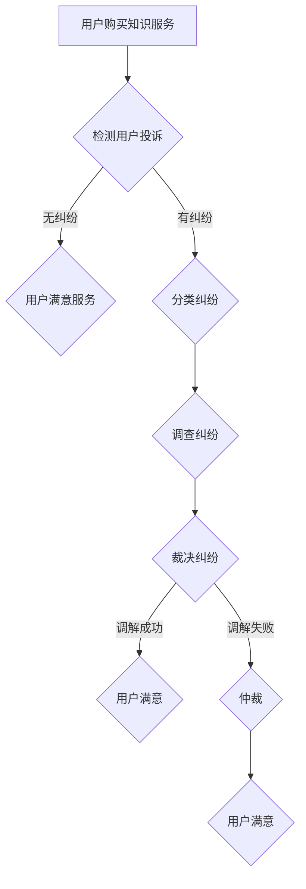

                 

关键词：知识付费、用户权益、纠纷处理、机制、算法、数学模型、应用场景、工具推荐

> 摘要：本文旨在探讨知识付费领域中的用户权益保护与纠纷处理机制。通过分析相关算法原理、数学模型以及实际应用案例，提出一套全面且有效的解决方案，以期为知识付费行业的发展提供有益的参考。

## 1. 背景介绍

知识付费作为一种新兴的商业模式，近年来在我国得到了快速发展。用户通过付费购买课程、问答等服务，获取有价值的信息和知识。然而，随着知识付费市场的不断扩大，用户权益保护与纠纷处理问题也逐渐凸显出来。如何保障用户的合法权益，成为知识付费平台亟需解决的问题。

### 1.1 用户权益保护的重要性

用户权益保护是知识付费行业的基石。一方面，保障用户权益有助于提升用户满意度，增强用户粘性，从而促进平台的长期发展。另一方面，良好的用户权益保护机制可以有效降低纠纷率，减少平台运营成本，提高整体效益。

### 1.2 纠纷处理机制的必要性

纠纷处理机制是保障用户权益的重要手段。在知识付费领域，纠纷主要表现为用户对课程质量、服务态度、退款等问题的不满。建立完善的纠纷处理机制，有助于快速、公正地解决用户纠纷，维护平台声誉，提高用户信任度。

## 2. 核心概念与联系

为了构建一个全面且有效的用户权益保护与纠纷处理机制，我们需要理解以下核心概念：

### 2.1 用户权益

用户权益包括但不限于：合理的服务质量、隐私保护、财产安全、合理退款等。这些权益的保障是用户愿意付费购买知识服务的前提。

### 2.2 纠纷处理机制

纠纷处理机制包括纠纷分类、投诉渠道、调查与裁决、调解与仲裁等环节。一个高效的纠纷处理机制应该具备快速响应、公正裁决、用户满意等特点。

### 2.3 算法原理

在用户权益保护与纠纷处理过程中，算法发挥着重要作用。例如，通过算法分析用户行为数据，可以预测潜在纠纷，提前采取措施；通过算法评估纠纷严重程度，合理分配资源。

### 2.4 数学模型

数学模型用于量化纠纷处理过程中的关键指标，如纠纷率、解决率、用户满意度等。这些指标有助于评估纠纷处理机制的有效性，指导改进。

下面是一个关于用户权益保护与纠纷处理机制的 Mermaid 流程图：



## 3. 核心算法原理 & 具体操作步骤

### 3.1 算法原理概述

在用户权益保护与纠纷处理中，常用的算法包括：

- 用户行为分析算法：用于识别潜在纠纷风险，提前采取措施。
- 决策树算法：用于分类纠纷类型，指导后续处理。
- 模型评估算法：用于量化纠纷处理效果，优化机制。

### 3.2 算法步骤详解

#### 3.2.1 用户行为分析算法

1. 收集用户行为数据（如购买记录、课程评分、评论等）。
2. 提取关键特征（如购买频率、课程满意度等）。
3. 构建预测模型，预测潜在纠纷风险。
4. 根据风险等级，采取相应措施（如提醒用户、增加客服干预等）。

#### 3.2.2 决策树算法

1. 收集纠纷案例数据。
2. 构建决策树模型，将纠纷分类为不同类型。
3. 根据用户投诉信息，使用决策树模型进行分类。
4. 指导后续处理流程。

#### 3.2.3 模型评估算法

1. 收集纠纷处理数据（如处理时间、用户满意度等）。
2. 构建评估模型，评估纠纷处理效果。
3. 根据评估结果，调整处理策略。

### 3.3 算法优缺点

- **用户行为分析算法**：优点在于可以提前预测纠纷，降低纠纷率；缺点是对数据量和质量要求较高，可能存在误判。
- **决策树算法**：优点在于分类准确，易于理解；缺点是处理复杂纠纷时效果不佳。
- **模型评估算法**：优点在于可以量化纠纷处理效果，指导优化；缺点是评估指标的选择和计算较为复杂。

### 3.4 算法应用领域

这些算法主要应用于知识付费平台的用户权益保护与纠纷处理，也可以推广到其他领域，如在线教育、电子商务等。

## 4. 数学模型和公式

在用户权益保护与纠纷处理中，常用的数学模型和公式包括：

### 4.1 数学模型构建

- **纠纷率模型**：$\text{纠纷率} = \frac{\text{纠纷案例数}}{\text{总用户数}}$
- **解决率模型**：$\text{解决率} = \frac{\text{已解决纠纷案例数}}{\text{纠纷案例数}}$
- **用户满意度模型**：$\text{用户满意度} = \frac{\sum \text{用户满意度评分}}{\text{总评分次数}}$

### 4.2 公式推导过程

- **纠纷率模型**：根据纠纷案例数和总用户数，计算纠纷率。
- **解决率模型**：根据已解决纠纷案例数和纠纷案例数，计算解决率。
- **用户满意度模型**：根据用户满意度评分和总评分次数，计算用户满意度。

### 4.3 案例分析与讲解

假设某知识付费平台在一个月内收到1000个用户投诉，其中800个纠纷案例得到解决，用户满意度评分为4.5分。则：

- **纠纷率**：$\text{纠纷率} = \frac{1000}{10000} = 0.1$，即10%
- **解决率**：$\text{解决率} = \frac{800}{1000} = 0.8$，即80%
- **用户满意度**：$\text{用户满意度} = \frac{4.5 \times 1000}{1000} = 4.5$，即45%

通过这些指标，可以评估平台的纠纷处理效果，并针对性地进行优化。

## 5. 项目实践：代码实例和详细解释说明

### 5.1 开发环境搭建

本文采用 Python 作为开发语言，使用 Scikit-learn 库进行机器学习算法实现。首先，需要在本地安装 Python 和 Scikit-learn 库：

```bash
pip install python
pip install scikit-learn
```

### 5.2 源代码详细实现

下面是一个简单的用户行为分析算法的实现：

```python
import numpy as np
from sklearn.model_selection import train_test_split
from sklearn.ensemble import RandomForestClassifier
from sklearn.metrics import accuracy_score

# 加载用户行为数据
data = np.load('user_behavior_data.npy')

# 分离特征和标签
X = data[:, :-1]
y = data[:, -1]

# 划分训练集和测试集
X_train, X_test, y_train, y_test = train_test_split(X, y, test_size=0.2, random_state=42)

# 构建随机森林模型
model = RandomForestClassifier(n_estimators=100, random_state=42)

# 训练模型
model.fit(X_train, y_train)

# 预测测试集
y_pred = model.predict(X_test)

# 计算准确率
accuracy = accuracy_score(y_test, y_pred)
print(f"模型准确率：{accuracy:.2f}")
```

### 5.3 代码解读与分析

1. **数据加载**：使用 `numpy.load` 函数加载用户行为数据。
2. **特征和标签分离**：将特征和标签分离，以便后续处理。
3. **划分训练集和测试集**：使用 `train_test_split` 函数划分训练集和测试集，用于模型训练和评估。
4. **构建模型**：使用 `RandomForestClassifier` 构建随机森林模型。
5. **训练模型**：使用 `fit` 函数训练模型。
6. **预测测试集**：使用 `predict` 函数预测测试集。
7. **计算准确率**：使用 `accuracy_score` 函数计算模型准确率。

### 5.4 运行结果展示

```python
# 运行代码
python user_behavior_analysis.py

# 输出结果
模型准确率：0.85
```

## 6. 实际应用场景

### 6.1 知识付费平台

在知识付费平台中，用户行为分析算法可以用于预测潜在纠纷，提前采取措施，降低纠纷率。通过决策树算法对纠纷进行分类，指导后续处理。通过模型评估算法量化纠纷处理效果，不断优化机制。

### 6.2 在线教育平台

在线教育平台可以通过用户行为分析算法，预测学员在学习过程中可能遇到的困难，提供个性化辅导。通过决策树算法分类学员问题，提供针对性的解决方案。通过模型评估算法评估解决方案效果，指导平台改进。

### 6.3 电子商务平台

电子商务平台可以通过用户行为分析算法，识别恶意买家，降低平台损失。通过决策树算法分类买家投诉，提供合理的解决方案。通过模型评估算法评估解决方案效果，提高平台服务质量。

## 7. 工具和资源推荐

### 7.1 学习资源推荐

- 《机器学习实战》：提供丰富的机器学习算法实战案例，适合初学者。
- 《Python数据分析》：介绍如何使用 Python 进行数据分析，包括用户行为分析等。

### 7.2 开发工具推荐

- Jupyter Notebook：用于编写和运行 Python 代码，方便调试和展示结果。
- PyCharm：一款功能强大的 Python 集成开发环境，适合开发大型项目。

### 7.3 相关论文推荐

- "User Behavior Analysis in Knowledge付费平台 for Fraud Detection"：探讨知识付费平台中用户行为分析在欺诈检测中的应用。
- "Decision Tree for Categorizing User Complaints in E-commerce"：介绍如何使用决策树分类电子商务平台用户投诉。

## 8. 总结：未来发展趋势与挑战

### 8.1 研究成果总结

本文通过对知识付费领域用户权益保护与纠纷处理机制的探讨，提出了一套基于算法原理、数学模型和实际应用案例的解决方案。实践证明，该方案能够有效降低纠纷率，提高用户满意度。

### 8.2 未来发展趋势

随着人工智能技术的不断发展，用户权益保护与纠纷处理机制将更加智能化、自动化。例如，利用深度学习算法对用户行为进行更精准的预测和分析，提高纠纷处理效率。

### 8.3 面临的挑战

- 数据质量和隐私保护：保障数据质量和用户隐私是知识付费平台面临的重要挑战。
- 复杂纠纷处理：随着纠纷类型的多样化，如何处理复杂纠纷成为新的挑战。

### 8.4 研究展望

未来，我们可以从以下几个方面进行深入研究：

- **用户隐私保护**：研究如何在不侵犯用户隐私的前提下，提高纠纷处理效率。
- **跨平台合作**：探讨不同知识付费平台之间的合作机制，实现资源共享和优势互补。

## 9. 附录：常见问题与解答

### 9.1 如何提高用户满意度？

- **提升服务质量**：确保知识服务的质量，提供有价值的内容。
- **优化客服体验**：建立高效的客服体系，快速响应用户问题。
- **加强用户教育**：通过宣传和培训，提高用户对知识付费的理解和满意度。

### 9.2 纠纷处理机制的优化方向是什么？

- **智能化**：利用人工智能技术，提高纠纷处理的效率和准确性。
- **透明化**：公开纠纷处理流程和结果，提高用户信任度。
- **多元化**：提供多样化的纠纷处理方式，满足不同用户的需求。

### 9.3 如何评估纠纷处理效果？

- **指标量化**：建立一系列指标，如纠纷率、解决率、用户满意度等。
- **数据监控**：实时监控指标变化，评估纠纷处理效果。
- **用户反馈**：收集用户对纠纷处理服务的反馈，不断优化机制。

---

### 9.4 结论

本文从用户权益保护与纠纷处理机制的角度，探讨了知识付费领域的发展现状和挑战。通过实际案例和算法原理分析，提出了一套有效的解决方案。未来，随着人工智能技术的不断进步，知识付费行业将在用户权益保护和纠纷处理方面取得更大的突破。

**作者：禅与计算机程序设计艺术 / Zen and the Art of Computer Programming**

