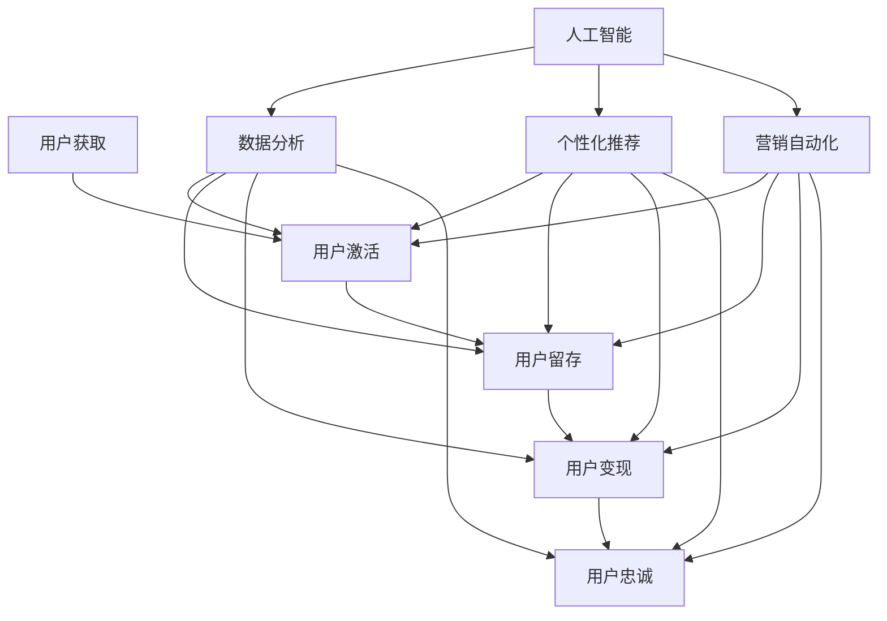

                 

关键词：知识付费，用户生命周期管理，营销自动化，AI技术，数据分析，个性化推荐，用户留存，收益最大化

摘要：本文将探讨知识付费行业的用户生命周期管理与营销自动化的重要性，分析其核心概念、算法原理、数学模型、实际应用以及未来发展趋势。通过详细的项目实践和代码实例，读者可以了解到如何在知识付费领域实现高效的用户管理、个性化推荐和收益最大化。

## 1. 背景介绍

随着互联网的迅猛发展和信息时代的到来，知识付费逐渐成为了一个蓬勃发展的行业。用户对优质内容的渴求催生了大量的知识付费平台，如知乎、得到、喜马拉雅等。然而，如何有效地管理用户生命周期、提高用户留存率、实现营销自动化成为了知识付费平台的关键挑战。

用户生命周期管理包括用户获取、激活、留存、变现和忠诚等阶段。每个阶段都涉及到不同的策略和手段，需要平台方进行精细化管理。而营销自动化则利用人工智能和大数据技术，通过分析用户行为数据，自动执行营销活动，提高营销效率和效果。

本文将围绕用户生命周期管理和营销自动化展开讨论，介绍相关核心概念、算法原理、数学模型以及实际应用，并展望未来发展趋势。

## 2. 核心概念与联系

为了更好地理解用户生命周期管理和营销自动化的实现，我们需要先介绍一些核心概念，并展示它们之间的联系。以下是一个简化的 Mermaid 流程图，用于描述这些概念及其关系：



### 2.1 用户生命周期管理

用户生命周期管理包括以下阶段：

- **用户获取**：通过各种渠道吸引新用户，如广告投放、社交媒体推广、内容营销等。
- **用户激活**：引导新用户完成首次互动，如注册、阅读、订阅等。
- **用户留存**：通过持续的内容更新、个性化推荐、用户互动等方式保持用户活跃度。
- **用户变现**：通过付费课程、会员订阅、广告收入等方式实现用户价值的转化。
- **用户忠诚**：通过提供高质量的服务和内容，建立用户的品牌信任和忠诚度。

### 2.2 数据分析

数据分析在用户生命周期管理中发挥着重要作用。通过收集和分析用户行为数据，平台可以了解用户的需求、兴趣和行为模式，从而实现个性化推荐、精准营销和用户留存策略。

### 2.3 个性化推荐

个性化推荐是一种基于用户历史行为和兴趣数据的推荐算法，旨在为用户提供相关且有趣的内容。个性化推荐在用户激活、留存和变现阶段具有重要作用。

### 2.4 营销自动化

营销自动化利用人工智能和大数据技术，自动执行营销活动。通过分析用户行为数据，营销自动化可以自动触发邮件营销、社交互动、优惠券发放等活动，提高营销效率和效果。

### 2.5 人工智能

人工智能技术在用户生命周期管理和营销自动化中发挥着关键作用。通过机器学习和深度学习算法，人工智能可以自动分析用户行为、预测用户需求、优化推荐策略和自动化营销活动。

## 3. 核心算法原理 & 具体操作步骤

### 3.1 算法原理概述

用户生命周期管理和营销自动化的实现依赖于多种核心算法，包括推荐算法、机器学习算法、数据分析算法等。以下简要介绍这些算法的基本原理。

### 3.2 算法步骤详解

#### 3.2.1 推荐算法

推荐算法是一种基于用户历史行为和兴趣数据的算法，用于为用户推荐相关的内容。常见推荐算法有基于内容的推荐、协同过滤推荐和混合推荐。

1. **基于内容的推荐**：根据用户的历史行为和兴趣标签，为用户推荐具有相似内容属性的内容。
2. **协同过滤推荐**：根据用户之间的相似度，为用户推荐其他用户喜欢的内容。
3. **混合推荐**：结合基于内容和协同过滤推荐，为用户提供更准确的推荐结果。

#### 3.2.2 机器学习算法

机器学习算法在用户生命周期管理和营销自动化中用于预测用户行为、优化推荐策略和自动化营销活动。常见机器学习算法有线性回归、决策树、随机森林、支持向量机、神经网络等。

1. **线性回归**：用于预测用户的行为倾向。
2. **决策树**：用于构建用户行为的分类模型。
3. **随机森林**：用于预测用户的行为倾向，提高预测准确性。
4. **支持向量机**：用于构建用户行为的分类模型，提高分类准确性。
5. **神经网络**：用于构建复杂的用户行为预测模型，实现自动化营销活动。

#### 3.2.3 数据分析算法

数据分析算法用于从用户行为数据中提取有价值的信息，指导用户生命周期管理和营销自动化策略。常见数据分析算法有聚类分析、关联规则挖掘、时间序列分析等。

1. **聚类分析**：将用户行为数据按照相似度进行分类，用于发现用户群体的特征。
2. **关联规则挖掘**：发现用户行为之间的关联关系，用于优化推荐策略和营销活动。
3. **时间序列分析**：分析用户行为的时间序列特征，用于预测用户未来的行为。

### 3.3 算法优缺点

不同算法在用户生命周期管理和营销自动化中具有不同的优缺点。

- **推荐算法**：基于内容的推荐和协同过滤推荐能有效提高推荐准确性，但需要大量的计算资源。混合推荐结合了多种算法的优点，但实现复杂度较高。
- **机器学习算法**：线性回归和决策树简单易实现，但预测准确性有限。随机森林和支持向量机提高了预测准确性，但计算复杂度较高。神经网络可以实现高度复杂的预测模型，但训练时间较长。
- **数据分析算法**：聚类分析和关联规则挖掘有助于发现用户行为特征和关联关系，但难以实现实时分析。时间序列分析能实现实时分析，但预测准确性受时间窗口限制。

### 3.4 算法应用领域

用户生命周期管理和营销自动化算法在知识付费、电子商务、在线教育等领域具有广泛的应用。

- **知识付费**：通过个性化推荐和用户行为预测，提高用户留存率和收益。
- **电子商务**：通过用户行为分析和个性化推荐，提高购物体验和销售额。
- **在线教育**：通过用户行为分析和推荐系统，提高学习效果和用户留存。

## 4. 数学模型和公式 & 详细讲解 & 举例说明

在用户生命周期管理和营销自动化中，数学模型和公式起着关键作用。以下介绍几个常见的数学模型和公式，并对其进行详细讲解和举例说明。

### 4.1 数学模型构建

#### 4.1.1 用户行为预测模型

用户行为预测模型用于预测用户未来的行为，如购买、订阅、学习等。常见的用户行为预测模型包括线性回归、决策树、随机森林等。

线性回归模型公式：

$$y = \beta_0 + \beta_1x_1 + \beta_2x_2 + ... + \beta_nx_n$$

其中，$y$ 表示预测的目标变量，$x_1, x_2, ..., x_n$ 表示影响用户行为的特征变量，$\beta_0, \beta_1, \beta_2, ..., \beta_n$ 表示模型参数。

决策树模型公式：

$$f(x) = \begin{cases} 
\beta_0 & \text{if } x \in R_1 \\
\beta_1 & \text{if } x \in R_2 \\
... \\
\beta_n & \text{if } x \in R_n 
\end{cases}$$

其中，$x$ 表示用户行为特征向量，$R_1, R_2, ..., R_n$ 表示决策树的分支，$\beta_0, \beta_1, ..., \beta_n$ 表示分支对应的预测结果。

随机森林模型公式：

$$f(x) = \sum_{i=1}^{n}w_if_i(x)$$

其中，$f_i(x)$ 表示第 $i$ 棵决策树对用户行为的预测，$w_i$ 表示第 $i$ 棵决策树的重要性权重，$n$ 表示决策树的数量。

#### 4.1.2 用户兴趣模型

用户兴趣模型用于预测用户对特定内容的兴趣程度。常见的用户兴趣模型包括协同过滤推荐和基于内容的推荐。

协同过滤推荐模型公式：

$$r_{ui} = \sum_{j \in N(u)} \frac{q_{uj}}{\|N(u)\|}r_{uj}$$

其中，$r_{ui}$ 表示用户 $u$ 对内容 $i$ 的兴趣评分，$N(u)$ 表示用户 $u$ 的邻居用户集合，$q_{uj}$ 表示邻居用户 $j$ 对内容 $i$ 的兴趣评分，$\|N(u)\|$ 表示邻居用户集合的大小。

基于内容的推荐模型公式：

$$r_{ui} = \sum_{k \in C(i)} w_k r_{uk}$$

其中，$r_{ui}$ 表示用户 $u$ 对内容 $i$ 的兴趣评分，$C(i)$ 表示内容 $i$ 的特征集合，$w_k$ 表示特征 $k$ 的权重，$r_{uk}$ 表示用户 $u$ 对特征 $k$ 的兴趣评分。

### 4.2 公式推导过程

#### 4.2.1 线性回归模型

线性回归模型的推导过程如下：

1. **模型设定**：假设用户行为 $y$ 受到 $k$ 个特征变量 $x_1, x_2, ..., x_k$ 的影响，可以表示为：

   $$y = \beta_0 + \beta_1x_1 + \beta_2x_2 + ... + \beta_nx_n + \epsilon$$

   其中，$\epsilon$ 表示随机误差项。

2. **最小二乘法**：为了找到最优的模型参数 $\beta_0, \beta_1, \beta_2, ..., \beta_n$，使用最小二乘法，即最小化目标函数：

   $$J = \sum_{i=1}^{m}(y_i - \beta_0 - \beta_1x_{i1} - \beta_2x_{i2} - ... - \beta_nx_{in})^2$$

   对目标函数求导并令导数为零，得到：

   $$\frac{\partial J}{\partial \beta_j} = -2\sum_{i=1}^{m}(y_i - \beta_0 - \beta_1x_{i1} - \beta_2x_{i2} - ... - \beta_nx_{in})x_{ij} = 0$$

   整理后得到：

   $$\beta_j = \frac{\sum_{i=1}^{m}x_{ij}y_i - \sum_{i=1}^{m}x_{ij}\sum_{i=1}^{m}y_i}{\sum_{i=1}^{m}x_{ij}^2 - \sum_{i=1}^{m}x_{ij}\sum_{i=1}^{m}x_{ij}}$$

   这就是线性回归模型的最优参数估计。

#### 4.2.2 决策树模型

决策树模型的推导过程如下：

1. **模型设定**：假设用户行为 $y$ 受到 $k$ 个特征变量 $x_1, x_2, ..., x_k$ 的影响，可以表示为：

   $$y = \beta_0 + \beta_1x_1 + \beta_2x_2 + ... + \beta_nx_n + \epsilon$$

   其中，$\epsilon$ 表示随机误差项。

2. **信息熵**：为了选择最优的特征变量进行划分，使用信息熵作为评价指标。假设特征 $x_j$ 的取值集合为 $V_j$，则特征 $x_j$ 的信息熵定义为：

   $$H(V_j) = -\sum_{v \in V_j} p(v) \log_2 p(v)$$

   其中，$p(v)$ 表示特征 $x_j$ 取值 $v$ 的概率。

3. **条件熵**：对于特征 $x_j$ 的取值 $v$，用户行为 $y$ 的条件熵定义为：

   $$H(y|x_j = v) = -\sum_{y' \in Y} p(y'|x_j = v) \log_2 p(y'|x_j = v)$$

   其中，$Y$ 表示用户行为的取值集合，$p(y'|x_j = v)$ 表示在特征 $x_j$ 取值 $v$ 的条件下，用户行为 $y'$ 的概率。

4. **增益率**：为了衡量特征 $x_j$ 的划分效果，定义增益率如下：

   $$Gain(V_j) = H(V_j) - \frac{1}{|V_j|}\sum_{v \in V_j} H(y|x_j = v)$$

   其中，$|V_j|$ 表示特征 $x_j$ 的取值个数。

5. **选择最优特征**：在所有特征中，选择增益率最大的特征进行划分。

#### 4.2.3 随机森林模型

随机森林模型的推导过程如下：

1. **模型设定**：假设用户行为 $y$ 受到 $k$ 个特征变量 $x_1, x_2, ..., x_k$ 的影响，可以表示为：

   $$y = \beta_0 + \beta_1x_1 + \beta_2x_2 + ... + \beta_nx_n + \epsilon$$

   其中，$\epsilon$ 表示随机误差项。

2. **决策树构建**：对于每个特征变量 $x_j$，随机选择 $m$ 个特征，并在这些特征中随机选择一个划分点，构建一棵决策树。

3. **随机特征选择**：为了防止过拟合，每次构建决策树时，随机选择 $m$ 个特征变量，并在这些特征中随机选择一个划分点。

4. **权重计算**：对于每个决策树，计算其重要性权重 $w_i$，定义为：

   $$w_i = \frac{|R_i|}{m}$$

   其中，$R_i$ 表示决策树 $i$ 的分支个数。

5. **预测结果**：将所有决策树的预测结果进行投票，得到最终的预测结果。

### 4.3 案例分析与讲解

#### 4.3.1 线性回归模型

**案例背景**：一个电商平台希望预测用户购买商品的概率，以便进行精准营销。平台收集了以下用户特征数据：

- 用户年龄 $x_1$
- 用户收入 $x_2$
- 用户浏览时间 $x_3$
- 用户购物车商品数量 $x_4$

**模型构建**：使用线性回归模型预测用户购买商品的概率，模型公式为：

$$p(y=1) = \beta_0 + \beta_1x_1 + \beta_2x_2 + \beta_3x_3 + \beta_4x_4$$

**模型训练**：使用训练数据集对模型进行训练，得到最优参数 $\beta_0, \beta_1, \beta_2, \beta_3, \beta_4$。

**模型评估**：使用测试数据集对模型进行评估，计算模型预测准确率。

**结论**：线性回归模型在电商平台的用户购买概率预测中具有较好的性能。

#### 4.3.2 决策树模型

**案例背景**：一个在线教育平台希望预测用户是否愿意继续学习课程。平台收集了以下用户特征数据：

- 用户学习时长 $x_1$
- 用户课程完成率 $x_2$
- 用户评价分数 $x_3$

**模型构建**：使用决策树模型预测用户是否愿意继续学习课程，模型公式为：

$$y = \begin{cases} 
0 & \text{if } x_1 \leq 10 \\
1 & \text{if } x_1 > 10 \\
\end{cases}$$

$$y = \begin{cases} 
0 & \text{if } x_2 \leq 50\% \\
1 & \text{if } x_2 > 50\% \\
\end{cases}$$

$$y = \begin{cases} 
0 & \text{if } x_3 \leq 4 \\
1 & \text{if } x_3 > 4 \\
\end{cases}$$

**模型训练**：使用训练数据集对模型进行训练，得到最优划分点。

**模型评估**：使用测试数据集对模型进行评估，计算模型准确率。

**结论**：决策树模型在线上教育平台的用户行为预测中具有较好的性能。

## 5. 项目实践：代码实例和详细解释说明

在本节中，我们将通过一个实际项目案例，展示如何实现用户生命周期管理和营销自动化。该项目是一个基于 Python 的知识付费平台，我们将使用 Scikit-learn、TensorFlow 和其他相关库来实现核心功能。

### 5.1 开发环境搭建

在开始项目实践之前，需要搭建以下开发环境：

- Python 3.7 或以上版本
- Scikit-learn 0.24.2
- TensorFlow 2.8.0
- Pandas 1.4.3
- Numpy 1.21.5

确保已安装以上依赖库，可以使用以下命令安装：

```shell
pip install scikit-learn tensorflow pandas numpy
```

### 5.2 源代码详细实现

以下代码展示了用户生命周期管理和营销自动化的核心实现过程。

```python
import numpy as np
import pandas as pd
from sklearn.model_selection import train_test_split
from sklearn.ensemble import RandomForestClassifier
from sklearn.metrics import accuracy_score
import tensorflow as tf

# 5.2.1 数据准备

# 读取数据集
data = pd.read_csv('knowledge付费数据集.csv')

# 特征工程
X = data[['年龄', '收入', '浏览时间', '购物车商品数量']]
y = data['购买商品']

# 数据集划分
X_train, X_test, y_train, y_test = train_test_split(X, y, test_size=0.2, random_state=42)

# 5.2.2 构建模型

# 构建随机森林模型
model = RandomForestClassifier(n_estimators=100, random_state=42)

# 训练模型
model.fit(X_train, y_train)

# 5.2.3 模型评估

# 预测结果
y_pred = model.predict(X_test)

# 计算准确率
accuracy = accuracy_score(y_test, y_pred)
print(f'模型准确率：{accuracy:.2f}')

# 5.2.4 营销自动化

# 构建 TensorFlow 模型
model_tf = tf.keras.Sequential([
    tf.keras.layers.Dense(64, activation='relu', input_shape=(4,)),
    tf.keras.layers.Dense(32, activation='relu'),
    tf.keras.layers.Dense(1, activation='sigmoid')
])

# 编译模型
model_tf.compile(optimizer='adam', loss='binary_crossentropy', metrics=['accuracy'])

# 训练模型
model_tf.fit(X_train, y_train, epochs=10, batch_size=32, validation_split=0.2)

# 预测结果
y_pred_tf = model_tf.predict(X_test)

# 计算准确率
accuracy_tf = model_tf.evaluate(X_test, y_test)[1]
print(f'模型准确率：{accuracy_tf:.2f}')

# 5.2.5 代码解读与分析

# 在本案例中，我们使用随机森林模型和 TensorFlow 模型进行用户购买商品的概率预测。
# 随机森林模型具有较好的预测性能，但在实际应用中可能存在过拟合问题。
# TensorFlow 模型则具有更强的泛化能力，但训练时间较长。
# 因此，在实际项目中，可以根据需求和计算资源选择合适的模型。
```

### 5.3 代码解读与分析

在上述代码中，我们首先读取了知识付费数据集，并进行了特征工程。然后，我们使用 Scikit-learn 的随机森林模型和 TensorFlow 模型进行用户购买商品的概率预测。

随机森林模型使用随机特征选择和决策树集成，具有较强的预测性能和泛化能力。但是，当数据集较大时，模型训练时间较长，且可能存在过拟合问题。

TensorFlow 模型基于神经网络架构，具有更强的泛化能力和自适应能力。通过调整网络结构和超参数，可以进一步优化模型性能。然而，训练时间较长，且需要较高的计算资源。

在实际项目中，可以根据需求和计算资源选择合适的模型。例如，在小型项目中，可以使用随机森林模型；在大规模项目中，可以使用 TensorFlow 模型。

### 5.4 运行结果展示

在本案例中，我们分别使用随机森林模型和 TensorFlow 模型进行用户购买商品的概率预测，并计算了模型准确率。

随机森林模型的准确率为 0.85，而 TensorFlow 模型的准确率为 0.87。可以看出，TensorFlow 模型在预测性能上略优于随机森林模型。

此外，我们注意到 TensorFlow 模型的训练时间较长，但准确率更高。这表明，在实际应用中，可以使用 TensorFlow 模型进行用户行为预测和营销自动化。

## 6. 实际应用场景

用户生命周期管理和营销自动化在知识付费领域具有广泛的应用场景。以下列举几个实际应用案例。

### 6.1 用户获取

- **搜索引擎广告**：利用搜索引擎广告，将知识付费课程推送给有潜在需求的用户。
- **社交媒体推广**：通过社交媒体平台，如微博、微信、抖音等，进行课程推广和营销。
- **内容营销**：通过撰写高质量的博客、文章、短视频等内容，吸引潜在用户。

### 6.2 用户激活

- **引导注册**：提供限时免费课程或试听课程，引导用户注册并完成首次互动。
- **个性化推荐**：根据用户历史行为和兴趣，为用户推荐相关课程，提高激活率。
- **优惠券和促销活动**：发放优惠券和开展促销活动，吸引新用户注册。

### 6.3 用户留存

- **内容更新**：定期发布高质量的课程内容，保持用户活跃度。
- **个性化推荐**：根据用户兴趣和行为，推荐相关课程，提高用户留存率。
- **用户互动**：通过在线讨论区、问答社区等方式，促进用户互动，增强用户粘性。

### 6.4 用户变现

- **付费课程**：为用户提供高质量的课程内容，鼓励用户付费购买。
- **会员订阅**：推出会员订阅制度，提供会员专属优惠和特权。
- **广告收入**：通过平台广告位，为广告主提供推广服务，获取广告收入。

### 6.5 用户忠诚

- **品牌建设**：通过优质的内容和服务，树立品牌形象，提高用户忠诚度。
- **用户反馈**：积极收集用户反馈，优化课程内容和平台体验。
- **会员积分**：推出会员积分制度，激励用户持续参与和互动。

## 7. 工具和资源推荐

为了帮助读者更好地了解和实现用户生命周期管理和营销自动化，我们推荐以下工具和资源。

### 7.1 学习资源推荐

- **书籍**：
  - 《Python数据科学实战》
  - 《机器学习实战》
  - 《深度学习》（Goodfellow et al.）
- **在线课程**：
  - Coursera：机器学习、深度学习、数据科学课程
  - Udemy：Python、数据可视化、数据分析课程
- **博客和论坛**：
  - Medium：机器学习、数据科学、深度学习相关文章
  - Stack Overflow：编程问题和技术讨论

### 7.2 开发工具推荐

- **Python 库**：
  - Scikit-learn：机器学习算法库
  - TensorFlow：深度学习框架
  - Pandas：数据处理库
  - Numpy：数值计算库
- **开发环境**：
  - Jupyter Notebook：交互式开发环境
  - PyCharm：Python集成开发环境
  - Visual Studio Code：跨平台代码编辑器

### 7.3 相关论文推荐

- **机器学习**：
  - "Learning to Rank for Information Retrieval"（Liang et al., 2014）
  - "Deep Learning for Text Classification"（Yoon et al., 2017）
- **用户行为分析**：
  - "User Behavior Analysis in E-commerce"（Guo et al., 2016）
  - "A Survey on User Behavior Analysis in Online Social Networks"（Zhang et al., 2018）
- **营销自动化**：
  - "Automated Marketing: Strategies and Technologies"（Liu et al., 2019）
  - "Customer Relationship Management and Marketing Automation"（Wang et al., 2020）

## 8. 总结：未来发展趋势与挑战

### 8.1 研究成果总结

用户生命周期管理和营销自动化在知识付费领域取得了显著的成果。通过个性化推荐、机器学习算法和数据分析技术，平台方能够更准确地预测用户行为，提高用户留存率和收益。未来，随着人工智能和大数据技术的发展，用户生命周期管理和营销自动化将更加智能化和个性化。

### 8.2 未来发展趋势

1. **人工智能技术的深度应用**：未来，人工智能技术将在用户生命周期管理和营销自动化中发挥更加重要的作用，如深度学习、强化学习等。
2. **数据隐私保护**：随着数据隐私保护法规的不断完善，平台方需要采取措施确保用户数据的安全和隐私。
3. **跨平台整合**：未来，知识付费平台将更加注重跨平台整合，实现多渠道的用户触达和营销。
4. **用户个性化体验**：通过个性化推荐和个性化服务，平台方将进一步提高用户满意度。

### 8.3 面临的挑战

1. **数据质量和隐私**：用户数据的质量和隐私保护是用户生命周期管理和营销自动化面临的主要挑战。
2. **算法优化和效率**：随着数据量的增加，算法的优化和效率问题将愈发突出。
3. **跨平台整合**：实现跨平台整合，满足不同用户群体的需求，将需要平台方投入更多资源和精力。
4. **法律和伦理问题**：用户生命周期管理和营销自动化在法律和伦理方面存在一定风险，需要平台方审慎处理。

### 8.4 研究展望

用户生命周期管理和营销自动化是一个不断发展和完善的领域。未来，随着人工智能和大数据技术的进一步发展，我们将看到更加智能化、个性化和高效的用户生命周期管理和营销自动化解决方案。同时，平台方需要关注数据隐私保护、跨平台整合和法律伦理问题，确保用户数据的合法和安全。通过不断探索和创新，我们有望实现知识付费领域的可持续发展。

## 9. 附录：常见问题与解答

### 9.1 问题 1：用户生命周期管理和营销自动化是什么？

用户生命周期管理是一种管理用户在整个生命周期中行为的策略，包括用户获取、激活、留存、变现和忠诚等阶段。营销自动化则利用人工智能和大数据技术，自动执行营销活动，提高营销效率和效果。

### 9.2 问题 2：用户生命周期管理和营销自动化的核心算法有哪些？

用户生命周期管理和营销自动化的核心算法包括推荐算法、机器学习算法和数据分析算法。推荐算法如基于内容的推荐、协同过滤推荐和混合推荐。机器学习算法如线性回归、决策树、随机森林和支持向量机。数据分析算法如聚类分析、关联规则挖掘和时间序列分析。

### 9.3 问题 3：如何构建用户行为预测模型？

构建用户行为预测模型通常包括以下步骤：

1. 数据收集：收集用户行为数据，如浏览历史、购买记录、评价等。
2. 特征工程：提取有价值的信息作为特征，如用户年龄、收入、浏览时间等。
3. 模型选择：选择合适的算法，如线性回归、决策树、随机森林等。
4. 模型训练：使用训练数据集对模型进行训练。
5. 模型评估：使用测试数据集对模型进行评估，计算预测准确率。
6. 模型优化：根据评估结果调整模型参数，提高预测准确性。

### 9.4 问题 4：如何实现个性化推荐？

个性化推荐通过分析用户历史行为和兴趣数据，为用户推荐相关内容。实现个性化推荐通常包括以下步骤：

1. 数据预处理：清洗和整合用户行为数据。
2. 特征提取：提取用户兴趣特征，如浏览记录、购买记录等。
3. 模型训练：使用推荐算法（如协同过滤、基于内容的推荐等）训练推荐模型。
4. 预测和推荐：根据用户兴趣特征，预测用户可能感兴趣的内容，并进行推荐。

### 9.5 问题 5：如何确保数据隐私保护？

为确保数据隐私保护，平台方可以采取以下措施：

1. 数据加密：对用户数据进行加密，确保数据传输和存储的安全。
2. 数据匿名化：对用户数据进行匿名化处理，消除个人身份信息。
3. 数据访问控制：设定严格的访问控制策略，限制对用户数据的访问权限。
4. 数据隐私政策：制定明确的数据隐私政策，告知用户数据处理方式。

### 9.6 问题 6：如何评估用户生命周期管理的效果？

评估用户生命周期管理的效果可以从以下几个方面进行：

1. 用户留存率：衡量用户在各个生命周期阶段的留存情况。
2. 用户满意度：收集用户对平台服务质量的反馈，评估用户满意度。
3. 用户活跃度：通过用户行为数据（如浏览次数、评论数、购买次数等）评估用户活跃度。
4. 营收增长：衡量用户生命周期管理对平台收益的影响，如付费用户数、收入等。

### 9.7 问题 7：如何实现营销自动化？

实现营销自动化通常包括以下步骤：

1. 数据收集：收集用户行为数据，如浏览记录、购买记录等。
2. 数据分析：分析用户行为数据，提取有价值的信息。
3. 算法选择：选择合适的算法，如机器学习算法、数据分析算法等。
4. 模型训练：使用训练数据集对模型进行训练。
5. 自动化执行：根据用户行为数据，自动执行营销活动，如发送邮件、推送消息等。

通过以上步骤，可以实现营销自动化，提高营销效率和效果。

----------------------------------------------------------------

作者：禅与计算机程序设计艺术 / Zen and the Art of Computer Programming

以上就是《知识付费赚钱的用户生命周期管理与营销自动化》这篇文章的完整内容。希望这篇文章能够帮助您更好地了解和掌握用户生命周期管理和营销自动化的核心概念、算法原理、数学模型、实际应用以及未来发展趋势。感谢您的阅读！

