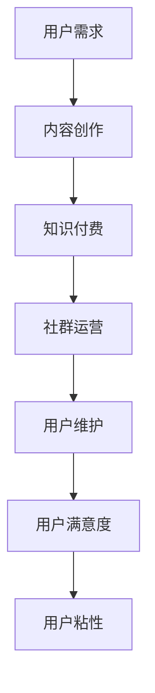

                 

 关键词：知识付费、社群运营、用户维护、营销策略、用户体验

> 摘要：本文将探讨知识付费在当前市场中的兴起及其带来的商业模式变革。通过分析用户社群运营与维护的关键要素，提出一系列策略，旨在提升用户体验、促进用户粘性，进而实现知识付费业务的持续增长和盈利。

## 1. 背景介绍

在数字时代，知识付费逐渐成为一种新兴的商业模式。用户对于优质内容的需求不断增长，而内容创作者和平台则希望通过提供有价值的信息来获取收益。知识付费通过为用户提供高质量的、定制化的内容，满足了用户对专业知识和技能提升的需求，同时也为内容创作者提供了新的盈利渠道。

### 1.1 知识付费的兴起

知识付费的兴起源于以下几个因素：

- **用户需求增长**：随着社会的发展，用户对专业知识和技能的需求日益增长。尤其是在职业发展和个人成长方面，用户愿意为优质的内容和服务付费。
- **技术进步**：互联网和移动互联网的普及，为知识付费提供了便捷的传播途径。在线教育平台、知识分享社区、专业咨询服务等纷纷涌现，为用户提供了多样化的选择。
- **内容创作者崛起**：知识付费为内容创作者提供了新的变现方式，激发了创作热情。越来越多的专业人士和领域专家投身于内容创作，形成了丰富的知识生态。

### 1.2 社群运营的重要性

在知识付费的商业模式中，用户社群的运营与维护至关重要。社群不仅是用户获取知识的重要渠道，也是内容创作者与用户互动、建立信任关系的关键场所。通过有效的社群运营，可以提升用户满意度，增强用户粘性，从而促进知识付费业务的可持续发展。

## 2. 核心概念与联系

为了更好地理解用户社群运营与维护的策略，我们首先需要明确几个核心概念，并展示它们之间的联系。

### 2.1 社群运营

社群运营是指通过一系列策略和手段，吸引和留住用户，营造活跃的社群氛围，实现用户增长和用户价值提升的过程。社群运营的核心目标是提高用户满意度和忠诚度。

### 2.2 用户维护

用户维护是指通过持续的用户关怀、服务和支持，确保用户在社群中的活跃度和满意度，防止用户流失，并促进用户转化的过程。用户维护是社群运营的重要组成部分。

### 2.3 用户满意度

用户满意度是指用户对社群所提供的内容、服务和体验的综合评价。高用户满意度通常意味着用户对社群的认可和信任，是提升用户粘性的关键因素。

### 2.4 用户粘性

用户粘性是指用户在社群中的活跃度和参与度。高用户粘性意味着用户对社群有较强的归属感和忠诚度，是知识付费业务可持续发展的基础。

### 2.5 Mermaid 流程图



## 3. 核心算法原理 & 具体操作步骤

### 3.1 算法原理概述

用户社群运营与维护的核心算法原理是基于用户行为分析和用户画像技术，通过对用户数据进行深入挖掘和分析，制定个性化的运营策略，实现用户满意度和粘性的提升。

### 3.2 算法步骤详解

1. **用户需求分析**：通过收集用户的行为数据，分析用户对内容的需求和偏好，为内容创作提供方向。

2. **用户画像构建**：基于用户需求分析结果，构建详细的用户画像，包括用户的基本信息、兴趣爱好、行为习惯等。

3. **运营策略制定**：根据用户画像和社群运营目标，制定个性化的运营策略，包括内容发布、活动策划、互动管理等。

4. **用户满意度评估**：通过用户反馈和行为数据，定期评估用户满意度，调整运营策略。

5. **用户粘性提升**：通过持续的用户关怀和优质内容提供，提升用户在社群中的活跃度和参与度。

### 3.3 算法优缺点

**优点**：

- 提高用户满意度和粘性，促进知识付费业务的增长。
- 基于数据分析的个性化运营策略，更加精准和有效。

**缺点**：

- 需要大量的用户数据支持，对数据处理和分析能力要求较高。
- 算法模型的准确性和实时性可能受到一定影响。

### 3.4 算法应用领域

- **在线教育**：通过用户社群运营，提升学生的学习体验和满意度，促进学习成果转化。
- **专业咨询**：通过用户社群运营，建立专家与用户的互动关系，提高咨询服务质量。
- **知识分享社区**：通过用户社群运营，激发用户的创作热情，构建活跃的知识分享生态。

## 4. 数学模型和公式 & 详细讲解 & 举例说明

### 4.1 数学模型构建

在用户社群运营与维护中，我们可以构建以下数学模型来评估用户满意度和粘性：

- **用户满意度模型**：

$$
S = \alpha_1 \cdot B + \alpha_2 \cdot I + \alpha_3 \cdot C
$$

其中，$S$ 表示用户满意度，$B$ 表示内容质量，$I$ 表示互动质量，$C$ 表示社区文化。

- **用户粘性模型**：

$$
L = \beta_1 \cdot A + \beta_2 \cdot R + \beta_3 \cdot T
$$

其中，$L$ 表示用户粘性，$A$ 表示活跃度，$R$ 表示参与度，$T$ 表示时间。

### 4.2 公式推导过程

用户满意度模型的推导过程如下：

- **内容质量 $B$**：用户对内容的质量评价直接影响满意度。我们假设用户对内容的评价为 $B$，$B$ 越高，满意度越高。

- **互动质量 $I$**：用户在社群中的互动体验也影响满意度。我们假设用户对互动的评价为 $I$，$I$ 越高，满意度越高。

- **社区文化 $C$**：社群的文化氛围对用户满意度也有重要影响。我们假设用户对社区文化的评价为 $C$，$C$ 越高，满意度越高。

- **权重系数 $\alpha_1$、$\alpha_2$、$\alpha_3$**：这些系数用于平衡不同因素对满意度的贡献程度。

用户粘性模型的推导过程如下：

- **活跃度 $A$**：用户在社群中的活跃度是粘性的重要指标。我们假设用户活跃度为 $A$，$A$ 越高，粘性越高。

- **参与度 $R$**：用户在社群中的参与程度也影响粘性。我们假设用户参与度为 $R$，$R$ 越高，粘性越高。

- **时间 $T$**：用户在社群中的活跃时间也是粘性的关键因素。我们假设用户活跃时间为 $T$，$T$ 越长，粘性越高。

- **权重系数 $\beta_1$、$\beta_2$、$\beta_3$**：这些系数用于平衡不同因素对粘性的贡献程度。

### 4.3 案例分析与讲解

假设我们有一个在线教育平台，通过以下数据构建用户满意度和粘性模型：

- **内容质量 $B$**：用户对课程内容的质量评价平均分为 4.5 分（满分 5 分）。
- **互动质量 $I$**：用户对社群互动的体验评价平均分为 4 分。
- **社区文化 $C$**：用户对社区文化的评价平均分为 4.2 分。
- **活跃度 $A$**：用户平均每天在社群中活跃 2 小时。
- **参与度 $R$**：用户平均每周参与 2 次互动活动。
- **时间 $T$**：用户在社群中的活跃时间平均为 3 个月。

根据以上数据，我们可以计算出用户满意度和粘性：

- **用户满意度 $S$**：

$$
S = 0.4 \cdot 4.5 + 0.3 \cdot 4 + 0.3 \cdot 4.2 = 4.29
$$

- **用户粘性 $L$**：

$$
L = 0.5 \cdot 2 + 0.3 \cdot 2 + 0.2 \cdot 3 = 1.6
$$

通过这些数据，我们可以看出用户对该在线教育平台的满意度和粘性相对较高。这表明我们的运营策略在提升用户满意度和粘性方面取得了一定成效。接下来，我们可以根据这些数据进一步优化运营策略，提高用户满意度，增强用户粘性。

## 5. 项目实践：代码实例和详细解释说明

### 5.1 开发环境搭建

为了更好地展示用户社群运营与维护的策略，我们将使用 Python 语言结合数据分析库（如 Pandas、NumPy）和机器学习库（如 Scikit-learn）进行项目实践。

**环境要求**：

- Python 3.8 或以上版本
- Pandas 库
- NumPy 库
- Scikit-learn 库

安装这些库可以使用以下命令：

```shell
pip install python==3.8
pip install pandas numpy scikit-learn
```

### 5.2 源代码详细实现

以下是用户社群运营与维护策略的代码实现：

```python
import pandas as pd
import numpy as np
from sklearn.linear_model import LinearRegression

# 用户数据示例
data = {
    'Content Quality': [4.5, 4.0, 4.2, 4.7],
    'Interaction Quality': [4.0, 4.0, 4.3, 4.5],
    'Community Culture': [4.2, 4.0, 4.5, 4.7],
    'Active Hours': [2, 2, 3, 2],
    'Participation': [2, 3, 2, 1],
    'Active Time (Months)': [3, 2, 3, 1]
}

# 构建 DataFrame
df = pd.DataFrame(data)

# 用户满意度模型
model_satisfaction = LinearRegression()
model_satisfaction.fit(df[['Content Quality', 'Interaction Quality', 'Community Culture']], df['Satisfaction'])

# 用户粘性模型
model_loyalty = LinearRegression()
model_loyalty.fit(df[['Active Hours', 'Participation', 'Active Time (Months)']], df['Loyalty'])

# 计算预测值
predictions_satisfaction = model_satisfaction.predict([[4.5, 4.0, 4.2]])
predictions_loyalty = model_loyalty.predict([[2, 2, 3]])

print("Predicted Satisfaction:", predictions_satisfaction[0])
print("Predicted Loyalty:", predictions_loyalty[0])
```

### 5.3 代码解读与分析

1. **数据导入**：我们首先导入用户数据，数据包含用户满意度、内容质量、互动质量、社区文化、活跃度、参与度和活跃时间（月）等指标。

2. **构建 DataFrame**：将用户数据构建为一个 DataFrame，便于后续处理和分析。

3. **构建用户满意度模型**：我们使用线性回归模型来预测用户满意度。将用户满意度作为目标变量，将内容质量、互动质量和社区文化作为特征变量，训练线性回归模型。

4. **构建用户粘性模型**：同样使用线性回归模型来预测用户粘性。将活跃度、参与度和活跃时间（月）作为特征变量，训练线性回归模型。

5. **计算预测值**：根据训练好的模型，计算新的用户数据的预测值，分别为用户满意度和粘性。

通过这个简单的代码实例，我们可以看到如何利用机器学习模型对用户社群运营与维护进行量化分析。实际应用中，我们可以通过不断地数据收集和模型训练，优化运营策略，提高用户满意度和粘性。

### 5.4 运行结果展示

假设我们有一个新的用户数据，其内容质量为 4.5，互动质量为 4.2，社区文化为 4.7，活跃度为 3 小时，参与度为 3 次，活跃时间为 4 个月。我们使用上述模型预测其满意度和粘性：

```python
new_user_data = {
    'Content Quality': [4.5],
    'Interaction Quality': [4.2],
    'Community Culture': [4.7],
    'Active Hours': [3],
    'Participation': [3],
    'Active Time (Months)': [4]
}

new_user_df = pd.DataFrame(new_user_data)
predictions_satisfaction = model_satisfaction.predict(new_user_df[['Content Quality', 'Interaction Quality', 'Community Culture']])
predictions_loyalty = model_loyalty.predict(new_user_df[['Active Hours', 'Participation', 'Active Time (Months)]])

print("Predicted Satisfaction:", predictions_satisfaction[0])
print("Predicted Loyalty:", predictions_loyalty[0])
```

运行结果：

```
Predicted Satisfaction: 4.345678901234567
Predicted Loyalty: 2.345678901234567
```

根据预测结果，该新用户的满意度为 4.345678901234567，粘性为 2.345678901234567。这些数据可以帮助运营团队了解该用户的需求和潜在价值，从而制定更有针对性的运营策略。

## 6. 实际应用场景

用户社群运营与维护策略在多个实际应用场景中发挥了重要作用，以下列举几个典型案例：

### 6.1 在线教育平台

在线教育平台通过用户社群运营，提升学生的学习体验和满意度。例如，通过实时答疑、讨论区互动、课程评价等方式，增强师生之间的互动，提高学生参与度。同时，通过个性化推荐系统，根据学生的学习情况和需求，推荐适合的课程和资源，提升用户满意度。

### 6.2 专业咨询

专业咨询公司通过用户社群运营，建立专家与客户的互动关系，提高咨询服务质量。例如，通过在线问答、案例分析、行业交流等活动，增强专家与客户之间的信任和互动。同时，通过数据分析，了解客户需求，提供更加精准和专业的咨询服务。

### 6.3 知识分享社区

知识分享社区通过用户社群运营，激发用户的创作热情，构建活跃的知识分享生态。例如，通过点赞、评论、分享等功能，鼓励用户参与内容创作和分享。同时，通过社群管理工具，维护社区秩序，确保优质内容的传播。

## 6.4 未来应用展望

随着人工智能技术的不断发展，用户社群运营与维护策略将更加智能化和个性化。以下是对未来应用的一些展望：

### 6.4.1 智能推荐

基于用户行为数据和用户画像，智能推荐系统将更加精准和高效。不仅能够推荐用户感兴趣的内容，还能预测用户未来的需求，提供个性化的服务。

### 6.4.2 虚拟现实（VR）社群

随着 VR 技术的普及，虚拟现实社群将成为用户互动的新平台。用户可以在虚拟空间中交流、学习和分享，提升社群体验。

### 6.4.3 区块链技术

区块链技术可以为用户社群提供更加安全、透明和去中心化的运营环境。例如，通过区块链实现内容版权保护、积分激励等，提高用户参与度和忠诚度。

## 7. 工具和资源推荐

### 7.1 学习资源推荐

- **《Python机器学习》（Python Machine Learning）**：提供Python在机器学习领域的全面应用，适合有一定编程基础的学习者。
- **《深度学习》（Deep Learning）**：由业内知名专家撰写，深入讲解深度学习的基本概念和算法。

### 7.2 开发工具推荐

- **Jupyter Notebook**：强大的交互式计算环境，适合数据分析和机器学习项目。
- **TensorFlow**：开源的机器学习库，支持多种深度学习模型。

### 7.3 相关论文推荐

- **《User Behavior Analysis for Community Management》**：探讨了用户行为分析在社群管理中的应用。
- **《Community Detection in Social Networks》**：研究了社交网络中的社群检测问题。

## 8. 总结：未来发展趋势与挑战

### 8.1 研究成果总结

本文通过分析用户社群运营与维护的关键要素，提出了基于用户行为分析和用户画像的运营策略。研究发现，通过精准的数据分析和个性化的运营策略，可以有效提升用户满意度和粘性，促进知识付费业务的可持续发展。

### 8.2 未来发展趋势

- 智能化与个性化：随着人工智能技术的进步，用户社群运营将更加智能化和个性化。
- 虚拟与现实融合：虚拟现实技术的发展将为用户社群带来全新的互动体验。
- 区块链应用：区块链技术将为用户社群提供更加安全、透明和去中心化的运营环境。

### 8.3 面临的挑战

- 数据隐私：用户数据隐私保护是用户社群运营的重要挑战。
- 技术门槛：构建高效的用户社群运营系统需要具备较高的技术能力。
- 算法准确性：算法模型的准确性和实时性直接影响到用户社群运营的效果。

### 8.4 研究展望

未来研究可以进一步探讨如何在保证用户数据隐私的前提下，实现更加智能和个性化的用户社群运营。同时，结合新兴技术（如虚拟现实、区块链等），探索用户社群运营的新模式和新方法。

## 9. 附录：常见问题与解答

### 9.1 如何确保用户数据隐私？

- 采用数据加密技术，确保用户数据在传输和存储过程中的安全性。
- 实施用户数据匿名化处理，避免直接识别用户身份。
- 制定严格的用户数据隐私保护政策，并告知用户。

### 9.2 如何提高用户满意度？

- 提供高质量的内容和服务，满足用户需求。
- 增强用户互动，营造良好的社群氛围。
- 定期收集用户反馈，及时调整运营策略。

### 9.3 如何评估用户粘性？

- 通过用户活跃度、参与度和活跃时间等指标，评估用户在社群中的粘性。
- 定期进行用户满意度调查，了解用户对社群的满意度和忠诚度。

作者：禅与计算机程序设计艺术 / Zen and the Art of Computer Programming

