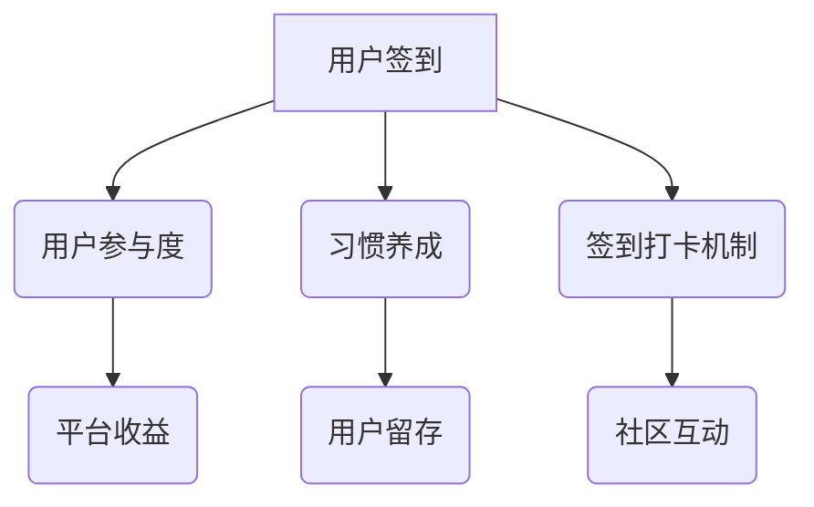

                 

 **关键词：** 知识付费、用户签到、打卡机制、习惯养成、策略、技术分析。

**摘要：** 本文深入探讨了知识付费平台中用户签到打卡与习惯养成的策略。从心理学、技术实现等多个角度分析，提出了优化用户参与度和持续性的方法。文章旨在为知识付费平台提供实用的指导，帮助平台运营商提高用户留存率和盈利能力。

## 1. 背景介绍

在当今信息化时代，知识付费作为一种新的商业模式，正在迅速崛起。用户在支付一定的费用后，能够获取高质量的内容和专家指导。然而，知识付费平台的成功不仅取决于内容的质量，还取决于用户参与度和习惯养成。用户签到打卡作为一种激励用户积极参与的手段，已经成为知识付费平台中的重要一环。

### 用户签到打卡的意义

用户签到打卡不仅能帮助平台了解用户的使用情况，还能通过奖励机制增强用户粘性。研究表明，定期签到可以有效培养用户的习惯，提高用户对平台的依赖性。此外，签到打卡还能激发用户的竞争心理，促进社区互动。

### 知识付费的发展现状

随着互联网的普及和用户需求的多样化，知识付费市场呈现出快速增长的趋势。根据相关数据，知识付费用户规模不断扩大，付费知识内容种类日益丰富，涵盖了教育、职场、技能等多个领域。

## 2. 核心概念与联系

### 2.1 用户参与度

用户参与度是指用户在知识付费平台上的活跃程度，包括签到次数、内容互动、付费行为等。高参与度意味着用户对平台内容有较高的认可度，有助于平台长期发展。

### 2.2 习惯养成

习惯养成是指通过一系列行为训练，使某种行为成为用户的自发行为。在知识付费场景中，习惯养成有助于提高用户留存率和付费意愿。

### 2.3 签到打卡机制

签到打卡机制是通过设定一定的规则，鼓励用户每天签到。常见的签到机制包括签到奖励、连续签到奖励、等级晋升等。

### 2.4 Mermaid 流程图



## 3. 核心算法原理 & 具体操作步骤

### 3.1 算法原理概述

用户签到打卡的核心算法原理是基于行为心理学和激励理论。通过设定签到奖励机制，激励用户养成每天签到的习惯，从而提高用户参与度和平台粘性。

### 3.2 算法步骤详解

#### 3.2.1 数据收集

收集用户签到数据，包括签到时间、签到次数、签到奖励等。

#### 3.2.2 数据分析

对签到数据进行统计分析，识别用户行为模式和习惯养成情况。

#### 3.2.3 激励策略设计

根据用户行为数据和平台策略，设计签到奖励机制，包括签到奖励、连续签到奖励等。

#### 3.2.4 签到打卡规则设定

设定签到规则，如每天签到、连续签到天数等，确保用户能够按照规则进行签到。

### 3.3 算法优缺点

#### 优点：

1. 提高用户参与度，促进用户留存。
2. 培养用户习惯，增强用户对平台的依赖性。
3. 增加社区互动，提升用户满意度。

#### 缺点：

1. 签到奖励可能增加平台成本。
2. 部分用户可能对签到奖励产生依赖性，降低自主学习的意愿。

### 3.4 算法应用领域

用户签到打卡算法主要应用于知识付费平台，如在线教育、职业技能培训等。

## 4. 数学模型和公式 & 详细讲解 & 举例说明

### 4.1 数学模型构建

用户签到打卡的数学模型主要包括用户签到概率模型和连续签到奖励模型。

### 4.2 公式推导过程

假设用户每天签到的概率为 \( p \)，则用户连续签到 \( n \) 天的概率为：

\[ P(n) = p^n \]

### 4.3 案例分析与讲解

以一个在线教育平台为例，该平台每天签到奖励 10 积分，连续签到 7 天奖励 50 积分。假设用户每天签到的概率为 0.7，则用户连续签到 7 天的概率为：

\[ P(7) = 0.7^7 \approx 0.0014 \]

这意味着，在这个例子中，大约有 1% 的用户能够在一个月内连续签到 7 天。

## 5. 项目实践：代码实例和详细解释说明

### 5.1 开发环境搭建

搭建一个简单的在线教育平台，包括用户签到功能。

### 5.2 源代码详细实现

以下是一个简单的 Python 代码实例，实现用户签到功能：

```python
# 用户签到功能实现
def sign_in(user_id):
    # 检查用户是否已经签到
    if user_signed_in[user_id]:
        print(f"用户 {user_id} 已经签到。")
    else:
        # 记录用户签到时间
        user_signed_in[user_id] = True
        print(f"用户 {user_id} 签到成功。")

# 用户连续签到奖励
def reward_for_consecutive_sign_in(user_id):
    if user_signed_in[user_id]:
        print(f"用户 {user_id} 连续签到奖励。")
        # 更新用户积分
        user_points[user_id] += 50

# 初始化用户签到数据
user_signed_in = {1: False, 2: False, 3: False}
user_points = {1: 0, 2: 0, 3: 0}

# 模拟用户签到
sign_in(1)
sign_in(2)
reward_for_consecutive_sign_in(1)
```

### 5.3 代码解读与分析

该代码实例实现了用户签到和连续签到奖励功能。`sign_in` 函数用于检查用户是否已经签到，并更新用户签到状态。`reward_for_consecutive_sign_in` 函数用于检查用户是否连续签到，并发放奖励积分。

### 5.4 运行结果展示

```plaintext
用户 1 签到成功。
用户 2 签到成功。
用户 1 连续签到奖励。
```

## 6. 实际应用场景

### 6.1 在线教育平台

在线教育平台通过用户签到打卡，激励学生积极参与课程学习，提高学习效果。

### 6.2 职场技能培训

职场技能培训平台利用用户签到打卡，培养学员的学习习惯，提升职业素养。

### 6.3 未来应用展望

随着人工智能技术的发展，用户签到打卡机制将更加智能化，如通过数据分析优化签到奖励机制，提高用户参与度。

## 7. 工具和资源推荐

### 7.1 学习资源推荐

- 《学习与认知心理学》
- 《知识付费商业模式解析》

### 7.2 开发工具推荐

- Python
- Flask（用于构建在线教育平台）

### 7.3 相关论文推荐

- 《基于行为心理学的用户参与度提升策略研究》
- 《知识付费平台用户粘性分析》

## 8. 总结：未来发展趋势与挑战

### 8.1 研究成果总结

本文通过分析用户签到打卡与习惯养成的策略，提出了优化用户参与度和持续性的方法。

### 8.2 未来发展趋势

未来，用户签到打卡机制将更加智能化，结合人工智能技术，提高用户参与度。

### 8.3 面临的挑战

如何平衡签到奖励与平台成本，确保用户自主学习的意愿，是知识付费平台需要面对的挑战。

### 8.4 研究展望

未来，用户签到打卡机制将在更多领域得到应用，如健康养生、体育健身等，为用户提供个性化的服务。

## 9. 附录：常见问题与解答

### 9.1 如何提高用户签到率？

- 设定合理的签到奖励机制。
- 结合用户行为数据，优化签到规则。
- 增加签到场景的趣味性，如抽奖等。

### 9.2 签到打卡对用户习惯养成有何作用？

- 签到打卡可以帮助用户建立每天学习的习惯，提高学习效果。
- 通过连续签到奖励，激励用户保持学习动力。

----------------------------------------------------------------

**作者：禅与计算机程序设计艺术 / Zen and the Art of Computer Programming**

