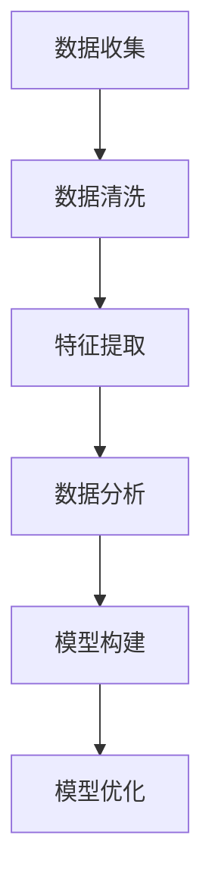

                 

关键词：知识付费、用户行为分析、数据分析、画像构建、用户画像、个性化推荐、商业变现、市场趋势

> 摘要：本文将探讨知识付费领域中的用户行为分析，并深入分析用户画像构建的重要性及其对商业变现的影响。通过研究用户行为的规律，企业可以更好地理解用户需求，提供个性化的服务和产品，从而实现知识付费的可持续发展和盈利增长。

## 1. 背景介绍

随着互联网技术的发展，知识付费市场呈现出爆发式增长。用户对于专业知识和技能的需求日益增加，使得知识付费成为了一种新的商业模式。然而，如何在众多竞争者中脱颖而出，实现商业变现，成为了知识付费平台和企业需要思考的问题。用户行为分析作为一种有效的数据分析手段，可以帮助企业更好地了解用户需求和行为，从而提供更符合用户期望的产品和服务。

### 用户行为分析的重要性

用户行为分析是指通过收集和分析用户在使用产品或服务过程中的行为数据，来了解用户的兴趣、需求、偏好和行为模式。在知识付费领域，用户行为分析具有以下几个重要性：

1. **用户需求洞察**：通过分析用户行为，企业可以深入了解用户的需求和偏好，从而提供更精准的产品和服务。
2. **个性化推荐**：基于用户行为数据，平台可以实现个性化推荐，提高用户满意度和转化率。
3. **用户流失预测**：通过行为分析，企业可以识别潜在流失用户，提前采取措施降低用户流失率。
4. **营销策略优化**：用户行为分析可以帮助企业制定更有效的营销策略，提高市场推广效果。

### 用户画像构建

用户画像是指通过对用户行为、兴趣、需求等多方面数据的分析，构建出一个全面、详细的用户形象。用户画像构建对于知识付费企业具有重要意义：

1. **精准营销**：用户画像可以帮助企业针对不同用户群体制定个性化的营销策略。
2. **内容推荐**：基于用户画像，平台可以提供更符合用户需求的课程或内容，提高用户粘性。
3. **产品创新**：用户画像为产品创新提供了数据支持，帮助企业开发更符合市场需求的产品。
4. **客户关系管理**：通过用户画像，企业可以更好地了解客户，提供更优质的客户服务。

## 2. 核心概念与联系

### 用户行为分析的核心概念

在用户行为分析中，核心概念包括用户行为、数据收集、数据分析、用户画像等。

- **用户行为**：用户在使用产品或服务过程中的各种行为，如浏览、搜索、购买、评论等。
- **数据收集**：通过各种手段收集用户行为数据，如日志、API接口、问卷调查等。
- **数据分析**：对收集到的用户行为数据进行分析，提取有价值的信息，如用户偏好、行为模式等。
- **用户画像**：基于数据分析结果，构建出详细、全面的用户形象。

### 用户画像构建的流程

用户画像构建通常包括以下步骤：

1. **数据收集**：通过多种渠道收集用户行为数据。
2. **数据清洗**：对收集到的数据进行清洗和预处理，去除无效数据。
3. **特征提取**：从数据中提取关键特征，如用户年龄、性别、地域、购买行为等。
4. **数据分析**：对特征数据进行分析，发现用户的行为规律和需求。
5. **模型构建**：根据分析结果，构建用户画像模型。
6. **模型优化**：根据业务需求和反馈，不断优化用户画像模型。

### 用户画像构建的Mermaid流程图



## 3. 核心算法原理 & 具体操作步骤

### 3.1 算法原理概述

用户行为分析通常采用以下几种算法：

1. **关联规则算法**：用于发现用户行为之间的关联关系，如Apriori算法、FP-growth算法等。
2. **分类算法**：用于预测用户的分类标签，如决策树、随机森林、支持向量机等。
3. **聚类算法**：用于发现用户行为数据中的自然分组，如K-means、层次聚类等。

### 3.2 算法步骤详解

1. **数据收集**：通过API接口、日志分析、问卷调查等方式收集用户行为数据。
2. **数据预处理**：对原始数据进行清洗、去重、缺失值处理等操作。
3. **特征工程**：从数据中提取关键特征，如用户年龄、性别、地域、购买行为等。
4. **模型选择**：根据业务需求和数据特点，选择合适的算法模型。
5. **模型训练**：使用训练数据对模型进行训练。
6. **模型评估**：使用测试数据对模型进行评估，调整模型参数。
7. **用户画像构建**：根据模型输出结果，构建用户画像。

### 3.3 算法优缺点

1. **关联规则算法**：优点：能够发现用户行为之间的关联关系，帮助商家了解用户需求；缺点：可能产生大量冗余规则，计算复杂度高。
2. **分类算法**：优点：能够预测用户的分类标签，帮助商家进行精准营销；缺点：对数据质量要求较高，可能存在过拟合问题。
3. **聚类算法**：优点：能够发现用户行为数据中的自然分组，帮助商家了解用户需求；缺点：聚类结果可能受到初始值影响，聚类效果不稳定。

### 3.4 算法应用领域

用户行为分析算法在知识付费领域的应用包括：

1. **个性化推荐**：根据用户行为数据，为用户提供个性化的课程推荐，提高用户满意度和转化率。
2. **用户流失预测**：根据用户行为数据，预测潜在流失用户，采取相应的措施降低用户流失率。
3. **营销策略优化**：根据用户行为数据，优化营销策略，提高市场推广效果。
4. **内容策划**：根据用户行为数据，为内容创作者提供创作方向和建议，提高内容质量和用户粘性。

## 4. 数学模型和公式 & 详细讲解 & 举例说明

### 4.1 数学模型构建

在用户行为分析中，常用的数学模型包括：

1. **线性回归模型**：用于预测用户的行为标签，如购买概率、评分等。
   $$ y = \beta_0 + \beta_1x_1 + \beta_2x_2 + \cdots + \beta_nx_n $$
   
2. **逻辑回归模型**：用于预测用户是否属于某一分类，如是否购买、是否点赞等。
   $$ P(y=1) = \frac{1}{1 + e^{-(\beta_0 + \beta_1x_1 + \beta_2x_2 + \cdots + \beta_nx_n)} $$

3. **聚类模型**：用于发现用户行为数据中的自然分组，如K-means、层次聚类等。
   $$ \min \sum_{i=1}^n \sum_{j=1}^k (x_j - \mu_i)^2 $$

### 4.2 公式推导过程

以线性回归模型为例，推导过程如下：

1. **损失函数**：
   $$ L(\theta) = -\frac{1}{m} \sum_{i=1}^m y^{(i)} \log(h_{\theta}(x^{(i)})) - (1 - y^{(i)}) \log(1 - h_{\theta}(x^{(i)})) $$
   
2. **梯度下降**：
   $$ \theta_j := \theta_j - \alpha \frac{\partial L(\theta)}{\partial \theta_j} $$
   
3. **最小化损失函数**：
   $$ \theta = \arg \min_{\theta} L(\theta) $$

### 4.3 案例分析与讲解

假设我们有一个知识付费平台，用户行为数据包括浏览、搜索、购买、评论等，现需使用线性回归模型预测用户购买概率。

1. **数据预处理**：
   - 将用户行为数据进行编码，如将“浏览”编码为1，“搜索”编码为2，“购买”编码为3，“评论”编码为4。
   - 处理缺失值，如使用均值、中位数等方法填充缺失数据。

2. **特征提取**：
   - 从用户行为数据中提取关键特征，如用户年龄、性别、地域、购买历史等。

3. **模型训练**：
   - 使用训练数据对线性回归模型进行训练，得到模型参数。
   - 使用测试数据对模型进行评估，调整模型参数。

4. **模型评估**：
   - 使用测试数据计算模型预测的购买概率，并与实际购买情况进行对比，评估模型准确性。

5. **应用模型**：
   - 根据模型预测结果，对潜在购买用户进行精准推送和营销。

## 5. 项目实践：代码实例和详细解释说明

### 5.1 开发环境搭建

1. **环境要求**：
   - Python 3.6及以上版本
   - NumPy、Pandas、Scikit-learn等常用库

2. **安装依赖**：
   ```bash
   pip install numpy pandas scikit-learn
   ```

### 5.2 源代码详细实现

```python
import numpy as np
import pandas as pd
from sklearn.linear_model import LinearRegression
from sklearn.model_selection import train_test_split
from sklearn.metrics import mean_squared_error

# 数据预处理
def preprocess_data(data):
    # 编码处理
    data['behavior'] = data['behavior'].map({'浏览': 1, '搜索': 2, '购买': 3, '评论': 4})
    # 填充缺失值
    data.fillna(data.mean(), inplace=True)
    return data

# 特征提取
def extract_features(data):
    features = data[['age', 'gender', 'region', 'behavior']]
    return features

# 模型训练
def train_model(train_features, train_labels):
    model = LinearRegression()
    model.fit(train_features, train_labels)
    return model

# 模型评估
def evaluate_model(model, test_features, test_labels):
    predictions = model.predict(test_features)
    mse = mean_squared_error(test_labels, predictions)
    print("MSE:", mse)

# 加载数据
data = pd.read_csv('user_behavior.csv')
preprocessed_data = preprocess_data(data)
features = extract_features(preprocessed_data)
labels = preprocessed_data['is_purchase']

# 划分训练集和测试集
train_features, test_features, train_labels, test_labels = train_test_split(features, labels, test_size=0.2, random_state=42)

# 训练模型
model = train_model(train_features, train_labels)

# 评估模型
evaluate_model(model, test_features, test_labels)
```

### 5.3 代码解读与分析

1. **数据预处理**：对用户行为数据进行编码和缺失值处理。
2. **特征提取**：从数据中提取关键特征。
3. **模型训练**：使用训练数据进行线性回归模型训练。
4. **模型评估**：使用测试数据进行模型评估，计算均方误差。

## 6. 实际应用场景

### 6.1 知识付费平台用户推荐

在知识付费平台中，用户推荐是提高用户满意度和转化率的重要手段。通过用户行为分析，平台可以为用户提供个性化的课程推荐。

1. **个性化推荐算法**：采用基于内容的推荐算法、协同过滤算法或深度学习算法进行用户推荐。
2. **推荐策略**：根据用户行为数据，为不同用户群体制定不同的推荐策略。
3. **推荐效果评估**：定期评估推荐效果，优化推荐算法和策略。

### 6.2 用户流失预测

用户流失预测可以帮助知识付费平台降低用户流失率，提高用户留存率。

1. **用户行为特征提取**：从用户行为数据中提取关键特征，如活跃度、购买频率等。
2. **流失预测模型**：使用机器学习算法训练流失预测模型，预测用户流失风险。
3. **流失预警与干预**：对潜在流失用户进行预警和干预，如提供优惠券、推送优质内容等。

### 6.3 营销策略优化

用户行为分析为营销策略优化提供了数据支持。

1. **用户细分**：根据用户行为数据，将用户划分为不同细分群体。
2. **针对性营销**：为不同用户群体制定个性化的营销策略。
3. **效果评估**：定期评估营销策略效果，优化营销策略。

## 7. 工具和资源推荐

### 7.1 学习资源推荐

1. **《Python数据分析》**：适合初学者，涵盖数据分析的基础知识和常用方法。
2. **《机器学习实战》**：适合有一定编程基础的读者，详细介绍机器学习算法及其应用。
3. **《用户行为数据分析》**：详细讲解用户行为分析的理论和实践方法。

### 7.2 开发工具推荐

1. **Jupyter Notebook**：适合编写和运行数据分析代码，具有强大的交互功能。
2. **PyCharm**：强大的Python集成开发环境，支持多种编程语言。
3. **TensorFlow**：用于构建和训练深度学习模型。

### 7.3 相关论文推荐

1. **《基于用户行为分析的知识付费平台个性化推荐研究》**
2. **《用户行为数据分析在电商领域的应用研究》**
3. **《基于机器学习的用户流失预测方法研究》**

## 8. 总结：未来发展趋势与挑战

### 8.1 研究成果总结

本文通过分析知识付费领域的用户行为，探讨了用户画像构建的重要性及其对商业变现的影响。研究结果表明，用户行为分析可以帮助企业实现精准营销、个性化推荐、用户流失预测等，从而提高商业变现效果。

### 8.2 未来发展趋势

1. **大数据和人工智能技术的应用**：随着大数据和人工智能技术的发展，用户行为分析将更加智能化、精准化。
2. **跨领域合作**：知识付费领域将与教育、医疗、金融等跨领域行业进行深度合作，实现资源整合和业务创新。
3. **个性化服务**：基于用户画像，企业将提供更加个性化的服务，满足用户的个性化需求。

### 8.3 面临的挑战

1. **数据质量和隐私保护**：数据质量和用户隐私保护是用户行为分析面临的主要挑战。
2. **算法透明度和可解释性**：随着算法的复杂化，算法的透明度和可解释性成为用户行为分析的重要问题。
3. **数据安全和合规性**：企业需要确保用户行为数据的安全和合规性，避免数据泄露和违规行为。

### 8.4 研究展望

未来，用户行为分析在知识付费领域将继续发挥重要作用。通过不断优化算法模型、提高数据质量、加强隐私保护，企业将能够更好地满足用户需求，实现可持续发展和商业变现。

## 9. 附录：常见问题与解答

### Q1：用户行为分析有哪些常见方法？
A1：用户行为分析常用的方法包括关联规则分析、分类分析、聚类分析、时间序列分析等。

### Q2：用户画像构建的关键步骤是什么？
A2：用户画像构建的关键步骤包括数据收集、数据清洗、特征提取、数据分析、模型构建和模型优化。

### Q3：如何确保用户行为数据的质量和隐私？
A3：确保用户行为数据的质量和隐私需要从数据收集、存储、处理、传输等各个环节进行控制和保护，如采用加密技术、数据去识别化、隐私保护算法等。

### Q4：用户行为分析在知识付费领域有哪些应用？
A4：用户行为分析在知识付费领域的应用包括个性化推荐、用户流失预测、营销策略优化、内容策划等。

### Q5：如何评估用户行为分析的效果？
A5：评估用户行为分析的效果可以从以下几个方面进行：
- 推荐系统的准确率、召回率、覆盖率等指标；
- 用户留存率、转化率等业务指标；
- 用户体验反馈等主观评价。

## 作者署名

作者：禅与计算机程序设计艺术 / Zen and the Art of Computer Programming
----------------------------------------------------------------

