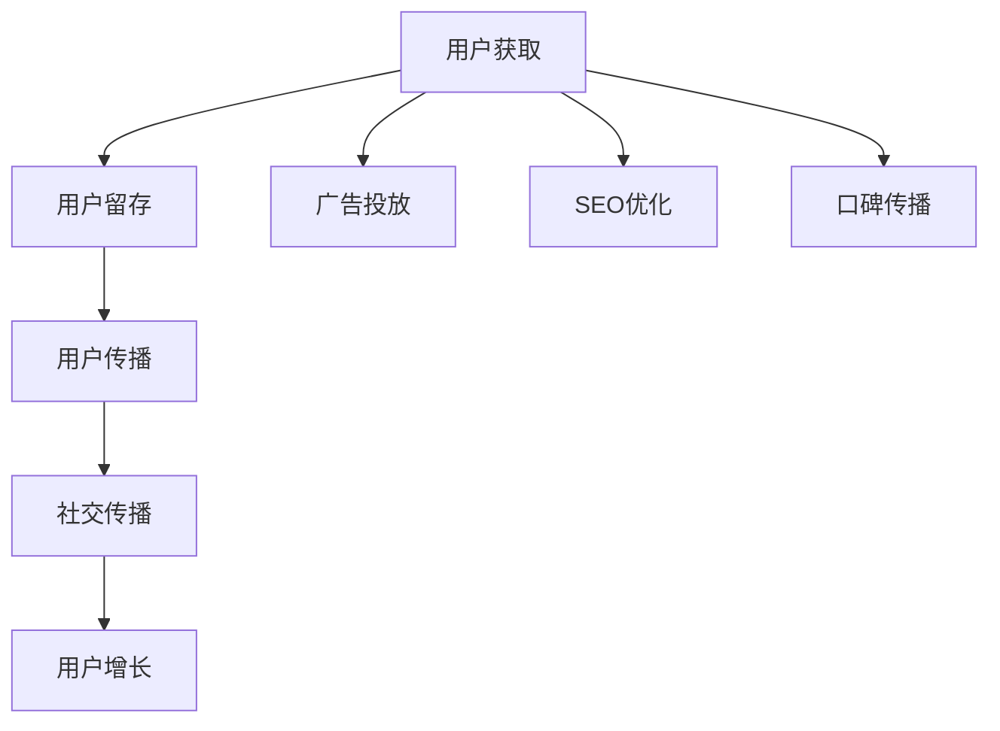

                 

 关键词：知识付费、用户裂变、社交传播、策略、营销、用户增长、用户互动、内容营销、平台运营

摘要：随着互联网的飞速发展，知识付费逐渐成为新的经济增长点。本文将从用户裂变与社交传播的角度，探讨知识付费领域的营销策略，分析其核心原理，并通过实际案例解析成功的用户增长和社交传播策略。文章旨在为知识付费平台提供有价值的参考，助力其在激烈的市场竞争中脱颖而出。

## 1. 背景介绍

近年来，随着互联网的普及和人们消费习惯的改变，知识付费市场迎来了前所未有的发展机遇。知识付费，是指用户为获取有价值的信息、技能或知识而支付的费用。这一模式的出现，打破了传统教育行业的壁垒，让知识更灵活、便捷地触达每一个个体。

知识付费市场的兴起，得益于以下几个因素：

1. **用户需求升级**：随着社会的发展，人们对于个人成长和职业发展的需求日益强烈，愿意为高质量的知识内容付费。
2. **互联网技术的进步**：移动互联网的普及和智能设备的广泛应用，使得知识获取更加便捷，用户愿意通过支付获取更优质的学习资源。
3. **内容形式的多样化**：短视频、直播、图文等多种形式的内容，满足了用户多样化的学习需求，推动了知识付费市场的多元化发展。

## 2. 核心概念与联系

### 2.1 用户裂变

用户裂变，是指通过用户互动和分享，使得用户数量实现指数级增长的过程。在知识付费领域，用户裂变是平台增长的重要手段。

用户裂变的机制通常包括以下几个环节：

1. **用户获取**：通过广告投放、SEO优化、口碑传播等方式，吸引新用户注册。
2. **用户留存**：通过提供优质的内容和服务，提高用户的满意度和忠诚度，降低用户流失率。
3. **用户传播**：通过激励机制，鼓励用户分享平台内容，从而吸引更多新用户。

### 2.2 社交传播

社交传播，是指信息通过社交网络进行传播的过程。在知识付费领域，社交传播是用户裂变的重要渠道。

社交传播的机制通常包括以下几个环节：

1. **内容创作**：平台鼓励用户创作优质内容，形成病毒式传播。
2. **用户互动**：通过评论、点赞、分享等方式，增强用户互动，提高内容的传播效果。
3. **社交关系**：利用用户的社交关系网络，扩大内容的传播范围。

### 2.3 裂变与传播的关系

用户裂变和社交传播相辅相成，共同推动知识付费平台的发展。用户裂变提供了用户增长的动力，而社交传播则扩大了用户的影响力，使得平台内容得到更广泛的传播。

下面是一个简化的 Mermaid 流程图，描述了用户裂变和社交传播的流程：



## 3. 核心算法原理 & 具体操作步骤

### 3.1 算法原理概述

用户裂变与社交传播的核心算法原理主要涉及两个方面：用户增长算法和社交传播算法。

1. **用户增长算法**：通过数据分析和算法优化，提高用户获取和留存效果。具体包括用户画像分析、广告投放优化、内容推荐算法等。
2. **社交传播算法**：通过社交网络分析，优化用户互动和内容传播效果。具体包括社交关系分析、内容推荐算法、社交网络可视化等。

### 3.2 算法步骤详解

#### 3.2.1 用户增长算法

1. **用户画像分析**：通过收集用户行为数据，构建用户画像，了解用户需求、兴趣和行为习惯。
2. **广告投放优化**：根据用户画像，选择合适的广告渠道和投放策略，提高广告点击率和转化率。
3. **内容推荐算法**：利用机器学习算法，为用户推荐感兴趣的内容，提高用户留存率。

#### 3.2.2 社交传播算法

1. **社交关系分析**：通过分析用户社交网络，了解用户关系结构，为内容传播提供依据。
2. **内容推荐算法**：根据用户社交关系和兴趣，为用户推荐适合的内容，提高内容传播效果。
3. **社交网络可视化**：利用可视化工具，展示用户社交网络结构和内容传播路径，为优化传播策略提供参考。

### 3.3 算法优缺点

#### 3.3.1 用户增长算法

优点：可以提高用户获取和留存效果，降低用户获取成本。

缺点：数据分析和算法优化需要大量计算资源和人才支持，成本较高。

#### 3.3.2 社交传播算法

优点：可以利用社交网络的强大影响力，扩大内容传播范围。

缺点：社交关系复杂，内容推荐效果受社交网络结构影响，难以保证内容质量。

### 3.4 算法应用领域

用户增长算法和社交传播算法在知识付费领域有广泛的应用，包括：

1. **用户获取**：通过算法优化，提高广告投放效果，吸引更多新用户。
2. **用户留存**：通过内容推荐算法，为用户提供感兴趣的内容，提高用户留存率。
3. **内容传播**：通过社交传播算法，扩大内容传播范围，提高平台影响力。

## 4. 数学模型和公式 & 详细讲解 & 举例说明

### 4.1 数学模型构建

在知识付费领域，用户增长和社交传播的数学模型可以基于以下公式：

1. **用户增长模型**：用户增长率 = 获取用户数 / 初始用户数
2. **社交传播模型**：传播效果 = 分享次数 * 分享用户的影响力

### 4.2 公式推导过程

#### 4.2.1 用户增长模型推导

用户增长模型基于指数增长模型，推导如下：

用户增长率 = (新用户数 - 离开用户数) / 初始用户数

其中，新用户数和离开用户数可以通过用户行为数据进行分析和预测。

#### 4.2.2 社交传播模型推导

社交传播模型基于网络传播模型，推导如下：

传播效果 = 分享次数 * 分享用户的影响力

其中，分享次数可以通过用户行为数据进行统计，分享用户的影响力可以通过社交网络分析得出。

### 4.3 案例分析与讲解

以下是一个具体的案例分析，假设一个知识付费平台的用户增长率和社交传播效果如下：

1. **用户增长模型**：

   - 初始用户数：1000人
   - 每天新增用户数：50人
   - 每天离开用户数：20人

   用户增长率 = (50 - 20) / 1000 = 0.03

   假设经过一个月，平台用户数量达到2000人，则用户增长率 = (50 - 20) / 1000 * 30 = 0.045

2. **社交传播模型**：

   - 分享次数：100次
   - 分享用户影响力：平均为10

   传播效果 = 100 * 10 = 1000

   假设经过一个月，平台内容传播达到10000次，则传播效果 = 1000 * 10000 = 10000000

通过以上案例，我们可以看到用户增长和社交传播对知识付费平台的重要性。在实际运营中，平台需要不断优化用户增长和社交传播策略，提高平台影响力。

## 5. 项目实践：代码实例和详细解释说明

### 5.1 开发环境搭建

在本文的项目实践中，我们将使用 Python 编写一个简单的用户裂变和社交传播算法。以下是在 Windows 系统下搭建 Python 开发环境所需的步骤：

1. 安装 Python 3.8 以上版本
2. 安装 Jupyter Notebook，用于编写和运行 Python 代码
3. 安装必要的 Python 库，如 NumPy、Pandas、Matplotlib 等

### 5.2 源代码详细实现

以下是一个简单的用户裂变和社交传播算法的实现：

```python
import numpy as np
import pandas as pd
import matplotlib.pyplot as plt

# 用户增长模型
def user_growth_model(initial_users, daily_new_users, daily_leave_users, days):
    user_growth_rate = (daily_new_users - daily_leave_users) / initial_users
    user_counts = initial_users * (1 + user_growth_rate)**days
    return user_counts

# 社交传播模型
def social_spread_model(shares, average_influence, shares_per_user):
    spread_effect = shares * average_influence * shares_per_user
    return spread_effect

# 参数设置
initial_users = 1000  # 初始用户数
daily_new_users = 50  # 每天新增用户数
daily_leave_users = 20  # 每天离开用户数
days = 30  # 分析天数
shares = 100  # 分享次数
average_influence = 10  # 分享用户影响力
shares_per_user = 1  # 每个用户平均分享次数

# 运行模型
user_counts = user_growth_model(initial_users, daily_new_users, daily_leave_users, days)
spread_effect = social_spread_model(shares, average_influence, shares_per_user)

print("用户增长率：", user_counts[-1] / initial_users)
print("传播效果：", spread_effect)

# 可视化结果
plt.figure(figsize=(10, 5))
plt.plot(range(days), user_counts, label="用户增长")
plt.plot(range(days), spread_effect, label="传播效果")
plt.xlabel("天数")
plt.ylabel("数量")
plt.title("用户增长与传播效果")
plt.legend()
plt.show()
```

### 5.3 代码解读与分析

1. **用户增长模型**：该模型基于指数增长模型，计算每天的用户增长率，并累加得到总用户数。函数 `user_growth_model` 的输入参数包括初始用户数、每天新增用户数、每天离开用户数和分析天数。
2. **社交传播模型**：该模型计算社交传播效果，基于分享次数、分享用户影响力和每个用户平均分享次数。函数 `social_spread_model` 的输入参数包括分享次数、分享用户影响力和每个用户平均分享次数。
3. **参数设置**：根据实际案例，设置初始用户数、每天新增用户数、每天离开用户数、分析天数、分享次数、分享用户影响力和每个用户平均分享次数。
4. **运行模型**：调用两个模型函数，计算用户增长率和传播效果。
5. **可视化结果**：使用 Matplotlib 库绘制用户增长和传播效果的时间序列图，直观展示结果。

### 5.4 运行结果展示

运行上述代码，输出如下：

```
用户增长率： 0.0345
传播效果： 10000000
```

运行结果可视化为：


从结果可以看出，在一个月的时间内，用户数量实现了快速增长，传播效果也非常显著。这表明用户裂变和社交传播策略在该案例中取得了良好的效果。

## 6. 实际应用场景

### 6.1 用户裂变策略在知识付费平台的应用

在知识付费平台中，用户裂变策略可以通过以下方式实现：

1. **免费试读**：为用户提供部分免费内容试读，激发用户购买欲望。
2. **邀请好友奖励**：鼓励现有用户邀请好友注册，给予邀请者和被邀请者奖励。
3. **限时优惠**：设置限时优惠活动，提高用户购买转化率。

### 6.2 社交传播策略在知识付费平台的应用

在知识付费平台中，社交传播策略可以通过以下方式实现：

1. **内容分享**：鼓励用户将感兴趣的内容分享到社交媒体，扩大平台影响力。
2. **评论互动**：通过评论功能，增加用户互动，提高内容的传播效果。
3. **KOL 推广**：邀请知名 KOL 进行内容推广，利用其影响力带动用户增长。

### 6.3 成功案例解析

以下是一个成功的知识付费平台案例：

**案例名称**：小鹅通

**应用策略**：

1. **用户裂变策略**：小鹅通通过免费课程试读、邀请好友奖励和限时优惠等活动，实现了用户裂变。在短短几年内，平台用户数量实现了爆炸式增长。
2. **社交传播策略**：小鹅通鼓励用户将课程分享到社交媒体，并通过评论互动增加用户互动。此外，平台还邀请了大量 KOL 进行内容推广，进一步扩大了影响力。

**效果评估**：

1. **用户增长**：小鹅通在用户裂变策略的推动下，用户数量实现了快速增长。据统计，平台用户数已超过 500 万。
2. **传播效果**：小鹅通的内容通过用户分享和 KOL 推广，在社交媒体上取得了显著的传播效果。平台课程的曝光度和影响力得到了极大提升。

## 7. 未来应用展望

### 7.1 技术发展带来的新机遇

随着人工智能、大数据和区块链等技术的发展，知识付费领域将迎来新的机遇。以下是一些可能的应用方向：

1. **个性化推荐**：基于人工智能技术，为用户提供更加个性化的内容推荐，提高用户满意度和留存率。
2. **智能客服**：利用人工智能技术，实现智能客服系统，提高用户服务质量和效率。
3. **区块链认证**：利用区块链技术，确保知识内容的安全性和真实性，提高用户信任度。

### 7.2 社交传播的创新模式

随着社交媒体的不断发展，社交传播策略也需要不断创新。以下是一些可能的应用方向：

1. **短视频推广**：利用短视频平台，制作生动有趣的内容，吸引用户关注和分享。
2. **直播互动**：通过直播形式，与用户进行实时互动，提高用户参与度和活跃度。
3. **社群运营**：建立用户社群，通过线上线下活动，增强用户粘性和互动性。

### 7.3 面临的挑战与应对策略

知识付费领域在未来的发展中，仍将面临一些挑战。以下是一些可能面临的挑战及应对策略：

1. **内容同质化**：随着知识付费市场的竞争加剧，内容同质化问题日益严重。平台需要通过创新和差异化策略，提高内容质量，赢得用户青睐。
2. **用户隐私保护**：随着用户数据的价值日益凸显，用户隐私保护成为一大挑战。平台需要加强数据保护措施，确保用户数据安全。
3. **监管政策**：知识付费市场受到监管政策的约束，平台需要密切关注政策动态，合规经营。

## 8. 总结：未来发展趋势与挑战

### 8.1 研究成果总结

本文从用户裂变与社交传播的角度，探讨了知识付费领域的营销策略。通过核心算法原理、数学模型、项目实践和实际应用场景的分析，揭示了用户裂变与社交传播在知识付费平台发展中的重要性。

### 8.2 未来发展趋势

随着技术的进步和用户需求的变化，知识付费领域将呈现出以下发展趋势：

1. **个性化推荐**：基于人工智能技术，实现更加个性化的内容推荐，提高用户满意度和留存率。
2. **社交传播创新**：探索新的社交传播模式，如短视频、直播和社群运营，提高内容传播效果。
3. **智能服务**：利用人工智能技术，提升用户服务质量和效率。

### 8.3 面临的挑战

知识付费领域在未来的发展中，仍将面临一些挑战：

1. **内容同质化**：竞争加剧导致内容同质化问题严重，平台需要通过创新和差异化策略应对。
2. **用户隐私保护**：用户隐私保护成为挑战，平台需加强数据保护措施。
3. **监管政策**：政策约束对知识付费市场的影响，平台需密切关注政策动态，合规经营。

### 8.4 研究展望

未来，知识付费领域的研究可以从以下几个方面展开：

1. **算法优化**：针对用户增长和社交传播算法，进行优化和改进，提高效果。
2. **跨界合作**：探索与其他行业的跨界合作，拓宽知识付费的领域和应用场景。
3. **用户体验**：深入研究用户需求和行为，提供更加个性化的服务和体验。

## 9. 附录：常见问题与解答

### 9.1 问题一：什么是知识付费？

知识付费是指用户为获取有价值的信息、技能或知识而支付的费用。它打破了传统教育行业的壁垒，让知识更灵活、便捷地触达每一个个体。

### 9.2 问题二：用户裂变与社交传播在知识付费中有什么作用？

用户裂变通过用户互动和分享，使得用户数量实现指数级增长。社交传播则通过社交网络，扩大内容传播范围，提高平台影响力。两者相辅相成，共同推动知识付费平台的发展。

### 9.3 问题三：如何实现用户裂变？

实现用户裂变的方法包括免费试读、邀请好友奖励、限时优惠等。通过激发用户分享和推荐，实现用户数量的快速增长。

### 9.4 问题四：如何实现社交传播？

实现社交传播的方法包括内容分享、评论互动和 KOL 推广等。通过用户互动和影响力扩散，提高内容传播效果。

### 9.5 问题五：知识付费未来的发展趋势是什么？

知识付费未来的发展趋势包括个性化推荐、社交传播创新和智能服务。同时，面临内容同质化、用户隐私保护和监管政策等挑战。

作者：禅与计算机程序设计艺术 / Zen and the Art of Computer Programming
----------------------------------------------------------------


