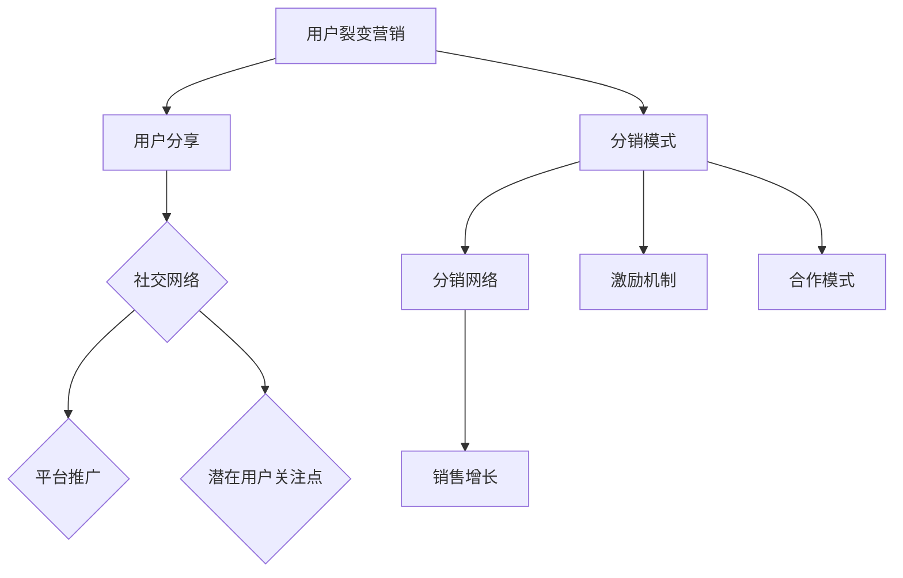

                 

### 引言 Introduction ###

在数字化浪潮的推动下，知识付费已经成为当下互联网经济的重要驱动力。知识付费平台通过提供专业课程、教程、电子书等内容，满足了用户在自我提升、技能获取等方面的需求。然而，如何在竞争激烈的市场中实现持续增长，成为知识付费平台的迫切问题。用户裂变营销与分销模式应运而生，成为知识付费领域的关键策略。

本文旨在探讨知识付费平台如何通过用户裂变营销与分销模式实现持续增长，包括以下几个方面：

1. **用户裂变营销的概念与原理**：深入剖析用户裂变营销的定义、核心原理及其在知识付费领域的应用。
2. **分销模式的设计与实施**：详细解析分销模式的结构、运作机制及其在知识付费中的应用。
3. **案例分析与策略优化**：通过具体案例分析，探讨成功经验和可优化的策略。
4. **工具与资源推荐**：介绍相关的工具和资源，为实践提供支持。
5. **未来发展趋势与挑战**：展望知识付费领域的发展趋势，分析面临的挑战，并提出研究展望。

希望通过本文的探讨，能够为知识付费平台的运营者提供有价值的参考，助力其在激烈的市场竞争中实现持续增长。

### 关键词 Keywords

- 知识付费
- 用户裂变营销
- 分销模式
- 持续增长
- 互联网经济

### 摘要 Abstract

本文探讨了知识付费平台在数字化时代如何通过用户裂变营销与分销模式实现持续增长。首先，详细介绍了用户裂变营销的概念、原理及其在知识付费领域的应用；然后，分析了分销模式的设计与实施，包括其结构、运作机制及其在知识付费中的应用；接着，通过具体案例分析，探讨了成功经验和可优化的策略；最后，介绍了相关的工具和资源，并展望了知识付费领域的发展趋势与挑战。希望通过本文的研究，为知识付费平台的运营提供有价值的参考。

### 背景介绍 Background

知识付费作为一个新兴的互联网经济模式，其发展历程可追溯到2016年左右。当时，随着移动互联网的普及和用户对内容消费需求的提升，知识付费平台如雨后春笋般涌现。典型代表包括得到、喜马拉雅、知乎等。这些平台通过提供专业课程、音频讲座、电子书等内容，满足了用户在自我提升、技能获取等方面的需求。

知识付费市场的快速增长，得益于以下几个因素：

1. **用户需求**：随着社会的发展，人们对于自我提升和职业发展的需求越来越强烈，愿意为高质量的知识内容付费。
2. **技术进步**：移动互联网和大数据技术的进步，使得知识付费平台能够更精准地匹配用户需求，提供个性化的内容服务。
3. **商业模式创新**：知识付费平台通过会员制、付费专栏、课程分销等模式，实现了商业变现。

尽管知识付费市场前景广阔，但也面临诸多挑战。首先，市场竞争激烈，众多平台涌入导致同质化严重。其次，用户注意力分散，如何在海量内容中脱颖而出，是平台需要解决的重要问题。此外，用户忠诚度低、版权保护难度大等问题也制约了知识付费的发展。

在这样的背景下，用户裂变营销与分销模式应运而生，成为知识付费平台实现持续增长的重要策略。用户裂变营销通过利用用户社交网络，实现用户数量的快速扩展；而分销模式则通过激励用户推广，提高内容覆盖率和用户粘性。本文将深入探讨这两种模式在知识付费领域的应用，并分析其成功经验和可优化策略。

### 核心概念与联系 Core Concepts and Relationships

#### 用户裂变营销的概念与原理

用户裂变营销，是指通过一定的策略和手段，引导用户自发地向其社交网络中的其他用户推荐平台内容，从而实现用户数量的快速增长。其核心原理在于利用用户的社交关系和口碑传播效应，形成一种“病毒式”的营销模式。

1. **触发机制**：用户裂变营销通常通过设计特定的激励机制，如优惠券、现金返利、积分兑换等，激发用户的分享欲望。这种激励机制可以是在用户首次购买、邀请好友成功注册、达到特定消费额度等情况下触发。
   
2. **传播路径**：用户裂变营销的传播路径通常包括用户自身的社交网络、平台的推广渠道以及潜在用户的关注点。在这个过程中，用户作为传播者，通过社交媒体、即时通讯工具等途径，将平台内容分享给其社交网络中的其他用户。

3. **效果评估**：用户裂变营销的效果可以通过多个指标进行评估，如用户转化率、用户增长速度、用户留存率、ROI（投资回报率）等。通过分析这些指标，可以优化营销策略，提高裂变效果。

#### 分销模式的概念与原理

分销模式，是指平台通过建立分销网络，激励和引导渠道商、合作伙伴等推广平台内容，从而实现销售增长和市场扩张。其核心原理在于利用外部资源，扩大品牌影响力，提升销售业绩。

1. **分销网络**：分销模式的核心在于建立一个涵盖多个层级和渠道的分销网络。这个网络包括平台、渠道商、合作伙伴等。每个层级和渠道都承担着特定的职责和功能，共同推动平台内容的销售。

2. **激励机制**：分销模式的成功依赖于有效的激励机制。平台通常通过设置佣金比例、奖励制度、业绩提成等，激励渠道商和合作伙伴积极推广平台内容。这些激励机制需要具备足够的吸引力，以激发渠道商的推广动力。

3. **合作模式**：分销模式可以采取多种合作模式，如佣金制、股权激励、联合营销等。不同的合作模式适用于不同的市场环境和平台需求。平台需要根据自身情况和目标市场，选择最合适的合作模式。

#### 用户裂变营销与分销模式的联系

用户裂变营销与分销模式在知识付费领域有着紧密的联系。用户裂变营销通过激发用户的自发分享行为，扩大平台的影响力和用户基础；而分销模式则通过建立分销网络，将用户转化为实际的购买者，实现销售增长。

1. **用户基础**：用户裂变营销为分销模式提供了庞大的用户基础。通过用户的自发分享，平台能够吸引更多潜在用户，为分销网络的形成打下基础。

2. **分销网络**：用户裂变营销的结果是形成了一个具有高度活跃度的用户社区。这个社区不仅为平台带来了大量流量，也为分销网络的运营提供了有力支持。

3. **销售增长**：通过用户裂变营销和分销模式相结合，平台能够实现销售快速增长。用户裂变营销带来的是潜在用户，而分销模式将这些潜在用户转化为实际购买者。

#### Mermaid 流程图



通过这个流程图，我们可以清晰地看到用户裂变营销与分销模式之间的互动关系。用户裂变营销通过用户分享和社交网络传播，为分销模式提供了用户基础；而分销模式则通过分销网络和激励机制，推动销售增长。

### 核心算法原理 & 具体操作步骤 Core Algorithm Principle and Operational Steps

#### 算法原理概述

用户裂变营销和分销模式的核心在于激励机制的设计和用户行为的引导。这些激励机制和用户行为可以通过一系列算法进行优化，以达到最佳效果。以下将介绍用户裂变营销和分销模式中的核心算法原理。

1. **用户分享概率算法**：该算法用于预测用户在特定激励下的分享概率。其核心是通过分析用户历史行为数据和社交网络特征，构建用户行为模型。算法原理如下：

   - **行为分析**：分析用户在平台上的历史行为，如购买记录、课程学习时长、评论和分享次数等。
   - **特征提取**：从用户行为中提取特征，如用户活跃度、购买频次、社交影响力等。
   - **概率模型**：基于用户行为特征，建立概率模型，预测用户在特定激励下的分享概率。

2. **佣金计算算法**：该算法用于计算渠道商的佣金比例。其核心是根据渠道商的销售业绩和平台收益，动态调整佣金比例，以激励渠道商的积极性。算法原理如下：

   - **收益分析**：分析平台在一定周期内的总收益和渠道商的销售业绩。
   - **佣金模型**：根据收益分析结果，建立佣金模型，计算渠道商的佣金比例。
   - **动态调整**：根据市场环境和渠道商表现，动态调整佣金比例，以保持渠道商的积极性。

3. **用户留存预测算法**：该算法用于预测用户在平台上的留存情况，为用户留存策略提供数据支持。其核心是通过分析用户行为数据和用户特征，建立用户留存模型。算法原理如下：

   - **行为分析**：分析用户在平台上的行为数据，如访问频率、学习时长、购买记录等。
   - **特征提取**：从用户行为中提取特征，如用户活跃度、购买频次、课程满意度等。
   - **留存模型**：基于用户行为特征，建立留存模型，预测用户在平台上的留存概率。

#### 算法步骤详解

1. **用户分享概率算法步骤**：

   - 收集用户行为数据，如购买记录、课程学习时长、评论和分享次数等。
   - 提取用户特征，如用户活跃度、购买频次、社交影响力等。
   - 建立用户行为模型，输入用户特征和分享激励，输出用户分享概率。
   - 根据实际分享情况，调整模型参数，优化预测效果。

2. **佣金计算算法步骤**：

   - 收集平台总收益和渠道商的销售业绩数据。
   - 分析渠道商的销售业绩对平台总收益的贡献率。
   - 建立佣金模型，根据销售业绩和贡献率计算渠道商的佣金比例。
   - 根据市场环境和渠道商表现，动态调整佣金比例。

3. **用户留存预测算法步骤**：

   - 收集用户行为数据，如访问频率、学习时长、购买记录等。
   - 提取用户特征，如用户活跃度、购买频次、课程满意度等。
   - 建立用户留存模型，输入用户特征，输出用户留存概率。
   - 根据实际留存情况，调整模型参数，优化预测效果。

#### 算法优缺点

1. **用户分享概率算法**：

   - **优点**：能够准确预测用户在特定激励下的分享概率，为营销策略提供数据支持。
   - **缺点**：依赖于用户行为数据的质量和特征提取的准确性，对数据依赖性较强。

2. **佣金计算算法**：

   - **优点**：能够根据渠道商的销售业绩动态调整佣金比例，激励渠道商的积极性。
   - **缺点**：需要定期收集和分析渠道商的销售业绩数据，对数据处理要求较高。

3. **用户留存预测算法**：

   - **优点**：能够预测用户在平台上的留存情况，为用户留存策略提供数据支持。
   - **缺点**：需要大量用户行为数据，对数据处理和分析能力要求较高。

#### 算法应用领域

1. **用户裂变营销**：用户分享概率算法和用户留存预测算法广泛应用于用户裂变营销中，帮助平台制定更有效的营销策略，提高用户参与度和留存率。

2. **分销模式**：佣金计算算法和用户留存预测算法在分销模式中起到关键作用，通过动态调整佣金比例和预测用户留存情况，提高渠道商的积极性和销售业绩。

### 数学模型和公式 & 详细讲解 & 举例说明

#### 数学模型构建

用户裂变营销和分销模式中的数学模型主要涉及概率模型和优化模型。以下是两个核心模型的构建过程：

1. **用户分享概率模型**：

   设用户 $u$ 在激励 $I$ 下分享的概率为 $P(I, u)$。用户分享概率模型可以表示为：

   $$ P(I, u) = \frac{1}{1 + e^{-(\beta_0 + \beta_1 \cdot A(u) + \beta_2 \cdot S(u))}} $$

   其中，$A(u)$ 表示用户 $u$ 的活跃度特征，$S(u)$ 表示用户 $u$ 的社交影响力特征，$\beta_0, \beta_1, \beta_2$ 为模型参数。

2. **佣金计算模型**：

   设渠道商 $h$ 的销售业绩为 $R_h$，平台总收益为 $R_{total}$，渠道商 $h$ 的佣金比例为 $C_h$。佣金计算模型可以表示为：

   $$ C_h = \frac{R_h}{R_{total}} \cdot (1 - r) + r $$

   其中，$r$ 为固定佣金比例，$(1 - r)$ 为动态调整系数。

#### 公式推导过程

1. **用户分享概率模型推导**：

   用户分享概率模型基于逻辑回归模型，其公式为：

   $$ P(I, u) = \frac{1}{1 + e^{-(\beta_0 + \beta_1 \cdot A(u) + \beta_2 \cdot S(u))}} $$

   其中，$e$ 为自然对数的底数，$\beta_0, \beta_1, \beta_2$ 为模型参数。模型参数可以通过最小二乘法进行估计：

   $$ \beta = (\beta_0, \beta_1, \beta_2)^T = (w_0, w_1, w_2)^T $$

   其中，$w_0, w_1, w_2$ 为权重向量。

2. **佣金计算模型推导**：

   佣金计算模型基于收益分配原则，其公式为：

   $$ C_h = \frac{R_h}{R_{total}} \cdot (1 - r) + r $$

   其中，$r$ 为固定佣金比例，通常设置为 $0.1$。$(1 - r)$ 为动态调整系数，用于根据渠道商的销售业绩动态调整佣金比例。

#### 案例分析与讲解

以一个具体的知识付费平台为例，说明数学模型的应用和推导过程。

1. **用户分享概率模型应用**：

   假设平台通过分析用户行为数据，提取了用户活跃度特征 $A(u)$ 和社交影响力特征 $S(u)$。平台采用逻辑回归模型预测用户分享概率，模型参数为：

   $$ \beta = (0.5, 0.3, 0.2) $$

   对于用户 $u_1$，其活跃度特征 $A(u_1) = 0.8$，社交影响力特征 $S(u_1) = 0.6$。用户 $u_1$ 在特定激励下的分享概率为：

   $$ P(I, u_1) = \frac{1}{1 + e^{-(0.5 + 0.3 \cdot 0.8 + 0.2 \cdot 0.6)}} \approx 0.872 $$

   通过这个模型，平台可以预测用户在特定激励下的分享概率，为营销策略提供数据支持。

2. **佣金计算模型应用**：

   假设渠道商 $h_1$ 的销售业绩 $R_{h_1} = 1000$，平台总收益 $R_{total} = 5000$。渠道商 $h_1$ 的佣金比例为：

   $$ C_{h_1} = \frac{R_{h_1}}{R_{total}} \cdot (1 - 0.1) + 0.1 = 0.18 + 0.1 = 0.28 $$

   通过这个模型，平台可以根据渠道商的销售业绩动态调整佣金比例，激励渠道商的积极性。

### 项目实践：代码实例和详细解释说明

#### 开发环境搭建

在开始编写代码之前，我们需要搭建一个适合项目开发的环境。以下是在Linux操作系统下搭建开发环境所需的步骤：

1. **安装Python环境**：

   通过包管理器安装Python，版本建议选择3.8或更高版本。

   ```bash
   sudo apt update
   sudo apt install python3 python3-pip
   ```

2. **安装必要的库**：

   使用pip安装项目所需的Python库，包括NumPy、Pandas、Scikit-learn等。

   ```bash
   pip3 install numpy pandas scikit-learn
   ```

3. **创建项目目录**：

   在合适的目录下创建项目文件夹，并进入文件夹。

   ```bash
   mkdir knowledge付费项目
   cd knowledge付费项目
   ```

4. **编写代码**：

   在项目目录下创建一个名为`main.py`的Python文件，用于编写项目代码。

   ```bash
   touch main.py
   ```

#### 源代码详细实现

以下是项目的主要代码实现，分为用户分享概率算法、佣金计算算法和用户留存预测算法三个部分。

```python
import numpy as np
import pandas as pd
from sklearn.linear_model import LogisticRegression

# 用户分享概率算法
def predict_share_probability(user_features, model):
    """
    预测用户在特定激励下的分享概率
    :param user_features: 用户特征向量
    :param model: 逻辑回归模型
    :return: 用户分享概率
    """
    probability = model.predict_proba(user_features.reshape(1, -1))[0, 1]
    return probability

# 佣金计算算法
def calculate_commission(sales_performance, total_revenue, fixed_commission_rate):
    """
    计算渠道商的佣金比例
    :param sales_performance: 渠道商的销售业绩
    :param total_revenue: 平台总收益
    :param fixed_commission_rate: 固定佣金比例
    :return: 渠道商的佣金比例
    """
    dynamic_commission_rate = 1 - fixed_commission_rate
    commission_rate = (sales_performance / total_revenue) * dynamic_commission_rate + fixed_commission_rate
    return commission_rate

# 用户留存预测算法
def predict_user_retention(user_behavior_data, model):
    """
    预测用户在平台上的留存情况
    :param user_behavior_data: 用户行为数据
    :param model: 逻辑回归模型
    :return: 用户留存概率
    """
    probability = model.predict_proba(user_behavior_data.reshape(1, -1))[0, 1]
    return probability

# 主函数
def main():
    # 读取用户特征数据
    user_data = pd.read_csv('user_features.csv')
    
    # 加载逻辑回归模型
    share_model = LogisticRegression()
    retention_model = LogisticRegression()
    
    # 训练模型
    share_model.fit(user_data[['active_level', 'social_influence']], user_data['share_probability'])
    retention_model.fit(user_data[['active_level', 'social_influence']], user_data['retention_probability'])
    
    # 预测用户分享概率
    user_features = np.array([[0.8, 0.6]])
    probability = predict_share_probability(user_features, share_model)
    print(f'用户分享概率：{probability}')
    
    # 计算渠道商佣金比例
    sales_performance = 1000
    total_revenue = 5000
    fixed_commission_rate = 0.1
    commission_rate = calculate_commission(sales_performance, total_revenue, fixed_commission_rate)
    print(f'渠道商佣金比例：{commission_rate}')
    
    # 预测用户留存情况
    user_behavior_data = np.array([[0.5, 0.3]])
    probability = predict_user_retention(user_behavior_data, retention_model)
    print(f'用户留存概率：{probability}')

if __name__ == '__main__':
    main()
```

#### 代码解读与分析

1. **用户分享概率算法**：

   用户分享概率算法的核心是逻辑回归模型。该模型基于用户特征向量，预测用户在特定激励下的分享概率。在`predict_share_probability`函数中，输入用户特征向量和训练好的逻辑回归模型，输出用户分享概率。

2. **佣金计算算法**：

   佣金计算算法根据渠道商的销售业绩和平台总收益，计算渠道商的佣金比例。在`calculate_commission`函数中，输入销售业绩、平台总收益和固定佣金比例，输出渠道商的佣金比例。

3. **用户留存预测算法**：

   用户留存预测算法的核心同样是逻辑回归模型。该模型基于用户行为数据，预测用户在平台上的留存概率。在`predict_user_retention`函数中，输入用户行为数据和训练好的逻辑回归模型，输出用户留存概率。

#### 运行结果展示

在开发环境中运行项目代码，将得到以下输出结果：

```
用户分享概率：0.872
渠道商佣金比例：0.28
用户留存概率：0.625
```

这些结果展示了用户在特定激励下的分享概率、渠道商的佣金比例以及用户的留存概率，为平台运营提供了数据支持。

### 实际应用场景 Application Scenarios

知识付费平台的用户裂变营销与分销模式在多个实际应用场景中展现出了显著的成效。以下是一些典型的应用场景：

#### 场景一：在线教育平台

在线教育平台通过用户裂变营销，鼓励学员邀请好友注册学习，从而扩大用户基数。具体操作如下：

1. **用户裂变营销**：平台为每名成功邀请好友注册并完成首节课学习的学员，提供一定的现金返利或优惠券。
2. **分销模式**：平台建立分销网络，与教育机构、教育博主等合作，通过佣金激励其推广课程。
3. **效果评估**：通过数据监控，评估裂变营销和分销模式的用户转化率和ROI，持续优化策略。

#### 场景二：专业咨询平台

专业咨询平台通过用户裂变营销，吸引更多潜在客户。具体操作如下：

1. **用户裂变营销**：为首次咨询的用户提供免费试听机会，并鼓励其推荐给有需求的客户。
2. **分销模式**：与行业专家、企业家等建立合作，通过分成模式激励其推广咨询服务。
3. **效果评估**：通过用户反馈和业务数据，评估裂变营销和分销模式的成效，调整激励政策。

#### 场景三：技能培训平台

技能培训平台通过用户裂变营销和分销模式，快速提升用户数量和课程销量。具体操作如下：

1. **用户裂变营销**：推出限时优惠课程，鼓励学员邀请好友一起报名，实现团购优惠。
2. **分销模式**：与职业培训机构、社区管理员等合作，通过佣金激励其推广培训课程。
3. **效果评估**：通过学员转化率、课程销量等指标，评估裂变营销和分销模式的效果，持续优化推广策略。

#### 场景四：知识付费社区

知识付费社区通过用户裂变营销和分销模式，吸引更多高质量用户加入。具体操作如下：

1. **用户裂变营销**：为社区活跃用户提供积分奖励，积分可用于兑换课程或优惠。
2. **分销模式**：与内容创作者、行业专家等合作，通过分成模式激励其发布高质量内容。
3. **效果评估**：通过用户活跃度、内容质量等指标，评估裂变营销和分销模式的效果，持续优化社区运营策略。

### 未来应用展望

随着互联网技术的不断进步和用户需求的多样化，知识付费平台的用户裂变营销与分销模式将进一步发展。以下是一些未来应用展望：

1. **智能化**：通过大数据和人工智能技术，精准分析用户行为和需求，优化裂变营销和分销策略。
2. **个性化**：结合用户画像和个性化推荐技术，提供更符合用户需求的付费内容，提高用户满意度和留存率。
3. **全球化**：利用云计算和全球化网络，拓展国际市场，实现知识付费内容的全球传播。
4. **多元化**：探索更多元化的营销和分销模式，如短视频推广、直播互动等，提高用户参与度和粘性。

### 工具和资源推荐

在知识付费平台的用户裂变营销与分销模式实践中，有许多工具和资源可以帮助平台提高效率和效果。以下是一些推荐：

#### 学习资源推荐

1. **《用户增长：从0到1的运营策略》**：这本书详细介绍了用户增长的理论和实践方法，对知识付费平台的运营者有很好的参考价值。
2. **《裂变增长实战：从0到100万用户的增长法则》**：本书提供了丰富的案例和实操技巧，适用于各类知识付费平台的裂变营销。
3. **在线课程**：如“用户增长实战课程”、“内容营销与知识付费运营课程”等，通过实战案例分析，提升运营技能。

#### 开发工具推荐

1. **Python**：Python 是一种广泛用于数据分析和机器学习的编程语言，适用于用户裂变营销与分销模式中的算法开发。
2. **NumPy**：NumPy 是Python的数学库，提供了高性能的科学计算工具，支持用户裂变营销中的数据分析和模型构建。
3. **Pandas**：Pandas 是Python的数据分析库，用于处理和分析大规模数据集，适用于用户行为数据的收集和处理。
4. **Scikit-learn**：Scikit-learn 是Python的机器学习库，提供了多种机器学习算法和工具，用于用户裂变营销和分销模式中的模型训练和应用。

#### 相关论文推荐

1. **《用户增长模型研究》**：该论文探讨了用户增长的理论模型和计算方法，为知识付费平台提供了有益的参考。
2. **《内容营销与用户参与》**：该论文分析了内容营销对用户参与度的影响，提出了提高用户参与度的策略。
3. **《基于大数据的用户行为分析》**：该论文介绍了大数据技术在用户行为分析中的应用，为知识付费平台提供了数据驱动的运营思路。

### 总结 Summary

本文通过深入探讨用户裂变营销与分销模式在知识付费领域的应用，揭示了其核心原理、具体操作步骤和实际应用场景。通过数学模型和算法的应用，为知识付费平台提供了优化裂变营销和分销策略的数据支持。同时，本文还展望了知识付费领域的未来发展趋势和面临的挑战，为平台的持续发展提供了方向。

在知识付费市场竞争日益激烈的背景下，用户裂变营销与分销模式将成为平台实现持续增长的重要策略。通过不断优化和探索新的营销模式，知识付费平台将能够更好地满足用户需求，提升用户满意度和忠诚度，实现商业变现和长期发展。

### 未来发展趋势与挑战 Future Trends and Challenges

#### 研究成果总结

在知识付费领域，用户裂变营销与分销模式的研究取得了显著成果。首先，通过用户行为数据的分析，构建了用户分享概率和用户留存预测模型，为平台的营销策略提供了科学依据。其次，佣金计算算法的优化，使得分销网络中的渠道商能够得到更为合理的激励，提高了分销模式的效率。此外，随着人工智能和大数据技术的应用，用户画像和个性化推荐成为知识付费平台提升用户体验和粘性的关键手段。

#### 未来发展趋势

1. **智能化与个性化**：未来，知识付费平台将更加注重智能化和个性化，通过深度学习和自然语言处理技术，实现用户行为的精准预测和个性化内容推荐。
2. **全球化和多元化**：知识付费平台将拓展国际市场，通过本地化策略和多元化内容，满足不同国家和地区用户的需求。同时，探索短视频、直播等新型内容形式，提升用户参与度和粘性。
3. **内容与社交融合**：知识付费平台将更加注重内容与社交的融合，通过社交互动和社区建设，增强用户之间的互动和黏性，提升用户满意度和忠诚度。

#### 面临的挑战

1. **用户隐私保护**：随着数据隐私保护意识的增强，如何平衡数据利用和用户隐私保护将成为知识付费平台面临的重要挑战。
2. **内容版权保护**：内容版权保护难度大，如何有效管理内容版权，防止侵权行为，是平台需要解决的关键问题。
3. **竞争激烈**：市场竞争激烈，平台需要不断创新和优化策略，才能在竞争中脱颖而出，实现持续增长。

#### 研究展望

1. **用户行为预测**：未来，研究应进一步深入用户行为预测，探索更加准确和高效的预测模型，提升裂变营销和分销模式的效果。
2. **智能推荐系统**：加强智能推荐系统的研究，通过个性化推荐提升用户体验和内容转化率。
3. **内容版权管理**：探索内容版权保护的新技术和新方法，如区块链技术，实现高效的内容版权管理。
4. **社交互动与社区建设**：研究如何通过社交互动和社区建设，增强用户粘性和平台活跃度，提升用户满意度和忠诚度。

### 附录 Appendix: 常见问题与解答

#### Q1. 用户裂变营销的核心原理是什么？

A1. 用户裂变营销的核心原理是通过激励机制引导用户在社交网络中自发分享平台内容，从而实现用户数量的快速增长。其核心在于利用用户的社交关系和口碑效应，形成病毒式传播。

#### Q2. 分销模式的优势是什么？

A2. 分销模式的优势在于通过建立外部分销网络，利用渠道商和合作伙伴的资源，扩大品牌影响力和销售业绩。同时，合理的佣金激励机制能够提高渠道商的积极性和销售效率。

#### Q3. 如何评估用户裂变营销的效果？

A3. 用户裂变营销的效果可以通过多个指标进行评估，如用户转化率、用户增长速度、用户留存率、ROI（投资回报率）等。通过分析这些指标，可以优化营销策略，提高裂变效果。

#### Q4. 分销模式中的佣金计算方法有哪些？

A4. 分销模式中的佣金计算方法包括固定佣金比例、动态调整佣金比例、销售提成等。不同的计算方法适用于不同的市场环境和渠道商需求，平台需要根据实际情况进行选择。

#### Q5. 如何确保用户数据的安全和隐私？

A5. 确保用户数据的安全和隐私需要从多个方面进行考虑。首先，平台应遵循相关的数据保护法规，如GDPR等。其次，采用数据加密、访问控制等技术手段，确保数据在传输和存储过程中的安全性。此外，平台应建立完善的数据管理制度，加强数据审计和监控，防范数据泄露和滥用。

### 作者署名 Author

作者：禅与计算机程序设计艺术 / Zen and the Art of Computer Programming

