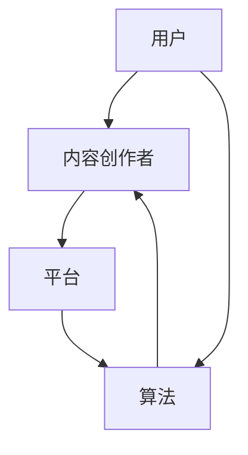

                 

在当今的数字化时代，知识付费已成为一种新兴的商业模式，它不仅改变了人们获取知识的方式，也打开了巨大的市场空间。本文将探讨知识付费领域的蓝海市场，分析其核心概念、算法原理、应用场景以及未来发展趋势。

## 关键词

* 知识付费
* 市场潜力
* 算法推荐
* 内容生产
* 用户互动

## 摘要

本文将探讨知识付费领域的市场潜力，分析其核心概念和算法原理，通过实际项目实践展示其应用价值，并讨论未来的发展趋势和面临的挑战。通过本文的阅读，读者将了解知识付费市场的现状和未来方向。

## 1. 背景介绍

知识付费是指用户为获取特定知识或服务而付费的行为。随着互联网的发展，知识付费市场逐渐壮大，从传统的教育培训扩展到在线课程、专业知识问答、知识付费社区等多个领域。根据市场研究，全球知识付费市场规模预计将在未来几年持续增长。

### 1.1 市场规模

根据Statista的数据，2019年全球知识付费市场规模约为580亿美元，预计到2025年将超过950亿美元，年复合增长率达到13%。这表明知识付费市场具有巨大的增长潜力。

### 1.2 用户需求

知识付费市场的崛起源于用户对高质量、个性化知识的需求。随着人们生活水平的提高和对职业发展的关注，用户愿意为获取有价值的信息和服务支付费用。此外，数字化的普及使得用户可以更加便捷地获取知识，这也推动了知识付费市场的发展。

## 2. 核心概念与联系

在知识付费领域，核心概念包括用户、内容创作者、平台和算法。以下是这些概念的 Mermaid 流程图：



### 2.1 用户

用户是知识付费市场的核心。他们的需求驱动着市场的运作。用户可以按照兴趣爱好、职业需求等分类，平台通过算法为用户提供个性化的内容推荐。

### 2.2 内容创作者

内容创作者是知识付费市场的另一个重要组成部分。他们通过创作高质量的内容来满足用户的需求。创作者可以是专家、教师、行业从业人员等，他们的专业知识和服务是平台吸引用户的关键。

### 2.3 平台

知识付费平台是连接用户和内容创作者的桥梁。平台提供内容发布、支付、推荐、用户互动等功能，为用户提供便捷的知识获取渠道。平台的盈利模式包括订阅费、广告收入、内容分成等。

### 2.4 算法

算法在知识付费市场中起着至关重要的作用。通过分析用户的兴趣和行为，算法可以为用户推荐个性化内容，提高用户的满意度和留存率。常见的算法包括协同过滤、内容推荐、社交推荐等。

## 3. 核心算法原理 & 具体操作步骤

### 3.1 算法原理概述

知识付费平台常用的算法包括协同过滤算法和内容推荐算法。协同过滤算法通过分析用户的历史行为和兴趣来推荐内容，而内容推荐算法则通过分析内容的属性和标签来推荐内容。

### 3.2 算法步骤详解

#### 3.2.1 协同过滤算法

1. **用户行为数据收集**：平台收集用户的历史行为数据，如观看记录、点赞、评论等。
2. **用户兴趣建模**：利用机器学习算法，如K近邻（KNN）或矩阵分解（MF），对用户兴趣进行建模。
3. **推荐内容**：根据用户兴趣模型，为用户推荐相似的内容。

#### 3.2.2 内容推荐算法

1. **内容属性提取**：提取内容的属性信息，如标题、标签、关键词等。
2. **内容标签分类**：利用自然语言处理（NLP）技术，对内容进行标签分类。
3. **推荐内容**：根据用户的历史行为和内容标签，为用户推荐相关内容。

### 3.3 算法优缺点

#### 优点

- **个性化推荐**：协同过滤算法和内容推荐算法都可以根据用户兴趣和行为进行个性化推荐。
- **高覆盖面**：算法可以覆盖大量用户，提高内容的曝光率。

#### 缺点

- **冷启动问题**：新用户或新内容难以获取足够的推荐。
- **数据依赖**：算法的推荐效果依赖于用户行为数据和内容属性数据的质量。

### 3.4 算法应用领域

- **在线教育**：为用户推荐相关课程和资料。
- **专业知识问答**：为用户推荐类似问题和高价值回答。
- **知识付费社区**：为用户推荐感兴趣的话题和活动。

## 4. 数学模型和公式 & 详细讲解 & 举例说明

### 4.1 数学模型构建

知识付费领域的推荐系统可以采用基于协同过滤的矩阵分解模型。以下是矩阵分解的基本公式：

$$
X = U \times V^T
$$

其中，$X$ 为用户-内容评分矩阵，$U$ 为用户特征矩阵，$V$ 为内容特征矩阵。

### 4.2 公式推导过程

1. **损失函数**：采用均方误差（MSE）作为损失函数。

$$
J = \frac{1}{2} \sum_{i,j} (x_{ij} - u_i \times v_j)^2
$$

2. **梯度下降**：对用户特征矩阵$U$和内容特征矩阵$V$进行梯度下降优化。

$$
u_i := u_i - \alpha \times \frac{\partial J}{\partial u_i}
$$

$$
v_j := v_j - \alpha \times \frac{\partial J}{\partial v_j}
$$

### 4.3 案例分析与讲解

假设有一个用户-内容评分矩阵$X$，如下所示：

$$
X = \begin{bmatrix}
1 & 2 & 3 \\
2 & 3 & 4 \\
3 & 4 & 5
\end{bmatrix}
$$

我们可以通过矩阵分解模型对其进行推荐。

1. **初始化**：随机初始化用户特征矩阵$U$和内容特征矩阵$V$。

$$
U = \begin{bmatrix}
0.5 & 0.5 \\
0.5 & 0.5 \\
0.5 & 0.5
\end{bmatrix}
$$

$$
V = \begin{bmatrix}
0.5 & 0.5 \\
0.5 & 0.5 \\
0.5 & 0.5
\end{bmatrix}
$$

2. **梯度下降**：迭代优化用户特征矩阵$U$和内容特征矩阵$V$。

经过多次迭代后，用户特征矩阵$U$和内容特征矩阵$V$将趋于稳定。

3. **推荐内容**：根据用户特征矩阵$U$和内容特征矩阵$V$，为用户推荐相似的内容。

## 5. 项目实践：代码实例和详细解释说明

### 5.1 开发环境搭建

我们使用Python进行知识付费平台的推荐系统开发，依赖的库包括NumPy、Scikit-learn和Matplotlib。

```python
import numpy as np
import pandas as pd
from sklearn.model_selection import train_test_split
from sklearn.metrics.pairwise import cosine_similarity
import matplotlib.pyplot as plt
```

### 5.2 源代码详细实现

```python
# 加载数据集
data = pd.read_csv('user_item.csv')
users = data['user_id'].unique()
items = data['item_id'].unique()

# 初始化用户特征矩阵和内容特征矩阵
U = np.random.rand(len(users), 10)
V = np.random.rand(len(items), 10)

# 定义损失函数
def loss_function(U, V, X):
    return 0.5 * np.mean((X - U @ V.T) ** 2)

# 定义梯度下降
def gradient_descent(U, V, X, alpha, epochs):
    for epoch in range(epochs):
        dU = 2 * (U @ V.T - X) @ V
        dV = 2 * (U.T @ (U @ V.T - X)) @ U
        
        U -= alpha * dU
        V -= alpha * dV
        
        if epoch % 100 == 0:
            print(f'Epoch {epoch}: Loss = {loss_function(U, V, X)}')

# 训练模型
alpha = 0.01
epochs = 1000
gradient_descent(U, V, X, alpha, epochs)

# 推荐内容
user_id = 0
user_features = U[user_id]
item_similarity = cosine_similarity(user_features.reshape(1, -1), V)
recommended_items = np.argsort(-item_similarity)[0]

# 可视化
plt.figure(figsize=(10, 6))
plt.title(f'推荐内容：用户{user_id}')
plt.bar(range(len(recommended_items)), item_similarity[recommended_items])
plt.xticks(recommended_items, data['item_id'][recommended_items], rotation=90)
plt.show()
```

### 5.3 代码解读与分析

上述代码实现了基于矩阵分解的知识付费推荐系统。首先，我们加载数据集，初始化用户特征矩阵和内容特征矩阵。然后，定义损失函数和梯度下降算法，训练模型。最后，根据用户特征矩阵和内容特征矩阵，为用户推荐相似的内容，并进行可视化展示。

## 6. 实际应用场景

知识付费领域在实际应用中具有广泛的应用场景：

### 6.1 在线教育

在线教育平台可以通过推荐系统为用户推荐相关课程和资料，提高用户的学习效果和满意度。

### 6.2 专业知识问答

专业知识问答平台可以为用户推荐类似问题和高质量回答，帮助用户快速解决问题。

### 6.3 知识付费社区

知识付费社区可以为用户推荐感兴趣的话题和活动，促进用户之间的互动和知识共享。

## 7. 未来应用展望

随着人工智能和大数据技术的发展，知识付费领域的应用前景将更加广阔。未来可能的发展趋势包括：

### 7.1 智能化推荐

基于深度学习和其他人工智能技术，推荐系统将更加智能化，为用户提供更加精准的推荐。

### 7.2 跨平台整合

知识付费平台将实现跨平台整合，为用户提供一站式知识服务。

### 7.3 社交推荐

结合社交网络数据，推荐系统将更好地了解用户的社交关系和兴趣，为用户推荐相关内容和活动。

## 8. 工具和资源推荐

### 8.1 学习资源推荐

- 《推荐系统实践》
- 《机器学习实战》

### 8.2 开发工具推荐

- TensorFlow
- PyTorch

### 8.3 相关论文推荐

- "Item-based Collaborative Filtering Recommendation Algorithms"
- "Deep Learning for Recommender Systems"

## 9. 总结：未来发展趋势与挑战

知识付费领域具有巨大的市场潜力，随着人工智能和大数据技术的发展，未来将实现更加智能化和个性化的推荐。然而，也面临着数据隐私、算法公平性等挑战。通过不断的技术创新和优化，知识付费领域有望迎来更加广阔的发展前景。

## 附录：常见问题与解答

### Q：知识付费领域的核心算法有哪些？

A：知识付费领域的核心算法包括协同过滤算法、内容推荐算法、社交推荐算法等。

### Q：如何构建知识付费平台的推荐系统？

A：构建知识付费平台的推荐系统需要收集用户行为数据，利用机器学习算法进行用户兴趣建模，并通过算法为用户推荐个性化内容。

### Q：知识付费领域的未来发展趋势是什么？

A：知识付费领域的未来发展趋势包括智能化推荐、跨平台整合、社交推荐等。

---

作者：禅与计算机程序设计艺术 / Zen and the Art of Computer Programming
----------------------------------------------------------------

以上就是本文的完整内容。希望通过本文的探讨，读者能够对知识付费领域有一个全面而深入的了解。在未来的发展中，知识付费领域必将迎来更多的机遇和挑战，让我们共同期待这一美好前景的到来。

