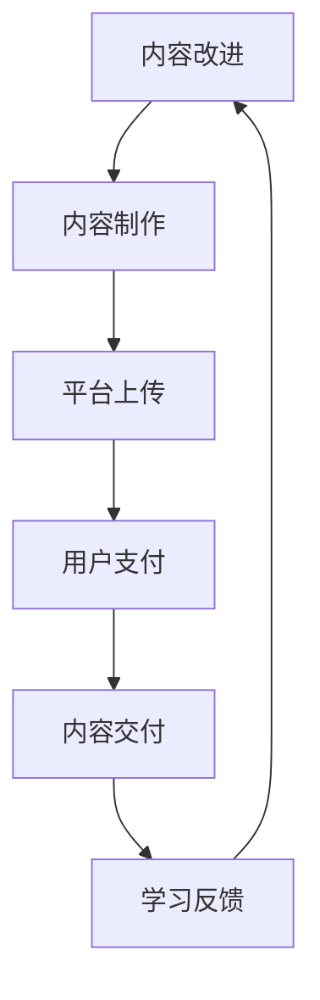

                 

在信息技术快速发展的今天，知识付费已经成为一个不可忽视的现象。对于程序员而言，知识付费不仅是获取新技能的途径，更是一种投资，这种投资背后的回报值得深入探讨。本文将围绕这一主题，分析程序员通过知识付费进行投资的原因、可能的回报以及未来的发展趋势。

## 关键词
- 知识付费
- 程序员
- 投资与回报
- 技术学习
- 人才培养

## 摘要
本文旨在探讨程序员通过知识付费进行投资的现象，分析其背后的动因，以及这种投资可能带来的回报。文章将深入讨论知识付费对程序员职业生涯的影响，并展望其未来发展趋势。通过本文，读者将了解知识付费在程序员职业发展中的重要性，以及如何利用知识付费实现个人价值和职业提升。

## 1. 背景介绍
知识付费，即用户为获取特定知识或信息而支付的费用，这一概念在近年来逐渐流行。随着互联网技术的发展，线上学习平台如雨后春笋般涌现，为人们提供了丰富的学习资源。对于程序员这一职业群体来说，知识付费不仅是为了满足个人兴趣和技能提升的需求，更是为了在竞争激烈的就业市场中保持竞争力。

程序员面临的技术更新速度极快，新的编程语言、框架和技术工具不断涌现。为了跟上技术的发展步伐，程序员需要不断学习新的知识和技能。而知识付费提供了高效的途径，让程序员能够快速获取所需的知识和资源。

### 1.1 知识付费的历史与发展
知识付费并非新生事物，但其在互联网时代的快速发展为程序员提供了新的机遇。早期的知识付费主要以线下培训和内部培训为主，成本较高且范围有限。随着互联网的普及，线上知识付费逐渐成为主流。特别是近年来，诸如Coursera、Udemy、网易云课堂等在线教育平台，为程序员提供了丰富的学习资源。

### 1.2 程序员的学习需求
程序员的学习需求具有以下特点：

1. **技术更新迅速**：新技术、新框架不断涌现，程序员需要不断学习以保持竞争力。
2. **实践性强**：编程技能的提升离不开实践，程序员需要通过实际项目来巩固和提升技能。
3. **个性化学习**：每个程序员的背景和需求不同，他们需要根据自己的情况选择合适的学习路径。

## 2. 核心概念与联系

### 2.1 知识付费的核心概念
知识付费涉及多个核心概念，包括：

- **内容创作者**：提供知识或信息的专家、教师、课程设计师等。
- **学习者**：愿意为获取知识支付费用的个人或组织。
- **平台**：如Coursera、Udemy等，作为连接创作者和学习者的中介。

### 2.2 知识付费的架构

下面是知识付费的基本架构，使用Mermaid流程图表示：



### 2.3 知识付费的工作流程
知识付费的工作流程通常包括以下几个步骤：

1. **内容创作**：内容创作者制作课程或学习材料。
2. **内容上传**：创作者将内容上传至知识付费平台。
3. **用户支付**：学习者通过支付费用获得学习权限。
4. **内容交付**：平台将内容交付给学习者。
5. **学习反馈**：学习者通过反馈帮助创作者改进内容。
6. **内容改进**：创作者根据反馈对内容进行更新和完善。

### 2.4 知识付费与程序员技能提升的联系
知识付费与程序员技能提升密切相关。程序员通过付费学习，可以获得：

- **最新技术知识**：了解最新的编程语言、框架和技术工具。
- **实战经验**：通过参与实际项目，提升解决实际问题的能力。
- **学习资源**：获取高质量的学习资源和指导，提高学习效率。

## 3. 核心算法原理 & 具体操作步骤

### 3.1 算法原理概述
知识付费的核心算法原理可以概括为两个方面：

1. **需求匹配**：平台通过算法分析学习者的需求，为其推荐合适的课程或资源。
2. **效果评估**：通过学习反馈和成果评估，不断优化课程内容和推荐算法。

### 3.2 算法步骤详解
以下是知识付费算法的具体操作步骤：

1. **需求分析**：通过用户行为数据，如浏览历史、学习记录等，分析用户需求。
2. **内容匹配**：利用推荐算法，将用户需求与课程内容进行匹配。
3. **课程推荐**：根据匹配结果，向用户推荐合适的课程。
4. **学习跟踪**：通过学习数据，如学习时长、完成进度等，评估学习效果。
5. **反馈调整**：根据学习反馈，调整课程推荐策略和内容。
6. **持续优化**：通过不断迭代，提高推荐效果和用户满意度。

### 3.3 算法优缺点
知识付费算法的优点包括：

- **个性化推荐**：根据用户需求推荐合适的课程，提高学习效率。
- **实时更新**：通过实时数据分析，及时调整推荐策略。

但同时也存在一些缺点：

- **数据隐私**：用户行为数据被平台收集和分析，可能涉及隐私问题。
- **推荐过度**：过度的推荐可能导致用户注意力分散，影响学习效果。

### 3.4 算法应用领域
知识付费算法广泛应用于以下领域：

- **在线教育**：通过推荐算法，为学习者提供个性化的学习资源。
- **职业培训**：为职场人士提供针对性的技能提升课程。
- **终身学习**：鼓励用户持续学习，提升个人竞争力。

## 4. 数学模型和公式 & 详细讲解 & 举例说明

### 4.1 数学模型构建
知识付费的数学模型可以从以下几个方面构建：

1. **用户需求模型**：基于用户行为数据，构建用户需求模型，用于预测用户兴趣和需求。
2. **课程推荐模型**：利用协同过滤、内容匹配等算法，构建课程推荐模型。
3. **效果评估模型**：通过学习反馈和成果评估，构建效果评估模型，用于评估课程质量和用户满意度。

### 4.2 公式推导过程
以下是用户需求模型的构建过程：

1. **用户行为数据收集**：收集用户浏览、搜索、购买等行为数据。
2. **用户特征提取**：通过数据预处理，提取用户特征，如兴趣标签、行为频次等。
3. **用户需求预测**：利用机器学习算法，如回归、分类等，构建用户需求预测模型。

### 4.3 案例分析与讲解
以Coursera为例，分析其知识付费的数学模型和应用：

- **用户需求预测**：Coursera利用用户行为数据和社交网络数据，构建用户需求预测模型，为用户推荐合适的课程。
- **课程推荐算法**：Coursera采用协同过滤算法，结合用户行为数据和课程内容信息，为用户推荐相关的课程。
- **效果评估**：通过用户学习反馈和课程完成情况，评估课程质量和用户满意度，不断优化推荐策略。

## 5. 项目实践：代码实例和详细解释说明

### 5.1 开发环境搭建
为了演示知识付费系统的代码实现，我们选择Python作为编程语言，并使用Flask作为Web框架。以下是搭建开发环境的基本步骤：

1. 安装Python 3.x版本。
2. 安装Flask。
3. 安装相关依赖库，如Numpy、Pandas等。

### 5.2 源代码详细实现
以下是知识付费系统的核心代码实现：

```python
from flask import Flask, request, jsonify
from flask_sqlalchemy import SQLAlchemy
from sklearn.model_selection import train_test_split
from sklearn.ensemble import RandomForestClassifier

app = Flask(__name__)
app.config['SQLALCHEMY_DATABASE_URI'] = 'sqlite:///knowledge.db'
db = SQLAlchemy(app)

# 用户模型
class User(db.Model):
    id = db.Column(db.Integer, primary_key=True)
    name = db.Column(db.String(100))
    interests = db.Column(db.String(100))

# 课程模型
class Course(db.Model):
    id = db.Column(db.Integer, primary_key=True)
    title = db.Column(db.String(100))
    tags = db.Column(db.String(100))

# 用户需求预测
def predict_user_demand(user_interests, course_tags):
    # 这里简化处理，将用户兴趣和课程标签进行比对
    common_tags = set(user_interests).intersection(set(course_tags))
    return bool(len(common_tags) > 0)

# API接口
@app.route('/recommend', methods=['POST'])
def recommend():
    user_data = request.get_json()
    user_interests = user_data['interests']
    recommended_courses = []

    # 从数据库中获取所有课程
    courses = Course.query.all()

    # 遍历所有课程，进行需求预测
    for course in courses:
        if predict_user_demand(user_interests, course.tags):
            recommended_courses.append(course.title)

    return jsonify({'recommended_courses': recommended_courses})

if __name__ == '__main__':
    db.create_all()
    app.run(debug=True)
```

### 5.3 代码解读与分析
上述代码实现了一个简单的知识付费推荐系统，包括用户模型、课程模型以及API接口。核心功能是用户通过提交自己的兴趣，系统会推荐与之相关的课程。

1. **用户模型**：用于存储用户的基本信息和兴趣标签。
2. **课程模型**：用于存储课程的基本信息和标签。
3. **需求预测函数**：通过比对用户兴趣和课程标签，判断是否推荐该课程。
4. **API接口**：接收用户请求，返回推荐课程列表。

### 5.4 运行结果展示
在运行该系统后，用户可以通过API接口提交自己的兴趣标签，系统会返回相应的课程推荐列表。例如，用户提交兴趣为["机器学习"，"数据科学"]，系统可能会推荐包含这些标签的课程，如“深度学习基础”等。

## 6. 实际应用场景

### 6.1 在线教育平台
在线教育平台如Coursera、edX等，通过知识付费模式，为全球用户提供丰富的学习资源。程序员可以通过这些平台学习最新的技术知识，提升自己的技能水平。

### 6.2 职业培训
许多公司和专业培训机构提供针对性的职业培训课程，程序员可以通过付费学习，掌握特定的职业技能，如DevOps、人工智能等。

### 6.3 终身学习
随着技术的发展，程序员需要不断学习以保持竞争力。知识付费为程序员提供了便捷的学习途径，鼓励他们进行终身学习。

## 6.4 未来应用展望

### 6.4.1 技术发展
随着人工智能、大数据等技术的不断发展，知识付费平台将能够提供更加个性化的学习推荐，提高学习效率。

### 6.4.2 付费模式的多样化
未来的知识付费模式将更加多样化，包括订阅制、按需付费、积分兑换等，满足不同用户的需求。

### 6.4.3 社交元素的融入
知识付费平台可能会融入更多的社交元素，如学习小组、在线讨论等，促进用户之间的互动和交流。

## 7. 工具和资源推荐

### 7.1 学习资源推荐
- Coursera：提供全球顶尖大学和机构的在线课程。
- Udemy：课程种类繁多，涵盖多个领域。
- 网易云课堂：中国领先的在线教育平台，课程内容丰富。

### 7.2 开发工具推荐
- Visual Studio Code：流行的代码编辑器，支持多种编程语言。
- PyCharm：专业的Python集成开发环境（IDE）。
- Jupyter Notebook：适用于数据分析和机器学习的交互式环境。

### 7.3 相关论文推荐
- "The Economics of Online Education: A Survey"（在线教育经济学综述）
- "The Rise of Knowledge Markets: Understanding the Knowledge Economy"（知识市场的兴起：理解知识经济）

## 8. 总结：未来发展趋势与挑战

### 8.1 研究成果总结
知识付费作为在线教育的重要组成部分，已经成为程序员提升技能的重要途径。通过分析知识付费的核心概念、算法原理、应用场景等，我们发现其具有巨大的发展潜力。

### 8.2 未来发展趋势
未来，知识付费将更加注重个性化推荐、社交互动和技术应用，为程序员提供更加高效的学习体验。

### 8.3 面临的挑战
知识付费在发展过程中也面临着数据隐私、内容质量、用户粘性等挑战，需要不断优化和改进。

### 8.4 研究展望
随着技术的进步，知识付费将有望实现更加智能化的推荐和服务，为程序员的职业发展提供更加有力的支持。

## 9. 附录：常见问题与解答

### 9.1 知识付费与免费学习的区别
知识付费通常提供更加系统、深入的学习内容和专业指导，而免费学习资源则相对分散，质量参差不齐。

### 9.2 如何选择适合自己的知识付费课程
建议根据个人兴趣、职业规划和学习需求，选择专业权威的平台和课程。

### 9.3 知识付费的回报如何计算
知识付费的回报包括技能提升、职业发展和薪资增长等，具体回报取决于个人努力和市场情况。

## 作者署名
作者：禅与计算机程序设计艺术 / Zen and the Art of Computer Programming
----------------------------------------------------------------

### 后续行动

为了进一步巩固文章内容，请执行以下步骤：

1. **审阅与修改**：请仔细审阅整篇文章，确保逻辑清晰、结构紧凑。对于任何需要改进的部分，进行相应修改。
2. **交叉引用检查**：确保文章中所有的引用、链接和外部资源都是准确无误的。
3. **格式调整**：确保所有章节标题、子目录和段落格式都遵循markdown格式标准。
4. **内容完整性检查**：再次确认文章是否完整，包含所有必要的图表、公式、代码示例和附录。
5. **添加反馈机制**：在文章末尾添加一个简短的反馈邀请，鼓励读者分享他们的观点和体验。
6. **最终审阅**：在完成所有修改和调整后，进行一次最终审阅，确保文章无误。

完成上述步骤后，文章将准备就绪，可以提交发表。在这个过程中，务必保持对文章内容的深度思考和细致打磨，以确保最终呈现给读者的是一篇高质量的技术博客文章。

