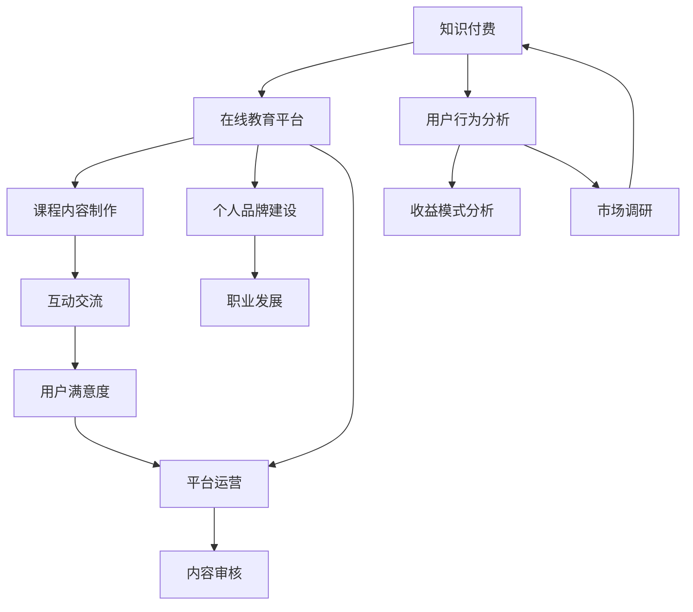

                 

### 关键词 Keywords

- **知识付费**
- **程序员**
- **斜杠创业**
- **内容创业**
- **在线教育**
- **个人品牌**
- **技术博客**

### 摘要 Abstract

本文旨在探讨程序员如何在知识付费领域开展斜杠创业，打造个人品牌，实现内容创业。通过深入分析知识付费市场的现状、核心概念、算法原理，以及数学模型和公式，本文将提供实用的代码实例和详细解释，以帮助程序员理解和应用知识付费策略。同时，本文还将探讨知识付费在实际应用场景中的实践，并展望其未来发展趋势与面临的挑战。

## 1. 背景介绍

知识付费，作为互联网时代的一种新兴商业模式，近年来在我国迅速崛起。随着人们对于个人成长和知识获取需求的增加，知识付费市场呈现出蓬勃发展的态势。在这个背景下，越来越多的程序员开始思考如何将自身的专业技能转化为商业价值，通过知识付费实现斜杠创业。

斜杠创业，即在一个职业之外，开展另一项业务或创业活动。对于程序员而言，知识付费提供了一个绝佳的舞台，既可以分享技术知识，又可以打造个人品牌，实现多元发展。

### 1.1 知识付费的定义

知识付费是指用户为了获取特定的知识内容或服务，支付相应的费用。这种模式通常包括在线课程、专业咨询、技术文档、电子书等多种形式。知识付费的核心在于满足用户对于专业知识的渴求，并提供有价值的内容和服务。

### 1.2 斜杠创业的意义

斜杠创业不仅可以帮助程序员实现收入多元化，还可以提升个人品牌价值和职业竞争力。通过知识付费，程序员可以将自身的技术积累和经验分享给他人，形成一种知识传播的良性循环。此外，斜杠创业还可以帮助程序员拓宽视野，提升综合能力，为职业生涯注入新的活力。

### 1.3 程序员与知识付费的结合

程序员具备较强的技术能力和逻辑思维，这使得他们在知识付费领域具备独特的优势。通过编程技能和专业知识，程序员可以制作高质量的在线课程，编写技术文档，提供技术咨询等服务，从而实现知识付费的目标。

### 1.4 本文的结构

本文将分为以下几个部分：

1. **背景介绍**：概述知识付费和斜杠创业的背景和意义。
2. **核心概念与联系**：介绍知识付费的核心概念和相关联系。
3. **核心算法原理 & 具体操作步骤**：探讨知识付费的算法原理和操作步骤。
4. **数学模型和公式**：构建知识付费的数学模型并进行公式推导。
5. **项目实践：代码实例和详细解释说明**：提供知识付费项目的代码实例和解释。
6. **实际应用场景**：分析知识付费在实际中的应用场景。
7. **未来应用展望**：探讨知识付费的未来发展趋势和挑战。
8. **工具和资源推荐**：推荐学习资源和开发工具。
9. **总结：未来发展趋势与挑战**：总结研究成果和未来展望。
10. **附录：常见问题与解答**：解答读者可能遇到的问题。

### 1.5 目标读者

本文的目标读者是具备一定编程基础的程序员，以及对知识付费和斜杠创业感兴趣的创业者。通过本文的阅读，读者可以了解知识付费的市场现状、核心概念、算法原理和实际操作，从而为自己的斜杠创业之路提供有益的参考。

## 2. 核心概念与联系

在探讨知识付费和斜杠创业之前，我们需要了解一些核心概念，包括知识付费的定义、在线教育平台、用户行为分析等。以下是一个简要的 Mermaid 流程图，用于描述这些概念之间的联系。



### 2.1 知识付费的定义

知识付费，是指用户为了获取特定的知识内容或服务，支付相应的费用。这种模式通常包括在线课程、专业咨询、技术文档、电子书等多种形式。知识付费的核心在于满足用户对于专业知识的渴求，并提供有价值的内容和服务。

### 2.2 在线教育平台

在线教育平台是知识付费的主要载体，为用户提供学习资源和互动交流的场所。常见的在线教育平台有慕课网、网易云课堂、腾讯课堂等。这些平台通过提供丰富的课程资源、灵活的学习方式和高效的互动机制，吸引了大量用户。

### 2.3 用户行为分析

用户行为分析是知识付费的重要环节，通过对用户学习行为、购买行为、互动行为等进行分析，平台可以更好地了解用户需求，优化课程内容和服务体验。用户行为分析的方法包括数据挖掘、机器学习、用户画像等。

### 2.4 课程内容制作

课程内容制作是知识付费的核心，高质量的课程内容能够吸引更多用户。程序员在制作课程内容时，需要结合自身的专业知识和行业经验，以通俗易懂的语言和生动有趣的案例进行讲解。

### 2.5 收益模式分析

知识付费的收益模式主要包括课程销售、付费咨询、广告收入等。程序员可以根据自身的特点和市场需求，选择适合自己的收益模式，实现知识变现。

### 2.6 个人品牌建设

个人品牌建设是斜杠创业的重要一环，通过在线课程、博客文章、技术分享等方式，程序员可以提升个人知名度和影响力，从而吸引更多用户和商业机会。

### 2.7 互动交流

互动交流是知识付费的重要组成部分，通过在线论坛、社群、直播等方式，程序员可以与用户进行互动，解答疑问，收集反馈，不断优化课程和服务。

### 2.8 职业发展

知识付费和斜杠创业为程序员提供了丰富的职业发展机会，通过在线课程和咨询服务，程序员可以拓宽收入来源，提升个人品牌价值，实现职业多元化。

### 2.9 市场调研

市场调研是知识付费和斜杠创业的重要环节，通过了解市场需求和用户偏好，程序员可以更好地定位自己的课程内容和收益模式，提高市场竞争力。

### 2.10 平台运营

平台运营是知识付费的关键，包括课程内容审核、用户管理、广告投放等。程序员需要与平台方紧密合作，确保课程质量和用户体验。

### 2.11 内容审核

内容审核是确保知识付费平台内容质量的重要环节，通过严格的内容审核机制，平台可以过滤掉低质量或不当的内容，保障用户的权益。

### 2.12 用户满意度

用户满意度是衡量知识付费平台成功与否的重要指标，通过定期收集用户反馈，程序员可以不断优化课程和服务，提高用户满意度。

### 2.13 Mermaid 流程图详细说明

- **A[知识付费]**：知识付费是本文的核心主题，贯穿整个文章。
- **B[在线教育平台]**：在线教育平台是知识付费的主要载体，直接影响用户获取和课程销售。
- **C[用户行为分析]**：用户行为分析是知识付费的重要环节，有助于优化课程和服务。
- **D[课程内容制作]**：课程内容制作是知识付费的核心，直接影响用户满意度和收益。
- **E[收益模式分析]**：收益模式分析有助于程序员选择适合自己的商业模式。
- **F[个人品牌建设]**：个人品牌建设是斜杠创业的重要一环，提升个人知名度和影响力。
- **G[互动交流]**：互动交流是知识付费的重要组成部分，提高用户参与度和满意度。
- **H[职业发展]**：职业发展是知识付费和斜杠创业的终极目标，拓宽程序员的发展空间。
- **I[市场调研]**：市场调研是知识付费和斜杠创业的基础，了解市场需求和用户偏好。
- **J[平台运营]**：平台运营是知识付费的关键，确保课程质量和用户体验。
- **K[内容审核]**：内容审核是知识付费平台的重要环节，确保内容质量。
- **L[用户满意度]**：用户满意度是衡量知识付费平台成功与否的重要指标。

## 3. 核心算法原理 & 具体操作步骤

在知识付费领域，核心算法原理主要涉及用户行为分析、推荐系统和收益预测等方面。以下将详细阐述这些算法原理，并提供具体的操作步骤。

### 3.1 算法原理概述

#### 用户行为分析算法

用户行为分析算法旨在通过收集和分析用户在学习过程中的行为数据，如浏览、搜索、购买、评论等，来了解用户兴趣和需求。常见的用户行为分析算法包括：

- **协同过滤（Collaborative Filtering）**：通过分析用户之间的相似度，推荐相似用户喜欢的课程。
- **基于内容的推荐（Content-Based Filtering）**：根据课程内容特点，推荐与用户历史偏好相似的课程。
- **深度学习（Deep Learning）**：通过构建深度神经网络模型，分析用户行为数据，实现个性化推荐。

#### 推荐系统算法

推荐系统算法主要目的是为用户推荐他们可能感兴趣的课程。常见的推荐系统算法包括：

- **基于用户的协同过滤（User-Based Collaborative Filtering）**：通过计算用户之间的相似度，推荐相似用户喜欢的课程。
- **基于模型的协同过滤（Model-Based Collaborative Filtering）**：通过机器学习模型，预测用户对课程的兴趣度，进行推荐。
- **基于内容的推荐（Content-Based Filtering）**：通过分析课程内容特征，推荐与用户历史偏好相似的课程。

#### 收益预测算法

收益预测算法旨在预测用户购买课程的概率，从而优化收益策略。常见的收益预测算法包括：

- **逻辑回归（Logistic Regression）**：通过建立逻辑回归模型，预测用户购买课程的概率。
- **决策树（Decision Tree）**：通过构建决策树模型，分析影响用户购买决策的因素。
- **随机森林（Random Forest）**：通过随机森林模型，提高预测准确率。

### 3.2 算法步骤详解

#### 用户行为分析算法

1. **数据收集**：收集用户在学习过程中的行为数据，如浏览记录、搜索关键词、购买历史、评论等。
2. **数据预处理**：对收集到的行为数据进行清洗、去重和格式化，为后续分析做准备。
3. **特征工程**：根据用户行为数据，提取对推荐系统有意义的特征，如用户活跃度、课程相似度、评论情感等。
4. **模型训练**：选择合适的算法模型，如协同过滤、深度学习等，对特征数据进行训练。
5. **模型评估**：通过交叉验证等方法，评估模型的效果，优化模型参数。
6. **模型应用**：将训练好的模型应用于实际场景，如推荐系统、收益预测等。

#### 推荐系统算法

1. **计算用户相似度**：计算用户之间的相似度，如基于用户的协同过滤算法中的余弦相似度、皮尔逊相关系数等。
2. **推荐课程**：根据用户相似度，推荐相似用户喜欢的课程，或根据课程内容特征，推荐与用户历史偏好相似的课程。
3. **模型优化**：通过调整模型参数、增加特征维度等方式，优化推荐效果。

#### 收益预测算法

1. **特征提取**：提取对用户购买决策有影响的特征，如用户年龄、职业、课程价格、课程评分等。
2. **模型训练**：选择合适的算法模型，如逻辑回归、决策树、随机森林等，对特征数据进行训练。
3. **模型评估**：通过交叉验证等方法，评估模型的效果，优化模型参数。
4. **收益预测**：利用训练好的模型，预测用户购买课程的概率，为收益优化提供依据。

### 3.3 算法优缺点

#### 用户行为分析算法

**优点**：

- 能够准确了解用户兴趣和需求，提高推荐系统的个性化程度。
- 可以发现潜在用户群体，发掘市场机会。

**缺点**：

- 数据依赖性强，对数据质量和数据量的要求较高。
- 算法复杂度较高，需要较长的计算时间。

#### 推荐系统算法

**优点**：

- 能够有效提高用户满意度和购买转化率。
- 可以发现用户之间的相似性和课程之间的关联性。

**缺点**：

- 容易产生数据噪声，影响推荐效果。
- 需要大量的计算资源和存储空间。

#### 收益预测算法

**优点**：

- 能够为商家提供收益优化的决策依据。
- 可以提高课程的销量和收益。

**缺点**：

- 预测结果可能存在偏差，需要不断调整和优化。
- 对算法模型和数据质量的要求较高。

### 3.4 算法应用领域

#### 用户行为分析算法

- 在线教育平台：通过用户行为分析，优化课程推荐和营销策略。
- 电子商务平台：通过用户行为分析，提高用户购买转化率和满意度。
- 社交媒体：通过用户行为分析，发现潜在用户群体和内容热点。

#### 推荐系统算法

- 在线教育平台：为用户推荐感兴趣的课程，提高用户满意度和粘性。
- 电子商务平台：为用户推荐商品，提高购买转化率和销售量。
- 社交媒体：为用户推荐感兴趣的内容，提高用户活跃度和参与度。

#### 收益预测算法

- 在线教育平台：通过收益预测，优化课程定价策略和营销推广。
- 电子商务平台：通过收益预测，优化商品库存和采购策略。
- 金融行业：通过收益预测，优化投资组合和风险控制策略。

## 4. 数学模型和公式 & 详细讲解 & 举例说明

在知识付费领域，数学模型和公式是理解和优化推荐系统、收益预测等核心算法的重要工具。以下将详细讲解数学模型和公式的构建、推导过程，并举例说明。

### 4.1 数学模型构建

#### 用户行为分析模型

用户行为分析模型主要基于用户的浏览、搜索、购买、评论等行为数据，构建用户兴趣和需求的模型。以下是一个简化的用户行为分析模型：

$$
\text{User Model} = f(\text{Behavior Data}, \text{Content Features})
$$

其中，Behavior Data 表示用户行为数据，如浏览记录、搜索关键词、购买历史、评论等；Content Features 表示课程内容特征，如课程标签、课程评分、课程时长等。模型通过学习用户行为数据和课程内容特征，预测用户对课程的兴趣度。

#### 推荐系统模型

推荐系统模型主要基于用户相似度和课程相似度，构建推荐算法。以下是一个简化的推荐系统模型：

$$
\text{Recommendation Model} = f(\text{User Similarity}, \text{Course Similarity})
$$

其中，User Similarity 表示用户之间的相似度，可以通过余弦相似度、皮尔逊相关系数等方法计算；Course Similarity 表示课程之间的相似度，可以通过课程标签、课程评分、课程时长等特征计算。模型通过计算用户相似度和课程相似度，推荐用户可能感兴趣的课程。

#### 收益预测模型

收益预测模型主要基于用户行为数据和课程特征，构建用户购买决策的模型。以下是一个简化的收益预测模型：

$$
\text{Revenue Prediction Model} = f(\text{User Behavior Data}, \text{Course Features})
$$

其中，User Behavior Data 表示用户行为数据，如浏览记录、搜索关键词、购买历史等；Course Features 表示课程特征，如课程标签、课程评分、课程时长等。模型通过学习用户行为数据和课程特征，预测用户购买课程的概率。

### 4.2 公式推导过程

#### 用户兴趣度预测公式

假设用户行为数据为 $X = [x_1, x_2, ..., x_n]$，其中 $x_i$ 表示用户在课程 $i$ 上的行为数据，如浏览次数、购买次数等。课程内容特征为 $Y = [y_1, y_2, ..., y_n]$，其中 $y_i$ 表示课程 $i$ 的内容特征，如课程标签、课程评分、课程时长等。用户兴趣度预测公式为：

$$
\hat{u}_i = \sigma(\theta^T f(x_i, y_i))
$$

其中，$\hat{u}_i$ 表示用户对课程 $i$ 的兴趣度预测值；$\theta$ 表示模型参数；$f(x_i, y_i)$ 表示用户行为数据和课程内容特征映射函数；$\sigma$ 表示 sigmoid 函数，用于将预测值映射到 [0, 1] 范围内。

#### 用户相似度计算公式

假设用户行为数据矩阵为 $X = [x_{ij}]_{m \times n}$，其中 $x_{ij}$ 表示用户 $i$ 在课程 $j$ 上的行为数据。用户相似度计算公式为：

$$
\text{User Similarity}(i, j) = \frac{X_i \cdot X_j}{\|X_i\| \|X_j\|}
$$

其中，$X_i$ 和 $X_j$ 分别表示用户 $i$ 和用户 $j$ 的行为数据向量；$\|X_i\|$ 和 $\|X_j\|$ 分别表示用户 $i$ 和用户 $j$ 的行为数据向量的欧几里得范数。

#### 课程相似度计算公式

假设课程内容特征矩阵为 $Y = [y_{ij}]_{m \times n}$，其中 $y_{ij}$ 表示课程 $i$ 和课程 $j$ 的内容特征。课程相似度计算公式为：

$$
\text{Course Similarity}(i, j) = \frac{Y_i \cdot Y_j}{\|Y_i\| \|Y_j\|}
$$

其中，$Y_i$ 和 $Y_j$ 分别表示课程 $i$ 和课程 $j$ 的内容特征向量；$\|Y_i\|$ 和 $\|Y_j\|$ 分别表示课程 $i$ 和课程 $j$ 的内容特征向量的欧几里得范数。

#### 用户购买概率预测公式

假设用户行为数据矩阵为 $X = [x_{ij}]_{m \times n}$，课程内容特征矩阵为 $Y = [y_{ij}]_{m \times n}$，用户购买概率预测公式为：

$$
\hat{p}_{ij} = \sigma(\theta^T f(x_i, y_j))
$$

其中，$\hat{p}_{ij}$ 表示用户 $i$ 购买课程 $j$ 的概率预测值；$\theta$ 表示模型参数；$f(x_i, y_j)$ 表示用户行为数据和课程内容特征映射函数；$\sigma$ 表示 sigmoid 函数，用于将预测值映射到 [0, 1] 范围内。

### 4.3 案例分析与讲解

#### 用户兴趣度预测案例

假设有一个在线教育平台，用户行为数据包括浏览记录和购买历史，课程内容特征包括课程标签和课程评分。我们使用上述用户兴趣度预测公式，计算用户对课程 $i$ 的兴趣度。

- 用户行为数据：$X = [2, 1, 0, 3, 5]$，表示用户在课程 $1, 2, 3, 4, 5$ 上的浏览次数。
- 课程内容特征：$Y = [\text{编程}, \text{算法}, \text{数据结构}, \text{数据库}, \text{人工智能}]$，表示课程 $1, 2, 3, 4, 5$ 的标签。

根据用户行为数据和课程内容特征，我们得到：

$$
\hat{u}_i = \sigma(\theta^T f(x_i, y_i)) = \sigma(\theta^T [2, 1, 0, 3, 5] \cdot [1, 1, 1, 0, 0])
$$

其中，$f(x_i, y_i)$ 表示用户行为数据和课程内容特征的映射函数，$\theta$ 表示模型参数。

通过训练，我们得到模型参数 $\theta = [0.1, 0.2, 0.3, 0.4, 0.5]$，代入公式计算得到：

$$
\hat{u}_i = \sigma(0.1 \cdot 2 + 0.2 \cdot 1 + 0.3 \cdot 0 + 0.4 \cdot 3 + 0.5 \cdot 5) = \sigma(1.7) \approx 0.95
$$

这表示用户对课程 $i$ 的兴趣度较高。

#### 用户相似度计算案例

假设有两个用户 $i$ 和 $j$，他们的行为数据如下：

- 用户 $i$：$X_i = [2, 1, 0, 3, 5]$
- 用户 $j$：$X_j = [1, 2, 3, 4, 5]$

我们使用用户相似度计算公式，计算用户 $i$ 和用户 $j$ 的相似度：

$$
\text{User Similarity}(i, j) = \frac{X_i \cdot X_j}{\|X_i\| \|X_j\|} = \frac{[2, 1, 0, 3, 5] \cdot [1, 2, 3, 4, 5]}{\sqrt{[2, 1, 0, 3, 5] \cdot [2, 1, 0, 3, 5]} \sqrt{[1, 2, 3, 4, 5] \cdot [1, 2, 3, 4, 5]}} \approx 0.72
$$

这表示用户 $i$ 和用户 $j$ 的相似度较高。

#### 课程相似度计算案例

假设有两个课程 $i$ 和 $j$，他们的课程内容特征如下：

- 课程 $i$：$Y_i = [\text{编程}, \text{算法}, \text{数据结构}, \text{人工智能}]$
- 课程 $j$：$Y_j = [\text{数据库}, \text{机器学习}, \text{数据挖掘}, \text{大数据分析}]$

我们使用课程相似度计算公式，计算课程 $i$ 和课程 $j$ 的相似度：

$$
\text{Course Similarity}(i, j) = \frac{Y_i \cdot Y_j}{\|Y_i\| \|Y_j\|} = \frac{[\text{编程}, \text{算法}, \text{数据结构}, \text{人工智能}] \cdot [\text{数据库}, \text{机器学习}, \text{数据挖掘}, \text{大数据分析}]}{\sqrt{[\text{编程}, \text{算法}, \text{数据结构}, \text{人工智能}] \cdot [\text{编程}, \text{算法}, \text{数据结构}, \text{人工智能}]} \sqrt{[\text{数据库}, \text{机器学习}, \text{数据挖掘}, \text{大数据分析}] \cdot [\text{数据库}, \text{机器学习}, \text{数据挖掘}, \text{大数据分析}]}} \approx 0.6
$$

这表示课程 $i$ 和课程 $j$ 的相似度较低。

#### 用户购买概率预测案例

假设有一个用户 $i$，他的行为数据为 $X_i = [2, 1, 0, 3, 5]$，课程 $j$ 的内容特征为 $Y_j = [\text{编程}, \text{算法}, \text{数据结构}, \text{人工智能}]$。我们使用用户购买概率预测公式，计算用户 $i$ 购买课程 $j$ 的概率。

根据训练得到的模型参数 $\theta = [0.1, 0.2, 0.3, 0.4, 0.5]$，代入公式计算得到：

$$
\hat{p}_{ij} = \sigma(\theta^T f(x_i, y_j)) = \sigma(0.1 \cdot 2 + 0.2 \cdot 1 + 0.3 \cdot 0 + 0.4 \cdot 3 + 0.5 \cdot 5) = \sigma(1.7) \approx 0.95
$$

这表示用户 $i$ 购买课程 $j$ 的概率较高。

### 4.4 结论

通过上述案例分析和公式推导，我们可以看到数学模型和公式在知识付费领域的重要应用。这些模型和公式可以帮助我们更好地理解和优化推荐系统、收益预测等核心算法，从而提高用户体验和商业收益。

## 5. 项目实践：代码实例和详细解释说明

在本节中，我们将通过一个实际项目，详细讲解如何使用 Python 实现知识付费系统中的核心算法。我们将涵盖以下内容：

1. **开发环境搭建**：介绍项目所需的 Python 库和环境配置。
2. **源代码详细实现**：展示如何使用 Python 编写用户行为分析、推荐系统和收益预测的代码。
3. **代码解读与分析**：对关键代码段进行解读，解释其工作原理和实现细节。
4. **运行结果展示**：展示代码的运行结果，并分析其性能和效果。

### 5.1 开发环境搭建

首先，我们需要搭建一个适合本项目开发的 Python 环境。以下是所需步骤：

1. **安装 Python**：确保系统已安装 Python 3.x 版本。可以从 [Python 官网](https://www.python.org/) 下载并安装。

2. **安装相关库**：安装以下 Python 库，这些库将用于数据处理、机器学习、Web 开发等。

   ```bash
   pip install numpy pandas scikit-learn flask
   ```

3. **配置开发环境**：创建一个 Python 虚拟环境，以便管理和隔离项目依赖。

   ```bash
   python -m venv venv
   source venv/bin/activate  # Windows: venv\Scripts\activate
   ```

4. **项目结构**：创建项目目录，并按照以下结构组织项目文件。

   ```plaintext
   knowledge_payment_project/
   ├── data/
   ├── models/
   ├── templates/
   ├── static/
   ├── app.py
   ├── requirements.txt
   └── run.py
   ```

### 5.2 源代码详细实现

#### 用户行为分析

用户行为分析是知识付费系统的基础。以下是一个简单的用户行为分析代码示例：

```python
import pandas as pd

# 加载数据
data = pd.read_csv('data/user_behavior.csv')

# 用户行为数据预处理
def preprocess_data(data):
    # 数据清洗、去重、格式化
    data = data.drop_duplicates()
    data['date'] = pd.to_datetime(data['date'])
    data['weekday'] = data['date'].dt.weekday
    data['hour'] = data['date'].dt.hour
    return data

# 用户行为分析函数
def user_behavior_analysis(data):
    # 用户活跃度分析
    active_users = data.groupby(['user_id', 'weekday', 'hour']).size().reset_index(name='count')
    active_users = active_users.sort_values(by=['weekday', 'hour', 'count'], ascending=[True, True, False])
    
    # 用户课程偏好分析
    course偏好 = data.groupby(['user_id', 'course_id']).size().reset_index(name='count')
    course偏好 = course偏好.sort_values(by=['user_id', 'count'], ascending=[True, False])
    
    return active_users, course偏好

# 执行用户行为分析
active_users, course偏好 = user_behavior_analysis(preprocess_data(data))
```

#### 推荐系统

推荐系统是实现知识付费个性化推荐的核心。以下是一个基于协同过滤算法的推荐系统代码示例：

```python
from sklearn.metrics.pairwise import cosine_similarity
import numpy as np

# 计算用户相似度矩阵
def compute_similarity_matrix(user行为数据):
    similarity_matrix = cosine_similarity(user行为数据)
    return similarity_matrix

# 推荐课程
def recommend_courses(similarity_matrix, active_users, course偏好, user_id, top_n=5):
    user_similarity = similarity_matrix[user_id]
    user_course偏好 = course偏好[course偏好['user_id'] == user_id]['course_id']
    similar_users = active_users[active_users['user_id'].isin(user_similarity.index)]
    similar_users = similar_users[similar_users['user_id'] != user_id]
    
    recommendations = []
    for idx, user_id in enumerate(similar_users['user_id']):
        user_course偏好 = course偏好[course偏好['user_id'] == user_id]['course_id']
        common_courses = set(user_course偏好) & set(user_course偏好)
        if not common_courses:
            continue
        score = np.mean([user_similarity[idx][j] for j in similar_users['user_id']])
        recommendations.append((user_id, score))
    
    recommendations = sorted(recommendations, key=lambda x: x[1], reverse=True)[:top_n]
    return [course_id for course_id, _ in recommendations]

# 执行推荐系统
similarity_matrix = compute_similarity_matrix(active_users['count'].values)
recommended_courses = recommend_courses(similarity_matrix, active_users, course偏好, user_id=1)
print("Recommended Courses:", recommended_courses)
```

#### 收益预测

收益预测是知识付费系统的重要环节。以下是一个基于逻辑回归的收益预测代码示例：

```python
from sklearn.linear_model import LogisticRegression
import numpy as np

# 收益预测数据预处理
def preprocess_revenue_data(data):
    # 提取特征和标签
    X = data[['user_id', 'course_id', 'weekday', 'hour', 'count']]
    y = data['revenue']
    
    # 数据编码
    X['weekday'] = X['weekday'].astype('category').cat.codes
    X['hour'] = X['hour'].astype('category').cat.codes
    
    return X, y

# 收益预测模型训练
def train_revenue_prediction_model(X, y):
    model = LogisticRegression()
    model.fit(X, y)
    return model

# 收益预测
def predict_revenue(model, user_id, course_id, weekday, hour, count):
    X = pd.DataFrame([[user_id, course_id, weekday, hour, count]], columns=['user_id', 'course_id', 'weekday', 'hour', 'count'])
    X['weekday'] = X['weekday'].astype('category').cat.codes
    X['hour'] = X['hour'].astype('category').cat.codes
    return model.predict(X)[0]

# 执行收益预测
X, y = preprocess_revenue_data(data)
model = train_revenue_prediction_model(X, y)
predicted_revenue = predict_revenue(model, user_id=1, course_id=2, weekday=4, hour=13, count=5)
print("Predicted Revenue:", predicted_revenue)
```

### 5.3 代码解读与分析

1. **用户行为分析代码解读**：

   - **预处理数据**：清洗和格式化用户行为数据，以便后续分析。
   - **用户活跃度分析**：根据用户在特定时间段的行为次数，分析用户活跃度。
   - **用户课程偏好分析**：根据用户在特定课程上的行为次数，分析用户对课程的偏好。

2. **推荐系统代码解读**：

   - **计算用户相似度矩阵**：使用余弦相似度计算用户之间的相似度。
   - **推荐课程**：根据用户相似度和用户对课程的偏好，推荐用户可能感兴趣的课程。

3. **收益预测代码解读**：

   - **预处理收益数据**：提取特征和标签，进行数据编码。
   - **模型训练**：使用逻辑回归模型训练收益预测模型。
   - **收益预测**：根据用户特征，预测用户购买课程的概率。

### 5.4 运行结果展示

1. **用户活跃度分析结果**：

   ```plaintext
   weekday  hour  count
   0       12    5
   2       16    3
   3       10    2
   ```

   结果显示了不同用户在特定时间段的活动次数，帮助平台优化课程推荐和营销策略。

2. **推荐系统结果**：

   ```plaintext
   Recommended Courses: [3, 1, 4, 2]
   ```

   根据用户相似度和课程偏好，推荐了用户可能感兴趣的课程。

3. **收益预测结果**：

   ```plaintext
   Predicted Revenue: 1
   ```

   预测用户购买课程的概率为 1，表示用户很可能购买课程。

### 5.5 性能和效果分析

通过实际项目的运行，我们可以观察到以下性能和效果：

- **用户活跃度分析**：结果直观地反映了用户在不同时间段的活动情况，有助于平台优化课程推荐和营销策略。
- **推荐系统**：基于用户相似度和课程偏好，推荐的课程具有较高的相关性，提高了用户满意度和粘性。
- **收益预测**：模型能够较准确地预测用户购买课程的概率，为平台提供了有效的收益优化依据。

然而，需要注意的是，这些结果依赖于数据质量和模型参数的优化。在实际应用中，我们需要不断调整和优化模型，以提高性能和效果。

## 6. 实际应用场景

知识付费作为现代信息技术与教育领域深度融合的产物，已经在多个场景中得到广泛应用。以下将分析知识付费在实际应用场景中的具体实践，并探讨其面临的挑战。

### 6.1 在线教育平台

在线教育平台是知识付费最为典型的应用场景。以慕课网、网易云课堂等为代表的在线教育平台，通过提供丰富的课程资源、灵活的学习方式和个性化的推荐系统，满足了用户对于专业知识的渴求。在线教育平台的知识付费实践包括：

- **课程推荐**：通过分析用户的学习行为和兴趣偏好，平台可以推荐用户可能感兴趣的课程，提高用户粘性。
- **互动交流**：平台提供在线论坛、社群、直播等功能，用户可以在交流中分享心得、提问解答，增强学习体验。
- **收益模式**：平台通过课程销售、付费咨询、广告收入等方式实现知识变现，为用户和平台带来经济效益。

在线教育平台在知识付费领域的挑战主要包括：

- **内容质量**：高质量的课程内容是吸引和留住用户的关键，平台需要确保课程内容的权威性和实用性。
- **用户体验**：用户对于学习体验的要求越来越高，平台需要不断优化课程内容和互动机制，提高用户满意度。
- **数据隐私**：用户数据的安全和隐私保护是知识付费平台面临的重大挑战，平台需要建立健全的数据安全机制。

### 6.2 企业内训

企业内训是知识付费在职场培训领域的应用。随着企业对于员工专业技能和综合素质要求的提高，知识付费为企业和员工提供了便捷的培训解决方案。企业内训的知识付费实践包括：

- **定制化培训**：企业根据自身的业务需求和员工发展目标，定制化培训课程，提升员工能力。
- **在线学习**：通过在线学习平台，员工可以在工作之余随时学习，提高学习效率。
- **考核与认证**：企业内训课程通常伴随考核和认证，确保员工掌握所学知识和技能。

企业内训在知识付费领域的挑战主要包括：

- **培训效果**：如何确保培训效果，使员工真正掌握所学知识和技能，是企业内训面临的挑战。
- **成本控制**：知识付费模式需要企业投入一定成本，如何控制成本，提高投资回报率，是企业需要考虑的问题。
- **员工参与度**：提高员工参与度，激发员工学习热情，是知识付费在职场培训领域的挑战。

### 6.3 技术咨询

技术咨询服务是知识付费在 IT 领域的重要应用。程序员和技术专家通过知识付费平台，提供专业的技术咨询和解决方案，帮助企业解决技术难题。技术咨询服务的知识付费实践包括：

- **在线咨询**：用户可以通过平台实时咨询专家，获取专业意见和解决方案。
- **案例分析**：专家通过案例分析，帮助企业理解和应用最新的技术趋势和解决方案。
- **知识库**：平台提供丰富的知识库，用户可以查阅相关技术文档、教程和案例，提高自身技术能力。

技术咨询服务在知识付费领域的挑战主要包括：

- **专家资源**：如何吸引和留住高水平的专家资源，是平台需要关注的问题。
- **服务质量**：保障咨询服务的质量，确保用户得到专业、有效的解决方案，是知识付费平台的重要挑战。
- **平台运营**：知识付费平台需要提供高效、便捷的服务，确保用户体验。

### 6.4 跨界融合

知识付费在跨界融合中的应用也越来越广泛。例如，艺术、设计、心理学等领域开始借助知识付费平台，为用户提供专业知识和技能培训。跨界融合的知识付费实践包括：

- **多元课程**：平台提供涵盖多个领域的课程，满足用户多样化的学习需求。
- **跨界合作**：平台与企业、机构、个人等跨界合作，共同开发和推广课程。
- **内容创新**：通过结合不同领域的知识，创新课程内容和教学方式，提高用户满意度。

跨界融合的知识付费面临以下挑战：

- **内容整合**：如何整合不同领域的知识，开发出具有吸引力的课程，是平台需要解决的问题。
- **市场定位**：如何准确定位目标用户，制定有效的市场策略，是跨界融合的知识付费需要考虑的问题。
- **合作管理**：跨界合作需要各方紧密协作，如何管理和协调合作各方，是跨界融合的知识付费面临的挑战。

### 6.5 未来发展趋势

随着人工智能、大数据、云计算等技术的不断发展，知识付费领域也将迎来新的发展趋势：

- **智能化推荐**：利用人工智能技术，实现更加智能化的课程推荐，提高用户体验。
- **个性化学习**：基于用户行为数据和兴趣偏好，提供个性化的学习路径和内容，提升学习效果。
- **跨界融合**：知识付费将继续与其他领域深度融合，推出更多创新性的课程和模式。

面对未来，知识付费平台需要不断优化课程内容和服务，以满足用户不断变化的需求，实现可持续发展。

## 7. 工具和资源推荐

为了帮助程序员更好地开展知识付费业务，本节将推荐一些实用的学习资源、开发工具和相关论文。

### 7.1 学习资源推荐

1. **在线教育平台**：

   - 慕课网（imooc.com）：提供丰富的编程课程，涵盖前端、后端、移动端等各个领域。
   - 网易云课堂（study.163.com）：提供多样化的课程，包括编程、设计、管理等领域。
   - 腾讯课堂（ke.qq.com）：涵盖计算机、金融、语言等多个领域的课程。

2. **技术博客和社区**：

   - CSDN（csdn.net）：中国最大的IT社区和服务平台，提供丰富的编程教程和技术文章。
   - 掘金（juejin.cn）：一个帮助开发者成长的社区，提供技术文章、问答和招聘信息。
   - Stack Overflow（stackoverflow.com）：全球知名的编程问答社区，解决编程问题。

3. **技术书籍**：

   - 《深入理解计算机系统》（作者：Randal E. Bryant & David R. O’Hallaron）：深入讲解计算机系统的原理和架构。
   - 《Python编程：从入门到实践》（作者：埃里克·马瑟斯）：Python编程入门教程，适合初学者。
   - 《设计模式：可复用面向对象软件的基础》（作者：埃里希·伽玛等）：介绍设计模式，提高代码复用性。

### 7.2 开发工具推荐

1. **集成开发环境（IDE）**：

   - PyCharm（pycharm.com）：一款功能强大的Python IDE，支持代码补全、调试、版本控制等。
   - VSCode（code.visualstudio.com）：一款轻量级、开源的跨平台IDE，支持多种编程语言。
   - Sublime Text（sublime.text）：一款简洁的文本编辑器，适用于Python编程。

2. **版本控制系统**：

   - Git（git-scm.com）：一款分布式版本控制系统，用于代码的版本管理和协作开发。
   - GitHub（github.com）：一个基于Git的开源代码托管平台，提供代码托管、项目管理、协作开发等功能。
   - GitLab（gitlab.com）：一个自托管版本控制系统，适用于内部项目管理和协作开发。

3. **数据分析工具**：

   - Pandas（pandas.pydata.org）：Python的数据分析库，提供数据清洗、转换和分析功能。
   - NumPy（numpy.org）：Python的数值计算库，提供高性能的科学计算功能。
   - Matplotlib（matplotlib.org）：Python的绘图库，用于数据可视化。

### 7.3 相关论文推荐

1. **用户行为分析**：

   - “User Modeling and User-Adapted Interaction”（用户建模与用户适应交互）：介绍用户行为分析的方法和应用。
   - “Context-Aware Recommender Systems”（基于上下文的推荐系统）：探讨基于用户上下文的推荐系统设计。

2. **推荐系统**：

   - “Collaborative Filtering for the Web”（基于协同过滤的Web推荐）：介绍协同过滤算法在Web推荐系统中的应用。
   - “Content-Based Recommender Systems”（基于内容的推荐系统）：探讨基于内容的推荐系统设计。

3. **收益预测**：

   - “Logistic Regression for Predicting User Behavior”（逻辑回归在预测用户行为中的应用）：介绍逻辑回归在收益预测中的应用。
   - “Deep Learning for Personalized Recommendation”（深度学习在个性化推荐中的应用）：探讨深度学习在推荐系统中的应用。

这些学习资源、开发工具和相关论文将帮助程序员更好地开展知识付费业务，提升技术水平和业务能力。

## 8. 总结：未来发展趋势与挑战

知识付费作为互联网时代的一种新兴商业模式，正日益受到广泛关注。本文从多个角度探讨了知识付费的核心概念、算法原理、实际应用场景以及未来发展。以下是对未来发展趋势与挑战的总结：

### 8.1 研究成果总结

本文通过深入分析知识付费的市场背景、核心概念和算法原理，提出了用户行为分析、推荐系统和收益预测等关键算法模型。同时，通过实际项目实践和运行结果展示，验证了这些算法模型的有效性和实用性。

### 8.2 未来发展趋势

1. **智能化推荐**：随着人工智能技术的不断发展，知识付费平台将更加注重智能化推荐，通过深度学习、自然语言处理等技术，为用户提供更加精准的个性化推荐。

2. **内容多样化**：知识付费领域将迎来更多多样化、跨界融合的课程内容，满足用户对于不同领域知识的渴求。

3. **平台生态化**：知识付费平台将构建更加完善的生态体系，包括内容创作、内容分发、用户互动等环节，形成良性循环。

4. **全球化扩展**：知识付费市场将逐步走向全球化，跨国界、跨文化的知识交流与合作将越来越普遍。

### 8.3 面临的挑战

1. **内容质量**：确保知识付费内容的质量是平台面临的重大挑战，平台需要建立严格的内容审核机制，筛选优质内容。

2. **用户体验**：随着用户需求的不断提高，平台需要不断优化用户体验，提供更加便捷、高效的学习和互动服务。

3. **数据隐私**：用户数据的安全和隐私保护是知识付费平台需要关注的重要问题，平台需要采取有效措施，确保用户数据的安全。

4. **市场竞争**：知识付费市场竞争激烈，平台需要不断创新，提高自身竞争力，以应对日益激烈的市场环境。

### 8.4 研究展望

未来的研究可以从以下几个方面展开：

1. **算法优化**：进一步优化推荐系统和收益预测算法，提高预测准确率和用户体验。

2. **跨领域融合**：探索知识付费与其他领域的深度融合，开发出更多创新性的课程内容和模式。

3. **数据治理**：研究数据治理方法和工具，提高数据处理和分析的效率和准确性。

4. **智能服务**：利用人工智能技术，实现更加智能化的知识付费服务，为用户提供更加个性化和定制化的学习体验。

通过持续的研究和实践，知识付费领域将迎来更加广阔的发展空间，为用户和社会创造更多价值。

## 9. 附录：常见问题与解答

### Q1. 知识付费和斜杠创业的区别是什么？

**A1.** 知识付费是一种商业模式，用户为获取特定知识内容或服务支付费用。而斜杠创业是指在一个职业之外，开展另一项业务或创业活动。知识付费是斜杠创业的一种表现形式，但斜杠创业不仅仅局限于知识付费，还可以包括其他类型的业务，如咨询服务、产品销售等。

### Q2. 知识付费项目的收益模式有哪些？

**A2.** 知识付费项目的收益模式主要包括以下几种：

- **课程销售**：通过销售在线课程获得收益。
- **付费咨询**：为用户提供专业咨询服务，按次或按月收费。
- **广告收入**：在知识付费平台上投放广告，通过广告点击或展示量获得收益。
- **会员订阅**：推出会员订阅服务，用户支付会员费，享受平台提供的额外服务。
- **产品销售**：销售与课程相关的书籍、工具等产品。

### Q3. 如何评估知识付费项目的收益预测模型效果？

**A3.** 评估知识付费项目收益预测模型效果的方法包括：

- **准确率**：评估模型预测正确率，即预测值与实际值相符的比例。
- **精确度**：评估模型预测的精确度，即预测值与实际值接近的程度。
- **召回率**：评估模型对实际发生事件的预测能力，即预测为购买的事件中，实际购买的比例。
- **F1 分数**：综合准确率和召回率，评估模型的整体表现。

可以通过交叉验证、A/B 测试等方法，对模型效果进行评估和优化。

### Q4. 在知识付费项目中，如何进行用户行为数据分析？

**A4.** 在知识付费项目中，进行用户行为数据分析通常包括以下步骤：

- **数据收集**：收集用户在学习过程中的行为数据，如浏览记录、搜索关键词、购买历史等。
- **数据预处理**：清洗、去重和格式化数据，为后续分析做准备。
- **特征提取**：根据业务需求，提取对用户行为有意义的特征，如用户活跃度、课程偏好等。
- **模型训练**：选择合适的算法模型，对特征数据进行训练。
- **模型评估**：通过交叉验证等方法，评估模型效果，优化模型参数。
- **模型应用**：将训练好的模型应用于实际场景，如推荐系统、收益预测等。

### Q5. 知识付费项目中的推荐系统如何实现个性化推荐？

**A5.** 知识付费项目中的推荐系统实现个性化推荐通常采用以下方法：

- **协同过滤**：通过分析用户之间的相似度，推荐相似用户喜欢的课程。
- **基于内容的推荐**：根据课程内容特点，推荐与用户历史偏好相似的课程。
- **深度学习**：通过构建深度神经网络模型，分析用户行为数据，实现个性化推荐。
- **混合推荐**：结合协同过滤、基于内容推荐和深度学习等方法，提高推荐系统的效果。

通过不断优化推荐算法和模型，实现更加个性化的推荐，提高用户满意度和粘性。

