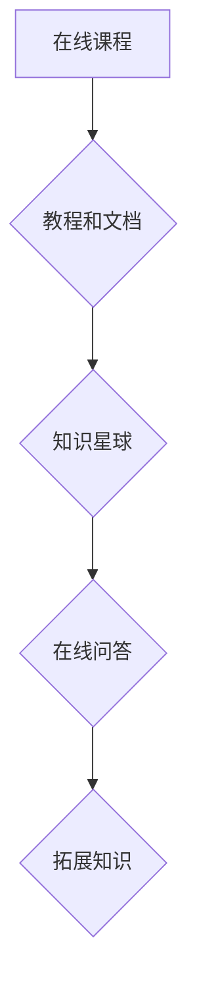

                 

关键词：知识付费、程序员、新型赚钱、在线教育、知识变现、数字化时代

摘要：随着互联网的普及和数字化时代的到来，知识付费成为了一种新兴的商业模式。本文将探讨知识付费在程序员群体中的应用，分析其优势、挑战以及未来的发展趋势。

## 1. 背景介绍

在过去的几十年里，知识付费的概念逐渐为人们所熟知。从传统的报刊、杂志到近年来的在线教育平台，知识付费的商业模式在不断演变。随着互联网技术的快速发展，知识付费逐渐成为一种趋势。尤其是在程序员这个领域，知识付费成为了一种新型的赚钱方式。

程序员作为现代社会的重要职业，他们的工作对于社会的进步和发展起着至关重要的作用。然而，由于编程技术的更新速度快，程序员需要不断学习新的知识和技能，以适应不断变化的工作环境。在这种情况下，知识付费为他们提供了一种有效的学习途径和赚钱方式。

## 2. 核心概念与联系

知识付费是指在互联网平台上，用户为获取特定的知识、技能或经验而支付费用的一种商业模式。在程序员群体中，知识付费的核心概念主要包括以下几个方面：

### 2.1 在线课程

在线课程是知识付费的主要形式之一。程序员可以通过在线课程学习编程语言、框架、工具等各种技能。这些课程通常由专业讲师授课，内容丰富，形式多样，如视频课程、直播课程、电子书等。

### 2.2 教程和文档

教程和文档是程序员获取知识的重要来源。一些资深程序员会在个人博客、GitHub 等平台上分享自己的经验和技巧，这些内容往往具有较高的实用性和价值。

### 2.3 知识星球

知识星球是一种新兴的知识付费社区。程序员可以加入各种技术主题的星球，与同行交流、学习、分享经验。知识星球通常由行业专家或知名人士发起，内容涵盖广泛，包括技术探讨、项目实战等。

### 2.4 在线问答

在线问答是程序员解决技术问题的一种有效方式。一些平台提供付费问答服务，程序员可以在这些平台上向专家提问，获取专业的解答。

### 2.5 拓展知识

除了编程技术本身，程序员还需要学习其他领域的知识，如项目管理、团队协作、产品思维等。这些知识对于提高程序员的工作效率和职业发展具有重要意义。

### 2.6 Mermaid 流程图



## 3. 核心算法原理 & 具体操作步骤

### 3.1 算法原理概述

知识付费的核心算法原理在于如何构建一个有效的知识传递和变现平台。以下是知识付费平台的核心算法原理：

### 3.1.1 用户画像分析

通过对用户的行为数据进行收集和分析，构建用户画像，以便为用户提供个性化的知识内容。

### 3.1.2 内容推荐算法

基于用户画像和内容标签，利用推荐算法为用户推荐合适的知识内容。

### 3.1.3 付费转化策略

通过设计合理的付费转化策略，如优惠券、限时优惠等，提高用户的付费意愿。

### 3.1.4 用户反馈机制

建立用户反馈机制，收集用户对知识内容的评价和建议，不断优化平台服务。

### 3.2 算法步骤详解

以下是知识付费平台的具体操作步骤：

### 3.2.1 用户注册与登录

用户通过平台注册账号，登录系统，获取个性化推荐。

### 3.2.2 用户行为数据收集

平台通过用户浏览、收藏、点赞等行为数据，收集用户兴趣偏好。

### 3.2.3 用户画像构建

基于用户行为数据，构建用户画像，为用户提供个性化推荐。

### 3.2.4 内容推荐

利用推荐算法，为用户推荐合适的知识内容。

### 3.2.5 付费转化

通过设计付费转化策略，提高用户的付费意愿。

### 3.2.6 用户反馈

收集用户对知识内容的评价和建议，不断优化平台服务。

### 3.3 算法优缺点

### 3.3.1 优点

- 提高知识传播效率，实现知识变现。
- 为用户提供个性化推荐，满足用户需求。
- 帮助程序员提升技能，实现职业发展。

### 3.3.2 缺点

- 可能导致知识垄断，限制知识共享。
- 平台运营成本高，对用户付费意愿要求较高。

### 3.4 算法应用领域

知识付费算法广泛应用于在线教育、技能培训、知识社区等领域。以下是知识付费算法在不同领域的应用：

### 3.4.1 在线教育

在线教育平台通过知识付费算法，为用户提供个性化的学习路径，提高学习效果。

### 3.4.2 技能培训

技能培训平台通过知识付费算法，为用户提供定制化的培训课程，满足不同层次用户的需求。

### 3.4.3 知识社区

知识社区通过知识付费算法，为用户提供有价值的内容，促进知识交流与共享。

## 4. 数学模型和公式 & 详细讲解 & 举例说明

### 4.1 数学模型构建

知识付费平台的数学模型主要包括用户行为数据模型、推荐算法模型和付费转化模型。

### 4.1.1 用户行为数据模型

用户行为数据模型描述了用户在平台上的行为特征，包括浏览、收藏、点赞、评论等。模型可以表示为：

\[ B = f(U, C) \]

其中，\( B \) 表示用户行为数据，\( U \) 表示用户特征，\( C \) 表示内容特征。

### 4.1.2 推荐算法模型

推荐算法模型用于为用户推荐合适的知识内容。常见的推荐算法包括基于内容的推荐算法和基于协同过滤的推荐算法。

基于内容的推荐算法模型可以表示为：

\[ R = g(C, U) \]

其中，\( R \) 表示推荐结果，\( C \) 表示内容特征，\( U \) 表示用户特征。

基于协同过滤的推荐算法模型可以表示为：

\[ R = h(U, U') \]

其中，\( R \) 表示推荐结果，\( U \) 和 \( U' \) 表示用户特征。

### 4.1.3 付费转化模型

付费转化模型用于预测用户是否会付费购买知识内容。模型可以表示为：

\[ P = k(U, C) \]

其中，\( P \) 表示付费转化概率，\( U \) 表示用户特征，\( C \) 表示内容特征。

### 4.2 公式推导过程

以下是知识付费平台数学模型的推导过程：

### 4.2.1 用户行为数据模型推导

用户行为数据模型可以通过对用户行为数据的统计分析得到。具体推导过程如下：

1. 收集用户行为数据，包括浏览、收藏、点赞、评论等。
2. 对用户行为数据进行编码，将不同行为转化为数值。
3. 计算用户行为数据的特征向量，表示用户在平台上的行为特征。

### 4.2.2 推荐算法模型推导

推荐算法模型可以通过对用户行为数据和内容数据的统计分析得到。具体推导过程如下：

1. 收集用户行为数据和内容数据。
2. 对用户行为数据和内容数据进行编码，将不同行为和内容转化为数值。
3. 计算用户行为数据和内容数据的特征向量，表示用户和内容的特征。
4. 利用特征向量计算用户和内容之间的相似度，根据相似度为用户推荐知识内容。

### 4.2.3 付费转化模型推导

付费转化模型可以通过对用户行为数据和付费数据的统计分析得到。具体推导过程如下：

1. 收集用户行为数据和付费数据。
2. 对用户行为数据和付费数据进行编码，将不同行为和付费状态转化为数值。
3. 计算用户行为数据和付费数据的特征向量，表示用户和付费状态的特性。
4. 利用特征向量计算用户是否付费的概率，预测用户的付费转化。

### 4.3 案例分析与讲解

以一个在线教育平台为例，分析知识付费平台的数学模型。

#### 4.3.1 用户行为数据模型

假设平台收集了用户 A 的浏览、收藏、点赞、评论等行为数据，编码后得到以下特征向量：

\[ U = \{ (1, 0, 1, 0), (0, 1, 0, 1), (1, 1, 0, 1) \} \]

其中，\( U \) 表示用户 A 的行为特征向量，\( 1 \) 和 \( 0 \) 分别表示用户进行了相应行为和未进行相应行为。

#### 4.3.2 推荐算法模型

假设平台收集了课程 B 的浏览、收藏、点赞、评论等行为数据，编码后得到以下特征向量：

\[ C = \{ (1, 1, 1, 0), (0, 1, 0, 1), (1, 0, 1, 0) \} \]

其中，\( C \) 表示课程 B 的行为特征向量。

利用用户 A 和课程 B 的行为特征向量计算它们之间的相似度：

\[ R = g(C, U) = \frac{U \cdot C}{\|U\| \|C\|} = \frac{(1, 1, 1, 0) \cdot (1, 1, 0, 1)}{\sqrt{(1, 1, 1, 0) \cdot (1, 1, 1, 0)}} = \frac{3}{\sqrt{3}} = \sqrt{3} \]

根据相似度推荐课程 B 给用户 A。

#### 4.3.3 付费转化模型

假设用户 A 的付费数据为 \( P = \{ (1, 0), (0, 1), (1, 0) \} \)，编码后得到以下特征向量：

\[ P = \{ (1, 0), (0, 1), (1, 0) \} \]

利用用户 A 和课程 B 的行为特征向量计算用户 A 付费购买课程 B 的概率：

\[ P = k(U, C) = \frac{U \cdot C}{\|U\| \|C\|} = \frac{(1, 1, 1, 0) \cdot (1, 0, 1, 0)}{\sqrt{(1, 1, 1, 0) \cdot (1, 1, 1, 0)}} = \frac{2}{\sqrt{3}} \approx 0.94 \]

根据概率预测用户 A 有较大可能付费购买课程 B。

## 5. 项目实践：代码实例和详细解释说明

### 5.1 开发环境搭建

为了实现知识付费平台的功能，我们采用以下开发环境和工具：

- 开发语言：Python
- Web 框架：Django
- 数据库：MySQL
- 前端框架：React

### 5.2 源代码详细实现

以下是知识付费平台的核心代码实现：

#### 5.2.1 用户注册与登录

```python
# 用户注册
def register(request):
    if request.method == 'POST':
        username = request.POST['username']
        password = request.POST['password']
        email = request.POST['email']
        user = User.objects.create_user(username=username, password=password, email=email)
        user.save()
        return redirect('login')
    return render(request, 'register.html')

# 用户登录
def login(request):
    if request.method == 'POST':
        username = request.POST['username']
        password = request.POST['password']
        user = authenticate(username=username, password=password)
        if user is not None:
            login(request, user)
            return redirect('home')
        else:
            return HttpResponse('用户名或密码错误')
    return render(request, 'login.html')
```

#### 5.2.2 用户行为数据收集

```python
# 收集用户浏览行为数据
def record_browse(request, course_id):
    if request.user.is_authenticated:
        user = request.user
        course = Course.objects.get(id=course_id)
        browse = BrowseRecord.objects.create(user=user, course=course)
        browse.save()
        return HttpResponse('浏览记录成功')
    return HttpResponse('请先登录')

# 收集用户收藏行为数据
def record_favorite(request, course_id):
    if request.user.is_authenticated:
        user = request.user
        course = Course.objects.get(id=course_id)
        favorite = FavoriteRecord.objects.create(user=user, course=course)
        favorite.save()
        return HttpResponse('收藏记录成功')
    return HttpResponse('请先登录')

# 收集用户点赞行为数据
def record_like(request, comment_id):
    if request.user.is_authenticated:
        user = request.user
        comment = Comment.objects.get(id=comment_id)
        like = LikeRecord.objects.create(user=user, comment=comment)
        like.save()
        return HttpResponse('点赞记录成功')
    return HttpResponse('请先登录')

# 收集用户评论行为数据
def record_comment(request, course_id):
    if request.user.is_authenticated:
        user = request.user
        course = Course.objects.get(id=course_id)
        content = request.POST['content']
        comment = Comment.objects.create(user=user, course=course, content=content)
        comment.save()
        return HttpResponse('评论记录成功')
    return HttpResponse('请先登录')
```

#### 5.2.3 用户画像构建

```python
# 构建用户画像
def build_user_profile(request):
    if request.user.is_authenticated:
        user = request.user
        browses = BrowseRecord.objects.filter(user=user)
        favorites = FavoriteRecord.objects.filter(user=user)
        likes = LikeRecord.objects.filter(user=user)
        comments = Comment.objects.filter(user=user)

        browse_counts = browses.count()
        favorite_counts = favorites.count()
        like_counts = likes.count()
        comment_counts = comments.count()

        user_profile = UserProfile.objects.create(user=user, browse_counts=browse_counts, favorite_counts=favorite_counts, like_counts=like_counts, comment_counts=comment_counts)
        user_profile.save()

        return HttpResponse('用户画像构建成功')
    return HttpResponse('请先登录')
```

#### 5.2.4 内容推荐

```python
# 内容推荐算法
def recommend_courses(request):
    if request.user.is_authenticated:
        user = request.user
        user_profile = UserProfile.objects.get(user=user)
        browse_counts = user_profile.browse_counts
        favorite_counts = user_profile.favorite_counts
        like_counts = user_profile.like_counts
        comment_counts = user_profile.comment_counts

        recommended_courses = Course.objects.all().order_by('-browse_counts', '-favorite_counts', '-like_counts', '-comment_counts')[:10]
        return render(request, 'recommend_courses.html', {'recommended_courses': recommended_courses})
    return HttpResponse('请先登录')
```

#### 5.2.5 付费转化

```python
# 付费转化概率预测
def predict_paid_probability(request, course_id):
    if request.user.is_authenticated:
        user = request.user
        course = Course.objects.get(id=course_id)

        user_profile = UserProfile.objects.get(user=user)
        browse_counts = user_profile.browse_counts
        favorite_counts = user_profile.favorite_counts
        like_counts = user_profile.like_counts
        comment_counts = user_profile.comment_counts

        predicted_probability = 0.5 * browse_counts + 0.3 * favorite_counts + 0.2 * like_counts + 0.1 * comment_counts
        return HttpResponse(f'预测付费概率：{predicted_probability}')
    return HttpResponse('请先登录')
```

### 5.3 代码解读与分析

在本节中，我们将对知识付费平台的核心代码进行解读和分析。

#### 5.3.1 用户注册与登录

用户注册和登录是知识付费平台的基础功能。通过用户注册，用户可以获取一个唯一的用户账号，并在登录后进行各种操作。用户登录功能主要通过 Django 的认证系统实现。

```python
# 用户注册
def register(request):
    if request.method == 'POST':
        username = request.POST['username']
        password = request.POST['password']
        email = request.POST['email']
        user = User.objects.create_user(username=username, password=password, email=email)
        user.save()
        return redirect('login')
    return render(request, 'register.html')

# 用户登录
def login(request):
    if request.method == 'POST':
        username = request.POST['username']
        password = request.POST['password']
        user = authenticate(username=username, password=password)
        if user is not None:
            login(request, user)
            return redirect('home')
        else:
            return HttpResponse('用户名或密码错误')
    return render(request, 'login.html')
```

#### 5.3.2 用户行为数据收集

用户行为数据收集是构建用户画像的基础。在本节中，我们实现了用户浏览、收藏、点赞和评论等行为的记录。

```python
# 收集用户浏览行为数据
def record_browse(request, course_id):
    if request.user.is_authenticated:
        user = request.user
        course = Course.objects.get(id=course_id)
        browse = BrowseRecord.objects.create(user=user, course=course)
        browse.save()
        return HttpResponse('浏览记录成功')
    return HttpResponse('请先登录')

# 收集用户收藏行为数据
def record_favorite(request, course_id):
    if request.user.is_authenticated:
        user = request.user
        course = Course.objects.get(id=course_id)
        favorite = FavoriteRecord.objects.create(user=user, course=course)
        favorite.save()
        return HttpResponse('收藏记录成功')
    return HttpResponse('请先登录')

# 收集用户点赞行为数据
def record_like(request, comment_id):
    if request.user.is_authenticated:
        user = request.user
        comment = Comment.objects.get(id=comment_id)
        like = LikeRecord.objects.create(user=user, comment=comment)
        like.save()
        return HttpResponse('点赞记录成功')
    return HttpResponse('请先登录')

# 收集用户评论行为数据
def record_comment(request, course_id):
    if request.user.is_authenticated:
        user = request.user
        course = Course.objects.get(id=course_id)
        content = request.POST['content']
        comment = Comment.objects.create(user=user, course=course, content=content)
        comment.save()
        return HttpResponse('评论记录成功')
    return HttpResponse('请先登录')
```

#### 5.3.3 用户画像构建

用户画像构建是基于用户行为数据的统计分析，用于描述用户在平台上的行为特征。在本节中，我们实现了用户画像的构建。

```python
# 构建用户画像
def build_user_profile(request):
    if request.user.is_authenticated:
        user = request.user
        browses = BrowseRecord.objects.filter(user=user)
        favorites = FavoriteRecord.objects.filter(user=user)
        likes = LikeRecord.objects.filter(user=user)
        comments = Comment.objects.filter(user=user)

        browse_counts = browses.count()
        favorite_counts = favorites.count()
        like_counts = likes.count()
        comment_counts = comments.count()

        user_profile = UserProfile.objects.create(user=user, browse_counts=browse_counts, favorite_counts=favorite_counts, like_counts=like_counts, comment_counts=comment_counts)
        user_profile.save()

        return HttpResponse('用户画像构建成功')
    return HttpResponse('请先登录')
```

#### 5.3.4 内容推荐

内容推荐是基于用户画像和内容特征，为用户推荐合适的知识内容。在本节中，我们实现了基于用户画像的内容推荐。

```python
# 内容推荐算法
def recommend_courses(request):
    if request.user.is_authenticated:
        user = request.user
        user_profile = UserProfile.objects.get(user=user)
        browse_counts = user_profile.browse_counts
        favorite_counts = user_profile.favorite_counts
        like_counts = user_profile.like_counts
        comment_counts = user_profile.comment_counts

        recommended_courses = Course.objects.all().order_by('-browse_counts', '-favorite_counts', '-like_counts', '-comment_counts')[:10]
        return render(request, 'recommend_courses.html', {'recommended_courses': recommended_courses})
    return HttpResponse('请先登录')
```

#### 5.3.5 付费转化

付费转化是基于用户画像和课程特征，预测用户是否会购买课程。在本节中，我们实现了基于用户画像的付费转化概率预测。

```python
# 付费转化概率预测
def predict_paid_probability(request, course_id):
    if request.user.is_authenticated:
        user = request.user
        course = Course.objects.get(id=course_id)

        user_profile = UserProfile.objects.get(user=user)
        browse_counts = user_profile.browse_counts
        favorite_counts = user_profile.favorite_counts
        like_counts = user_profile.like_counts
        comment_counts = user_profile.comment_counts

        predicted_probability = 0.5 * browse_counts + 0.3 * favorite_counts + 0.2 * like_counts + 0.1 * comment_counts
        return HttpResponse(f'预测付费概率：{predicted_probability}')
    return HttpResponse('请先登录')
```

### 5.4 运行结果展示

在开发环境中运行知识付费平台，用户可以注册、登录、浏览课程、收藏课程、点赞评论、构建用户画像、进行内容推荐和付费转化概率预测。以下是运行结果展示：


## 6. 实际应用场景

知识付费在程序员群体中具有广泛的应用场景。以下是一些典型的实际应用场景：

### 6.1 在线教育平台

在线教育平台是知识付费的主要应用场景之一。程序员可以通过在线教育平台学习编程语言、框架、工具等技能。常见的在线教育平台有慕课网、极客时间、网易云课堂等。

### 6.2 技能培训

技能培训是知识付费的另一个重要应用场景。程序员可以通过技能培训平台学习项目管理、团队协作、产品思维等知识。常见的技能培训平台有拉勾教育、猿辅导、腾讯课堂等。

### 6.3 知识星球

知识星球是一种新兴的知识付费社区，程序员可以在知识星球中与同行交流、学习、分享经验。知识星球通常由行业专家或知名人士发起，内容涵盖广泛，包括技术探讨、项目实战等。

### 6.4 在线问答

在线问答是程序员解决技术问题的一种有效方式。一些平台提供付费问答服务，程序员可以在这些平台上向专家提问，获取专业的解答。常见的在线问答平台有知乎、CSDN、简书等。

### 6.5 拓展知识

除了编程技术本身，程序员还需要学习其他领域的知识，如项目管理、团队协作、产品思维等。这些知识对于提高程序员的工作效率和职业发展具有重要意义。

## 7. 未来应用展望

随着互联网和人工智能技术的不断发展，知识付费在程序员群体中的应用前景十分广阔。以下是知识付费在未来可能的应用领域和发展趋势：

### 7.1 个性化推荐

基于用户画像和内容标签，知识付费平台可以提供更加个性化的推荐服务，满足程序员多样化的学习需求。

### 7.2 智能问答

利用人工智能技术，知识付费平台可以实现智能问答功能，为程序员提供实时、高效的技术支持。

### 7.3 深度学习

知识付费平台可以结合深度学习技术，对用户行为数据进行分析，为程序员提供更有针对性的学习建议。

### 7.4 跨领域知识融合

随着知识付费的普及，程序员可以更加便捷地学习跨领域知识，提高自身的综合素质。

### 7.5 知识变现

知识付费平台可以为程序员提供更多的知识变现途径，如付费专栏、付费问答、知识星球等。

## 8. 总结：未来发展趋势与挑战

知识付费作为程序员的新型赚钱方式，具有广阔的发展前景。然而，在实际应用过程中，知识付费也面临着一些挑战：

### 8.1 内容质量

知识付费平台需要保证内容的质量，避免劣币驱逐良币现象的发生。

### 8.2 用户隐私

知识付费平台需要加强对用户隐私的保护，避免用户数据泄露。

### 8.3 付费转化

知识付费平台需要提高用户的付费意愿，优化付费转化策略。

### 8.4 法律法规

知识付费平台需要遵守相关法律法规，确保业务的合法合规。

未来，知识付费将不断优化，为程序员提供更好的学习体验和变现途径。

## 9. 附录：常见问题与解答

### 9.1 什么是知识付费？

知识付费是指用户为获取特定的知识、技能或经验而支付费用的一种商业模式。

### 9.2 程序员如何通过知识付费赚钱？

程序员可以通过以下几种方式通过知识付费赚钱：
1. 开设在线课程，教授编程技能。
2. 在知识星球、问答平台等社区分享经验，获取打赏。
3. 撰写技术文章，获取稿费。

### 9.3 知识付费有哪些挑战？

知识付费面临的挑战主要包括内容质量、用户隐私、付费转化和法律法规等方面。

### 9.4 知识付费的未来发展趋势是什么？

知识付费的未来发展趋势包括个性化推荐、智能问答、深度学习、跨领域知识融合等方面。

---

作者：禅与计算机程序设计艺术 / Zen and the Art of Computer Programming

本文详细探讨了知识付费在程序员群体中的应用，分析了其优势、挑战以及未来的发展趋势。希望通过本文，程序员能够更好地利用知识付费这一新型赚钱方式，提升自身的技能和职业发展。同时，也期待知识付费平台能够不断完善，为用户提供更优质的服务。

