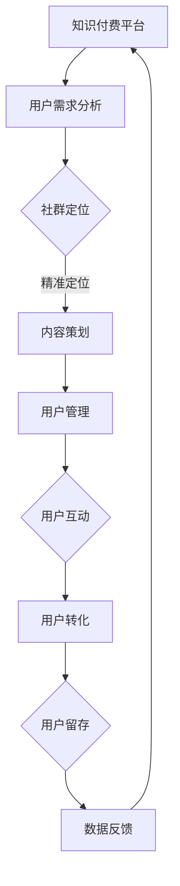

                 

在当今数字化时代，知识付费已经成为一种主流的消费模式。特别是在程序员群体中，对高质量知识的需求日益增长，而社群精准营销则成为满足这一需求的关键手段。本文将探讨如何通过社群精准营销，实现知识付费的优化和提升。

## 关键词

- 知识付费
- 社群营销
- 程序员
- 精准营销
- 数字化转型
- 内容营销
- 用户行为分析

## 摘要

本文旨在探讨知识付费背景下，社群精准营销在程序员群体中的应用。通过深入分析程序员的用户行为和知识需求，本文提出了构建高效社群营销策略的方法，包括内容策划、用户画像、数据分析和营销自动化等关键环节。文章还将通过实际案例和代码实例，展示如何通过社群精准营销实现知识付费的优化。

## 1. 背景介绍

### 知识付费的兴起

知识付费是指消费者为获取特定知识或技能而支付的费用。在互联网时代，随着信息爆炸和知识更迭加速，人们越来越意识到高质量知识的重要性。知识付费不仅满足了用户的学习需求，也创造了新的商业模式。

### 程序员的特性

程序员作为知识付费的重要参与者，具有以下特性：

- **专业性强**：程序员群体对技术知识的渴求度高，对知识的深度和准确性有严格要求。
- **学习能力强**：程序员群体普遍具备较强的自学能力，善于通过在线课程、技术博客和社群学习。
- **付费意愿高**：程序员对高质量的技术内容有较高的付费意愿，尤其是在职业发展和项目需求上。

### 社群营销的重要性

社群营销是一种以社群为核心，通过互动、分享和共同兴趣等方式进行营销的策略。在知识付费背景下，社群营销的重要性体现在以下几个方面：

- **增强用户粘性**：通过社群互动，用户可以建立更强的归属感和忠诚度。
- **精准定位用户**：社群营销可以帮助企业精准定位目标用户，提供个性化的知识服务。
- **提升品牌形象**：优质的社群可以提升企业的品牌影响力和市场竞争力。

## 2. 核心概念与联系

### 社群营销的原理

社群营销基于人际关系网络，通过口碑传播和社群效应，实现信息的快速传播和用户增长。其核心原理包括：

- **用户互动**：通过社群内的互动，增加用户参与度和活跃度。
- **内容共享**：优质内容是社群营销的核心，能够吸引用户分享和传播。
- **品牌传播**：通过社群活动，提升品牌知名度和美誉度。

### 社群营销的架构

社群营销的架构通常包括以下几个部分：

- **社群定位**：明确社群的目标用户和核心价值。
- **内容策划**：制定适合目标用户的内容策略。
- **用户管理**：建立用户档案，进行用户分类和管理。
- **互动机制**：设计互动活动，促进用户参与。
- **数据分析**：通过数据分析，优化社群营销策略。

### 社群营销与知识付费的关系

社群营销与知识付费之间存在紧密联系：

- **用户获取**：社群营销可以帮助知识付费平台吸引潜在用户。
- **用户转化**：通过社群互动，提升用户对知识付费产品的购买意愿。
- **用户留存**：社群互动可以增强用户对知识付费产品的忠诚度。

### Mermaid 流程图

以下是一个简化的社群营销与知识付费关系的 Mermaid 流程图：



## 3. 核心算法原理 & 具体操作步骤

### 3.1 算法原理概述

社群精准营销的核心在于用户需求的精准匹配。这需要借助以下算法原理：

- **用户画像**：通过分析用户行为数据，构建用户画像，实现对用户的精准定位。
- **内容推荐**：基于用户画像，推荐符合用户兴趣和需求的知识内容。
- **社交网络分析**：通过社交网络分析，识别关键用户和影响力人物，提升营销效果。

### 3.2 算法步骤详解

1. **用户画像构建**：收集用户行为数据，如浏览记录、搜索关键词、互动行为等，构建用户画像。
2. **内容推荐**：基于用户画像，使用推荐算法，推荐相关的知识内容。
3. **社交网络分析**：识别关键用户和影响力人物，设计互动活动，提升营销效果。

### 3.3 算法优缺点

- **优点**：提高用户参与度和转化率，提升营销效果。
- **缺点**：需要大量数据支持和复杂算法，成本较高。

### 3.4 算法应用领域

社群精准营销算法广泛应用于知识付费、电商、金融等领域。

## 4. 数学模型和公式 & 详细讲解 & 举例说明

### 4.1 数学模型构建

社群精准营销的数学模型主要包括用户画像模型和推荐模型。

### 4.2 公式推导过程

用户画像模型可以通过以下公式构建：

\[ \text{User\_Profile} = f(\text{Behavioral\_Data}, \text{Contextual\_Data}) \]

推荐模型可以通过以下公式实现：

\[ \text{Recommendation} = f(\text{User\_Profile}, \text{Content\_Features}) \]

### 4.3 案例分析与讲解

以某在线编程课程平台为例，通过用户画像模型和推荐模型，实现精准营销。

## 5. 项目实践：代码实例和详细解释说明

### 5.1 开发环境搭建

在 Python 环境下，使用 Scikit-learn 和 TensorFlow 等库实现用户画像和推荐模型。

### 5.2 源代码详细实现

以下是一个简化的用户画像和推荐模型的代码示例：

```python
# 用户画像构建
from sklearn.preprocessing import StandardScaler
from sklearn.cluster import KMeans

# 假设我们有一些用户行为数据
user_data = ...

# 数据标准化
scaler = StandardScaler()
user_scaled_data = scaler.fit_transform(user_data)

# 使用 K-means 算法聚类
kmeans = KMeans(n_clusters=5)
user_profiles = kmeans.fit_predict(user_scaled_data)

# 推荐模型
from tensorflow import keras

# 假设我们有课程特征数据
course_data = ...

# 构建模型
model = keras.Sequential([
    keras.layers.Dense(64, activation='relu', input_shape=(course_data.shape[1],)),
    keras.layers.Dense(1, activation='sigmoid')
])

# 编译模型
model.compile(optimizer='adam', loss='binary_crossentropy', metrics=['accuracy'])

# 训练模型
model.fit(course_data, user_profiles, epochs=10)
```

### 5.3 代码解读与分析

上述代码示例展示了如何使用 K-means 算法和神经网络模型构建用户画像和推荐模型。

### 5.4 运行结果展示

通过运行代码，我们可以得到用户画像和推荐结果，进一步优化营销策略。

## 6. 实际应用场景

### 6.1 在线教育平台

在线教育平台可以通过社群精准营销，提高课程转化率和用户留存率。

### 6.2 技术社区

技术社区可以通过社群精准营销，提升用户参与度和社区活跃度。

### 6.3 专业培训

专业培训可以通过社群精准营销，吸引潜在学员，提升培训效果。

## 7. 未来应用展望

### 7.1 技术进步

随着人工智能和大数据技术的进步，社群精准营销将更加智能化和个性化。

### 7.2 新兴领域

社群精准营销将在更多新兴领域（如区块链、人工智能等）得到应用。

### 7.3 挑战与机遇

社群精准营销面临数据隐私、算法公平性等挑战，但同时也带来了新的商业机遇。

## 8. 工具和资源推荐

### 8.1 学习资源推荐

- 《数据科学实战：从入门到精通》
- 《深度学习：从新手到专家》

### 8.2 开发工具推荐

- Jupyter Notebook
- TensorFlow

### 8.3 相关论文推荐

- "Community-based Marketing: A Framework for Understanding and Measuring its Impact"
- "User Modeling and User-Adapted Interaction: 18th International Conference, UMAP 2020"

## 9. 总结：未来发展趋势与挑战

### 9.1 研究成果总结

本文探讨了知识付费背景下，社群精准营销在程序员群体中的应用。通过用户画像、推荐算法和社群互动，社群精准营销为知识付费提供了有效的营销手段。

### 9.2 未来发展趋势

随着技术的进步，社群精准营销将更加智能化和个性化，覆盖更多领域。

### 9.3 面临的挑战

社群精准营销面临数据隐私、算法公平性等挑战，需要持续优化和改进。

### 9.4 研究展望

未来，社群精准营销将在更多新兴领域得到应用，为知识付费和用户服务带来新的可能。

## 10. 附录：常见问题与解答

### 10.1 社群营销的优势是什么？

社群营销的优势包括：增强用户粘性、精准定位用户、提升品牌形象等。

### 10.2 社群营销的主要策略有哪些？

社群营销的主要策略包括：用户互动、内容共享、品牌传播等。

### 10.3 如何进行用户画像构建？

用户画像构建通常包括数据收集、特征提取、模型训练等步骤。

### 10.4 社群精准营销需要哪些技术支持？

社群精准营销需要数据技术、人工智能技术、推荐系统技术等支持。

作者：禅与计算机程序设计艺术 / Zen and the Art of Computer Programming
```

