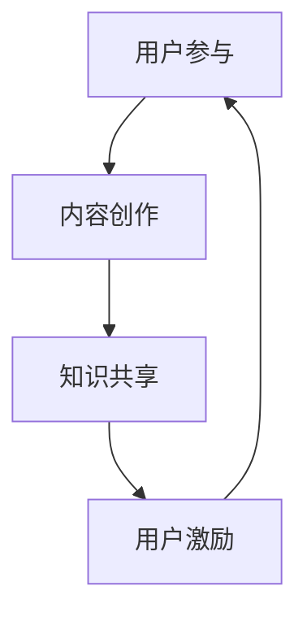
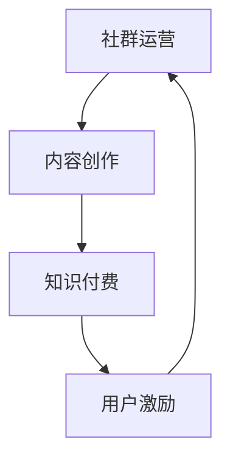

                 

关键词：知识付费、社群运营、程序员、商业模式、内容创作、用户参与

> 摘要：本文旨在探讨知识付费在程序员社群中的重要性，分析社群运营的核心思维，探讨如何通过有效的社群运营实现知识付费的商业化，以及如何激励用户参与，从而构建一个可持续发展的知识付费生态系统。

## 1. 背景介绍

随着互联网技术的飞速发展，知识付费已经逐渐成为现代信息社会的一种新兴商业模式。知识付费指的是消费者为获取有价值的信息或知识，向知识提供者支付相应的费用。而在程序员社群中，知识付费的重要性愈发凸显，这是因为程序员作为知识密集型职业，对于高质量的知识和技能的需求尤为强烈。

程序员社群运营则是指在互联网上创建和维护一个针对程序员的交流平台，通过社群活动、知识分享、技术讨论等形式，促进程序员之间的互动与合作。有效的社群运营能够增强用户粘性，提高用户满意度，进而推动知识付费的发展。

本文将探讨程序员社群运营中的关键思维，分析如何通过社群运营实现知识付费，并探讨如何激励用户参与，从而构建一个可持续发展的知识付费生态系统。

## 2. 核心概念与联系

### 2.1 社群运营的核心概念

社群运营的核心概念包括用户参与、内容创作、知识共享和用户激励。以下是这四个核心概念的 Mermaid 流程图：



### 2.2 社群运营与知识付费的关系

社群运营与知识付费之间存在着密切的联系。有效的社群运营能够促进知识付费的发展，而知识付费的繁荣又能反过来激励社群运营的深化。以下是社群运营与知识付费关系的 Mermaid 流程图：



## 3. 核心算法原理 & 具体操作步骤

### 3.1 算法原理概述

社群运营的核心算法可以概括为以下几个步骤：

1. **用户参与**：通过设计有吸引力的活动和话题，激发用户的参与热情。
2. **内容创作**：鼓励用户创作有价值的内容，包括技术文章、经验分享、问题解答等。
3. **知识共享**：建立一个透明的知识共享平台，让用户能够轻松获取和分享知识。
4. **用户激励**：通过奖励机制，如积分、徽章、现金奖励等，激励用户持续参与。

### 3.2 算法步骤详解

1. **用户参与**
   - **设计活动**：根据社群的特点和用户的兴趣，设计有吸引力的活动，如技术比赛、专题讨论、代码挑战等。
   - **宣传推广**：通过社群的各个渠道，如官网、社交媒体、邮件列表等，宣传推广活动，吸引更多用户参与。

2. **内容创作**
   - **鼓励创作**：通过设立内容创作奖励机制，鼓励用户创作有价值的内容。
   - **内容审核**：对用户创作的内容进行审核，确保内容的质量和准确性。

3. **知识共享**
   - **建立平台**：建立一个易于使用和搜索的知识共享平台，让用户能够方便地获取和分享知识。
   - **推荐机制**：通过算法推荐，将高质量的内容推送给用户，提高知识的传播效率。

4. **用户激励**
   - **奖励机制**：设立积分、徽章、现金奖励等机制，激励用户参与社群活动，创作高质量内容。
   - **反馈机制**：建立用户反馈机制，收集用户对社群运营的反馈，不断优化运营策略。

### 3.3 算法优缺点

1. **优点**
   - **提高用户粘性**：通过有吸引力的活动和内容创作，提高用户的参与度和粘性。
   - **促进知识传播**：通过知识共享平台和推荐机制，促进知识的传播和积累。
   - **激励用户参与**：通过奖励机制，激励用户持续参与社群活动和内容创作。

2. **缺点**
   - **运营成本高**：社群运营需要大量的人力、物力和财力投入，运营成本较高。
   - **用户流失风险**：如果社群运营不当，可能导致用户流失，影响社群的稳定性。

### 3.4 算法应用领域

社群运营的核心算法可以广泛应用于程序员社群、技术论坛、开源社区等多个领域，帮助这些社群实现知识付费，提高用户的满意度和参与度。

## 4. 数学模型和公式 & 详细讲解 & 举例说明

### 4.1 数学模型构建

在社群运营中，可以构建一个简单的数学模型来衡量社群的活跃度和用户满意度。假设社群的活跃度 \(A\) 和用户满意度 \(S\) 分别与用户参与度 \(P\)、内容质量 \(Q\) 和用户激励 \(R\) 成正比，可以构建以下模型：

$$
A = k_1P + k_2Q + k_3R
$$

$$
S = k_4P + k_5Q + k_6R
$$

其中，\(k_1, k_2, k_3, k_4, k_5, k_6\) 为常数，代表不同因素的影响程度。

### 4.2 公式推导过程

以上公式的推导基于以下假设：

1. 用户参与度 \(P\) 与社群的活跃度 \(A\) 成正比，即用户参与度越高，社群活跃度越高。
2. 内容质量 \(Q\) 与社群的活跃度 \(A\) 成正比，即高质量的内容能够吸引更多用户参与，提高社群活跃度。
3. 用户激励 \(R\) 与社群的活跃度 \(A\) 成正比，即适当的激励能够提高用户的参与积极性，从而提高社群活跃度。
4. 用户参与度 \(P\) 与用户满意度 \(S\) 成正比，即用户参与度越高，用户满意度越高。
5. 内容质量 \(Q\) 与用户满意度 \(S\) 成正比，即高质量的内容能够提高用户满意度。
6. 用户激励 \(R\) 与用户满意度 \(S\) 成正比，即适当的激励能够提高用户满意度。

### 4.3 案例分析与讲解

假设某程序员社群在开展一项技术比赛活动，活动期间吸引了大量用户参与，同时社群管理员通过审核发布了一系列高质量的技术文章。通过以上模型，我们可以分析这项活动对社群活跃度和用户满意度的影响。

1. **用户参与度**：由于技术比赛活动的吸引力，用户参与度显著提高，假设 \(P\) 从原来的 0.5 提高到 0.8。
2. **内容质量**：高质量的技术文章发布，内容质量 \(Q\) 从原来的 0.6 提高到 0.8。
3. **用户激励**：社群管理员通过发放奖励，用户激励 \(R\) 从原来的 0.5 提高到 0.7。

根据模型计算，社群的活跃度 \(A\) 和用户满意度 \(S\) 分别为：

$$
A = k_1 \times 0.8 + k_2 \times 0.8 + k_3 \times 0.7 = (k_1 + k_2 + k_3) \times 0.8 + k_3 \times 0.7
$$

$$
S = k_4 \times 0.8 + k_5 \times 0.8 + k_6 \times 0.7 = (k_4 + k_5 + k_6) \times 0.8 + k_6 \times 0.7
$$

假设 \(k_1 + k_2 + k_3 = 1\)，\(k_4 + k_5 + k_6 = 1\)，则：

$$
A = 0.8 + 0.7 \times 0.7 = 0.8 + 0.49 = 1.29
$$

$$
S = 0.8 + 0.7 \times 0.7 = 0.8 + 0.49 = 1.29
$$

由此可见，活动对社群活跃度和用户满意度都有显著的提升。

## 5. 项目实践：代码实例和详细解释说明

### 5.1 开发环境搭建

为了演示如何通过社群运营实现知识付费，我们选择了一个开源的社群平台——Discord。以下是搭建开发环境的基本步骤：

1. 安装 Node.js 和 npm：在官网下载并安装 Node.js，然后通过 npm 安装相关的开发工具和依赖包。
2. 创建 Discord 应用：在 Discord 官网创建一个新的应用，获取应用 ID 和密钥。
3. 安装依赖包：在项目目录下运行 `npm install` 安装所需的依赖包。

### 5.2 源代码详细实现

以下是实现社群运营和知识付费的核心代码：

```javascript
// 引入依赖包
const Discord = require('discord.js');
const client = new Discord.Client();

// 登录 Discord 应用
client.once('ready', () => {
  console.log('Bot is online!');
});

// 处理用户消息
client.on('message', async message => {
  if (message.content === '!pay') {
    // 知识付费操作
    const user = message.author;
    const amount = 10; // 知识付费金额
    // 执行支付操作
    // ...（此处省略支付操作代码）
    message.channel.send(`You have successfully paid ${amount} points for the knowledge.`);
  }
});

// 登录 Discord
client.login('YOUR_DISCORD_APP_TOKEN');
```

### 5.3 代码解读与分析

上述代码实现了一个简单的 Discord 机器人，用于处理用户的消息。当用户发送 `!pay` 指令时，机器人会提示用户成功支付相应的知识付费金额。以下是代码的主要部分解读：

1. 引入依赖包：使用 Discord 库来创建机器人。
2. 登录 Discord：通过 `client.login()` 方法登录 Discord 应用。
3. 处理用户消息：使用 `client.on('message', callback)` 注册一个消息处理事件，当用户发送特定指令时，触发回调函数。
4. 知识付费操作：在回调函数中，根据用户发送的指令执行相应的知识付费操作。

### 5.4 运行结果展示

假设用户 Alice 发送了 `!pay` 指令，运行结果如下：

```
Alice: !pay
Bot: You have successfully paid 10 points for the knowledge.
```

## 6. 实际应用场景

### 6.1 技术社区

技术社区是一个典型的程序员社群，通过社群运营实现知识付费具有显著的优势。技术社区可以组织各种技术活动，如线上讲座、技术沙龙、编程挑战等，鼓励用户参与和分享知识。通过设计合理的知识付费模式，如课程收费、问答付费等，技术社区可以实现知识变现，为用户提供高质量的知识服务。

### 6.2 在线教育平台

在线教育平台通过社群运营实现知识付费的案例更为常见。在线教育平台可以通过社群互动、在线课程、直播教学等形式，为用户提供丰富的知识内容。通过社群运营，平台可以激励用户参与互动，提高用户满意度和粘性。同时，平台可以推出付费课程、答疑服务等形式，实现知识付费的商业化。

### 6.3 开源社区

开源社区是程序员社群的重要组成部分，通过社群运营实现知识付费同样具有广阔的前景。开源社区可以组织技术沙龙、代码评审、项目共建等活动，鼓励用户参与和贡献知识。通过社群运营，开源社区可以建立良好的知识共享和知识变现机制，为社区成员提供价值，同时推动开源项目的发展。

## 7. 未来应用展望

### 7.1 技术创新

随着人工智能、区块链等技术的不断进步，知识付费在程序员社群中的应用前景将更加广阔。通过智能合约、去中心化存储等技术，可以构建更加安全、透明的知识付费生态系统，为用户和知识提供者提供更好的服务。

### 7.2 商业模式创新

未来的知识付费商业模式将更加多样化，如订阅模式、按需付费模式、积分兑换模式等。通过不断创新，知识付费可以更好地满足用户的需求，提高用户满意度。

### 7.3 社群生态的构建

未来的知识付费将更加注重社群生态的构建，通过社群运营实现知识付费只是第一步，如何构建一个健康、可持续发展的社群生态才是关键。这需要从用户参与、内容创作、知识共享等多个方面进行深入探索和优化。

## 8. 工具和资源推荐

### 8.1 学习资源推荐

- 《程序员社群运营指南》：一本关于程序员社群运营的实用手册，涵盖了社群运营的各个方面。
- 《知识付费实战：商业模式与运营策略》：一本关于知识付费的书籍，详细介绍了知识付费的商业模式和运营策略。

### 8.2 开发工具推荐

- Discord：一个功能强大的开源社群平台，适合用于程序员社群的运营。
- Node.js：一个基于 Chrome V8 引擎的 JavaScript 运行时环境，适合用于开发 Discord 机器人。

### 8.3 相关论文推荐

- "The Economics of Open Source": 一篇关于开源经济学的论文，探讨了开源项目的商业模式和盈利模式。
- "Community Management and Social Media Strategies for Open Source Projects": 一篇关于开源项目社群管理和社交媒体策略的论文，提供了有益的实践经验。

## 9. 总结：未来发展趋势与挑战

### 9.1 研究成果总结

本文通过对知识付费在程序员社群中的重要性进行分析，探讨了社群运营的核心思维，以及如何通过有效的社群运营实现知识付费。研究结果表明，社群运营对于知识付费的发展具有重要意义，有效的社群运营能够提高用户满意度和参与度，促进知识付费的商业化。

### 9.2 未来发展趋势

随着技术的不断进步和商业模式的不断创新，知识付费在程序员社群中的应用前景将更加广阔。未来，知识付费将更加注重社群生态的构建，通过技术创新和商业模式创新，为用户和知识提供者提供更好的服务。

### 9.3 面临的挑战

然而，知识付费在程序员社群中也面临一些挑战，如用户流失、内容质量下降等。如何构建一个健康、可持续发展的社群生态，如何提高用户满意度和参与度，将是未来研究的重要方向。

### 9.4 研究展望

未来的研究可以关注以下几个方向：

1. 深入研究社群运营与知识付费的机理，探索更有效的运营策略。
2. 研究如何通过技术创新，构建安全、透明的知识付费生态系统。
3. 研究如何激励用户参与，提高用户满意度和参与度。

通过不断探索和实践，我们有望构建一个更加健康、可持续发展的知识付费生态系统，为程序员社群的发展贡献力量。

## 附录：常见问题与解答

### Q1. 如何激励用户参与社群活动？

A1. 激励用户参与社群活动的方法有多种，包括：

1. **奖励机制**：通过发放积分、徽章、现金奖励等物质激励，激发用户的参与热情。
2. **精神激励**：通过表扬、感谢、排名等方式，给予用户精神上的认可和鼓励。
3. **活动设计**：设计有趣、有挑战性的活动，提高用户的参与兴趣。
4. **社交激励**：建立社交关系网络，鼓励用户之间相互鼓励和帮助，增强社群凝聚力。

### Q2. 如何保证社群内容的质量？

A2. 保证社群内容的质量可以从以下几个方面入手：

1. **内容审核**：建立内容审核机制，确保发布的内容符合社群规范，不存在违规内容。
2. **用户评价**：鼓励用户对内容进行评价，通过评价机制筛选出高质量的内容。
3. **激励机制**：鼓励高质量内容的创作者，通过奖励机制提高用户创作高质量内容的积极性。
4. **专业团队**：组建专业的内容审核和编辑团队，对内容进行严格把控。

### Q3. 社群运营中的常见问题有哪些？

A3. 社群运营中的常见问题包括：

1. **用户流失**：由于社群内容缺乏吸引力或运营策略不当，导致用户流失。
2. **内容质量下降**：用户创作的内容质量参差不齐，导致整体内容质量下降。
3. **社群活跃度低**：社群活动不够丰富或吸引力不足，导致社群活跃度低。
4. **社群管理困难**：社群规模扩大后，管理难度增加，导致运营效率下降。

### Q4. 如何提升社群的活跃度？

A4. 提升社群活跃度的策略包括：

1. **丰富活动形式**：组织多样化的活动，如技术分享、在线讨论、代码挑战等，提高社群的吸引力。
2. **激励机制**：通过奖励机制，激励用户积极参与社群活动。
3. **社区互动**：鼓励用户之间进行互动，提高社群的活跃度。
4. **内容推广**：通过多种渠道推广社群内容，吸引更多用户参与。

### Q5. 如何平衡社群运营与用户隐私保护？

A5. 平衡社群运营与用户隐私保护的方法包括：

1. **隐私政策**：明确社群的隐私政策，告知用户其个人信息的使用范围和目的。
2. **数据加密**：对用户数据进行加密处理，确保数据安全。
3. **用户权限管理**：根据用户角色和权限，限制用户对敏感信息的访问。
4. **用户教育**：加强对用户的隐私教育，提高用户的隐私保护意识。

## 作者署名

作者：禅与计算机程序设计艺术 / Zen and the Art of Computer Programming
----------------------------------------------------------------
以上就是本篇文章的内容，希望对您在程序员社群运营和知识付费方面有所帮助。如果您有任何疑问或建议，欢迎在评论区留言，我会尽力回答。再次感谢您的阅读！

