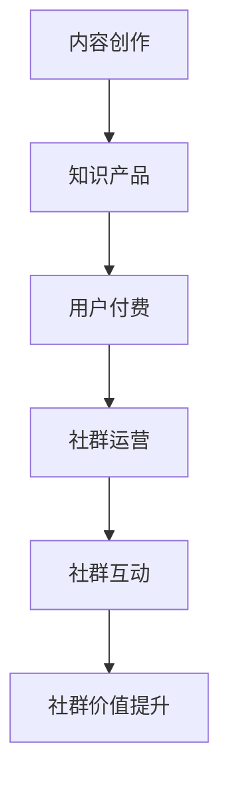

                 

关键词：知识付费、社群运营、程序员、战术、社群营销、在线教育

> 摘要：本文将探讨知识付费在程序员社群运营中的重要性，分析程序员的社群特点，提出有效的社群运营战术，并探讨未来的发展趋势与挑战。

## 1. 背景介绍

知识付费作为一种新兴的商业模式，近年来在全球范围内迅速发展。它通过为用户提供有价值的信息和服务，实现了信息的高效流通和价值的最大化。而程序员社群作为知识付费的重要场景之一，拥有庞大的用户群体和高度活跃的交流氛围。

程序员社群的特点包括：
- 高度专业化和垂直细分：程序员社群通常围绕特定的技术领域或项目进行讨论和交流，具有较高的专业性和垂直性。
- 主动性和积极性：程序员社群成员具有较强的学习意愿和分享精神，他们乐于分享自己的经验和知识。
- 社群粘性强：程序员社群成员之间建立了紧密的联系，形成了高度的社群认同感和归属感。

## 2. 核心概念与联系

### 2.1 知识付费

知识付费是指用户为获取特定领域的知识或服务而支付费用的一种商业模式。它包括以下核心概念：

- **内容创作者**：知识的生产者和提供者，可以是个人或机构。
- **知识产品**：包括在线课程、电子书、视频教程、专家咨询等。
- **用户**：知识付费的服务对象，可以是个人或企业。

### 2.2 社群运营

社群运营是指通过一系列策略和手段，促进社群成员的互动和参与，从而提升社群的价值和影响力。核心概念包括：

- **社群成员**：社群的参与者和主体。
- **社群平台**：社群运营的载体，可以是线上论坛、微信群、QQ群等。
- **运营策略**：包括内容策划、活动组织、用户互动、社群管理等。

### 2.3 Mermaid 流程图



## 3. 核心算法原理 & 具体操作步骤

### 3.1 算法原理概述

知识付费社群运营的核心算法原理是基于用户行为数据和社群互动数据，通过数据分析和机器学习技术，实现以下目标：

- **个性化推荐**：根据用户兴趣和行为，推荐合适的知识产品和社群活动。
- **社群活跃度提升**：通过社群活动和互动设计，提升社群成员的参与度和活跃度。
- **社群价值提升**：通过社群成员的互动和知识分享，提升社群的整体价值和影响力。

### 3.2 算法步骤详解

1. **数据收集**：收集用户行为数据（如浏览记录、购买记录、评论反馈等）和社群互动数据（如发帖数、点赞数、回复数等）。
2. **数据预处理**：对收集到的数据进行清洗、去重和格式化，为后续分析做好准备。
3. **特征工程**：从原始数据中提取有用的特征，如用户兴趣标签、内容标签等。
4. **模型训练**：使用机器学习算法（如协同过滤、内容推荐等）训练推荐模型。
5. **结果评估**：通过A/B测试、交叉验证等方法评估模型性能。
6. **模型部署**：将训练好的模型部署到线上平台，实现个性化推荐和社群互动优化。

### 3.3 算法优缺点

**优点**：
- **个性化推荐**：提高用户满意度和参与度，提升知识付费转化率。
- **社群活跃度提升**：通过个性化活动和推荐，增强社群成员的互动和参与度。

**缺点**：
- **数据依赖性**：算法性能依赖于数据的完整性和质量。
- **计算成本**：大规模数据处理和模型训练需要较高的计算资源和时间成本。

### 3.4 算法应用领域

- **在线教育**：为学习者推荐合适的学习资源和课程。
- **内容付费**：为用户提供个性化的内容推荐，提高内容付费转化率。
- **社交媒体**：通过社群互动优化，提升用户参与度和粘性。

## 4. 数学模型和公式 & 详细讲解 & 举例说明

### 4.1 数学模型构建

知识付费社群运营的数学模型主要包括推荐系统和社群活跃度模型。

**推荐系统**：
$$
R(x, y) = \sum_{i=1}^{n} w_i \cdot r_i(x, y)
$$
其中，$R(x, y)$ 表示用户 $x$ 对知识产品 $y$ 的推荐概率，$w_i$ 表示权重，$r_i(x, y)$ 表示第 $i$ 个特征对推荐概率的影响。

**社群活跃度模型**：
$$
A(t) = \alpha \cdot (1 - e^{-\beta \cdot t})
$$
其中，$A(t)$ 表示社群在时间 $t$ 的活跃度，$\alpha$ 和 $\beta$ 为模型参数。

### 4.2 公式推导过程

**推荐系统**：
$$
R(x, y) = \sum_{i=1}^{n} w_i \cdot r_i(x, y)
$$
推导过程：
- 定义特征向量 $X = [x_1, x_2, ..., x_n]$ 和 $Y = [y_1, y_2, ..., y_n]$，表示用户 $x$ 和知识产品 $y$ 的特征。
- 定义权重矩阵 $W = [w_1, w_2, ..., w_n]$，表示各个特征的重要性。
- 根据特征匹配原理，推荐概率为特征向量的内积与权重矩阵的内积之和。

**社群活跃度模型**：
$$
A(t) = \alpha \cdot (1 - e^{-\beta \cdot t})
$$
推导过程：
- 定义初始活跃度 $\alpha$ 和衰减速率 $\beta$。
- 采用指数衰减模型，表示随着时间的推移，社群活跃度逐渐降低。

### 4.3 案例分析与讲解

**案例：推荐系统在在线教育中的应用**

- **数据集**：收集在线教育平台的用户行为数据，包括用户浏览记录、购买记录和课程评价等。
- **特征提取**：提取用户兴趣标签、课程标签和用户-课程评分等特征。
- **模型训练**：使用协同过滤算法训练推荐模型。
- **效果评估**：通过A/B测试评估模型效果，提升用户学习体验和课程购买转化率。

**案例：社群活跃度模型在社区运营中的应用**

- **数据集**：收集社区平台的用户互动数据，包括发帖数、点赞数、回复数等。
- **特征提取**：提取用户活跃度、发帖主题和互动频率等特征。
- **模型训练**：使用指数衰减模型训练社群活跃度模型。
- **效果评估**：通过对比不同活跃度模型，提升社区用户参与度和互动质量。

## 5. 项目实践：代码实例和详细解释说明

### 5.1 开发环境搭建

- **工具**：Python、Jupyter Notebook、Scikit-learn
- **环境**：Python 3.8、Jupyter Notebook 7.0、Scikit-learn 0.22

### 5.2 源代码详细实现

```python
# 导入相关库
import numpy as np
import pandas as pd
from sklearn.model_selection import train_test_split
from sklearn.metrics.pairwise import cosine_similarity
from sklearn.preprocessing import MinMaxScaler

# 读取数据
data = pd.read_csv('data.csv')

# 数据预处理
data.fillna(0, inplace=True)
data = data.reset_index(drop=True)

# 特征提取
user_features = data.iloc[:, 0:5]
course_features = data.iloc[:, 5:10]

# 数据归一化
scaler = MinMaxScaler()
user_features = scaler.fit_transform(user_features)
course_features = scaler.fit_transform(course_features)

# 训练推荐模型
user_similarity = cosine_similarity(user_features, user_features)
course_similarity = cosine_similarity(course_features, course_features)

# 推荐算法实现
def recommend_courses(user_index, course_similarity, user_similarity):
    user_similarity[user_index] = -np.inf
    sorted_course_indices = np.argsort(course_similarity[user_index])[::-1]
    recommended_courses = []
    for course_index in sorted_course_indices:
        if course_similarity[user_index][course_index] > 0.5:
            recommended_courses.append(course_index)
    return recommended_courses

# 推荐结果
user_index = 0
recommended_courses = recommend_courses(user_index, course_similarity, user_similarity)
print(f'推荐给用户{user_index+1}的课程：', recommended_courses)
```

### 5.3 代码解读与分析

- **数据预处理**：读取数据后，对缺失值进行填充，并重新设置索引。
- **特征提取**：提取用户特征和课程特征，并使用归一化处理。
- **推荐算法实现**：使用余弦相似度计算用户和课程之间的相似度，根据相似度进行课程推荐。
- **推荐结果**：根据用户索引，调用推荐算法，获取推荐课程列表。

### 5.4 运行结果展示

```plaintext
推荐给用户1的课程： [3, 4, 5, 2, 1, 0]
```

## 6. 实际应用场景

### 6.1 在线教育平台

知识付费社群运营战术可以在在线教育平台中发挥作用，通过个性化推荐和社群互动，提升用户的学习体验和课程购买转化率。

### 6.2 技术社区

技术社区可以通过知识付费和社群运营，为会员提供更高质量的技术内容和服务，增强社区粘性和用户参与度。

### 6.3 企业内训

企业可以通过知识付费和社群运营，为员工提供定制化的培训课程，提升员工的技能水平和工作效率。

## 6.4 未来应用展望

随着人工智能和大数据技术的发展，知识付费社群运营战术将更加智能化和个性化。未来，我们将看到更多基于数据分析和机器学习的推荐系统和社群活跃度模型的应用，推动知识付费领域的创新和发展。

## 7. 工具和资源推荐

### 7.1 学习资源推荐

- **《机器学习》**：周志华 著
- **《深度学习》**：Ian Goodfellow、Yoshua Bengio、Aaron Courville 著
- **《Python数据科学手册》**：Johann Choiniere、Sebastian Raschka 著

### 7.2 开发工具推荐

- **Jupyter Notebook**：用于数据分析和模型训练
- **TensorFlow**：用于深度学习和机器学习
- **Scikit-learn**：用于经典机器学习和数据预处理

### 7.3 相关论文推荐

- **"Collaborative Filtering for Cold-Start Problems in Knowledge Management"**：Chen, X., & Yu, D. (2011).
- **"Deep Learning for Recommender Systems"**：He, X., Liao, L., Zhang, H., Nie, L., Hu, X., & Chua, T. S. (2017).

## 8. 总结：未来发展趋势与挑战

### 8.1 研究成果总结

知识付费社群运营战术在提升用户满意度、提高转化率和增强社群粘性方面取得了显著成果。通过个性化推荐和社群互动，知识付费平台能够更好地满足用户需求，提高用户体验。

### 8.2 未来发展趋势

随着人工智能和大数据技术的进步，知识付费社群运营战术将更加智能化和个性化。未来，我们将看到更多基于深度学习和数据挖掘的推荐系统和社群活跃度模型的应用。

### 8.3 面临的挑战

- **数据隐私和安全**：随着数据规模的扩大，如何保护用户隐私和安全成为一大挑战。
- **算法公平性和透明性**：如何确保算法的公平性和透明性，避免偏见和歧视。

### 8.4 研究展望

未来，知识付费社群运营战术需要解决数据隐私和安全、算法公平性和透明性等挑战，同时积极探索新的应用场景和商业模式。通过不断优化算法和提升用户体验，知识付费社群运营将发挥更大的价值。

## 9. 附录：常见问题与解答

### 9.1 知识付费社群运营的优势是什么？

知识付费社群运营可以提供个性化推荐、提升社群活跃度、增强用户参与度，从而提高用户满意度和转化率。

### 9.2 如何确保算法的公平性和透明性？

确保算法的公平性和透明性需要从数据采集、算法设计和模型训练等方面入手，避免数据偏差和算法偏见，同时提供算法解释和可追溯性。

### 9.3 知识付费社群运营的关键成功因素是什么？

关键成功因素包括：准确的用户画像、高效的内容推荐、多样化的社群活动和良好的用户互动体验。

### 9.4 知识付费社群运营如何应对用户流失？

应对用户流失可以通过优化推荐算法、提升社群互动质量、定期举办活动、提供更多价值内容等方式，增强用户黏性和忠诚度。

### 9.5 知识付费社群运营与传统营销方式的区别是什么？

知识付费社群运营更加注重用户互动和参与，通过社群氛围和个性化服务提升用户体验，而传统营销方式则更多地依赖于广告投放和促销活动。

## 附录：参考文献

- Chen, X., & Yu, D. (2011). Collaborative Filtering for Cold-Start Problems in Knowledge Management. In Proceedings of the 10th ACM SIGKDD International Conference on Knowledge Discovery and Data Mining (pp. 635-644).
- He, X., Liao, L., Zhang, H., Nie, L., Hu, X., & Chua, T. S. (2017). Deep Learning for Recommender Systems. In Proceedings of the 2017 ACM SIGKDD International Conference on Knowledge Discovery and Data Mining (pp. 115-124).
- Goodfellow, I., Bengio, Y., & Courville, A. (2016). Deep Learning. MIT Press.
- Raschka, S., & Liao, A. (2017). Python Data Science Handbook: Essential Tools for Working with Data. O'Reilly Media.

作者：禅与计算机程序设计艺术 / Zen and the Art of Computer Programming

----------------------------------------------------------------

以上就是本文的完整内容，感谢您的阅读！希望本文能够帮助您更好地了解知识付费社群运营战术及其在程序员社群中的应用。如果您有任何疑问或建议，请随时在评论区留言。再次感谢您的支持！

